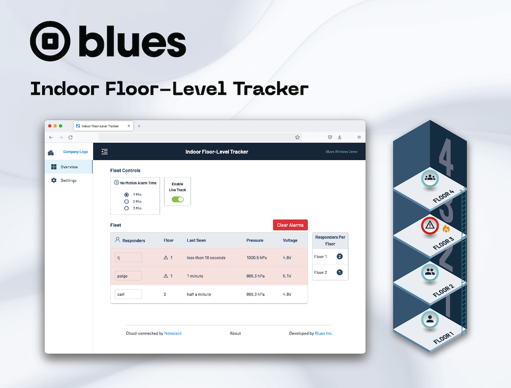
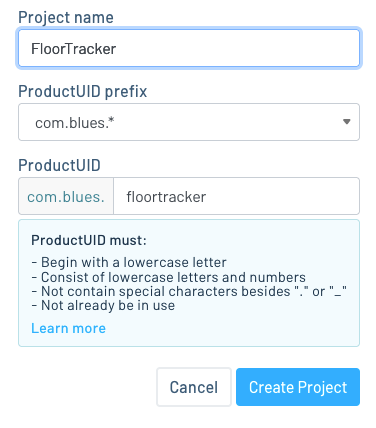
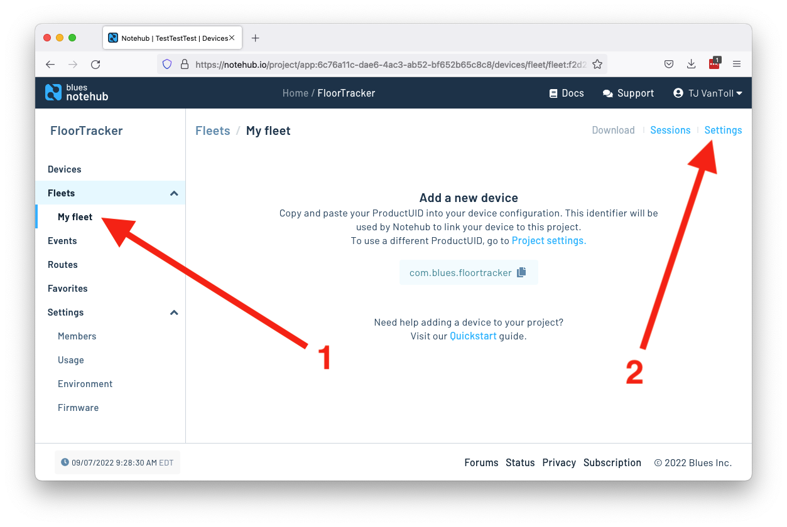

# Indoor Floor-Level Tracker

A highly accurate floor-level tracker for response teams at emergency events.

To run this project yourself you’ll need to:

* [Configure Notehub](#notehub).
* [Purchase the necessary hardware](#hardware).
* [Flash the project’s firmware](#firmware).
* [Run the project’s web application](#web-application).

## Notehub

The Indoor Floor-Level Tracker runs on top of Notehub. As such, to run this sample
you’ll need to create a Notehub account, start a new Notehub project, and configure
a handful of environment variables.

### Creating a New Project

1. Sign up for a free [Notehub](https://notehub.io) account, if you don’t have one
already.
1. Click the blue **Create Project** button in the top-right corner of the screen.
1. Give the project a name, such as “FloorTracker”, and then click the next
**Create Project** button.

### Configuring Environment Variables

The Indoor Floor-Level Tracker uses [environment variables](https://dev.blues.io/guides-and-tutorials/notecard-guides/understanding-environment-variables/)
for storing project settings that need to be shared and synchronized across
devices.

For this project all environment variables need to be set up at the [fleet](https://dev.blues.io/reference/glossary/#fleet)
level, allowing you to configure different settings on different groups of
devices, if necessary.

Notehub creates an initial fleet for you when you start a new project, and you
can use that for setting your initial variables.

1. Navigate to your fleet in the navigation menu, and then click the **Settings**
link.

1. Click the **Environment** tab.
1. Scroll down to the **Fleet environment variables** heading, and define the
four variables below.
    1. `baseline_floor`: (integer) The floor a device is at when starting up. `1` is
    a good default, and only needs to be overrode if starting up devices when not at
    ground level.
    1. `floor_height`: (number) An optional height (in meters) of the floors in the
    current building. If not provided or blank, the firmware uses a default value.
    1. `live`: (bool) Whether devices should actively be tracking and reporting. You’ll
    want to set this to `false` until you’re ready to start testing.
    1. `no_movement_threshold`: (number) The number of minutes to allow before firing
    an alarm if a device has not moved floors.
1. With all four defined, click the blue **Save** button.

With this your Notehub backend is fully configured, and you’re ready to start
setting up your hardware.

## Hardware

The following hardware is required to run the Indoor Floor-Level Tracker.

* [Blues Starter Kit](https://shop.blues.io/collections/blues-starter-kits)
* [BMP581](https://www.sparkfun.com/products/20170)
* [Qwiic Cable](https://www.sparkfun.com/products/14427)

The Notecard, Swan microcontroller, Molex antenna, and BMP581 all connect
to Notecarrier-F as shown in the image below.

> **NOTE**: For a detailed look at how to connect the hardware, refer to the
[Notecard and Notecarrier-F quickstart guide](https://dev.blues.io/quickstart/notecard-quickstart/notecard-and-notecarrier-f/).

With the hardware assembled you next need to get the project’s firmware
running on your device.

## Firmware

The Indoor Floor-Level Tracker project has custom firmware that runs on
the Swan. As a next step, complete the [firmware’s setup guide](firmware/)
to get your firmware up and running.

## Web Application

The Indoor Floor-Level Tracker’s web application allows you to view device data and 
manage environment variables in a browser.

As a final step, complete the [web app’s setup guide](web-app/) to get the
app running on your development machine.
