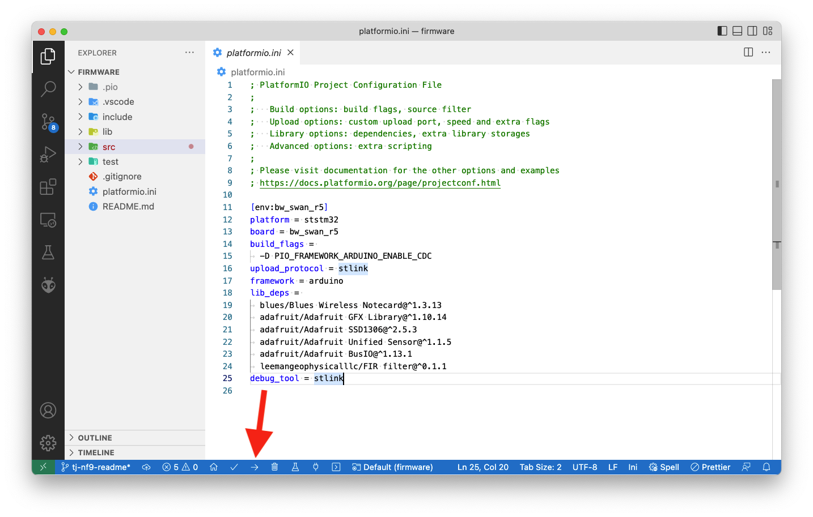

# Indoor Floor-Level Tracker Firmware

The Indoor Floor-Level Tracker’s firmware is built with [Platform.io](https://platformio.org/) 
as an Arduino application. To run the firmware, start by ensuring you have 
the prerequisites below installed.

## Prerequisites

1. Download and install [Visual Studio Code](https://code.visualstudio.com/).
1. Install the [PlatformIO IDE extension](https://marketplace.visualstudio.com/items?itemName=platformio.platformio-ide)
via the Extensions menu of Visual Studio Code.

## Opening

Once you have Visual Studio Code and the PlatformIO extension installed, you next need
to open the firmware within PlatformIO.

1. Download or clone this repository, so that you have a copy of the firmware source
code locally.
1. Open the PlatformIO extension by clicking on the PlatformIO logo in the menu bar. Next,
click the “Open” option under the “PIO Home” menu  and finally “Open Project”.

1. Select the `firmware` folder from within your local copy of this repository,
and click the **Open "firmware"** button.

## Flashing

With the firmware project open, you can now make any changes you’d like to the firmware
source code, and then flash the firmware to your device.

Complete the following steps to upload firmware in in PlatformIO.

1. Connect your Swan to your computer using [these steps](https://dev.blues.io/quickstart/swan-quickstart/#programming-swan-platformio).

> **NOTE**: The project’s default configuration assumes you’re using an
[STLINK-V3MINI programmer and debugger](https://shop.blues.io/products/stlink-v3mini).
If you’re not, make sure to open your `platformio.ini` file and change the `upload_protocol`
to `dfu`.

2. Once you have everything connected, click the arrow button that appears at the
bottom of your Visual Studio Code window.

Once the firmware is running on your device, you might additionally want to open a serial
monitor to view the firmware’s logs. You can do so by clicking the plug button that appears
at the bottom of your Visual Studio Code window.

## Testing

The firmware has both an idle mode and a live mode, which you can control with your fleet’s
`live` environment variable.

When in idle mode (`live: false`) the firmware monitors for environment variable changes,
but does not read from the sensor or send readings.

When in live mode (`live: true`) the firmware constantly reads the pressure level on the
BMP581 and immediately sends a note under the following conditions.

* **The floor level changes.** If the firmware determines a device has changed floors, it
sends a `floor.qo` note.
* **The no-movement threshold has been surpassed.** If the firmware determines a device has
not changed floors in the interval configured by the `no_movement_threshold` environment
variable, it sends an `alarm.qo` note.

Once you have the firmware running, you may want to change the fleet’s `live` environment
variable to `true` to test floor changing and the alarm logic. You will likely also want
to attach a LiPo battery to the Notecarrier-F so you take your hardware away from your
computer for testing.

When you are testing you can manually view events as they come in on Notehub, but it’s
far easier to monitor your devices in this project’s web application.