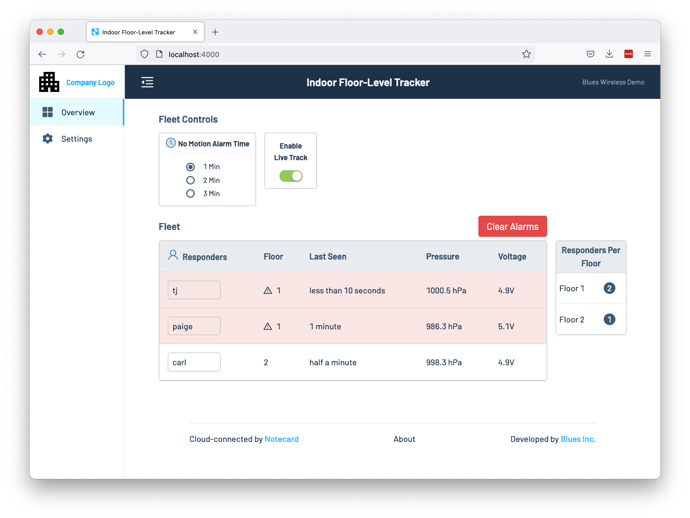

# Indoor Floor-Level Tracker Web App

The Indoor Floor-Level Tracker’s web application allows you to view device data and
manage environment variables in a browser.

To get started, make sure you have a copy of this project’s repository locally,
then open up the `01-indoor-floor-level-tracker/web-app` folder in your text editor or
IDE, and then complete the following steps.

- [Dependencies](#dependencies)
- [Configuration (Environment Variables)](#configuration-environment-variables)
- [Development](#development)

> **NOTE**: The Indoor Floor-Level Tracker’s web app uses the [Notehub API](https://dev.blues.io/guides-and-tutorials/using-the-notehub-api/)
> to retrieve event data, which consumes [Notehub consumption credits](https://blues.io/pricing/).
> You can change how frequently the app refreshes data from Notehub by altering
> the `MS_REFETCH_INTERVAL` constant in the [`src/pages/index.tsx`](src/pages/index.tsx)
> file.

## Dependencies

### (Recommended) Visual Studio Code Dev Container

[Visual Studio Code](https://code.visualstudio.com/) (VS Code) can quickly create a
["Dev Container"](https://code.visualstudio.com/docs/remote/containers) on Windows,
Mac, or Linux. To use this workflow **you must install both VS Code and Docker**, if
you haven’t already.

- [Install VS Code](https://code.visualstudio.com/)
- [Install Docker](https://docs.docker.com/get-docker/)

Before continuing, additionally make sure Docker is running, which you can do by
checking the following.

- **Windows**: Check for the docker (whale) icon in the system tray.
- **Linux/Mac**: Run the command `docker run hello-world` from your terminal. If everything
  is working correctly you’ll see a confirmation message.

With Docker running, next open your web application in VS Code. Once you do, you will see
boxes that prompt you to install the extension **Remote - Containers**, and then to “Reopen
in Container”. Do both.


The Dev Container will automatically install Linux and the project dependencies,
no matter which kind of operating system your development machine uses.

As a final step, open a terminal in VS Code, as you’ll need it to run commands
throughout the rest of this guide. You can open a terminal by clicking the
**Terminal** menu at the top of VS Code, and then selecting **New Terminal**.

### (Not Recommended) Dependencies without VS Code

If you choose **not** to use a Dev Container in VS Code, you can install the
project dependencies as follows.

Blues reference web apps use [Node.js](https://nodejs.org/en/) as a
runtime, [Yarn](https://yarnpkg.com/) as a package manager, and
[Volta](https://volta.sh/) as a way of enforcing consistent versions of all
JavaScript-based tools. You can install these dependencies by completing the
steps below.

1. Install Volta by following its installation
   [instructions](https://docs.volta.sh/guide/getting-started).
2. Run the command below in a terminal to install the appropriate versions of
   both Node.js and Yarn.
   ```
   volta install node yarn
   ```
3. Navigate to the root of the web app in your terminal or
   command prompt and run `yarn install`, which installs the starter’s npm
   dependencies.
   ```
   yarn install
   ```
4. Install the [PostgreSQL](https://www.postgresql.org/download/) database engine.

## Configuration (Environment Variables)

Blues reference web apps use a series of environment variables to store
project-specific configuration. You _must_ define your own values for these
variables for the web app to run. You can complete the following
steps to do so.

1. Create a new `.env` file in the root folder of your project.
1. Copy the contents of your web app’s `.env.example` file, and paste
   it in your new `.env` file.
1. Change the required values in your `.env` to your own values using the steps
   below.

### HUB_CLIENT_ID and HUB_CLIENT_SECRET

Blues reference web apps need access to your Notehub project in order to
access the Notehub API. A **client ID** and **client secret** unique to each Notehub user and Notehub project are used to generate an OAuth bearer token which is sent along with every request to the Notehub API.

To generate an authentication token, you'll need to supply a `client_id` and `client_secret` for the project in your `.env` file. You can follow these [instructions](https://dev.blues.io/reference/notehub-api/api-introduction/#authentication-with-oauth-bearer-tokens) to access a `client_id` and `client_secret` for your Notehub project.

Copy the values for each variable and set the appropriate environment variable in `.env`, e.g.

```
HUB_CLIENT_ID=3c0df26d-f9f4-4fd4-8a8d-847149a35790
HUB_CLIENT_SECRET=f7cfa681e4f471186fbd0bcf0abae08d4b5966d4afb1056f2355293df64d3aaa
```

### HUB_PROJECT_UID

This is the unique identifier for your project in Notehub, and has the prefix `app:`.
You can find this by going to your Notehub project, clicking the **Settings** menu,
and finding the **Project Information** heading which contains **Project UID**. Click
the copy icon to copy this to the clipboard.

```
HUB_PROJECT_UID=app:245dc5d9-f910-433d-a8ca-c66b35475689
```

### HUB_FLEET_UID

The unique identifier for your device fleet in Notehub, and has the prefix `fleet:`.

You can find this by opening your Notehub project, navigating to your project’s
fleet you set up earlier, and finding your fleet’s UID in that fleet’s settings.
Copy this UID, and paste it in your `.env` file (replacing the `fleet:0000...`
placeholder.)


```
HUB_FLEET_UID=fleet:00000000-0000-0000-0000-000000000000
```

## Development

With all dependencies now set up, you’re ready to run the web app. All Blues reference
web apps use the [Next.js](https://nextjs.org/) web
framework to serve React-powered web pages and HTTP JSON APIs. You can start a
Next.js development server using `yarn dev`.

```
yarn dev
```

With the development server running, open <http://localhost:4000> in your web
browser to see your application.



Next.js automatically watches your project’s files, and updates your application
as you make changes. To try it, open your app’s `src/pages/index.tsx` file, make
a change, save the file, and notice how your browser automatically updates with
the change.

> **NOTE**: Changes to `.env` are **not** automatically reloaded, and require you
> to stop the `yarn dev` with `ctrl+c` and to start `yarn dev` back up.
