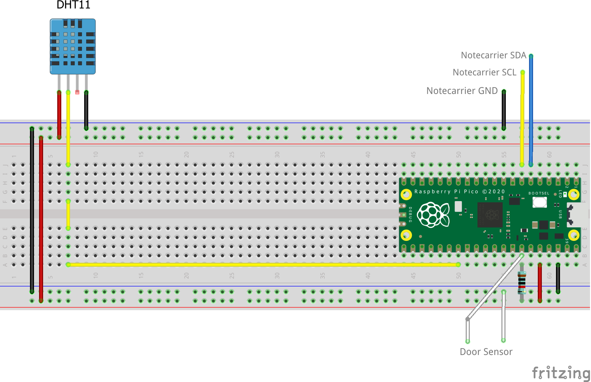
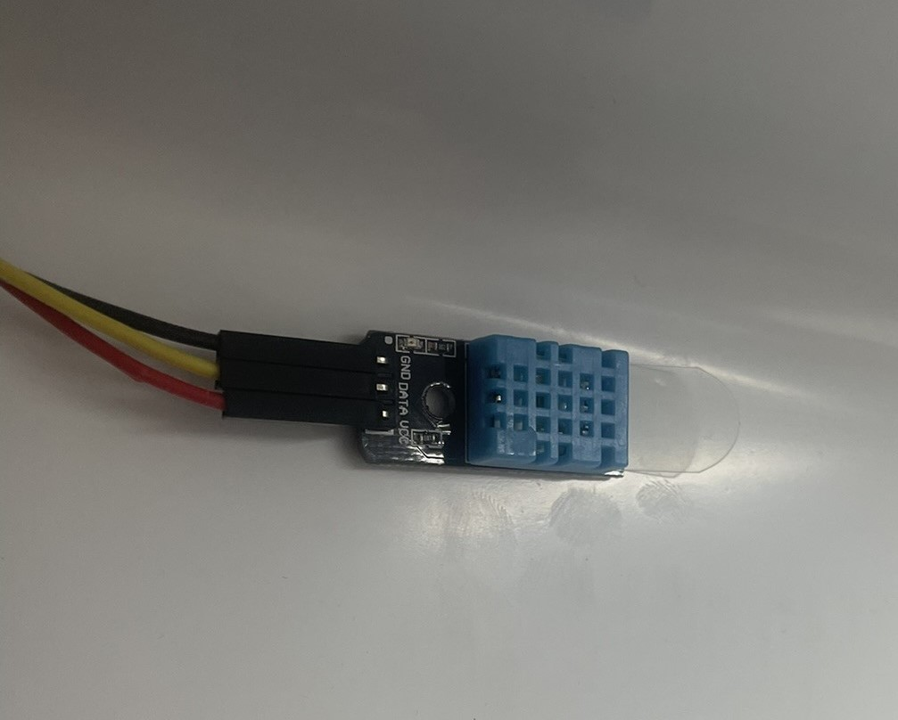
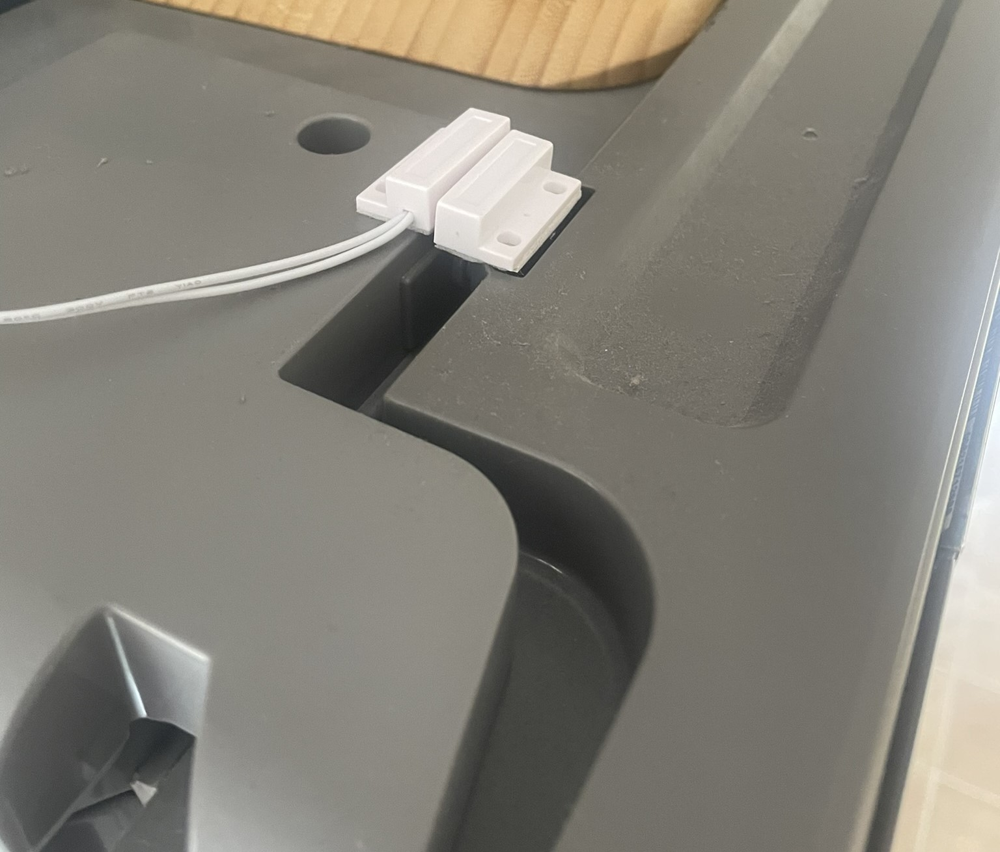
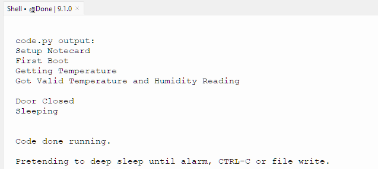

# Fridge Fleet Monitor
LoRa-based temperature, humidity and door open/close state for a fleet of refrigerators.

To run this project yourself you'll need to:

* [Purchase the necessary hardware and configure it](#hardware).
* [Flash the project's firmware](#firmware).
* [Install the hardware](#hardware-installation).
* [Run the project's web application](#web-application).

## Hardware 

The following hardware is required to run the Fridge Fleet Monitor.

* [Blues Starter Kit for LoRaWAN](https://shop.blues.com/products/blues-starter-kit-lorawan)
* [Raspberry Pi Pico](https://www.adafruit.com/product/4864)
* [Adafruit magnetic contact switch (door sensor) x 2](https://www.adafruit.com/product/375)
* [DHT-11 Temperature and Humidity Sensor](https://www.amazon.com/SHILLEHTEK-Temperature-Humidity-Sensor-Module/dp/B0CN5RP8SL)
* 10k Resistor

## LoRa Gateway Setup

Before you can use the Notecard LoRa you need to have a LoRaWAN gateway that is provisioned to The Things Network.  To make this easy you can setup the [Blues Indoor LoRaWAN Gateway](https://shop.blues.com/products/blues-starter-kit-lorawan).  To get this set up follow the [setup instructions](https://dev.blues.io/lora/connecting-to-a-lorawan-gateway/)

## Firmware

This project runs on CircuitPython so you need to install it onto your Raspberry Pi Pico.  Follow the instructions from Adafruit: [Installing CircuitPython](https://learn.adafruit.com/getting-started-with-raspberry-pi-pico-circuitpython/circuitpython)

Once this is installed, the Pico will present as a mass storage device that you can install libraries and firmware onto.  First install the [note-python](https://dev.blues.io/tools-and-sdks/firmware-libraries/python-library/#circuitpython-and-micropython) library, and then the [Adafruit CircuitPython DHT Library](https://github.com/adafruit/Adafruit_CircuitPython_DHT).

Finally update the ProductUID value in code.py from the code repository and copy it onto the Pico.

## Hardware Setup

Place your Raspberry Pi on a breadboard, with the USB socket sticking out to the right.  Make the following connections:

Pico Power:

    GND on Pico (Pin 38) to Breadboard Ground Rail
    3V3 OUT on Pico (Pin 36) to Breadboad +VE Rail

Door Sensor:

    GP28 on Pico (Pin 34) to 10K Resistor
    10K resistor to Breadboard +VE Rail
    GP28 on Pico (Pin 34) to Magnetic Door Sensor
    GND Rail on Breadboard to Magnetic Door Sensor

DHT11 Sensor:

    DHT11 may have 3 or 4 pins.  If there is 4, one is left disconncted.
    DHT11 Data Pin to Pico GP22 (Pin 29)
    DHT11 GND Pin to Breadboad GND Rail
    DHT11 VDD Pin to Breadboard +VE Rail

Notecarrier:

    Notecarrier can be connected with a Qwiic cable.
    Qwiic Black (GND) to Breadboard GND Rail
    Qwiic Blue (SDA) to  Pico GP4 (Pin 6)
    Qwiic Yellow (SCL) to Pico GP5 (Pin 7)

Do not connect the Red cable of the Qwiic connector.  If you wish to power the Pico from the Notecarrier (which makes sense after testing) connect VMAIN on the Notecarrier to VSYS (Pin 39) on the Pico.

See the image below for a diagram of the connections required.

_Breadboard Connections_

## Hardware Instalation

With the hardware assembled and the proper code on the Pico, attach the temperature sensor inside the fridge you wish to monitor.  Be careful to route the wires so they do not affect the seal of the door.

To attach the sensor inside the fridge, use Command Strips or some other adhesive strip attached to the back of the sensor, and wipe down the area to place with node with rubbing alcohol prior to attaching for best adhesion.

_DHT11 Sensor installed in a refrigeration unit._

Likewise, to install the door sensors, attach each piece of the sensor on one side of the door via Command Strips and ensure they line up as closely as possible. See the image below.

## Testing

Ensure your Notecarrier is powered with a battery or via a USB power supply.

Connect the Raspberry Pi Pico to your computer with a USB Cable, ensuring you have no power cable between the Notecarrier and the Pico to prevent damage.

Open a Serial Terminal Emulator to view the log output from the Pico Code
You should see output similar to below:

Open the fridge door.  In the console you should see the message 'Door Wakeup. Door Value: True' and 'Door Open'.  In addition, you should see an event in the Blues Notehub with a filename of `door.qo` with the body of `{'open':true}`

Close the fridge door. In the console you should see the message 'Door Closed'.  In addition, you should see an event in the Blues Notehub with a filename of `door.qo` with the body of `{'closed':true}`

Aditionally you should also see an event in Notehub with the filename of `readings.qo` and the body similar to `{"humidity":48,"temperature":22}`. This is the relative humidity percentage and the temperature in celcius.  This event should be sent by default every 60 minutes.

## Further Development

If you wish to develop this project further, here are some suggestions.

Firstly, the DHT11 sensor is cheap and accessable, but not nescarcellary the most accurate.  Consider replacing it with another, for example the BME280 which connects via I2C, so will share the same connections as the Notecarrier, and there is a [CircutPython Library available as well](https://docs.circuitpython.org/projects/bme280/en/latest/)

Secondly, a great addition to the functionality would be to add an note to be sent if the fridge door is left open for a configurable time.  I will leave this as an exercise to the user on how to add this feature, but it should be quite simple with the existing code.

## Blues Community

We’d love to hear about you and your project on the [Blues Community Forum](https://discuss.blues.io/)!

## Additional Resources

* [DHT11 Datasheet](https://www.mouser.com/datasheet/2/758/DHT11-Technical-Data-Sheet-Translated-Version-1143054.pdf)
* [DHT11 Library](https://github.com/BoschSensortec/BMA400-API)
* [Using Raspberry Pi Pico with Blues Notecard](https://dev.blues.io/blog/getting-started-with-raspberry-pi-pico-and-blues-notecard/)
