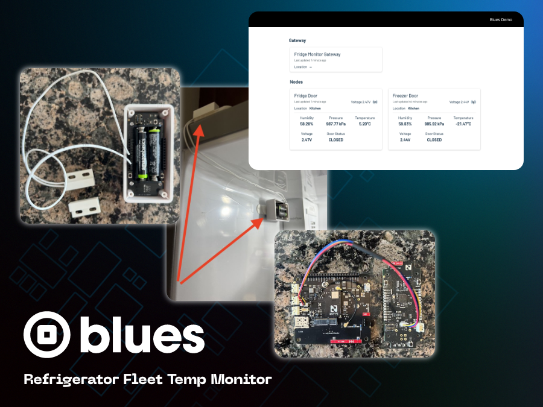
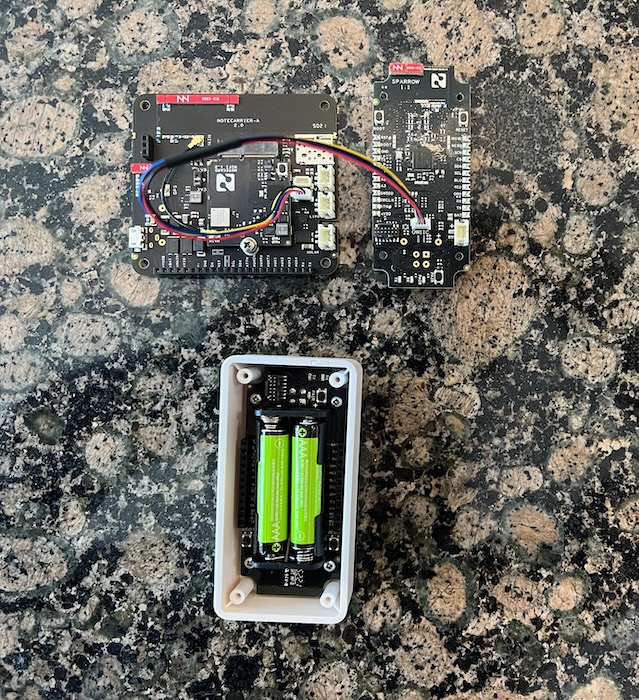
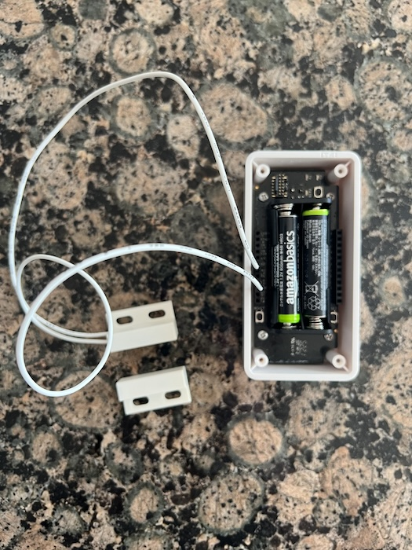
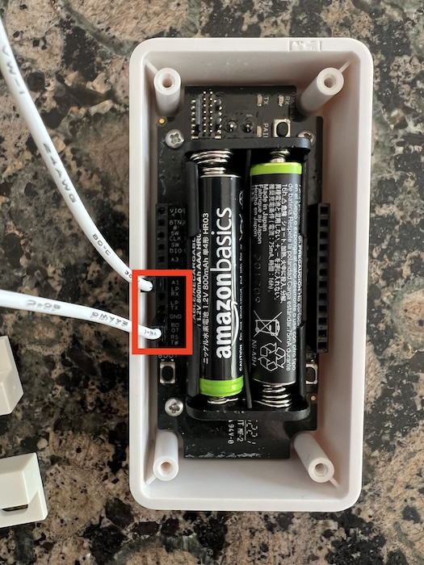
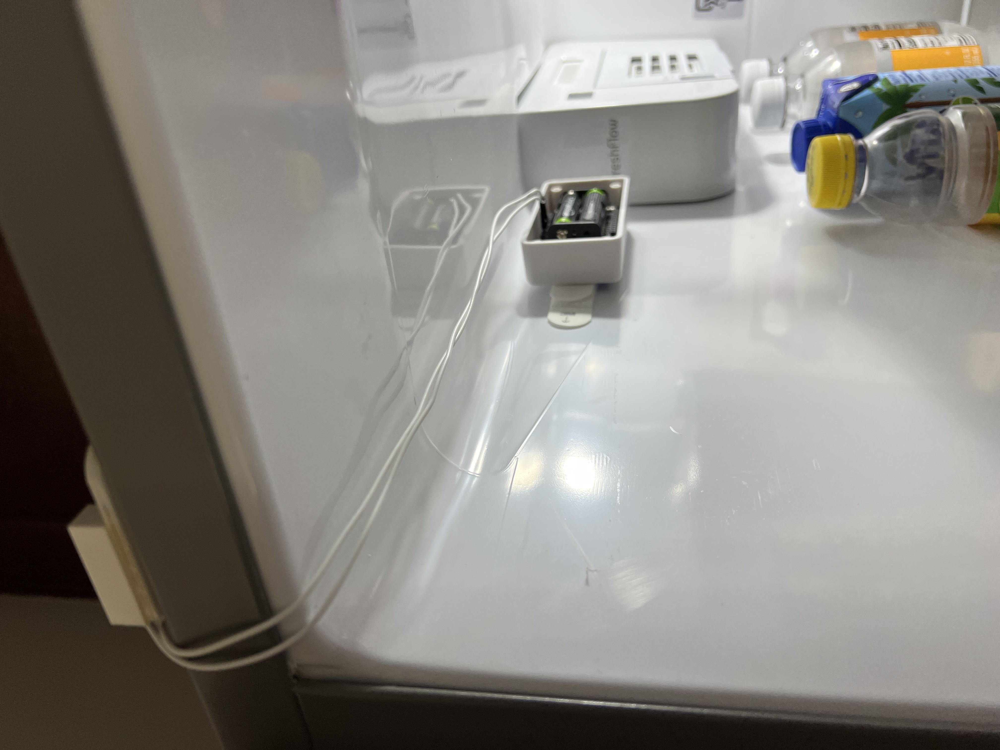
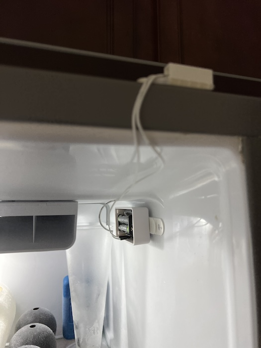
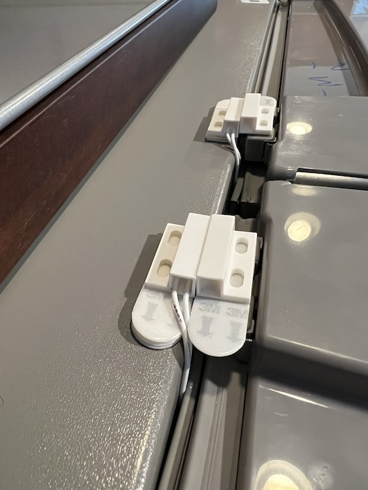
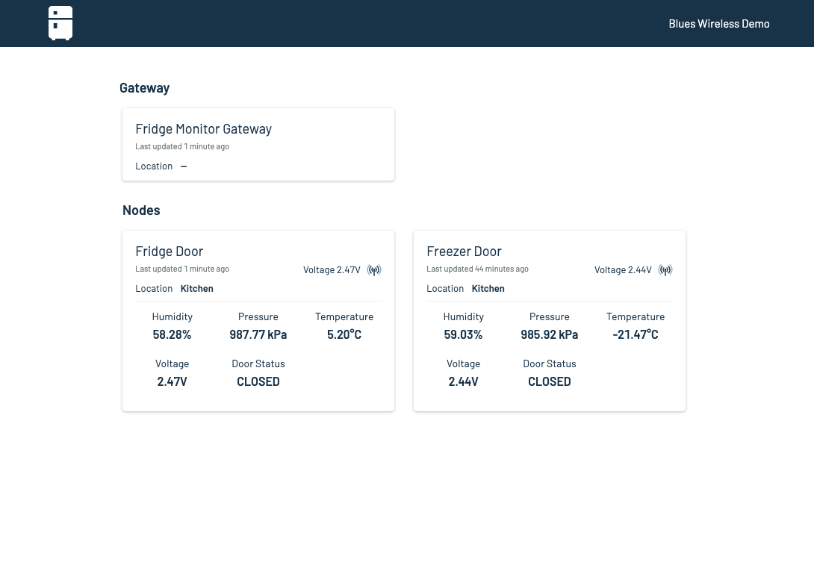
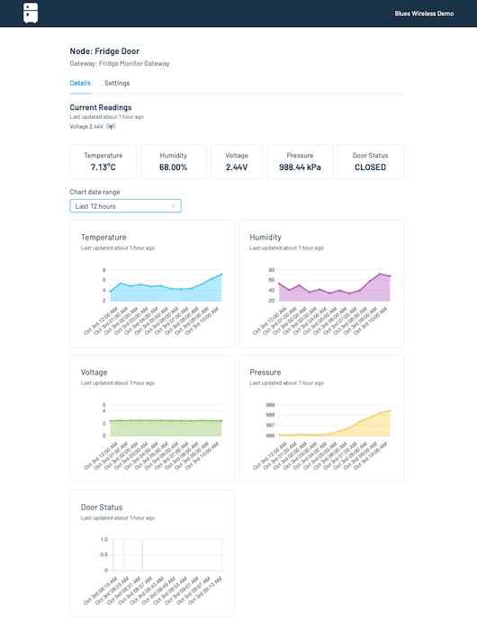

# Fridge Fleet Monitor

LoRa-based temperature, humidity and door open/close state for a fleet of refrigerators.

To run this project yourself you'll need to:

* [Purchase the necessary hardware and configure it](#hardware).
* [Flash the project's firmware](#firmware).
* [Install the hardware](#hardware-installation).
* [Run the project's web application](#web-application).

## Hardware 

The following hardware is required to run the Fridge Fleet Monitor.

* [Sparrow Development Kit](https://shop.blues.io/products/sparrow-dev-kit)
* [Adafruit magnetic contact switch (door sensor) x 2](https://www.adafruit.com/product/375)

After purchasing your Sparrow development kit, head to [Sparrow Quickstart documentation](https://dev.blues.io/quickstart/sparrow-quickstart/) to get started setting up your Sparrow gateway and nodes, including how to set up Notehub and the Notecard. 

In the end, you'll have a gateway and two nodes that look similar to the image below (be sure to leave the backs off the node enclosures, you'll need access to the Sparrow board's pins to attach the contact switch sensor).

In addition to the Sparrow quickstart docs, connect the Adafruit magnetic contact switch to each Sparrow node by plugging one connector cable into the `A1` pin slot and the other into the `GND` pin slot. See images below.

With that done, the hardware is assembled, and flashing firmware is up next.

## Firmware

To get the proper firmware for the Fridge Fleet Monitor project set up, refer to the [`README.md`](firmware/README.md) file in this project's `firmware` folder for full instructions.

## Hardware Installation

With the hardware assembled and the proper firmware flashed, install each Sparrow node inside of the refrigerator where it will be monitoring conditions.

It's recommended, if possible, to attach the Sparrow node close enough to the door of the fridge that the magnetic switches can be positioned next to each other on the exterior of the door. 

To attach the Sparrow node inside the fridge, use Command Strips or some other adhesive strip attached to the front of the node, and wipe down the area to place with node with rubbing alcohol prior to attaching for best adhesion.

_Sparrow node installed in a refrigeration unit._

_Sparrow node installed in a freezer unit._

> **NOTE**: Be advised batteries are not an optimal power source in cold conditions, and it's recommended to have a steady state power source for long term fridge fleet monitor projects. Also consider drilling holes through the back of the Sparrow node enclosure to allow for the contact sensor wires to pass through while protecting the rest of the device's innards.

Likewise, to install the door sensors, attach each piece of the sensor on one side of the door via Command Strips and ensure they line up as closely as possible (notice in the example photos below several Command Strips were stacked together to make sure the switch pieces were as level with each other as possible). See images below.

Notice multiple Command Strips raise the connected contact switch sensor on the fridge so they're close to level with the switch on the door's edge.

Here's how it looks opened. The rubber seal of the door does not interfere with or impede the contact switches from correctly reporting to the Sparrow node inside the fridge at all.

Now that the harware is installed, the last task left is to set up the web app.
## Web Application

The Fridge Fleet Monitor's web application is based on the [Sparrow Reference Web App](https://github.com/blues/sparrow-reference-web-app). 

Refer to the [`README.md`](https://github.com/blues/app-accelerators/tree/main/02-fridge-fleet-monitor/web-app/README.md) file in this project's [`web-app`](https://github.com/blues/app-accelerators/tree/main/02-fridge-fleet-monitor/web-app) folder for full setup instructions.

If all goes well, you'll end up with a Fridge Fleet Monitor dashboard similar to these.

_Fridge Fleet Monitor main dashboard._

_Fridge Fleet Monitor node details._

