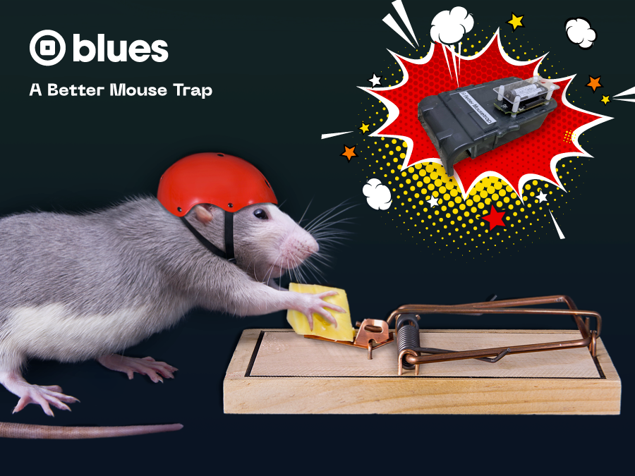
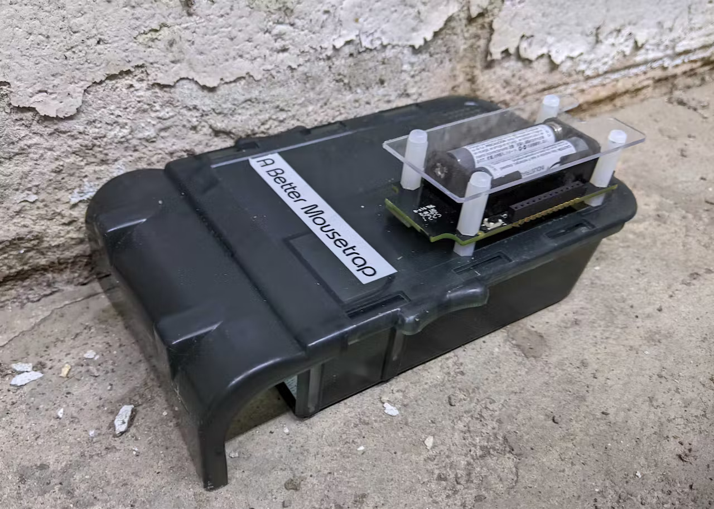
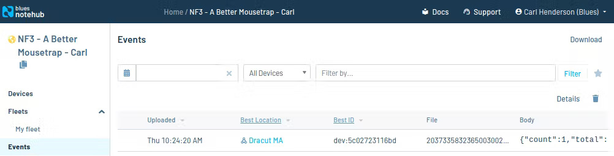
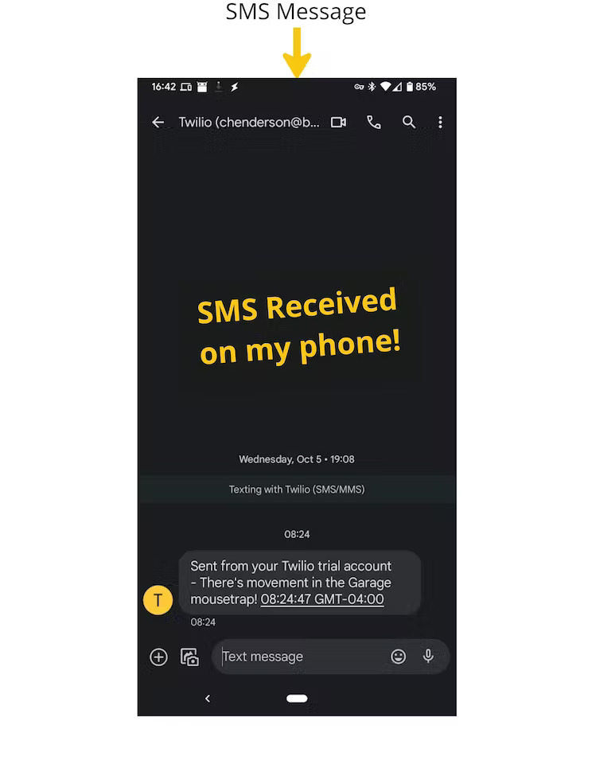

# Better Mouse Trap

**Warning: This project uses Sparrow, a Blues product that is no longer under active development. We are working on updating this project to the successors of Sparrow: [Notecard LoRa](https://blues.com/notecard-lora/) and the [LoRaWAN Starter Kit](https://shop.blues.com/products/blues-starter-kit-lorawan). In the meantime, if you would like assistance building a Better Mouse Trap feel free to reach out on [our community forum](https://discuss.blues.com/).**

A smarter mouse trap with SMS alerting.

Find the complete story in the detailed [Hackster.io writeup](https://www.hackster.io/hendersoncarlton/i-love-checking-on-mousetraps-said-no-one-ever-52c5e7).

_A Better Mousetrap_ is a humane mousetrap that will alert you with an SMS when
it has caught a mouse.

## You will need

### Parts

- [Victor M333 Humane Mouse Trap](https://www.amazon.com/gp/product/B004CMNWES)
- [Blues WiFi + LoRa Dev Kit (Sparrow)](https://shop.blues.io/products/sparrow-dev-kit)
- [Clear Polycarbonate Sheet 1/16-in](https://www.amazon.com/gp/product/B07MQTDF4R)
- [M3-threaded Nylon Standoff Kit](https://www.amazon.com/gp/product/B07KP2ZFNJ)

### Tools

- Hand Drill
- 1/2 inch Drill Bit
- 1/8 inch Twist Drill

## Hardware Setup

### Modifying the Mousetrap

I used a LoRa-based Blues Sparrow Development Kit which has a passive
infrared (PIR) motion sensor on each sensor node. To allow the PIR sensor to see
into the trap, I cut a 1/2” hole in the lid of the Victor M333 Mousetrap. To
locate the circuit board securely, I cut four 1/8” holes to receive M3-threaded
nylon standoffs.

_Ggl9W9TOQ8.jpg)

### Sparrow Setup

Follow the [Sparrow quickstart](https://dev.blues.io/quickstart/sparrow-quickstart/?&utm_source=github&utm_medium=web&utm_campaign=nf&utm_content=nf3#set-up-notecard). Including:

- Plugging in some QWIIC connectors, setting a few dip switches
- Pressing a few `pair` buttons
- Setting your wifi credentials `{"req":"card.wifi","ssid":"<ssid name>","password":"<password>"}`

## Firmware

The Sparrow kit's PIR sensors and factory firmware are perfect to detect motion
in a mousetrap like this.

When the Sparrow sensor detects motion, it creates a message. The Sparrow
gateway, thanks to the onboard Notecard, forwards the message through Wi-Fi to
my home router.

_gUpTQaXMpg.jpg)
_g4ofhDRGNm.jpg)

## Cloud Setup

- Sign up for a free account on [Notehub.io](https://notehub.io), and create a new project.
- Configure the Notecard on the Sparrow Gateway with your Notehub ProductUID
  `{"req":"hub.set", "product":"com.your-company.your-name:your_product", "mode":"continuous"}`

## SMS Alerts

Notehub doesn’t have native SMS alerts yet, but it does allow you to route messages [to any other cloud services or HTTPS API endpoint](https://dev.blues.io/guides-and-tutorials/routing-data-to-cloud/?&utm_source=github&utm_medium=web&utm_campaign=nf&utm_content=nf3) that your heart desires. I used Twilio, an inexpensive SMS service, to send message to my phone when there is motion in the trap.

To correctly format the request for the Twilio HTTP API I followed the Blues [Twilio SMS Guide](https://dev.blues.io/guides-and-tutorials/twilio-sms-guide/?&utm_source=github&utm_medium=web&utm_campaign=nf&utm_content=nf3) and [modified the JSONata](mousetrap.jsonata) expression to tell me which mousetrap (Garage, Basement, etc.) saw motion based on the unique ID of the Sparrow sensor node I affixed to each trap.

_sghXhszUbO.jpg)

## System Test

To trigger the PIR sensor, flip the trap upside down and back upright. You should see an event on [Notehub.io] and an SMS message on your phone.

_TOXG7lKQRu.jpg)

### Blues Community

We’d love to hear about you and your project on the [Blues Community Forum](https://discuss.blues.com/).
