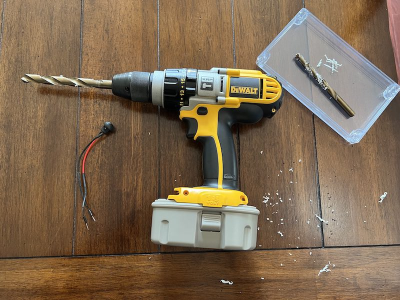

# Parking Lot Help Request

Host-free low latency notification system to alert attendants in a parking lot or facility that customers need assistance.

To run this project yourself you'll need to:

* [Purchase the necessary hardware and configure it](#hardware).
* [Configure Notehub](#notehub).
* [Configure the project's Notecard](#notecard-firmware).
* [Set up a Twilio account and configure the data to route from Notehub to Twilio](#twilio-firmware).
* [Optional: Weatherproof your hardware for field testing](#optional-hardware-weatherproofing).
 
## Hardware

The following hardware is required to run the Parking Lot Help Request application.

* [Notecarrier A with pre-soldered headers](https://shop.blues.io/products/carr-al)
* [Cellular Notecard](https://shop.blues.io/collections/notecard) (LTE Cat-1 versions are highly recommended)
* [Sparkfun RGB LED breakout - WS2812B](https://www.sparkfun.com/products/13282)
* [Twidec 12mm momentary push button with pre-soldered wires](https://www.amazon.com/gp/product/B08JHW8BPV/ref=ppx_yo_dt_b_asin_title_o00_s00?ie=UTF8&th=1)
* [LiPo battery](https://www.adafruit.com/product/2011)
* [Solar panel with JST connectors (any of these are compatible)](https://www.seeedstudio.com/catalogsearch/result/?q=solar%20panels) (This [3W model](https://www.seeedstudio.com/3W-Solar-Panel-138X160.html) is the one used in the project)
* [Breadboard](https://www.adafruit.com/product/64)
* [Male-to-male jumper wires](https://www.adafruit.com/product/758)
* [Break-away 0.1" pin strip male headers](https://www.adafruit.com/product/392)

**Optional additional hardware**

* [Awclub ABS waterproof plastic junction box, with clear cover 8" x 4.7" x 2.2"](https://www.amazon.com/gp/product/B07NSSPSV8/ref=ppx_yo_dt_b_asin_title_o00_s00?ie=UTF8&th=1)

> This plastic enclosure is for boxing up the hardware for field testing after assembly. See the [Optional Hardware Weatherproofing](#optional-hardware-weatherproofing) section at the bottom of this README for instructions.

### Hardware Assembly 

1. After purchasing your hardware, use the [Notecard and Notecarrier Quickstart documentation](https://dev.blues.io/quickstart/notecard-quickstart/notecard-and-notecarrier-a/) to assemble your Notecarrier A and Notecard - don't worry too much over connecting to Notehub: this document will cover it shortly.
1. Break off 3 male pins in a strip and solder to each side of the Sparkfun LED breakout. (This [video from Adafruit](https://www.youtube.com/watch?v=Z0joOKaQ43A&ab_channel=AdafruitIndustries) provides a good example of how to solder male pins to a board like the one the LED comes in.)

_These pins will allow the LED to sit in a breadboard and easily interact with the Notecarrier through jumper wires._
1. Cut a male jumper wire in half and use a wire stripper to strip at least 1/2" of coating off of both the ends of the jumper wire and each wire connected to the Twidec push button. Also snip off the soldered tip of the button's wires so the filaments are free floating.

_Notice that both the button and jumper wires are exposed for soldering, also there's a length of heat shrink on both button wires that will be used to cover the soldered portion of wire later._

1. Use the "Western Union" X-style of wire splicing to wrap the exposed jumper wires together with the Twidec wires and solder them together.

_Cross one wire over the other, wrap together until no wire remains unwrapped._

_A helping hand tool made soldering the jumper wire and button wire together much easier._

1. Add a short piece of heat shrink tubing to each wire before soldering the wires together.Solder the wires. After soldering is complete, slide the heat shrink down over the exposed wires and use a heat gun to shrink the wrap down to and protect the wires from the elements and electrical shorts. If heat shrink tubing is unavailable electrical tape can be substituted. (A great video that shows how do all of this, [splicing through heat shrinking, is available here](https://www.youtube.com/watch?v=Zu3TYBs65FM&ab_channel=ChrisFix).)

_The heat shrink has been shifted over the newly soldered wires - now to shrink it with an application of the heat gun._

_The finished button with its newly added jumper wires on each end, and a protective coat of heat shrink to hide the wires._

1. Slide the LED into a breadboard.

1. Attach the Notecarrier A to the breadboard by plugging a jumper wire from the A's `GND` pin to the `-` bus on the breadboard.

_Notecarrier A's GND pin to breadboard's negative bus (-)._

1. Attach the Notecarrier A to the LED breakout by plugging jumper wires into its headers in the following configuration:
   1. `VIO`  ➡️ `V5` on LED
   1. `AUX2`  ➡️ `DI` on LED
   1. Breadboard's `-` bus ➡️ `GND` on LED

_Notecarrier A VIO pin to V5, AUX2 pin to DI, and negative bus to GND of LED breakout._ 

1. Attach the newly soldered button wires to the Notecarrier and breadboard:
    1. Red wire  ➡️ `AUX1` on the Notecarrier A
    1. Black wire  ➡️ breadboard's `-` bus

1. Plug the LiPo battery and solar panel into the Notecarrier A's JST connectors for each piece of hardware

_This hardware is assembled: Notecarrier, Notecard, LED, button, LiPo battery, and solar panel._

1. Now it's time to configure Notehub and the Notecard!

## Notehub

The Parking Lot Help Request project runs with the help of Notehub. As such, to run this app you’ll need to create a Notehub account, and start a new Notehub project.

### Creating a New Project

1. Sign up for a free [Notehub](https://notehub.io) account, if you don’t have one
already.
1. Click the blue **Create Project** button in the top-right corner of the screen.
1. Give the project a name, such as “ParkingLotHelpRequest”, and then click the **Create Project** button in the modal.

Once your project's created, copy the product UID down somewhere: you'll need it to program the Notecard in the next section.

### Optional: Grouping Devices By Fleet

Notehub has the option to store groups of devices by fleets, which is useful 
for organizing similar groups of devices and storing project settings that need to be shared and synchronized across devices.

For this project, you can group devices by something like "Lot Location" or "Garage Level", simply by updating a project's [fleet](https://dev.blues.io/api-reference/glossary/#fleet)
name, and assigning devices to that fleet.

Notehub creates an initial default fleet for you when you start a new project, and you
can use that as your starting point.

1. Inside your Notehub project, navigate to your fleet in the navigation menu, and then click the **Settings** link.

1. Inside Settings, change the Fleet name input to something more useful (like "Lot L" or "Floor 3" for all devices in that particular lot)

1. Then click on the **Devices** link to see all the devices associated with that Notehub project.
1. Double-click the device you're currently configuring.
1. Update the fleet that device is assigned to by using the dropdown.

1. You can also rename the device from this page if you need to update its parking spot number in the same way.

With this, your Notehub backend is fully configured, and you’re ready to start setting up your Notecard.

## Notecard Firmware

This is a "host-free" project because the _Notecard itself_ can be configured to send notes to Notehub when the button is pressed. It may sound simple, but this is a pretty big deal. Typically, a host microcontroller is necessary to process logic like "when a button is tapped something else (sending a note to Notehub) needs to happen." The fact that Notecard can do this without a host means big savings in terms of necessary hardware and necessary power-usage the device needs (microcontrollers tend to be resource intensive).

To set up the Notecard, refer to the [`README.md`](firmware/README.md) file in this project's `firmware` folder for full instructions under the [Configure the Notecard](firmware/README.md#configure-the-notecard) section.

## Twilio Firmware

Once help requests (button press events) are being successfully sent to Notehub from the Notecard, the requests will need to be routed out of Notehub to Twilio for SMS alerting.

See the `firmware` folder's [`README.md`](firmware/README.md) once more for complete instructions to format the button press events and send them to Twilio. The section [Transform Notehub data with JSONata for Twilio](firmware/README.md#transform-notehub-data-with-jsonata-for-twilio) has all the details you should need.

## Optional: Hardware Weatherproofing

If you want to field test your help request button in a more real-world setting, you'll need an enclosure to secure all the various pieces and keep them safe from the elements.

> **NOTE:** This step is entirely optional. Please do not undertake it until after you've determined your hardware works correctly.

For such a situation, we typically recommend a plastic junction box similar to [these](https://www.amazon.com/gp/product/B07NSSPSV8/ref=ppx_yo_dt_b_asin_title_o00_s00?ie=UTF8&th=1). They are relatively inexpensive, come in lots of different dimensions, are dust and waterproof, and can have holes drilled in to them for wires with standard power tools.

As mentioned in the hardware list at the top, an ABS plastic junction box with the dimensions of 8" x 4.7" x 2.2" was used.

1. Once you have your box, take a power drill and 1/4" drill bit to drill a pilot hole in the center of one of the short sides of the box (this will be where the button will eventually go). 

1. After drilling the pilot hole to keep the plastic case from cracking, use a 1/2" drill bit to drill a hole large enough for the button to fit in snugly.
1. Use an Xacto knife to clean up any loose bits of plastic around the hole's edges.

1. Unscrew the gasket and hex nut from the top of the button, thread the wires through the hole, and if the hole's the right size, the button head should sit snuggly. Rescrew the hex nut to keep the button in place.

1. Now, reassemble the device inside of the plastic enclosure. Tape or glue everything down to keep the hardware secure. (Make sure the LED NeoPixel and solar panel are visible so the device can recharge itself and display to users the help request has been sent.)

1. Screw the plastic top on, tap the button to make sure everything works, and go forth and field test.

