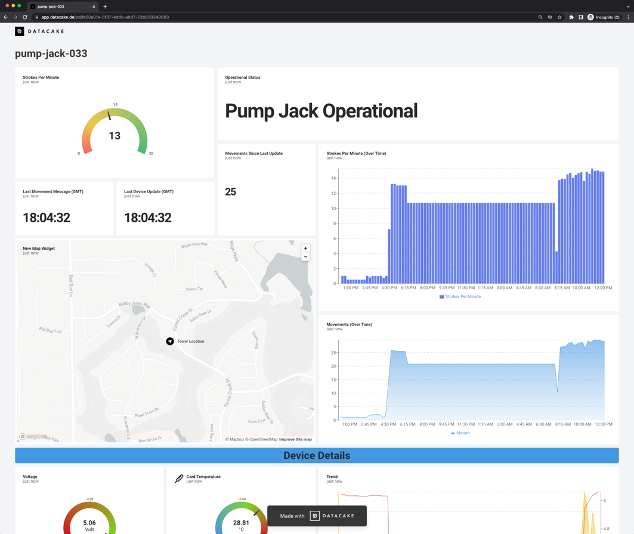

# Piston Pump Motion Monitoring

A host-free system for monitoring motion on an piston pump with the built-in Notecard accelerometer.

To run this project yourself you’ll need to:

* [Configure Notehub](#notehub).
* [Purchase the necessary hardware](#hardware).
* [Configure the Notecard](#configure-notecard).
* [Build a Cloud Dashboard with Datacake](#dashboard)

## Notehub

The Piston Pump Motion Monitor runs on top of Notehub. As such, to run this sample you’ll need to create a Notehub account and start a new Notehub project.

### Creating a New Project

1. Sign up for a free [Notehub](https://notehub.io) account, if you don’t have one already.
1. Click the blue **Create Project** button in the top-right corner of the screen.
1. Give the project a name, such as “PistonPumpMonitor”, and then click the next **Create Project** button.

## Hardware

The following hardware is required to run the Piston Pump Motion Monitor.

* [Blues Notecard](https://shop.blues.io/collections/notecard)
* [Blues Notecarrier B](https://shop.blues.io/products/carr-b)
* A LiPo Battery of any size, like [this one](https://www.adafruit.com/product/328) from Adafruit or [from Blues](https://shop.blues.io/collections/accessories).

> **NOTE**: For a detailed look at how to connect the hardware, refer to the
[Notecard and Notecarrier B quickstart guide](https://dev.blues.io/quickstart/notecard-quickstart/notecard-and-notecarrier-b/).

With the hardware assembled you next need to get the Notecard configured for motion tracking.

## Configure Notecard

This is a "host-free" project because the _Notecard itself_ can be configured to monitor the motion of whatever it is connected to using its built-in accelerometer. It may sound simple, but this is a big deal. Typically, a host microcontroller is necessary to interface with sensors and
determine when data should be sent over the network to a cloud service. The fact that Notecard can do this without a host means big savings in terms of necessary hardware and power usage, as microcontrollers tend to be resource intensive.

This section will guide you through creating a reusable Notecard configuration script which can be executed through the [Notecard CLI](https://dev.blues.io/tools-and-sdks/notecard-cli/) or through the [online webREPL](https://dev.blues.io/notecard-playground/) available on the Blues Developer Experience site.

There are two main ways to program a standalone Notecard that will not be controlled by a host microcontroller:
1. [The Notecard CLI](https://dev.blues.io/tools-and-sdks/notecard-cli/): a downloadable CLI designed for the Notecard.
2. The [Notecard Playground](https://dev.blues.io/notecard-playground/): an in-browser terminal that emulates much of the functionality of the Notecard CLI.

This guide will walk you through using the Notecard CLI, but you can also enter these configuration commands using the online REPL.

1. Download and install the [Notecard CLI](https://dev.blues.io/tools-and-sdks/notecard-cli/#installation) from the Blues Developer Experience site.
1. Plug the Notecarrier containing the Notecard into your computer with a USB-A to micro USB cable.
1. Copy the JSON file example in this folder named [`pump-notecard-configuration.json`](./configuration/pump-notecard-configuration.json) to your local machine.
1. Remove all the # comments describing what each command does, [add your `product`](https://dev.blues.io/notehub/notehub-walkthrough/#finding-a-productuid) in the `hub.set` request, and save the file. It will resemble the code snippet below when you're done.
```json
{"req":"env.default","name":"pump_notecard_configuration_version","text":"1.0.0"}
{"req":"hub.set","mode":"periodic","align":true,"voutbound":"usb:10;high:180;normal:180; low:360; dead:0","vinbound":"usb:10;high:360;normal:720;low:1440;dead:0"}
{"req":"card.voltage","mode":"lipo"}
{"req":"card.motion.mode","start":true,"sensitivity": -1,"seconds":60}
{"req":"card.motion.track","start":true,"minutes":20,"count":20,"threshold":1}
{"req":"card.motion.sync","start":true,"minutes":60,"count":60,"threshold":1}
{"req":"card.location.mode","mode":"periodic","seconds":86400}
{"req":"env.default","name":"_log","text":"on"}
```
1. Upload the configuration script to the Notecard via the Notecard CLI by running the following command from the command line:
```bash
$ notecard -setup pump-notecard-configruation.json
```
1. This executes each command on your connected Notecard, one at a time. When the setup completes, your Notecard's configuration is complete.
1. To confirm your Notecard is now attached to your project in Notehub, navigate to the project in the browser, click the **Devices** tab and see if your Notecard has appeared. Once the Notecard connects to Notehub, you'll see a device with the preferred name of your Notecard (provided by the setup script) under the **Best ID** column.

If you'd prefer to upload this script using the in-browser Notecard Playground instead of downloading the CLI, connect your Notecarrier to your computer via the USB-A to micro USB connector, pair it via serial port in your browser by clicking the **USB Notecard** button in the [Notecard Playground](https://dev.blues.io/notecard-playground/), and copy/paste the whole config file. (Don't forget to add your `product` key in the script before copy/pasting.)

### Notecard Configuration Requests

Let's take a look at each request in the configuration script for this app. First, an `env.default` request to set a `pump_jack_configuration_version` environment variable. This optional request allows you to version your configuration script through an environment variable that is synchronized and visible from the Notehub's Device Environment Variable UI.

```json
{"req":"env.default","name":"pump_jack_notecard_configuration_version","text":"1.0.0"}
```

Next is `hub.set`, and you'll want to edit this request to include your Product UID in a `product` key-value pair, and optionally set a serial number with the `sn` key and value. `voutbound` and `vinbound` are [voltage-variable values](https://dev.blues.io/notecard/notecard-walkthrough/low-power-design/#modem-power-management) that you can use to configure the sync behavior of the Notecard based on the state of its battery. `voutbound` corresponds to periodic syncs from the Notecard to Notehub, while `vinbound` corresponds to syncs from Notehub to Notecard.

```json
{"req":"hub.set","mode":"periodic","align":true,"voutbound":"usb:10;high:180;normal:180; low:360; dead:0","vinbound":"usb:10;high:360;normal:720;low:1440;dead:0"}
```

The `card.voltage` request's [`mode` key](https://dev.blues.io/reference/notecard-api/card-requests/#card-voltage) is used to set voltage thresholds based on how the Notecard will be powered, and which impacts the voltage-variable settings above.

```json
{"req":"card.voltage","mode":"lipo"}
```

Next, we'll configure the motion detection and tracking aspects of the app, starting with `card.motion.mode`. [This request](https://dev.blues.io/reference/notecard-api/card-requests/#card-motion-mode) is used to set-up some of the motion monitoring parameters that will be used with `card.motion.track` below. `"start":true` turns on the accelerometer and tracking, `sensitivity` is used to tune the accelerometer sample rate, and `seconds` is used to specify the period to use for bucketing movements together for automated motion tracking. More on that in a minute.

```json
{"req":"card.motion.mode","start":true,"sensitivity": -1,"seconds":60}
```

Since we're not using a host, we need to configure the Notecard to automatically capture motion data with [`card.motion.track`](https://dev.blues.io/reference/notecard-api/card-requests/#card-motion-track). `"start":true` starts automated motion tracking, which will send a motion Note in the default `_motion.qo` Notefile at least every 20 minutes (`"minutes":20`) and by examining the last 20 buckets (`"count":20`) of 60 seconds each (as set in `card.motion.mode` above). The `threshold` key sets the number of buckets that need to have at least one movement in order for a tracking note to be added.

```json
{"req":"card.motion.track","start":true,"minutes":20,"count":20,"threshold":1}
```

The `card.motion.sync` request is used to automatically sync motion-triggered Notefiles on an interval specified with the `minutes` key. Here, we're setting the sync interval to once an hour and using `"start":true` to kick off automated syncs.

```json
{"req":"card.motion.sync","start":true,"minutes":60,"count":60,"threshold":1}
```

Since this application will be deployed on oil fields, we also want to use GPS/GNSS to send the location of the pump jack. But the pump jack is not a mobile asset, so we can use `seconds` with a high value of `86400` to send a heartbeat location once a day.

```json
{"req":"card.location.mode","mode":"periodic","seconds":86400}
```

Finally, another `env.default` request, this time to set the Notehub-reserved `_log` name. Setting this variable will log network registration failures so that we can debug whether we have deployed devices in an area with spotty connectivity.

```json
{"req":"env.default","name":"_log","text":"on"}
```

### Viewing the App in Action

Once your Notecard has been configured, powered, deployed, and shows up online, you can view events in Notehub to confirm that everything has been set-up correctly. Using the script above, you can expect to see something like the following as events from the `_motion.qo` notefile.

```json
{"motion":22,"movements":"11210221311101111110","orientation":"face-up","temperature":20.75,"voltage":5.0401675203170188}
```

`motion` corresponds to the total number of motion events captured in the configured period of 20 minutes.

`movements` is a string of base-36 characters, where each character represents the number of movements in each bucket during the sample duration. Each character will be a digit 0-9, A-Z to indicate a count of 10-35, or * to indicate a count greater than 35. Since we configured the bucket duration to be 60 seconds above, the example below shows the number of movements detected during each 60 second period.

Finally, `orientation` is the position of the Notecard at the time this Note was captured.

Additionally, because you set up your project for GPS/GNSS tracking, every 24 hours you'll see a `_track.qo` event that contains the pump's location in the payload.

```json
{
    "when": 1671404601,
    "file": "_track.qo",
    "best_location_type": "gps",
    "best_location_when": 1671212234,
    "best_lat": 30.2852325,
    "best_lon": -97.75951171875,
    "best_location": "Austin TX",
    "best_country": "US",
    "best_timezone": "America/Chicago",
}
```
## Dashboard

This project features a [Datacake](https://datacake.co) dashboard to utilize event processing with the built-in payload decoder feature.

You'll first want to set-up a free account with Datacake, and then [follow this guide](https://dev.blues.io/guides-and-tutorials/routing-data-to-cloud/datacake/?&utm_source=github&utm_medium=web&utm_campaign=nf&utm_content=nf7) to create a Notehub Route that sends your project's data to your Datacake dashboard.

Once created navigate to the Configuration tab of your Datacake project and paste the contents of the [pumpjack-payload-decoder.js file](dashboard/pump-payload-decoder.js) into the HTTP Payload Decoder section, and then click the **Save** button. As data flows into Datacake from your Notehub project, you can construct a dashboard to show current
and historical information like in the screenshot below.


