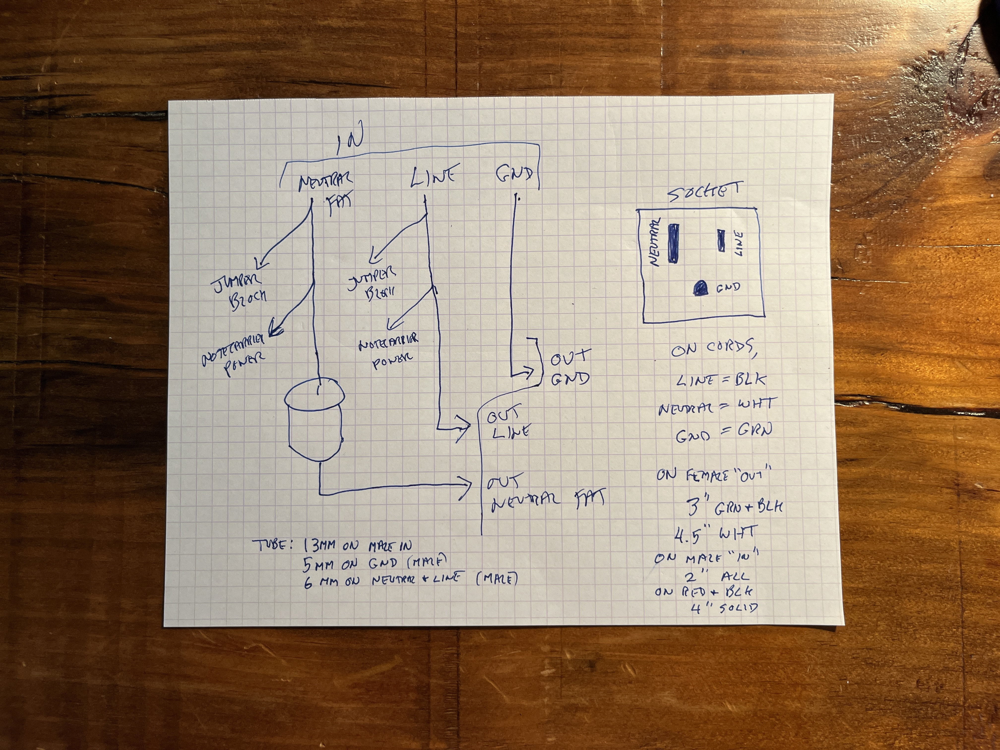
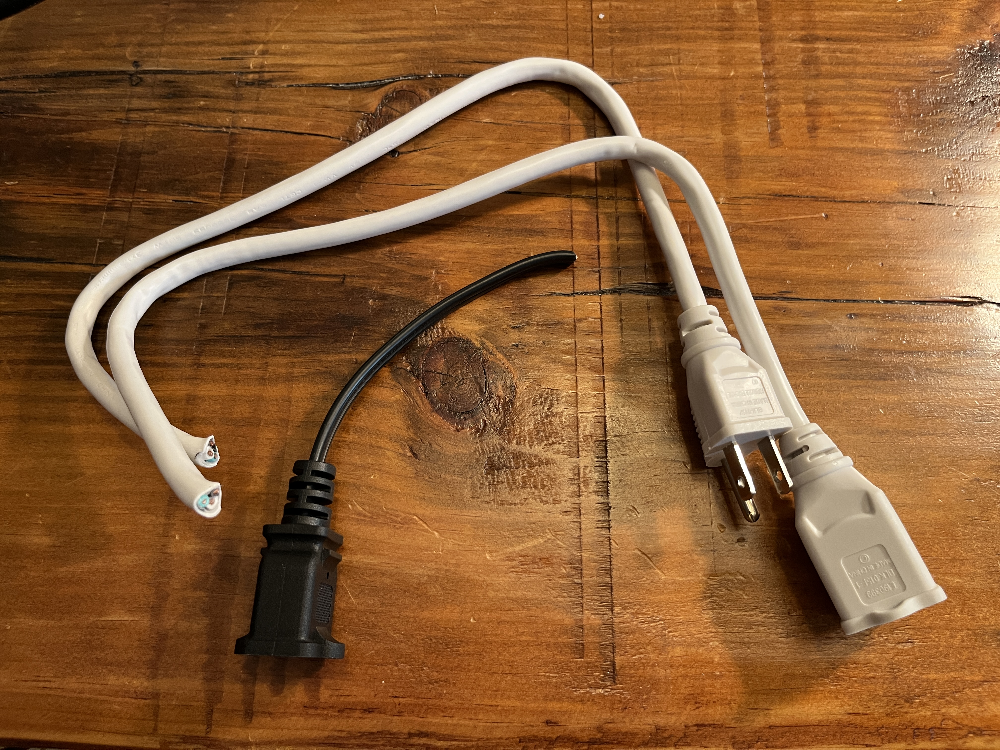
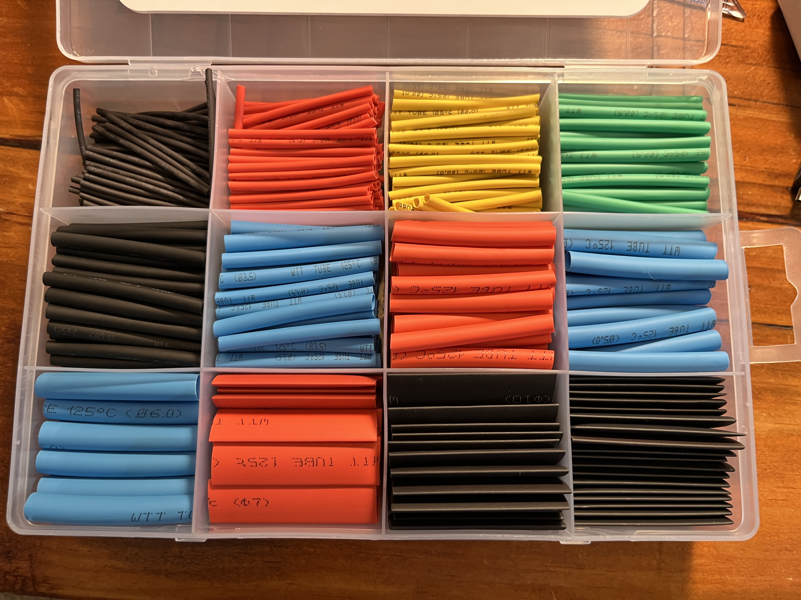
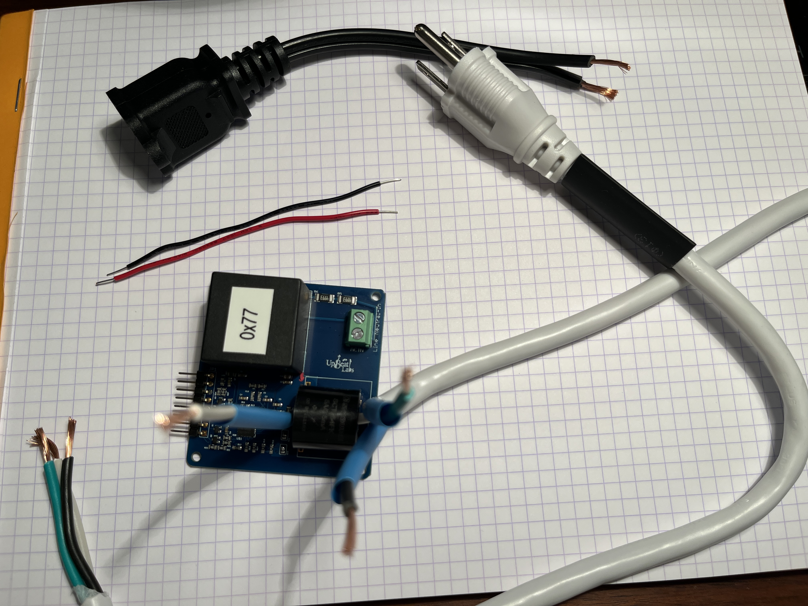
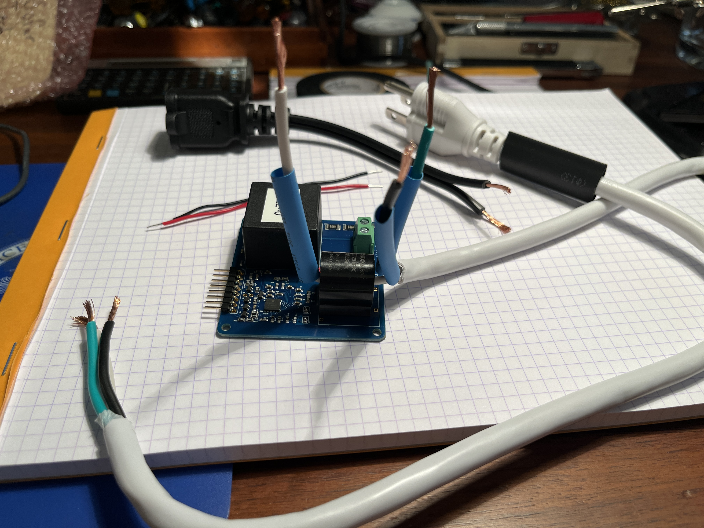
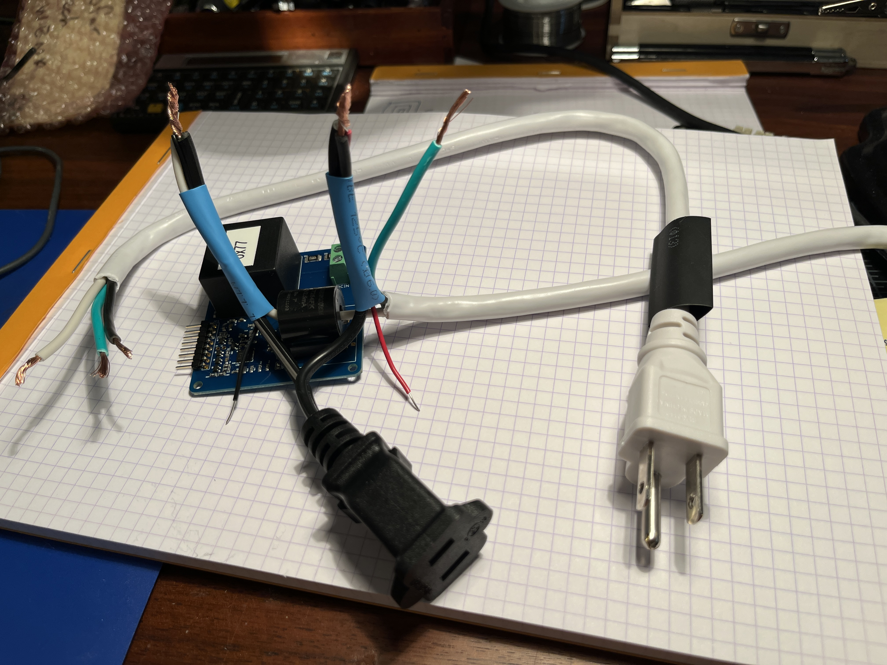
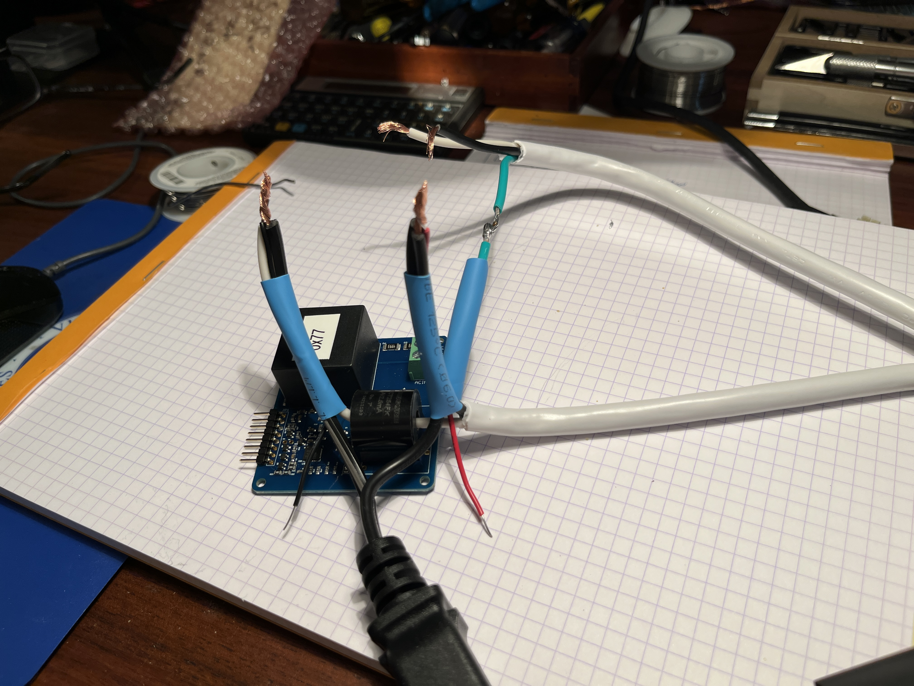
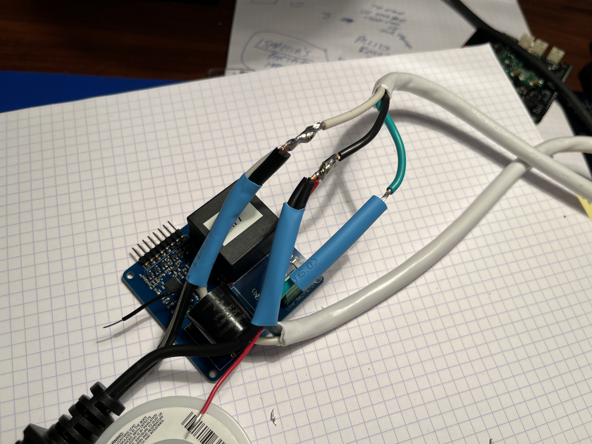
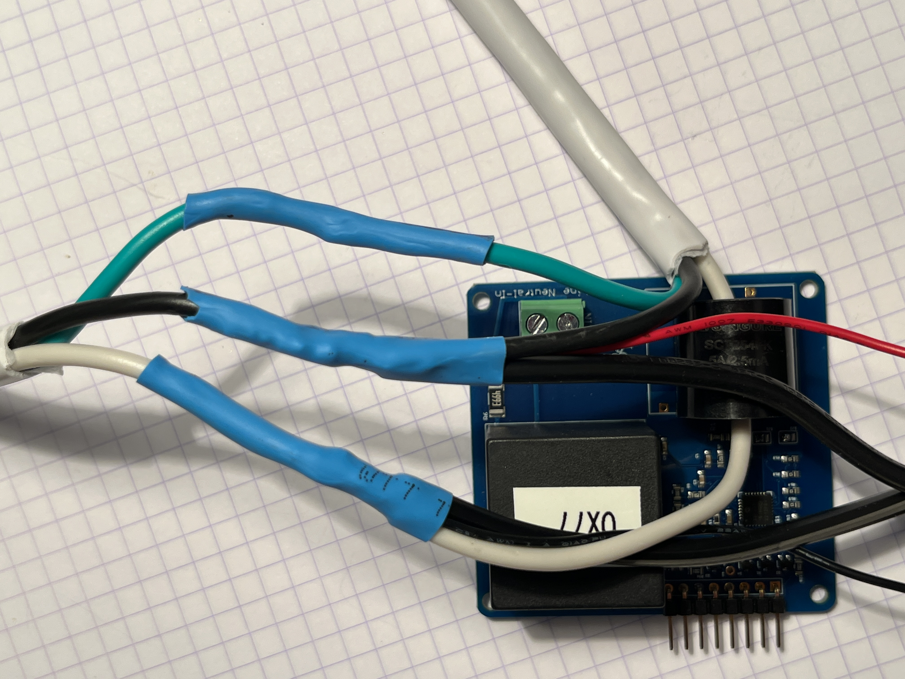

# Creating an Energy Monitor with the Dr. Wattson Energy Monitoring Board

## Build Outline

The [Dr. Wattson Energy Montiring Board] is the key component used for energy monitoring in this solution. Some setup is required before it can be put to use:

* [I2C Configuration](#i2c-configuration): The I2C address of the monitor must be configured by melting the solder on two solder jumpers. It's easier to do this before wiring up the board.

* [Wiring](#wiring): the energy monitoring board is placed electrically inline between an AC inlet plug (line) and an outlet socket (load). Optionally, a low-power outlet may also be added for USB power to the Notecarrier.

## Tools and Hardware

### Tools

  * Soldering iron
  * Wire cutter and stripper
  * Spade connectors or solder
  * Crimper to crimp AC wires to spade connectors (when not soldering wires together)
  * Heat shrink tubing and a source of heat, such as a heat gun (a hairdryer works too but can take longer).
  * Philips screwdriver

### Hardware

  * Male to female grounded extension cable or suitable cables to wire an IEC and/or NEMA AC inlet and outlet receptacle to Dr. Wattson. 16 gauge is recommended as the minimum dimension. Please select suitable wiring gauge for the maximum load used by your machine.
  * (optional but recommended) Corded female NEMA socket for USB power, 18-gauge diameter minimum, such as a spliced male-to-female 18-gauge extension cable
  * 2 18-gauge color-coded insulated wires to power the Dr. Wattson board. (This can be taken from the extension cable used to build the USB power outlet.)

## I2C Configuration

The Dr. Wattson board communicates with the Host MCU over I2C. However, it doesn't come preconfigured with an I2C address - the address must be configured before the board can be used for monitoring. The I2C address is set by melting adjacent pairs of solder lines together to create a new jumper.

The base address of `0x74` is a good choice for your first monitor. If you plan to later use multiple power monitors on the same host, such as monitoring supply and load or monitoring multiple machines, then each monitor should be configured with a different I2C address.

For more details on I2C address configuration, please see section 7, "Configuring I2C Address" in the [Dr. Wattson User Manual].

## Wiring

This section describes the build steps to create an energy monitor based on the Dr. Wattson energy monitoring board.

> We recommend you read Section 5, "Instructions for Wiring Dr. Wattson" in the [Dr. Wattson User Manual] AND these instructions fully before commencing wiring. Mistakes can be time-consuming and potentially fatal!

### Before you begin

Before commencing, you should consider these things:

* the type of electrical connectors: the energy monitor will have an AC inlet (line) and one or two AC outlets, one for the machine being monitored (load) and another to optionally provide USB power. Choices include [NEMA AC connectors](https://en.wikipedia.org/wiki/NEMA_connector) or IEC C13/C14 connectors. Which you use is largely dictated by the existing electrical connection of the machine you wish to monitor.

* the join technique: the build splices AC wires which are then later joined and formed into a junction. In the build described below, we used solder to join and junction spliced wires. In your own build, you can choose to use solder, spade connectors, screw terminals, twist on connectors etc. Choose what is suitable and safe for the environmental conditions, load and gauge of the wires used.

### WARNING!

> WARNING: electrical power MUST always be delivered via a female connector and consumed via male connector so that power always flows from female to male connector. An exposed male connector must never be live as doing so may result in electrical shock and fatal injury. If you are not familiar with mains electrical wiring, please seek a qualified electrician for assistance.

### Step 1: Plan the wiring

Before you begin, be sure to have clear understanding of how the wiring will be once completed. We made notes after reviewing the wiring guide in Section 5 of the [Dr. Wattson User Manual].

In addition to the wiring shown, we also chose to also wire in a NEMA AC socket for a USB power supply.

### Step 2: Assemble Hardware

Assemble the hardware and tools required to complete the build:

* Dr. Wattson energy monitor
* AC cable with inlet for the source of power used by the machine to monitor
* AC cable with outlet to power the machine being monitored
  * (in our case, inlet and outlet had the same type of electrical connector, so we spliced an extension cable to create both inlet and outlet.)

### Step 3: Splice Cables

If you are using extension cables to provide the inlet and outlet hardware, these need to be spliced using the wire cutters.

Here you see the 16-gauge extension cable spliced to provide a corded inlet and outlet, plus an 18-guage cable spliced for the USB power outlet.

### Step 4: Strip Cables

Here we will remove the insulation from the inlet and outlet cables. More insulation is removed from the inlet cable to allow the neutral wire to pass through the current transformer on the Dr. Wattson board.

With the cables spliced, use the wire cutters to carefully cut through the outer insulation to reveal 2 inches of insulated wires on the outlet cable and 4-5 inches on the inlet cable. Be sure not to cut into the inner insulation (the black, white and green insulation) - there must not be any breakages in the inner insulation. Should you accidentally cut too deep, remove that section of cable with the wire cutters and start over removing the outer insulation.

With the outer cable insulation removed, use the wire strippers to remove half an inch of insulation from the ends of the 3 conductors, exposing half an inch of bare wire at the end of the cable.

### Step 5: Slip on Heat Shrink Tubing

When using solder to join sections of cable, Heat shrink tubing is used to cover the exposed wires in the join so that it is completely insulated.

You may not need the heat shrink tubing if you are using a different method for joining the spliced cables (such as spade connectors, or a terminal block) that provides sufficient insulation, in which case you can skip this step.

3 pieces of heat shrink tubing are used to insulate the individual conductors and one larger piece is used to secure the entire cable.

The tubing needs to be slipped over the wires before they are joined. This may sound obvious, but it's an easy step to skip!

First slip a piece of tubing large enough to fit around the entire inlet cable. Then
slip a piece of heat shrink tubing over each exposed wire of the inlet cable.

We didn't take a photo of this, although you can see the tubing in the next step.

### Step 6: Thread the Neutral Wire

Thread the white neutral wire through the current transformer on the Dr. Wattson board.

### Step 7: Join Wires

This step, you will join the wires from the outlet for USB power, wires to power for the Dr. Wattson board and wires from the inlet cable. At this stage, joning can be done by gently twisting the wires together - they will later be soldered in place.

#### Earth
The green protective earth cable isn't joined yet, and is left as is.

#### Neutral

1. Join the white neutral wire from the inlet cable (the one that passes through the current transformer), with the color-coded neutral 18-gauge power wire (shown as black in the photo below.)

2. Join the white neutral wire from the 18-gauge USB outlet cable to the join made in Step 1.

Once this is done, you will have 3 wires joined:

1. the neutral from the inlet cable, after it passes through the current transformer
2. the neutral wire used to power the monitoring board
3. the neutral wire to the USB power outlet

#### Live

1. Join the black live wire from the inlet cable ( with the color-coded live 18-gauge power wire (shown as red in the photo below.)

2. Join the black live wire from the 18-gauge USB outlet cable to the join made in Step 1.

Once this is done, you will have 3 wires joined:

1. the live from the inlet cable
2. the live wire used to power the monitoring board
3. the live wire to the USB power outlet

### Step 8: Join the primary load outlet cable

In this step, the neutral, live and earth wires from outlet cable are joined to the corresponding wires from the inlet.

Using a soldering iron, solder the green earth wire from the inlet cable to the green earth wire on the outlet cable, as shown in the image below

Repeat for the neutral wire, soldering the neutral wire of the outlet cable to the neutral join made in step 7.

Repeat once more for for the live wire, soldering the live wire of the outlet cable to the live join made in step 7.

### Step 9: Apply Heat

With all the electrical joins complete, we can now apply heat to shrink the heat shrink tubing over the joints on the neutral, live and ground joins.

1. gently slip the tubing over the joints
2. using a heat gun, heat up the heat shrink tubing until it starts to contract
3. rotate the heat gun around the tubing so that it shrinks on all sides

### Step 10: AC power to the board

Using the phillips screwdriver, loosen the neutral screw on the green terminal block so that the metal grip lowers.

Insert the neutral wire (black in our photo above), and while holding it in place, tighten the neutral screw. Tug on the wire to ensure it is gripped well.

Repeat for the live wire (line), which is red in our photo above.

### Complete

That completes the mains wiring for the Dr. Wattson energy monitoring board.

Your completed board should look similar to this.

# References

    * [Dr. Wattson Energy Montiring Board]
    * [Dr. Wattson User Manual]

[Dr. Wattson Energy Montiring Board]: https://www.upbeatlabs.com/wattson/
[Dr. Wattson User Manual]: ./docs/DrWattsonUserManual.pdf