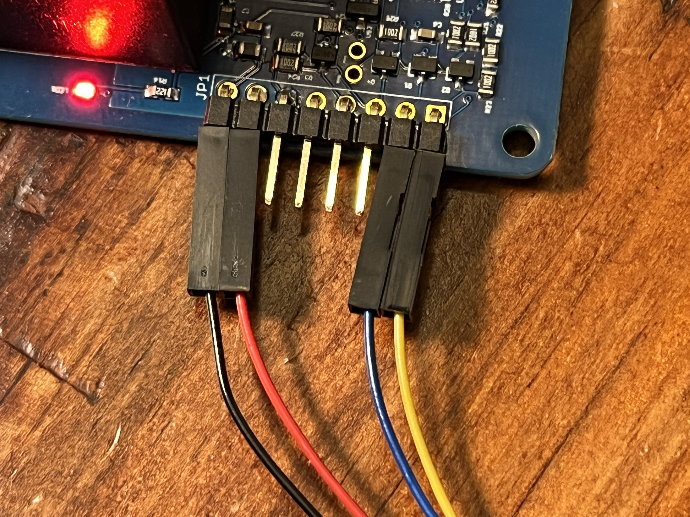
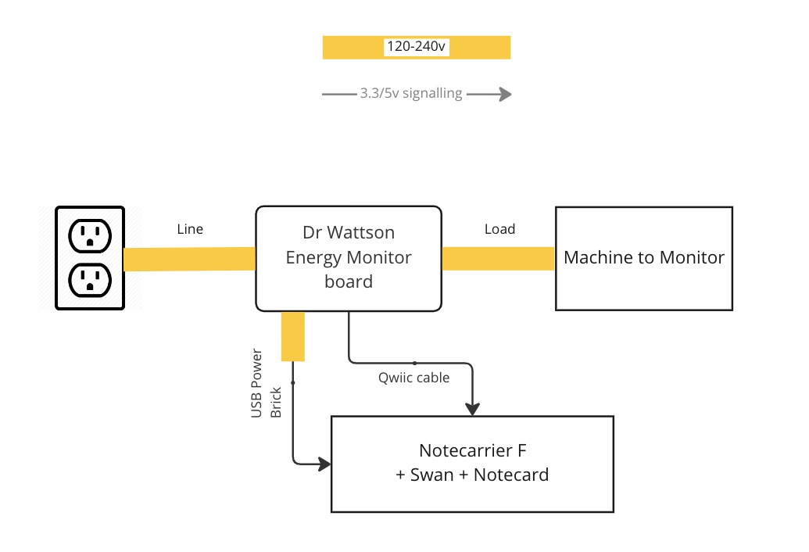

# Power Quality Monitor

Monitor machine AC power use and send alerts on monitored changes.

- [Power Quality Monitor](#power-quality-monitor)
  - [Problem Description](#problem-description)
  - [Solution Summary](#solution-summary)
  - [You will need](#you-will-need)
  - [Dr. Wattson Energy Monitor Build](#dr-wattson-energy-monitor-build)
  - [Hardware Setup](#hardware-setup)
  - [Notehub](#notehub)
  - [Application Firmware](#application-firmware)
    - [PlatformIO extension for VS Code](#platformio-extension-for-vs-code)
    - [Arduino Extension for VS Code](#arduino-extension-for-vs-code)
    - [Arduino IDE](#arduino-ide)
      - [Configuring the Serial Buffer Size](#configuring-the-serial-buffer-size)
      - [Libraries](#libraries)
      - [Arduino IDE - Compiling/Uploading](#arduino-ide---compilinguploading)
    - [Configuring the ProductUID](#configuring-the-productuid)
      - [Using the In-browser terminal](#using-the-in-browser-terminal)
      - [Editing the Source Code](#editing-the-source-code)
  - [Electrical Connections](#electrical-connections)
  - [Testing](#testing)
  - [Configure Monitoring](#configure-monitoring)
  - [Events](#events)
    - [Alerts](#alerts)
- [References](#references)


## Problem Description

For organizations that rely on machinery for their day-to-day operations, an outage can be costly. Organizations with expensive machinery who run on thin margins will often optimize their costs by running at or close to capacity, or by minimizing redundancy between machines of a similar type. When a machine breaks, begins operating out-of-phase, or goes offline, the manufacturer loses money. Monitoring these machines for outages or out-of-phase behavior is preferred, but many of these machines do not come with built-in remote monitoring systems, nor do they contain logic-controllers that may enable a retrofit to add connectivity and remote monitoring and control.

## Solution Summary

This app provides a simple to construct power monitoring device that can be placed in-line with any AC-based machine. Using off-the-shelf hardware and modular components, this solution can be used to add monitoring to a machine regardless of its age or on-board monitoring capability. The hardware and firmware monitor AC energy data (RMS Current, RMS Voltage, Power Factor, Line Frequency, Active/Reactive/Apparent Power) and send regular readings, changes, and configurable alerts to the Notecard and on to Notehub.

## You will need

  * [Notecarrier F](https://shop.blues.io/products/notecarrier-f)
  * [Swan](https://shop.blues.io/collections/swan)
  * [Notecard](https://shop.blues.io/collections/notecard)
  * [Molex Cellular Antenna](https://shop.blues.io/collections/accessories/products/flexible-cellular-or-wi-fi-antenna)
  * [Dr. Wattson Energy Monitoring Board](https://www.upbeatlabs.com/wattson/)
  * [ProtoStax Enclosure for Dr. Wattson](https://www.protostax.com/products/ or similar enclosure
  * A [female to JST qwiic cable assembly](https://www.adafruit.com/product/4397)

For the Dr. Wattson energy monitor build you will also need

  * Male to female grounded extension cable or suitable cables to wire an IEC or NEMA AC inlet and outlet receptacles to Dr. Wattson. 16 gauge is recommended as the minimum dimension. Please select suitable wiring gauge for the maximum load used by your machine.
  * (optional but recommended) Corded female NEMA socket for USB power, 18-gauge diameter minimum, such as a spliced male-to-female 18-gauge extension cable
  * 2 18-gauge color-coded insulated wires to power the Dr. Wattson board. (This can be taken from the extension cable used to build the USB power outlet.)
  * Soldering iron (to melt and bridge solder jumpers on the Dr. Wattson board for I2C address configuration.)
  * Wire cutter and stripper
  * Spade connectors or solder
  * Crimper to crimp AC wires to spade connectors (if used)
  * Heat shrink tubing and a source of heat, such as a heat gun
  * Philips screwdriver

## Dr. Wattson Energy Monitor Build

The Dr. Wattson energy monitoring board monitors power by being looped into the mains AC wiring that powers the machine being monitored. Additionally, solder jumpers are configured to select the I2C address of the Dr. Wattson board.

Please see [Dr. Wattson Energy Monitor build](drwattson-build.md) for build instructions.

With the build complete, you will have a power monitor with an AC inlet and two AC outlets, like this


## Hardware Setup

1. Assemble the Notecard, Notecarrier and antenna as described in our [quickstart tutorial](https://dev.blues.io/quickstart/notecard-quickstart/notecard-and-notecarrier-f/).

2. On the Notecarrier, ensure the `DFU` DIP switch set to `ON`, which maps `AUX RX/TX` over to `F_TX/F_RX` so that notifications can be sent to the host via a serial connection. (see [`card.aux.serial`](https://dev.blues.io/reference/notecard-api/card-requests/#card-aux-serial))

3. Similarly, set the `SWITCHED` DIP switch to the `ON` position.

4. Connect the I2C Qwiic cable between the Notecarrier and Dr. Wattson board:

   * with the Dr. Wattson board laid out with the 8 pins pointing at you, connect the jumper connectors as follows:
      ```
      BLACK  RED  NC  NC  NC  NC  BLUE  YELLOW
      ```
    

    * Insert the Qwiic JST connector into one of the `F_I2C` connectors on the edge of the Notecarrier-F next to the USB port. You may also connect it to the I2C connector on the Swan.

5. Connect the Swan to your computer using a micro-USB cable. This is so that the firmware can be uploaded to the Swan.


## Notehub

Sign up for a free account on [notehub.io](https://notehub.io) and [create a new project](https://dev.blues.io/quickstart/notecard-quickstart/notecard-and-notecarrier-pi/#set-up-notehub).

This solution can be used to monitor a single machine, or monitor multiple machines at a facility. When monitoring multiple machines at a facility, it can be useful to group the monitors at a facility into a Fleet. For more details, see [The Fleet Administrator's Guide](https://dev.blues.io/guides-and-tutorials/fleet-admin-guide/).

## Application Firmware

The application firmware found under the [firmware](./firmware/) folder can be built using these development environments:

* PlatformIO extension for Visual Studio Code
* Arduino extension for Visual Studio Code
* Arduino IDE

We recommend using one of the VS Code extensions, since they are easier to setup and use, and provide a comprehensive development experience. However, if you're familiar with the Arduino IDE, that can be used as well, but requires a little more setup.

### PlatformIO extension for VS Code

There is no special setup required for the project beyond what is normally required to configure a PlatformIO project in VSCode.
[This tutorial](https://dev.blues.io/quickstart/swan-quickstart/#using-the-vs-code-platformio-extension) explains how to install and use the PlatformIO.

The PlatformIO project is located in the `firmware` folder, where you'll find `platformio.ini` that configures the project, including libraries required, location of the sources and compile-time definitions required.

### Arduino Extension for VS Code

The source code for the Arduino project is under [`firmware/notepower/`](firmware/notepower/) in this repository. We have included the correct configuration in `.vscode/arduino.json` which selects the Swan board as the build target and configures the required compiler options.

Before building the project, you will need to install the required [libraries](#libraries) listed below.

### Arduino IDE

#### Configuring the Serial Buffer Size

The Arduino framework by default provides a very small Serial input buffer, which means that if a developer wishes to use the serial port in a way that receives a large volume of data quickly, the data will be truncated and missed.

The workaround, which is required by this sketch, is to add a compiler flag that increases the serial buffer size.

  1. Close the Arduino IDE if it is currently open.
  2. Find the location of the `platform.txt` file for the board that you are building for. When building for Swan, which is supported by STM32Duino, this is located at
      Mac: `~/Library/Arduino15/packages/STMicroelectronics/hardware/stm32/2.3.0`
      Windows: `%HOME$/AppData/Local/Arduino15/packages/STMicroelectronics/hardware/stm32/2.3.0`

  3. Create a file in that directory called `platform.local.txt` containing this line:

```
compiler.cpp.extra_flags=-DSERIAL_RX_BUFFER_SIZE=4096
```

This will increase the receive buffer size to what you need for this sketch.

#### Libraries

When using the Arduino extension for VS Code, or the Arduino IDE, install these libraries using the Library Manager before building the sketch:

* UpbeatLabs MCP39F521
* Blues Wireless Notecard

#### Arduino IDE - Compiling/Uploading

The tutorial [Using the Arduino IDE](https://dev.blues.io/quickstart/swan-quickstart/#using-the-arduino-ide) in the Swan Quickstart shows how to install support for Swan in Arduino IDE and how to compile and upload firmware.

To compile and upload the power monitoring firmware, open the sketch at [`firmware/notepower/notepower.ino`](firmware/notepower/notepower.ino) from this repo.


### Configuring the ProductUID

There are two ways to configure ProductUID created in the Notehub setup above - either using the in-browser terminal to send a request to the Notecard, or by editing the firmware source code.

#### Using the In-browser terminal

1. Connect the Notecarrier to your computer using a micro USB cable.
2. Launch the in-browser terminal at [blues.dev](https://dev.blues.io/notecard-playground/)
3. Click the "USB Notecard" button under "Connect a Notecard".
4. Select the Notecard to connect to and click "Connect".
5. The terminal will display the firmware version of Notecard.
6. You can now enter a request to set the ProductUID and Serial Number of the device.

```json
{"req":"hub.set", "product":"<your-productUID-from-notehub>", "sn":"<machine-name>-monitor"}
```

You can also omit the serial number use Notehub to set it.

#### Editing the Source Code

You can also set the ProductUID in the source code. Open `app.h` in your IDE and edit the line

```c++
#define PRODUCT_UID ""		// "com.my-company.my-name:my-project"
```

and paste in the ProductUID from your notehub project between the first pair of quotes.


## Electrical Connections

With the Dr. Wattson board looped into the flow of power, the machine to be monitored is connected to the Load outlet and power is supplied to Dr. Wattson and the machine via the Line inlet.



During development and testing, you will typically power the Notecarrier and Swan via USB cables from your computer. When the application is deployed, you can use a USB power adapter plugged into the 18-guage outlet.

## Testing

To ensure the setup is working as expected, it's a good idea to test the application before deploying it in a real-life setting. For this, you will need some kind of load, ideally with variable power. In our testing, we used a desk lamp with OFF, LOW and HIGH settings.

## Configure Monitoring

The app is configured using a number of environment variables. Configuration includes how often regular power monitoring events are sent, and the thresholds for anomalous behavior that trigger an alert.

Alerts are generated when the current, voltage, or power use is outside the configured range or if a change greater than a given percent is detected.

These are the environment variables that should be configured according your use case:

* `heartbeat_mins`: how many minutes between sending power notifications. The default is 0 which means do not sent regular power monitoring events, only send alerts. Sending a heartbeat event allows normal operation of the machine to be monitored.

* `alert_under_voltage`, `alert_over_voltage`, `alert_change_voltage_percent`: send an alert when voltage is outside the range specified, or changes more than the given percent. The default sends an alert with a greater than 15% change with no over or under voltage given.

* `alert_under_current_amps`, `alert_over_current_amps`, `alert_change_current_percent`: as above, measuring current.

* `alert_under_power_watts`, `alert_over_power_watts`, `alert_change_power_percent`: as above measuring active power.

These environment variables are set in Notehub, either per-device, per-fleet or per-project. For example, if you want all machines to send power monitoring events every 5 minutes, you would set `heartbeat_mins` to `5` at the project level in Notehub.

Please see our tutorial [Understanding Environment Variables](https://dev.blues.io/guides-and-tutorials/notecard-guides/understanding-environment-variables/) for a fuller description of how environment variables are set.

## Events

A power monitoring event is sent every `heartbeat_mins` minutes or when an alert is sent.
Events are sent to the notefile `power.qo`, and have this structure in the event body:

{
    "current": 0.2846,      // Line RMS current (A)
    "frequency": 59.8125,   // Line AC frequency (Hz)
    "power": 7.9,           // Line Power (Watts)
    "voltage": 118.6,       // Line RMS voltage (V)
}

Regular monitoring events are not immediately synched to Notehub, but are sent once per hour, as given by the `outbound` property in the `hub.set` request. You can change this behavior by setting the preprocessor symbol 

The event body also includes these fields:

* `reactivePower`: The measured reactive power (in VAR).
* `apparentPower`: The measured apparent power (in VA).
* `powerFactor`: The power factor - active power divided by apparent power.

> Note: that when a property in an event is zero, or false, it is not present in the event routed to notehub. For more details see [How the Notecard works with JSON](https://dev.blues.io/notecard/notecard-walkthrough/json-fundamentals/#how-the-notecard-works-with-json).


### Alerts

When the device detects over or under voltage, current or power, or detects a change in these greater than the configured percentage, a power monitoring event is sent as above, with an additional property `alert` that lists the comma-separated reason(s) for the alert. Depending upon the cause of the alert, you may see one or more of these values present:

* `undervoltage`, `overvoltage`: the measured RMS voltage is not within the specified bounds given by the environment variables.

* `voltage`: the measured voltage changed by more than the specified percent (either an increase or decrease.)

* (Similarly, `current` and `power` generate alerts when these power aspects are too high or low, or change by the configured percentage.

When an alert is triggered, it is immediately synched to Notehub.


compiler.cpp.extra_flags=-DSERIAL_RX_BUFFER_SIZE=4096

* platformIO - already present in platform.ini
* Arduino for VSCode - present in ./vscode/arduino.json
* Arduino IDE - requires editing boards.txt for the STM32Duino package.

For vibration sensing, the notecard should be oriented face up and level.


# References

