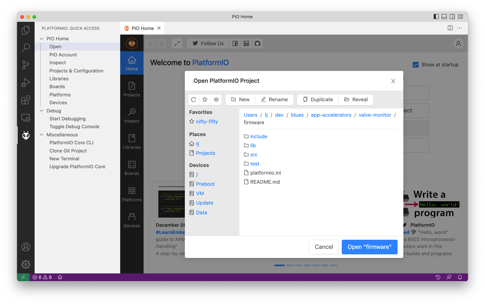
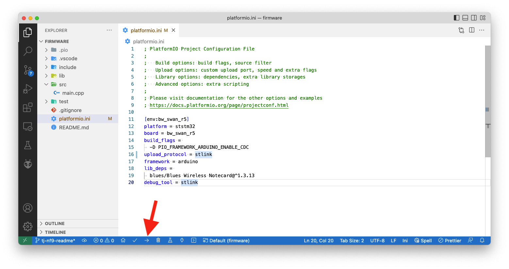
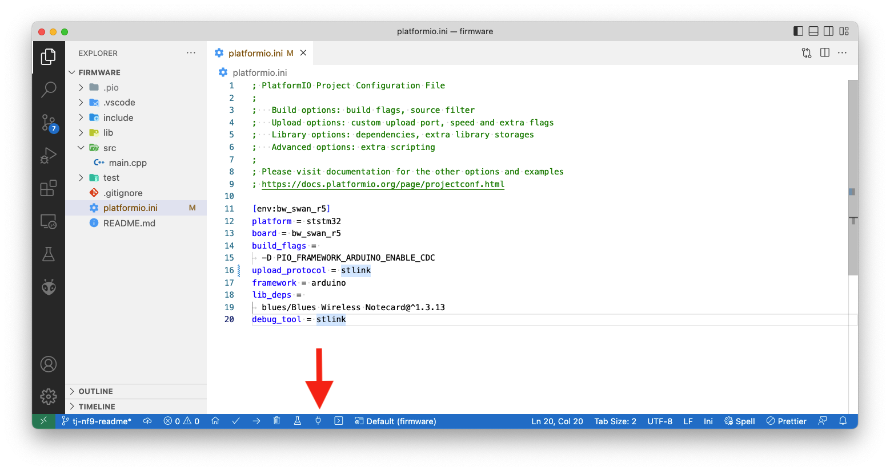

# Valve Monitor Firmware

The Valve Monitor project’s firmware is built with [Platform.io](https://platformio.org/) 
as an Arduino application. To run the firmware, start by ensuring you have 
the prerequisites below installed.

## Prerequisites

1. Download and install [Visual Studio Code](https://code.visualstudio.com/).
1. Install the [PlatformIO IDE extension](https://marketplace.visualstudio.com/items?itemName=platformio.platformio-ide)
via the Extensions menu of Visual Studio Code.


## Opening

Once you have Visual Studio Code and the PlatformIO extension installed, you next need
to open the firmware within PlatformIO.

1. Download or clone this repository, so that you have a copy of the firmware source
code locally.
1. Open the PlatformIO extension by clicking on the PlatformIO logo in the menu bar. Next,
click the “Open” option under the “PIO Home” menu  and finally “Open Project”.

1. Select the `firmware` folder from within your local copy of this repository,
and click the **Open "firmware"** button.


## Flashing

With the firmware project open, you can now make any changes you’d like to the firmware
source code, and then flash the firmware to your device.

Complete the following steps to upload firmware in PlatformIO.

1. Connect your Swan to your computer using [these steps](https://dev.blues.io/quickstart/swan-quickstart/#programming-swan-platformio).

> **NOTE**: The project’s default configuration assumes you’re using an
[STLINK-V3MINI programmer and debugger](https://shop.blues.com/products/stlink-v3mini).
If you’re not, make sure to open your `platformio.ini` file and change the `upload_protocol`
to `dfu`.

2. Once you have everything connected, click the arrow button that appears at the
bottom of your Visual Studio Code window.


Once the firmware is running on your device, you might additionally want to open a serial
monitor to view the firmware’s logs. You can do so by clicking the plug button that appears
at the bottom of your Visual Studio Code window.



## Testing

Once you have the firmware running, you’ll next want to open the firmware’s `main.cpp`
file, uncomment the `#define PRODUCT_UID` line, and replace the hardcoded value with
a ProductUID from the Notehub project you’d like to use.

```c
// Replace with your product UID.
#define PRODUCT_UID "com.my-company.my-name:my-project"
```

Next, ensure you have you have the following connections in place in your hardware.
(And if you don’t, refer back to the [hardware setup guide](../../#hardware) for details
on how to hook everything up).

- Connect the `ATTN` and `F_D13` pins on the Notecarrier.
- Connect the `F_D10` pin of the Notecarrier to your solenoid valve's control pin.
- Connect the `F_D6` pin of the Notecarrier to the signal pin of your flow-rate
meter.

With everything connected and running, the firmware expects to receive `data.qi`
Notes from Notehub in the following format to open and close the solenoid valve.

```json
"body": {
    "state": "open" // or "close"
}
```

> **NOTE**: If you’re unsure how to send Notes to a Notecard, check out this
[tutorial on using the Notehub API](https://dev.blues.io/guides-and-tutorials/using-the-notehub-api/).

The firmware additionally sends two types of outbound Notes back to Notehub.

The first, `data.qo`, reports the current flow rate and valve state, and is sent
at an interval you can configure with the `monitor_interval` environment variable.

```json
"body": {
    "flow_rate": 10.0,
    "valve_state": "closed", // or "open"
}
```

The second, `alarm.qo`, is sent if the measured flow rate falls outside the range
defined by the `flow_rate_alarm_threshold_min` and `flow_rate_alarm_threshold_max` 
environment variables, and the valve state is open. Additionally, the firmware sends
an alarm if the valve is closed and flow is detected (i.e. it’s leaking).

```json
"body": {
    "flow_rate": 10.0,
    "valve_state": "closed",
    "reason": "leak" // or "high" or "low"
}
```