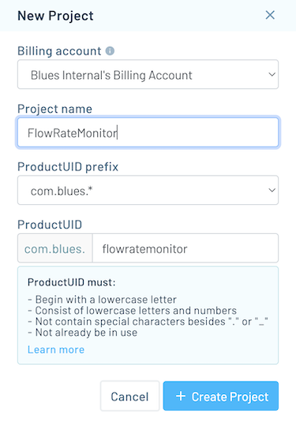
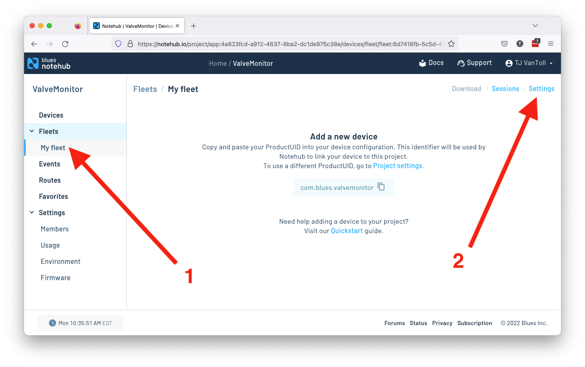
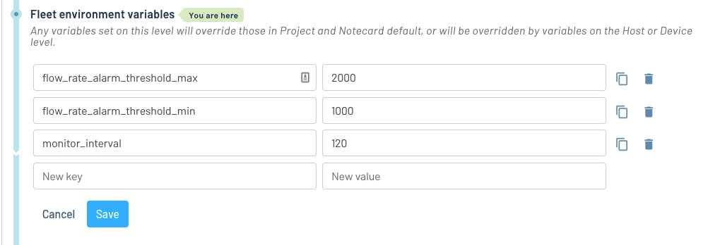
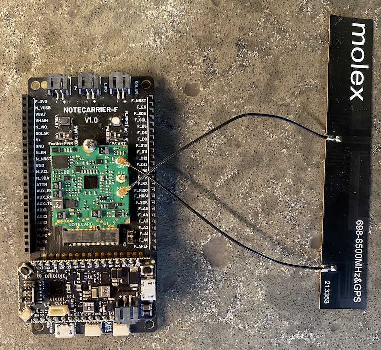
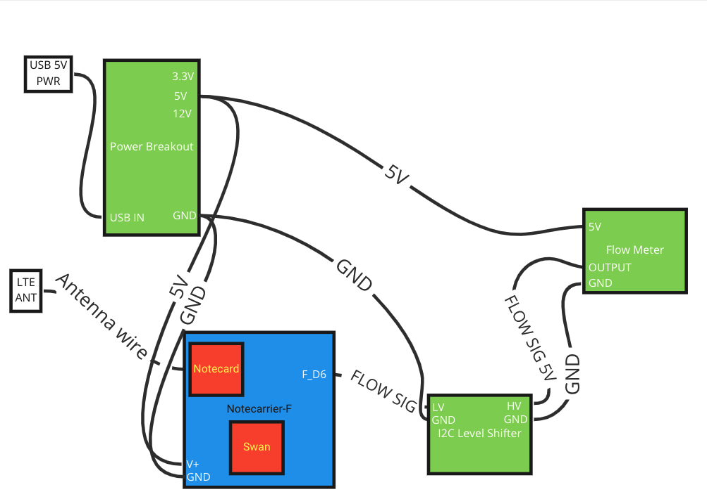

# Flow Rate Monitor

Monitor and measure liquid flow rate.

To run this project yourself you’ll need to:

* [Configure Notehub](#notehub).
* [Purchase and assemble the necessary hardware](#hardware).
* [Flash the project’s firmware](#firmware).
* [Run the project’s web application](#web-application).

## Notehub

The Flow Rate Monitor project runs on top of Notehub. As such, to run this sample
you’ll need to create a Notehub account, start a new Notehub project, and configure
a handful of environment variables.

### Creating a New Project

1. Sign up for a free [Notehub](https://notehub.io) account, if you don’t have one
already.
1. Click the blue **Create Project** button in the top-right corner of the screen.
1. Give the project a name, such as “FlowRateMonitor”, and then click the next
**Create Project** button.

### Configuring Environment Variables

The Flow Monitor project uses [environment variables](https://dev.blues.io/guides-and-tutorials/notecard-guides/understanding-environment-variables/)
for storing project settings that need to be shared and synchronized across
devices.

You can set this project’s environment variables at the [fleet](https://dev.blues.io/api-reference/glossary/#fleet)
level or device level, where fleet-level variables affect all devices in the
fleet, and device-level variables are specific to an individual device.

Notehub creates an initial fleet for you when you start a new project, and you
can use that for setting your initial variables.

1. Navigate to your fleet in the navigation menu, and then click the **Settings**
link.

1. Click the **Environment** tab.
1. Scroll down to the **Fleet environment variables** heading, and define the
four variables below.
    1. `flow_rate_alarm_threshold_max`: (number) The maximum expected flow rate
    from your device, in mL / min. Flow-rate readings over this amount will trigger
    an alarm.
    1. `flow_rate_alarm_threshold_min`: (number) The minimum expected flow rate
    from your device, in mL / min. Flow-rate readings under this amount will trigger
    an alarm.
    1. `monitor_interval`: (integer) How often to take readings from the device’s
    flow-rate monitor, in seconds.
1. With all three defined, click the blue **Save** button.

With this your Notehub backend is fully configured, and you’re ready to start
setting up your hardware.

## Hardware

The following hardware is required to run the Flow Rate Monitor project.

* A [Blues Starter Kit](https://shop.blues.io/collections/blues-starter-kits).
* A flow meter, such as this [GREDIA Quick Connect Water Flow Sensor](https://www.amazon.com/dp/B07RD4JXLY/ref=cm_sw_r_api_i_652XGBZAS7RN06BSSHRT_0).
* Tubing for moving liquid throughout your hardware, such as this
[1/4 OD silicone tubing](https://www.amazon.com/dp/B09H4RNGGG/ref=cm_sw_r_api_i_H171CC4D2EDPPM23X8A4_0?th=1).
* A power breakout, such as this [HiLetgo power breakout](https://www.amazon.com/dp/B07X9SQKL6/ref=cm_sw_r_api_i_5JYD92FH343E04VKPMR5_0)
for supplying correct voltage to this project’s various components.
* An I2C level shifter, such as [this one from HiLetgo](https://www.amazon.com/dp/B07F7W91LC/ref=cm_sw_r_api_i_FZPJ7VRY2329ARNQ3W22_0), to
translate the flow meter’s pulses from 5V logic to 3.3V logic for the Swan
microcontroller.

Additionally you may wish to also use the following:

* (Optional) An enclosure for your hardware such as this
[outdoor-friendly enclosure from Sixfab](https://sixfab.com/product/raspberry-pi-ip54-outdoor-iot-project-enclosure/).

Once you have all of your hardware you’ll next need to assemble the pieces.
To start, complete the [Notecard and Notecarrier-F quickstart guide](https://dev.blues.io/quickstart/notecard-quickstart/notecard-and-notecarrier-f/), which will help
you connect your Notecard, Notecarrier, and Swan.

From there you’ll need to connect your flow meter to the Notecarrier. If you’re using this project’s recommended hardware, here’s a [wiring diagram that shows how all the components connect](https://miro.com/app/board/uXjVP1OBst0=/).

Regardless of which hardware you use, you’ll need to have the following pin
wired to your Notecarrier:

* The flow meter’s signal line must be be connected to the Notecarrier’s `F_D6`
pin. The Swan uses this pin to read the flow rate from the flow meter.

When everything is put together your can then place your hardware inside the optional case like the one we recommended from Sixfab, and you should be good to go.

Your next step is getting the project’s firmware running on
your device.

## Firmware

The Flow Rate Monitor project has custom firmware that runs on the Swan. As a next step,
complete the [firmware’s setup guide](firmware/) to get your firmware up and running.

## Web Application

The Flow Rate Monitor project’s web application allows you to view flow rates, set alarm thresholds, and manage environment variables in a
browser.

As a final step, complete the [web app’s setup guide](web-app/) to get the app running
on your development machine.