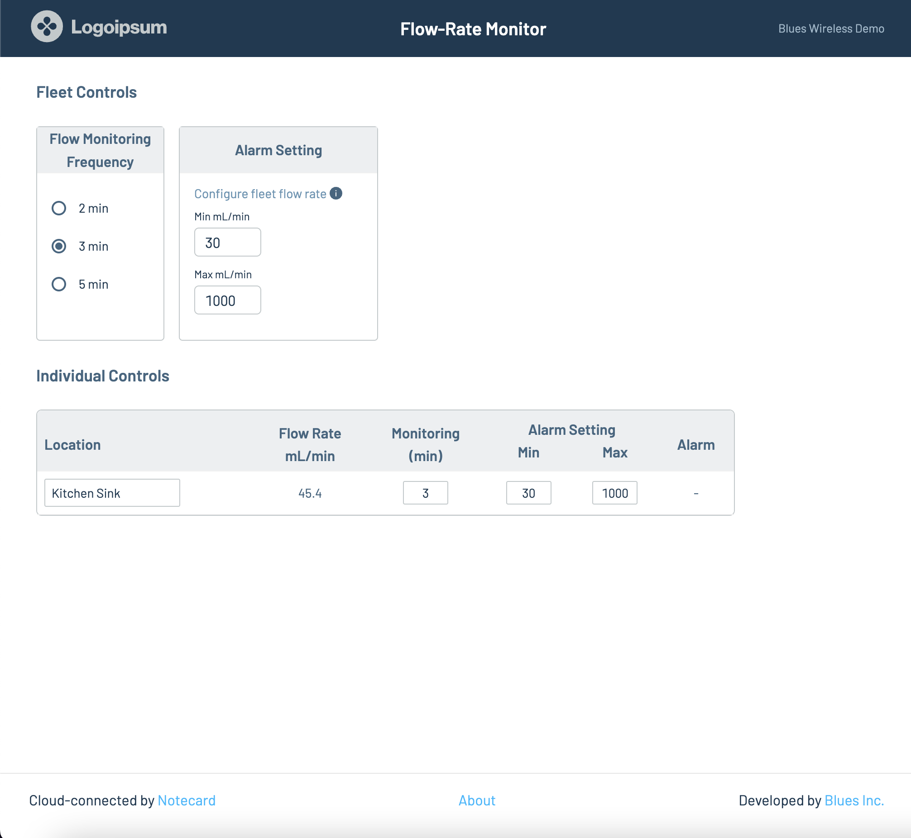
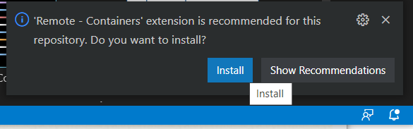
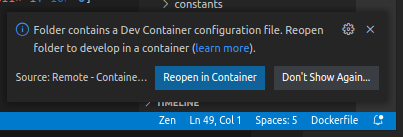
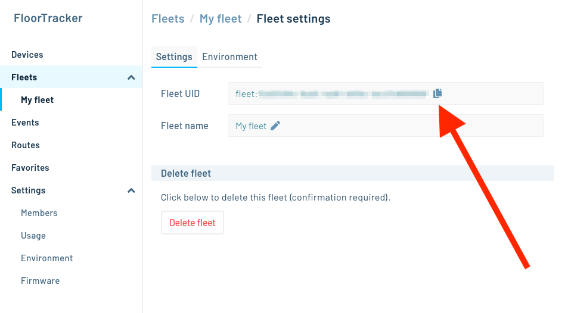

# Flow Rate Monitor Web App

The Flow Rate Monitor project’s web application allows you to view flow rates and manage environment variables in a browser.



To get started, make sure you have a copy of this project’s repository locally, open
up the `10-flow-rate-monitor/web-app` folder in your text editor or IDE, and then complete
the following steps.

- [Flow Rate Monitor Web App](#flow-rate-monitor-web-app)
  - [Dependencies](#dependencies)
    - [(Recommended) Visual Studio Code Dev Container](#recommended-visual-studio-code-dev-container)
    - [(Not Recommended) Dependencies without VS Code](#not-recommended-dependencies-without-vs-code)
  - [Configuration (Environment Variables)](#configuration-environment-variables)
    - [HUB\_AUTH\_TOKEN](#hub_auth_token)
    - [HUB\_PROJECT\_UID](#hub_project_uid)
    - [HUB\_FLEET\_UID](#hub_fleet_uid)
    - [POSTGRES\_\* and DATABASE\_URL](#postgres_-and-database_url)
  - [Routing](#routing)
  - [Create a tunnel to a server running the web app](#create-a-tunnel-to-a-server-running-the-web-app)
    - [Localtunnel](#localtunnel)
    - [Ngrok](#ngrok)
  - [Set up a Notehub route and dashboard URL to your tunnel](#set-up-a-notehub-route-and-dashboard-url-to-your-tunnel)
  - [Database](#database)
    - [Create the database](#create-the-database)
    - [Custom PostgreSQL Server](#custom-postgresql-server)
    - [Troubleshooting the web app getting data from Postgres](#troubleshooting-the-web-app-getting-data-from-postgres)
    - [Web App Development](#web-app-development)

## Dependencies

### (Recommended) Visual Studio Code Dev Container

Although this project is designed for development on Linux,
[Visual Studio Code](https://code.visualstudio.com/) (VS Code) can quickly create a
Linux ["Dev Container"](https://code.visualstudio.com/docs/remote/containers) on Windows, Mac, or Linux. To use this workflow **you must install both VS Code and Docker**, if
you haven’t already.

- [Install VS Code](https://code.visualstudio.com/)
- [Install Docker](https://docs.docker.com/get-docker/)

Before continuing, additionally make sure Docker is running, which you can do by
checking the following.

- **Windows**: Check for the docker (whale) icon in the system tray.
- **Linux/Mac**: Run the command `docker run hello-world` from your terminal. If everything is working correctly you’ll see a confirmation message.

When you open the folder containing this README in VS Code you will see boxes that
prompt you to install the extension **Remote - Containers**, and then to “Reopen in
Container”. Do both.





The Dev Container will automatically install Linux and the project dependencies,
no matter which kind of operating system your development machine uses.

As a final step, open a Linux terminal in VS Code, as you’ll need it to run commands throughout the rest of this guide:

- VS Code > Menus > Terminal > New Terminal

### (Not Recommended) Dependencies without VS Code

If you choose **not** to use a Dev Container in VS Code, you can install the
project dependencies as follows.

The Valve Monitor web app uses [Node.js](https://nodejs.org/en/) as a
runtime, [Yarn](https://yarnpkg.com/) as a package manager, and
[Volta](https://volta.sh/) as a way of enforcing consistent versions of all
JavaScript-based tools. You can install these dependencies by following the
steps below.

1. Install Volta by following its installation
   [instructions](https://docs.volta.sh/guide/getting-started).
2. Run the command below in a terminal to install the appropriate versions of
   both Node.js and Yarn.
   ```
   volta install node yarn
   ```
3. Navigate to the root of the Valve Monitor web app in your terminal or
   command prompt and run `yarn install`, which installs the starter’s npm
   dependencies.
   ```
   yarn install
   ```
4. Install the [PostgreSQL](https://www.postgresql.org/download/) database engine.

## Configuration (Environment Variables)

The Flow Rate Monitor web app uses a series of environment variables to store
project-specific configuration. You _must_ define your own values for these
variables for the Flow Rate Monitor web app to run. You can complete the following
steps to do so.

1. Create a new `.env` file in the root folder of your project.
1. Copy the contents of this repo’s [.env.example](.env.example) file, and paste it in your new `.env` file.
1. Change the required values in your `.env` to your own values using the steps
   below.

### HUB_AUTH_TOKEN

The Flow Rate Monitor web app needs access to your Notehub project in order to
read data from the devices in your Notehub project. An access token is used to
authenticate the app.

To find retrieve an authentication token, put this in your command line (VS Code
Menu > Terminal > New Terminal), replacing `YOUR_NOTEHUB_EMAIL` &
`NOTEHUB_PASSWORD` with your own:

```
curl -X POST -L 'https://api.notefile.net/auth/login' \
    -d '{"username":"YOUR_NOTEHUB_EMAIL", "password": "NOTEHUB_PASSWORD"}'
```

When successful, you will see a response like

```
{"session_token":"BYj0bhMJwd3JucXE18f14Y3zMjQIoRfD"}
```

Copy the value after the colon to set the environment variable in `.env`, e.g.

```
HUB_AUTH_TOKEN=BYj0bhMJwd3JucXE18f14Y3zMjQIoRfD
```

### HUB_PROJECT_UID

This is the unique identifier for your project in Notehub, and has the prefix `app:`. You can find this by going to your Notehub project, clicking the **Settings** menu, and finding the **Project Information** heading which contains **Project UID**. Click the copy icon to copy this to the clipboard.

```
HUB_PROJECT_UID=app:245dc5d9-f910-433d-a8ca-c66b35475689
```

### HUB_FLEET_UID

The unique identifier for your device fleet in Notehub, and has the prefix `fleet:`.

You can find this by opening your Notehub project, navigating to your project’s
fleet you set up earlier, and finding your fleet’s UID in that fleet’s settings.
Copy this UID, and paste it in your `.env` file (replacing the `fleet:0000...`
placeholder.)



```
HUB_FLEET_UID=fleet:00000000-0000-0000-0000-000000000000
```

### POSTGRES\_\* and DATABASE_URL

The default for these variables are fine for development purposes. In a production
environment you'll set them to point to your production database.

## Routing

The Valve Monitor web app receives data from Notehub through a _Route_ created on
 Notehub.io and targeting the web app. To set up your own route you’ll need to
complete the following two steps.

1. [Create a tunnel to a server running the web app.](#create-a-tunnel-to-a-server-running-the-web-app)
   - Running the tunnel allows your local copy of the web app to be accessible on the public internet. This is necessary for Notehub to route events to your local setup.
2. [Set up a Notehub route to your tunnel.](#set-up-a-notehub-route-to-your-tunnel)
   - When Notehub receives an event it can optionally route that event to other servers. In this step, you’ll have Notehub route events to your local setup via the tunnel you created in step #1.

## Create a tunnel to a server running the web app

The Flow Rate Monitor web app contains logic to process incoming Notehub events. But in
order for Notehub to forward data to your local app for processing, your local app
must be accessible from the public internet.

To make your local environment accessible you must set up a tunnel. You’re
welcome to use any tunneling setup you’re comfortable using, but we recommend
[localtunnel](https://github.com/localtunnel/localtunnel) or
[ngrok](https://ngrok.com/).

### Localtunnel

`localtunnel` is a simple free tunnel that you can run as follows. Replace `acme`
with the name of your choice.

```sh
$ npx localtunnel --port 4000 --subdomain acme
Need to install the following packages:
  localtunnel
Ok to proceed? (y) y
your url is: https://acme.loca.lt
```

You can close the tunnel with `ctrl+c`.

### Ngrok

Ngrok is a freemium alternative to localtunnel, which requires an e-mail
signup, a modicum of setup, and in free-mode does not give you a tunnel with a
consistent domain name. **The inconsistent domain name will require you to
update your [route](#routing) each time you start your tunnel.** To use ngrok
you’ll first need to:

- [Sign up for ngrok](https://dashboard.ngrok.com/signup). (It’s free to start.)
- [Install ngrok](https://dashboard.ngrok.com/get-started/setup). (`brew install ngrok/ngrok/ngrok` works well for macOS users—and yes, `ngrok/ngrok/ngrok` is the package name recommended by Ngrok itself.)
- [Set up your ngrok auth token](https://dashboard.ngrok.com/get-started/your-authtoken).

Next, open a new terminal outside VS Code and run `ngrok http 4000`, which
creates the tunnel itself.

```sh
ngrok http 4000
```

If all went well, you should see a screen in your terminal that looks like the image below. ngrok is now forwarding all requests to `https://<your-id>.ngrok.io` to `http://localhost:4000`. Copy the forwarding address (shown in the red box below) to your clipboard, as you’ll need it in the next step.


> **NOTE**: Your `ngrok` terminal needs to stay running for the tunnel to remain active. If you close and restart `ngrok` your URL will change.

To verify everything worked correctly, you can try loading the URL you just copied in a web browser; you should see your reference app’s home page.

## Set up a Notehub route and dashboard URL to your tunnel

With a tunnel in place, your next step is to create a route in Notehub that forwards events to your local app.

To set up the route complete the following steps:

- Visit [Notehub](https://notehub.io) and open the project you’re using for your
Flow Rate Monitor app.
- Select **Routes** in the navigation on the left-hand side of the screen.
- Click the **Create Route** link in the top right of the screen.
- Find the **General HTTP/HTTPS Request/Response** route type, and click its **Select** button.
- Give your route a name.
- For the route **URL**, paste the localtunnel or ngrok URL you copied earlier, and append `/api/datastore/ingest`. For example your route should look something like `https://bb18-217-180-218-163.ngrok.io/api/datastore/ingest`.
- Scroll down, and click the blue **Create new Route** button at the bottom right of the page.

And with that your route is now complete. When Notehub receives an event it should automatically route that event to your tunnel, and ultimately to your local app.

> **NOTE**: Event routing only happens when Notehub receives an event, therefore your Flow Rate Monitor hardware needs to generate new data and send it to Notehub for Notehub to invoke your route.

## Database

The Flow Rate Monitor web app uses PostgreSQL to store data, including the data
it receives from Notehub events. To set up your own PostgreSQL instance you need
to complete the following steps.

### Create the database

There are many different ways you might want to create a Postgres database. If
you’re unsure how to start, we recommend running Postgres through Docker as
follows.

Open a terminal (VS Code > Terminal Menu > New Terminal) and run one of the
following commands.

```sh
# Choose one:
./dev.db.ephemeral.sh # Start a database which will delete its data when stopped
./dev.db.persistent.sh # Start a database with data that persists after stopping and starting again.
```

On Windows you may need to `Allow access` when the Windows Defender Firewall
asks you to allow `com.docker.backend.exe`.

```sh
$ ./dev.db.persistent.sh
... elided ...
Done in 2.65s.
Database is now running the background. Use ./dev.db.stop.sh to stop it.
```

This creates a PostgreSQL database running in Docker. You can ensure the database is
running as expected with the `./dev.db.status.sh` command.

```sh
$ ./dev.db.status.sh
398940737bae   postgres  "docker-entrypoint.s…"   2 hours ago   Up 2 hours   0.0.0.0:5432->5432/tcp, :::5432->5432/tcp   sparrow-postgresql-container
```

To stop the database you can use `./dev.db.stop.sh`.

```sh
./dev.db.stop.sh # Stop the database (and delete the ephemeral data if any)
```

And you can delete the database’s data with `./dev.db.delete.sh`.

```sh
./dev.db.status.sh # Show whether the database is running
./dev.db.delete.sh # to remove the persistent database data
```

If you'd like to connect to your locally running Postgres instance to ensure new
Notehub events are being added, you can use the [Prisma
Studio](https://www.prisma.io/studio) database management tool to easily
explore.

```sh
./dev.db.manage.sh # Open a webpage at http://localhost:5555 that lets you explore the database
```

This will open up a new browser window at http://localhost:5555 where you can
see your Prisma DB, its tables, and any data that currently resides therein.

And just like any other database GUI, you can click into models to view data,
manipulate data, filter, query, etc.

### Custom PostgreSQL Server

If you manually created your PostgreSQL database instead of using one of the
scripts above to automatically create one in Docker you will want to configure
the `DATABASE_*` environment variables in `.env` and then use the
`./prod.db.init.sh` script to initialize the database.

```
$ ./prod.db.init.sh
This script will clear your database and reinitialize it.
Continue (y/n)?y
yes
Done in 10.36s.
Database has been reinitialized.
```

### Troubleshooting the web app getting data from Postgres

There are a number of gotchas that could prevent your Notehub data from making it to Postgres and your web app. If you’re having issues try the following things:

- Is Docker running the local Postgres instance on your machine?
  - Currently there's no error message thrown if the Postgres Docker container's
    not running.
- Does your Ngrok endpoint match what's in Notehub and have the suffix
  `/api/datastore/ingest`?
  - Be aware, every time the Ngrok connection is shut down and restarted, it
    will be started up with a brand new URL, so you'll need to update the route
    accordingly in Notehub to ensure data keeps flowing to it
- Have you added the correct Postgres URL and Notehub project API environment
  variables to your `.env` file?

### Web App Development

The Flow Rate Monitor web app uses the [Next.js](https://nextjs.org/) web
framework to serve React-powered web pages and HTTP JSON APIs. You can start a
Next.js development server using `yarn dev`.

```
yarn dev
```

With the development server running, open <http://localhost:4000> in your web
browser to see your application.

Next.js automatically watches your project’s files, and updates your application
as you make changes. To try it, open your app’s `src/pages/index.tsx` file, make
a change, save the file, and notice how your browser automatically updates with
the change. Changes to `.env` are **not** automatically reloaded, and require you
to stop `yarn dev` with `ctrl+c`, and to then start `yarn dev` back up.

The project’s `src/pages/api` directory are
[APIs](https://nextjs.org/docs/api-routes/introduction) as opposed to
React-powered HTML pages.
The Flow Rate Monitor web app uses these routes in several places to access the
[Notehub API](https://dev.blues.io/reference/notehub-api/api-introduction/)
server without triggering a full-page reload.

> **NOTE**: If you’re new to Next.js, the [Next.js official interactive
> tutorial](https://nextjs.org/learn/basics/create-nextjs-app) is a great way to
> learn the basics, and understand how the Valve Monitor web app works.
