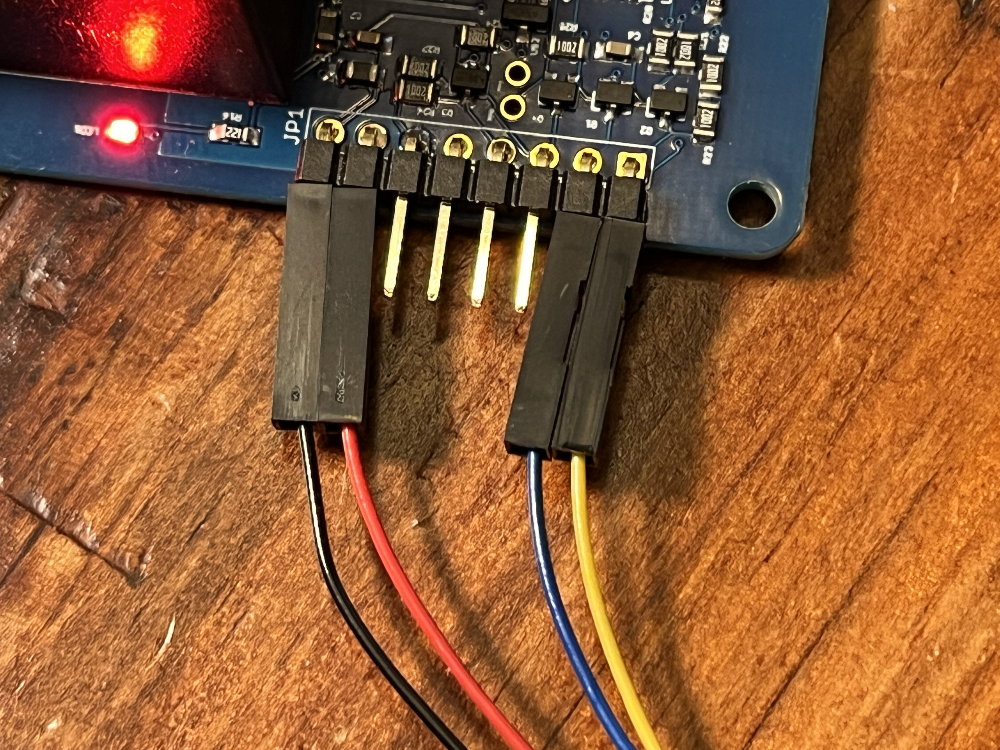
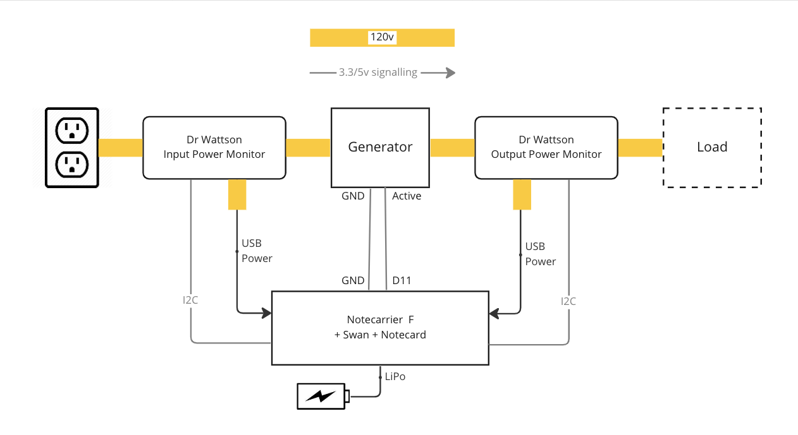
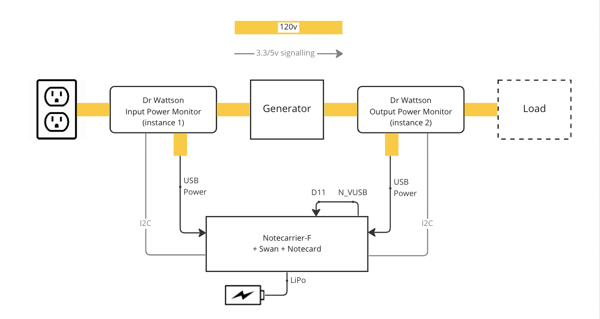

# Generator Activity Monitor

Monitor a generator’s input and output AC supply, alert on anomalies and power failures.

- [Generator Activity Monitor](#generator-activity-monitor)
  - [You Will Need](#you-will-need)
  - [Solution Overview](#solution-overview)
  - [Dr. Wattson Energy Monitor Build](#dr-wattson-energy-monitor-build)
  - [Hardware Setup](#hardware-setup)
  - [Notehub](#notehub)
  - [Application Firmware](#application-firmware)
    - [PlatformIO extension for VS Code](#platformio-extension-for-vs-code)
    - [Arduino Extension for VS Code](#arduino-extension-for-vs-code)
    - [Arduino IDE](#arduino-ide)
      - [Increasing the Serial Receive Buffer Size](#increasing-the-serial-receive-buffer-size)
      - [Libraries](#libraries)
      - [Arduino IDE - Compiling/Uploading](#arduino-ide---compilinguploading)
    - [Configuring the ProductUID](#configuring-the-productuid)
      - [Using the In-browser terminal](#using-the-in-browser-terminal)
      - [Editing the Source Code](#editing-the-source-code)
  - [Electrical Connections](#electrical-connections)
  - [Testing](#testing)
  - [Configure Monitoring](#configure-monitoring)
    - [Instance number](#instance-number)
  - [Activity GPIOs](#activity-gpios)
  - [Configuring Power Activity Alerts](#configuring-power-activity-alerts)
  - [Example Configuration](#example-configuration)
  - [Events](#events)
    - [Alerts](#alerts)
      - [Power Activity Alerts](#power-activity-alerts)
  - [Routing Data out of Notehub](#routing-data-out-of-notehub)
    - [Testing the Route](#testing-the-route)
  - [Blues Community](#blues-community)


## You Will Need
  * [Blues Starter Kit](https://shop.blues.io/collections/blues-starter-kits), that contains amongst other items
    * [Notecarrier F](https://shop.blues.io/products/notecarrier-f)
    * [Swan](https://shop.blues.io/collections/swan)
    * [Notecard](https://shop.blues.io/collections/notecard)
    * [Molex Cellular Antenna](https://shop.blues.io/collections/accessories/products/flexible-cellular-or-wi-fi-antenna)
  * [LiPo battery](https://shop.blues.io/collections/accessories/products/5-000-mah-lipo-battery)
  * 2 x [Dr. Wattson Energy Monitoring Board](https://www.upbeatlabs.com/wattson/)
  * 2 x [ProtoStax Enclosure for Dr. Wattson](https://www.protostax.com/products/) or similar enclosure
  * 2 x [female-to-JST qwiic cable assembly](https://www.adafruit.com/product/4397)

For each Dr. Wattson energy monitor board you will need:

  * Male-to-female grounded extension cable or suitable cables to wire an IEC or NEMA AC inlet and outlet to Dr. Wattson. 16 gauge is recommended as the minimum dimension. Please select suitable wiring gauge for the maximum load expected from the generator.

  * Corded female NEMA socket for USB power, 18-gauge diameter minimum, such as a spliced male-to-female 18-gauge extension cable

  * 2 18-gauge color-coded insulated wires to power the Dr. Wattson board. (This can be taken from the extension cable used to build the USB power outlet.)

Tools required:

  * Soldering iron (to melt and bridge solder jumpers on the Dr. Wattson board for I2C address configuration)
  * Wire cutter and stripper
  * Spade connectors or solder
  * Crimper to crimp AC wires to spade connectors (if used)
  * Heat shrink tubing and a source of heat, such as a heat gun
  * Philips screwdriver

## Solution Overview

This solution uses two Dr. Wattson monitoring boards to monitor standard power (typically utility power) and generator output power. The solution can be used with generators that provide an "active" 3.3v/5v signal and retrofitted to generators that don't provide that signal.

The solution comprises hardware, firmware, and Notehub environment variables and jsonata scripts to provide monitoring and alerts. The Notecard is powered by both utility power and generator power, and a LiPo battery is used to ensure the solution continues to operate during the transition from utility power to generator power.


## Dr. Wattson Energy Monitor Build

The Dr. Wattson energy monitoring board monitors power by being looped into the mains AC wiring both for input and output of the generator being monitored. Additionally, solder jumpers are configured to select the I2C address of the Dr. Wattson board.

> **Note**: As the solution uses two Dr. Wattson boards connected to one Notecard, both boards must be configured with different I2C address.  In this guide we use address `0x74` for utility power and address `0x75` for generator output power, which corresponds with monitor instance 1 and monitor instance 2.

Please see [Dr. Wattson Energy Monitor build](../08-power-quality-monitor/drwattson-build.md) for build instructions.

With the build complete, you will have two power monitors, each with an AC inlet and two AC outlets, like this


## Hardware Setup

1. Assemble the Notecard, Notecarrier and antenna as described in our [quickstart tutorial](https://dev.blues.io/quickstart/notecard-quickstart/notecard-and-notecarrier-f/).

2. On the Notecarrier, ensure the `DFU` DIP switch set to `ON`, which maps `AUX RX/TX` over to `F_TX/F_RX` so that notifications can be sent to the host via a serial connection. (see [`card.aux.serial`](https://dev.blues.io/reference/notecard-api/card-requests/#card-aux-serial))

3. Similarly, set the Notecarrier's `SWITCHED` DIP switch to the `ON` position.

4. Connect the two I2C Qwiic cables between the Notecarrier and Dr. Wattson boards:

   * With the Dr. Wattson board laid out with the 8 pins pointing at you, connect the jumper connectors as follows:
      ```
      BLACK  RED  NC  NC  NC  NC  BLUE  YELLOW
      ```
    

    * Insert the Qwiic JST connector into one of the `F_I2C` connectors on the edge of the Notecarrier-F next to the USB port. You may also connect it to the I2C connector on the Swan.

5. Connect the Swan to your computer using a micro-USB cable. This is so that the firmware can be uploaded to the Swan.

6. Connect the Notecarrier to your computer using a micro-USB cable. This emulates the deployed setup where the Notecarrier and Swan are powered by two USB connections for redundancy.

7. Insert the JST connector on the LiPo battery into the socket marked "LIPO" on the Notecard.


## Notehub

Sign up for a free account on [notehub.io](https://notehub.io) and [create a new project](https://dev.blues.io/quickstart/notecard-quickstart/notecard-and-notecarrier-pi/#set-up-notehub).

You may choose to deploy one instance of this solution, or deploy several instances to monitor multiple generators at a facility. When monitoring multiple generators, it is useful to group the devices at a facility into a Fleet. For more details, see [The Fleet Administrator's Guide](https://dev.blues.io/guides-and-tutorials/fleet-admin-guide/).

## Application Firmware

The application firmware found under the [firmware](./firmware/) folder can be built using these development environments:

* PlatformIO extension for Visual Studio Code
* Arduino extension for Visual Studio Code
* Arduino IDE

We recommend using one of the VS Code extensions, since they are easier to set up and use, and provide a comprehensive development experience. However, if you're familiar with the Arduino IDE, that can be used as well but requires a little more setup.

### PlatformIO extension for VS Code

There is no special setup required for the project beyond what is normally required to configure a PlatformIO project in VSCode.
[This tutorial](https://dev.blues.io/quickstart/swan-quickstart/#using-the-vs-code-platformio-extension) explains how to install and use the PlatformIO.

The PlatformIO project is located in the `firmware` folder, where you'll find `platformio.ini` that configures the project, including libraries required, location of the sources and compile-time definitions required.

### Arduino Extension for VS Code

The source code for the Arduino project is under [`firmware/notepower/`](firmware/notepower/) in this repository. We have included the correct configuration in `.vscode/arduino.json` which selects the Swan board as the build target and configures the required compiler options.

Before building the project, you will need to install the required [libraries](#libraries) listed below.

### Arduino IDE

Before compiling and uploading the sketch, be sure to install the STM32Duino board support package. The tutorial [Using the Arduino IDE](https://dev.blues.io/quickstart/swan-quickstart/#using-the-arduino-ide) in the Swan Quickstart shows how to install support for Swan in Arduino IDE and how to compile and upload firmware.

You will also need to install the required libraries, and increase the serial receive buffer size, detailed below.

#### Increasing the Serial Receive Buffer Size

The Arduino framework by default provides a very small Serial input buffer, which means that if a developer wishes to use the serial port in a way that receives a large volume of data quickly, the data will be truncated and missed.

The workaround, which is required by this sketch, is to add a compiler flag that increases the serial buffer size.

  1. Close the Arduino IDE if it is currently open.
  2. Find the location of the `platform.txt` file for the board that you are building for. When building for Swan, which is an STM32 board supported by STM32Duino, this is located at
      Mac: `~/Library/Arduino15/packages/STMicroelectronics/hardware/stm32/2.3.0`
      Windows: `%HOME$/AppData/Local/Arduino15/packages/STMicroelectronics/hardware/stm32/2.3.0`

  3. Create a file in that directory called `platform.local.txt` containing this line:

```
compiler.cpp.extra_flags=-DSERIAL_RX_BUFFER_SIZE=4096
```

This will increase the receive buffer size to what you need for this sketch.

#### Libraries

When using the Arduino extension for VS Code, or the Arduino IDE, install these libraries using the Library Manager before building the sketch:

* UpbeatLabs MCP39F521
* Blues Wireless Notecard

#### Arduino IDE - Compiling/Uploading

To compile and upload the power monitoring firmware, open the sketch at [`firmware/notepower/notepower.ino`](firmware/notepower/notepower.ino) from this repo.

### Configuring the ProductUID

There are two ways to configure the ProductUID created in the Notehub setup above - either using the in-browser terminal to send a request to the Notecard, or by editing the firmware source code. For more details on what the ProductUID is and how it set it please see [this guide](https://dev.blues.io/notehub/notehub-walkthrough/#finding-a-productuid).

#### Using the In-browser terminal

1. Connect the Notecarrier to your computer using a micro USB cable.
2. Launch the in-browser terminal at [blues.dev](https://dev.blues.io/notecard-playground/)
3. Click the "USB Notecard" button under "Connect a Notecard".
4. Select the Notecard to connect to and click "Connect".
5. The terminal will display the firmware version of Notecard.
6. You can now enter a request to set the ProductUID and Serial Number of the device.

```json
{"req":"hub.set", "product":"<your-productUID-from-notehub>", "sn":"<generator-name>-monitor"}
```

You can also omit the serial number and use Notehub to set it:

1. Open the project in Notehub.
2. From the list of devices, double click the device that has the serial number you want to set.
3. In the "Summary" tab, use the pencil icon to edit the Serial Number field.

#### Editing the Source Code

You can also set the ProductUID in the source code. Open `app.h` in your IDE and edit the line

```c++
#define PRODUCT_UID ""		// "com.my-company.my-name:my-project"
```

pasting in the ProductUID from your notehub project between the first pair of quotes.


## Electrical Connections

With the Dr. Wattson boards looped into the flow of power via extension cables, the generator you want to monitor has its electrical input connected to one monitor board, and its electrical output connected to the other.

For ease of identification, use the board with the lower I2C address to monitor input power, and the higher I2C address to monitor generator output. We recommend using addresses `0x74` and `0x75`.

The solution can make use of a 3.3v-5v "generator active" signal, which may or may not be present on the generator you are using. If such a signal is present, connect this to pin `D11` on the Notecarrier, as shown below:



Otherwise, you can simulate a generator active signal by connecting the Notecarrier to the Generator monitor's USB output and using a jumper wire to connect `N_VUSB` to `D11`. Please note that not all pins are 5v-tolerant, so use caution and check the datasheet for your MCU. On Swan, D11 and D12 are 5v-tolerant, but D10 and D13 are not.



During development and testing, you will typically power the Notecarrier and Swan via USB cables from your computer. When the application is deployed, you will use a USB power adapter plugged into each of the 18-gauge wired outlets that you added to the two Dr. Wattson monitoring boards.

## Testing

To ensure the setup is working as expected, it's a good idea to test the application before deploying it in a real-world setting.

For testing, rather than using a real generator, we used a  [switchable extension cable](https://www.amazon.com/Protector-Extension-Independent-switches-Certified%EF%BC%8CBlack/dp/B084ZGSHKM), with one switched output emulating the utility supply (generator input) and another emulating the generator output.

Utility power failure and restoration is emulated by switching line 1 off and on. Generator power failure was emulated by switching line 2 off and on.

## Configure Monitoring

The app is configured using a number of environment variables. Configuration includes how often regular power monitoring events are sent, and the thresholds for anomalous behavior that trigger an alert.

Alerts are generated when the current, voltage, or power use is outside the configured range or when a change greater than a given percent is detected.

These are the environment variables that can be configured according your use case:

* `heartbeat_mins`: how many minutes between sending power notifications. The default is 0 which means do not send regular power monitoring events, only send alerts. Sending a heartbeat event allows operation of the power source and generator output to be monitored.

* `alert_under_voltage`, `alert_over_voltage`: send an alert when the measured voltage is above or below the specified values in Volts. The default setting is `0`, where no alerts are sent regardless of the measured voltage.
* `alert_change_voltage_percent`: send an alert when the voltage changes by more than the given percent. The default value is `15`, which sends an alert when a 15% or greater change is detected. Set to `0` to disable percentage change alerts.

* `alert_under_current_amps`, `alert_over_current_amps`: send an alert when the measured current is above or below the specified values in Amps. The default setting is `0`, where no alerts are sent regardless of the measured current.
`alert_change_current_percent`: send an alert when the measured current changes by more than the given percent. The default value is `15`, which sends an alert when a 15% or greater change is detected. Set to `0` to disable percentage change alerts.

* `alert_under_power_watts`, `alert_over_power_watts`: send an alert when the measured power is above or below the specified values in Watts. The default setting is 0 where no alerts are sent regardless of the measured power.
* `alert_change_power_percent`: send an alert when the measured power changes by more than the given percent. The default value is 15, which sends an alert when a 15% or greater change is detected. Set to 0 to disable percentage change alerts.

These environment variables are set in Notehub, either per-device, per-fleet or per-project. For example, if you want all generators to send power monitoring events every 5 minutes, you would set `heartbeat_mins` to `5` at the project level in Notehub.

Please see our tutorial [Understanding Environment Variables](https://dev.blues.io/guides-and-tutorials/notecard-guides/understanding-environment-variables/) for a fuller description of how to set environment variables in Notehub.

### Instance number

Each power monitor is given an instance number from 1-4. The instance numbers correspond to the I2C address of the monitoring board:

* instance 1: I2C address `0x74`
* instance 2: I2C address `0x75`
* instance 3: I2C address `0x76`
* instance 4: I2C address `0x77`

For example, should your two monitors be configured at addresses `0x74` and `0x75` then these will be reported as instance 1 and instance 2.

## Activity GPIOs

Each Dr. Wattson instance can be associated with a GPIO pin that indicates the expected activity of a given line:

* instance 1: pin D10 - 3.3v tolerant
* instance 2: pin D11 - 5v tolerant
* instance 3: pin D12 - 5v tolerant
* instance 4: pin D13 - 3.3v tolerant

> Voltage tolerances given are for Swan, please check your board's datasheet when using a different Feather board.

The activity GPIO for an instance can be configured as input or output. When configured as input, the logic level sensed on the pin denotes the expected line activity - low for inactive, high for active. When configured as output, the state the pin is set to denotes the expected activity.

To configure an activity pin as input, set the environment variable `inputX=true` where X is the instance number. For example `input2=true` sets D11 as input, and the logic level sensed on that pin is reported in monitoring events from instance 2 via the `active` property.

To configure an activity pin as output, set the environment variable `switchX=1` to drive the pin high, or `switchX=0` to drive the pin low, replacing X with the monitor's instance number. As with input, the `active` property in monitoring events shows the current state of the pin.

## Configuring Power Activity Alerts

In addition to simply monitoring the activity level of a line, you can use environment variables to add additional behaviors that correlate the measured power with the expected line activity:

* `alert_power_activity_[1-4]`: Accepted values are `load` or `source`.  When set to `load`, the corresponding line power is checked against the activity state of the corresponding pin. When the pin is low, line current and power are expected to be zero and voltage is expected to be within the over/under voltage configuration, since the load is continuously powered, but does not consume power when inactive. Setting the value to `supply` indicates the line is a source of power with the expectation that voltage, current and power are all zero when the pin is low, and within the configured ranges when the pin is on.

These variables describe how long it takes for a generator to startup or shutdown, or for a load to reach steady state. Activity alerts are suppressed during the startup and shutdown period.

* `power_activity_startup_secs_[1-4]`: the duration in seconds for how long it takes the power level to stabilize on becoming active. Alerts are suppressed for this period when a line goes from inactive to active. The default value is `0`.

* `power_activity_shutdown_secs_[1-4]`: the duration in seconds for how long it takes for the power level to stabilize on becoming inactive.  Alerts are suppressed for this period when a line goes from active to inactive. The default value is `0`.


## Example Configuration

With a 120v supply and generator, this configuration monitors utility power and generator output power and send alerts when either fails:

| Environment variable name | Value  | Description                                    |
| :------------------------ | :----: | :------------------------------------------------------------|
| `heartbeat_mins`          | 5      | Send power monitoring events every 5 minutes. |
| `alert_under_voltage`     | 100    | Send an alert when voltage is < 100v. |
| `alert_over_voltage`      | 135    | Send an alert when voltage is above 135v. |
| `input2`                  | true   | Sense monitor 2 (generator) activity, reported in monitoring events. |
| `alert_power_activity_2`  | supply | Monitor the generator GPIO and alert when line voltage does not match generator activity. |

Additionally, if you wanted to ensure that the load is always operational and consuming power (for loads that run continuously), set `alert_power_activity_2` to `load`. For loads that are not running continuously, you can use a 3rd power monitor instance to independently monitor the load against its expected activity state.

## Events

A power monitoring event is sent every `heartbeat_mins` minutes or when an alert is sent.
Events are sent to the notefile `power.qo`, and have this structure in the event body:

```json
{
    "instance": 1,          // which of the connected Dr. Wattson monitors reported the event
    "current": 0.2846,      // Line RMS current (A)
    "frequency": 59.8125,   // Line AC frequency (Hz)
    "power": 7.9,           // Line Power (Watts)
    "voltage": 118.6        // Line RMS voltage (V)
}
```

Regular monitoring events are not immediately synched to Notehub, but are sent once per hour, as given by the `outbound` property in the `hub.set` request. You can change this behavior by setting the preprocessor symbol `SYNC_POWER_MONITORING_NOTES` in [`app.h`](./firmware/notepower/app.h#L20).

The event body also includes these named values:

* `reactivePower`: The measured reactive power (in VAR).
* `apparentPower`: The measured apparent power (in VA).
* `powerFactor`: The power factor - active power divided by apparent power.
* `active`: has the values `true` or `false` to indicate whether the corresponding instance pin is active.

> Note: When a property in an event is zero, or false, it is not present in the event routed to notehub. For more details see [How the Notecard works with JSON](https://dev.blues.io/notecard/notecard-walkthrough/json-fundamentals/#how-the-notecard-works-with-json).

### Alerts

When the device detects an alert condition, such as over or under voltage, current or power, or detects a change in these greater than the configured percentage, an alert event is sent immediately to Notehub. An alert event has the same properties as a power monitoring event, with the additional property `alert` that lists the comma-separated reasons for the alert. Depending upon the cause of the alert, you may see one or more of these values present:

* `undervoltage`, `overvoltage`: the measured RMS voltage is not within the bounds set by the environment variables `alert_under_voltage` and `alert_over_voltage`.

* `voltage`: the measured voltage changed by more than the percent specified in the environment variable `alert_change_voltage_percent`.

* `undercurrent`, `overcurrent`: the measured RMS current is not within the bounds set by the environment variables `alert_under_current_amps`, `alert_over_current_amps`.

* `current`: the measured current changed by more than the percent specified in the environment variable `alert_change_current_percent`.

* `underpower`, `overpower`: the measured active power is not within the bounds set by the environment variables  `alert_under_power_watts` and `alert_over_power_watts`.

* `power`: the measured active power changed by more than the percent specified in the environment variable `alert_change_power_percent`.


#### Power Activity Alerts

These alerts are produced for a given instance when the corresponding [`alert_power_activity_X`](#configuring-power-activity-alerts) variable is set.

* `novoltage`,`nocurrent`: no voltage or current is detected when the activity pin is high, indicating a supply or load should be active, but isn't.

* `inactivevoltage`, `inactivecurrent`: voltage or current is detected when the activity pin is low, indicating the supply or load should be inactive, but isn't.


## Routing Data out of Notehub

Now that we have power monitoring events and alerts available, routing them from Notehub is our next step.

Notehub supports forwarding data to a wide range of API endpoints by using the Route feature. This can be used to forward your power monitoring data to external dashboards and alerts to a realtime notification service.  Here, we will use Twilio SMS API to send a notification of an alert to a phone number.

For an introduction to Twilio SMS routes, please see our [Twilio SMS Guide](https://dev.blues.io/guides-and-tutorials/twilio-sms-guide/).

1. Fill out the required fields for the Twilio SMS route, including "from" and "to" phone numbers, where "from" is your virtual Twilio number, and "to" is the number of the phone that receives the alerts. We will not be using placeholders for these numbers, but will use a placeholder for the message, so set the message field to `[.body.customMessage]`.

2. Under "Notefiles", choose "Selected Notefiles", and check `power.qo` from "Include These Notefiles".

3. Under "Data", select "JSONata Expression" and copy and paste the contents of [jsonata/route.jsonata](jsonata/route.jsonata) into the text field "Insert your JSONata expression here".

4. Click "Save Changes".

### Testing the Route

The ideal test is to use the app firmware to generate alerts. However, it's also possible to simulate an event by pasting these JSON snippets into the the in-browser terminal.

This is a regular power monitoring event. It does not generate an SMS alert.

```json
{ "req": "note.add", "file":"power.qo", "sync": true, "body": {
  "current":2.34, "frequency":60, "power":56.67, "voltage":230.12, "instance":2, "active":true,
}}
```

This is an alert event (due to the presence of the `alert` property), which will result in an SMS message being sent to the phone number in the "to" field.

```json
{ "req": "note.add", "file":"power.qo", "sync": true, "body": {
  "current":2.34, "frequency":60, "power":56.67, "voltage":230.12, "alert":"overcurrent,power", "instance":2, "active":true
}}
```

This will send a SMS that looks like this:

> Power alert from facility-1 generator active: yes: overcurrent,power. 120V, 25A, 3000W.

These are the parts of the message:

* The first part of the message indicates which device/facility the alert pertains to by its serial number, here "facility-1".

* The next part indicates which monitor instance generated the alert, here it is "generator", with "utility supply" as the other option. These names relate to the instance numbers, and here we are using 1 and 2 for utility supply and generator. If your monitors are configured with different I2C addresses, you will need to edit the names "instance-3" and "instance-4" in the jsonata script.

* The activity state comes next, indicating that the generator signals that it is active.

* The alerts are next. Here "overcurrent" and "power" alerts indicate that the measured current was higher than the `alert_over_current_amps` environment variable, and that power changed by more than `alert_change_power_percent`.

* Finally, we have the power information, showing the measured voltage, current and power at the time of the alert.

## Blues Community

We’d love to hear about you and your project on the [Blues Community Forum](https://discuss.blues.io/)!
