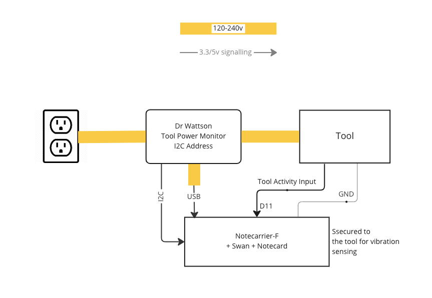

# Tool Cycle-Usage Tracking

Monitor digital inputs, monitor power inputs, monitor vibration, optionally alert when vibration is out of range when the tool is active.

## Solution Overview

This solution uses a [Dr. Wattson energy monitoring board] to monitor a tool's power supply and power usage. The tool, or a component connected to the tool, provides a 3.3-5v digital signal indicating when the tool is active. You can configure the solution with upper and lower thresholds for voltage, current and power, and receive alerts when the monitor detects values out of range. The solution also senses vibration using the Notecard's built-in accelerometer, and this too can be used to generate alerts for over vibration.

The solution comprises hardware, firmware, Notehub environment variables and jsonata scripts.

## You Will Need

  * [Blues Starter Kit](https://shop.blues.io/collections/blues-starter-kits), that contains amongst other items
    * [Notecarrier F](https://shop.blues.io/products/notecarrier-f)
    * [Swan](https://shop.blues.io/collections/swan)
    * [Notecard](https://shop.blues.io/collections/notecard)
    * [Molex Cellular Antenna](https://shop.blues.io/collections/accessories/products/flexible-cellular-or-wi-fi-antenna)
  * [Dr. Wattson Energy Monitoring Board](https://www.upbeatlabs.com/wattson/)
  * [ProtoStax Enclosure for Dr. Wattson](https://www.protostax.com/products/) or similar enclosure
  * [female-to-JST qwiic cable assembly](https://www.adafruit.com/product/4397)
  * USB power brick and micro-USB cable

To create a power monitor around the Dr. Wattson energy monitor board you will need:

  * Male-to-female grounded extension cable or suitable cables to wire an IEC or NEMA AC inlet and outlet to Dr. Wattson. 16 gauge is recommended as the minimum dimension. Please select a suitable wiring gauge for the maximum load required from the equipment being monitored.

  * Corded female NEMA socket for USB power, 18-gauge diameter minimum, such as a spliced male-to-female 18-gauge extension cable.

  * 2 18-gauge color-coded insulated wires to power the Dr. Wattson board. (This can be taken from the extension cable used to build the USB power outlet.)

Tools required:

  * Soldering iron (to melt and bridge solder jumpers on the Dr. Wattson board for I2C address configuration)
  * Wire cutter and stripper
  * Spade connectors or solder
  * Crimper to crimp AC wires to spade connectors (if used)
  * Heat shrink tubing and a source of heat, such as a heat gun
  * Philips screwdriver


## Dr. Wattson Energy Monitor Build

The Dr. Wattson energy monitoring board monitors power by being looped into the mains AC wiring that powers the tool you want to monitor. Additionally, solder jumpers are configured to select the I2C address of the Dr. Wattson board.

Please see [Dr. Wattson Energy Monitor build](../08-power-quality-monitor/drwattson-build.md) for build instructions.

With the build complete, you will have two power monitors, each with an AC inlet and two AC outlets, like this


## Hardware Setup

1. Assemble the Notecard, Notecarrier and antenna as described in our [quickstart tutorial](https://dev.blues.io/quickstart/notecard-quickstart/notecard-and-notecarrier-f/).

2. On the Notecarrier, ensure the `DFU` DIP switch set to `ON`, which maps `AUX RX/TX` over to `F_TX/F_RX` so that notifications can be sent to the host via a serial connection. (see [`card.aux.serial`](https://dev.blues.io/api-reference/notecard-api/card-requests/#card-aux-serial))

3. Similarly, set the Notecarrier's `SWITCHED` DIP switch to the `ON` position.

4. Connect the two I2C Qwiic cables between the Notecarrier and Dr. Wattson boards:

   * With the Dr. Wattson board laid out with the 8 pins pointing at you, connect the jumper connectors as follows:
      ```
      BLACK  RED  NC  NC  NC  NC  BLUE  YELLOW
      ```
    

    * Insert the Qwiic JST connector into one of the `F_I2C` connectors on the edge of the Notecarrier-F next to the USB port. You may also connect it to the I2C connector on the Swan.

5. Connect the Swan to your computer using a micro-USB cable. This is so that the firmware can be uploaded to the Swan.

6. Connect the Notecarrier to your computer using a micro-USB cable. This is only necessary if you later use the in-browser terminal to configure the Notecard.

7. Insert the JST connector on the LiPo battery into the socket marked "LIPO" on the Notecard.


## Notehub

Sign up for a free account on [notehub.io](https://notehub.io) and [create a new project](https://dev.blues.io/quickstart/notecard-quickstart/notecard-and-notecarrier-pi/#set-up-notehub).

## Application Firmware

The application firmware found under the [firmware](./firmware/) folder can be built using these development environments:

* PlatformIO extension for Visual Studio Code
* Arduino extension for Visual Studio Code
* Arduino IDE

We recommend using one of the VS Code extensions, since they are easier to set up and use, and provide a comprehensive development experience. However, if you're familiar with the Arduino IDE, that can be used as well but requires a little more setup.

### PlatformIO extension for VS Code

There is no special setup required for the project beyond what is normally required to configure a PlatformIO project in VSCode. [This tutorial](https://dev.blues.io/quickstart/swan-quickstart/#using-the-vs-code-platformio-extension) explains how to install and use the PlatformIO.

The PlatformIO project is located in the `firmware` folder, where you'll find `platformio.ini` that configures the project, including libraries required, location of the sources and compile-time definitions required.

### Arduino Extension for VS Code

The source code for the Arduino project is under [`firmware/notepower/`](firmware/notepower/) in this repository. We have included the correct configuration in `.vscode/arduino.json` which selects the Swan board as the build target and configures the required compiler options.

Before building the project, you will need to install the required [libraries](#libraries) listed below.

### Arduino IDE

Before compiling and uploading the sketch, be sure to install the STM32Duino board support package. The tutorial [Using the Arduino IDE](https://dev.blues.io/feather-mcus/swan/using-arduino-ide-with-swan/) in the Swan documentation shows how to install support for Swan in Arduino IDE and how to compile and upload firmware.

You will also need to install the required libraries, and increase the serial receive buffer size, detailed below.

#### Increasing the Serial Receive Buffer Size

The Arduino framework by default provides a very small Serial input buffer, which means that if a developer wishes to use the serial port in a way that receives a large volume of data quickly, the data will be truncated and missed.

The workaround, which is required by this sketch, is to add a compiler flag that increases the serial buffer size.

  1. Close the Arduino IDE if it is currently open.

  2. Find the location of the `platform.txt` file for the board that you are building for. When building for Swan, which is an STM32 board supported by STM32Duino, this is located at
      Mac: `~/Library/Arduino15/packages/STMicroelectronics/datasheets/stm32/2.3.0`
      Windows: `%HOME$/AppData/Local/Arduino15/packages/STMicroelectronics/datasheets/stm32/2.3.0`

  3. Create a file in that directory called `platform.local.txt` containing this line:

```
compiler.cpp.extra_flags=-DSERIAL_RX_BUFFER_SIZE=4096
```

This will increase the receive buffer size to what you need for this sketch.

#### Libraries

When using the Arduino extension for VS Code, or the Arduino IDE, install these libraries using the Library Manager before building the sketch:

* UpbeatLabs MCP39F521
* Blues Wireless Notecard

#### Arduino IDE - Compiling/Uploading

To compile and upload the power monitoring firmware, open the sketch at [`firmware/notepower/notepower.ino`](firmware/notepower/notepower.ino) from this repo.

### Configuring the ProductUID

There are two ways to configure the ProductUID created in the Notehub setup above - either using the in-browser terminal to send a request to the Notecard, or by editing the firmware source code. For more details on what the ProductUID is and how it set it please see [this guide](https://dev.blues.io/notehub/notehub-walkthrough/#finding-a-productuid).

#### Using the In-browser terminal

1. Connect the Notecarrier to your computer using a micro USB cable.
2. Launch the in-browser terminal at [blues.dev](https://dev.blues.io/terminal/)
3. Click the "USB Notecard" button under "Connect a Notecard".
4. Select the Notecard to connect to and click "Connect".
5. The terminal will display the firmware version of Notecard.
6. You can now enter a request to set the ProductUID and Serial Number of the device.

```json
{"req":"hub.set", "product":"<your-productUID-from-notehub>", "sn":"<tool-name>-monitor"}
```

You can also omit the serial number and use Notehub to set it:

1. Open the project in Notehub.
2. From the list of devices, double click the device that has the serial number you want to set.
3. In the "Summary" tab, use the pencil icon to edit the Serial Number field.

#### Editing the Source Code

You can also set the ProductUID in the source code. Open `app.h` in your IDE and edit the line

```c++
#define PRODUCT_UID ""		// "com.my-company.my-name:my-project"
```

pasting in the ProductUID from your notehub project between the first pair of quotes.


## Electrical Connections

The primary electrical connections are based around the Dr. Wattson monitoring board. The board's line input is plugged into your AC outlet and the tool is plugged into the board's AC load outlet. A USB power brick is also connected to the 18-guage USB power outlet that you added to the board.



During development and testing, you will typically power the Notecarrier and Swan via USB cables from your computer. When the application is deployed, you will use the USB power adapter plugged into monitor's USB power outlet.

## Testing

To ensure the setup is working as expected, it's a good idea to test the application before deploying it in a real-world setting.

For testing, you will need a suitable tool to monitor and optionally measure the vibration of . We used a desk fan with off, low, medium and high settings that allows power consumption to be regulated with increasing vibration at higher speeds.

## Configure Vibration and Power Monitoring

You configure the app using a number of environment variables. Configuration includes how often regular power monitoring events are sent, and the thresholds for anomalous vibration and electrical behavior that trigger an alert.

Alerts are sent when the current, voltage, power or vibration is outside the configured range or when a change greater than a given percent is detected.

These are the environment variables that you can configure according your use case:

* `heartbeat_mins`: how many minutes between sending power notifications. The default is`0` which means do not send regular power monitoring events, only send alerts. Sending a heartbeat event periodically provides regular monitoring of the source supply and equipment supply.

* `alert_under_voltage`, `alert_over_voltage`: send an alert when the measured voltage is above or below the specified values in Volts. The default setting is `0` where no alerts are sent regardless of the measured voltage.
* `alert_change_voltage_percent`: send an alert when the voltage changes by more than the given percent. The default value is `15`, which sends an alert when a 15% or greater change is detected. Set to `0` to disable percentage change alerts.

* `alert_under_current_amps`, `alert_over_current_amps`: send an alert when the measured current is above or below the specified values in Amps. The default setting is `0` where no alerts are sent regardless of the measured current.
`alert_change_current_percent`: send an alert when the measured current changes by more than the given percent. The default value is `15`, which sends an alert when a 15% or greater change is detected. Set to `0` to disable percentage change alerts.

* `alert_under_power_watts`, `alert_over_power_watts`: send an alert when the measured power is above or below the specified values in Watts. The default setting is `0` where no alerts are sent regardless of the measured power.
* `alert_change_power_percent`: send an alert when the measured power changes by more than the given percent. The default value is `15`, which sends an alert when a 15% or greater change is detected. Set to `0` to disable percentage change alerts.

These environment variables are set in Notehub, either per-device, per-fleet or per-project. For example, if you want all monitored equipment to send power monitoring events every 5 minutes, you would set `heartbeat_mins` to `5` at the project level in Notehub.

Please see our tutorial [Understanding Environment Variables](https://dev.blues.io/guides-and-tutorials/notecard-guides/understanding-environment-variables/) for a fuller description of how to set environment variables in Notehub.


### Vibration Monitoring and Alerts

The Notecard accelerometer is used to sense vibration. Tool usage can be inferred from the measured vibration by setting environment variables that define the expected vibration characteristics. These variables define thresholds of vibration for when the tool is inactive and active. For details on how to determine the appropriate vibration thresholds, see [Determining Vibration Thresholds](#determining-vibration-thresholds) below.

These environment variables define the vibration thresholds:

* `alert_off_vibration`: the *maximum* vibration expected when the tool is *inactive*. Minimum value is `0`, which is also the default. Must be less than or equal to `alert_under_vibration`.

* `alert_under_vibration`: the *minimum* vibration expected when the tool is *active*. Must be equal or greater than `alert_off_vibration` and less than `alert_over_vibration`. The default value is `0`.

* `alert_over_vibration`: the *maximum* vibration expected when the tool is *active*. Must be greater than `alert_under_vibration`.

<a name="vibration-category"></a>
With these variables defined, the measured vibration is classified into into one these vibration categories:

* `none`: when vibration is less than or equal to `alert_off_vibration`

* `low`: when vibration is between `alert_off_vibration` and `alert_under_vibration`

* `normal`: when vibration is between `alert_under_vibration` and `alert_over_vibration`

* `high`: when vibration is greater than `alert_over_vibration`

The `vibration` property is added to power events with the values `none`, `low`, `normal`, `high` corresponding to the vibration categories above. The raw vibration value is also included, as `vibration_raw: 123.45`.

When `alert_off_vibration`, `alert_under_vibration` and `alert_over_vibration` are all undefined or `0`, vibration is not sensed. Otherwise, vibration is sensed and vibration data is included with power monitoring events and alerts.

An alert is sent when the vibration is classified as `low` or `high`, which indicates vibration is outside of expected operating parameters. When a vibration alert is triggered, the `alert` property includes the word `vibration`, indicating the alert happened because of too little or too much vibration.

### Instance number

Each power monitor is given an instance number from 1-4. The instance numbers correspond to the I2C address of the monitoring board:

* instance 1: I2C address `0x74`
* instance 2: I2C address `0x75`
* instance 3: I2C address `0x76`
* instance 4: I2C address `0x77`

For example, should your two monitors be configured at addresses `0x74` and `0x75` then these will be reported as instance 1 and instance 2.

## Tool Activity Lines

Four digital inputs act as activity sensors. Each Dr. Wattson instance is associated with a GPIO pin that indicates activity of the tool monitored by that instance:

* instance 1: pin D10, 3.3v tolerant
* instance 2: pin D11, 5v tolerant
* instance 3: pin D12, 5v tolerant
* instance 4: pin D13, 3.3v tolerant

In this solution, we configured our monitor with the I2C address `0x75` which corresponds to instance 2. This is why `D11` was labelled as the activity line for the tool in the [electrical schematic](#electrical-connections) above. If your monitor board is configured to a different address, then use the corresponding pin as described above.

To monitor a given activity line, you set the environment variable `inputX=true` to enable sensing on that line, where `X` is the instance number. For example `input2=true` sets `D11` as a GPIO input, and the logic level sensed on that pin is reported in monitoring events (from instance 2) via the `active` property.

## Power Alerts and Tool Activity

In addition to monitoring the activity level of the tool with (`inputX=true`), you can configure the app to add additional behaviors that correlate the measured power with activity:

* `alert_power_activity_[1-4]=load`: Correlates alerts for a given instance with the state of the instance's activity pin. With the `load` setting, the line power is checked against the activity state. When the pin is low, which indicates the tool is not active, line current and power are expected to be close to zero and voltage is expected to be within the over/under voltage configuration, since the load is continuously powered, but does not consume power when inactive. When the activity pin is high, line voltage, current and power are expected to be within the voltage, current and power ranges configured.

In this solution, the tool is monitored by instance 2, using the corresponding activity line (`D11`) to indicate when the tool is active, and so `alert_power_activity_2=load` is the setting used.

### Vibration Alerts and Tool Activity

For a tool that is on continuously, the vibration configuration described [above](#vibration-monitoring-and-alerts) is sufficient to monitor vibration and send alerts for `low` or `high` vibration.

However, when monitoring a tool that is only active some of the time, it makes little sense to report a vibration alert due to low vibration when the tool is inactive. The `alert_vibration_activity_line` environment variable can be used to correlate the activity of the tool with the measured vibration:

 * `alert_vibration_activity_line` 1-4: indicates which activity line shows the activity of the tool. When this environment variable is defined, it correlates vibration alerts based on the activity of the tool and the vibration sensed:

  * When the tool is inactive, a vibration alert is sent when the vibration is not `none`.
  * When the tool is active, a vibration alert is sent when the vibration is not `normal`.

The alert is triggered on the instance specified in `alert_vibration_activity_line`.  When `alert_vibration_activity_line` is `0` or undefined, the vibration data and alerts are present on all lines.

Vibration alerts are suppressed for the startup and shutdown period given for the corresponding line.


### Tool Startup and Shutdown Duration

These variables describe how long it takes for the tool to startup or shutdown, or equivalently, for the electrical load and vibration to reach steady state. Power and vibration alerts related to activity are suppressed during the startup and shutdown period to avoid false alerts.

* `power_activity_startup_secs_[1-4]`: the duration, in seconds, for how long it takes the power level to stabilize on becoming active. Alerts are suppressed for this period when a line goes from inactive to active. The default value is `0`.

* `power_activity_shutdown_secs_[1-4]`: the duration, in seconds, for how long it takes for the power level to stabilize on becoming inactive.  Alerts are suppressed for this period when a line goes from active to inactive. The default value is `0`.


### Determining Vibration Thresholds

The raw vibration measurement is used to determine the vibration level is derived from the movements of the accelerometer. The value is somewhat arbitrary and not calibrated, although it is consistent.

The simplest way to find out the values for the vibration variables is to measure the vibration reported when the tool is off and during normal use. Here's an outline of the process:

1. Start with none of the vibration environment variables defined, and the tool inactive.
2. Set `heartbeat_mins` to `1` to enable more frequent monitoring.
3. Enable vibration sensing by setting `alert_under_vibration` to `1`.
4. With the tool still inactive, inspect the events in Notehub sent to `power.qo`, in particular the `vibration_raw` value.
5. Make a note of the highest reported `vibration_raw` value. This will serve as a guide for setting the `alert_off_vibration` variable.
6. Switch on the tool, and when fully started, continue monitoring the events for a number of minutes, using the tool in its normal modes of operation.
7. Make a note of the highest and lowest `vibration_raw` values reported. These will serve as a guide for setting the `alert_under_vibration` and `alert_over_vibration` variables.

> **Note**: In order to accurately sense vibration, the Notecarrier must be secured to the tool and must be level with the ground. This is so the acceleration due to gravity can be accounted for when determining vibration from the accelerometer data.

Using the vibration values collected above, set the `alert_off_vibration`, `alert_under_vibration` and `alert_over_vibration` values. Again, with the tool inactive, and in normal use, inspect the `vibration` property to ensure it is `none` when the tool is not in use, and `normal` when it is in use.

Should you see any vibration measurements of `low` or `high`, then adjust the vibration thresholds accordingly. You may need to set `power_activity_startup_secs_X` and `power_activity_shutdown_secs_X` variables to avoid spurious `low` or `high` values as the tool is starting up or shutting down.


## Example Configuration

With a 120v supply, this configuration monitors input power to the relay, and the relay's output power  sends alerts when either fails:

| Environment variable name | Value  | Description                                    |
| :------------------------ | :----: | :------------------------------------------------------------|
| `heartbeat_mins`          | 5      | Send power monitoring events every 5 minutes. |
| `alert_under_voltage`     | 100    | Send an alert when voltage is less than 100v. |
| `alert_over_voltage`      | 135    | Send an alert when voltage is above 135v. |
| `input2`                  | true   | Sense load activity via input 2 (`D11`). |
| `alert_power_activity_2`  | supply | Correlate the tool power with activity. |
| `power_activity_startup_secs_2` | 10 | Allow 10 seconds for the tool to start up. |
| `power_activity_shutdown_secs_2` | 10 | Allow 10 seconds for the tool to shut down. |
| `alert_off_vibration` | 10 | Minimal vibration when the tool is not in use. |
| `alert_under_vibration` | 100 | Vibration level with a margin below the lowest vibration sensed when the tool is active. |
| `alert_over_vibration` | 150 | Vibration level with a margin above the highest vibration sensed when the tool is active. |
| `alert_vibration_activity_line` | 2 | Correlate sensed vibration with tool activity from input 2. |


## Events

A power monitoring event is sent every `heartbeat_mins` minutes or when an alert is sent.
Events are sent to the notefile `power.qo`, and have this structure in the event body:

```json
{
    "instance": 1,          // which of the connected Dr. Wattson monitors reported the event
    "current": 0.2846,      // Line RMS current (A)
    "frequency": 59.8125,   // Line AC frequency (Hz)
    "power": 7.9,           // Line Power (Watts)
    "voltage": 118.6        // Line RMS voltage (V)
}
```

Regular monitoring events are not immediately synched to Notehub, but are sent once per hour, as given by the `outbound` property in the `hub.set` request. You can change this behavior by setting the preprocessor symbol `SYNC_POWER_MONITORING_NOTES` in [`app.h`](./firmware/notepower/app.h#L20).

The event body also includes these named values:

* `reactivePower`: The measured reactive power (in VAR).
* `apparentPower`: The measured apparent power (in VA).
* `powerFactor`: The power factor - active power divided by apparent power.
* `active`: Set to True to indicate the corresponding instance pin is active.
* `vibration_raw`: The amount of vibration sensed.
* `vibration`: The vibration category (when [vibration thresholds](#vibration-monitoring-and-alerts) are configured).

> Note: When a property in an event is zero, or false, it is not present in the event routed to notehub. For more details see [How the Notecard works with JSON](https://dev.blues.io/notecard/notecard-walkthrough/json-fundamentals/#how-the-notecard-works-with-json).

### Alerts

When the device detects an alert condition, such as over or under voltage, current or power, or detects a change in these greater than the configured percentage, an alert event is sent immediately to Notehub. An alert event has the same properties as a power monitoring event, with the additional property `alert` that lists the comma-separated reasons for the alert. Depending upon the cause of the alert, you may see one or more of these values present:

* `undervoltage`, `overvoltage`: the measured RMS voltage is not within the bounds set by the environment variables `alert_under_voltage` and `alert_over_voltage`.

* `voltage`: the measured voltage changed by more than the percent specified in the environment variable `alert_change_voltage_percent`.

* `undercurrent`, `overcurrent`: the measured RMS current is not within the bounds set by the environment variables `alert_under_current_amps`, `alert_over_current_amps`.

* `current`: the measured current changed by more than the percent specified in the environment variable `alert_change_current_percent`.

* `underpower`, `overpower`: the measured active power is not within the bounds set by the environment variables  `alert_under_power_watts` and `alert_over_power_watts`.

* `power`: the measured active power changed by more than the percent specified in the environment variable `alert_change_power_percent`.


#### Power Control Alerts

These alerts are produced for a given instance when the corresponding `alert_power_activity_X` variable is set.

* `novoltage`,`nocurrent`: no voltage or current is detected when the control pin is high, indicating a supply or load should be present, but isn't.

* `inactivevoltage`, `inactivecurrent`: voltage or current is detected when the control pin is low, indicating the supply or load should be off, but isn't.

#### Vibration Anomaly Alert

The `vibration` alert is sent when the vibration thresholds are set and the measured vibration does not correspond with what is expected. See [Vibration Monitoring and Alerts](#vibration-monitoring-and-alerts) and [Vibration Alerts and Tool Activity](#vibration-alerts-and-tool-activity).

## Routing Data out of Notehub

Now that we have power monitoring events and alerts available, routing them from Notehub is our next step.

Notehub supports forwarding data to a wide range of API endpoints by using the Route feature. This can be used to forward your power monitoring data to external dashboards and alerts to a realtime notification service.  Here, we will use Twilio SMS API to send a notification of an alert to a phone number.

For an introduction to Twilio SMS routes, please see our [Twilio SMS Guide](https://dev.blues.io/guides-and-tutorials/twilio-sms-guide/).

1. Fill out the required fields for the Twilio SMS route, including "from" and "to" phone numbers, where "from" is your virtual Twilio number, and "to" is the number of the phone that receives the alerts. We will not be using placeholders for these numbers, but will use a placeholder for the message, so set the message field to `[.body.customMessage]`.

2. Under "Notefiles", choose "Selected Notefiles", and check `power.qo` from "Include These Notefiles".

3. Under "Data", select "JSONata Expression" and copy and paste the contents of [jsonata/route.jsonata](jsonata/route.jsonata) into the text field "Insert your JSONata expression here".

4. Click "Save Changes".

### Testing the Route

The ideal test is to use the app firmware to generate alerts. However, it's also possible to simulate an event by pasting these JSON snippets into the the in-browser terminal.

This is a regular power monitoring event. It does not generate an SMS alert.

```json
{ "req": "note.add", "file":"power.qo", "sync": true, "body": {
  "current":2.34, "frequency":60, "power":56.67, "voltage":230.12, "instance":2, "active":true,
}}
```

This is an alert event (due to the presence of the `alert` property), which will result in an SMS message being sent to the phone number in the "to" field.

```json
{ "req": "note.add", "file":"power.qo", "sync": true, "body": {
  "current":2.34, "frequency":60, "power":56.67, "voltage":230.12, "alert":"overcurrent,power", "instance":2, "active":true, "vibration":"normal", "vibration_raw":123
}}
```

This will send a SMS that looks like this:

> Power alert from &lt;serial-number&gt; tool active: yes: overcurrent,power. 120V, 25A, 3000W. vib.: normal,123.

These are the parts of the message:

* The first part of the message indicates which device the alert pertains to by its serial number, here &lt;serial-number&gt;.

* The activity state comes next, indicating whether the tool is in use or not.

* The alerts are next. Here, "overcurrent" and "power" alerts indicate that the measured current was higher than the `alert_over_current_amps` environment variable, and that power changed by more than `alert_change_power_percent`.

* After that we have the power information, showing the measured voltage, current and power at the time of the alert.

* Lastly come the vibration details, showing the [vibration category](#vibration-category)

## Blues Community

We’d love to hear about you and your project on the [Blues Community Forum](https://discuss.blues.io/)!


[Dr. Wattson Energy Monitoring Board]: https://www.upbeatlabs.com/wattson/
