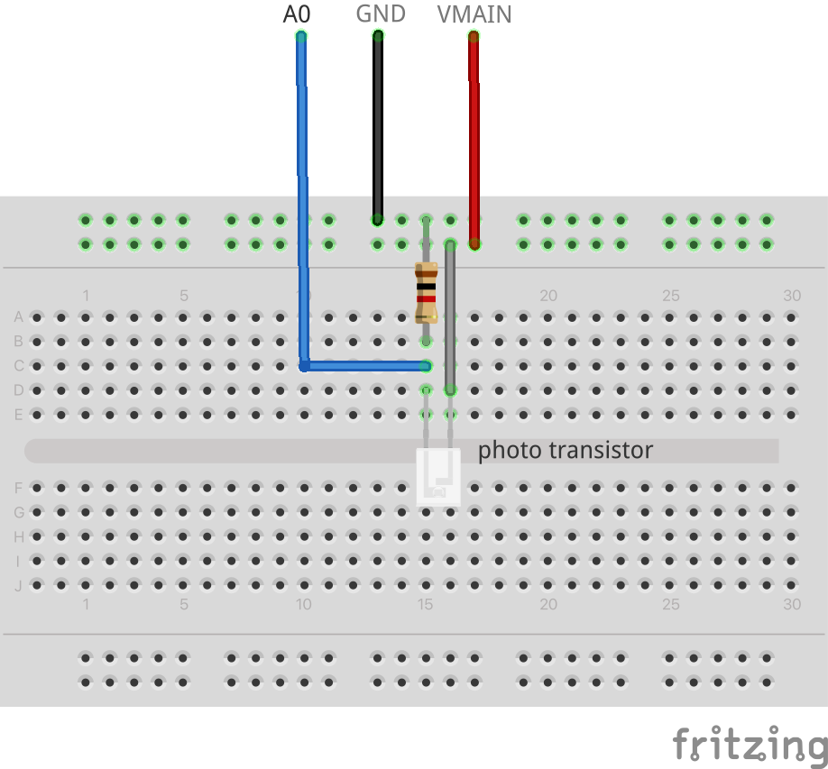
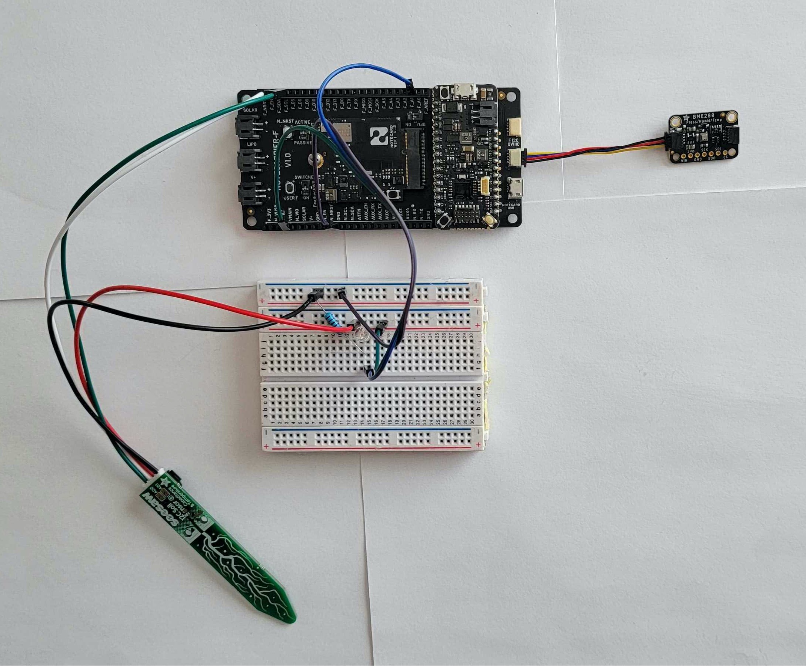
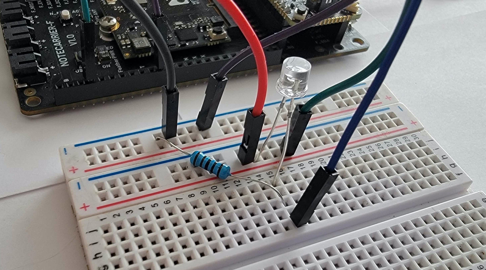

# Greenhouse Monitor

Monitor ambient light and temperature, soil moisture and soil temperature and send alerts
when any of these fall outside specified ranges.

- [Greenhouse Monitor](#greenhouse-monitor)
  - [Solution Summary](#solution-summary)
  - [You Will Need](#you-will-need)
  - [Hardware Setup](#hardware-setup)
  - [Notehub](#notehub)
  - [Application Firmware](#application-firmware)
    - [PlatformIO extension for VS Code](#platformio-extension-for-vs-code)
    - [Arduino Extension for VS Code](#arduino-extension-for-vs-code)
    - [Arduino IDE](#arduino-ide)
      - [Libraries](#libraries)
      - [Arduino IDE - Compiling/Uploading](#arduino-ide---compilinguploading)
    - [Configuring the ProductUID](#configuring-the-productuid)
      - [Using the In-browser terminal](#using-the-in-browser-terminal)
      - [Editing the Source Code](#editing-the-source-code)
  - [Testing](#testing)
    - [App Configuration](#app-configuration)
    - [Sensor Names](#sensor-names)
    - [Monitoring Events](#monitoring-events)
    - [Configuration Updates and Errors](#configuration-updates-and-errors)
  - [Alerts](#alerts)
    - [Alert Events](#alert-events)
    - [Soil Moisture and Light Level](#soil-moisture-and-light-level)
  - [Deploying to a Greenhouse](#deploying-to-a-greenhouse)
  - [Blues Community](#blues-community)


## Solution Summary

This app provides a simple to construct greenhouse monitoring device that can be deployed inside a greenhouse. The app monitors soil moisture and soil temperature as well as ambient light and ambient temperature. Using off-the-shelf hardware and modular components, you can use this solution to add monitoring to an existing greenhouse.

## You Will Need
  * A [Blues Starter Kit](https://shop.blues.io/collections/blues-starter-kits), that contains amongst other things
    * [Notecarrier F](https://shop.blues.io/products/notecarrier-f)
    * [Swan](https://shop.blues.io/collections/swan)
    * [Notecard](https://shop.blues.io/collections/notecard)
    * [Molex Cellular Antenna](https://shop.blues.io/collections/accessories/products/flexible-cellular-or-wi-fi-antenna)
  * [Adafruit BME280](https://www.adafruit.com/product/2652)
  * [Photo transistor](https://www.adafruit.com/product/2831)
  * [Adafruit STEMMA Soil Sensor](https://www.adafruit.com/product/4026)
  * [JST PH 2mm 4-pin male header cable](https://www.adafruit.com/product/3955)
  * [Qwiic 4-pin JST connector cable](https://www.adafruit.com/product/4399)
  * 1k&Omega; resistor
  * 3 [male-to-male jumper cables](https://www.adafruit.com/product/1957)
  * [half size breadboard](https://www.adafruit.com/product/4539)


## Hardware Setup

1. Assemble the Notecard, Notecarrier and antenna as described in our [quickstart tutorial](https://dev.blues.io/quickstart/notecard-quickstart/notecard-and-notecarrier-f/).

2. Connect the I2C Qwiic cable between the Notecarrier and the BME280 breakout board:

    1. Insert the Qwiic JST cable connector into one of the `F_I2C` connectors on the edge of the Notecarrier-F next to the USB port. You may also connect it to the I2C connector on the Swan.

    2. Insert the other end of the Qwiic JST cable into one of the JST connectors on the BM280 breakout board.

3. Connect the photo transistor:

   1. Connect the 3 jumper wires between the Notecarrier and breadboard as follows
      * `GND` on Notecarrier to the negative rail at the edge of the breadboard
      * `VMAIN` on Notecarrier to the positive power rail at the edge the breadboard
      * `A1` on Notecarrier to a row of points on the breadboard

    2. Insert one leg of the 1k&Omega; resistor into the ground rail, and the other leg to the same row of points connected to `A1` in last step above.

    3. Insert the longer leg of the photo transistor into the positive power rail, and the shorter leg into the same row of points as the A1 wire.

    

4. Connect the STEMMA connector to the soil sensor. Connect the colored male jumper wires at the other end of the cable as follows:

   * <span style="color:black;background:white">BLACK</span> to the negative power rail on the breadboard.
   * <span style="color:red">RED</span> to the positive power rail on the breadboard.
   * <span style="color:white;background:grey">WHITE</span> to `SDA` on the Notecarrier.
   * <span style="color:green">GREEN</span> to `SCL` on the Notecarrier.

  The assembled hardware should look similar to this:
  
  

5. Connect the Swan to your computer using a micro-USB cable. This is so that the firmware can be uploaded and allows the app to be monitored over USB serial.

6. Optionally, connect an SWD programmer, such as ST-Link Mini, to the Swan using the ribbon cable, and to your computer using a micro-USB cable. This makes it possible to upload firmware without needing to press buttons on the Swan and enables step debugging with the VSCode IDE.

## Notehub

Sign up for a free account on [notehub.io](https://notehub.io) and [create a new project](https://dev.blues.io/quickstart/notecard-quickstart/notecard-and-notecarrier-pi/#set-up-notehub).

This solution can be used to monitor a single greenhouse, or monitor multiple greenhouses at a facility by deploying multiple instances of this app. When monitoring multiple greenhouses at a facility, it can be useful to group the monitors at a facility into a Fleet. For more details, see [The Fleet Administrator's Guide](https://dev.blues.io/guides-and-tutorials/fleet-admin-guide/).

## Application Firmware

The application firmware is found under the [firmware](./firmware/) folder and can be built and uploaded to Swan using these development environments:

* PlatformIO extension for Visual Studio Code
* Arduino extension for Visual Studio Code
* Arduino IDE

We recommend using the PlatformIO extension for Visual Studio Code, as this is the easiest to set up and use, and provides a comprehensive development experience. However, if you're familiar with the Arduino IDE, that can be used as well but requires a little more setup.

### PlatformIO extension for VS Code

There is no special setup required for the project beyond what is normally required to configure a PlatformIO project in VSCode. [This tutorial](https://dev.blues.io/quickstart/swan-quickstart/#using-the-vs-code-platformio-extension) explains how to install and use PlatformIO.

The PlatformIO project is located in the `firmware` folder, where you'll find `platformio.ini` that configures the project, including the libraries required, location of the sources and compile-time definitions required.

### Arduino Extension for VS Code

The source code for the Arduino project is under [`firmware/greenhouse/`](firmware/greenhouse/) in this repository folder. We have included the correct configuration in `.vscode/arduino.json` which selects the Swan board as the build target and configures the required compiler options.

Before building the project, you will need to install the required [libraries](#libraries) listed below.

### Arduino IDE

Before compiling and uploading the sketch, be sure to install the STM32Duino board support package. The tutorial [Using the Arduino IDE](https://dev.blues.io/quickstart/swan-quickstart/#using-the-arduino-ide) in the Swan Quickstart shows how to install support for Swan in Arduino IDE and how to compile and upload firmware.

You will also need to install the required libraries.

#### Libraries

When using the Arduino extension for VS Code, or the Arduino IDE, install these libraries using the Library Manager before building the sketch:

* Blues Wireless Notecard
* Adafruit Seesaw
* Adafruit BusIO (dependency of Adafruit seesaw)
* Adafruit BME280 sensor

#### Arduino IDE - Compiling/Uploading

To compile and upload the app firmware, open the sketch at [`firmware/greenhouse/greenhouse.ino`](firmware/greenhouse/greenhouse.ino) in the Arduino IDE.


### Configuring the ProductUID

Before uploading the app firmware, you should set the `ProductUID` to correspond to the project you created in [Notehub setup](#notehub) earlier.

There are two ways to configure the `ProductUID`, either using the in-browser terminal to send a request to the Notecard, or by editing the firmware source code. For more details on what the `ProductUID` is and how it set it please see [this guide](https://dev.blues.io/notehub/notehub-walkthrough/#finding-a-productuid).

#### Using the In-browser terminal

1. Connect the Notecarrier to your computer using a micro-USB cable.
2. Launch the in-browser terminal at [blues.dev](https://dev.blues.io/notecard-playground/)
3. Click the "USB Notecard" button under "Connect a Notecard".
4. Select the Notecard to connect to and click "Connect".
5. The terminal will display the firmware version of the Notecard.
6. You can now enter a request to set the ProductUID and Serial Number of the device.

```json
{"req":"hub.set", "product":"<your-productUID-from-notehub>", "sn":"greenhouse-monitor"}
```

You can also omit the serial number and use Notehub to set it:

1. Open the project in Notehub.
2. From the list of devices, double click the device whose serial number you want to set.
3. In the "Summary" tab, use the pencil icon to edit the "Serial Number" field.

#### Editing the Source Code

You can also set the `ProductUID` in the source code. Open `app.h` in your IDE and edit the line

```c++
#define PRODUCT_UID ""		// "com.my-company.my-name:my-project"
```

pasting in the `ProductUID` from your Notehub project between the first pair of quotes.


## Testing

To ensure the setup is working as expected, it's a good idea to test the application before deploying it in a real-life setting. The following sections describe how to configure and use the app.

### App Configuration

The app is configured using environment variables to set

* how often environment variables are checked,
* how often the sensors are read and checked for alerts, and
* how often monitoring events are sent.

These variables control the overall app behavior:

* `environment_update_mins` How often (in minutes) to check for environment variable updates from the Notecard. When not set, the default value is 5 minutes.

* `monitor_secs`: How often (in seconds) to read the current values from the sensors and check for alerts. When not set, the default value is 15 seconds.

* `report_mins` How often (in minutes) to report the current values from sensors to `greenhouse.qo`. When not set, the default value is 5 minutes.

You set these environment variables in Notehub. See our tutorial [Understanding Environment Variables](https://dev.blues.io/guides-and-tutorials/notecard-guides/understanding-environment-variables/) for a fuller description of how to set environment variables in Notehub.


### Sensor Names

The app senses and reports these values:

* `air_temp`: the air temperature in Celsius

* `air_humidity`: the relative humidity as a percent

* `air_pressure`: the air pressure in kPa

* `soil_moisture`: an indication of how much moisture is in the soil. A higher value means more moisture, a lower value means less moisture. For more details, see [Soil Moisture and Light Level](#soil-moisture-and-light-level).

* `soil_temp`: the approximate soil temperature from the soil moisture sensor.

* `light_level`: an indication of the ambient light level. A higher value means more ambient light, a lower value means less ambient light. For more details, see [Soil Moisture and Light Level](#soil-moisture-and-light-level).

The sensor names are used both to report the values in monitoring and alert events, and as part of the environment variable names that you use to configure [alert thresholds](#alerts).

### Monitoring Events

The app sends a monitoring event to `greenhouse.qo` every `report_mins` minutes. The event contains
the readings of all sensors.

```json
{
      "air_humidity": 34.414062,
      "air_pressure": 1016.3697,
      "air_temp": 24.15,
      "app": "nf15",
      "light_level": 273,
      "soil_moisture": 344,
      "soil_temp": 26.489365
}
```

When alert thresholds are configured, and one or more sensor readings are outside of the normal range, the event also includes `alert` and `alert_seq` properties to indicate the severity of the alert and the progress of the alert. See the section on [Alerts](#alerts) for details about these properties.

### Configuration Updates and Errors

When environment variables are changed, the app posts an event to `notify.qo`. The event contains details of which values changed and any configuration errors.

For example, setting the environment variable `environment_update_mins` to 1 produces this notification, indicating that the environment variable changed from the default of 5 minutes to 1 minute.

```json
{
    "updates": {
        "environment_update_mins": {
            "new_value": 1,
            "old_value": 5
        }
    }
}
```

Changing several variables, with some of them set incorrectly leads to both updates and errors being present:

```json
{
    "errors": {
        "environment_update_mins": {
            "error": "not a valid whole positive number.",
            "value": "1e"
        },
        "soil_temp_warning_high": {
            "error": "Value is not a number.",
            "value": "abc"
        }
    },
    "updates": {
        "light_level_normal_high": {
            "new_value": 2000
        },
        "light_level_normal_low": {
            "new_value": 20
        }
    }
}
```

## Alerts

In addition to reporting the sensor values, the app can send an alert when a particular sensor value is too high or too low. The app uses environment variables to configure alert ranges for each sensor. The alert ranges are:

* `normal`: Describes the normal range of values for the sensor. The app sends a `warning` alert when the sensor value is higher than the `high` threshold or lower than the `low` threshold.

* `warning`: Describes the range of values for which the app sends a `warning` alert. When defined, values falling outside the `warning` range produce a `critical` alert. Values inside the `warning` range but outside the `normal` range produce a `warning` alert.

You configure the ranges using environment variables that include the sensor name and range to set, following this format:

  * `<sensor-name>_<range>_low`: Configures the lower bound of a range for the named sensor.
  * `<sensor-name>_<range>_high`: Configures the upper bound of the range for the named sensor.

> **Note**: You don't have to configure both `high` an `low` values for a range - the application checks just the thresholds provided.

Some examples:

* `light_level_normal_low=100`: sets the lower bound of normal readings from the `light_level` sensor to 100. A `warning` alert is produced when the `light_level` value is below 100.

* `soil_temp_normal_high=40`, `soil_temp_warning_high=50`: sets the upper bound for normal and warning ranges for the `soil_temp` sensor. With this configuration, alerts are produced as follows:

  * No alert is produced when the soil temperature is below 40.

  * A warning alert is produced when the soil temperature is between 40 and 50.

  * A critical alert is produced when the soil temperature is above 50.


### Alert Events

When the app detects an alert condition, it captures details of the alert and sends an event to `alert.qo`. The event includes the overall alert level (warning/critical) and details of the sensor readings, similar to this:

```json
{
    "alert": "warning",
    "alert_seq": "first",
    "app": "nf15",
    "air_humidity": {
        "status": "ok",
        "value": 34.740234375
    },
    "air_pressure": {
        "status": "ok",
        "value": 1016.686328125
    },
    "air_temp": {
        "status": "ok",
        "value": 23.46999931335449
    },
    "light_level": {
        "alert": "warning",
        "status": "high",
        "value": 279
    },
    "soil_moisture": {
        "status": "ok",
        "value": 342
    },
    "soil_temp": {
        "status": "ok",
        "value": 26.38705444335938
    }
}
```

The event has these properties:

* `alert`: Describes the overall alert level. This is the highest alert level of all of the sensors. Values are `warning`, `critical`, or not present, meaning no alert, which happens when sensor readings return to normal.

* `alert_seq`: Distinguishes between the start of an alert, an ongoing alert, and when an alert has been cleared. The property has these values:

  * `first`: This is set when the first alert event is sent. The event is sent immediately.

  * `ongoing`: This is set when the alert condition is still present and the alert is ongoing. An event is sent every `report_mins` minutes for as long as the alert condition is still present.

  * `cleared`: This is set when the alert condition is no longer present and the alert is cleared. The event is sent immediately at the end of the alert.

 * `status`: Describes the status of a sensor value:

   * `ok`: The sensor value is in normal range, that is, above any configured low threshold and lower than any configured high threshold.

   * `low`: The sensor value is too low.

   * `high`: The sensor value is too high.

>**Note**: The `alert_seq` field makes it easy to detect when an alert starts and stops. You can use this to send external notifications immediately when an alert is detected and when it is cleared. Events with `alert_seq` set to `ongoing` provide periodic reminders that the alert is still ongoing.

### Soil Moisture and Light Level

The `soil_moisture` and `light_level` are scalar readings that correlate to the amount of moisture in the soil and the amount of light, with more moisture and more light resulting is higher values, and less moisture and less light resulting in lower values. We suggest you use the app in the greenhouse for a few days, and t to `greenhouse.qo` to determine the normal ranges for these values. You can then set the environment variables `soil_moisture_normal_low` etc.. to reflect the expected normal range of values.

## Deploying to a Greenhouse

When you deploy the solution in your greenhouse, you will power the Notecarrier from a USB power brick. Additionally you may want to waterproof all of the electronics. Here are some suggestions:

* Waterproof the soil moisture sensor using heat shrink tubing over the top part of the sensor where the electronics are located, and make watertight using smaller gauge heat shrink tubing and/or waterproof tape to seal any small openings.

* Place the breadboard and Notecarrier in a waterproof project box or tupperware container, using rubber cable glands to waterproof the USB cable and soil sensor cable bundle where they exit the enclosure.

* Use heat shrink tubing over the BME280 sensor and/or waterproof tape. You may also place the BME280 sensor in the waterproof box housing the other electronics, although the heat produced by the electronics may slightly raise the temperature inside the box.


## Blues Community

We’d love to hear about you and your project on the [Blues Community Forum](https://discuss.blues.io/)!
