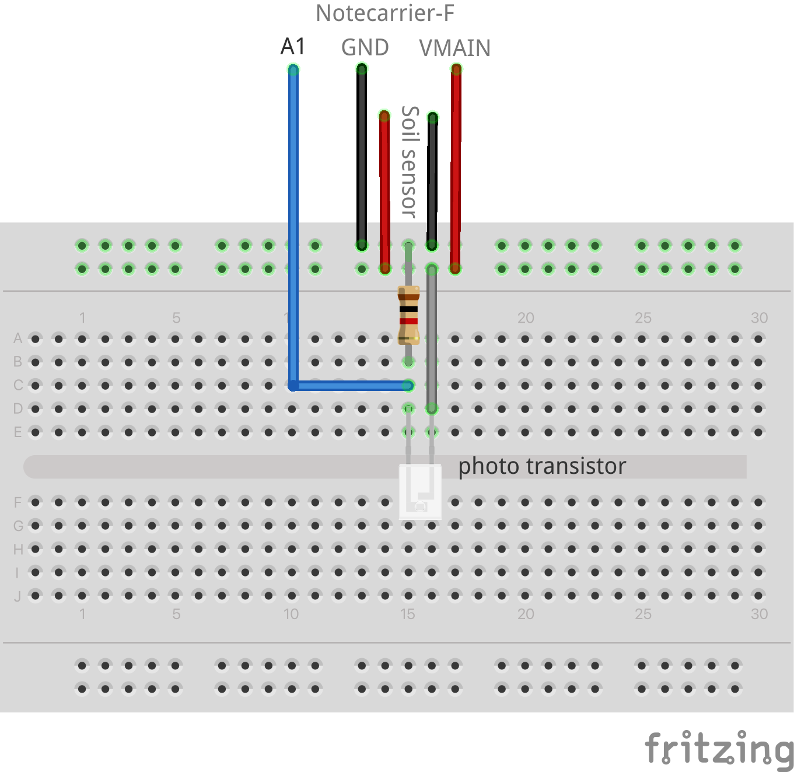

# Greenhouse Monitor

Monitor ambient light and temperature, soil moisture and soil temperature and send alerts
when these fall outside specified ranges.

- [Greenhouse Monitor](#greenhouse-monitor)
  - [Solution Summary](#solution-summary)
  - [You Will Need](#you-will-need)
  - [Hardware Setup](#hardware-setup)
  - [Notehub](#notehub)
  - [Application Firmware](#application-firmware)
    - [PlatformIO extension for VS Code](#platformio-extension-for-vs-code)
    - [Arduino Extension for VS Code](#arduino-extension-for-vs-code)
    - [Arduino IDE](#arduino-ide)
      - [Libraries](#libraries)
      - [Arduino IDE - Compiling/Uploading](#arduino-ide---compilinguploading)
    - [Configuring the ProductUID](#configuring-the-productuid)
      - [Using the In-browser terminal](#using-the-in-browser-terminal)
      - [Editing the Source Code](#editing-the-source-code)
  - [Testing](#testing)
    - [App Configuration](#app-configuration)
    - [Sensor Names](#sensor-names)
    - [Monitoring Events](#monitoring-events)
    - [Configuration Updates and Errors](#configuration-updates-and-errors)
  - [Alerts](#alerts)
    - [Alert Events](#alert-events)
    - [Soil Moisture and Light Level](#soil-moisture-and-light-level)
  - [Blues Community](#blues-community)


## Solution Summary

This app provides a simple to construct greenhouse monitoring device that can be deployed inside greenhouse to monitor soil moisture and temperature and ambient light and temperature. Using off-the-shelf hardware and modular components, this solution can be used to add monitoring to an existing greenhouse.

## You Will Need
  * A [Blues Starter Kit](https://shop.blues.io/collections/blues-starter-kits), that contains amongst other things
    * [Notecarrier F](https://shop.blues.io/products/notecarrier-f)
    * [Swan](https://shop.blues.io/collections/swan)
    * [Notecard](https://shop.blues.io/collections/notecard)
    * [Molex Cellular Antenna](https://shop.blues.io/collections/accessories/products/flexible-cellular-or-wi-fi-antenna)
  * [Adafruit BME280](https://www.adafruit.com/product/2652)
  * [Photo transistor](https://www.adafruit.com/product/2831)
  * [Adafruit STEMMA Soil Sensor](https://www.adafruit.com/product/4026)
  * [JST PH 2mm 4-pin male header cable](https://www.adafruit.com/product/3955)
  * [Qwiic 4-pin JST connector cable](https://www.adafruit.com/product/4399)
  * 1kΩ resistor
  * 3 [male-to-male jumper cables](https://www.adafruit.com/product/1957)
  * [half size breadboard](https://www.adafruit.com/product/4539)


## Hardware Setup

1. Assemble the Notecard, Notecarrier and antenna as described in our [quickstart tutorial](https://dev.blues.io/quickstart/notecard-quickstart/notecard-and-notecarrier-f/).

2. Connect the I2C Qwiic cable between the Notecarrier and the BME280 breakout board:

    1. Insert the Qwiic JST cable connector into one of the `F_I2C` connectors on the edge of the Notecarrier-F next to the USB port. You may also connect it to the I2C connector on the Swan.

    2. Insert the other end of the qwiic JST cable into the BM280 breakout board

3. Connect the phototransistor:

   1. Connect the 3 jumper wires as follows
      * `GND` on Notecarrier to the negative rail at the edge of the breadboard
      * `VMAIN` on Notecarrier to the positive power rail at the edge the breadboard
      * `A0` on Notecarrier to a row of points on the breadboard

    2. Insert one leg of the 1kΩ resistor into the ground rail and the other leg to the same row of points connected to A0 in last step above.

    3. Insert the longer leg of the phototransistor into the positive power rail and the shorter leg into the same row of points as the A0 wire.

    

4. Connect the STEMMA connector to the soil sensor. Connect the colored male jumper wires at the other end of the cable as follows:

   * <span style="color:black;background:white">BLACK</span> to the negative power rail on the breadboard
   * <span style="color:red">RED</span> to the positive power rail on the breadboard
   * <span style="color:white;background:grey">WHITE</span> to SDA on the Notecarrier
   * <span style="color:green">GREEN</span> to SCL on the Notecarrier

5. Connect the Swan to your computer using a micro-USB cable. This is so that the firmware can be uploaded to the Swan.


## Notehub

Sign up for a free account on [notehub.io](https://notehub.io) and [create a new project](https://dev.blues.io/quickstart/notecard-quickstart/notecard-and-notecarrier-pi/#set-up-notehub).

This solution can be used to monitor a single greenhouse, or monitor multiple greenhouses at a facility. When monitoring multiple greenhouses at a facility, it can be useful to group the monitors at a facility into a Fleet. For more details, see [The Fleet Administrator's Guide](https://dev.blues.io/guides-and-tutorials/fleet-admin-guide/).

## Application Firmware

The application firmware found under the [firmware](./firmware/) folder can be built using these development environments:

* PlatformIO extension for Visual Studio Code
* Arduino extension for Visual Studio Code
* Arduino IDE

We recommend using one of the VS Code extensions, since they are easier to set up and use, and provide a comprehensive development experience. However, if you're familiar with the Arduino IDE, that can be used as well but requires a little more setup.

### PlatformIO extension for VS Code

There is no special setup required for the project beyond what is normally required to configure a PlatformIO project in VSCode.
[This tutorial](https://dev.blues.io/quickstart/swan-quickstart/#using-the-vs-code-platformio-extension) explains how to install and use the PlatformIO.

The PlatformIO project is located in the `firmware` folder, where you'll find `platformio.ini` that configures the project, including libraries required, location of the sources and compile-time definitions required.

### Arduino Extension for VS Code

The source code for the Arduino project is under [`firmware/greenhouse/`](firmware/greenhouse/) in this repository folder. We have included the correct configuration in `.vscode/arduino.json` which selects the Swan board as the build target and configures the required compiler options.

Before building the project, you will need to install the required [libraries](#libraries) listed below.

### Arduino IDE

Before compiling and uploading the sketch, be sure to install the STM32Duino board support package. The tutorial [Using the Arduino IDE](https://dev.blues.io/quickstart/swan-quickstart/#using-the-arduino-ide) in the Swan Quickstart shows how to install support for Swan in Arduino IDE and how to compile and upload firmware.

You will also need to install the required libraries.

#### Libraries

When using the Arduino extension for VS Code, or the Arduino IDE, install these libraries using the Library Manager before building the sketch:

* Blues Wireless Notecard
* Adafruit Seesaw
* Adafruit BusIO (dependency of Adafruit seesaw)
* Adafruit BME280 sensor
* TaskScheduler

#### Arduino IDE - Compiling/Uploading

To compile and upload the power monitoring firmware, open the sketch at [`firmware/greenhouse/greenhouse.ino`](firmware/greenhouse/greenhouse.ino) from this repo.


### Configuring the ProductUID

Before uploading the firmware to Swan, you should set the `ProductUID` to correspond to the project you created in [Notehub setup](#notehub) earlier.

There are two ways to configure the `ProductUID`, either using the in-browser terminal to send a request to the Notecard, or by editing the firmware source code. For more details on what the `ProductUID` is and how it set it please see [this guide](https://dev.blues.io/notehub/notehub-walkthrough/#finding-a-productuid).

#### Using the In-browser terminal

1. Connect the Notecarrier to your computer using a micro USB cable.
2. Launch the in-browser terminal at [blues.dev](https://dev.blues.io/notecard-playground/)
3. Click the "USB Notecard" button under "Connect a Notecard".
4. Select the Notecard to connect to and click "Connect".
5. The terminal will display the firmware version of Notecard.
6. You can now enter a request to set the ProductUID and Serial Number of the device.

```json
{"req":"hub.set", "product":"<your-productUID-from-notehub>", "sn":"greenhouse-monitor"}
```

You can also omit the serial number use Notehub to set it:

1. Open the project in Notehub.
2. From the list of devices, double click the device that has the serial number you want to set.
3. In the "Summary" tab, use the pencil icon to edit the Serial Number field.

#### Editing the Source Code

You can also set the `ProductUID` in the source code. Open `app.h` in your IDE and edit the line

```c++
#define PRODUCT_UID ""		// "com.my-company.my-name:my-project"
```

pasting in the `ProductUID` from your notehub project between the first pair of quotes.


## Testing

To ensure the setup is working as expected, it's a good idea to test the application before deploying it in a real-life setting.

### App Configuration

The app is configured using environment variables. Configuration includes how often the sensors are read and checked for alerts, how often monitoring events are sent and how often environment variables checked and how often the sensors are read.

* `environment_update_mins` How often (in minutes) to check for environment variable updates from the Notecard. When not set, the default value is 5 minutes.

* `monitor_secs`: How often (in seconds) to read the current values from the sensors and check for alerts. When not set, the default value is 15 seconds.

* `report_mins` How often (in minutes) to report the current values from sensors to `greenhouse.qo`. When not set, the default value is 5 minutes.

You set these environment variables in Notehub. See our tutorial [Understanding Environment Variables](https://dev.blues.io/guides-and-tutorials/notecard-guides/understanding-environment-variables/) for a fuller description of how to set environment variables in Notehub.


### Sensor Names

The app senses and reports these values:

* `air_temp`: the air temperature in Celsius

* `air_humidity`: the relative humidity as a percent

* `air_pressure`: the air pressure in kPa

* `soil_moisture`: an indication of how much moisture is in the soil. A higher value means more moisture, a lower value means less moisture.

* `soil_temp`: the approximate soil temperature

* `light_level`: an indication of the ambient light level. A higher value means more ambient light, a lower value means less ambient light.

The sensor names are used both to report the values in monitoring and alert events, and as environment variable names to configure alert thresholds.

### Monitoring Events

Every `report_mins` mins, a monitoring event is sent to `greenhouse.qo`. The event contains
the readings of all sensors.

```json
{
      "air_humidity": 34.414062,
      "air_pressure": 1016.3697,
      "air_temp": 24.15,
      "app": "nf15",
      "light_level": 273,
      "soil_moisture": 344,
      "soil_temp": 26.489365
}
```

### Configuration Updates and Errors

When environment variables are changed, the app posts an event to `notify.qo`. The event contains details of which values changed and any configuration errors.

For example, setting the environment variable `environment_update_mins` to 60 produces this notification:

```json
{
    "updates": {
        "environment_update_mins": {
            "new_value": 60,
            "old_value": 300
        }
    }
}
```

Changing several variables, with some of them set incorrectly leads to both updates and errors being present:

```json
{
    "errors": {
        "environment_update_mins": {
            "error": "not a valid whole positive number.",
            "value": "1e"
        },
        "soil_temp_warning_high": {
            "error": "Value is not a number.",
            "value": "abc"
        }
    },
    "updates": {
        "light_level_normal_high": {
            "new_value": 80
        },
        "light_level_normal_low": {
            "new_value": 31
        }
    }
}
```

## Alerts

In addition to reporting the sensor values, the app can send an alert should a particular sensor value be too high or too low. The app uses environment variables to configure alert ranges, and each sensor has its own set of alert ranges. The alert ranges are:

* `normal`: describes the normal range of values for the sensor. The app sends a `warning` alert when the measured value falls outside this range.

* `warning`: describes the range of values for which the app sends a `warning` alert. When defined, values falling outside the `warning` range produce a `critical` alert. Values outside the `normal` range but within the `warning` range produce a `warning` alert.

The ranges are configured using environment variables that include the sensor name and  range to set, following this format:

  * `<sensor-name>_<range>_low`: configures the lower bound of a range for the named sensor
  * `<sensor-name>_<range>_high`: configures the upper bound of the range for the named sensor

> **Note**: You don't have to configure both `high` an `low` values for a range - the application only checks the thresholds provided.

Some examples:

* `light_level_normal_low=100`: sets the lower bound of the normal readings from the `light_level` sensor to 100. An alert is produced when the `light_level` value falls below 100.

* `soil_temp_normal_high=40`, `soil_temp_warning_high=50`: sets the upper bound for normal and warning ranges for the `soil_temp` sensor. With this configuration, alerts are produced as follows:

  * Ao alert is produced when the soil temperature is below 40.

  * A warning alert is produced when the soil temperature is between 40 and 50.

  * A critical alert is produced when the soil temperature is above 50.


### Alert Events

When the app detects an alert condition, it captures details of the alert and sends an event to `alert.qo`. The event includes the overall alert level (warning/critical) and details of the sensor readings, similar to this:

```json
{
    "alert": "warning",
    "alert_seq": "first",
    "app": "nf15",
    "air_humidity": {
        "status": "ok",
        "value": 34.740234375
    },
    "air_pressure": {
        "status": "ok",
        "value": 1016.686328125
    },
    "air_temp": {
        "status": "ok",
        "value": 23.46999931335449
    },
    "light_level": {
        "alert": "warning",
        "status": "high",
        "value": 279
    },
    "soil_moisture": {
        "status": "ok",
        "value": 342
    },
    "soil_temp": {
        "status": "ok",
        "value": 26.38705444335938
    }
}
```

The event has these properties:

* `alert`: Describes the overall alert level. This is the combined alert level of all of the sensors. Values are `warning`, `critical` or not present, meaning no alert, such as when a previous alert condition has been cleared.

* `alert_seq`: Distinguishes between the start of an alert, when an alert is ongoing and when an alert has been cleared because the values have returned to normal.

  * `first`: this is set when an alert condition is first detected. The event is sent immediately.

  * `ongoing`: this is set when the alert condition is still present and the alert is ongoing. The event is sent every `report_mins` as long as the alert condition is still present.

  * `cleared`: this is set when the alert condition is no longer present and the alert is cleared. The event is sent immediately at the end of the alert.

 * `status`: describes the status of the sensor value:

   * `ok`: the sensor value is in normal range, that is, above any configured low threshold and lower than any configured high threshold.
   * `low`: the value is too low.
   * `high`: the value is too high.

>**Note**: The `alert_seq` field makes it easy to detect when an alert starts and stops. You can use this to send external notifications when an alert is detected and when it is cleared, as well as providing reminders that the alert is ongoing.


### Soil Moisture and Light Level

The `soil_moisture` and `light_level` are scalar readings that provide an indication about soil moisture and the amount of light, with more moisture and more light resulting is higher values, and less moisture and less light resulting in lower values. We suggest you use the app in the greenhouse for a few days, and use the monitoring data to determine the normal ranges for these values. You can then set the environment variables `soil_moisture_normal_low` etc.. to reflect the expected normal range of values.

## Blues Community

We’d love to hear about you and your project on the [Blues Community Forum](https://discuss.blues.io/)!
