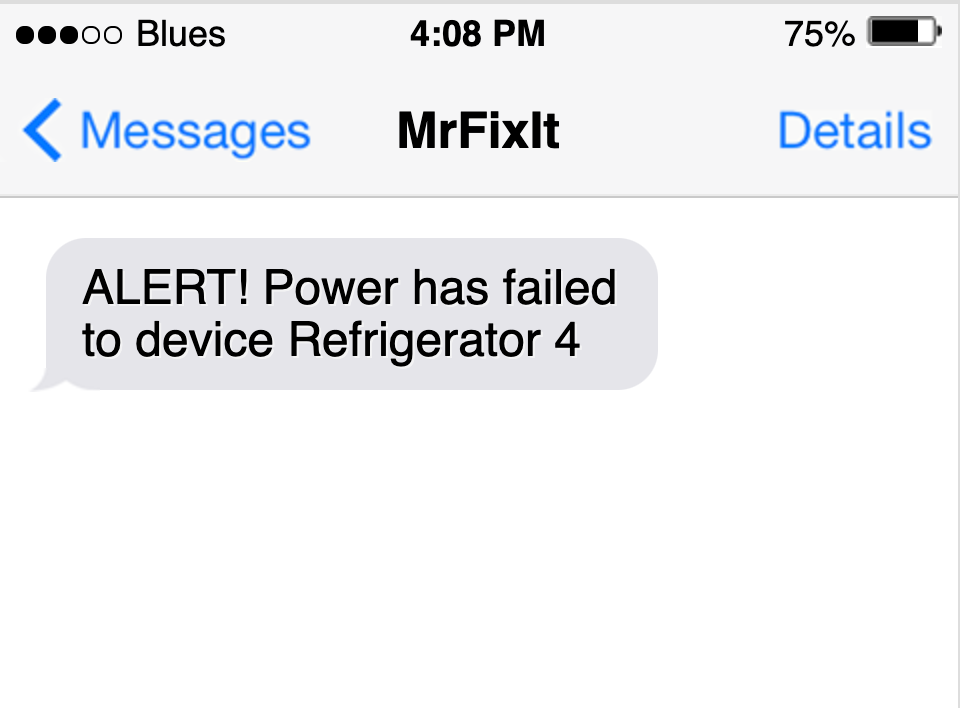

# Power Outage Detector

Use Notecard with a mains-powered USB power brick and LiPo battery to build a globally available power outage detector.



## You will need

* LiPo battery with JST cable
* AC to USB Adapter (power brick)
* USB A to Micro USB cable
* [Notecarrier-A](https://shop.blues.io/collections/notecarrier/products/carr-al) or [Notecarrier-B](https://shop.blues.io/collections/notecarrier/products/carr-b)
* Cellular [Notecard](https://blues.io/products/notecard/)


## Hardware Setup

1. Assemble Notecard, Notecarrier and LiPo battery as described in our [tutorial](https://dev.blues.io/quickstart/notecard-quickstart/notecard-and-notecarrier-b/).

2. Keep the Notecard connected to the computer with the in-browser terminal active until you have completed [Notecard Setup](#notecard-setup).

## Notecard Firmware

Your notecard should be running [firmware version 4.2.1](https://dev.blues.io/notecard/notecard-firmware-updates/#lts-v4-2-1-march-3-2023) or higher. The simplest way to update firmware is to do an [over-the-air update](https://dev.blues.io/notecard/notecard-firmware-updates/#ota-dfu-with-notehub)

## Cloud Setup

- Sign up for a free account on [Notehub.io](https://notehub.io), and create a new project.

## Notecard Setup

In these steps, you will use the in-browser terminal to configure your notecard to report power outage events to your Notehub project.

### Configure Notehub Project and Connection Mode

First, we will set the serial number (name) of your notecard and the ProductUID. The ProductUID is the one corresponding to the project you created in [Cloud Setup](#cloud-setup). Replace the `sn` and `product` values with your own and paste the resulting command into the in-browser terminal.

```json
{
  "req": "hub.set",
  "mode": "periodic",
  "inbound": 1440,
  "outbound": 60,
  "product": "com.your-company:your-product-name",
  "sn": "your-serial-number",
  "body": { "app": "nf16" }
}
```

> This app uses `periodic` mode to minimize power use so that the solution can remain online for longer when mains power fails. For more details, see [`hub.set` requests](https://dev.blues.io/notecard/notecard-walkthrough/essential-requests/#notehub-configuration).

### Configure Power Outage Alerts

Paste this command into the in-browser terminal

```json
{ "req": "card.voltage", "mode": "lipo", "usb": true, "alert": true, "sync": true }
```

> This instructs the Notecard to assume LiPo battery characteristics, monitor USB power and send an alert immediately when a power outage occurs and when power is restored. For more details, see the [Notecard API reference](https://dev.blues.io/reference/notecard-api/card-requests/#card-voltage) and the `Enable USB Power Alerting` example.

### Notecard CLI

If you want to issue all of the above requests in one shot, you can do so with the [Notecard CLI](https://dev.blues.io/tools-and-sdks/notecard-cli/) and the config.json configuration script. You will need to change the ProductUID in the `hub.set` command to match your ProductUID. Once you've done that, you can configure the Notecard with:

```sh
notecard -setup config.json
```

## System Test

In this section, you will power the Notecard via the power brick and simulate a power failure.

### Setup

1. Insert the power brick into a suitable electrical outlet and provide power to the Notecarrier via the micro USB cable.

1. Plug the JST connector from the LiPo battery into the port labeled LIPO on the Notecarrier.

1. Wait for the Notecard to connect to the cloud.  When connected, there will be a new session event in Notehub. (look for recent `_session.qo` events.)

1. Wait for the battery to fully charge.

### Simulating a Power Outage

1. Remove the power brick from the electrical outlet to simulate a power outage. The Notecard is now being powered by the battery.

2. After a short time, you will see a  `_health.qo` event in Notehub with the body

```json
{"text":"USB power OFF {usb-disabled}"}
```

This event indicates that the Notecard is no longer powered from the power brick.

3. Reinsert the power brick into a suitable electrical outlet to simulate power being restored.

4. After a short time, you will see a  `_health.qo` event in Notehub with the body

```json
{"text":"USB power ON {usb-enabled}"}
```

This event indicates that the Notecard is again powered by the power brick.

## Routing Data out of Notehub

Notehub supports forwarding data to a wide range of API endpoints by using the Route feature. This can be used to forward your power monitoring events to external dashboards and alerts to a realtime notification service.  Here, we will use Twilio SMS API to send a notification of an alert to a phone number.

For an introduction to Twilio SMS routes, please see our [Twilio SMS Guide](https://dev.blues.io/guides-and-tutorials/twilio-sms-guide/).

1. Fill out the required fields for the Twilio SMS route, including "from" and "to" phone numbers, where "from" is your virtual Twilio number, and "to" is the number of the phone that receives the power outage alerts. We will not be using placeholders for these numbers, but will use a placeholder for the message, so set the message field to `[.body.customMessage]`.

2. Under the "Filters" section, set "Notefiles" to "Selected Notefiles" and type `_health.qo` in the text input area below the list of notefiles. 

3. Under "Data", select "JSONata Expression" and copy and paste the contents of [jsonata/route.jsonata](jsonata/route.jsonata) into the text field "Insert your JSONata expression here".

4. Click "Save Changes".

### Testing the Route

The ideal test is to use the app Notecard to generate alerts.

#### Testing Power Failure

With the Notecard connected to USB power, and the LiPo connected, simulate a power outage by unplugging the USB power supply. Within a few seconds, an SMS will be sent to the `to` number you configured in the route above.

The message looks like this:

```
ALERT! Power has failed to device Refrigerator.
```

This indicates a mains power failure on the Notecard with serial number "Refrigerator".

#### Testing Power Restored

Using the same setup as above, reconnect the USB power supply to the Notecard. Another SMS message is sent that looks like this:

```
Power restored to device Refrigerator.
```

#### Testing Power Restored after the LiPo battery has discharged

Should power be out for long enough, the LiPo battery will discharge and will be unable to power the Notecard. When this happens, the Notecard will power off and resume when utility power is restored.

To test this:

1. Disconnect the USB power supply. This will generate a power failure alert as before.
2. Disconnect the LiPo battery.  No events are sent at this point.
3. Reconnect the USB power supply, simulating mains power being restored.
4. Reconnect the LiPo battery.

You will see a message that looks like this:

```
Power restored (LiPo battery discharged) to device Refrigerator.
```

### Blues Wireless Community

We’d love to hear about you and your project on the [Blues Wireless Community Forum].

[blues wireless community forum]: https://discuss.blues.io/