# Toy Ambulance Vehicle Monitor

- [Toy Ambulance Vehicle Monitor](#toy-ambulance-vehicle-monitor)
  - [You Will Need](#you-will-need)
  - [The Build](#the-build)
    - [Collect the Parts and Tools Needed](#collect-the-parts-and-tools-needed)
    - [Disassemble the Toy Ambulance](#disassemble-the-toy-ambulance)
    - [Separate Jumper Wires](#separate-jumper-wires)
    - [Strip Jumper Wires](#strip-jumper-wires)
    - [Tin the Exposed Wires](#tin-the-exposed-wires)
    - [Solder the Button Jumper Cables](#solder-the-button-jumper-cables)
    - [Solder the Power Jumper Cables](#solder-the-power-jumper-cables)
    - [Affix Antenna](#affix-antenna)
    - [Route Cables](#route-cables)
    - [Connect Notecarrier](#connect-notecarrier)
    - [Reassemble Ambulance](#reassemble-ambulance)
  - [Next Steps](#next-steps)

## You Will Need

* USB A to micro USB cable
* [LiPo battery with JST cable](https://shop.blues.io/products/5-000-mah-lipo-battery)
* [Notecarrier-B](https://shop.blues.io/products/carr-b)
* [Notecard](https://blues.io/products/notecard/)
* [Toy ambulance with light and siren effects](https://www.amazon.com/gp/product/B07KT8WXXW/)
* [200mm/8in. Dupont jumper cables](https://www.amazon.com/Elegoo-EL-CP-004-Multicolored-Breadboard-arduino/dp/B01EV70C78/) - Female to Male or Female (one end will be cut off, leaving just the female connector on one end and bare wire on the other.)
* [Soldering iron and solder](https://www.amazon.com/gp/product/B08R3515SF/)
* [Wire cutters/strippers](https://www.amazon.com/IRWIN-VISE-GRIP-2078300-Self-Adjusting-Stripper/dp/B000OQ21CA/)
* Phillips PH4 screwdriver

## The Build

When the build is done, you will have a toy ambulance powered by the LiPo battery, with the four buttons connected to AUX1-4 digital inputs on the Notecard.

### Collect the Parts and Tools Needed

Gather all the items needed for the build. (Note that the image doesn't show the antenna.)

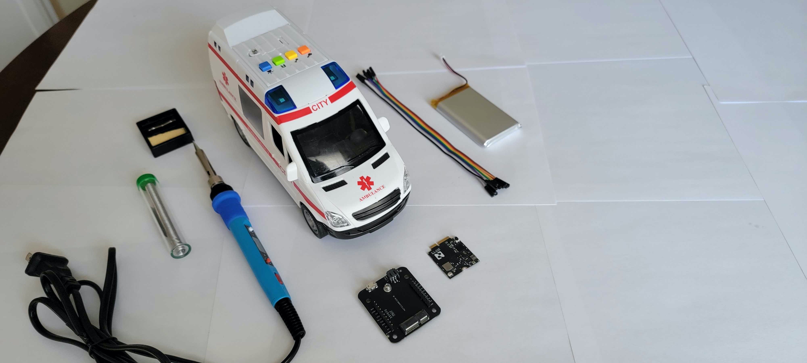

### Disassemble the Toy Ambulance

1. Using the Phillips screwdriver, unscrew the lid on the battery compartment and remove the 3 coin-cell batteries.

2. Disassemble the vehicle by removing all screws in this order:

 * The base (chassis)
 * The sickbay
 * The roof housing the electronics
 * The two screws holding the circuit board in place

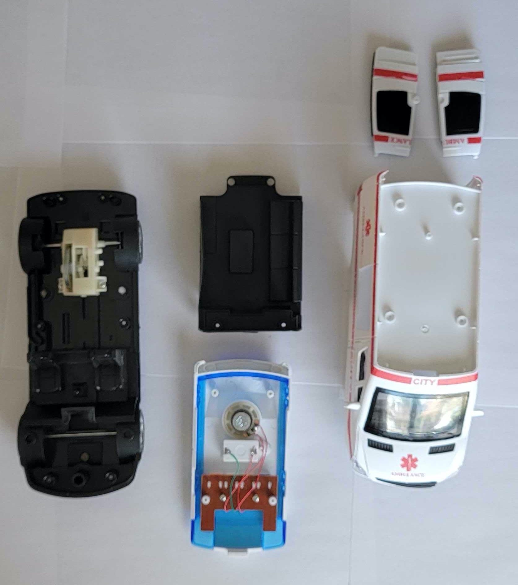

After removing the screws holding the circuit board in place, flip the circuit board over to access the circuit.

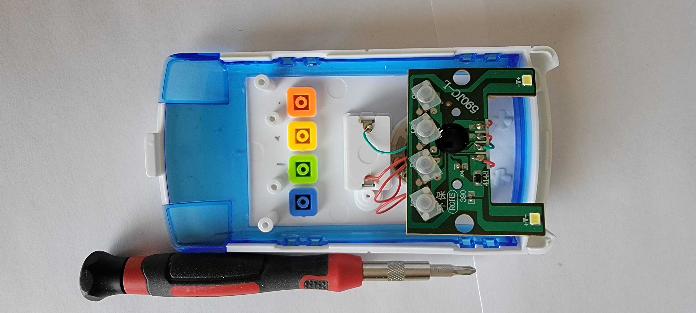

### Separate Jumper Wires

Separate the jumper wires into two bundles:

* red/brown: this will provide power to the ambulance.
* orange/yellow/green/blue: these will signal when a button is pushed/released.

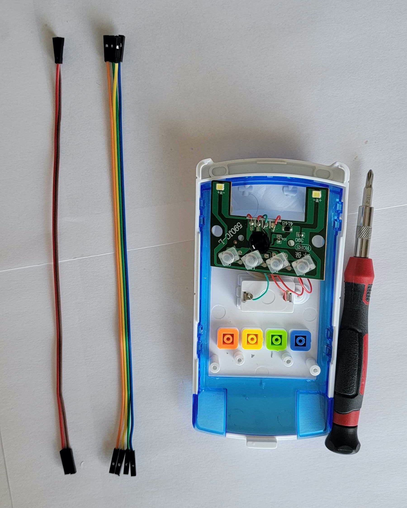

### Strip Jumper Wires

Here you remove the connector from one end of each jumper cable bundle, exposing the bare wires for soldering while also leaving a female connector intact.

If you are using female-to-male jumpers then you will cut off the male end. When using female-to-female jumpers, then you can cut of either end.

Using wirestrippers, cut off one end of each bundle of jumpers, just below the connector, and remove 5mm (1/4 inch) of insulation to reveal the bare strands of wire. Twist the strands of wire together if they are frayed.

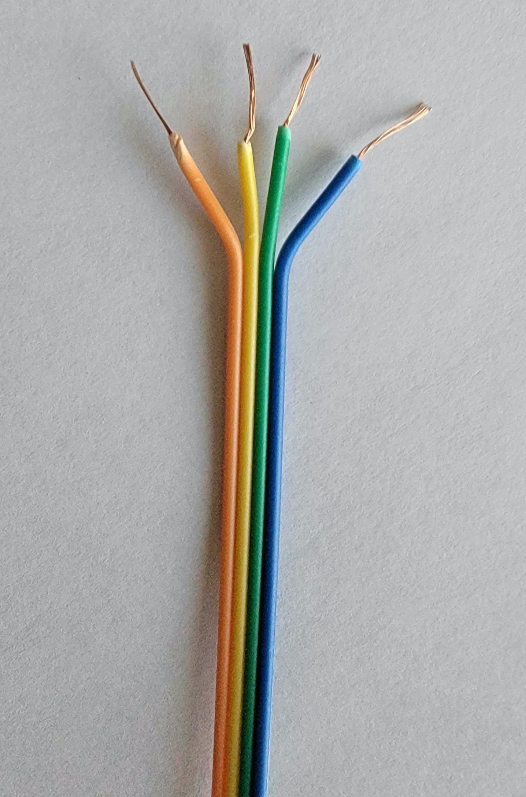

### Tin the Exposed Wires

For a better electrical connection and easier soldering, it's common to "tin" the strands of wire. To do this, place the soldering iron in contact with one side of the wire, and the solder in contact with the other side. The solder will melt and coat the strands of wire. Repeat, swapping sides, so that the wire is coated in solder.

[This article](https://www.thespruce.com/tinning-stranded-electrical-wires-1152893) provides a more detailed description of how to tin wires.

### Solder the Button Jumper Cables

1. If you prefer the buttons match the order of the colors in the 4-wire bundle (orange, yellow, green, then blue) rearrange the buttons to match by swapping the positions of the green and blue buttons.

2. Next to each pushbutton membrane, there is a small solder pad. When the button is pushed, it connects the pad to the positive supply. The pads appear in the same order from left-to-right as the corresponding buttons.

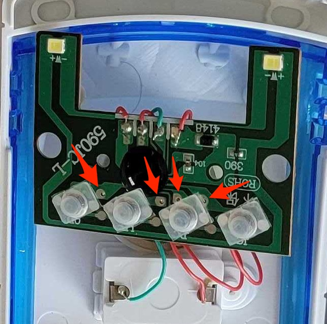

3. Solder the tinned end of each orange, yellow, green and blue jumper cable to the corresponding solder pad.

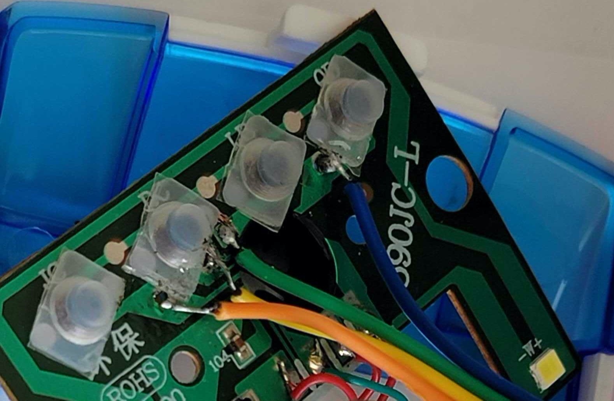

### Solder the Power Jumper Cables

Here you will solder the red/brown bundle to the power connectors on the battery compartment.

1. Solder the red wire to the side of the battery compartment that already has a red wire present. This will be the positive voltage supply.

2. Solder the brown wire to the side of the battery compartment that already has a green wire present. This will be connected to ground.

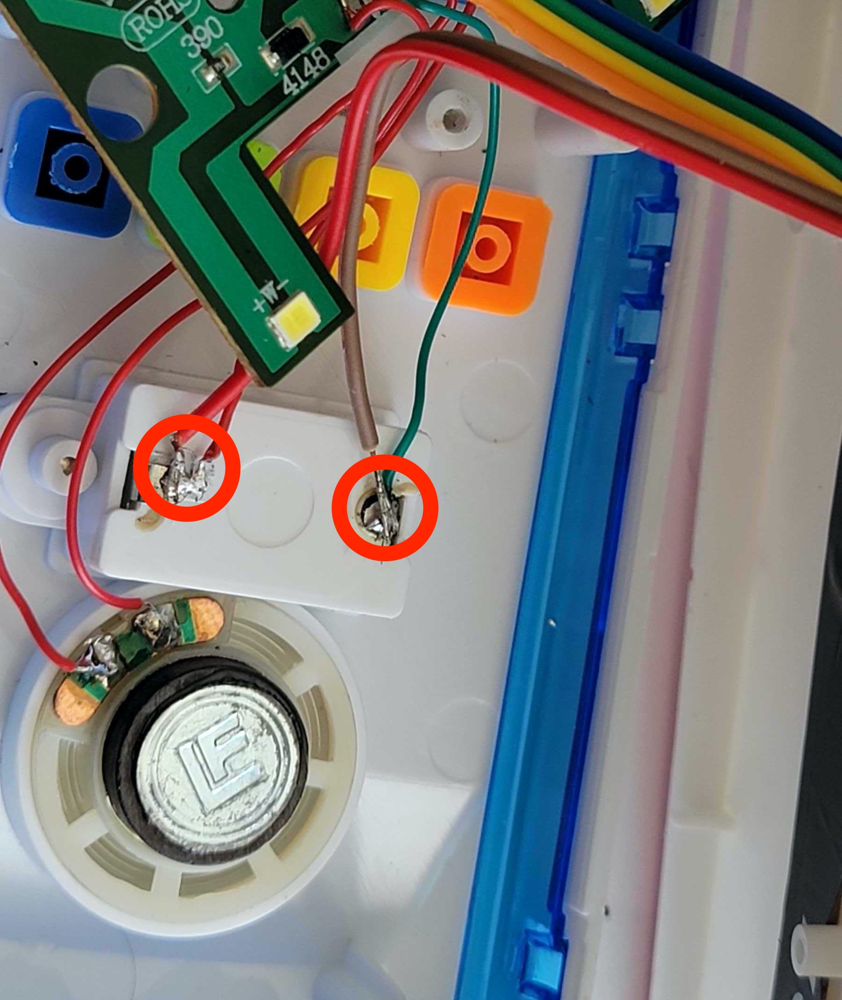

### Affix Antenna

Peel off the protective backing on the antenna, revealing the adhesive, and affix it to the roof of the sickbay.

With the antenna in place, use a drill to make a 2.5cm/1" hole in the sickbay. You can also use the soldering iron to melt the plastic if you don't have a drill to hand, but be sure to use a face mask and do not breathe in the fumes.

The cables will be routed through the roof of the sickbay area so they can be connected to the Notecarrier inside.

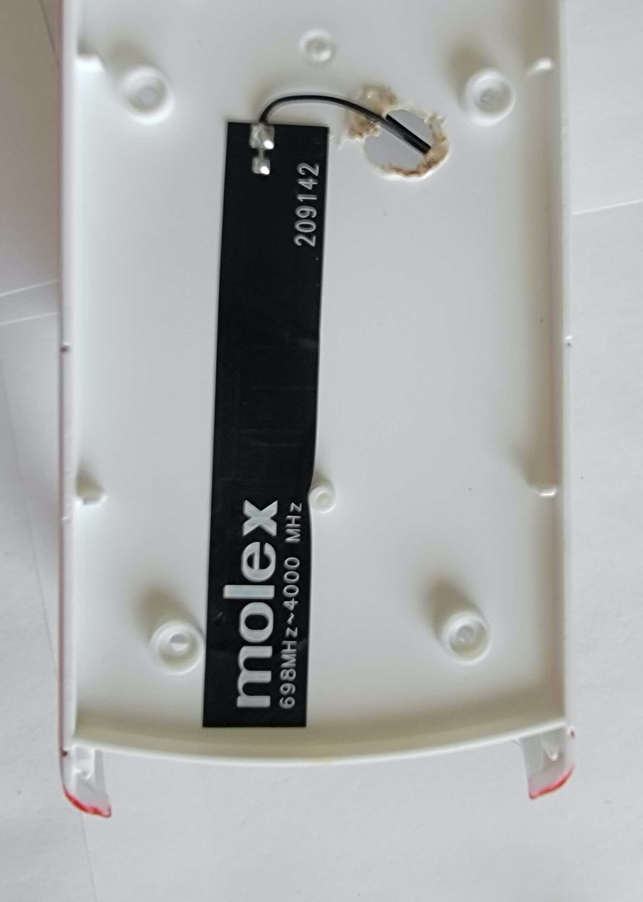

### Route Cables

Route the antenna cable and the female end of the jumper cables through the hole in the sickbay roof.  Be sure not to pull hard on the cables as it may pull off the solder pad on the circuit board.

Before routing the cables, you may choose to thread the jumper cables through and around a plastic ring larger than the hole in the roof. This protects the solder joints from excessive force.

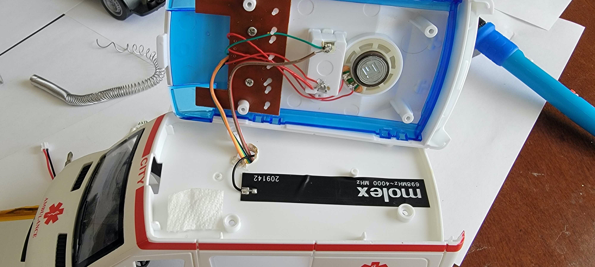

### Connect Notecarrier

Connect the Notecarrier to the ambulance as so:

* Connect the antenna to the `MAIN` u.FL connector on the Notecard.
* Connect the orange, yellow, green and blue cables to the `AUX1`, `AUX2`, `AUX3`, and `AUX4` pins respectively.
* Connect the brown jumper to `GND`.
* Connect the red jumper to `VMAIN` or `VBAT`. If you use `VMAIN`, the ambulance will be powered regardless of whether the Notecard is powered by the LiPo battery or a USB cable. When using `VBAT`, the ambulance will be powered only when the battery is connected.

If you wish you can now provide power to the Notecarrier, either via the LiPo battery or via the micro-USB cable and verify the ambulance receives power and the buttons function as before.

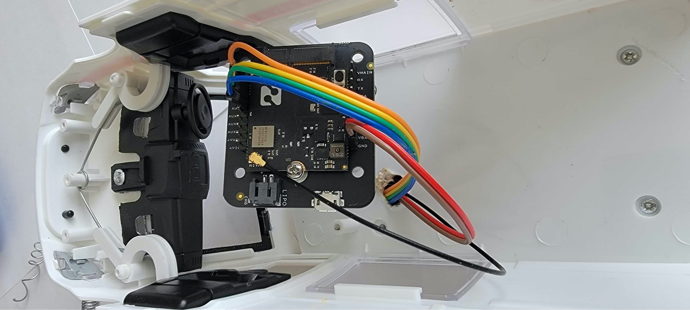

### Reassemble Ambulance

All of the rewiring work is done. All that remains is to reassemble the ambulance:

1. Secure the circuit board two screws
2. Screw the roof to the ambulance body
3. Insert the sickbay and screw in place
4. Screw the chassis in place.

For easier access, you can choose to leave off the rear sickbay doors.

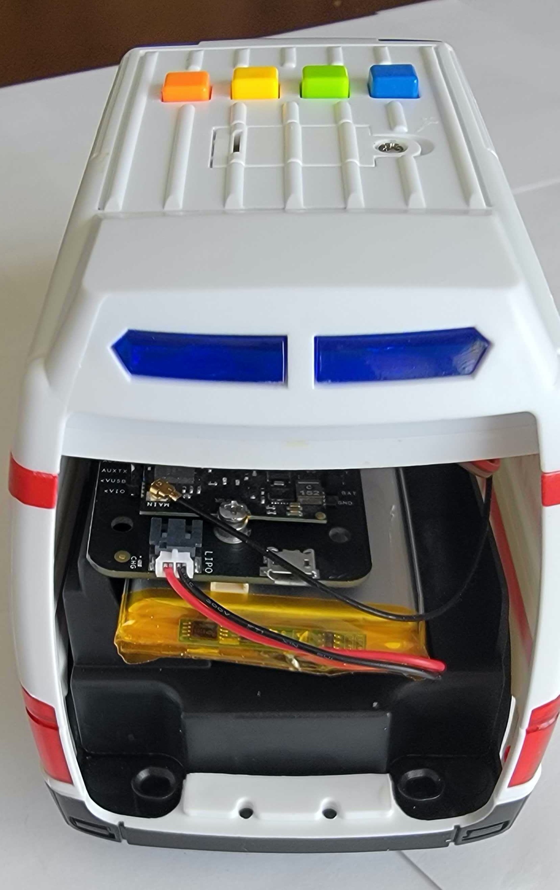

## Next Steps

The build is complete. You can now return to [`README.md`](README.md) and configure the Notecard to send events when the ambulance buttons are pushed.

