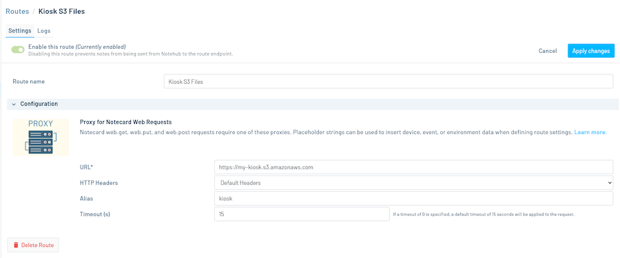

# Cellular-Connected Electronic Kiosk

A cellular-based solution for downloading resources for an electronic kiosk display without an Internet connection, using a simple Python script.

https://github.com/blues/app-accelerators/assets/20400845/24a49c10-d8e7-40bc-b4ba-4abf9a4fe727

In an effort to keep the required download size for the Raspberry Pi small, the hardware and Notehub cloud setup is covered in this repo, and the code required to run the app on the Pi and a sample web app to demonstrate how to zip up a project are located in a [separate repository](https://github.com/blues/accelerators-cellular-connected-electronic-kiosk).

To run this project you'll need to:

* [Purchase and assemble the necessary Raspberry Pi hardware](#hardware).
* [Configure Notehub](#notehub).
* [Download the Python scripts to the Raspberry Pi](https://github.com/blues/accelerators-cellular-connected-electronic-kiosk/tree/main/scripts).
* [Zip up and download the sample web app to the Pi](https://github.com/blues/accelerators-cellular-connected-electronic-kiosk/tree/main/web-app).

## Hardware

The following hardware is required to run the Cellular-Connected Electronic Kiosk project.

- [Raspberry Pi 4B](https://www.raspberrypi.com/products/raspberry-pi-4-model-b/)
- [CanaKit 3.5A Raspberry Pi 4 Power Supply (USB-C)](https://www.amazon.com/CanaKit-Raspberry-Power-Supply-USB-C/dp/B07TYQRXTK/)
- microSD Card (8GB minimum) and a MicroSD to SD Memory Card Adapter (your development PC must have an SD card reader slot)
- [Notecard](https://shop.blues.io/collections/notecard/products/note-wbna-500)
- [Notecarrier Pi Hat](https://shop.blues.io/products/carr-pi)
- Micro USB cable
- [7" Touchscreen Display for Raspberry Pi](https://www.adafruit.com/product/2718)
- [Wireless Keyboard and Mouse Combo](https://www.adafruit.com/product/1738)
- [SmartiPi Touch Pro for Raspberry Pi and Official 7" Display](https://www.adafruit.com/product/4951)

Once you have all your hardware you'll need to install the Raspberry Pi OS and assemble the pieces.

### Raspberry Pi microSD Card Setup

Before installing the Raspberry Pi into the SmartiPi case, you need to install [Raspberry Pi OS](https://www.raspberrypi.com/software/) onto the microSD card by following the steps in [this official video](https://www.youtube.com/watch?v=ntaXWS8Lk34) from the Raspberry Pi Foundation. Alternatively, you can follow text-based documentation [here](https://projects.raspberrypi.org/en/projects/raspberry-pi-setting-up/2).

With the microSD card ready to go, plug it into the Pi:


### Notecard and Notecarrier

Next, connect the Notecard and Pi Hat to the Pi by following [the section "Connect Your Notecard and Notecarrier" from the Blues Quickstart guide](https://dev.blues.io/quickstart/notecard-quickstart/notecard-and-notecarrier-pi/#connect-your-notecard-and-notecarrier).

### SmartiPi Case and Display

Put together the Pi, display, and case by following [this documentation from SmartiPi](https://cdn.shopify.com/s/files/1/0793/8029/files/touch_pro_assembly_instructions.pdf?v=1640377735), with a few additional steps to accommodate the Notecard hardware.

At Step 7 in the documentation, make sure to install the Notecarrier Pi Hat with the Notecard onto the Pi's headers (don't forget to attach the antenna to the Notecard as well):


Everything should fit, even with the standoffs attached to the Pi. If you want to manually send commands to the Notecard for any reason (e.g. debugging) via the [Notecard CLI](https://dev.blues.io/tools-and-sdks/notecard-cli/), you will also need to use the micro USB cable to connect the Notecarrier's micro USB port to one of the Pi's USB ports:


At this point, the assembly should look something like this:


From here, you can continue with the rest of the steps in the SmartiPi documentation.

### Keyboard and Mouse

Install the AAA batteries into the keyboard and mouse, and plug the USB dongle into a free USB port on the Pi. Note that this single dongle is used for both the keyboard and mouse.

### Booting for the First Time

Plug the USB-C power supply into the exposed USB-C port on the case and let the Pi boot up. Complete the setup steps as described in [this documentation](https://projects.raspberrypi.org/en/projects/raspberry-pi-setting-up/4).

The next step after assembling the Raspberry Pi and its peripherals is to configure the Notehub cloud to be able to communicate with the Notecard attached to the Pi.

## Notehub

The Cellular-Connected Electronic Kiosk Python scripts require data from a Notehub project in order to run. 

### Create a New Project

As such, to run this sample sign up for a free account on [notehub.io](https://notehub.io) and [create a new project](https://dev.blues.io/quickstart/notecard-quickstart/notecard-and-notecarrier-pi/#set-up-notehub).


### Create a Proxy Route

In the Notehub project, you'll need to create a [proxy route](https://dev.blues.io/notecard/notecard-walkthrough/web-transactions/) in order to download the kiosk web app to the Pi. The web app should be bundled in a ZIP file and stored online somewhere (e.g. in an AWS S3 bucket). Unzipping the ZIP file should produce, at minimum, a directory named `resources/` with an HTML page to display named `index.htm`, and a `metadata/` directory with a `kiosk.json` file that contains information for Notehub.

For a more in-depth example of the required files, web app structure, and how to zip the project and store it in AWS for retrieval by Notehub, see the [separate repo's documentation](https://github.com/blues/accelerators-cellular-connected-electronic-kiosk).

> **NOTE:** Read [this guide](https://dev.blues.io/notecard/notecard-walkthrough/web-transactions/) for more information about setting up routes in Notehub.



### Set Environment Variables

Additionally, there are 4 [environment variables](https://dev.blues.io/guides-and-tutorials/notecard-guides/understanding-environment-variables/) used in this project to store settings that can be shared and synchronized across devices. You can set them at the [fleet](https://dev.blues.io/reference/glossary/#fleet) level by:

1. Navigating to your Notehub project page.
2. Selecting your fleet name from under **Fleets**.
3. Clicking the **Settings** button in the upper right hand corner of the selected Fleet.
4. Clicking the **Environment** tab in the fleet's settings page. Define the following variables below:

#### `kiosk_content`

This is the name of the ZIP file that will be downloaded via the proxy route. For example, if you configure your route with the URL https://my-kiosk.s3.amazonaws.com and the ZIP file is downloadable via a GET request to https://my-kiosk.s3.amazonaws.com/kiosk.zip, you should set `kiosk_content` to `kiosk.zip`. Changing this variable will cause the Python script to download and use the file specified by the new value.

#### `kiosk_content_version`

This is a version number for the file specified by `kiosk_content`. If you update the content, you can increment this number to cause the Python script to download and use the new content.

#### `kiosk_download_time`

This variable specifies the hour of the day (using 24-hour time) when the Python script should check for updates to the `kiosk_content`. If, for example, `kiosk_download_time` is set to 9, the script will check for updates to the content at 9:00 AM local time. If the content file name or version has changed, the script will download and use the new content. If this variable is set to the special value `now`, any change to the content file name or version will cause an immediate download of the new content, instead of waiting for a specific hour of the day.

#### `kiosk_data`

This is an optional environment variable that can be set to any valid JSON object. It can be used to overwrite the contents of the `data.js` file in the ZIP. For instance, if the contents of `data.js` looks like this:

```javascript
var data = <value of kiosk_data goes here>
```

You can set the `kiosk_data` JSON to `{"message":"Hello world!"}`, and the Python script will translate it into:

```javascript
var data = {"message":"Hello world!"}
```

For use in the web app. The web application can then access and use this data however you want. In this way, `kiosk_data` acts as a way of passing dynamic data to the web app without needing to modify the contents of the ZIP file and re-download the whole thing.

To see this in action with actual code examples, see the [related sample repo](https://github.com/blues/accelerators-cellular-connected-electronic-kiosk).


With the hardware assembled and Notehub cloud configured, your next step is getting the project's Python scripts downloaded to the Raspberry Pi and providing a zipped web app for the Pi to download.

## Raspberry Pi Python Scripts and Sample Web App

The Cellular-Connected Electronic Kiosk project has Python scripts designed to be run on a Raspberry Pi computer with no Internet connection.

In an effort to keep the required download as small as possible, see this [separate repository](https://github.com/blues/accelerators-cellular-connected-electronic-kiosk) for full details on:

1. Configuring the Python software on the Pi.
2. Packaging up the sample web app for download to the Pi. 
