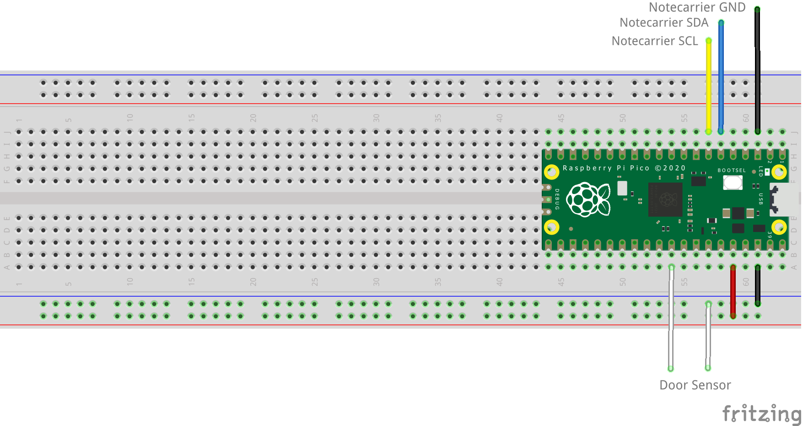
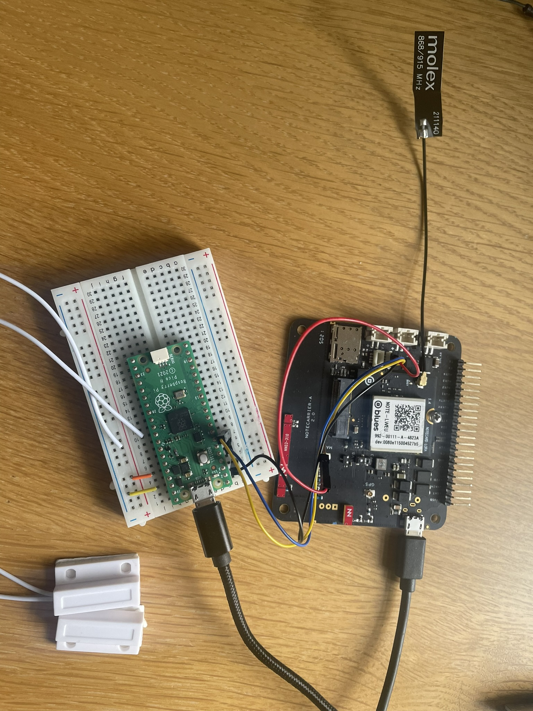

# Door State Monitor

Receive notifications when a door is opened or closed.

## You Will Need

* [Blues Starter Kit for LoRaWAN](https://shop.blues.com/products/blues-starter-kit-lorawan)
* Raspberry Pi Pico
* 2 USB A to micro USB cables
* [Magnetic Door Switch Set](https://www.sparkfun.com/products/13247)

## Notehub Setup

Sign up for a free account on [notehub.io](https://notehub.io) and [create a new project](https://dev.blues.io/quickstart/notecard-quickstart/notecard-and-notecarrier-a/#set-up-notehub).

## LoRa Gateway Setup

Before you can use the Notecard LoRa you need to have a LoRaWAN gateway that is provisioned to The Things Network.  To make this easy you can use the [Blues Indoor LoRaWAN Gateway](https://shop.blues.com/products/blues-starter-kit-lorawan).  To get this set up follow the [setup instructions](https://dev.blues.io/lora/connecting-to-a-lorawan-gateway/)


## Pico Setup

Your Raspbery Pi Pico will need to have Micropython installed.  If it is not yet installed, follow the [installation instructions](https://micropython.org/download/RPI_PICO/) provided by MicroPython.

### MicroPython Code

The script that will run on the MCU is [main.py](main.py). It depends on [note-python](https://github.com/blues/note-python), a Python library for communicating with a Notecard.

#### note-python

To get the note-python files onto the MCU, use the [`setup_board.py`](setup_board.py) script. This uses the [`pyboard.py`](pyboard.py) script to communicate with the Raspberry Pi Pico. First, you must identify the MCU's serial port. On Linux, it'll typically be something like `/dev/ttyACM0`. You can run `ls /dev/ttyACM*` before and after plugging the board in to figure out the serial port's associated file. Once you have that, run `python setup_board.py <serial port>`, replacing `<serial port>` with your serial port. This script does a few things:

1. Clones note-python from GitHub.
2. Creates the `/lib` and `/lib/notecard` directories on the MCU.
3. Copies the `.py` files from `note-python/notecard` on your development machine to `/lib/notecard` on the MCU.
4. Lists the contents of `/lib/notecard` so you can verify that everything was copied over.

Note that for `pyboard.py` to work, you'll need to install [pyserial](https://pypi.org/project/pyserial/) with `pip install pyserial`, if you don't have it installed already.

#### Running `main.py`

Before running `main.py`, uncomment this line: `# product_uid = 'com.your-company:your-product-name'`. Replace `com.my-company.my-name:my-project` with the [ProductUID of the Notehub project](https://dev.blues.io/notehub/notehub-walkthrough/#finding-a-productuid) you created in [Notehub Setup](#notehub-setup).

Copy `main.py` over to the board with this command:

```
python pyboard.py -d <serial port> --no-soft-reset -f cp main.py :/
```

Make sure to replace `<serial port>` with your serial port. `main.py` will start running after boot up.

## Hardware

The magnetic door switch consists of two plastic terminals, one of which has a pair of wires coming out of it. When the terminals are brought into contact (or close proximity), an internal [reed switch](https://en.wikipedia.org/wiki/Reed_switch) is closed and the two wires are electrically connected. As shown on the [SparkFun product site](https://www.sparkfun.com/products/13247), the terminal with the wires is typically mounted to a door frame and the other terminal is mounted to the door such that when the door is closed, the two terminals are adjacent, closing the switch. Since we're just testing things out, don't mount the terminals yet.

Place the Pico into a Breadboard with the USB connection on the outer edge.Make the following connections:

Pico Power:

* GND on Pico (Pin 38) to Breadboard Ground Rail
* 3V3 OUT on Pico (Pin 36) to Breadboad +VE Rail

Door Sensor:

* GP26 on Pico (Pin 31) to Magnetic Door Sensor
* GND Rail on Breadboard to Magnetic Door Sensor

The Notecarrier can be connected with a Qwiic cable with the following connections:.

* Qwiic Black (GND) to Pico GND (Pin 3)
* Qwiic Blue (SDA) to  Pico GP4 (Pin 6)
* Qwiic Yellow (SCL) to Pico GP5 (Pin 7)

Do not connect the Red cable of the Qwiic connector.  If you wish to power the Pico from the Notecarrier (which makes sense after testing) connect VMAIN on the Notecarrier to VSYS (Pin 39) on the Pico.

See the image below for a diagram of the connections required.



Once complete the build should look a little like this:



## Testing

1. Bring the terminals together. You should see the message `Door closed.` in the serial log. Then, on the events page of your Notehub project, you should see a Note that reads `{"closed":true}`, indicating the door is closed.
1. Separate the terminals. You should see the message `Door open.` in the serial log. Then, on the events page of your Notehub project, you should see a Note that reads `{"open":true}`, indicating the door is open.


## Blues Community

We’d love to hear about you and your project on the [Blues Community Forum](https://discuss.blues.io/)!

## Additional Resources

* [Notecard Lora Datasheet](https://dev.blues.io/datasheets/notecard-datasheet/note-lora/)
