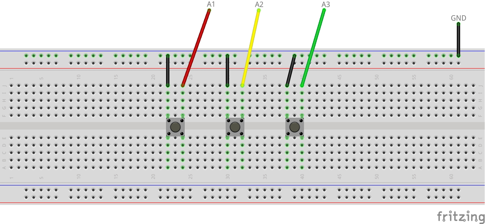

# Restroom Servicing Monitor

**Warning: This project uses Sparrow, a Blues product that is no longer under active development. We are working on updating this project to the successors of Sparrow: [Notecard LoRa](https://blues.com/notecard-lora/) and the [LoRaWAN Starter Kit](https://shop.blues.com/products/blues-starter-kit-lorawan). In the meantime, if you would like assistance building a Restroom Servicing Monitor feel free to reach out on [our community forum](https://discuss.blues.com/).**

Receive updates on restroom cleanliness so that it can be serviced when needed.

## You Will Need

* Sparrow Development Kit
* 2 USB A to micro USB cables
* Breadboard
* [3 push buttons](https://www.sparkfun.com/products/14460)
* Jumper wires

## Notehub Setup

Sign up for a free account on [notehub.io](https://notehub.io) and [create a new project](https://dev.blues.io/quickstart/notecard-quickstart/notecard-and-notecarrier-pi/#set-up-notehub).

## Sparrow Setup

### Quickstart

Follow the [Sparrow Quickstart](https://dev.blues.io/quickstart/sparrow-quickstart/) to get your Sparrow devices paired with each other and associated with the Notehub project you just created. Make sure that you use the ProductUID generated in [Notehub Setup](#notehub-setup) when it comes time to issue the `hub.set` command in the quickstart. Note also that we'll only need one reference node for this project, so you don't need to pair both nodes that came with the dev kit.

After you've completed the quickstart, leave the Notecarrier and essentials board powered and connected. These two devices will act as our gateway to Notehub, and we won't need to touch them again. The rest of this guide will focus on the reference node.

### Hardware

Before we set up the custom firmware needed for the restroom servicing monitor, let's wire up the hardware. The hardware interface is 3 push buttons: 1 for a bad rating (restroom needs service), 1 for an ok rating (restroom cleanliness deteriorating), and 1 for a good rating (no service needed). These buttons are wired to GPIO pins on the reference node. Those pins use internal pull-ups so that the pin reads a digital 1 when the button isn't pushed. When the button is pushed, it connects the corresponding GPIO pin to GND so that it reads a digital 0. Using the breadboard, buttons, and jumper wires, wire up the hardware as shown in the diagram below.



The labels off the breadboard (A1-A3 and GND) correspond to pins on the reference node. Connect these to the breadboard as shown with jumper wires.

### Firmware

Next, we need to flash the reference node with the restroom servicing monitor firmware.

1. Before we do anything, we need to pull in some dependencies for the firmware to work. After cloning this repository, run these commands: `git submodule update --init 29-restroom-servicing-monitor/firmware/note-c` and `git submodule update --init 29-restroom-servicing-monitor/firmware/sparrow-lora`. This will pull in the note-c and sparrow-lora submodules that this project depends on.
1. There are a few ways to build and flash the firmware onto the reference node. These are covered in the [Sparrow Builder's Guide](https://dev.blues.io/sparrow/sparrow-builders-guide/). Follow the steps in that guide and then return to these instructions.
1. Connect the STLINK-V3MINI to your development PC with a USB A to micro USB cable.
1. Connect the STLINK to your reference node with the 2x7 JTAG ribbon cable.
1. Build and flash the code using whichever method you selected when following the Sparrow Builder's Guide.
1. Open a terminal emulator and connect to the STLINK's serial connection to view logs. See the documentation [here](https://dev.blues.io/sparrow/sparrow-builders-guide/#collecting-firmware-logs). 
1. Start the program in debug mode (again, how you do this depends on the IDE: VS Code or STM32CubeIDE). In your terminal emulator's output, you should see something like this:

```
===================
===================
===== SPARROW =====
===================
Feb 13 2023 23:36:53
2037335832365003001d001f
APPLICATION HOST MODE
CONSOLE TRACE ENABLED
rsm activated with 1440s activation period and 15s poll interval
rsm now DEACTIVATED (rsm: nothing to do)
```

"rsm" stands for restroom servicing monitor.

## Testing

To test things out, we'll press each button, observe the serial log, and then observe the note that was sent to Notehub.

1. Press the button connected to A1 (bad rating). You should see `Sent bad rating.` in the serial log. On your Notehub project's Events page, you should see a note come into ID#ratings.qo that looks like this, where ID is a string of characters that uniquely identifies the reference node (e.g. 2037335832365003001d001f#ratings.qo):

```json
{
    "rating": "bad"
}
```

1. Press the button connected to A2 (ok rating). You'll see `Sent ok rating.` in the serial log and the Notehub event should have a `rating` field with the string "ok".
1. Press the button connected to A3 (good rating). You'll see `Sent good rating.` in the serial log and the Notehub event should have a `rating` field with the string "good".

## Blues Community

We’d love to hear about you and your project on the [Blues Community Forum](https://discuss.blues.io/)!

## Additional Resources

* [Sparrow Datasheet](https://dev.blues.io/datasheets/sparrow-datasheet/)
* [Sparrow Hardware Behavior](https://dev.blues.io/sparrow/sparrow-hardware-behavior/) (e.g. what do the various Sparrow LEDs indicate?)
