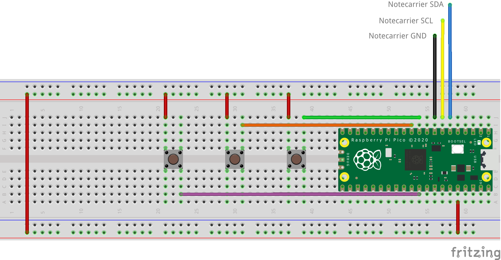

# Restroom Servicing Monitor

Receive updates on restroom cleanliness so that it can be serviced when needed.

## You Will Need

* [Blues Starter Kit for LoRaWAN](https://shop.blues.com/products/blues-starter-kit-lorawan)
* Raspberry Pi Pico
* 2 USB A to micro USB cables
* Breadboard
* [3 push buttons](https://www.sparkfun.com/products/14460)
* Jumper wires

## Notehub Setup

Sign up for a free account on [notehub.io](https://notehub.io) and [create a new project](https://dev.blues.io/quickstart/notecard-quickstart/notecard-and-notecarrier-pi/#set-up-notehub).

## LoRa Gateway Setup

Before you can use the Notecard LoRa you need to have a LoRaWAN gateway that is provisioned to The Things Network.  To make this easy you can use the [Blues Indoor LoRaWAN Gateway](https://shop.blues.com/products/blues-starter-kit-lorawan).  To get this set up follow the [setup instructions](https://dev.blues.io/lora/connecting-to-a-lorawan-gateway/)


## Hardware

Before we set up the Pico for the restroom servicing monitor, let's wire up the hardware. The hardware interface is 3 push buttons: 1 for a bad rating (restroom needs service), 1 for an ok rating (restroom cleanliness deteriorating), and 1 for a good rating (no service needed).

These buttons are wired to GPIO pins on the Pico. Those pins will be configured with internal pull-downs so that the pin reads a digital 0 when the button isn't pushed. When the button is pushed, it connects the corresponding GPIO pin to 3V3 so that it reads a digital 1.

Using the breadboard, buttons, and jumper wires, wire up the hardware as shown in the diagram below.



The three buttons are connected as follows:

    Poor (Left)   -> GP26 (Pin 31)
    Ok   (Middle) -> GP8  (Pin 11)
    Good (Right)  -> GP7  (Pin 10)

The labels off the breadboard correspond to the Qwiic connector from the Notecarrier. Connect these to the breadboard as follows:

    Blue   (SDA)  -> Pin 6
    Yellow (SCL)  -> Pin 7
    Black  (GND)  -> Pin 8

Do not connect the red connector of the Qwiic cable.

The power rail of the Breadboard is connected to Pin 36 on the Pico (3V3 Out).

## Pico Setup

Your Raspbery Pi Pico will need to have Micropython installed.  If it is not yet installed, follow the [installation instructions](https://micropython.org/download/RPI_PICO/) provided by MicroPython.

### MicroPython Code

The script that will run on the MCU is [main.py](main.py). It depends on [note-python](https://github.com/blues/note-python), a Python library for communicating with a Notecard.

#### note-python

To get the note-python files onto the MCU, use the [`setup_board.py`](setup_board.py) script. This uses the [`pyboard.py`](pyboard.py) script to communicate with the Raspberry Pi Pico. First, you must identify the MCU's serial port. On Linux, it'll typically be something like `/dev/ttyACM0`. You can run `ls /dev/ttyACM*` before and after plugging the board in to figure out the serial port's associated file. Once you have that, run `python setup_board.py <serial port>`, replacing `<serial port>` with your serial port. This script does a few things:

1. Clones note-python from GitHub.
2. Creates the `/lib` and `/lib/notecard` directories on the MCU.
3. Copies the `.py` files from `note-python/notecard` on your development machine to `/lib/notecard` on the MCU.
4. Lists the contents of `/lib/notecard` so you can verify that everything was copied over.

Note that for `pyboard.py` to work, you'll need to install [pyserial](https://pypi.org/project/pyserial/) with `pip install pyserial`, if you don't have it installed already.

#### Running `main.py`

Before running `main.py`, uncomment this line: `# product_uid = 'com.your-company:your-product-name'`. Replace `com.my-company.my-name:my-project` with the [ProductUID of the Notehub project](https://dev.blues.io/notehub/notehub-walkthrough/#finding-a-productuid) you created in [Notehub Setup](#notehub-setup).

Copy `main.py` over to the board with this command:

```
python pyboard.py -d <serial port> --no-soft-reset -f cp main.py :/
```

Make sure to replace `<serial port>` with your serial port. `main.py` will start running after boot up.
   


## Testing

To test things out, we'll press each button, observe the serial log, and then observe the Note that was sent to Notehub.

1. Press the leftmost button connected to GP26 (bad rating). You should see `Sent bad rating.` in the serial log. On your Notehub project's Events page, you should see a `ratings.qo` Note that looks like this:

```json
{
    "rating": "bad"
}
```

1. Press the middle button connected to GP8 (ok rating). You'll see `Sent ok rating.` in the serial log and the Notehub event should have a `rating` field with the string "ok".
1. Press the rightmost button connected to GP7 (good rating). You'll see `Sent good rating.` in the serial log and the Notehub event should have a `rating` field with the string "good".

## Blues Community

We’d love to hear about you and your project on the [Blues Community Forum](https://discuss.blues.io/)!

## Additional Resources

* [Sparrow Datasheet](https://dev.blues.io/datasheets/sparrow-datasheet/)
* [Sparrow Hardware Behavior](https://dev.blues.io/sparrow/sparrow-hardware-behavior/) (e.g. what do the various Sparrow LEDs indicate?)
