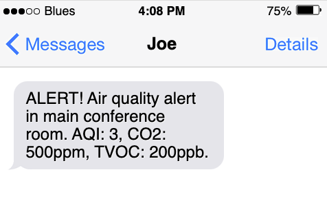
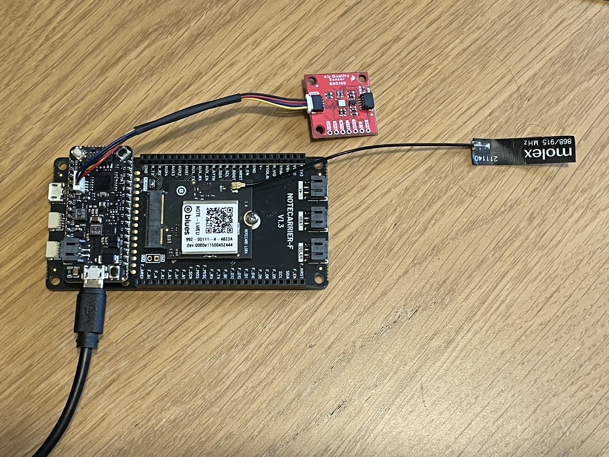

# Indoor Air Quality and Gas Leak

Monitor air quality, including Air Quality Index, CO2 and VOC concentration, and send alerts when a potential gas leak is detected.



## You Will Need

* [Notecard Lora](https://shop.blues.com/collections/notecard/products/notecard-lora)
* [LoRaWAN Gateway](https://shop.blues.com/collections/accessories/products/lorawan-gateway)
* [Notecarrier F](https://shop.blues.com/collections/notecarrier/products/notecarrier-f)
* [Swan](https://shop.blues.com/collections/swan/products/swan)
* 2 USB A to micro USB cables
* [Sparkfun Indoor Air Quality Sensor - ENS160](https://www.sparkfun.com/products/20844)
* [Qwiic cable](https://www.sparkfun.com/products/14427)

## Notehub Setup

Sign up for a free account on [notehub.io](https://notehub.io) and [create a new project](https://dev.blues.io/quickstart/notecard-quickstart/notecard-and-notecarrier-a/#set-up-notehub).

## LoRa Gateway Setup

Before you can use the Notecard LoRa you need to have a LoRaWAN gateway that is provisioned to The Things Network.  To make this easy you can use the [Blues Indoor LoRaWAN Gateway](https://shop.blues.com/products/blues-starter-kit-lorawan).  To get this set up follow the [setup instructions](https://dev.blues.io/lora/connecting-to-a-lorawan-gateway/)

## Swan Setup

First connect your Blues Swan and Notecard to your Notecarrier-F.

1. Follow the steps in the [Notecard Quickstart](https://dev.blues.io/quickstart/notecard-quickstart/notecard-and-notecarrier-f/#connect-your-notecard-and-notecarrier) to connect your Notecard LoRa to your Notecarrier-F.  Your antenna will only have one cable, and the Notecard LoRa only has one connection.

2. Plug your Swan into the Feather headers on the Notecarrier F.

3. Attach the Swan to your computer with a Micro USB to USB-A cable, using the **Micro USB port on the Swan**.


### Air Quality Sensor Connection

This solution makes use of the ENS160 sensor board, which measures indoor air quality. Connect the ENS160 sensor to the Swan board using the Qwiic cable:

1. Insert one end of the Qwiic cable into the port labelled Qwiic on the Swan board
2. Insert the other end of the Qwiic cable into either of the Qwiic sockets on the ENS160 sensor board.



With the Swan board powered on, you will see a red LED light up on the ENS160 board, indicating that it is receiving power. To improve battery life, you may wish to cut the LED jumper to disable the LED. For more details, see the "LED Jumper" section in the [Sparkfun ENS160 Qwiic Hookup Guide](https://learn.sparkfun.com/tutorials/sparkfun-indoor-air-quality-sensor---ens160-qwiic-hookup-guide).

## Firmware

The firmware provided uses the Arduino Framework, follow the [instructions in the git repo](firmware/) to flash your Swan.

## Air Quality Monitoring and Alerting Behavior

The firmware periodically monitors air quality and gas concentrations, and posts events with this information. Regular air quality monitoring events are not synced immediately to Notehub, and will be delivered as often as the Notecard is configured to sync with Notehub via the `hub.set` request.

Air quality events are posted to the Notefile `aqi.qo`. An air quality event has these properties:

```cpp
{
  "app" : "nf30",       // the application name
  "aqi" : 1,            // Air Quality Index (1-5)
  "eco2" : 439,         // CO2 concentration in parts-per-million (ppm)
  "tvoc" : 41           // Total volatile organic compounds (VOCs) parts-per-billion (ppb)
}
```

Each air quality reading is checked against the [configured thresholds](#configuration). If any reading is higher than the corresponding threshold, the event is sent immediately to Notehub as an alert. Alerts are distinguished from regular monitoring events by the `alert` property.

```cpp
{
  "alert" : 1,          // Signifies an alert
  "app" : "nf30",       // the application name
  "aqi" : 3,            // Air Quality Index (1-5)
  "eco2" : 639,         // CO2 concentration in parts-per-million (ppm)
  "tvoc" : 241          // Total volatile organic compounds (VOCs) parts-per-billion (ppb)
}
```

The `alert` property has these values:

* `alert:1`: Indicates an alert condition regarding air quality has been detected. The event is immediately synced to Notehub. You can use this to signal an alert externally, such as notifying a pager other messaging service.

* `alert:2`: Signifies that the alert is still ongoing. Subsequent alerts after the initial alert have the `alert` property set to `2`, indicating that the alert is ongoing because air quality hasn't returned to normal levels. These events are not immediately sent to notehub, and are provided for continuous monitoring of air quality.

* `alert:3`: Signifies a stand-down alert and that air quality has returned to normal levels. These events are sent immediately to notehub. This is typically used to send an external notification that air quality has returned to normal levels.

When air quality returns to normal, `alert:3` is the last event sent with the `alert` property present. Subsequent events monitoring air quality do not have the `alert` property present until a new alert condition is detected.


### Configuration

The file [`./firmware/src/main.cpp`](./firmware/src/main.cpp) contains a number of `#define`s that are used to configure how often air quality is measured and the thresholds that trigger an alert:

| Name     | Default  | Unit    | Description |
|----------|----------|---------|-------------|
| `AQI_MONITOR_PERIOD` | 60 | seconds | The period in seconds between each air quality reading.
| `ALERTS_ONLY` | false | boolean | When true, disables reporting of normal air quality and only alerts are sent. |
| `ALERT_AQI_LEVEL` | 3 | 1-5 | Trigger an alert when the measured AQI is at least this high. (Higher numbers mean poorer air quality.) Set to 0 to disable AQI alerts. |
| `ALERT_ECO2_LEVEL` | 500 | ppm | Trigger an alert when the measured concentration of CO2 is at or above this level.  Set to 0 to disable CO2 alerts. Note that the concentration of CO2 in the atmosphere is around 420 ppm. |
| `ALERT_TVOC_LEVEL` | 200 | ppb | Trigger an alert when the measured concentration of VOCs is at or above this level. Set to 0 to disable VOC alerts. |

## Routing Data out of Notehub

Notehub supports forwarding data to a wide range of API endpoints by using the Route feature. This can be used to forward your air quality data to external dashboards and alerts to a realtime notification service.  Here, we will use Twilio SMS API to send a notification of an alert to a phone number.

For an introduction to Twilio SMS routes, please see our [Twilio SMS Guide](https://dev.blues.io/guides-and-tutorials/twilio-sms-guide/).

1. Fill out the required fields for the Twilio SMS route, including "from" and "to" phone numbers, where "from" is your virtual Twilio number, and "to" is the number of the phone that receives the alerts. We will not be using placeholders for these numbers, but will use a placeholder for the message, so set the message field to `[.body.customMessage]`.

2. Under the "Filters" section, set "Notefiles" to "All Notefiles" (the default value.)

3. Under "Data", select "JSONata Expression" and copy and paste the contents of [jsonata/route.jsonata](jsonata/route.jsonata) into the text field "Insert your JSONata expression here".

4. Click "Save Changes".

### Naming Air Quality Monitors


Once the node names are configured, the name rather than the node ID will be used in SMS alerts.

### Testing the Route

The ideal test is to use the app firmware to generate alerts. However, it's also possible to simulate an event by pasting these JSON snippets into the the in-browser terminal.

This is a regular air quality monitoring event. It does not generate an SMS alert.

```json
{ "req": "note.add", "file":"aqi.qo", "sync": true, "body": {
  "alert":1, "tvoc":200, "eco2":500, "aqi":3
}}
```

This is an alert event (due to the presence of the `alert` property), which will result in an SMS message being sent to the phone number in the "to" field.

```json
{ "req": "note.add", "file":"aqi.qo", "sync": true, "body": {
  "alert":1, "tvoc":200, "eco2":500, "aqi":3
}}
```

This event will send an SMS that looks like this:

> ALERT! Air quality alert in main conference room. AQI: 3, CO2: 500ppm, TVOC: 200ppb.

These are the parts of the message:

* The first part of the message indicates that this is an air quality alert and which monitor generated the alert, here, "main conference room".

* Following that is the AQI, indicating air quality (1-5), and the concentration of CO2 and TVOCs.

Once the air quality returns to normal, another SMS is sent. This can be simulated by sending the event below:

```json
{ "req": "note.add", "file":"aqi.qo", "sync": true, "body": {
  "alert":3, "tvoc":50, "eco2":400, "aqi":1
}}
```

Sending this event results in the message

> Air quality normal in main conference room. AQI: 1, CO2: 400ppm, TVOC: 50ppb.

## Blues Community

We’d love to hear about you and your project on the [Blues Community Forum](https://discuss.blues.com/)!

## Additional Resources

* [ENS160 Datasheet](https://www.sciosense.com/wp-content/uploads/documents/SC-001224-DS-7-ENS160-Datasheet.pdf)
