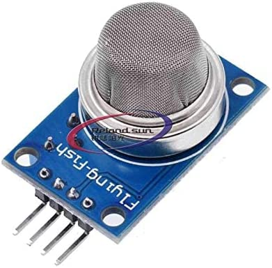

# Temperature and Smoke Detector

Temperature monitoring and smoke detection across a number of rooms at a facility.



## You Will Need

* [Notecard Lora](https://shop.blues.com/collections/notecard/products/notecard-lora)
* [LoRaWAN Gateway](https://shop.blues.com/collections/accessories/products/lorawan-gateway)
* [Notecarrier F](https://shop.blues.com/collections/notecarrier/products/notecarrier-f)
* [Swan](https://shop.blues.com/collections/swan/products/swan)
* 2 USB A to micro USB cables
* [MQ2 Gas and Smoke Sensor](https://www.amazon.com/Reland-Sun-MQ-2-Sensor-Module/dp/B09NN39G8X)
* [3.3-to-5v voltage converter](https://www.amazon.com/Comidox-Module-Voltage-Converter-0-9-5V/dp/B07L76KLRY)
* [SparkFun Atmospheric Sensor Breakout - BME280](https://www.sparkfun.com/products/15440)
* Soldering Iron
* 2 USB A to micro USB cables
* 3 male-to-female jumper wires

## Notehub Setup

Sign up for a free account on [notehub.io](https://notehub.io) and [create a new project](https://dev.blues.io/quickstart/notecard-quickstart/notecard-and-notecarrier-a/#set-up-notehub).

## LoRa Gateway Setup

Before you can use the Notecard LoRa you need to have a LoRaWAN gateway that is provisioned to The Things Network.  To make this easy you can use the [Blues Indoor LoRaWAN Gateway](https://shop.blues.com/products/blues-starter-kit-lorawan).  To get this set up follow the [setup instructions](https://dev.blues.io/lora/connecting-to-a-lorawan-gateway/)

## Swan Setup

First connect your Blues Swan and Notecard to your Notecarrier-F.

1. Follow the steps in the [Notecard Quickstart](https://dev.blues.io/quickstart/notecard-quickstart/notecard-and-notecarrier-f/#connect-your-notecard-and-notecarrier) to connect your Notecard LoRa to your Notecarrier-F.  Your antenna will only have one cable, and the Notecard LoRa only has one connection.

2. Plug your Swan into the Feather headers on the Notecarrier F.

3. Attach the Swan to your computer with a Micro USB to USB-A cable, using the **Micro USB port on the Swan**.


### MQ2 Sensor Connection

This solution makes use of the an MQ2 sensor module, which detects smoke, as well as various gasses. Using the 3 male-to-female jumper wires, connect the MQ2 sensor to the Sparrow Reference Sensor board and the v5 converter as follows:

1. Solder a set of headers onto the 5v converter.
1. Connetor a jumper to `GND` pad on the 5v converter and the other end  to a `GND` pin on the Notecarrier-F.
1. Connect a jumper to `GND` on the sensor and the other end  to a `GND` pin on the Notecarrier-F.
2. Connect a jumper to `Vi` on the converter and the other end to  `F_3V3` on the Notecarrier-F. 
2. Connect a jumper to `Vo` on the converter and the other end to the  `VCC` pin on the MQ2 sensor.
3. Connect a jumper to `A0` on the sensor and the other end to the `F_A0` pin on the Notecarrier-F.
4. The 4th pin on the sensor is left unconnected.

### Temperature Sensor Connection

This solution makes use of the BME280 sensor board, which measures temperature and humidity. Connect the BME280 sensor to the Swan board using the Qwiic cable:

1. Insert one end of the Qwiic cable into the port labelled Qwiic on the Swan board
2. Insert the other end of the Qwiic cable into either of the Qwiic sockets on the BME280 sensor board.


*Note I have the Adafruit version of the sensor rather then the Sparkfun one.  They are the same except the LED cannot be disabled on the Adafruit version*

With the Swan board powered on, you will see a red LED light up on the BME280 board, indicating that it is receiving power. To improve battery life, you may wish to cut the LED jumper to disable the LED. For more details, see the "LED Jumper" section in the [Sparkfun Qwiic Atmospheric Sensor (BME280) Hookup Guide](https://learn.sparkfun.com/tutorials/qwiic-atmospheric-sensor-bme280-hookup-guide/hardware-overview).

## Firmware

The firmware provided uses the Arduino Framework, follow the [instructions in the git repo](firmware/) to flash your Swan.

## Temperature Monitoring and Smoke Alerting Behavior

The firmware periodically monitors temperature and gas concentrations, and posts events with this information. Regular monitoring events are not synced immediately to Notehub, and will be delivered as often as the Notecard is configured to sync with Notehub via the [`hub.set`](https://dev.blues.io/api-reference/notecard-api/hub-requests/#hub-set) request.  This value is configure with the `MQ2_SYNC_PERIOD` define in the file [`./firmware/main.cpp`](./firmware/main.cpp) 

Temperature and Gas measurements are posted to the Notefile `mq2.qo`. An event has these properties:

```cpp
{
  "app" : "nf31",       // the application name
  "gas": 6319,            // Gas/Smoke level (analog input value out of 65535)
  "humidity" : 60.21875,    // ambient humidity (in percent)
  "pressure" : 97019.08,  // ambient pressure (in pascals)
  "temperature" : 24.859375 // ambient temperature (in °C)
}
```

Each reading taken is checked against the [configured thresholds](#configuration). If any reading is higher than the corresponding threshold, the event is sent immediately to Notehub as an alert. Alerts are distinguished from regular monitoring events by the `alert` property.

```cpp
{
  "alert" : 1,          // Signifies an alert
  "app" : "nf31",       // the application name
  "gas": 43277,            // Gas/Smoke level (analog input value out of 65535)
  "humidity" : 60.21875,    // ambient humidity (in percent)
  "pressure" : 97019.08,  // ambient pressure (in pascals)
  "temperature" : 24.859375 // ambient temperature (in °C)
}
```

The `alert` property has these values:

* `alert:1`: Indicates an alert condition regarding temperature or presence of smoke or gas has been detected. The event is immediately synced to Notehub. You can use this to signal an alert externally, such as notifying a pager other messaging service.

* `alert:2`: Signifies that the alert is still ongoing. Subsequent alerts after the initial alert have the `alert` property set to `2`, indicating that the alert is ongoing because temperature or gas levels haven't returned to normal. These events are not immediately sent to notehub, and are provided for continuous monitoring.

* `alert:3`: Signifies a stand-down alert and that temperature and gas levels have returned to normal. These events are sent immediately to notehub. This is typically used to send an external notification that normal temperature and gas levels have been reached.

When temperature and gas levels return to normal, `alert:3` is the last event sent with the `alert` property present. Subsequent events do not have the `alert` property present until a new alert condition is detected.


### Configuration

The file [`./firmware/main.cpp`](./firmware/main.cpp) contains a number of `#define`s that are used to configure how often temperature and gas levels are measured and the thresholds that trigger an alert:

| Name     | Default  | Unit    | Description |
|----------|----------|---------|-------------|
| `MQ2_SYNC_PERIOD` | 60 | minutes | The period in minutes for the notecard to sync regular events.
| `MQ2_MONITOR_PERIOD` | 60 | seconds | The period in seconds between each sensor reading.
| `ALERTS_ONLY` | false | boolean | When true, disables reporting of regular monitoring events and only alerts are sent. |
| `SYNC_ALL_NOTES` | false | boolean | When true, forces immediate  reporting of regular monitoring events. Useful for debugging.|
| `ALERT_TEMPERATURE` | 50.0 | C | Trigger an alert when the temperature is at least this high. Set to 0 to disable temperature alerts. |
| `ALERT_GAS_LEVEL` | 40000 | 1-65535 | Trigger an alert when the measured gas level is at least this high. Set to 0 to disable gas level alerts. |

### Calibrating the Gas Sensor

The MQ2 sensor indicates the the gas level detected by way of the the voltage produced on the A0 analog output - a higher voltage means more gas or smoke was detected. The absolute value of this voltage is not calibrated. Additionally, some sensors feature a potentiometer to adjust the sensitivity, which further changes the range of voltages the sensor outputs.

In order to determine the range of values you should test the solution in clean air, and, if possible, in a smokey environment in order to determine a suitable value for `ALERT_GAS_LEVEL`.

## Blues Community

We’d love to hear about you and your project on the [Blues Community Forum](https://discuss.blues.io/)!

## Additional Resources

* [Sparrow Datasheet](https://dev.blues.io/datasheets/sparrow-datasheet/)
* [Sparrow Hardware Behavior](https://dev.blues.io/sparrow/sparrow-hardware-behavior/) (e.g. what do the various Sparrow LEDs indicate?)
* [MQ2 Datasheet](https://www.mouser.com/datasheet/2/321/605-00008-MQ-2-Datasheet-370464.pdf)
