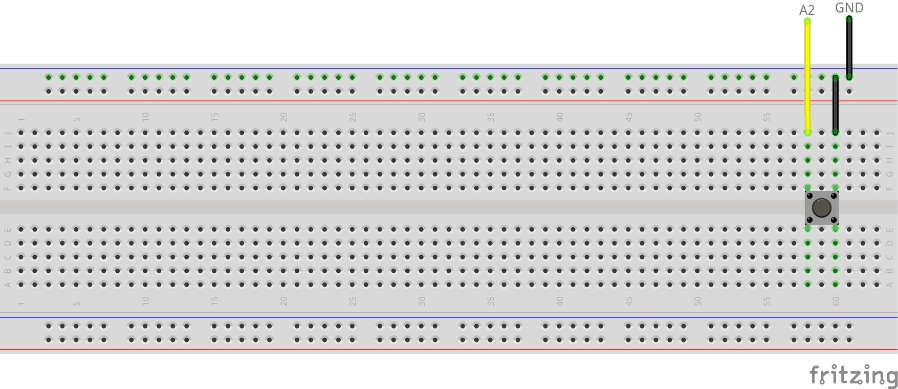
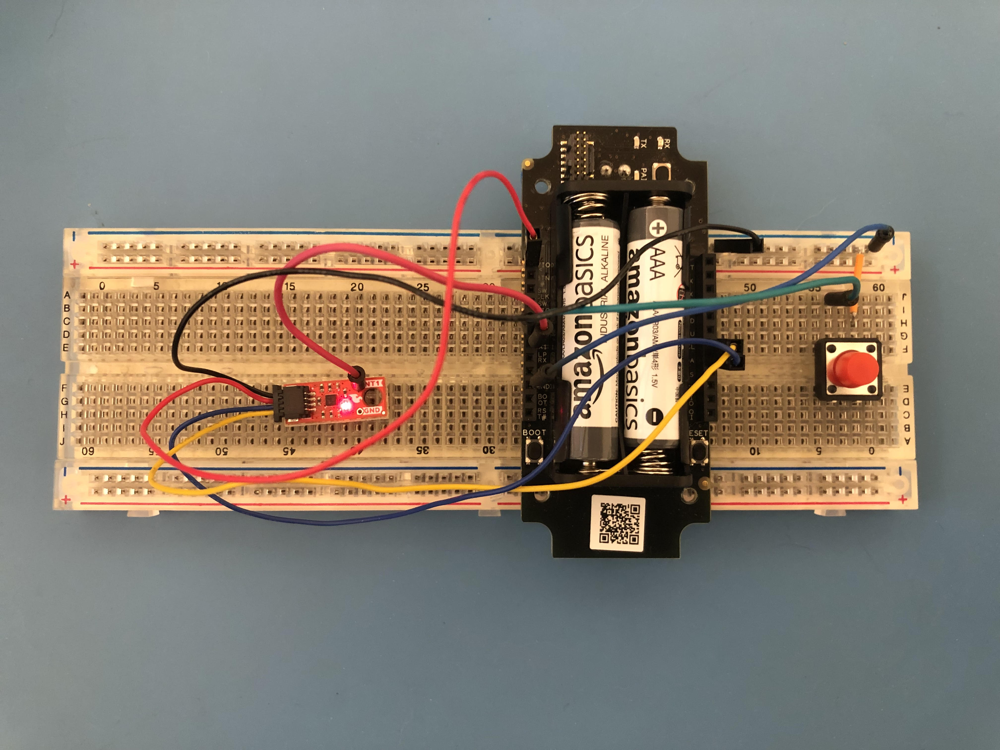
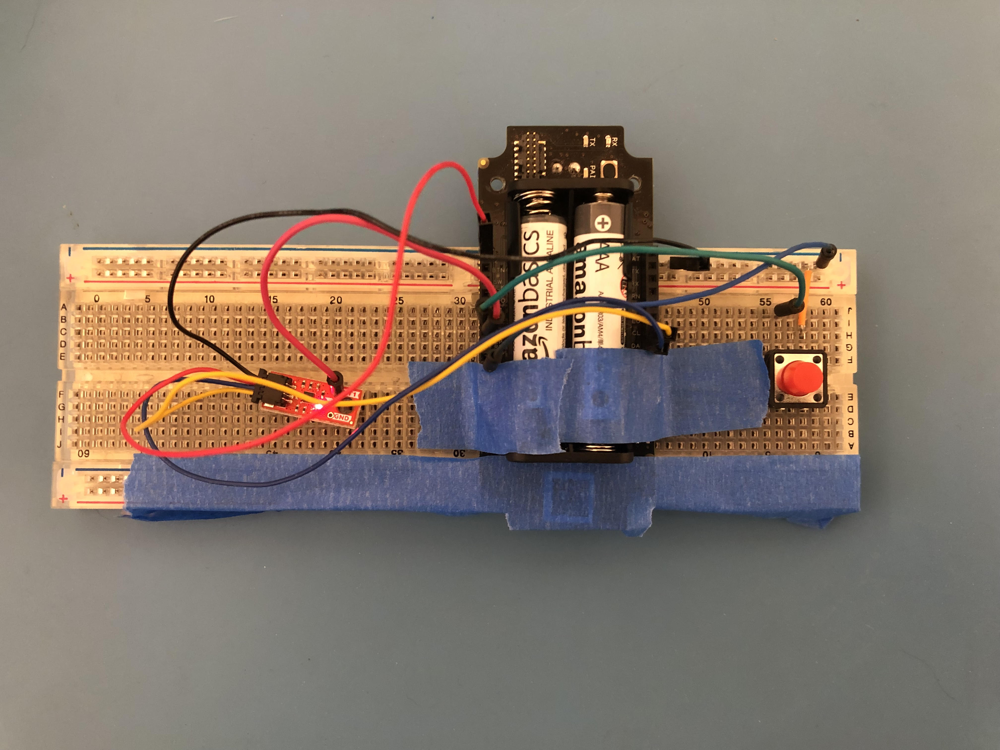

# Fall Detector and Panic Button

**Warning: This project uses Sparrow, a Blues product that is no longer under active development. We are working on updating this project to the successors of Sparrow: [Notecard LoRa](https://blues.com/notecard-lora/) and the [LoRaWAN Starter Kit](https://shop.blues.com/products/blues-starter-kit-lorawan). In the meantime, if you would like assistance building a Fall Detector and Panic Button feel free to reach out on [our community forum](https://discuss.blues.com/).**

Receive a notification when a fall is detected and provide a panic button to alert a response team.

## You Will Need

* Sparrow Development Kit
* [1 push button](https://www.sparkfun.com/products/14460)
* [SparkFun Micro Triple Axis Accelerometer Breakout - BMA400 (Qwiic)](https://www.sparkfun.com/products/21207)
* [Qwiic Cable - Breadboard Jumper (4-pin)](https://www.sparkfun.com/products/14425)
* 2 USB A to micro USB cables
* Breadboard
* Jumper wires
* Solder flux
* Soldering iron
* Tape

## Notehub Setup

Sign up for a free account on [notehub.io](https://notehub.io) and [create a new project](https://dev.blues.io/quickstart/notecard-quickstart/notecard-and-notecarrier-a/#set-up-notehub).

## Sparrow Setup

### Quickstart

Follow the [Sparrow Quickstart](https://dev.blues.io/quickstart/sparrow-quickstart/) to get your Sparrow reference node paired with the gateway and associated with the Notehub project you just created. Note also that we'll only need one reference node for this project, so you don't need to pair both nodes that came with the dev kit. Make sure that you use the ProductUID generated in [Notehub Setup](#notehub-setup) when it comes time to issue the `hub.set` command in the quickstart.

After you've completed the quickstart, leave the Notecarrier and essentials board powered and connected. These two devices will act as our gateway to Notehub, and we won't need to touch them again. The rest of this guide will focus on the reference node.

### Hardware

There are two primary pieces of hardware: the button and the accelerometer.

The button will be wired to a GPIO pin on the reference node. This pin uses an internal pull-up so that the it reads a digital 1 when the button isn't pushed. When the button is pushed, it connects the corresponding GPIO pin to GND so that it reads a digital 0. Using the breadboard, button, and jumper wires, wire up the hardware as shown in the diagram below, connecting one side of the button to A2 and the other to the minus (-) rail of the breadboard. Make sure to then connect the minus rail to the reference node's GND port.



Now, when the button is pressed, it will connect A2 to GND.

The accelerometer board has a hole on it labeled INT1. This is the interrupt line that our app will use to detect a fall event, so we need to connect it to the reference node. To do that:

1. Take a male-to-male jumper wire that fits the hole. We've found that a [standard DuPont jumper wire](https://www.amazon.com/SUNKEE-Dupont-Color-Jumper-2-54mm/dp/B00AX3PHV6) with a square shape may not fit this hole. If that's the case, you can try using a [jumper wire with a rounded shape](https://www.amazon.com/Breadboard-Jumper-Wire-75pcs-pack/dp/B0040DEI9M).
2. Push one end of the wire as far as it'll go through the hole. This is so that when it's soldered in, we can plug it into the breadboard.
3. Using your soldering iron and flux, solder the jumper into place.
4. Seat the accelerometer onto the breadboard using the exposed end of the wire sticking out under the accelerometer board.
5. Connect the other end of the wire to pin A1 on the reference node.

The accelerometer also has a Qwiic port that needs to be wired up to the Sparrow reference node. Plug the Qwiic breadboard jumper cable into this port, and then on the other end make the following connections:

* Connect the black wire to GND via the breadboard's minus rail.
* Connect the red wire to VIO on the node.
* Connect the blue wire to SDA on the node.
* Connect the yellow wire to SCL on the node.

Now, everything is wired up. It should look something like this:



Since this is a fall detector, we're going to need to drop this assembly from a decent height to simulate a person falling. To keep things secure, we can just tape everything to the breadboard.



### Firmware

Next, we need to flash the reference node with the firmware.

1. Before we do anything, we need to pull in some dependencies for the firmware to work. After cloning this repository, run these commands: `git submodule update --init 32-fall-detection-and-panic-button/firmware/note-c` and `git submodule update --init 32-fall-detection-and-panic-button/firmware/sparrow-lora`. This will pull in the note-c and sparrow-lora submodules that this project depends on.
1. There are a few ways to build and flash the firmware onto the reference node. These are covered in the [Sparrow Builder's Guide](https://dev.blues.io/sparrow/sparrow-builders-guide/). Follow the steps in that guide and then return to these instructions.
1. Connect the STLINK-V3MINI to your development PC with a USB A to micro USB cable.
1. Connect the STLINK to your reference node with the 2x7 JTAG ribbon cable.
1. Build and flash the code using whichever method you selected when following the Sparrow Builder's Guide.
1. Open a terminal emulator and connect to the STLINK's serial connection to view logs. See the documentation [here](https://dev.blues.io/sparrow/sparrow-builders-guide/#collecting-firmware-logs).
1. Start the program in debug mode (again, how you do this depends on the IDE: VS Code or STM32CubeIDE). In your terminal emulator's output, you should see something like this:

```
===================
===================
===== SPARROW =====
===================
Feb 16 2023 22:42:58
2037335832365003001d001f
APPLICATION HOST MODE
CONSOLE TRACE ENABLED
```

## Testing

To test the panic button, simply press the button, and you should see a Note on your Notehub project's Events page like this:

```json
{
    "panic": true
}
```

The "File" for these notes is `ID#panic.qo`, where ID is an alphanumeric string that uniquely identifies the reference node.

To test the fall detector, position some form of cushion on the floor to catch the hardware after you drop it. Then, unplug everything connecting the hardware to your PC. Raise the breadboard a couple feet over your cushion and drop it. Soon, you should see a note on Notehub like this:

```json
{
    "fall": true
}
```

Similar to the panic button notes, the "File" for these notes is `ID#fall.qo`, where ID is that same alphanumeric string that uniquely identifies the reference node.

By default, the accelerometer needs to be in free fall for 300ms to produce a fall event. If you don't see the fall event on Notehub, try dropping the breadboard from a greater height. If you want to detect shorter or longer falls, you can change the value of the macro `BMA400_INTERRUPT_DURATION_DEFAULT`, which is in units of 10ms (so the default is 30: 30 * 10ms = 300ms). You can do this when invoking CMake via `-DCMAKE_C_FLAGS="-DBMA400_INTERRUPT_DURATION_DEFAULT=<some value>"`, replacing `<some value>` with your custom value.

## Blues Community

We’d love to hear about you and your project on the [Blues Community Forum](https://discuss.blues.io/)!

## Additional Resources

* [Sparrow Datasheet](https://dev.blues.io/datasheets/sparrow-datasheet/)
* [Sparrow Hardware Behavior](https://dev.blues.io/sparrow/sparrow-hardware-behavior/) (e.g. what do the various Sparrow LEDs indicate?)
* [BMA 400 Datasheet](https://www.bosch-sensortec.com/media/boschsensortec/downloads/datasheets/bst-bma400-ds000.pdf)
* [BMA 400 Library](https://github.com/BoschSensortec/BMA400-API)
