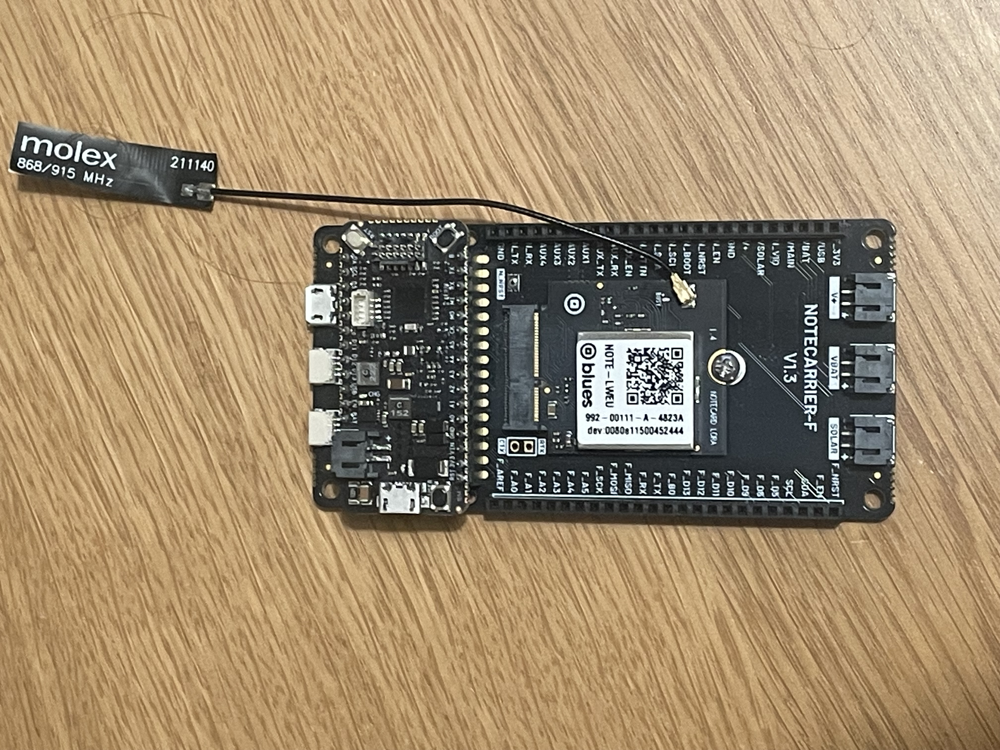
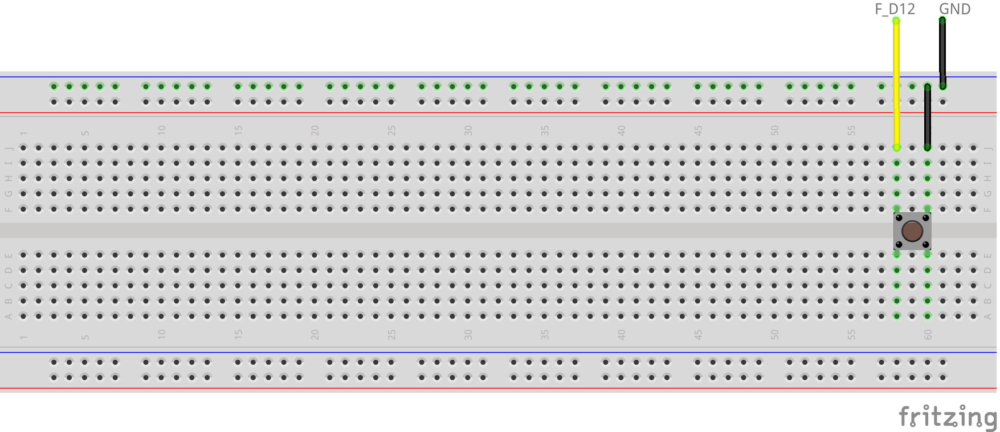
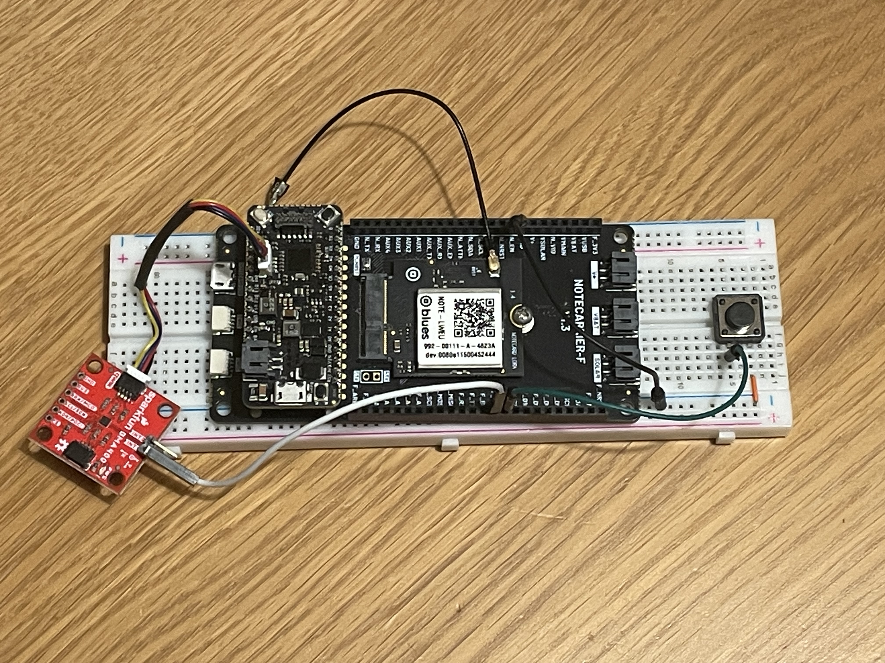
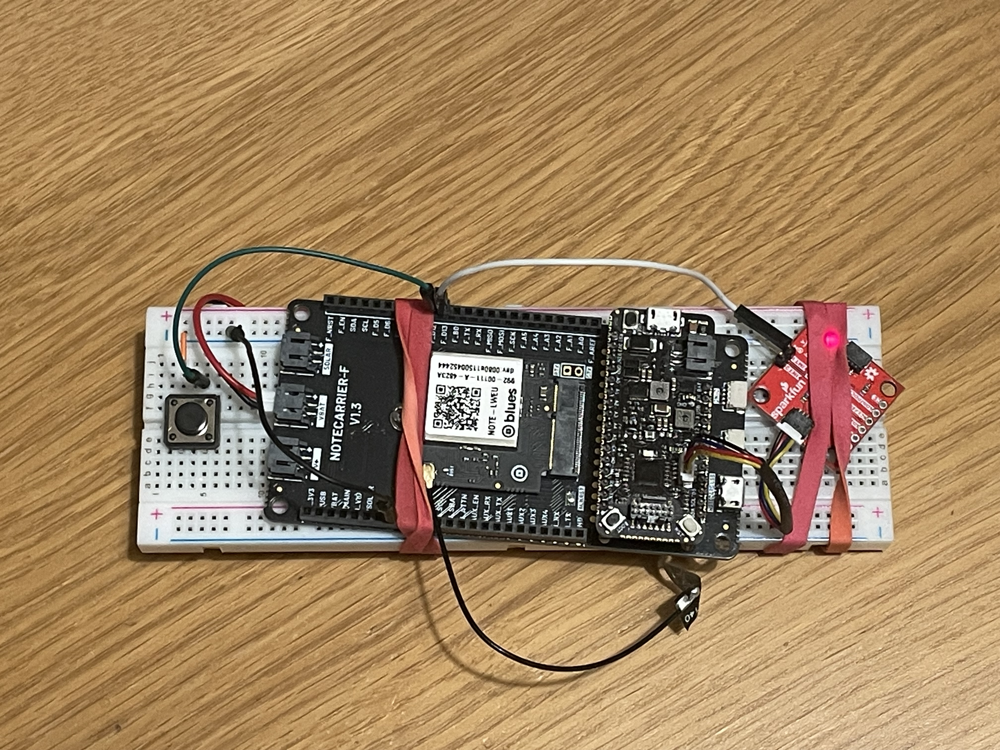

# Fall Detector and Panic Button

Receive a notification when a fall is detected and provide a panic button to alert a response team.

## You Will Need

* [Notecarrier-F](https://shop.blues.com/collections/notecarrier/products/notecarrier-f)
* [Notecard for LoRa](https://shop.blues.com/products/notecard-lora)
* [1 push button](https://www.sparkfun.com/products/14460)
* [SparkFun Micro Triple Axis Accelerometer Breakout - BMA400 (Qwiic)](https://www.sparkfun.com/products/21207)
* *or* [SparkFun Triple Axis Accelerometer Breakout - BMA400 (Qwiic)](https://www.sparkfun.com/products/21208)
* [Flexible Qwiic Cable - 50mm](https://www.sparkfun.com/products/17260)
* [LiPo Battery](https://shop.blues.com/collections/accessories/products/5-000-mah-lipo-battery)
* 2 USB A to micro USB cables
* Breadboard
* Jumper wires
* Solder flux
* Soldering iron
* Tape or Rubber Bands

## LoRa Gateway Setup

Before you can use the Notecard LoRa you need to have a LoRaWAN gateway that is provisioned to The Things Network.  To make this easy you can use the [Blues Indoor LoRaWAN Gateway](https://shop.blues.com/products/blues-starter-kit-lorawan).  To get this set up follow the [setup instructions](https://dev.blues.io/lora/connecting-to-a-lorawan-gateway/)

## Swan Setup

First connect your Blues Swan and Notecard to your Notecarrier F.

1. Follow the steps in the [Notecard Quickstart](https://dev.blues.io/quickstart/notecard-quickstart/notecard-and-notecarrier-f/#connect-your-notecard-and-notecarrier) to connect your Notecard LoRa to your Notecarrier F.  Your antenna will only have one cable, and the Notecard LoRa only has one connection.

2. Plug your Swan into the Feather headers on the Notecarrier F.

3. Attach the Swan to your computer with a Micro USB to USB-A cable, using the **Micro USB port on the Swan**.



## Hardware Setup

There are two primary pieces of hardware: the button and the accelerometer.

The button will be wired to a GPIO pin on the Swan. This pin uses an internal pull-up so that the it reads a digital 1 when the button isn't pushed. When the button is pushed, it connects the corresponding GPIO pin to GND so that it reads a digital 0. Using the breadboard, button, and jumper wires, wire up the hardware as shown in the diagram below, connecting one side of the button to F_D12 and the other to the minus (-) rail of the breadboard. Make sure to then connect the minus rail to one of the GND pins on the Notecarrier-F.



Now, when the button is pressed, it will connect F_D12 to GND.

The accelerometer board has a hole on it labeled INT1. This is the interrupt line that our app will use to detect a fall event, so we need to connect it to the reference node. To do that:

1. Take a male-to-male jumper wire that fits the hole. We've found that a [standard DuPont jumper wire](https://www.amazon.com/SUNKEE-Dupont-Color-Jumper-2-54mm/dp/B00AX3PHV6) with a square shape may not fit this hole. If that's the case, you can try using a [jumper wire with a rounded shape](https://www.amazon.com/Breadboard-Jumper-Wire-75pcs-pack/dp/B0040DEI9M).
2. Push one end of the wire as far as it'll go through the hole. This is so that when it's soldered in, we can plug it into the breadboard.
3. Using your soldering iron and flux, solder the jumper into place.
4. Seat the accelerometer onto the breadboard using the exposed end of the wire sticking out under the accelerometer board.
5. Connect the other end of the wire to pin F_D13 on the Notecarrier-F.

The accelerometer also has a Qwiic port that needs to be wired up to the Swan Plug the Qwiic jumper cable into this port, and then on the other end to the Qwiic port on the Swan.

Now, everything is wired up. It should look something like this, although I soldered a header onto my BMA400 board, rather than soldering the wire directly:



Since this is a fall detector, we're going to need to drop this assembly from a decent height to simulate a person falling. To keep things from bouncing around, you can secure everything to the breadboard with rubber bands or tape.



## Notehub Setup

Sign up for a free account on [Notehub](https://notehub.io) and [create a new project](https://dev.blues.io/quickstart/notecard-quickstart/notecard-and-notecarrier-pi/#set-up-notehub).

## Firmware

To build and upload the firmware to the Swan, you'll need VS Code with the PlatformIO extension.

1. Download and install [Visual Studio Code](https://code.visualstudio.com/).
2. Install the [PlatformIO IDE extension](https://marketplace.visualstudio.com/items?itemName=platformio.platformio-ide) via the Extensions menu of Visual Studio Code.
3. Click the PlatformIO icon on the left side of VS Code, then click Pick a folder, and select the `firmware` directory within `32-fall-detector-and-panic-button`.
4. In the file explorer, open `src\main.cpp` and uncomment this line: `// #define PRODUCT_UID "com.my-company.my-name:my-project"`. Replace `com.my-company.my-name:my-project` with the [ProductUID of the Notehub project](https://dev.blues.io/notehub/notehub-walkthrough/#finding-a-productuid) you created in [Notehub Setup](#notehub-setup).
5. Click the PlatformIO icon again, and under the Project Tasks menu, click Build to build the firmware image.
6. Prepare the Swan to receive the firmware image via DFU by following these instructions from the [Swan Quickstart](https://dev.blues.io/quickstart/swan-quickstart/#programming-swan-the-stlink-v3mini).
7. Under the Project Tasks menu, click Upload to upload the firmware image to the MCU.

From here, you can view logs from the firmware over serial with a terminal emulator (e.g. minicom). On Linux, the serial device will be something like `/dev/ttyACM0`. Use a baud rate of 115200 and [8-N-1](https://en.wikipedia.org/wiki/8-N-1) for the serial parameters.

## Testing

To test the panic button, simply press the button, and you should see a Note on your Notehub project's Events page like this:

```json
{
    "panic": true
}
```

The "File" for these notes is `panic.qo`.

To test the fall detector, position some form of cushion on the floor to catch the hardware after you drop it. Then, unplug everything connecting the hardware to your PC. Raise the breadboard a couple feet over your cushion and drop it. Soon, you should see a note on Notehub like this:

```json
{
    "fall": true
}
```

Similar to the panic button notes, the "File" for these notes is `fall.qo`.

By default, the accelerometer needs to be in free fall for 300ms to produce a fall event. If you don't see the fall event on Notehub, try dropping the breadboard from a greater height. If you want to detect shorter or longer falls, you can change the value of the macro `BMA400_INTERRUPT_DURATION_DEFAULT`, which is in units of 10ms (so the default is 30: 30 * 10ms = 300ms). You can do this by adding  `-D BMA400_INTERRUPT_DURATION_DEFAULT=<some value>"` to the build_flags in `platformio.ini`, replacing `<some value>` with your custom value.

## Blues Community

We’d love to hear about you and your project on the [Blues Community Forum](https://discuss.blues.io/)!

## Additional Resources

* [BMA 400 Datasheet](https://www.bosch-sensortec.com/media/boschsensortec/downloads/datasheets/bst-bma400-ds000.pdf)
* [BMA 400 Library](https://github.com/BoschSensortec/BMA400-API)
