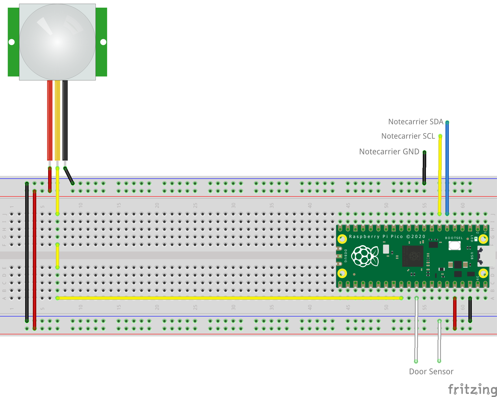

# Room Occupancy Monitor

Receive notifications when motion is detected in a room and when the room's door is opened or closed.

## You Will Need

* [Blues Starter Kit for LoRaWAN](https://shop.blues.com/products/blues-starter-kit-lorawan)
* Raspberry Pi Pico
* USB A to micro USB cable
* [Magnetic Door Switch Set](https://www.sparkfun.com/products/13247)
* [PIR Sensor](https://www.adafruit.com/product/4871)
* [0.1" Jumper Cables](https://www.adafruit.com/product/5018)

## Notehub Setup

Sign up for a free account on [notehub.io](https://notehub.io) and [create a new project](https://dev.blues.io/quickstart/notecard-quickstart/notecard-and-notecarrier-a/#set-up-notehub).

## LoRa Gateway Setup

Before you can use the Notecard LoRa you need to have a LoRaWAN gateway that is provisioned to The Things Network.  To make this easy you can use the [Blues Indoor LoRaWAN Gateway](https://shop.blues.com/products/blues-starter-kit-lorawan).  To get this set up follow the [setup instructions](https://dev.blues.io/lora/connecting-to-a-lorawan-gateway/)


## Pico Setup

Your Raspbery Pi Pico will need to have Micropython installed.  If it is not yet installed, follow the [installation instructions](https://micropython.org/download/RPI_PICO/) provided by MicroPython.

### MicroPython Code

The script that will run on the MCU is [main.py](main.py). It depends on [note-python](https://github.com/blues/note-python), a Python library for communicating with a Notecard.

#### note-python

To get the note-python files onto the MCU, use the `setup_board.py` script. This uses the `pyboard.py` script to communicate with the Raspberry Pi Pico. First, you must identify the MCU's serial port. On Linux, it'll typically be something like `/dev/ttyACM0`. You can run `ls /dev/ttyACM*` before and after plugging the board in to figure out the serial port's associated file. Once you have that, run `python setup_board.py <serial port>`, replacing `<serial port>` with your serial port. This script does a few things:

1. Clones note-python from GitHub.
2. Creates the `/lib` and `/lib/notecard` directories on the MCU.
3. Copies the `.py` files from `note-python/notecard` on your development machine to `/lib/notecard` on the MCU.
4. Lists the contents of `/lib/notecard` so you can verify that everything was copied over.

Note that for `pyboard.py` to work, you'll need to install [pyserial](https://pypi.org/project/pyserial/) with `pip install pyserial`, if you don't have it installed already.

#### Running `main.py`

Before running `main.py`, uncomment this line: `# product_uid = 'com.your-company:your-product-name'`. Replace `com.my-company.my-name:my-project` with the [ProductUID of the Notehub project](https://dev.blues.io/notehub/notehub-walkthrough/#finding-a-productuid) you created in [Notehub Setup](#notehub-setup).

Copy `main.py` over to the board with this command:

```
python pyboard.py -d <serial port> --no-soft-reset -f cp main.py :/
```

 Make sure to replace `<serial port>` with your serial port. `main.py` will start running after boot up.

### Hardware

There are two primary pieces of hardware: the magnetic door switch and a PIR motion sensor.

The magnetic door switch consists of two plastic terminals, one of which has a pair of wires coming out of it. When the terminals are brought into contact (or close proximity), an internal [reed switch](https://en.wikipedia.org/wiki/Reed_switch) is closed and the two wires are electrically connected. As shown on the [SparkFun product site](https://www.sparkfun.com/products/13247), the terminal with the wires is typically mounted to a door frame and the other terminal is mounted to the door such that when the door is closed, the two terminals are adjacent, closing the switch. Since we're just testing things out, don't mount the terminals yet.

The PIR motion sensor contains circuitry to convert the readings from the sensor into a simple high value on the data line for 2 seconds when motion is detected. Attach the jumper cables to the sensor so that it can be mounted away from the board.

Place the Pico into a Breadboard with the USB connection on the outer edge.Make the following connections:

Pico Power:

    GND on Pico (Pin 38) to Breadboard Ground Rail
    3V3 OUT on Pico (Pin 36) to Breadboad +VE Rail

Door Sensor:

    GP21 on Pico (Pin 27) to Magnetic Door Sensor
    GND Rail on Breadboard to Magnetic Door Sensor

PIR Sensor:

    Pin 1 of the sensor to Breadboard Ground Rail
    Pin 2 of the sensor to GP22 on Pico (Pin 29)
    Pin 3 of the sensor to Breadboad +VE Rail

The Notecarrier can be connected with a Qwiic cable with the following connctions:.

    Qwiic Black (GND) to Pico GND
    Qwiic Blue (SDA) to  Pico GP4 (Pin 6)
    Qwiic Yellow (SCL) to Pico GP5 (Pin 7)

Do not connect the Red cable of the Qwiic connector.  If you wish to power the Pico from the Notecarrier (which makes sense after testing) connect VMAIN on the Notecarrier to VSYS (Pin 39) on the Pico.

See the image below for a diagram of the connections required.



## Testing

To test the magnetic door switch, do the following:

1. Bring the terminals together. You should see the message `Door closed.` in the serial log. Then, on the events page of your Notehub project, you should see a Note that reads `{"open":false}`, indicating the door is closed.
1. Separate the terminals. You should see the message `Door open.` in the serial log. Then, on the events page of your Notehub project, you should see a Note that reads `{"open":true}`, indicating the door is open.

The "File" field for each Note on the events page will be `door.qo`.

Now, to test the PIR motion sensor, wave your hand in front of the plastic dome or walk by it. After some time you should see a Note on the events page for your project like this:

```json
{
  "count": 1,
  "total": 12
}
```

`count` indicates the number of motion events since the last Note, while `total` is the total number of events since the device first started running. Similar to the door state Notes, the "File" for these Notes is `motion.qo`.

In order to keep traffic to Notehub reasonable, a motion Note will only be sent a maximum of once every 5 minutes. So, many motion events may be coalesced into a single Note. In that case, you would see a `count` value greater than 1. If you want to lengthen or shorten this interval, you can modify the value of `PIRSupressionMins` in `main.py`:

```python
PIRSupressionMins = 5
```

## Blues Community

We’d love to hear about you and your project on the [Blues Community Forum](https://discuss.blues.io/)!
