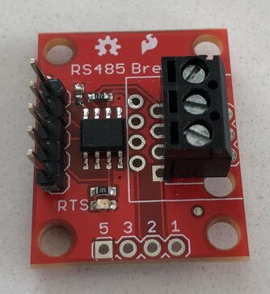
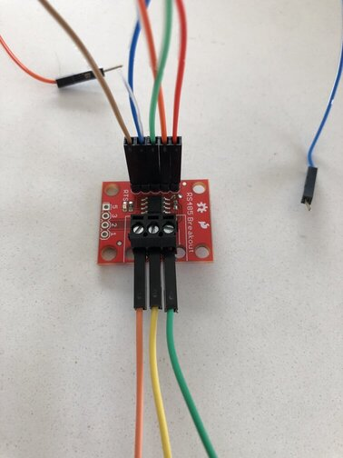
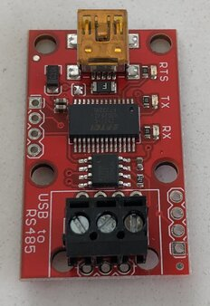
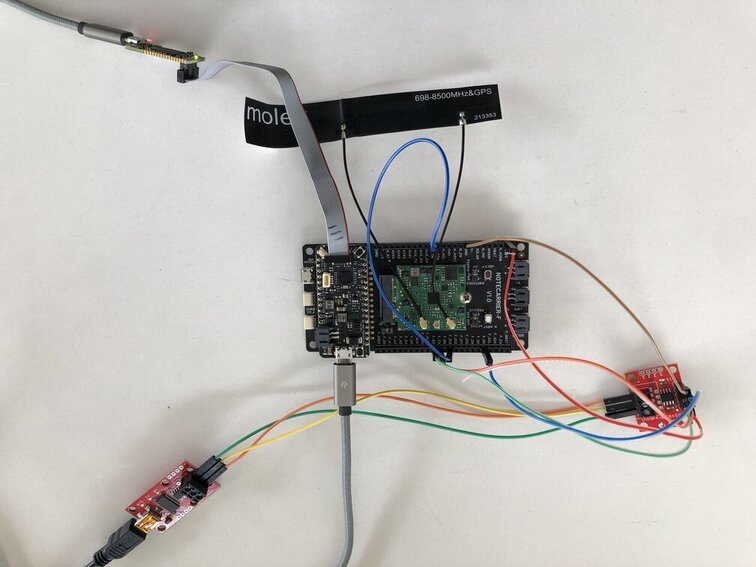

# Cellular Modbus Client

Send requests and receive responses from Modbus servers via cellular.

- [Cellular Modbus Client](#cellular-modbus-client)
  - [You Will Need](#you-will-need)
  - [Hardware Setup](#hardware-setup)
    - [RS-485 Transceiver Breakout](#rs-485-transceiver-breakout)
    - [USB to RS-485 Converter](#usb-to-rs-485-converter)
    - [Notecarrier](#notecarrier)
  - [Notehub Setup](#notehub-setup)
  - [Firmware](#firmware)
    - [Operation](#operation)
        - [Request Types](#request-types)
            - [Read Coils](#read-coils)
            - [Read Discrete Inputs](#read-discrete-inputs)
            - [Read Holding Registers](#read-holding-registers)
            - [Read Input Registers](#read-input-registers)
            - [Write Single Coil](#write-single-coil)
            - [Write Single Register](#write-single-register)
            - [Write Multiple Coils](#write-multiple-coils)
            - [Write Multiple Registers](#write-multiple-registers)
        - [Response Types](#response-types)
            - [Reads](#reads)
            - [Writes](#writes)
            - [Errors](#errors)
  - [Testing](#testing)
    - [Simple Test](#simple-test)
    - [Test Script](#test-script)
  - [Blues Community](#blues-community)
  - [Additional Resources](#additional-resources)

## You Will Need

* [Visual Studio Code (VS Code)](https://code.visualstudio.com/) with the [PlatformIO extension](https://platformio.org/)
* [Notecarrier F](https://blues.io/products/notecarrier/notecarrier-f/)
* [Notecard](https://blues.io/products/notecard/)
* [Swan](https://blues.io/products/swan/)
* [SparkFun Transceiver Breakout - RS-485](https://www.sparkfun.com/products/10124)
* [SparkFun USB to RS-485 Converter](https://www.sparkfun.com/products/9822)
* [2 Screw Terminals 3.5mm Pitch (3-Pin)](https://www.sparkfun.com/products/8235)
* [STLINK-V3MINI](https://shop.blues.io/collections/accessories/products/stlink-v3mini)
* 2 micro USB cables
* [1 USB mini-B cable](https://www.sparkfun.com/products/13243)
* Male-to-male jumper wires
* Female-to-male jumper wires
* Soldering iron and solder flux

## Hardware Setup

This application uses [Modbus RTU](https://en.wikipedia.org/wiki/Modbus#Modbus_RTU_frame_format) with RS-485 for Modbus communication between the client and server. The RS-485 transceiver breakout is used by the client running on the Swan to send and receive Modbus messages. The USB to RS-485 converter is used by the server running on your development PC to send and receive Modbus messages.

### RS-485 Transceiver Breakout

To use the RS-485 transceiver breakout board, solder on a row of 5 male headers and one of the 3-pin screw terminals:



Using a small flat head screwdriver, loosen the screws on the screw terminal and insert a male-to-male jumper wire into each port, tightening the screws after. Then, attach the female end of 5 female-to-male jumper wires to the male headers you just soldered on:



### USB to RS-485 Converter

To use the USB to RS-485 converter, solder on the remaining 3-pin screw terminal:



Loosen the screws on the screw terminal and connect the loose ends of the male-to-male jumper wires from the RS-485 transceiver breakout to the corresponding ports of the converter's screw terminal, tightening the screws after. The pins are labeled on the backsides of both boards: B, A, and G.


Connect the converter to your development PC with the USB mini-B cable.

### Notecarrier

1. Assemble Notecard and Notecarrier as described in the [Notecard Quickstart](https://dev.blues.io/quickstart/notecard-quickstart/notecard-and-notecarrier-f/).
1. Plug the Swan into the Notecarrier, aligning the Swan's male headers with the Notecarrier's female headers.
1. Flip the DIP switch labeled DFU away from ON so it's off. This is required to communicate with the RS-485 transceiver breakout.
1. Make the following connections between the RS-485 transceiver breakout and the Notecarrier using the loose ends of the male-to-male headers (the breakout pins are labeled on the backside of the board):
    | Breakout | Notecarrier |
    | ---------| ------------|
    | 3-5V     | F_3V3       |
    | RX-I     | F_TX        |
    | TX-O     | F_RX        |
    | RTS      | F_D5        |
    | GND      | GND         |
1. Use a male-to-male jumper wire to connect the ATTN and F_D13 pins of the Notecarrier.
1. Connect one end of the JTAG ribbon cable that came with the STLINK to the STLINK and the other end to the Swan.
1. Connect the STLINK to your development PC with a micro USB cable.
1. Connect the Swan to your development PC with the remaining micro USB cable.



## Notehub Setup

Sign up for a free account on [notehub.io](https://notehub.io) and [create a new project](https://dev.blues.io/quickstart/notecard-quickstart/notecard-and-notecarrier-pi/#set-up-notehub).

## Firmware

### Operation

The firmware relies on the [ArduinoRS485](https://github.com/arduino-libraries/ArduinoRS485) and [ArduinoModbus](https://github.com/arduino-libraries/ArduinoModbus) libraries to handle the details of the RS-485 and Modbus RTU protocols, respectively. At the application level, the firmware is driven by 2 [Notefiles](https://dev.blues.io/api-reference/glossary/#notefile): `requests.qi` and `responses.qo`. The code uses the [Notecard's ATTN pin](https://dev.blues.io/guides-and-tutorials/notecard-guides/attention-pin-guide/) to detect new requests added to `requests.qi`. When it gets one, the firmware parses the request and sends out a corresponding Modbus frame over the Modbus. The firmware parses the response from the server and adds a response to `responses.qo`. The following Modbus functions are supported:

| Function                 | Function Code |
| -------------------------| --------------|
| Read Coils               | 1             |
| Read Discrete Inputs     | 2             |
| Read Holding Registers   | 3             |
| Read Input Registers     | 4             |
| Write Single Coil        | 5             |
| Write Single Register    | 6             |
| Write Multiple Coils     | 15            |
| Write Multiple Registers | 16            |

To call any of these functions, add a note with the proper structure to `requests.qi`. The structure for each type is described in the following sections. There are a few fields common to all types:

- `server_addr`: The address of the Modbus server.
- `seq_num`: A sequence number for the request. This number will be included in the response note in `responses.qo` so that requests can be matched to responses. The user should increment this value with every new request.
- `func`: The Modbus function code.
- `data`: A JSON object containing the function-specific data for the request. This object always contains an `addr` field, which specifies the start address of the coil(s)/register(s) to read/write.

#### Request Types

##### Read Coils

```json
{
    "server_addr": 1,
    "seq_num": 0,
    "func": 1,
    "data": {
        "addr": 0,
        "num_bits": 16
    }
}
```

`num_bits` is the number of coils to read, starting from `addr`.

##### Read Discrete Inputs

```json
{
    "server_addr": 1,
    "seq_num": 1,
    "func": 2,
    "data": {
        "addr": 0,
        "num_bits": 16
    }
}
```

This is identical to the request for read coils, except the function code is 2 instead of 1.

##### Read Holding Registers

```json
{
    "server_addr": 1,
    "seq_num": 3,
    "func": 3,
    "data": {
        "addr": 0,
        "num_regs": 2
    }
}
```

`num_regs` is the number of 16-bit holding registers to read, starting from `addr`.

##### Read Input Registers

```json
{
    "server_addr": 1,
    "seq_num": 4,
    "func": 4,
    "data": {
        "addr": 0,
        "num_regs": 2
    }
}
```

This is identical to the request for read holding registers, except the function code is 4 instead of 3.

##### Write Single Coil

```json
{
    "server_addr": 1,
    "seq_num": 5,
    "func": 5,
    "data": {
        "addr": 2,
        "val": 1,
    }
}
```

`addr` is the address of the coil to write and `val` is the value to write. Since coils are binary, `val` must be 0 or 1.

##### Write Single Register

```json
{
    "server_addr": 1,
    "seq_num": 6,
    "func": 6,
    "data": {
        "addr": 4,
        "val": 199
    }
}
```

`addr` is the address of the register to write and `val` is the value to write. Since registers are 16-bits, `val` must fit into 16 bits. Note that only holding registers are writable. Input registers are read only.

##### Write Multiple Coils

```json
{
    "server_addr": 1,
    "seq_num": 7,
    "func": 15,
    "data": {
        "addr": 0,
        "num_bits": 16,
        "coil_bytes": [99, 171]
    }
}
```

`addr` is the start address of the coils to write. `num_bits` is the number of coils to write. `coil_bytes` is an array of bytes containing the values to write. The least significant bit (LSB) of the first byte corresponds to the value to write at `addr`, the next most significant bit corresponds to `addr + 1`, and so on. The next byte's LSB corresponds to `addr + 8`, the next most significant bit of that byte to `addr + 9`, and so on. This table shows what values would be written to which addresses using the above example (in binary, 99 is 01100011 and 171 is 10101011):

| Address   | Value |
| ----------|-------|
| addr      | 1     |
| addr + 1  | 1     |
| addr + 2  | 0     |
| addr + 3  | 0     |
| addr + 4  | 0     |
| addr + 5  | 1     |
| addr + 6  | 1     |
| addr + 7  | 0     |
| addr + 8  | 1     |
| addr + 9  | 1     |
| addr + 10 | 0     |
| addr + 11 | 1     |
| addr + 12 | 0     |
| addr + 13 | 1     |
| addr + 14 | 0     |
| addr + 15 | 1     |

If the number of bits to write (as indicated by `num_bits`) isn't a multiple of 8, the last byte should be padded with 0s.

##### Write Multiple Registers

```json
{
    "server_addr": 1,
    "seq_num": 8,
    "func": 16,
    "data": {
        "addr": 2,
        "vals": [4369, 8738]
    }
}
```

`addr` is the start address of the registers to write. `vals` is an array of 16-bit values to write. The first value will be written to `addr`, the second to `addr + 1`, and so on. Again, only holding registers are writable.

#### Response Types

All responses have a `seq_num` field, which is the sequence number corresponding to the request that produced the response.

##### Reads

On success, reading coils or discrete inputs has this response format:

```json
{
    "bits": [250, 112],
    "seq_num": 0
}
```

`bits` is a byte array packed in the same fashion as described in [Write Multiple Coils](#write-multiple-coils).

Successful reading of registers has this response format:

```json
{
    "regs": [291, 43981],
    "seq_num": 5
}
```

`regs` is an array of 16-bit register values.

##### Writes

All successful write operations have the same response format:

```json
{
    "seq_num": 1
}
```

##### Errors

If any request results in an error, a response of this form will be added to `responses.qo`:

```json
{
    "error": "Illegal data address",
    "seq_num": 11
}
```

`error` is a string describing the error. In this example, a bad address was supplied in the `addr` field of the corresponding request.

### Building and Flashing

To build and upload the firmware onto the MCU, you'll need VS Code with the PlatformIO extension.

1. Download and install [Visual Studio Code](https://code.visualstudio.com/).
1. Install the [PlatformIO IDE extension](https://marketplace.visualstudio.com/items?itemName=platformio.platformio-ide) via the Extensions menu of Visual Studio Code.
1. Click the PlatformIO icon on the left side of VS Code, then click Pick a folder, and select the the firmware directory, `34-cellular-modbus-client/firmware`.
1. In the file explorer, open `main.cpp` and uncomment this line: `// #define PRODUCT_UID "com.my-company.my-name:my-project"`. Replace `com.my-company.my-name:my-project` with the [ProductUID of the Notehub project](https://dev.blues.io/notehub/notehub-walkthrough/#finding-a-productuid) you created in [Notehub Setup](#notehub-setup).
1. Click the PlatformIO icon again, and under the Project Tasks menu, click Build to build the firmware image.
1. Under the Project Tasks menu, click Upload to upload the firmware image to the MCU.

From here, you can view logs from the firmware over serial with a terminal emulator (e.g. minicom). On Linux, the serial device will be something like `/dev/ttyACM0`. Use a baud rate of 115200 and [8-N-1](https://en.wikipedia.org/wiki/8-N-1) for the serial parameters.

## Testing

The tests described in this section rely on the [`server.py`](./server.py) script. This script uses [`pymodbus`](https://github.com/pymodbus-dev/pymodbus) to run a Modbus server on your development PC. It's based on pymodbus's [datastore_simulator.py example](https://github.com/pymodbus-dev/pymodbus/blob/dev/examples/datastore_simulator.py). You can check out `server.py`'s `config` dictionary to see how the coils and registers are addressed. Refer to [pymodbus's documentation](https://github.com/pymodbus-dev/pymodbus/blob/dev/doc/source/library/simulator/config.rst) for details on how the memory layout of the server is configured.

Before proceeding with the sections below, install the Python dependencies with `pip install -r requirements.txt`. You may want to do this inside a [virtualenv](https://virtualenv.pypa.io/en/latest/) to avoid polluting the system-level Python packages with these dependencies.

### Simple Test

You'll use `server.py` as the Modbus server and the Swan as the Modbus client.

1. Run the server: `python server.py --log debug --port /dev/ttyUSB0`. The `--port` parameter specifies the serial port of the USB to RS-485 converter. On Linux, this is typically `/dev/ttyUSB0`, but you may need to alter this path depending on your machine. You should see output like this after starting the server:
    ```none
    2023-06-06 12:31:05,050 INFO  logging:96 Server(Serial) listening.
    2023-06-06 12:31:05,050 INFO  logging:96 Server(Serial) listening.
    2023-06-06 12:31:05,050 DEBUG logging:102 Serial connection opened on port: /dev/ttyUSB0
    2023-06-06 12:31:05,050 DEBUG logging:102 Serial connection opened on port: /dev/ttyUSB0
    2023-06-06 12:31:05,050 DEBUG logging:102 Serial connection established
    2023-06-06 12:31:05,050 DEBUG logging:102 Serial connection established
    ```
1. Go to Notehub and open your project's Devices tab.
1. Click the entry for your device and click the "+ Note" button.
1. In the "Select notefile" box, input `requests.qi`.
1. In the "Note JSON" box, paste this request body:
    ```json
    {
        "server_addr": 1,
        "seq_num": 0,
        "func": 15,
        "data": {
            "addr": 0,
            "num_bits": 16,
            "coil_bytes": [99, 171]
        }
    }
    ```
1. Click "Add Note". This request will write the bits specified by `coil_bytes` into the coils at addresses 0-15.
1. Go back to your Notehub project and open the Events tab. You should see a `responses.qo` note like this:
    ```json
    {
        "seq_num": 0
    }
    ```
1. Now, add this note to `requests.qi` to read back the values you wrote in the first request:
    ```json
    {
        "server_addr": 1,
        "seq_num": 1,
        "func": 1,
        "data": {
            "addr": 0,
            "num_bits": 16
        }
    }
    ```
1. Go back to your Notehub project and open the Events tab. You should see a `responses.qo` note like this, with the values you wrote with the first request:
    ```json
    {
        "bits": [99, 171],
        "seq_num": 1
    }
    ```

### Test Script

To quickly exercise all the supported Modbus functions, you can run the [`test.py`](./test.py) Python script.

1. Set up Programmatic API Access on your Notehub project by following [this documentation](https://dev.blues.io/api-reference/notehub-api/api-introduction/#authentication-with-oauth-bearer-tokens). You now have a client ID and secret.
1. Go to your Notehub project's Devices tab, double-click your device in the list, and copy down the Device UID.
1. Go to your Notehub project's Settings tab and copy down the Project UID.
1. You now have all the information you need to run `test.py`:
    ```bash
    python test.py \
        --serial-port <USB to RS-485 converter serial port> \
        --project-uid <Your Project UID> \
        --device-uid <Your Device UID> \
        --client-id <Your client ID> \
        --client-secret <Your client secret>
    ```

The tests should take less than a minute to complete. They should all pass, and you should be able to see the requests and responses in your Notehub project's Events tab.

## Blues Community

We’d love to hear about you and your project on the [Blues Community Forum](https://discuss.blues.io/)!

## Additional Resources

* [Modbus spec](https://www.modbus.org/docs/Modbus_Application_Protocol_V1_1b3.pdf)
* [ArduinoModbus](https://github.com/arduino-libraries/ArduinoModbus)
* [ArduinoRS485](https://github.com/arduino-libraries/ArduinoRS485)
* [pymodbus](https://github.com/pymodbus-dev/pymodbus)
