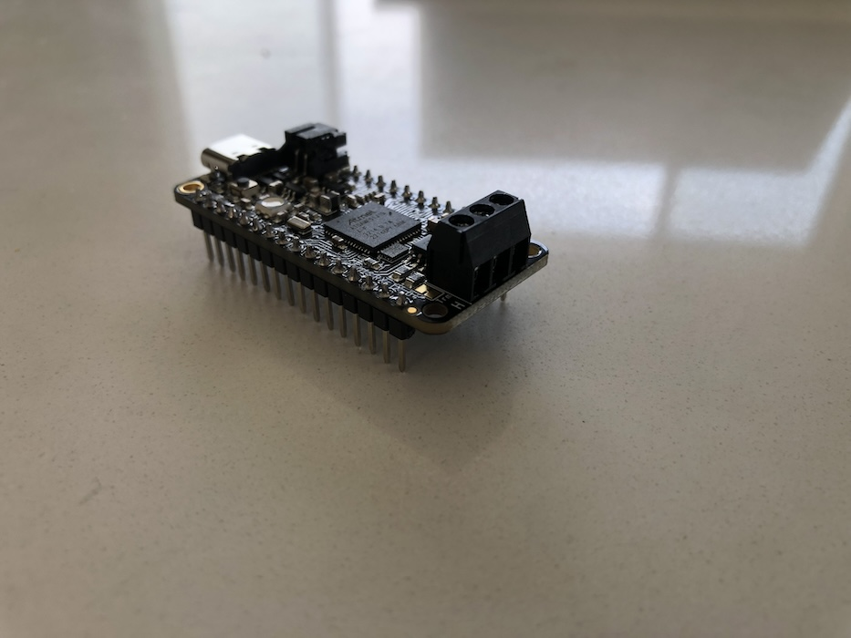
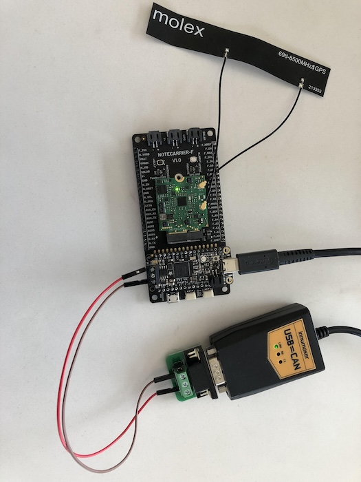

# CAN Vehicle Monitor

Monitor a CAN bus for messages with particular IDs and upload those messages to the cloud.


## You Will Need

* [Visual Studio Code (VS Code)](https://code.visualstudio.com/) with the [PlatformIO extension](https://platformio.org/)
* USB C cable
* [USB to CAN Converter Cable](https://www.amazon.com/gp/product/B09K3LL93Q)
* [Adafruit Feather M4 CAN Express with ATSAME51](https://www.adafruit.com/product/4759)
* [Notecarrier F](https://shop.blues.com/products/notecarrier-f?utm_source=dev-blues&utm_medium=web&utm_campaign=store-link)
* [Notecard](https://blues.com/products/notecard/)
* Antenna (comes with the Notecard)
* 2 male-to-male jumper wires
* Soldering iron
* Solder flux

## Hardware Setup

### MCU

The Adafruit Feather M4 CAN Express (the "MCU") will receive CAN traffic from your development PC, filter that traffic based on the IDs in the messages, and pass the filtered messages on to the Notecard for transmission to Notehub. The MCU comes with male headers and a CAN transceiver screw terminal block (the "terminal block") that need to be soldered onto the MCU board in order for it to plug into the Notecarrier F.


Adafruit has a [handy guide for soldering headers](https://learn.adafruit.com/how-to-solder-headers/overview). Once you've soldered on the headers and the terminal block, your MCU should look like this:



Now, plug the headers of the MCU into the female headers on the Notecarrier F. Install the Notecard into the Notecarrier and the antenna onto the Notecard as described in the [Notecard Quickstart guide](https://dev.blues.io/quickstart/notecard-quickstart/notecard-and-notecarrier-f/#connect-your-notecard-and-notecarrier). Finally, connect the MCU to your development PC with a USB C cable.

### USB to CAN Converter

The USB to CAN converter (the "converter") allows us to send CAN messages from our development PC to the MCU via a CAN bus. A CAN bus requires two signal lines: CAN high (CANH) and CAN low (CANL). The converter comes in two parts. First, there's the converter itself, which connects to your PC via its USB cable and has a male RS232 connector on the other end:


The converter's male RS232 connector plugs into the second part, a small PCB with a female RS232 connector and a screw terminal block that exposes the CANH and CANL lines:


1. Plug the part with the USB connector into your development PC.
1. Connect the converter's RS232 connector to the PCB's RS232 port:

1. This terminal block has ports labeled CANH and CANL. Using a Philips head screwdriver, loosen the screws above these two connectors, insert the end of a male-to-male jumper wire into each, and tighten the screws, securing the wires.
1. Similarly, take the free ends of each jumper wire and make the following two connections:
- Plug the CANL wire into the port labeled L on the MCU's terminal block.
- Plug the CANH wire into the port labeled H.



## Notehub Setup

Sign up for a free account on [notehub.io](https://notehub.io) and [create a new project](https://dev.blues.io/quickstart/notecard-quickstart/notecard-and-notecarrier-pi/#set-up-notehub).

## Firmware Setup

To build and upload the firmware onto the MCU, you'll need VS Code with the PlatformIO extension.

1. Download and install [Visual Studio Code](https://code.visualstudio.com/).
1. Install the [PlatformIO IDE extension](https://marketplace.visualstudio.com/items?itemName=platformio.platformio-ide) via the Extensions menu of Visual Studio Code.
1. Click the PlatformIO icon on the left side of VS Code, then click Pick a folder, and select the the firmware directory, `35-CAN-vehicle-monitor/firmware`.
1. In the file explorer, open `main.cpp` and uncomment this line: `// #define PRODUCT_UID "com.my-company.my-name:my-project"`. Replace `com.my-company.my-name:my-project` with the [ProductUID of the Notehub project](https://dev.blues.io/notehub/notehub-walkthrough/#finding-a-productuid) you created in [Notehub Setup](#notehub-setup).
1. Click the PlatformIO icon again, and under the Project Tasks menu, click Build to build the firmware image.
1. Under the Project Tasks menu, click Upload to upload the firmware image to the MCU. Note that this step can fail if 1) you have a serial connection open to the MCU or 2) the USB C cable is for charging only.

From here, you can view logs from the firmware over serial with a terminal emulator (e.g. minicom). On Linux, the serial device will be something like `/dev/ttyACM0`. Use a baud rate of 9600 and [8-N-1](https://en.wikipedia.org/wiki/8-N-1) for the serial parameters. Remember that you'll have to close this serial connection if you want to modify and upload new firmware.

## Testing

These testing instructions assume the developer is using a Linux or Linux-like operating system.

By default, the firmware does not forward any CAN messages to Notehub. First, we need to tell it which CAN IDs we care about. Then, whenever a message with one of those IDs shows up on the bus, it'll be captured and forwarded to Notehub. To propagate the IDs of interest to the MCU, we'll use the [environment variable](https://dev.blues.io/guides-and-tutorials/notecard-guides/understanding-environment-variables/) `ids`.

On your Notehub project page, click Devices, and then double click on the device entry for your Notecard. Click the Environment tab, and under Device environment variables, enter a new key `ids` and a value with IDs of interest in hexadecimal, delimited with semicolons (e.g. `abc;123;de7`). Click Save. In your terminal emulator hooked up to the serial log, you should see that the environment variable update was received:

```
Environment variable changed detected.
{"req":"env.get","names":["ids"]}
{"body":{"_tri_mins":"1440","ids":"abc;123;de7"}}
New ID list: 0xabc, 0x123, 0xde7
```

Now, we need to set up the CAN interface on our development PC so that we can send messages on the bus. Fortunately, CAN interfaces are supported on Linux using familiar network interface commands and sockets. To set up the CAN interface, run the `setup_can_sender.sh` script with `./setup_can_sender.sh`. This script requires `sudo`, so it will prompt you for your password. If everything worked, you should see this message:

```
CAN sender interface ready.
```

Next, we'll use a Python script, `send_can_packet.py`, to send messages over the CAN bus. You'll need to install the [python-can](https://pypi.org/project/python-can/) module for this script to work (e.g. `pip install python-can`). Here's the help message for the script:

```
usage: send_can_packet.py [-h] [--dev DEV] --id ID --data DATA

Send a single CAN packet on a CAN bus.

options:
  -h, --help   show this help message and exit
  --dev DEV    The interface name of the USB to CAN converter (default: can0).
  --id ID      The ID to put in the packet, specified in hex. Example: ab12.
  --data DATA  The data to put in the packet. Specified in hex, with colons separating
               bytes, up to a max of 8 bytes. Example: 01:02:03:0a:ff:dd:ee:56.
```

Assuming you set the `ids` environment variable to `abc;123;de7` as used in the example above, we can send a message with ID `abc` like this:

```
python send_can_packet.py --id abc --data 01:02:03
```

In the serial log, we should see that the message was received, that it matched our filter, and that it was sent to Notehub:

```
Received extended packet with id 0xabc.
ID matches filter list, keeping packet.
3 bytes in packet. Reading...
{"req":"note.add","file":"data.qo","body":{"id":2748,"data":[1,2,3],"length":3},"sync":true}
{"template":true}
```

Note that the `id` in the `note.add` request is logged in decimal, not hex (0xabc is 2748 in decimal).

Then, if we check back on the Events tab of our project on Notehub, we should see an event with a JSON body like this:

```json
{
    "data": [
        1,
        2,
        3,
        0,
        0,
        0,
        0,
        0
    ],
    "id": 2748,
    "length": 3
}
```

The `data` array has been padded with zeros to 8 elements. The firmware is using a [Note Template](https://dev.blues.io/notecard/notecard-walkthrough/low-bandwidth-design/#working-with-note-templates) to send this data. Setting aside the nitty gritty details, suffice to say that an array in a Note Template will always be padded to the max length. Since the max data length in a CAN message is 8 bytes, that explains the padding. To extract the appropriate "valid" bytes from the data array, you can use the `length` field.

Next, try sending a message with an ID we don't care about:

```
python send_can_packet.py --id 111 --data 01:02:03
```

In the serial log, you should see:

```
Received extended packet with id 0x111.
ID not in filter list, dropping packet.
```

## Blues Community

We’d love to hear about you and your project on the [Blues Community Forum](https://discuss.blues.com/)!

## Additional Resources

* [CAN bus Wikipedia page](https://en.wikipedia.org/wiki/CAN_bus)
* [Adafruit's Arduino CAN library](https://github.com/adafruit/arduino-CAN)
* [Innomaker's usb2can example code](https://github.com/INNO-MAKER/usb2can)
