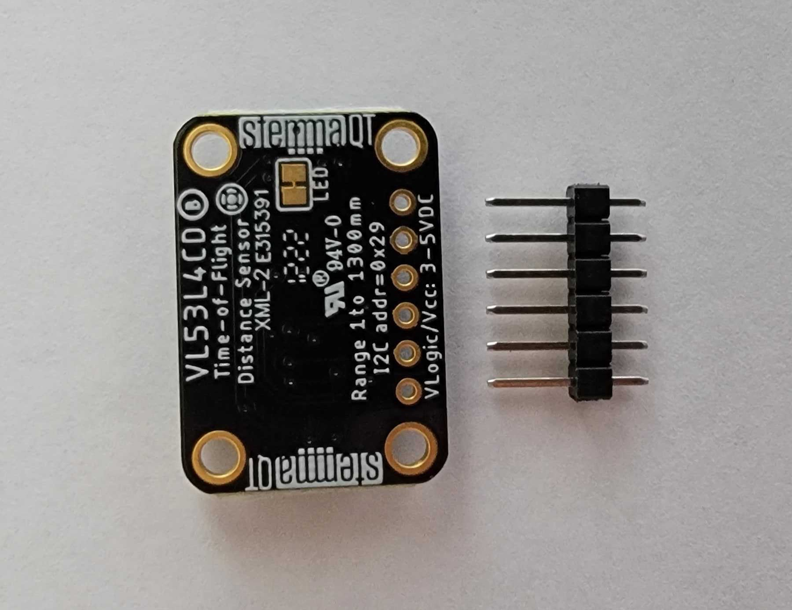
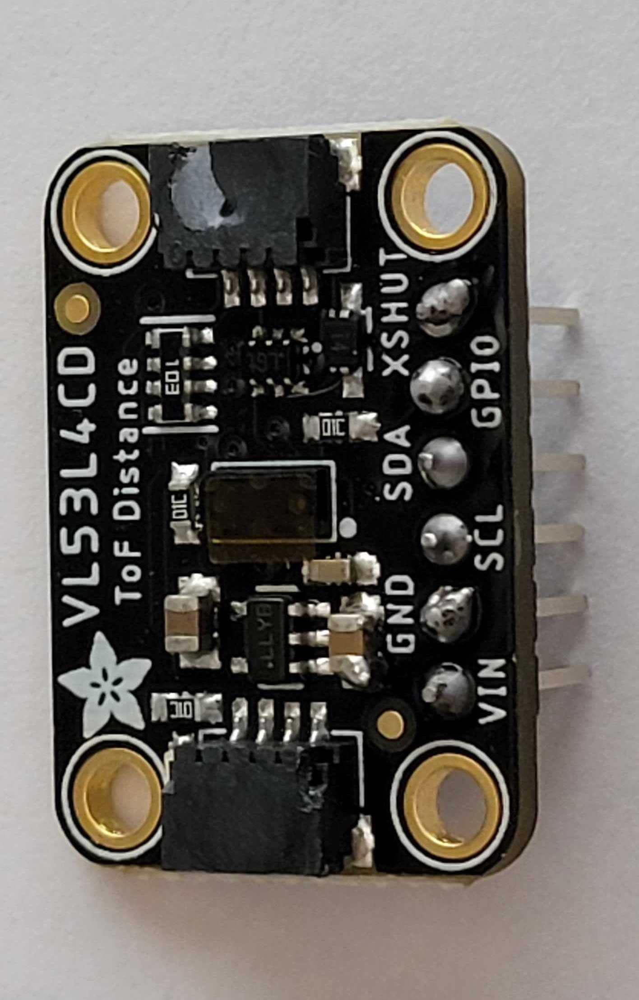
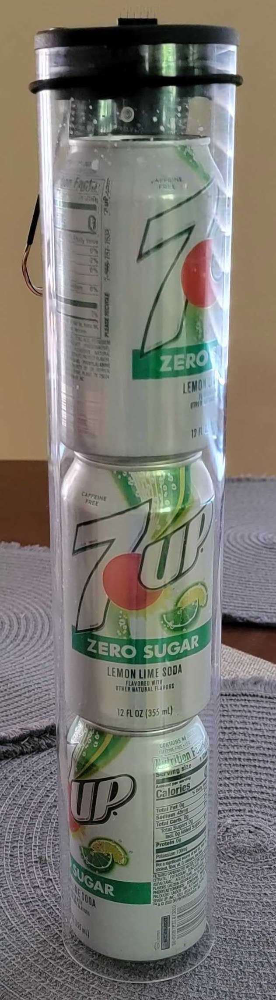
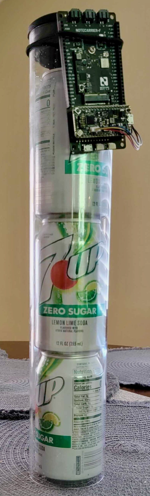
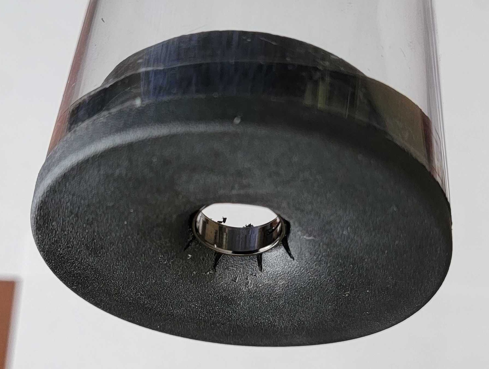

# Overview

Soda vending machines, especially older models, are typically not internet connected. This project shows how to retrofit a regular soda vending machine to make it internet connected using a Notecard.

By using a distance sensor placed at the top of each column of soda cans, the Soda Vending Machine Monitor App provides notification when items are vended, when a particular item is running low or empty and when the column has been restocked.

## App features

* The app monitors the items in one or more dispensing columns using a distance sensor placed above the column. The app detects when an item is vended, when the column is running low or empty and when it has been restocked.

* Tilt sensing: the app sends an alert when the vending machine is tilted.

* Low power mode: detects power failure and puts the app in low power mode until power resumes. Should the battery run low, the app goes to sleep, waking periodically to check the battery charge. The app sends an alert when mains power fails, and also when battery power is low.

* The app is configurable via environment variables, with notifications about variable changes and errors sent to Notehub.

## You will Need
### Hardware
- [Notecard](https://shop.blues.io/collections/notecard/products/note-wbna-500)
- [Notecarrier F](https://blues.io/products/notecarrier/notecarrier-f/)
- [Swan](https://shop.blues.io/collections/swan/products/swan)
- USB-A to Micro-USB cable

For each dispensing column:
  * [Adafruit VL53LCD sensor breakout](https://www.adafruit.com/product/5396)
  * [Quiic connect cable](https://www.adafruit.com/product/4401)
  * Male-to-female jumper cable (optional when using just one sensor)

For Assembly:
* Soldering iron and solder to solder the 5-pin header to each ToF sensor
* Zip ties, or a metal bracket, or some other means of fastening the Notecarrier to your vending machine.

### Software

- [Visual Studio Code (VS Code)](https://code.visualstudio.com/)
- [PlatformIO extension for VS Code](https://platformio.org/install/ide?install=vscode)

## Hardware Setup

1. Assemble Notecard and Notecarrier as described [here](https://dev.blues.io/quickstart/notecard-quickstart/notecard-and-notecarrier-f/).
2. Plug the Swan into the Notecarrier, aligning the Swan's male headers with the Notecarrier's female headers.
3. Ensure the Notecarrier-F DIP-switch `Feather PWR` is set to the `SWITCHED` setting. This is so the Notecard can shut down the host when battery power is low. Also ensure that the `DFU` switch is in the `ON` position. This connects `AUXTX`/`AUXRX` on the Notecard to `RX/TX` on the Swan.
4. Solder the 5-pin male header that comes with each VL53L4CD sensor breakout. The header can be soldered to either side of the board, choose the side that will be compatible with how you mount the sensors in the vending machine.

<div style="text-align:center">


</div>

5. Using male-to-feamle jumper cables, connect the `XSHUT` pin of each VL53L4CD sensor to a pin on the Notecarrier corresponding to the column number shown in the table below. For ease of recognition, we suggest numbering columns from left to right. The app supports up to 7 columns.

    | Column # | Notecarrier Pin |
    |:--------:|:---------------:|
    | 1        | D5              |
    | 2        | D6              |
    | 3        | D9              |
    | 4        | D10             |
    | 5        | D11             |
    | 6        | D12             |
    | 7        | D13             |

The app can support more than 7 columns. To add additional columns, increase the value of `COLUMN_COUNT_MAX` in the source, and add the additional pins to the `COLUMN_PINS` array.

6. Connect the Swan to your development PC with the micro USB cable.

## Time of Flight Sensor

This app uses the `VL53L4CD` sensor, which senses objects up to about 1200mm (47") away. The distance sensor uses the Time of Flight (ToF) of a reflected IR beam to determine the distance to the nearest object in the line of sight of the sensor.

The sensors have a 5-pin male header, and Qwiic connectors for I2C. This app requires just the `XSHUT` pin from the header to be connected, as described above.

### The `XSHUT` Pin

The `XSHUT` pin controls whether the sensor is active, or on standby, allowing the sensor to be switched on or off from the host.  This serves two purposes:

1. The host can power-down the ToF sensors to conserve power. The app does this when mains power is out.

2. Each sensor can be specifically addressed even though they all initially have the same I2C address (`0x52`) when first powered on. You do not need to manually set the I2C address of each sensor, this is done automatically by the app when setting up the dispensing columns.

> **Note**: If you are using only one sensor to monitor a single column, you don't need to connect the `XSHUT` pin.


## Firmware

The firmware, found in the `firmware` folder, implements the Host functionality of the app that runs on your Swan. This section describes the Notecard APIs used, and how to upload the firmware to your Swan.

### Notecard APIs Used

The host app makes use of these Notecard APIs:

* `card.voltage` is used to check the power supply voltage and detect when mains power has failed.

* `card.aux.serial` is used with `notify,accel` to receive accelerometer readings once per second. These accelerometer readings are used to detect the initial orientation and any subsequent tilt of the vending machine.

* `note.add` is used to send monitoring events and alerts to Notehub.

* `card.attn` is used with `mode` set to `sleep,usb` to put the notecard and host to sleep when mains power fails, and wake up when mains power resumes. Also, watchdog mode is used to reset the host when requests are not received within a timeout.

### Building and Uploading Swan Firmware

1. Make sure you've installed [Visual Studio Code (VS Code)](https://code.visualstudio.com/) and the [PlatformIO extension](https://platformio.org/install/ide?install=vscode).

2. Open VS Code, click the PlatformIO icon on the left side of VS Code, click "Pick a folder", and select the directory `36-vending-machine-monitor/firmware`.

3. Click the PlatformIO icon again, and under the Project Tasks menu, click "Build" to build the firmware image.

4. Prepare the Swan to receive the firmware image via DFU by following these instructions from the [Swan Quickstart](https://dev.blues.io/quickstart/swan-quickstart/#programming-swan-the-stlink-v3mini).

5. Under the Project Tasks menu, click "Upload" to upload the firmware image to the Swan. Note that this step can fail if 1) you already have a serial connection open to the Swan or 2) the micro USB cable is for charging only.

6. (Optional) Under the Project Tasks menu, click "Monitor" to view the debug output from the app. This can be useful when troubleshooting. A few seconds after startup, you should see logs like this in the serial monitor:

```
notification: {"type":"accel","x":-1016,"y":-106,"z":41}
notification: {"type":"accel","x":-1016,"y":-104,"z":41}
{"req":"card.voltage","crc":"0192:D020FD9E"}
{"usb":true,"alert":true,"mode":"usb","value":4.9092861151414208}
col 1: Status =   0, Distance =   275 mm, Signal =    287 kcps/
```

With the firmware is running, the next step is to configure the app using environment variables.


## Environment Variables

There are a number of [environment variables](https://dev.blues.io/guides-and-tutorials/notecard-guides/understanding-environment-variables/) that configures the app behavior and provides the name and distance configuration for each dispensing column.

### App Control Variables

* `tilt_alert_deg`: The app sends an alert when the tilt angle is greater than this value. When set to 0, tilt alerts are not produced. The default value is 10 degrees.

* `environment_update_mins`: How often (in minutes) to check for environment variable updates. The default value is 5 minutes.

* `monitor_secs`: How often (in seconds) to read the sensors in the app. The default value is 2 seconds.

* `report_mins`: How often (in minutes) to report the state of each dispensing column to `vending.qo`. The default is 0, meaning only notifications corresponding to vending changes are sent. (See [Vending Notifications](#vending-notifications) for more details.)


### Dispensing Column Variables

* `col_count`: the number of dispensing columns that have been fitted with distance sensors. The default value is 1.

Dispensing column configuration specifies various lengths, which allows the app determine the number of items in a column, and when it is full/low/empty.

These values provide defaults for all columns, which is useful when all or the majority of columns are dispensing similarly sized soda cans:

* `col_full_mm`: The distance threshold in millimeters corresponding to when the column is fully stocked. The column is full when the sensed distance is equal or less than this value.

* `col_low_mm`: The distance threshold in millimeters corresponding to a low level of stock in the column. Must be less than `col_empty_mm`.

* `col_empty_mm`:  The distance threshold in millimeters corresponding to when the column is empty. The column is empty when the sensed distance is equal or greater than this value.

* `col_item_mm`: The height in millimeters of each item in the column. As items are dispensed, the height of the column decreases by this amount. This allows the app to determine how many items are presently in the column and when an item has been dispensed.

In addition to the default values for all columns, you can override the defaults for one or more columns by using these environment variables, where X is the number of the column.

* `col_X_full_mm`: As `col_full_mm` above, but specifically for column X.
* `col_X_low_mm`: As `col_low_mm` above, but specifically for column X.
* `col_X_empty_mm`: As `col_empty_mm` above, but specifically for column X.
* `col_X_item_mm`: As `col_item_mm` above, but specifically for column X.

Finally, each column can be given a name via the variable `col_X_name`. The name is present in vending events, which can serve as a useful reminder of the product being vended from that column. If no name is given for a particular column, the name defaults to `col X` where X is the number of the column.

## Events

The app publishes several types of events:

* Tilt alerts
* Power failure alerts
* Low Battery alerts
* Sensor offline alerts for each column
* Vending notifications for each column
* Environment variable change notifications

### Alerts

Alerts are sent to the outbound queue `alert.qo`. An alert is sent when an alert condition becomes active, and once again when the alert condition is cleared.

All alerts have these properties in common:

* `active`: `true` or `false` to indicate whether the alert condition has just occurred or has been cleared.
* `text`: A short description of the state of the alert.

In addition to these properties, the Sensor Offline Alert also includes a `col` property with the column number that has gone offline.

#### Tilt Alerts

The app sends a tilt alert when vending machine is tilted past the angle given by the environment variable `tilt_alert_deg`.

```json
{ "active": true, "text": "excessive tilt" }
```

When the vending machine tilt returns to normal, the alert is cleared with:

```json
{ "active": false, "text": "no tilt" }
```

Tilt is detected using accelerometer readings from the Notecard, via the `card.aux.serial` API with the `mode` set to `notify,accel`, and `duration` set to 1000. This configures the Notecard to send accelerometer readings over the `TX/RX` serial connection once per second.

When the app is first powered on, the normal orientation of the Notecard is determined from 10 seconds of accelerometer readings. While the Notecard (and Vending Machine) is stationary, the `x`, `y`, `z` readings from the accelerometer constitute a 3d vector that is the acceleration due to gravity, i.e. straight downwards. Depending upon the orientation of the Notecard inside the Vending Machine, the vector could be straight down, straight up, to the left, or any other direction that corresponds to the force of gravity relative to the Notecard.

Once the downward vector has been determined, the app continues to receive accelerometer readings, and uses these to compute the current downward vector. The angle between the current downward vector and the original downward vector is computed to determine the current tilt of the vending machine, which is used to fire or clear the excessive tilt alert.

#### Power failure alerts

A power failure alert is sent when USB power fails and the app is running from the LiPo battery.

```json
{ "active": true, "text": "Power failure" }
```

On power failure, the app waits `DEFAULT_WAIT_BEFORE_SLEEP_MS` in case it's just a brief power glitch. Should power resume during that time, the alert is cleared and the app continues operating normally. Otherwise, the Notecard and Host sleep for 5 minute intervals (`DEFAULT_SLEEP_PERIOD_MS`), or until power is restored and the alert is cleared.

```json
{ "active": false, "text": "Power restored" }
```

#### Battery Low Alerts

When running from battery, a battery low alert is sent when the battery voltage falls below
`BATTERY_LOW_VOLTAGE` volts. (Default setting is 3.2v.)

```json
{ "active": true, "text": "Battery low" }
```

When power resumes, the battery low alert is cleared.

```json
{ "active": true, "text": "Battery charging" }
```

#### Sensor offline alerts for each column

When the app is unable to read from the distance sensor for a particular column, it sends a Sensor Offline alert.

```json
{ "active": true, "text": "Distance sensor offline", "col": 1 }
```

When the app is able to read from the sensor again, it sends clears the alert.

```json
{ "active": false, "text": "Distance sensor online", "col": 1 }
```

#### Vending notifications

Vending notifications are sent to `vending.qo`. These notifications, one for each column, include details of the state of the dispensing column, the number if items in the column and information about what has changed since the previous notification.

A typical event sent after an item has been dispensed looks like this:

```json
{ "col":1, "name":"cola", "state": "good", "dist_mm": 152, "items": 3, "changes": "items,state", "text": "Item dispensed." }
```

* `col`: The column number.
* `name`: The name of the column (from the `col_X_name` environment variable).
* `state`: The state of the column. One of `full`, `good`, `low`, `empty` and `offline`.
* `dist_mm`: The measured distance from the top of the column to the first item.
* `items`: The number of items in the column, determined from the measured distance and the column and item sizes given by environment variables.
* `changes`: Indicates which fields changed.
* `text`: A short description of what happened. In this case an item was dispensed.

When the last item in a column is dispensed, the column becomes empty, as shown by the `state` and `items` values in the event:

```json
{ "col":1, "name": "cola", "state": "empty", "dist_mm": 811, "items": 0, "changes": "items,state", "text": "Item dispensed." }
```

When the vending machine is restocked, the column state returns to `full`:

```json
{ "col":1, "name":"cola", "state":"full", "dist_mm": 43, "items": 5, "changes": "items,state", "text": "Column restocked." }
```

When routine reporting is enabled by setting the `report_mins` environment variable, the state of each column is reported at that interval. A routine report doesn't have the `changes` property, and so can be easily distinguished from vending notifications.


## Mock-up Vending Machine

We didn't have a soda vending machine to hand, so we created a simple mockup that we used to test the app.

<div class="text-align:center">
  
  
</div>

For the mock-up, we used:

* 3.0” diameter acrylic tubing - [FengWu 2PCS Acrylic Tube 3'' (75mm) OD x 2mm Wall Thickness Clear Plastic Pipe Tube 15.5'' Length Clear PVC Pipe Round Polycarbonate Tubing Chemical Resistant](https://www.amazon.com/gp/product/B0B8SDTMTK/ref=ppx_yo_dt_b_asin_title_o01_s00?ie=UTF8&psc=1)

* [3.0" Tube covers](https://www.amazon.com/gp/product/B08H78RW89/ref=ppx_yo_dt_b_asin_title_o00_s00?ie=UTF8&psc=1)

* Soda cans, regular size, 2.6”/66mm in diameter, 4.8"/12.2mm high

### Assembly

1. Insert one tube cover in one end of the acrylic tubing. If it is a tight fit (as ours was), heat the tube cover in hot water to soften it so it can be inserted into the tube more easily.

2. Make a hole in the center of the tube cover. You can use a sharp knife or a drill for this. We used a sharp knife to cut 8 "pizza slices" across the center and inserted a metal ring to hold them back.

<div style="text-align:center">

</div>

3. Affix the sensor to the top of the tube, ensuring it is level and the IR emitter can be seen through the hole. We used superglue, but you can also use appropriately sized screws to hold the sensor in place.

4. Affix the Notecarrier/Notecard/Swan combo to the tube. We used a rubber band for this.

5. Set up the wiring as described in [Hardware Setup](#hardware-setup) above.

You dispense sodas from the mock-up manually by sliding it to the edge of a surface and letting a can fall gently into your hand, and then sliding it back onto the surface. It's a low-tech approach, but it works!

## Blues Community

We’d love to hear about you and your project on the [Blues Community Forum](https://discuss.blues.io/)!
