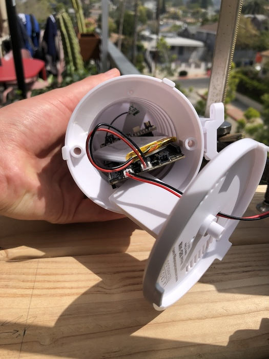
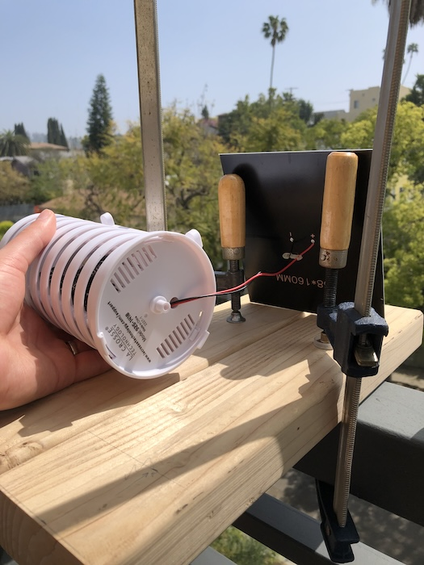

# Heat Index Monitor

Monitor temperature, humidity, and heat index and send alerts using a solar-powered Notecard and a BME280 sensor.

- [Heat Index Monitor](#heat-index-monitor)
  - [You Will Need](#you-will-need)
    - [Hardware](#hardware)
    - [Software](#software)
  - [Notehub Setup](#notehub-setup)
  - [Hardware Setup](#hardware-setup)
  - [Firmware Setup](#firmware-setup)
  - [Notefiles](#notefiles)
    - [data.qo](#dataqo)
    - [alarm.qo](#alarmqo)
  - [Testing](#testing)

## You Will Need

### Hardware

- [Adafruit BME280 board](https://www.adafruit.com/product/2652)
- [Lithium Ion Battery - 3.7V 2000mAh](https://www.adafruit.com/product/2011)
- [Seeed Studio 3W Solar Panel with JST Connector](https://www.seeedstudio.com/3W-Solar-Panel-138X160.html)
- [Notecarrier F](https://shop.blues.io/products/notecarrier-f)
- [Notecard](https://shop.blues.io/products/note-wbna-500)
- [Swan](https://shop.blues.io/collections/swan)
- 2 micro USB cables
- [STLINK-V3MINI](https://shop.blues.io/collections/accessories/products/stlink-v3mini)
- [Housing to shield BME280](https://www.amazon.com/Crosse-Technology-925-1418-Sensor-Protection/dp/B00VSXENM4)*

\* This housing isn't strictly required, but [the BME280 will give erroneous measurements if it isn't shielded from UV](https://community.bosch-sensortec.com/t5/MEMS-sensors-forum/BME280-sensibility-to-UV-light/td-p/17079). You'll also want something to shield the hardware from the elements if you plan to have this project deployed indefinitely. (see [Stevenson screen](https://en.wikipedia.org/wiki/Stevenson_screen))

### Software

- [Visual Studio Code (VS Code)](https://code.visualstudio.com/).
- [Docker and the VS Code Dev Containers extension](https://code.visualstudio.com/docs/devcontainers/containers). The Dev Containers documentation will take you through the process of installing both Docker and the extension for VS Code.

## Notehub Setup

Sign up for a free account on [notehub.io](https://notehub.io) and [create a new project](https://dev.blues.io/quickstart/notecard-quickstart/notecard-and-notecarrier-pi/#set-up-notehub).

## Hardware Setup

1. Assemble Notecard and Notecarrier as described [here](https://dev.blues.io/quickstart/notecard-quickstart/notecard-and-notecarrier-f/).
1. Plug the Swan into the Notecarrier, aligning the Swan's male headers with the Notecarrier's female headers.
1. Plug one end of the Qwiic cable into one of the Notecarrier Qwiic ports and the other end into one of the Qwiic ports on the BME280 board.
1. Connect the Swan to your development PC with a micro USB cable.
1. Plug the LiPo battery's JST cable into the Notecarrier port labeled "LIPO".
1. Connect one end of the JTAG ribbon cable that came with the STLINK to the STLINK and the other end to the Swan.
1. Connect the STLINK to your development PC with a micro USB cable.

The battery will begin charging once the Swan is connected to USB power. You do not need to connect the solar panel, yet.

## Firmware Setup

From the command line, you'll need to pull in the [note-c](https://github.com/blues/note-c) submodule that the firmware depends on for Notecard communication:

```sh
git submodule update --init firmware/zephyr/src/note-c
```

To build, flash, and debug the firmware, you will need

* [Visual Studio Code (VS Code)](https://code.visualstudio.com/).
* [Docker and the VS Code Dev Containers extension](https://code.visualstudio.com/docs/devcontainers/containers). The Dev Containers documentation will take you through the process of installing both Docker and the extension for VS Code.

These instructions will defer parts of the build process to the [Blues Zephyr SDK documentation](https://dev.blues.io/tools-and-sdks/firmware-libraries/zephyr-sdk) (the "Zephyr SDK docs"). Though these instructions are for the [note-zephyr repo](https://github.com/blues/note-zephyr), the same patterns for building the code are used here.

1. Start VS Code and select File > Open Folder and pick `37-heat-index-monitor/firmware/zephyr`.
1. Follow the instructions for your OS in the [Zephyr SDK docs' "Building the Dev Container" section](https://dev.blues.io/tools-and-sdks/firmware-libraries/zephyr-sdk/#building-the-dev-container).
1. Edit `src/main.c` to associate the firmware with your Notehub project. Uncomment `// #define PRODUCT_UID "com.your-company:your-product-name"` and replace `com.your-company:your-product-name` with [your project's ProductUID](https://dev.blues.io/notehub/notehub-walkthrough/#finding-a-productuid).
1. Follow the [Zephyr SDK docs' "Building and Running" section](https://dev.blues.io/tools-and-sdks/firmware-libraries/zephyr-sdk/#building-and-running).

Now, the code should be running on the Swan. If you want to look at the serial logs or debug the code, check out the [Zephyr SDK docs' "Debugging" section](https://dev.blues.io/tools-and-sdks/firmware-libraries/zephyr-sdk/#debugging).

## Notefiles

At this point, the Swan firmware should be running and you should start to see events show up on Notehub under your project's "Events" view. There are 2 important Notefiles.

### `data.qo`

By default, the Swan will publish temperature (Fahrenheit), humidity (relative humidity, a percentage), and heat index (Fahrenheit) data from the BME280 to this file every 2 minutes. For example:

```json
{
    "heat_index": 68.018764412,
    "humidity": 26.841796,
    "temperature": 70.05199999999999
}
```

You can change this interval by setting the [environment variable](https://dev.blues.io/guides-and-tutorials/notecard-guides/understanding-environment-variables/) `monitor_interval`. The unit for `monitor_interval` is seconds. The firmware reads from the BME280 every 30 seconds, so it's not particularly useful to set `monitor_interval` lower than 30 seconds. Note: If you modify any environment variables, wait at least a minute for the changes to propagate to the Swan.

### `alarm.qo`

By default, the firmware will send an alarm in the following situations:

- The temperature falls outside the range `[32, 95]`F.
- The humidity falls outside the range `[5, 80]`%.
- The heat index is above 95F.

You can use these environment variables to change the range:

- `temperature_min`: Lower bound of temperature range.
- `temperature_max`: Upper bound of temperature range.
- `humidity_min`: Lower bound of humidity range.
- `humidity_max`: Upper bound of humidity range.
- `heat_index_max`: Upper bound for heat index. There is no lower bound.

Here's an example `alarm.qo` note:

```json
{
    "heat_index": {
        "status": "ok",
        "value": 66.226219496
    },
    "humidity": {
        "status": "high",
        "value": 35.042968
    },
    "temperature": {
        "status": "ok",
        "value": 68.072
    }
}
```

The `status` field indicates the reason for the alarm. `low` means the value is below the minimum, `high` means the value is above the maximum, and `ok` means the value is in range. You should only ever see an `alarm.qo` note if at least one of the values is not `ok`. In this case, the `humidity_max` was set to 35, and the measured humidity breached that level, resulting in a `high` humidity alarm.

Note: Alarm notes are sent at a maximum rate of 1 every 5 minutes.

### Testing

With an understanding of the Notefiles used in this project, you're now ready to test outdoors.

1. Unplug the STLINK from the Swan. The hardware should now be fully disconnected from your development PC so that you can move it all outside.
1. Carefully install the Notecarrier, antenna, battery, and BME280 inside the hardware housing:

1. Thread the solar panel's JST connector through the hole bottom plate of the hardware housing and plug it into the JST port on the Notecarrier labeled SOLAR:

1. Place the hardware on a smooth surface outside, with the solar panel facing toward the sun:

1. Return to your development PC, and access the Events tab of your Notehub project. When a note comes in to `data.qo`, identify the current heat index. You can double-click the note and go to the Body tab to view the full JSON of the note.
    ```json
    {
        "heat_index": 66.34724041500002,
        "humidity": 34.668945,
        "temperature": 68.19800000000001
    }
    ```
1.  Click Devices on the left hand side, double-click the entry for your device, and click the Environment tab. Add a new variable under "Device environment variables" with the name `heat_index_max` and a value a few degrees below the heat_index you just saw in the `data.qo` note. Click Save. This will create the conditions for an `alarm.qo` note, because the heat index is above the max.
1. Wait at least a minute for the environment variable update to propagate to the Notecard. Soon after, you should see an `alarm.qo` note back on the Events tab of your Notehub project.
    ```json
    {
        "heat_index": {
            "status": "high",
            "value": 67.56925561999999
        },
        "humidity": {
            "status": "ok",
            "value": 32.02246
        },
        "temperature": {
            "status": "ok",
            "value": 69.422
        }
    }
    ```
Here, the `heat_index_max` was set to 60, and we see a `high` heat index alarm note, as expected.

## Additional Resources

Though we only support using the VS Code + Dev Containers workflow described here, you can also install Zephyr and its dependencies locally. You can build, flash, and debug code in your native environment using Zephyr's [`west` tool](https://docs.zephyrproject.org/latest/develop/west/index.html). See [Zephyr's Getting Started Guide](https://docs.zephyrproject.org/latest/develop/getting_started/index.html) for more information.

## Developer Notes

The Notecard hooks in `src/note_c_hooks.c|h` come from [note-zephyr](https://github.com/blues/note-zephyr).
