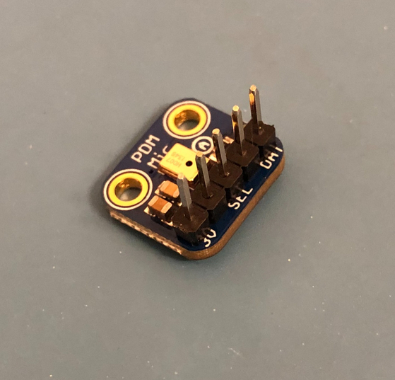
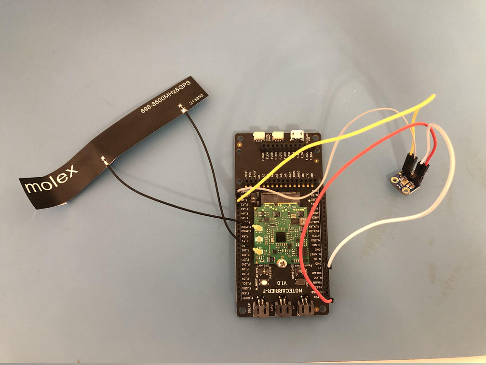
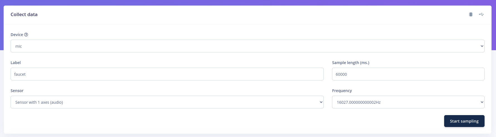
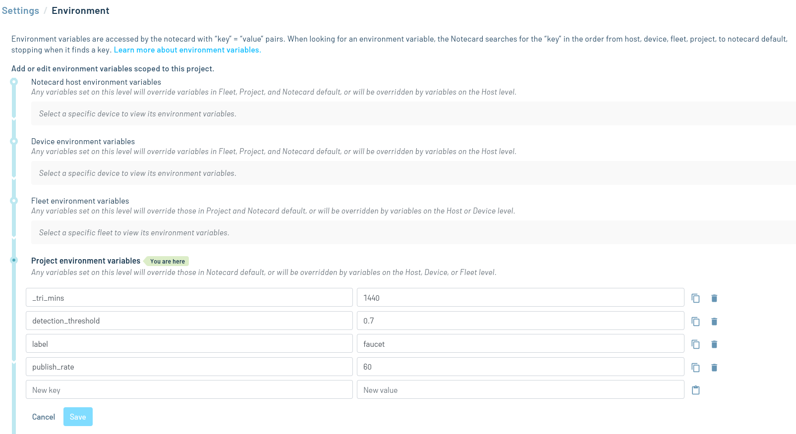

# Audio Classifier

Monitor the environment for a particular sound and publish the detections to Notehub.

## Overview

In this application, you'll build a binary audio classifier. "Binary" here means there are two classes of audio the model will be able to classify: the sound you're interested in and everything else. In this README, we'll use the example of a "running faucet" detector. However, you can easily apply the principals described here to any other binary audio classification task (we even built a cat meow detector!).

You'll use [Edge Impulse](https://www.edgeimpulse.com/), a free edge AI platform, to collect data, train the model, and download the model as as Arduino library for use in your Swan firmware. The firmware continually collects 1 second clips of audio via the microphone and feeds them into your audio classifier model, publishing a note to Notehub if it detects that the faucet is running.

## You Will Need

### Hardware

- [Notecard](https://shop.blues.com/collections/notecard/products/note-wbna-500)
- [Notecarrier F](https://blues.com/products/notecarrier/notecarrier-f/)
- [Swan](https://shop.blues.com/collections/swan/products/swan)
- [Adafruit PDM MEMS Microphone Breakout](https://www.adafruit.com/product/3492)
- Soldering iron and flux
- Male-to-female jumper wires
- Micro USB cable

### Software

- [Visual Studio Code (VS Code)](https://code.visualstudio.com/)
- [PlatformIO extension for VS Code](https://platformio.org/install/ide?install=vscode)

## Hardware Setup

1. Assemble Notecard and Notecarrier as described [here](https://dev.blues.io/quickstart/notecard-quickstart/notecard-and-notecarrier-f/).
2. Plug the Swan into the Notecarrier, aligning the Swan's male headers with the Notecarrier's female headers.
3. Using your soldering iron and flux, solder 5 of the headers through the holes on the breakout:

    

4. Make the following connections between the Notecarrier and the mic breakout using the jumper wires:

    | Notecarrier | Breakout |
    | ----------- | ---------|
    | F_3V3       | 3V       |
    | GND         | GND      |
    | F_A0        | CLK      |
    | F_A2        | DAT      |

    

5. Connect the Swan to your development PC with the micro USB cable.

## Building the Audio Classifier Model

1. Sign up for a free [Edge Impulse](https://studio.edgeimpulse.com/) account and log in.
2. Click "Create new project".
3. Enter a project name.
4. Click "Create new project".

### Collecting Data

There are two options for collecting data for the running faucet classifier:

- Build your own custom dataset.
- Use [this prebuilt dataset](https://docs.edgeimpulse.com/docs/pre-built-datasets/running-faucet).

We recommend creating a custom dataset, as we've observed better model performance with this approach.

#### Custom Dataset

You will use the microphone and Swan to stream audio samples to your development machine over the USB connection. We recommend using a laptop here, as it will be easier to position everything near the faucet for collecting audio.

First, you need to flash the data acquisition firmware onto the Swan.

1. Make sure you've installed [Visual Studio Code (VS Code)](https://code.visualstudio.com/) and the [PlatformIO extension](https://platformio.org/install/ide?install=vscode).
1. Open VS Code, click the PlatformIO icon on the left side of VS Code, click "Pick a folder", and select the directory `38-audio-classifier/data_acquisition`.
1. Click the PlatformIO icon again, and under the Project Tasks menu, click "Build" to build the firmware image.
1. Prepare the Swan to receive the firmware image via DFU by following these instructions from the [Swan Quickstart](https://dev.blues.io/quickstart/swan-quickstart/#programming-swan-the-stlink-v3mini).
1. Under the Project Tasks menu, click "Upload" to upload the firmware image to the Swan. Note that this step can fail if 1) you already have a serial connection open to the Swan or 2) the micro USB cable is for charging only.
1. Under the Project Tasks menu, click "Monitor" to view the audio data streaming over serial. You should see a rapid stream of integers pouring down the console.
1. Close the Monitor task in the pane to the right of the serial console.

Now, you're ready to stream audio data to Edge Impulse.

1. Follow [these instructions](https://docs.edgeimpulse.com/docs/edge-impulse-cli/cli-installation) to install the Edge Impulse CLI on your dev machine.
1. Run `edge-impulse-data-forwarder` in a terminal window.
1. Follow the command line prompts to login and select your project. When prompted to name the sensor axis, enter `audio`. You can name the device whatever you like.
1. The CLI will print out a URL like this: `https://studio.edgeimpulse.com/studio/223641/acquisition/training`. Open the URL in your browser.
1. You'll see this form:



From here, follow the ["Build a dataset" section of this Edge Impulse tutorial](https://docs.edgeimpulse.com/docs/tutorials/audio-classification#3.-build-a-dataset). Make sure to change the label and sample length before recording each scenario. For example, for the "2 minutes of background noise without much additional activity", make sure to set sample length to 120000 milliseconds and the label to "noise". Once you've set the label and sample length, click "Start sampling" to collect the audio data. Repeat this for each scenario described in the Edge Impulse tutorial to create your custom dataset.

#### Prebuilt Dataset

Follow the steps [here](https://docs.edgeimpulse.com/docs/pre-built-datasets/running-faucet) to upload the prebuilt dataset to your project.

### Training the Model

Once you've collecting your training data, complete [sections 4-9 of the Edge Impulse tutorial](https://docs.edgeimpulse.com/docs/tutorials/audio-classification#4.-design-an-impulse) to train the model. Note that if you created a custom dataset, you may see a warning about having an empty testing set (i.e. all your data is in the training set). You can ignore this for now. Section 8 of the tutorial gives you an opportunity to collect data for your test set.

### Downloading the Model

From your Edge Impulse project page, click "Deployment", select "Arduino library", scroll down to the bottom of the page, and click Build. Once the build is complete, your browser will prompt you to download a .zip file with an Arduino library comprising your model. Save this .zip file into `38-audio-classifier/classifier/lib` and unzip it there.

## Notehub Setup

Sign up for a free account on [notehub.io](https://notehub.io) and [create a new project](https://dev.blues.io/quickstart/notecard-quickstart/notecard-and-notecarrier-pi/#set-up-notehub).

### Environment Variables

There are a few [environment variables](https://dev.blues.io/guides-and-tutorials/notecard-guides/understanding-environment-variables/) that allow you to dynamically configure the behavior of the firmware. From your Notehub project page, click "Environment" in the left hand pane and configure the following environment variables:

- `label`: This is the label of interest. For instance, if your dataset has the labels `faucet` and `noise`, you should set this to `faucet`. There is no default label of interest in the firmware, so it must be set for detection notes to be published.
- `detection_threshold`: This is the probability level that must be exceeded for the firmware to publish a detection note. For example, if `label` is set to `faucet` and the `detection_threshold` is set to 0.7, the firmware will only publish a detection note if the model predicts `faucet` with > 0.7 probability. By default, this is set to 0.6.
- `publish_rate`: Detection notes will only be published a maximum of once every `publish_rate` seconds. For example, if you set this variable to 45, a max of one note will be published every 45 seconds, even if there are multiple detections in that time frame. By default, this is set to 60 in the firmware.



### detections.qo

Detection notes are published to the `detections.qo` Notefile:

```json
{
    "body":
    {
        "label": "faucet",
        "probability": 0.96
    }
}
```

Here, the model predicted that the faucet was running with a probability of 96%.

## Classifier Firmware

With the model trained and Notehub configured, it's time to build and flash the classifier firmware onto the Swan.

1. From the command line, pull in the [notecard-env-var-manager](https://github.com/blues/notecard-env-var-manager) submodule that the firmware depends on:
    ```sh
    $ git submodule update --init 38-audio-classifier/classifier/lib/notecard_env_var_manager
    ```
1. Use VS Code to open the directory `38-audio-classifier/classifier`.
1. In the file explorer, open `main.cpp` and uncomment this line: `// #define PRODUCT_UID "com.my-company.my-name:my-project"`. Replace `com.my-company.my-name:my-project` with the [ProductUID of the Notehub project](https://dev.blues.io/notehub/notehub-walkthrough/#finding-a-productuid) you created in [Notehub Setup](#notehub-setup).
1. You will also need to add the header file for your classifier in `main.cpp`:
    ```c
    // Include your specific Edge Impulse header file here:
    // #include <running_faucet_detector_inferencing.h>
    ```
    Uncomment the `#include` and change `running_faucet_detector_inferencing.h` to the name of your specific header file. This header file is located in the `src` subdirectory of the directory you unzipped in [Downloading the Model](#downloading-the-model).
1. Click the PlatformIO icon, and under the Project Tasks menu, click "Build" to build the firmware image.
1. Prepare the Swan to receive the firmware image by doing the [BOOT + RST button press combo](https://dev.blues.io/quickstart/swan-quickstart/#programming-swan-the-stlink-v3mini).
1. Under the Project Tasks menu, click "Upload" to upload the firmware image to the Swan.
1. Under the Project Tasks menu, click "Monitor" to view the serial log. You should see output like this:

```
{"body":{"label":"faucet","detection_threshold":"0.7","publish_rate":"60"}}
Label of interest set to faucet.
Detection threshold set to 0.70.
Publish rate set to 60 seconds.
(DSP: 276 ms., Classification: 25 ms.)
    faucet: 0.00
    noise: 1.00
(DSP: 276 ms., Classification: 25 ms.)
    faucet: 0.00
    noise: 1.00
.
.
.
```

This type of message

```
(DSP: 276 ms., Classification: 25 ms.)
    faucet: 0.00
    noise: 1.00
```

is purely diagnostic and indicates how long the digital signal processing (DSP) and classification operations took, in milliseconds. Then, it shows the probabilities output by the model for each class.

## Testing

Move your laptop and the hardware so that the microphone is in range of the sound of a faucet. Start the Monitor task in VS Code so you can see the serial log. Turn on the faucet, and you should see this in the log if detection was successful:

```
(DSP: 107 ms., Classification: 11 ms.)
    faucet: 1.00
    noise: 0.00
Publishing detection...
{"req":"note.add","file":"detections.qo","sync":true,"body":{"label":"faucet","probability":0.99609375}}
{"total":1}
```

Additionally, the red LED on the Swan should light up for a second, indicating a detection.

On your Notehub project page, navigate to the Events tab, and you should see a note in detections.qo. Double-click this note and open the Body tab, and you'll see the body of the note:

```json
{
    "label": "faucet",
    "probability": 0.99609375
}
```

## Blues Community

We’d love to hear about you and your project on the [Blues Community Forum](https://discuss.blues.com/)!
