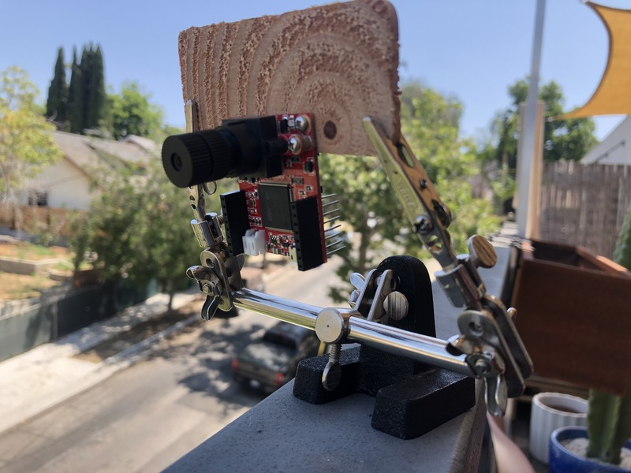

# Car Detector

Detect passing cars with a camera and publish the timestamps for these events to the cloud via a cellular connection.

## Overview

This application continuously grabs images from an [OpenMV](https://openmv.io/) camera board running [MicroPython](https://micropython.org/) and runs them through an object detection model built using [Edge Impulse](https://edgeimpulse.com/) to test for the presence of a car. The coming and going of a car counts as 1 "event". The start and end times for each event are captured and periodically synced to [Notehub](https://www.notehub.io/) via a [Notecard](https://blues.io/products/notecard/).

## You Will Need

* [Notecard](https://blues.io/products/notecard/)
* [Notecarrier A](https://blues.io/products/notecarrier/notecarrier-a/)
* [OpenMV Cam H7](https://openmv.io/products/openmv-cam-h7)
* [Super Telephoto Lens](https://openmv.io/collections/lenses/products/super-telephoto-lens)*
* 2 micro USB cables
* Male-to-male jumper wires
* Soldering iron and solder flux
* [OpenMV IDE](https://openmv.io/pages/download)

\* You can use the lens that came with the camera, but if the detection region (e.g. an intersection) is far from where the camera will be mounted, you should consider using the super telephoto lens instead. This lens will give you a much clearer picture when working at a distance.

## Hardware Setup

First, assemble the Notecard and Notecarrier as described in the [Notecard Quickstart](https://dev.blues.io/quickstart/notecard-quickstart/notecard-and-notecarrier-a/).

Next, use your soldering iron and flux to solder the female headers that came with the camera onto the camera board. The headers should face the same way as the camera lens:


If you chose to use the super telephoto lens, unscrew the stock lens from the camera board and screw in the super telephoto lens.

Next, you need to figure out how you're going to mount the camera. The best mounting strategy will vary from situation to situation. In our case, we had no indoor vantage point that would work, so we had to move outside. We mounted the camera to a thin wood shim using screws and the screw holes on the camera board:


Once outside, we used a [helping hand](https://en.wikipedia.org/wiki/Helping_hand_(tool)) to hold the shim:



With everything mounted, we then adjusted the helping hand so that the camera was pointed toward the intersection we planned to monitor:


After mounting, connect the camera board to the Notecarrier via I2C by making these 2 connections with male-to-male jumper wires:

| Camera | Notecarrier |
| -------| ------------|
| P4     | SCL         |
| P5     | SDA         |

Finally, use the 2 micro USB cables to connect both the camera and the Notecarrier to your development PC:


## Collecting Data

You'll use the [OpenMV IDE](https://openmv.io/pages/download) to collect data to train your car detection model.

1. Launch the IDE and click the Connect button in the bottom left corner.
2. Click Tools > Dataset Editor > New Dataset and pick a folder where your dataset will live.
3. A script called dataset_capture_script.py will appear in the IDE. Replace its contents with this code:
    ```python
    import sensor, image, time

    sensor.reset()
    sensor.set_pixformat(sensor.GRAYSCALE)
    sensor.set_framesize(sensor.QQVGA)
    sensor.set_windowing((120, 120))
    sensor.skip_frames(time=2000)

    clock = time.clock()

    while(True):
        clock.tick()
        img = sensor.snapshot()
        print(clock.fps())
    ```
    The resolution, 120x120, is deliberately low in order to keep the model small enough to run on the board's microcontroller (MCU), but feel free to tune it to your liking.
4. Click the Start button in the bottom left corner, below the Connect button. At this point, you should see a live stream of images coming in the Frame Buffer window.
5. Using the Frame Buffer, position your camera so that it's looking at the roadway where you want to detect cars:
    
    In this image, we've used the Zoom button above the Frame Buffer pane to blow up the image, and we've resized the various panes to maximize the Frame Buffer. This view is more pleasant to look at while collecting data than the actual 120x120 image.
6. Click the New Class Folder button on the left-hand toolbar and enter "car" for the class name.
7. In the Dataset Editor pane, click car.class. This will enable the Capture Data button in the left-hand toolbar.
8. When a car enters the shot, click the Capture Data button or use the hotkey Ctrl+Shift+s. This will capture whatever's in the Frame Buffer and save it as a .jpg file in the car.class folder:
    

We recommend collecting data like this until you've got around 100 images. Using less data than that is likely to result in poor model performance.

## Training the Model

Now that you've got some data, it's time to train your model.

1. [Sign up for an Edge Impulse account](https://studio.edgeimpulse.com/signup).
2. Once you've signed in, click "Create new project", enter a project name, and click "Create new project".
3. From here, follow Edge Impulse's ["Detect objects with centroids" tutorial](https://docs.edgeimpulse.com/docs/tutorials/detect-objects-using-fomo). This tutorial will guide you through labeling your data, specifying the deep learning model, training it, and testing its performance.

If you're unhappy with the performance of the model, we have two suggestions:

1. Collect more training data.
2. Try out some of the "Expert mode tips" from [this Edge Impulse article](https://docs.edgeimpulse.com/docs/edge-impulse-studio/learning-blocks/object-detection/fomo-object-detection-for-constrained-devices#expert-mode-tips). Specifically, we found that increasing the `object_weight` parameter from 100 to 1000 was extremely helpful in getting better model performance.

## Deploying the Model

With your model trained, you'll now deploy it to the OpenMV cam's MCU.

1. With your Edge Impulse project open, click Deployment in the left-hand toolbar.
2. Search for "openmv" in the deployment options search bar and pick OpenMV Firmware.
3. Click Build and wait for the download to complete.
4. Follow [the "Deploying your impulse as an OpenMV firmware" section of this Edge Impulse article](https://docs.edgeimpulse.com/docs/deployment/running-your-impulse-openmv#deploying-your-impulse-as-an-openmv-firmware) to get the model onto your microcontroller using the OpenMV IDE.

## Notehub Setup

In order to push data from the Notecard to the cloud, you need to sign up for a free account on [notehub.io](https://notehub.io) and [create a new project](https://dev.blues.io/quickstart/notecard-quickstart/notecard-and-notecarrier-pi/#set-up-notehub).

## MicroPython Code

The script that will run on the MCU is `main.py`. It depends on [note-python](https://github.com/blues/note-python), a Python library for communicating with a Notecard.

### note-python

To get the note-python files onto the MCU, use the `setup_board.py` script. First, you must identify the MCU's serial port. On Linux, it'll typically be something like `/dev/ttyACM0`. You can run `ls /dev/ttyACM*` before and after plugging the board in to figure out the serial port's associated file. Once you have that, run `python setup_board.py <serial port>`, replacing `<serial port>` with your serial port. This script does a few things:

1. Clones note-python from GitHub.
2. Creates the `/lib` and `/lib/notecard` directories on the MCU.
3. Copies the `.py` files from `note-python/notecard` on your development machine to `/lib/notecard` on the MCU.
4. Lists the contents of `/lib/notecard` so you can verify that everything was copied over.

### `main.py`

`main.py` loops infinitely, grabbing an image from the camera and running it through your model. The output of the model is a probability value in the range [0, 1], with 0 corresponding to a 0% probability of a car being in the image and 1 corresponding to a 100% probability. If this probability exceeds a configurable threshold (discussed further below), a car "event" begins. The event ends once the probability has dropped below the threshold for 12 consecutive images.*

Once an event ends, a note is added to the `events.qo` [Notefile](https://dev.blues.io/api-reference/glossary/#notefile) in this format:

```json
{
    "body":
    {
        "start": 1688426489,
        "end": 1688426491
    }
}
```

`start` and `end` are [Unix timestamps](https://en.wikipedia.org/wiki/Unix_time) indicating when the event started and ended, respectively. The OpenMV cam board has an [RTC](https://en.wikipedia.org/wiki/Real-time_clock), which `main.py` initializes by fetching the time from the Notecard with [`card.time`](https://dev.blues.io/api-reference/notecard-api/card-requests/#card-time). This allows `main.py` to timestamp events. Note that on power up, the Notecard will take some time to sync with Notehub. Until this sync happens, the time won't be valid, and `main.py` will keep trying to set the time before proceeding to its detection loop.

Although event notes are added to `events.qo` as they happen, these notes are only synced to Notehub periodically. How often this syncing occurs is controlled by an environment variable, `publish_period`, which is covered in the next section.

\* The number of frames required to start an event is controlled by the variable `event_start_threshold` in `main.py`. It's set to 1 by default. This low value is good for detecting fast moving cars that are only in the shot for a brief time. The number of frames required to end an event is controlled by the variable `event_end_threshold`. It's set to 12 by default, which was empirically determined to be a good value for our setup, as it prevented a single event from being counted multiple times. Feel free to tweak these threshold values based on your situation.

#### Environment Variables

There are 2 [environment variables](https://dev.blues.io/guides-and-tutorials/notecard-guides/understanding-environment-variables/) you may want to configure:

- `confidence_threshold`: This is the probability threshold mentioned in the previous section. It should be greater than 0 and less than 1. By default, it's set to 0.95.
- `publish_period`: This is how often `events.qo` notes are synced to Notehub, in minutes. By default, it's set to 5. Event notes may be synced more often than this value, but they will not be synced less frequently. In essence, this is the maximum wait time before a sync is guaranteed to happen.

To change these values, go to your Notehub project and click Environment in the left-hand menu. Under Project environment variables, enter your desired values and click Save:


The next time data is synced to the Notecard, the environment variables will update on the MCU.

#### Running `main.py`

Before running `main.py`, uncomment this line: `# product_uid = 'com.your-company:your-product-name'`. Replace `com.my-company.my-name:my-project` with the [ProductUID of the Notehub project](https://dev.blues.io/notehub/notehub-walkthrough/#finding-a-productuid) you created in [Notehub Setup](#notehub-setup).

At this point, you could copy `main.py` onto the MCU, reboot the MCU, and the code would start running. However, you won't be able to see the detections (or mis-detections). Instead, use OpenMV IDE to run the code.

1. Open OpenMV IDE.
2. Click the Open File icon in the left-hand toolbar and select `main.py`.
3. Click the Connect button in the bottom left corner.
4. Click the Start button below the Connect button.

The code is now running on the MCU, and you'll be able to see what the camera sees in the Frame Buffer. Additionally, when the model detects a car, the code will draw a circle at the point of the detection in the Frame Buffer.

This is super valuable for evaluating the performance of the model in real time. Additionally, you can monitor serial logs by clicking Serial Terminal at the bottom of the IDE window.

Once you're happy with how the model is performing, you'll want to run it independently of the IDE. Copy `main.py` over to the board with this command:

```
python pyboard.py -d <serial port> --no-soft-reset -f cp main.py :/
```

Note that for `pyboard.py` to work, you'll need to install [pyserial](https://pypi.org/project/pyserial/) with `pip install pyserial`, if you don't have it installed already. Make sure to replace `<serial port>` with your serial port. Unplug the camera board's micro USB cable and plug it back in to reboot the device. `main.py` will start running after boot up.

At this point, the development PC is no longer required, but it is providing power to the camera board and Notecarrier. Instead of your computer, you can use a USB charging brick to power the Notecarrier, and you can make the following connections with jumper wires to power the camera board via the Notecarrier:

| Camera | Notecarrier |
|--------|-------------|
| VIN    | MAIN        |
| GND    | GND         |

## Notehub Events

To see the `events.qo` notes on Notehub, navigate to your project page and click the Events tab on the left-hand side. Here, you should see `events.qo` notes with their associated timestamps in the Body column.

## Model Limitations

The underlying machine learning model is [Edge Impulse's FOMO](https://docs.edgeimpulse.com/docs/edge-impulse-studio/learning-blocks/object-detection/fomo-object-detection-for-constrained-devices). With this model, it's difficult to accurately identify multiple cars in a given frame, as FOMO will often produce multiple detections for the same car. As such, if there are multiple cars in the frame, that will still only count as 1 event. Because of this, you'll get a more accurate car count if you focus the camera on a narrow region where there's typically only one car passing through at a time.

If you're interested in a more robust model, you'll want to look into something like [YOLO](https://pjreddie.com/darknet/yolo/). However, you can't run YOLO on a constrained device like the OpenMV cam board. You'll need something more powerful, like a Raspberry Pi.

Finally, your model's performance is greatly determined by the quantity and quality of training data. For instance, if you're noticing a lot of false positives (e.g. a garbage can being treated as a car), try including those in your training data. Overall, the more data, the better.

## Blues Community

We’d love to hear about you and your project on the [Blues Community Forum](https://discuss.blues.io/)!
