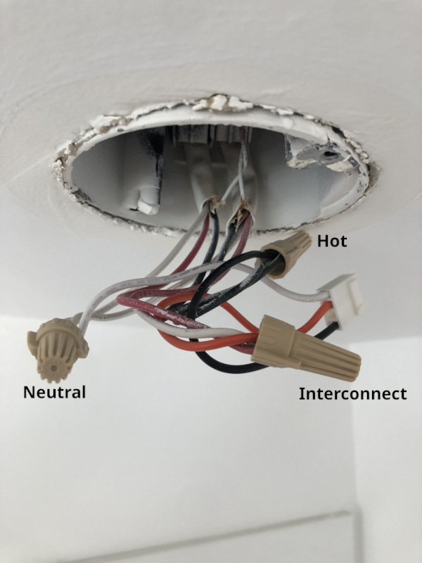
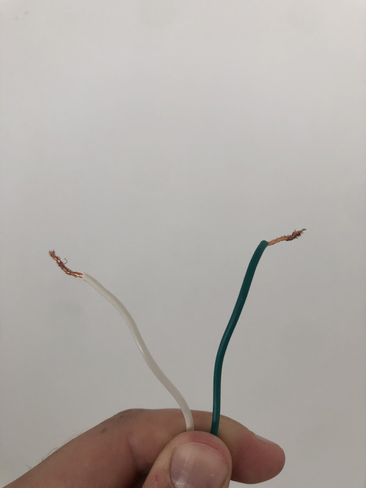
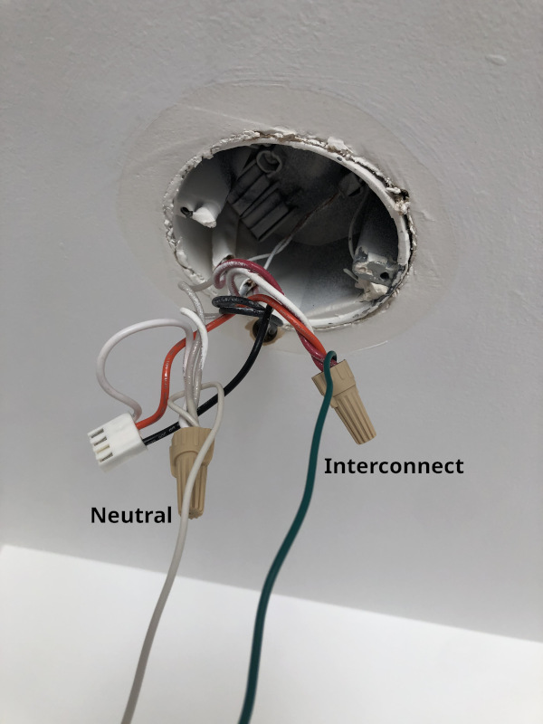
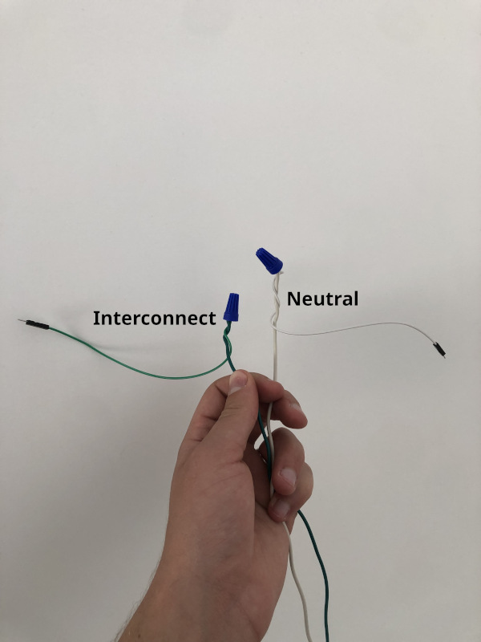
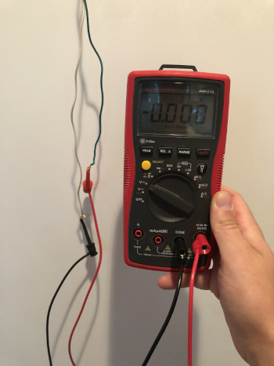
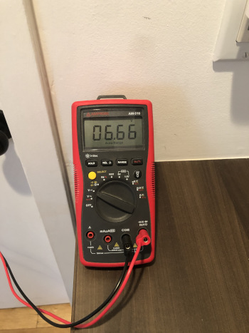
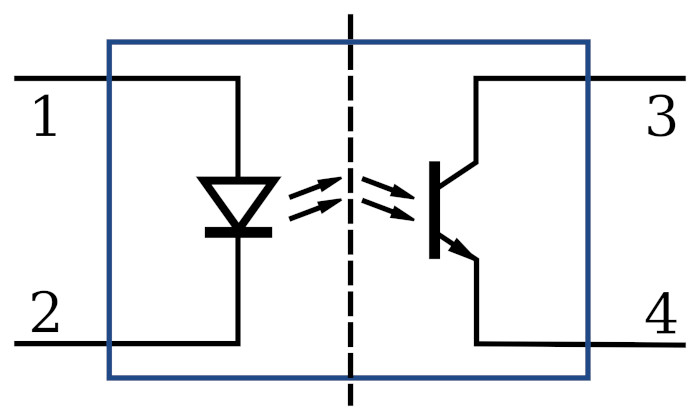
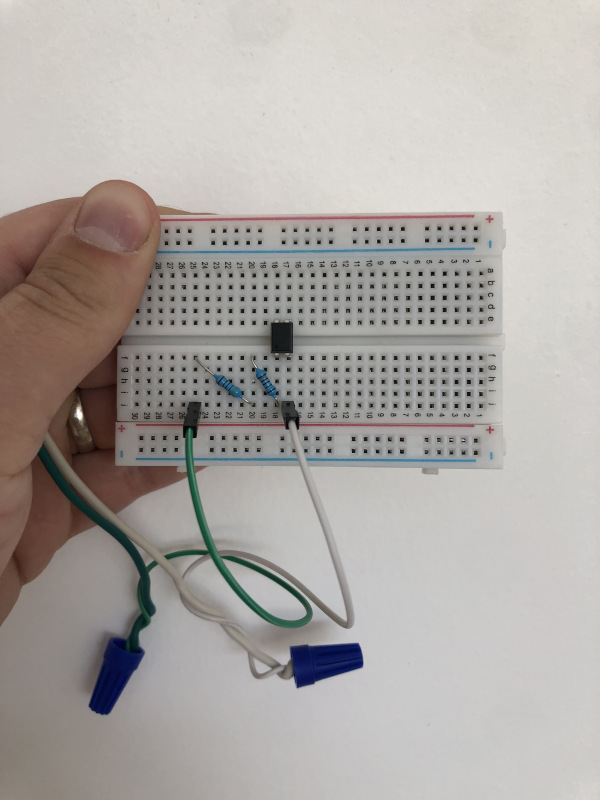
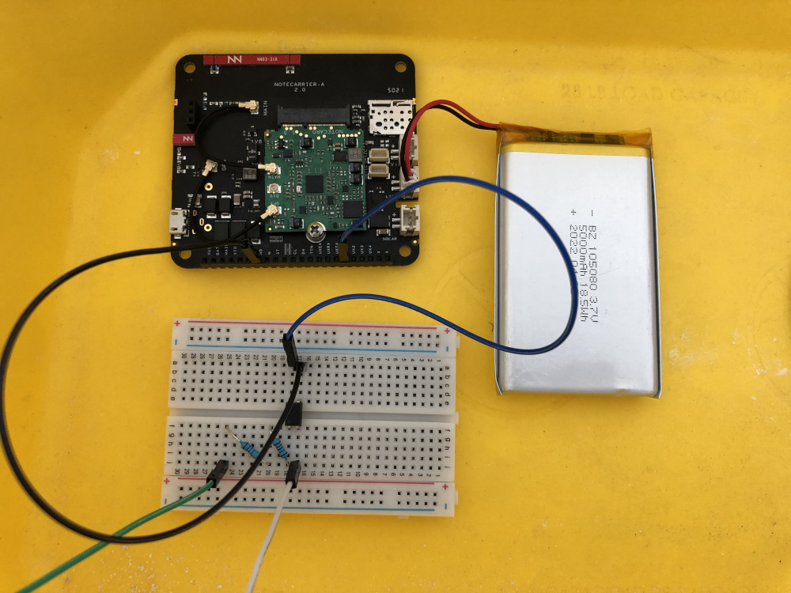
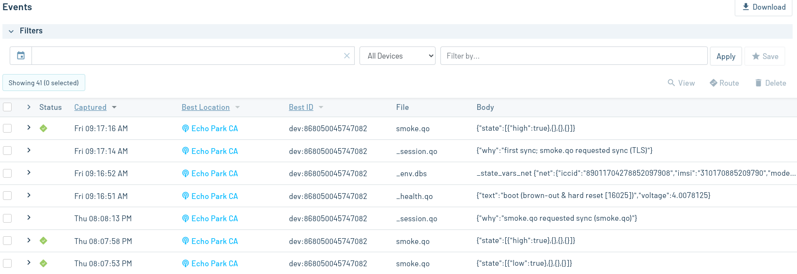

# Cellular Smoke Detector Retrofit

Retrofit a network of smoke detectors so that alarms trigger SMS alerts.

## Overview

The smoke detectors installed in a home often come with [3 wires](https://home.howstuffworks.com/home-improvement/household-safety/question576.htm):

- Black is "hot", or the mains power supplying 120V AC.
- White is neutral.
- Red is an interconnect wire that essentially acts as a bus shared by all the smoke detectors in the home.

For this project, we're primarily interested in that interconnect wire. Typically, when one detector senses smoke and starts alarming, it will raise the voltage on this line to 9V DC. The other smoke detectors sense this voltage and begin sounding their alarms in response. This application adds an additional node on the interconnect bus that senses the change in voltage and uses a [Blues Notecard](https://blues.io/products/notecard/) to push a notification to [Notehub](https://notehub.io). That notification causes an SMS message to be sent to a phone number of your choosing. When the alarm stops and the voltage drops back to 0, another SMS is sent to indicate the alarm has stopped.

Note that the instructions in this README require you to remove one of the smoke detectors in your home and install the hardware described here in its place. It's certainly possible to keep the smoke detector installed alongside the cellular monitoring system, but this is not covered in this document.

## You Will Need

* [Notecard](https://blues.io/products/notecard/)
* [Notecarrier-A](https://shop.blues.io/collections/notecarrier/products/carr-al)
* USB A to micro USB cable
* [LiPo battery with JST cable](https://shop.blues.io/products/5-000-mah-lipo-battery)
* [PC817 optocoupler](https://www.amazon.com/dp/B01JG8EJVW?psc=1&ref=ppx_yo2ov_dt_b_product_details)
* Non-contact voltage tester
* Digital multimeter with hook or clip probes
* Sacrificial extension cord or similar cable for spare wire
* Wire connectors
* Resistors
* Male-to-male jumper wires
* Breadboard

## Hardware Setup

### Smoke Detector Wiring

**WARNING: This application involves working with mains power. Getting zapped by mains power can be lethal. Do not proceed if you are unfamiliar with the risks involved.**

Before you start building anything, identify the particular smoke detector in your home where you'll attach the new hardware. Remove the smoke detector from the ceiling/wall. The wiring in your home may vary, but you're likely to see the 3 wires of the smoke detector connected to the rest of the circuit with wire connectors:



Activate your voltage tester and bring it close to the black (hot) wire. You should hear a beep, indicating that the wire is live. Before you start changing the wiring, shut off power to this circuit by flipping off the corresponding circuit breaker in your home's breaker box. Use the voltage tester again to ensure power was shut off. You can now safely handle the wiring.

To sense the voltage on the interconnect wire, we will need to install two additional wires: one that connects to the interconnect wire and another that connects to neutral. Find an extension cord or other sacrificial cable and cut it open to extract 2 lengths of wire:



Attach each wire to the interconnect wire connector and neutral wire connector, respectively:



In order to hook these wires up to your breadboard, you'll also want to attach jumper wires to the ends of each of these wires.  Cut off the end of 2 male-to-male jumper wires and strip off a bit of the insulation to expose the wire strands. Use wire connectors to connect these jumpers to your interconnect and neutral wires:



At this point, you can restore power to the smoke detector circuit at your breaker box.

### Checking the Interconnect Voltage

As mentioned earlier, the voltage on the interconnect wire during an alarm event is usually 9V. However, in our particular case, the voltage was only 6.7V. To check this value, use clip or hook probes on your multimeter to measure the voltage on the interconnect wire with respect to the neutral wire:



The other smoke detectors in your home should have a test button that triggers an alarm and raises the voltage on the interconnect wire. Find a nearby detector and depress the test button until the alarm goes off. While the alarm is sounding, note the voltage on your multimeter. This value will inform the resistor values needed for the circuit you'll build in the next steps.



### Circuit Design

You can model the optocoupler as having an LED with its anode connected to pin 1 and its cathode connected to pin 2. At the output, there's a phototransistor with its collector connected to pin 3 and its emitter connected to pin 4. When current flows through the LED, it emits light that goes into the base of the phototransistor. If the light is sufficiently bright, the transistor saturates/turns on.

;

Optocouplers are useful for passing signals between circuits operating at different voltages. In this case, we need pass the 9V signal from the smoke detector interconnect onto the Notecard without damaging the Notecard. To do so, we'll use the optocoupler as a kind of switch. When the interconnect wire goes high to 9V, the optocoupler will effectively close a switch that connects one of the Notecard's GPIO pins to ground. When the interconnect wire is low at 0V, the switch will be open, and an internal pull-up on the Notecard's GPIO will keep the logic level high.

#### Choosing a Resistor Value

If you hook up the optocoupler to the interconnect wire with no series resistor, you risk frying the chip. You must limit the forward current, the current flowing through the optocoupler's LED, with a resistor in series with the optocoupler's LED. However, if your resistance is too high, the forward current will be insufficient to get the output transistor to saturate. Looking at [the PC817 datasheet](https://www.farnell.com/datasheets/73758.pdf), we can see that the maximum forward current under "Absolute Maximum Ratings" is 50mA. In the "Electro-optical Characteristics" table, we see a forward current of 20mA used as a condition for several of the values in the table. As such, designing the circuit for a 20mA forward current is a good place to start.

To estimate the resistance needed to achieve a particular forward current, use Ohm's Law: V = IR. Rearrange it to get R = V/I. V is the voltage drop over your resistor. Looking at the datasheet, we see that the forward voltage, which is the voltage dropped over the LED, is typically 1.2V if the forward current is 20mA. With 6.7V coming from the source, 6.7V - 1.2V = 5.5V will be dropped over our resistor. Plugging this voltage and 20mA into R = V/I, we get R = 5.5V / 20e-3 = 275Ω.

From our testing of this particular PC817 from Gikfun ([linked above](#you-will-need)), we were able to saturate the transistor with just 0.8mA of forward current. To achieve this with a source voltage of 6.7V, we used 2 resistors in series: 1kΩ and 4.7kΩ. If you plug 5.7kΩ into the calculations above, you won't get exactly 0.8mA of forward current. In practice, however, this is what we observed when using a digital multimeter to measure the current.

### Breadboarding

Setting aside the Notecard and Notecarrier, which you'll assemble and configure shortly, build the circuit on the breadboard:



You're now ready to configure your Notehub project and the Notecard so you can run an end-to-end test of the whole system.

## Notehub Setup

Sign up for a free account on [notehub.io](https://notehub.io) and [create a new project](https://dev.blues.io/quickstart/notecard-quickstart/notecard-and-notecarrier-pi/#set-up-notehub). Your Notehub project is where you'll view smoke detector alarm events and where you'll configure a Twilio route to get an SMS text when an alarm happens.

## Notecard Setup

1. Assemble Notecard and Notecarrier as described [here](https://dev.blues.io/quickstart/notecard-quickstart/notecard-and-notecarrier-a/). Keep the Notecard connected to the your development PC with [the in-browser terminal](https://dev.blues.io/terminal) active.
2. Set the ProductUID for the Notecard by pasting the command below into the in-browser terminal. Make sure to replace `com.your-company:your-product-name` with the [ProductUID](https://dev.blues.io/notehub/notehub-walkthrough/#finding-a-productuid) from your Notehub project.
    ```json
    { "req": "hub.set", "product": "com.your-company:your-product-name", "body": { "app": "nf42" } }
    ```
3. Set the [AUX1 pin of the Notecard to GPIO mode](https://dev.blues.io/notecard/notecard-walkthrough/working-with-the-notecard-aux-pins/#using-aux-gpio-mode) and configure it as an `input-pullup`:
    ```json
    { "req": "card.aux", "mode": "gpio", "usage": ["input-pullup", "", "", ""], "sync": true, "file": "smoke.qo" }
    ```
    The `"sync" true` parameter makes it so a Note gets synced to Notehub whenever the level of AUX1 changes. The note will go to the Notefile `smoke.qo` due to the `"file": "smoke.qo"` parameter.
4. Plug the LiPo battery into the port labeled LIPO on the Notecarrier. While the Notecarrier is connected to USB power, the battery will charge.
5. Once the battery is charged (or if it's already charged), disconnect the Notecarrier from USB and head back over to your optocoupler circuit.
6. Use male-to-male jumper wires to connect pin 3 of the optocoupler to AUX1 and pin 4 to GND:


## Twilio Route

Follow our [Twilio SMS Guide](https://dev.blues.io/guides-and-tutorials/twilio-sms-guide/) to set up the Twilio route on Notehub. For the route's "Selected Notefile", use [`smoke.qo`](https://dev.blues.io/api-reference/glossary/#notefile). When you get to the section ["Customize with Placeholder Variables and JSONata"](https://dev.blues.io/guides-and-tutorials/twilio-sms-guide/#customize-with-placeholder-variables-and-jsonata), use `[.body.message]` for the "Message" field. Then, set "Transform Data" to "JSONata Expression" and paste in this JSONata snippet:

```
{
   "body": {
     "message": body.state[0].low ? "Smoke detector alarming!" : "Smoke detector stopped alarming."
   }
}
```

Now, whenever a `smoke.qo` [Note](https://dev.blues.io/api-reference/glossary/#note) gets synced to Notehub, it'll trigger the Twilio route. If the Note indicates that the interconnect voltage went from low to high, you'll get a text that says "Smoke detector alarming!" If the level goes high to low, you'll get a text that says "Smoke detector stopped alarming."

## Testing

Head back over to the smoke detector you used to test the interconnect voltage earlier. Depress the test button and trigger a test alarm. Within the next minute, you should receive a "Smoke detector alarming!" text via Twilio, followed by a "Smoke detector stopped alarming." text when the alarm stops. On Notehub, you can view the Notes that triggered these texts by navigating to the "Events" tab of your project:



## Blues Community

We’d love to hear about you and your project on the [Blues Community Forum](https://discuss.blues.io/)!

## Additional Resources

- [How Optocouplers Work and How to Use Them - DC To Daylight](https://www.youtube.com/watch?v=gTni6-R1rIk)
- [Wikipedia: Opto-isolator](https://en.wikipedia.org/wiki/Opto-isolator)
- [Calculating Optocoupler Resistor Values](https://electronics.stackexchange.com/questions/94097/calculate-resistor-value-for-optocoupler-24vdc-anode)
- [Inspiration for this application from Ed Cheung's blog](https://www.edcheung.com/automa/smoke_det.htm)
- [Further inspiration from the Mad Lab 5 blog](https://madlab5.blogspot.com/2017/06/email-smoke-detector-using-raspberry-pi.html)
