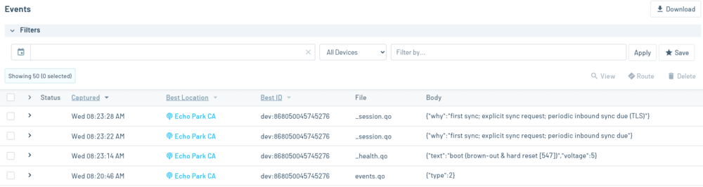

# Lightning Detector

Detect lightning strikes up to 40 km away and send the detections to the cloud via a cellular connection.

## You Will Need

* [Visual Studio Code (VS Code)](https://code.visualstudio.com/) with the [PlatformIO extension](https://platformio.org/)
* [Blues Starter Kit for North America](https://shop.blues.io/products/blues-starter-kit-for-north-america)[^1]
* [SparkFun Lightning Detector - AS3935](https://www.sparkfun.com/products/15441)
* Row of 7 headers
* Soldering iron
* Solder flux
* Breadboard
* Micro USB cable
* Male-to-male jumper wires
* Utility lighter (the spark is used to test the lightning detector)

## Overview

In this project, you'll use a Swan MCU to both detect lightning events via the lightning detector and to publish these detections to the Notecard, where they'll ultimately be synced to [Notehub](https://notehub.io/). When the detector detects a lightning strike, it will raise an interrupt line connected to the Swan. The Swan will then read the type of lightning event from the detector:

- **Noise**: The noise floor breached the detector's configured noise floor threshold.
- **Disturber**: A false positive. A signal triggered the interrupt as lightning but was invalidated after further analysis.
- **Lightning**: There was a genuine lightning strike.

You can read more about these event types in [the detector's datasheet](https://cdn.sparkfun.com/assets/learn_tutorials/9/2/1/AS3935_Datasheet_EN_v2.pdf).

After detection, the Swan's firmware creates a [Note](https://dev.blues.io/api-reference/glossary/#note) in the `events.qo` [Notefile](https://dev.blues.io/api-reference/glossary/#notefile) with the following fields:

```json
{
    "type": 3,
    "distance_to_storm": 15,
    "energy": 999
}
```

- `type` is a code to indicate the event type. 1 is noise, 2 is disturber, and 3 is lightning.
- `distance_to_storm` is an additional value reported for lightning events. It's the distance to the head of the storm in kilometers.
- `energy` is an additional value reported for lightning events. According to the datasheet:

  >This value is just a pure number and has no physical meaning.

There are also a handful of optional [environment variables](https://dev.blues.io/guides-and-tutorials/notecard-guides/understanding-environment-variables/) that you can tweak to alter the characteristics of the lightning detector. These will be covered in detail in a later section.

## Hardware Setup

### AS3935

Break off a row of 7 headers and [solder](https://learn.sparkfun.com/tutorials/how-to-solder-through-hole-soldering/all) them into the holes on the AS3935 breakout board.

### Notecarrier

1. Assemble Notecard and Notecarrier as described in the [Notecard Quickstart](https://dev.blues.io/quickstart/notecard-quickstart/notecard-and-notecarrier-f/).
2. Plug the Swan into the Notecarrier, aligning the Swan's male headers with the Notecarrier's female headers.
3. Using jumper wires, make the following connections between the detector board and the Notecarrier:
    | Detector | Notecarrier |
    | ---------| ----------- |
    | MOSI     | F_MOSI      |
    | MISO     | F_MISO      |
    | SCK      | F_SCK       |
    | CS       | F_D5        |
    | INT      | F_D6        |
    | 3V3      | F_3V3       |
    | GND      | GND         |
4. Connect the Swan to your development PC with the micro USB cable. The LED on the detector board will turn on.
  

## Notehub Setup

Sign up for a free account on [Notehub](https://notehub.io) and [create a new project](https://dev.blues.io/quickstart/notecard-quickstart/notecard-and-notecarrier-pi/#set-up-notehub).

### Environment Variables

There are several optional [environment variables](https://dev.blues.io/guides-and-tutorials/notecard-guides/understanding-environment-variables/) that change the detection behavior of the lightning detector. You can set these values for your device from Notehub:

1. From your project's main page, click Devices.
2. Double-click your device in the list.
3. Click the Environment tab.
4. Click the "New key" textbox in the Device section and enter the environment variable and fill in the desired value.
5. Click "Apply changes".

Here are the environment variables supported by the firmware:

- `ignore_disturbers`: If this is 0, disturbers trigger the creation of an event Note. If this is 1, disturbers do NOT create an event Note. *Default: 0*
- `indoor`: If this is 0, the detector will configure its settings for outdoor usage. If this is 1, it'll optimize for indoor usage. *Default: 1*
- `noise_floor_threshold`: The noise floor of the signal is continuously measured by the detector. If it breaches the noise floor threshold, the detector triggers a noise interrupt, and a noise event Note will be created. This environment variable is a value between 1 and 7. These values correspond to different thresholds, which are listed in Figure 41 of the "Noise Floor Level Measurement and Evaluation" section of the [datasheet](https://cdn.sparkfun.com/assets/learn_tutorials/9/2/1/AS3935_Datasheet_EN_v2.pdf). *Default: 2*
- `spike_rejection`: A value between 1 and 15. From the datasheet:
  > the spike rejection settings ... can be used to increase the  robustness against false alarms from such disturbers

  See the "Signal Validation" section of the datasheet for more. *Default: 2*
- `watchdog_threshold`: This is a threshold between 1 and 15. From the datasheet:
  > By increasing the threshold the AS3935 can be made more robust against disturbers. However, this will also make the sensor less sensitive for weaker signals from far away lightning events

  See the "Analog Front-End (AFE) and Watchdog" section of the datasheet for more. *Default: 2*

## Firmware

### Building and Flashing

To build and upload the firmware to the Swan, you'll need VS Code with the PlatformIO extension.

1. Download and install [Visual Studio Code](https://code.visualstudio.com/).
2. Install the [PlatformIO IDE extension](https://marketplace.visualstudio.com/items?itemName=platformio.platformio-ide) via the Extensions menu of Visual Studio Code.
3. Click the PlatformIO icon on the left side of VS Code, then click Pick a folder, and select the the firmware directory, `46-lightning-detector/firmware`.
4. In the file explorer, open `lightning_detector/lightning_detector.ino` and uncomment this line: `// #define PRODUCT_UID "com.my-company.my-name:my-project"`. Replace `com.my-company.my-name:my-project` with the [ProductUID of the Notehub project](https://dev.blues.io/notehub/notehub-walkthrough/#finding-a-productuid) you created in [Notehub Setup](#notehub-setup).
5. Click the PlatformIO icon again, and under the Project Tasks menu, click Build to build the firmware image.
6. Prepare the Swan to receive the firmware image via DFU by following these instructions from the [Swan Quickstart](https://dev.blues.io/quickstart/swan-quickstart/#programming-swan-the-stlink-v3mini).
7. Under the Project Tasks menu, click Upload to upload the firmware image to the MCU.
8. Under the Project Tasks menu, click Monitor to open the serial log from the Swan.

## Testing

The best testing will be when a thunderstorm comes through your area. In lieu of that, you can create intentional disturbers to ensure your setup is resilient to these man-made events.

This is where the utility lighter comes in. If you ignite it near the detector, the spark should trigger an interrupt, at least with the default environment variable settings.

With the serial log open, ignite the lighter near the detector. You should see messages like this in the log:

```
Interrupt received. Source: disturber.
Sending event note...
[INFO] {"req":"note.add","file":"events.qo","body":{"type":2,"distance_to_storm":0,"energy":0},"crc":"0004:6C5B2D87"}
[INFO] {"template":true}
```

And if you managed to trick the detector into thinking the lighter was actual lightning, you'll see logging like this:

```
Interrupt received. Source: lightning.
Distance from head of storm: 40 km.
Energy value: 0.
Sending event note...
[INFO] {"req":"note.add","file":"events.qo","body":{"type":3,"distance_to_storm":40,"energy":0},"crc":"0003:9CBD5B78"}
[INFO] {"template":true}
```

On Notehub, in your project's Events tab, you should see the Note come through sometime later.[^2]



Double-click the Note and open the Body tab to view the JSON:

```json
{
    "type": 2
}
```

Because this was a disturber (type 2), no `distance_to_storm` or `energy` fields are present.

## Blues Community

We’d love to hear about you and your project on the [Blues Community Forum](https://discuss.blues.io/)!


[^1]: [Blues Starter Kits for EMEA](https://shop.blues.io/products/blues-starter-kit-for-emea) are also available.
[^2]: Notes are synced from the Notecard to Notehub every 10 minutes. See the `OUTBOUND_MINS` macro in lightning_detector.ino if you want to change the number of minutes.
