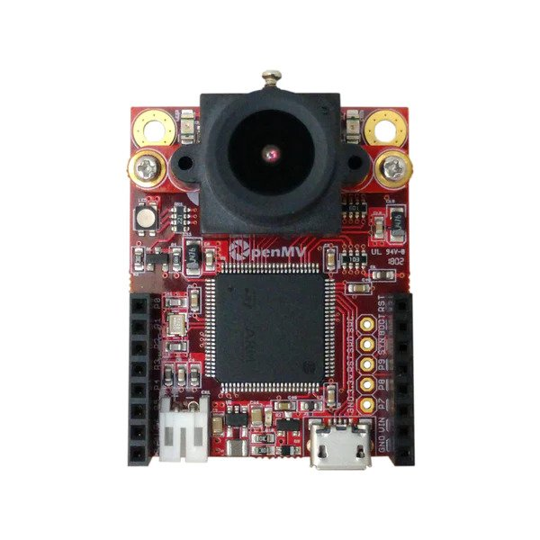
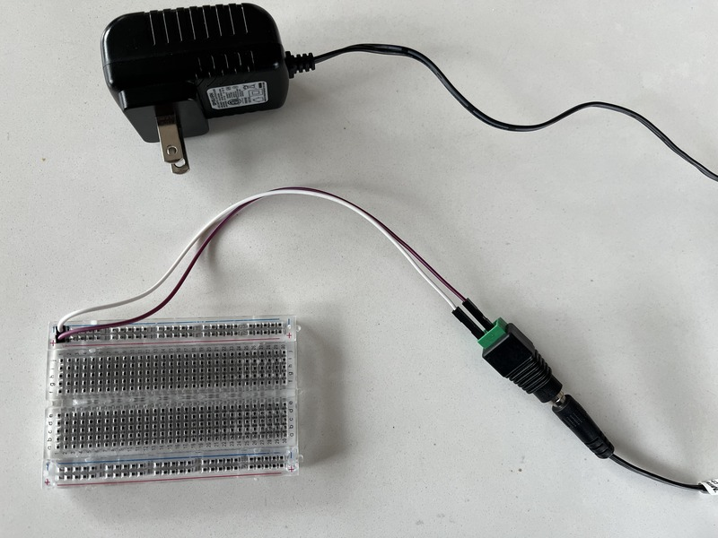
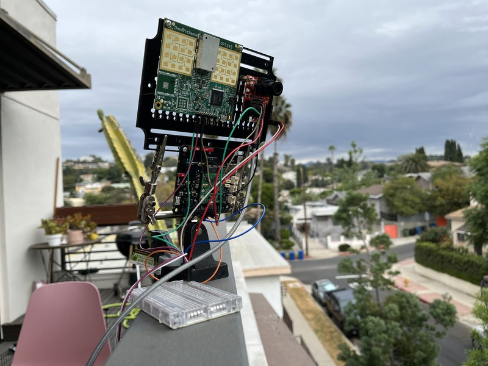
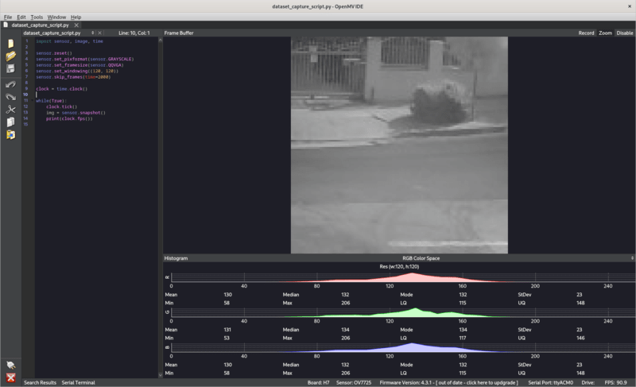
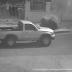
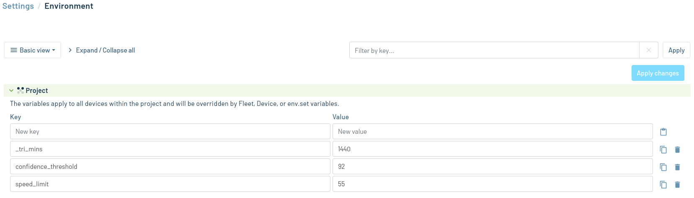

# Cellular Speed Radar and Camera

Detect speeding cars with a speed radar module and camera. Publish the speeds and timestamps for these events to the cloud via a cellular connection.

## Overview

This application continuously grabs images from an [OpenMV](https://openmv.io/) camera board running [MicroPython](https://micropython.org/) and runs them through an object detection model built using [Edge Impulse](https://edgeimpulse.com/) to test for the presence of a moving car. If a moving car is detected, the speed of that car is measured using an [OmniPreSense](https://omnipresense.com) Doppler radar sensor. If that speed exceeds a configurable speed limit, the speed and current time are recorded and synced to [Notehub](https://www.notehub.io/) via a [Notecard](https://blues.io/products/notecard/).

## You Will Need

* [Notecard](https://blues.io/products/notecard/)
* [Notecarrier A](https://blues.io/products/notecarrier/notecarrier-a/)
* [OpenMV Cam H7](https://openmv.io/products/openmv-cam-h7)
* [OmniPreSense OPS243-A Doppler Radar Sensor](https://omnipresense.com/product/ops243-doppler-radar-sensor/)
* 5V, 1A DC power supply
* [DC Power Jack Plug Adapter Barrel Connector](https://www.amazon.com/gp/product/B01J1WZENK)
* Micro USB cable
* Male-to-male jumper wires
* Male-to-female jumper wires
* Breadboard
* Soldering iron and solder flux
* Mounting hardware
* Weatherproof enclosure (optional)
* [OpenMV IDE](https://openmv.io/pages/download)

## Hardware Setup

### Notecard and Notecarrier

Assemble the Notecard and Notecarrier as described in the [Notecard Quickstart](https://dev.blues.io/quickstart/notecard-quickstart/notecard-and-notecarrier-a/).

### Camera

The female headers for the OpenMV camera don't come pre-soldered. Use your soldering iron and flux to solder them onto the camera board. The headers should face the same way as the camera lens:



Connect the camera board to your development PC with the micro USB cable. This is required to upload the code to the board's MCU and, if you need to debug something, to view serial logs.

### Radar

The radar board comes ready to use, aside from making a few connections with jumper wires for communications and power. These connections are covered in the [wiring section](#wiring).

### Power Supply

A 5V, 1A power supply is sufficient to power all the hardware used in this project. Plug the power supply into an outlet and plug the other end into the adapter. Insert two male-to-male jumper wires into the screw terminal block on the other end of the adapter. Connect the free ends of the jumpers to the + and - rails of the breadboard, respectively:



### Mounting Hardware

The Notecarrier, radar, and camera all need to be secured using some sort of mounting hardware. It's especially important that the camera and radar are mounted on the same plane. That way, they're both pointed in the same direction and the radar's reported speed will correspond to the cars seen by the camera.

The best mounting strategy will vary from situation to situation. For our prototype, we used an acrylic mounting plate from [this Sixfab product](https://sixfab.com/product/raspberry-pi-ip54-outdoor-iot-project-enclosure/) and a [helping hand](https://en.wikipedia.org/wiki/Helping_hand_(tool)) to allow us to freely position the camera and radar. We used an [f-clamp](https://en.wikipedia.org/wiki/F-clamp) to secure the helping hand to a railing.



We did not bother weatherproofing our prototype, but you will of course want to protect your hardware from the elements if you plan to deploy this project unattended in the field.

### Wiring

With the hardware mounted, it's time to wire everything up. Use male-to-male jumper wires to make the following connections between the OpenMV camera board and the Notecarrier:

| Camera | Notecarrier |
| -------| ------------|
| P4     | SCL         |
| P5     | SDA         |

The camera board's MCU can now communicate with the Notecard via I2C.

Next, use male-to-female jumper wires to make the following connections between the OpenMV camera board and the radar board:

| Camera | Radar    |
| -------| ---------|
| P0     | TxD_MISO |
| P1     | RxD_MOSI |

The camera board's MCU can now communicate with the radar board via UART.

Finally, power needs to be supplied to all three boards.

For the Notecarrier, connect the V+ pin to the + rail of the breadboard, and the GND pin to the - rail. You should see activity on the LEDs on power up.

Connect the VIN pin of the camera board to the + rail, and the GND pin to the - rail. You should see activity on the LEDs on power up.

Connect the 5V pin of the radar board to the + rail, and the GND pin to the - rail. You should see activity on the LEDs on power up.

## Car Detection Model

### Collecting Data

You'll use the [OpenMV IDE](https://openmv.io/pages/download) to collect data to train your car detection model.

1. Launch the IDE and click the Connect button in the bottom left corner.
2. Click Tools > Dataset Editor > New Dataset and pick a folder where your dataset will live.
3. A script called dataset_capture_script.py will appear in the IDE. Replace its contents with this code:
    ```python
    import sensor, image, time

    sensor.reset()
    sensor.set_pixformat(sensor.GRAYSCALE)
    sensor.set_framesize(sensor.QQVGA)
    sensor.set_windowing((120, 120))
    sensor.skip_frames(time=2000)

    clock = time.clock()

    while(True):
        clock.tick()
        img = sensor.snapshot()
        print(clock.fps())
    ```
    The resolution, 120x120, is deliberately low in order to keep the model small enough to run on the board's MCU, but feel free to tune it to your liking.
4. Click the Start button in the bottom left corner, below the Connect button. At this point, you should see a live stream of images coming in the Frame Buffer window.
5. Using the Frame Buffer, position your camera so that it's looking at the roadway where you want to detect cars:
    
    In this image, we've used the Zoom button above the Frame Buffer pane to blow up the image, and we've resized the various panes to maximize the Frame Buffer. This view is more pleasant to look at while collecting data than the actual 120x120 image.
6. Click the New Class Folder button on the left-hand toolbar and enter "car" for the class name.
7. In the Dataset Editor pane, click car.class. This will enable the Capture Data button in the left-hand toolbar.
8. When a car enters the shot, click the Capture Data button or use the hotkey Ctrl+Shift+s. This will capture whatever's in the Frame Buffer and save it as a .jpg file in the car.class folder:
    

We recommend collecting data like this until you've got around 100 images. Using less data than that is likely to result in poor model performance.

### Training the Model

Now that you've got some data, it's time to train your model.

1. [Sign up for an Edge Impulse account](https://studio.edgeimpulse.com/signup).
2. Once you've signed in, click "Create new project", enter a project name, and click "Create new project".
3. From here, follow Edge Impulse's ["Detect objects with centroids" tutorial](https://docs.edgeimpulse.com/docs/tutorials/detect-objects-using-fomo). This tutorial will guide you through labeling your data, specifying the deep learning model, training it, and testing its performance.

If you're unhappy with the performance of the model, we have two suggestions:

1. Collect more training data.
2. Try out some of the "Expert mode tips" from [this Edge Impulse article](https://docs.edgeimpulse.com/docs/edge-impulse-studio/learning-blocks/object-detection/fomo-object-detection-for-constrained-devices#expert-mode-tips). Specifically, we found that increasing the `object_weight` parameter from 100 to 1000 was extremely helpful in getting better model performance.

### Deploying the Model

With your model trained, you'll now deploy it to the OpenMV cam's MCU.

1. With your Edge Impulse project open, click Deployment in the left-hand toolbar.
2. Search for "openmv" in the deployment options search bar and pick OpenMV Firmware.
3. Click Build and wait for the download to complete.
4. Follow [the "Deploying your impulse as an OpenMV firmware" section of this Edge Impulse article](https://docs.edgeimpulse.com/docs/deployment/running-your-impulse-openmv#deploying-your-impulse-as-an-openmv-firmware) to get the model onto your microcontroller using the OpenMV IDE.

## Notehub Setup

In order to push data from the Notecard to the cloud, you need to sign up for a free account on [notehub.io](https://notehub.io) and [create a new project](https://dev.blues.io/quickstart/notecard-quickstart/notecard-and-notecarrier-pi/#set-up-notehub).

## MicroPython Code

The script that will run on the MCU is `main.py`. It depends on [note-python](https://github.com/blues/note-python), a Python library for communicating with a Notecard.

### note-python

To get the note-python files onto the MCU, use the `setup_board.py` script. First, you must identify the MCU's serial port. On Linux, it'll typically be something like `/dev/ttyACM0`. You can run `ls /dev/ttyACM*` before and after plugging the board in to figure out the serial port's associated file. Once you have that, run `python setup_board.py <serial port>`, replacing `<serial port>` with your serial port. This script does a few things:

1. Clones note-python from GitHub.
2. Creates the `/lib` and `/lib/notecard` directories on the MCU.
3. Copies the `.py` files from `note-python/notecard` on your development machine to `/lib/notecard` on the MCU.
4. Lists the contents of `/lib/notecard` so you can verify that everything was copied over.

### main.py

`main.py` loops infinitely, grabbing an image from the camera and running it through your model. The output of the model is a probability value in the range [0, 1], with 0 corresponding to a 0% probability of a car being in the image and 1 corresponding to a 100% probability. If this probability exceeds a configurable threshold, the speed of the car is checked using the radar. If the speed exceeds a configurable speed limit, a [Note](https://dev.blues.io/api-reference/glossary/#note) is added to the `speeders.qo` [Notefile](https://dev.blues.io/api-reference/glossary/#notefile) in this format:

```json
{
    "body":
    {
        "speed": 19,
        "time": 1700072210
    }
}
```

`speed` is the detected speed, in miles per hour. `time` is a [Unix timestamp](https://en.wikipedia.org/wiki/Unix_time) indicating when the event occurred. The OpenMV cam board has an [RTC](https://en.wikipedia.org/wiki/Real-time_clock), which `main.py` initializes by fetching the time from the Notecard with [`card.time`](https://dev.blues.io/api-reference/notecard-api/card-requests/#card-time). This allows `main.py` to timestamp events. Note that on power up, the Notecard will take some time to sync with Notehub. Until this sync happens, the time won't be valid, and `main.py` will keep trying to set the time before proceeding to its detection loop.

Although speeder Notes are added to `speeders.qo` as they happen, these Notes are only [synced to Notehub periodically](https://dev.blues.io/notecard/notecard-walkthrough/essential-requests/#configuring-synchronization-modes).

#### Environment Variables

There are 2 [environment variables](https://dev.blues.io/guides-and-tutorials/notecard-guides/understanding-environment-variables/) you may want to configure:

- `confidence_threshold`: This is the probability threshold mentioned in the previous section. It should be greater than 0 and less than 1. By default, it's set to 0.95.
- `speed_limit`: This is the configurable speed limit in miles per hour mentioned in the previous section. It must be a positive integer. By default, it's set to 40.

To change these values, go to your Notehub project and click Environment in the left-hand menu. Under Project environment variables, enter your desired values and click Save:



The next time data is synced to the Notecard, the environment variables will update on the MCU.

#### Running `main.py`

Before running `main.py`, uncomment this line: `# product_uid = 'com.your-company:your-product-name'`. Replace `com.my-company.my-name:my-project` with the [ProductUID of the Notehub project](https://dev.blues.io/notehub/notehub-walkthrough/#finding-a-productuid) you created in [Notehub Setup](#notehub-setup).

At this point, you could copy `main.py` onto the MCU, reboot the MCU, and the code would start running. However, you won't be able to see the detections (or mis-detections). Instead, use OpenMV IDE to run the code.

1. Open OpenMV IDE.
2. Click the Open File icon in the left-hand toolbar and select `main.py`.
3. Click the Connect button in the bottom left corner.
4. Click the Start button below the Connect button.

The code is now running on the MCU, and you'll be able to see what the camera sees in the Frame Buffer. When the model detects a car, the code will draw a circle at the point of the detection in the Frame Buffer.

This is super valuable for evaluating the performance of the model in real time. Additionally, you can monitor serial logs by clicking Serial Terminal at the bottom of the IDE window. If a car is detected and it's going over the speed limit, you'll see logging indicating that a `speeders.qo` Note was added:

```
Car detected @ (68, 36).
Speed: 7.
Speed limit (5 mph) exceeded. Adding speeder note.
```

Once you're happy with how the car detection model is performing, you'll want to run it independently of the IDE. Copy `main.py` over to the board with this command:

```
python pyboard.py -d <serial port> --no-soft-reset -f cp main.py :/
```

Note that for `pyboard.py` to work, you'll need to install [pyserial](https://pypi.org/project/pyserial/) with `pip install pyserial`, if you don't have it installed already. Make sure to replace `<serial port>` with your serial port. Unplug the camera board's micro USB cable and plug it back in to reboot the device. `main.py` will start running after boot up.

At this point, the development PC is no longer required, and you can unplug the micro USB cable.

## Notehub Events

To see the `speeders.qo` Notes on Notehub, navigate to your project page and click the Events tab on the left-hand side. Here, you should see `speeders.qo` Notes with their speeds and timestamps in the Body column.

## Blues Community

We’d love to hear about you and your project on the [Blues Community Forum](https://discuss.blues.com/)!
