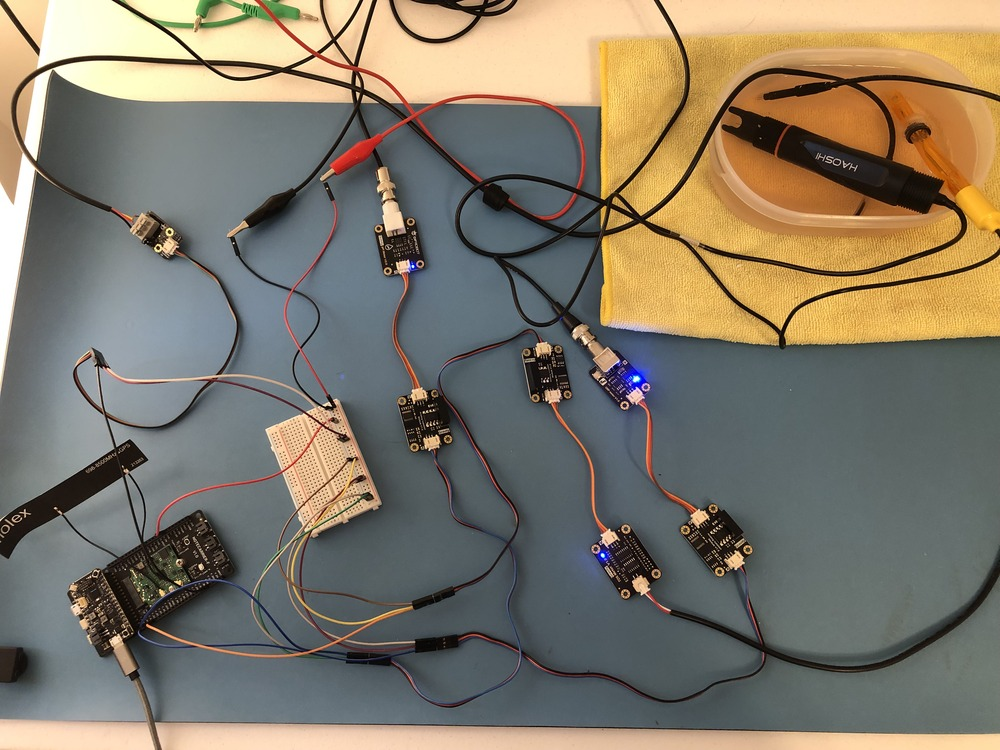

# Water Quality Monitor

Collect water quality metrics from various sensors and upload them to the cloud via a cellular connection.

## You Will Need

* [Visual Studio Code (VS Code)](https://code.visualstudio.com/) with the [PlatformIO extension](https://platformio.org/)
* [Notecarrier F](https://blues.com/products/notecarrier/notecarrier-f/)
* [Notecard](https://blues.com/products/notecard/)
* [Swan](https://blues.com/products/swan/)
* [Gravity: Analog ORP Sensor Meter for Arduino](https://www.dfrobot.com/product-1071.html)
* [Gravity: Analog Industrial pH Sensor / Meter Pro Kit V2](https://www.dfrobot.com/product-2069.html)
* [Gravity: Analog TDS Sensor/ Meter for Arduino](https://www.dfrobot.com/product-1662.html)
* [3 Gravity: Analog Signal Isolators](https://www.dfrobot.com/product-1621.html)
* [Gravity: Waterproof DS18B20 Temperature Sensor Kit](https://www.dfrobot.com/product-1354.html)
* [256 mV ORP calibration solution](https://www.amazon.com/calibration-solution-Oxidation-Reduction-Potential/dp/B01FS0G8WK)
* [4.00 pH calibration solution](https://atlas-scientific.com/calibration-solutions/ph-4-00-calibration-solution-chem-ph-4/)
* [7.00 pH calibration solution](https://atlas-scientific.com/calibration-solutions/ph-7-00-calibration-solution/)
* [1000 ppm TDS calibration solution](https://www.amazon.com/HM-Digital-1000ppm-Calibration-Solution/dp/B001FD6WZ8)
* 5V DC power supply\*
* Micro USB cable
* Breadboard
* Male-to-male jumper wires

\* A wall wart with an adapter for breadboarding or a bench power supply will work.

## Sensor Calibration

This application uses 4 sensors to measure the following quantities:

- [Oxidation Reduction Potential](https://en.wikipedia.org/wiki/Reduction_potential) (ORP)
- [pH](https://en.wikipedia.org/wiki/PH)
- [Total Dissolved Solids](https://en.wikipedia.org/wiki/Total_dissolved_solids) (TDS)
- Temperature

Temperature is measured with a digital sensor, but the other three quantities are measured with analog sensors and require calibration with calibration solutions. Calibrate each analog sensor by following DFRobot's documentation and using the calibration solutions linked in the table below.

| Sensor |  Docs | Calibration solution(s)
| -------| ------| -----------------------
| ORP    | [Link](https://wiki.dfrobot.com/Analog_ORP_Meter_SKU_SEN0165_) | [256 mV](https://www.amazon.com/calibration-solution-Oxidation-Reduction-Potential/dp/B01FS0G8WK)
| pH     | [Link](https://wiki.dfrobot.com/Gravity__Analog_pH_Sensor_Meter_Kit_V2_SKU_SEN0161-V2) | [4.00](https://atlas-scientific.com/calibration-solutions/ph-4-00-calibration-solution-chem-ph-4/) and [7.00](https://atlas-scientific.com/calibration-solutions/ph-7-00-calibration-solution/)
| TDS    | [Link](https://wiki.dfrobot.com/Gravity__Analog_TDS_Sensor___Meter_For_Arduino_SKU__SEN0244) | [1000 ppm](https://www.amazon.com/HM-Digital-1000ppm-Calibration-Solution/dp/B001FD6WZ8)

The ORP calibration procedure involves computing an offset value. Once you have that value, edit `firmware/water_quality_monitor/water_quality_monitor.ino` and replace 0 in the line `#define ORP_OFFSET 0` with your value.

## Hardware Setup

With the analog sensors calibrated, you're ready to assembly the circuitry.

### Power

Since we'll be powering several sensors and boards, you must use an external power supply. All the parts accept 5V power. We recommend using either a DC regulated bench power supply or a 5V DC wall wart and a [power jack adapter](https://www.amazon.com/gp/product/B01J1WZENK) to allow for breadboarding. If you go with a wall wart, be warned that the power supplied needs to be stable, as the analog sensors have tight tolerances around their power requirements (+/- 0.1 V). We used a bench power supply, connecting the minus and plus ports to the corresponding rails on a breadboard:


When it comes time to power the various sensors, you can easily wire them up to the breadboard.

### Analog Sensors

Each analog sensor (ORP, pH, and TDS) needs to be connected to an analog signal isolator. Why? DFRobot's [page for the analog signal isolator board](https://www.dfrobot.com/product-1621.html) explains:

> In many cases, electrical isolation is required to ensure the reliable operation of the sensors. Some sensors, such as pH sensors and conductivity sensors, will interfere with each other and do not measure properly in the same container when they connect to the same power. To ensure stable and reliable operation of the sensors with no interference, it is necessary to isolate the signal and the power.

1. Connect the ORP probe's BNC connector to the ORP board, and use the 3-wire connector to connect the ORP board to the port labeled "SEN" on one of the isolator boards.
2. Connect the pH probe's BNC connector to the ORP board, and use the 3-wire connector to connect the pH board to the port labeled "SEN" on one of the isolator boards.
3. Connect the TDS probe's 2-wire connector to the TDS board, and use the 3-wire connector to connect the ORP board to the port labeled "SEN" on one of the isolator boards.
  
4. Using male-to-male jumper wires, connect all the red wires from the sensors to the + rail of the breadboard, and connect all the black wires to the - rail.
  

As shown in the photo above, the blue LEDs should turn on when you apply power. Leave the third, blue wire of each sensor disconnected, for now. These are the signal lines that will be wired up to the Notecarrier.

### Temperature Sensor

The DS18B20 temperature sensor kit linked above comes with a resistor module that acts as a pull up on the sensor's signal line. Make the following connections between the 3 wires of the sensor's probe and the resistor module:

| Probe  | Resistor module |
| -------| ----------------|
| Yellow | A               |
| Red    | B               |
| Black  | C               |

As with the analog sensors, connect the red wire to the + rail of the breadboard, and connect the black wire to the - rail. Leave the green wire disconnected. This is the signal line that will be wired up to the Notecarrier.


### Notecarrier

1. Assemble Notecard and Notecarrier as described in the [Notecard Quickstart](https://dev.blues.io/quickstart/notecard-quickstart/notecard-and-notecarrier-f/).
2. Plug the Swan into the Notecarrier, aligning the Swan's male headers with the Notecarrier's female headers.
3. Using male-to-male jumper wires, making the following connections between the signal lines of the sensors and the pins of the Notecarrier. Remember that the signal lines for the analog sensors are the blue wires, and the signal line for the temperature sensor is the green wire.
    | Sensor      | Notecarrier |
    | ------------| ------------|
    | ORP         | F_A0        |
    | pH          | F_A1        |
    | TDS         | F_A2        |
    | Temperature | F_D5        |
4. Connect the GND pin of the Notecarrier to the minus rail of the breadboard. **Do not forget this step!** It's critical that everything shares this GND connection.
5. Connect a micro USB cable between a free USB port on your development PC and the micro USB port of the Swan.
6. Place the probes of all 4 sensors into a container of water.



## Notehub Setup

Sign up for a free account on [notehub.io](https://notehub.io) and [create a new project](https://dev.blues.io/quickstart/notecard-quickstart/notecard-and-notecarrier-pi/#set-up-notehub).

## Firmware

### Operation

The firmware periodically reads the sensors, computes the measurements, and uploads the measurements to Notehub via the [Notefile](https://dev.blues.io/api-reference/glossary/#notefile) `sensor.qo`. The time between between sensor readings defaults to 10 minutes, but this can be changed using the [environment variable](https://dev.blues.io/guides-and-tutorials/notecard-guides/understanding-environment-variables/) `sample_period`. For example, if you set `sample_period` to 5, the sensors will be read every 5 minutes.

Data from Notehub to the Notecard is synced every 5 minutes, and data from the Notecard to Notehub is synced every 10 minutes. You can change these values at compile-time with the macros `INBOUND_MINS` and `OUTBOUND_MINS`, respectively. These values are passed directly to the [`hub.set`](https://dev.blues.io/api-reference/notecard-api/hub-requests/#hub-set) command that gets issued when the Swan starts up.

### Building and Flashing

To build and upload the firmware onto the Swan, you'll need VS Code with the PlatformIO extension.

1. Download and install [Visual Studio Code](https://code.visualstudio.com/).
2. Install the [PlatformIO IDE extension](https://marketplace.visualstudio.com/items?itemName=platformio.platformio-ide) via the Extensions menu of Visual Studio Code.
3. Click the PlatformIO icon on the left side of VS Code, then click Pick a folder, and select the the firmware directory, `48-water-quality-monitor/firmware`.
4. In the file explorer, open `water_quality_monitor/water_quality_monitor.ino` and uncomment this line: `// #define PRODUCT_UID "com.my-company.my-name:my-project"`. Replace `com.my-company.my-name:my-project` with the [ProductUID of the Notehub project](https://dev.blues.io/notehub/notehub-walkthrough/#finding-a-productuid) you created in [Notehub Setup](#notehub-setup).
5. Click the PlatformIO icon again, and under the Project Tasks menu, click Build to build the firmware image.
6. Prepare the Swan to receive the firmware image via DFU by following these instructions from the [Swan Quickstart](https://dev.blues.io/quickstart/swan-quickstart#programming-swan-the-stlink-v3mini-recommended).
7. Under the Project Tasks menu, click Upload to upload the firmware image to the MCU.

From here, you can view logs from the firmware over serial with a terminal emulator (e.g. minicom). On Linux, the serial device will be something like `/dev/ttyACM0`. Use a baud rate of 115200 and [8-N-1](https://en.wikipedia.org/wiki/8-N-1) for the serial parameters.

## Notehub Events

With the firmware running, you should begin to see notes come into Notehub on your project's Events tab.\*


\* The analog sensor values shown in this image are not realistic, as the sensors generating the measurements in this case weren't calibrated, yet.

## Datacake Dashboard

If you want to visualize the data coming in from the Notecard, you can set up a [Notehub route](https://dev.blues.io/notehub/notehub-walkthrough/#routing-data-with-notehub) that transforms the contents of the `sensor.qo` notes and pushes the resulting data to [Datacake](https://datacake.co/). [This guide on our developer site](https://dev.blues.io/guides-and-tutorials/routing-data-to-cloud/datacake/) will walk you through the whole process. When you get to the section "Use JSONata to Transfrom JSON", use this code to populate the JSONata expression box when creating the route:

```
(
    {
        "device": device,
        "orp": body.orp,
        "ph": body.ph,
        "tds": body.tds,
        "temp": body.temp
    }
)
```

This transform script pares down the data in the notes to output:

- `device`: The [DeviceUID](https://dev.blues.io/api-reference/glossary/#deviceuid) of the Notecard.
- `orp`: The ORP value in mV.
- `ph`: The pH value.
- `tds`: The TDS value in ppm.
- `temp`: The water temperature in Celsius.

When you get to the point in our guide where you're setting up the HTTP Payload Decoder in Datacake, use this code:

```js
function Decoder(request) {
    var data = JSON.parse(request.body);
    console.log(JSON.stringify(data))
    var device = data.device;

    var decoded = {};
    decoded.orp = data.orp;
    decoded.ph = data.ph;
    decoded.tds = data.tds;
    decoded.temp = data.temp;

    // Array where we store the fields that are being sent to Datacake
    var datacakeFields = []

    // take each field from decoded and convert them to Datacake format
    for (var key in decoded) {
        if (decoded.hasOwnProperty(key)) {
            datacakeFields.push({field: key.toUpperCase(), value: decoded[key], device: device})
        }
    }

    // forward data to Datacake
    return datacakeFields;

}
````

Once you've completed the routing guide, you'll have a dashboard to monitor the various water quality metrics. Here's an example dashboard that we created:


## Blues Community

We’d love to hear about you and your project on the [Blues Community Forum](https://discuss.blues.com/)!
