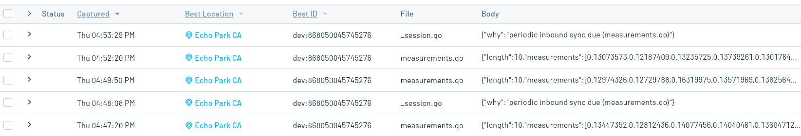

# HVAC Current Monitor

Measure the current consumption of an HVAC unit and publish the measurements to the cloud.

## You Will Need

* [Visual Studio Code (VS Code)](https://code.visualstudio.com/) with the [PlatformIO extension](https://platformio.org/)
* [Notecarrier F](https://blues.com/products/notecarrier/notecarrier-f/)
* [Notecard](https://blues.com/products/notecard/)
* [Swan](https://blues.com/products/swan/)
* Window HVAC unit
* [SCT013-030 30A 1V Non-invasive Split Core Current Transformer Sensor](https://www.amazon.com/gp/product/B07WT7KGTT)
* [TRRS 3.5mm Audio Jack Breakout](https://www.amazon.com/gp/product/B07L3P93ZD)
* Soldering iron
* Solder flux
* Extension cord
* Utility knife
* Breadboard
* Micro USB cable
* 1 10 uF capacitor
* 2 10 kΩ resistors
* Male-to-male jumper wires

## Overview

In this project, you'll clamp the current transformer (CT) around one of the hot or neutral wires in the extension cord. You'll then connect this extension cord to the HVAC unit in order to measure the current it consumes. The CT outputs an AC signal whose RMS voltage is proportional to the amount of current going through the wire (specifically, 1 V corresponds to 30 A). You will create a simple bias circuit so that this voltage is always positive, and you'll feed the signal into the Swan for analog to digital conversion. The firmware on the Swan samples the signal and computes the current. These measurements are periodically coalesced into [Notes](https://dev.blues.io/api-reference/glossary/#note) that get sent to the Notecard, where they'll eventually be synced to [Notehub](https://notehub.io/).

## Hardware Setup

### Current Transformer

Start by opening up a small section of the extension cord's outer insulation, taking care not to cut too deeply, as you don't want to cut into the interior wires:


Inside, there should be 3 wires: black, white, and green. Black is the "hot" wire and white is the "neutral" wire. Take your CT and clamp it around either the hot or neutral wire:


Clamping the CT around both will result in 0 current readings, as [the current in each wire cancels the other out](https://docs.openenergymonitor.org/electricity-monitoring/ct-sensors/installation.html).

### TRRS Breakout

The CT's output signal is delivered via a [TRRS connector](https://en.wikipedia.org/wiki/Phone_connector_(audio)#TRRS). You'll plug this connector into the TRRS breakout, but first, you must solder on the row of headers that come with the breakout. Once you're done soldering, plug the breakout into the breadboard and connect the CT:


### Notecarrier

1. Assemble Notecard and Notecarrier as described in the [Notecard Quickstart](https://dev.blues.io/quickstart/notecard-quickstart/notecard-and-notecarrier-f/).
2. Plug the Swan into the Notecarrier, aligning the Swan's male headers with the Notecarrier's female headers.
3. Connect the F_3V3 pin of the Notecarrier to the positive (+) rail of the breadboard, and the GND pin to the negative (-) rail:
4. Connect F_A0 to the same Breadboard row as the SLEEVE pin of the TRRS breakout.
    

### Bias Circuit

The output of the current transformer is an AC signal whose voltage swings between negative and positive values. The ADC on the Swan requires a positive voltage, so you'll need to bias the signal such that it doesn't swing negative. To accomplish this, you'll build a simple bias circuit, which is described in detail [here](https://docs.openenergymonitor.org/electricity-monitoring/ct-sensors/interface-with-arduino.html). Note that the "burden resistor" mentioned in that document comes pre-installed in the CT linked above; you do not need to add an external burden resistor. Additionally, the document uses an Arduino, which operates at 5 V, but the Swan operates at 3.3 V. This doesn't affect the design of the circuit, but you should mentally substitute 3.3 V wherever you see 5 V.

Using a jumper wire, the resistors, and the capacitor, build the circuit shown below:


## Notehub Setup

Sign up for a free account on [Notehub](https://notehub.io) and [create a new project](https://dev.blues.io/quickstart/notecard-quickstart/notecard-and-notecarrier-pi/#set-up-notehub).

## Firmware

### Operation

The firmware periodically reads the voltage from the CT and computes the current implied by that voltage, after accounting for the DC bias. Once 10 measurements have been taken, they're put into a Note in the [Notefile](https://dev.blues.io/api-reference/glossary/#notefile) `measurements.qo`. You can change the number of measurements per Note by using the macro `MEASUREMENTS_PER_NOTE`. The time between measurements defaults to 15 seconds, but this can be changed using the [environment variable](https://dev.blues.io/guides-and-tutorials/notecard-guides/understanding-environment-variables/) `seconds_between_measurements`. For example, if you set `seconds_between_measurements` to 60, a measurement will be taken every minute.

Data from Notehub to the Notecard is synced every 5 minutes, and data from the Notecard to Notehub is synced every 10 minutes. You can change these values with the macros `INBOUND_MINS` and `OUTBOUND_MINS`, respectively. These values are passed directly to the [`hub.set`](https://dev.blues.io/api-reference/notecard-api/hub-requests/#hub-set) command that gets issued when the Swan starts up.

The environment variable `percentage_change_threshold` can be set to trigger an immediate sync of `measurements.qo` Notes from the Notecard to Notehub under certain conditions. Specifically, the firmware keeps track of the average value from the last `measurements.qo` Note. If the percentage change (positive or negative) from that average to the next Note's average exceeds `percentage_change_threshold`, the Note gets synced immediately to Notehub, ignoring `OUTBOUND_MINS`. By default, the threshold is set to 50%. When setting this variable, the value must be a positive number (e.g. 60, 200, etc.).

### Building and Flashing

To build and upload the firmware to the Swan, you'll need VS Code with the PlatformIO extension.

1. Download and install [Visual Studio Code](https://code.visualstudio.com/).
2. Install the [PlatformIO IDE extension](https://marketplace.visualstudio.com/items?itemName=platformio.platformio-ide) via the Extensions menu of Visual Studio Code.
3. Click the PlatformIO icon on the left side of VS Code, then click Pick a folder, and select the the firmware directory, `49-hvac-current-monitor/firmware`.
4. In the file explorer, open `hvac_current_monitor/hvac_current_monitor.ino` and uncomment this line: `// #define PRODUCT_UID "com.my-company.my-name:my-project"`. Replace `com.my-company.my-name:my-project` with the [ProductUID of the Notehub project](https://dev.blues.io/notehub/notehub-walkthrough/#finding-a-productuid) you created in [Notehub Setup](#notehub-setup).
5. Click the PlatformIO icon again, and under the Project Tasks menu, click Build to build the firmware image.
6. Prepare the Swan to receive the firmware image via DFU by following these instructions from the [Swan Quickstart](https://dev.blues.io/quickstart/swan-quickstart/#programming-swan-the-stlink-v3mini).
7. Under the Project Tasks menu, click Upload to upload the firmware image to the MCU.

From here, you can view logs from the firmware over serial with a terminal emulator (e.g. minicom). On Linux, the serial device will be something like `/dev/ttyACM0`. Use a baud rate of 115200 and [8-N-1](https://en.wikipedia.org/wiki/8-N-1) for the serial parameters.

## Testing

With all the circuitry in place, plug your HVAC unit into the extension cord and connect the extension cord to an outlet. Turn on the HVAC unit. You should begin to see Notes come into Notehub on your project's Events tab.



If you double-click on one of these events and navigate to the Body tab, you can see the contents of the Note in detail. Take a look at this example:

```json
{
    "length": 10,
    "measurements": [
        0.35744682,
        0.33554894,
        0.34163025,
        0.33816144,
        0.33798158,
        0.34986818,
        0.31715065,
        0.3206467,
        0.3384733,
        0.32988986
    ],
    "seconds_between_measurements": 1
}
```

The `length` parameter indicates how many valid measurements are in the `measurements` array. This is necessary because the array may contain trailing 0 values that aren't actually valid measurements. This can happen if an environment variable is modified before a full batch of measurements is assembled. The `measurements` array's unit is amps. `seconds_between_measurements` is a snapshot of what the `seconds_between_measurements` environment variable was when these measurements were taken, so you know the time spacing between each measurement.

## Blues Community

We’d love to hear about you and your project on the [Blues Community Forum](https://discuss.blues.com/)!
