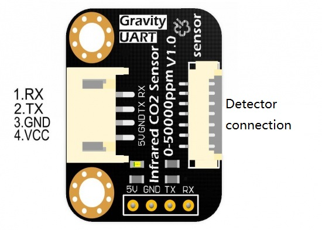
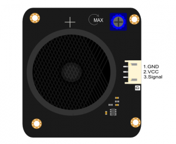
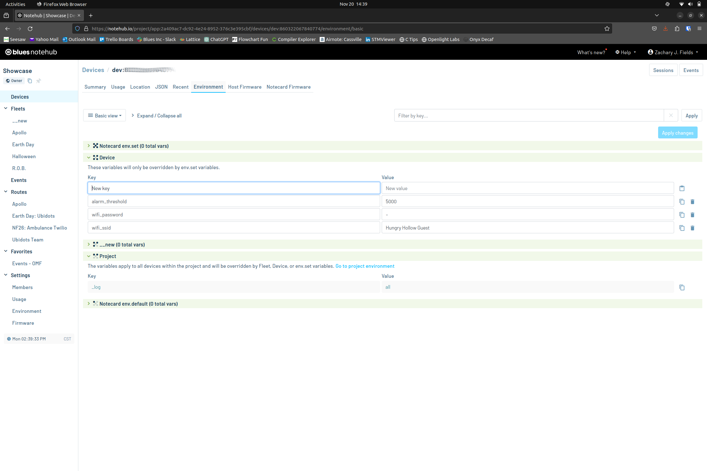

# Smart CO2 Sensor

Detect CO2 levels (ppm) in a given environment. Publish the values and set
dynamic alarm thresholds for activities via a cellular connection.

## Overview

This application continuously reads atmospheric CO2 levels in ppm and check to
see whether the current CO2 levels are cause for concern. When an alarm event is
triggered, then an alarm is sounded and a Twilio message is generated to warn
employees and/or patrons of dangerous CO2 levels. Periodic samples of
atmospheric CO2 are recorded and synced to [Notehub](https://www.notehub.io/)
via a [Notecard](https://blues.io/products/notecard/).

## You Will Need

* [Notecard](https://blues.io/products/notecard/)
* [Notecarrier F](https://blues.io/products/notecarrier/notecarrier-f/)
* [Adafruit FeatherWing OLED - 128x32](https://www.adafruit.com/product/3045)
* [Blues Swan](https://blues.io/products/swan)
* [DFRobot Gravity: Digital Speaker Module](https://wiki.dfrobot.com/DFRobot_Speaker_v1.0_SKU__FIT0449)
* [DFRobot Gravity: UART Infrared Carbon Dioxide Sensor (0-50000 ppm)](https://wiki.dfrobot.com/Infrared_CO2_Sensor_0-50000ppm_SKU__SEN0220)
* Momentary push button
* 5V, 2A DC power supply
* [DC Power Jack Plug Adapter Barrel Connector](https://www.amazon.com/gp/product/B01J1WZENK)
* Micro USB cable
* Male-to-male jumper wires
* Soldering iron and solder flux
* 3D printed enclosure (optional)

## Hardware Setup

### Notecard and Notecarrier

For prototyping, assemble the Notecard and Notecarrier as described in the
[Notecard Quickstart](https://dev.blues.io/quickstart/notecard-quickstart/notecard-and-notecarrier-f/).

> _**NOTE:** The custom enclosure was designed for the Swan to be soldered
directly to the Notecarrier-F without the headers (to minimize the profile)._

### CO2 Sensor

The CO2 sensor has a breakout board that provides communication via UART, and
comes with a prelabeled 4-pin UART connector (5V, GND, TX, RX).



_For more information, please review [the product Wiki](https://wiki.dfrobot.com/Infrared_CO2_Sensor_0-50000ppm_SKU__SEN0220)._

### OLED Display

The OLED display is powered and updated via the Qwiic connector. Connect
directly to the Qwiic connector on the Swan.

_For more information, please review [the product page](https://www.adafruit.com/product/3045)._

### Speaker

The speaker has a three pin connector (GND,Vcc,Signal). The signal is generated
using any pin compatible with the Arduino `tone()` API.



_For more information, please review [the product Wiki](https://wiki.dfrobot.com/DFRobot_Speaker_v1.0_SKU__FIT0449)._

### Button

The button is used to request the screen to provide the human readable
description of the CO2 ppm value. It will be connected between GND and D13.

### Power Supply

A 5V, 2A power supply is sufficient to power all the hardware used in this
project. Feed the power into the `V+` and `GND` pins of the Notecarrier-F.

### Wiring

| CO2 Sensor | Notecarrier |
|------------|-------------|
| RX         | F_RX        |
| TX         | F_TX        |
| GND        | GND         |
| 5V         | VMAIN       |

| Speaker | Notecarrier |
|---------|-------------|
| GND     | GND         |
| Vcc     | VMAIN       |
| Signal  | D12         |

| Button | Notecarrier |
|--------|-------------|
| -      | GND         |
| -      | D13         |

> _**TIP:** To debounce the button connect a 47pF capacitor between the legs._

| Barrel Jack | Notecarrier |
|-------------|-------------|
| -           | GND         |
| +           | V+          |

## USDA CO2 Table

|  PPM  | % of atmosphere | Symptoms                                                                                        |
|:-----:|:---------------:|:----------------------------------------------------------------------------------------------- |
|  5000 |       0.5%      | OSHA Permissible Exposure Limit (PEL) and ACGIH Threshold Limit Value (TLV) for 8-hour exposure |
| 10000 |       1.0%      | Typically no effects, possible drowsiness                                                       |
| 15000 |       1.5%      | Mild respiratory stimulation for some people                                                    |
| 30000 |       3.0%      | Moderate respiratory stimulation, increased heart rate and blood pressure, ACGIH TLV-Short Term |
| 40000 |       4.0%      | Immediately Dangerous to Life or Health (IDLH)                                                  |
| 50000 |       5.0%      | Strong respiratory stimulation, dizziness, confusion, headache, shortness of breath             |
| 80000 |       8.0%      | Dimmed sight, sweating, tremor, unconsciousness, and possible death                             |

## Notehub Setup

In order to push data from the Notecard to the cloud, you need to sign up for a free account on [notehub.io](https://notehub.io) and [create a new project](https://dev.blues.io/quickstart/notecard-quickstart/notecard-and-notecarrier-pi/#set-up-notehub).

## Arduino Code

### note-arduino

Blues provides an [Arduino SDK for the
Notecard](https://dev.blues.io/tools-and-sdks/firmware-libraries/arduino-library/).

### SmartCO2Sensor.cpp

The sketch loops infinitely, messuring the CO2 concentration and evaluating it
against the USDA thresholds as well as the alarm level. A
[Note](https://dev.blues.io/api-reference/glossary/#note) is added to the
`data.qo` [Notefile](https://dev.blues.io/api-reference/glossary/#notefile) in
this format:

```json
{
    "co2": 963,
    "temp": 28.625,
    "voltage": 5.149829688002166
}
```

`co2` is the detected CO2 concentration in parts per million. `temp` is the
temperature of the MCU on the Notecard. The temperature is impacted by the
utilization of the MCU, but it can still provide a coarse grained representation
of the ambient air temperature. `voltage` is the power measured on `V+`, which
is provided to the CO2 sensor and speaker.

#### Environment Variables

There are three [environment
variables](https://dev.blues.io/guides-and-tutorials/notecard-guides/understanding-environment-variables/)
you may wish to configure:

- `alarm_threshold`: This is the ppm value where the alarm should trigger.
- `wifi_ssid`: The Notecard WBNAW has a built-in Wi-Fi antenna. It will connect
via cellular out of the box, but if Wi-Fi ssid and password are provided, then
it will prefer to connect over Wi-Fi. You are able to test and deploy this
device in separate locations without having to recompile the firmware.
- `wifi_password`: The Wi-Fi password used to update the current configuration.

To change these values, go to your Notehub project, find the device you wish to
update. Click into the device detail page, then click the Environment tab. Now,
enter your desired values and click Apply Changes:



The next time data is synced to the Notecard, the environment variables will
update on the Notecard.

#### Updating `SmartCO2Sensor.cpp`

Before compiling `SmartCO2Sensor.cpp`, uncomment the following line:

```cpp
// #define PRODUCT_UID "com.my-company.my-name:my-project"
```

 Replace `com.my-company.my-name:my-project` with the [ProductUID of the Notehub
 project](https://dev.blues.io/notehub/notehub-walkthrough/#finding-a-productuid)
 you created in [Notehub Setup](#notehub-setup).

## Notehub Events

To see the `data.qo` Notes on Notehub, navigate to your project page and click
the Events tab on the left-hand side. Here, you should see `data.qo` Notes with
their speeds and timestamps in the Body column.

## Blues Community

We’d love to hear about you and your project on the [Blues Community
Forum](https://discuss.blues.io/)!
