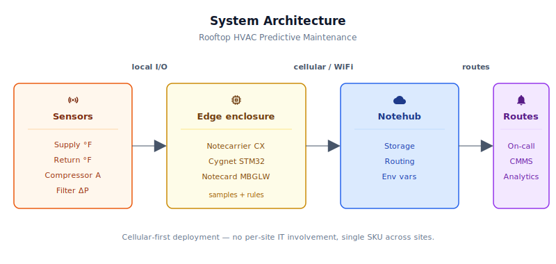
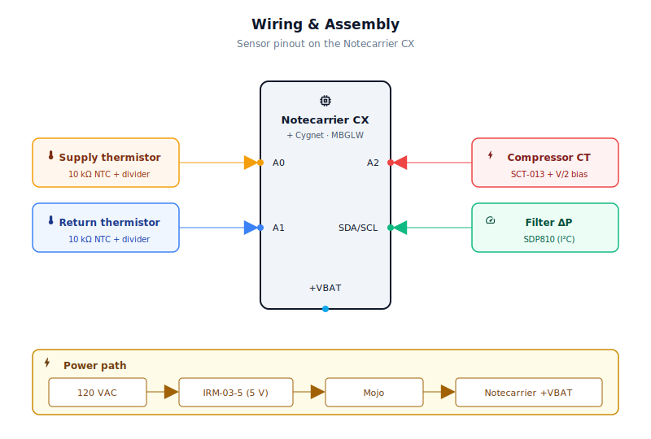
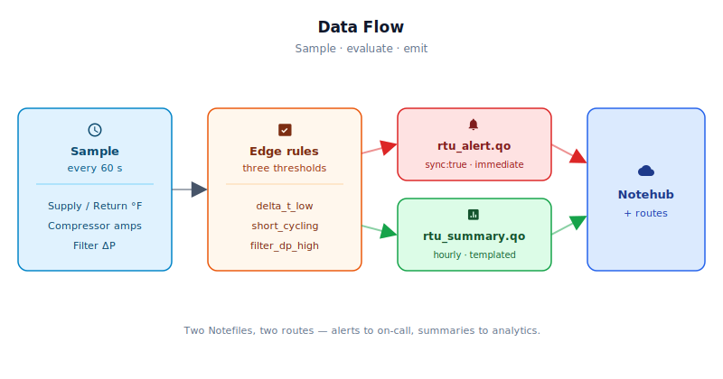

# Rooftop HVAC Unit Predictive Maintenance Pack

<Note>

This reference application is intended to provide inspiration and help you get started quickly. It uses specific hardware choices that may not match your own implementation. Focus on the sections most relevant to your use case. If you'd like to discuss your project and whether it's a good fit for Blues, [feel free to reach out](https://blues.com/landing-pages/accelerators-contact-us/?accelerator=Rooftop%20HVAC%20Unit%20Predictive%20Maintenance%20Pack).

</Note>

This project is a retrofit [downtime prevention](https://blues.com/downtime-prevention/) pack for commercial rooftop HVAC units. A handful of inexpensive sensors and a Blues [Notecard Cell+WiFi](https://shop.blues.com/products/notecard-cellular?utm_source=dev-blues&utm_medium=web&utm_campaign=store-link) turn an ordinary rooftop unit into a remotely-monitored, predictively-maintained asset — catching refrigerant loss, short-cycling, and clogged filters *before* the unit fails and a tenant loses cooling.

**What you'll have when you're done:** a weatherproof, line-powered sidecar bolted to a commercial rooftop air-conditioning unit that samples four sensors every minute, runs three failure-mode checks locally, and pages your on-call queue within ~60 seconds of a threshold trip — over cellular, with no site IT involvement and no modification to the unit itself. Hourly summaries are emitted on a separate event stream for trending and analytics. Operators can re-tune thresholds in the field from the cloud, with no firmware changes required.

## 1. Project Overview

**The problem.** In HVAC, an **RTU** (rooftop unit) is a self-contained packaged HVAC system — compressor, condenser, evaporator, blower, and controls all in one box — mounted on the roof of a commercial building. It's the workhorse of light commercial cooling: the vast majority of grocery stores, restaurants, strip-mall tenants, and small warehouses are conditioned by one or more RTUs sitting above the suspended ceiling.

A commercial RTU sits on a roof, cannot see building WiFi, and when it fails a grocery store or restaurant loses cooling and goes dark. The HVAC failures that cause most unplanned downtime aren't dramatic — they're gradual. A refrigerant leak slowly narrows the cooling delta-T over weeks. A tired contactor starts chattering, and the compressor short-cycles several times an hour instead of running in long, steady pulls. A neglected filter chokes airflow across the coil. None of these are invisible, but they're all easy to miss from inside the building — especially when nobody's looking. Each one is an impending failure detectable hours to days before the actual outage, *if* someone (or something) happens to be watching.

This project is that watcher. It's a retrofit sidecar that gets strapped to the RTU chassis on the roof, samples four sensors a minute, and pages the service technician *before* the walk-in cooler hits 50°F on a Saturday night. In Blues terms, it's a downtime-prevention device-to-cloud system: continuous remote monitoring on the edge, rule-based failure detection in firmware, and proactive-service alerts routed through Notehub to whatever on-call system the fleet owner already uses. The detection is heuristic — three scalar threshold checks, not a trained model, but it catches the impending-failure patterns HVAC technicians already look for on a service call.

**Why Notecard.** RTUs have no line-of-sight to indoor WiFi access points, and HVAC OEMs and service companies need a single SKU that works identically in a strip mall and in a warehouse. Cellular removes the per-site IT involvement entirely — there's no network form to fill out, no AP to pair to, and no IT ticket to chase. The Notecard Cell+WiFi variant keeps WiFi as an optional fallback for the occasional site that happens to have a rooftop-accessible AP, without compromising the cellular-first deployment model.

<NewToBlues/>

**Deployment scenario.** A weatherproof enclosure strapped to the RTU frame, powered from 120VAC line at the RTU service disconnect (or from the 24VAC control transformer with an alternate supply. See [Limitations](#11-limitations-and-next-steps)), with four pigtails running into the unit: two thermistors (supply and return ducts), one clamp-on current transformer on the compressor hot leg, and one differential-pressure sensor with silicone tubes tapped across the filter. No RTU modification, no OEM cooperation, and no site IT coordination required.

## 2. System Architecture



**Device-side responsibilities.** The onboard Cygnet STM32 host on the Notecarrier CX samples all four sensors every 60 seconds, evaluates three threshold rules locally, and manages its own sleep between samples using [`card.attn`](https://dev.blues.io/api-reference/notecard-api/card-requests/#card-attn). Queued Notes travel from the host to the Notecard over I²C — no JSON marshaling, no AT commands, no serial buffers to babysit.

**Notecard responsibilities.** The Notecard stores [Notes](https://dev.blues.io/api-reference/glossary/#note) locally, establishes the cellular (or WiFi) session on the configured [`hub.set`](https://dev.blues.io/api-reference/notecard-api/hub-requests/#hub-set) `outbound` cadence (default 60 minutes), and flushes any `sync:true` alert Notes immediately. The Notecard also owns GNSS for one-time site geolocation (handled autonomously, no firmware code required on the host) and [environment-variable](https://dev.blues.io/guides-and-tutorials/notecard-guides/understanding-environment-variables/) distribution. Operators can retune thresholds without re-flashing firmware.

**Notehub responsibilities.** The Notecard manages its own cellular session against the supported carrier networks worldwide via its embedded global SIM and delivers data to [Notehub](https://notehub.io) over the Internet; Notehub ingests events, stores every event, and applies project-level routes. Alerts and summaries land in separate [Notefiles](https://dev.blues.io/api-reference/glossary/#notefile) so routes can be configured to fan them out differently — alerts to an on-call or CMMS (computerized maintenance management system) endpoint, summaries to a long-term analytics store.

**Routing to the cloud (high level only).** Notehub supports HTTP, MQTT, AWS, Azure, GCP, Snowflake, and several other destinations; route setup is project-specific. See the [Notehub routing docs](https://dev.blues.io/notehub/notehub-walkthrough/#routing-data-with-notehub) — this project doesn't ship any specific downstream endpoint.

## 3. Technical Summary

If you want the fastest path from "parts on the bench" to "first event in Notehub":

1. **Notehub** — create a [Notehub project](https://notehub.io), copy its ProductUID.
2. **Wire the bench rig** — [Notecarrier CX](https://shop.blues.com/products/notecarrier-cx?utm_source=dev-blues&utm_medium=web&utm_campaign=store-link) + [Notecard MBGLW](https://dev.blues.io/datasheets/notecard-datasheet/note-mbglw/) + two thermistor dividers on A0/A1 + CT bias network on A2 + SDP810 on I²C. Full pinout is in [§5](#5-wiring-and-assembly).
3. **Edit one line** of [`firmware/rtu_predictive_maintenance/rtu_predictive_maintenance.ino`](firmware/rtu_predictive_maintenance/rtu_predictive_maintenance.ino) — set `PRODUCT_UID` to your project's value (line 24).
4. **Flash** — `arduino-cli compile -b STMicroelectronics:stm32:Cygnet` then `arduino-cli upload`. Full instructions in [§7.1](#71-installing-and-flashing).
5. **Watch** — open Notehub → your project → **Events** tab. You should see a `_session.qo` immediately, an `rtu_summary.qo` within an hour, and any threshold trips as `rtu_alert.qo` in real time.

The rest of this README expands each step and explains why the firmware is shaped the way it is. If you're doing a real rooftop install rather than a bench bring-up, also read [§11 Limitations](#11-limitations-and-next-steps) before you commit to a power topology.

Here is a sample Note this device emits:

```json
{
  "supply_f": 52.4,
  "return_f": 71.8,
  "delta_t_f": 19.4,
  "compressor_amps": 14.7,
  "filter_dp_pa": 31.2,
  "starts": 3,
  "runtime_min": 41.0
}
```

## 4. Hardware Requirements

| Part | Qty | Rationale |
|------|-----|-----------|
| [Notecarrier CX](https://shop.blues.com/products/notecarrier-cx?utm_source=dev-blues&utm_medium=web&utm_campaign=store-link) | 1 | Integrated carrier with an embedded Cygnet STM32 host — no separate MCU needed for this sensor mix. |
| [Notecard Cell+WiFi (MBGLW)](https://shop.blues.com/products/notecard-cell-wifi?utm_source=dev-blues&utm_medium=web&utm_campaign=store-link) / [datasheet](https://dev.blues.io/datasheets/notecard-datasheet/note-mbglw/) | 1 | Cellular removes per-site IT involvement; WiFi fallback is available for sites that happen to have it. |
| [Blues Mojo](https://shop.blues.com/products/mojo?utm_source=dev-blues&utm_medium=web&utm_campaign=store-link) *(optional, bench-only)* | 0–1 | Coulomb counter on the power rail for ground-truth energy validation during bench bring-up. **Not required for production deployment**. See [§9](#9-validation-and-testing) and [§11](#11-limitations-and-next-steps). |
| 10 kΩ NTC thermistor, β=3950, waterproof duct probe | 2 | Duct-mount supply and return air temperature for cooling delta-T. |
| 10 kΩ 1% resistor (divider series leg) | 2 | Pull-up for each thermistor divider. |
| SCT-013-030 split-core CT, 30A / 1V AC (e.g. [SparkFun SEN-11005](https://www.sparkfun.com/products/11005)) | 1 | Non-invasive compressor current sensing; 30A matches single-phase light-commercial RTU compressors. |
| TRRS 3.5 mm breakout (e.g. [SparkFun BOB-11570](https://www.sparkfun.com/products/11570)) | 1 | The SCT-013's output lead terminates in a TRRS plug. |
| 10 kΩ 1% resistor (bias pair) | 2 | CT bias circuit — centers the AC signal at Vref/2 so the ADC sees only positive voltages. |
| 10 µF electrolytic capacitor | 1 | Bias-circuit decoupling. |
| [Sensirion SDP810-125Pa](https://sensirion.com/products/catalog/SDP810-125Pa) differential-pressure sensor | 1 | I²C DP sensor across the filter; a continuous reading trends *toward* clogging, unlike a binary DP switch that only tells you once you're already there. |
| ¼″ silicone tubing, ~2 ft | 1 | Taps the SDP810 across the filter frame. |
| AC/DC supply, 5V/2A output (e.g. [MeanWell IRM-03-5](https://www.meanwell.com/Upload/PDF/IRM-03/IRM-03-SPEC.PDF)) | 1 | Derives 5V DC from 120VAC line power at the RTU service disconnect for permanent grid-tied power. See [Limitations](#11-limitations-and-next-steps) for the 24VAC-input alternative. |
| NEMA 4X enclosure, ~6×4×2″ | 1 | Rooftop-rated housing. |

All Blues parts ship with an active SIM including 500 MB of data and 10 years of service — no activation fees, no monthly commitment.

## 5. Wiring and Assembly



All host I/O lands on the [Notecarrier CX](https://dev.blues.io/datasheets/notecarrier-datasheet/notecarrier-cx-v1-3/) dual 16-pin header. The Notecard Cell+WiFi (MBGLW) seats into the carrier's M.2 slot; cellular, GNSS, and WiFi antennas are u.FL leads to roof-mounted externals. The Mojo sits inline between the 5V supply and the Notecarrier's +VBAT pad, and reports cumulative mAh to the Notecard over its [Qwiic](https://www.sparkfun.com/qwiic) connector.

Pin-by-pin:

- **+3V3** → top of each thermistor's 10 kΩ series resistor, SDP810 `VIO`, top leg of the CT bias divider (10 kΩ from +3V3 to bias node).
- **GND** → bottom of each thermistor NTC, SDP810 `GND`, bottom leg of the CT bias divider (10 kΩ from bias node to GND), bottom of the 10 µF bias-decoupling capacitor.
- **A0** → wiper (mid-point) of the supply-air thermistor divider.
- **A1** → wiper of the return-air thermistor divider.
- **A2** → CT signal node. The two 10 kΩ resistors form a divider from +3V3 to GND with the midpoint (the **bias node**) sitting at Vref/2 ≈ 1.65 V. The 10 µF capacitor connects from the bias node to GND — it decouples the bias rail to AC ground, **not** in series with the signal. The CT's TRRS plug bridges A2 and the bias node: tip → A2, sleeve → bias node (or vice versa; the AC signal is symmetric). A2 then sees 1.65 V DC with the CT's AC swing superimposed, keeping the signal inside the 0–3.3 V ADC window.
- **SDA / SCL** → SDP810 `SDA` / `SCL` (the Notecarrier has pull-ups on-board).
- **+VBAT / +5V** pad → Mojo `LOAD` output; `BAT` input of Mojo ← 5V DC from the AC/DC supply.

Mount probes inside the unit: supply thermistor ~12″ past the evaporator coil in the supply duct, return thermistor in the return plenum upstream of the filter, CT clamped on either of the hot legs feeding the compressor contactor (clamping only **one** leg is required, both will cancel), SDP810 tubes tapped across the filter frame with silicone tubing.

> **Note on the CT threshold default.** `compressor_on_amps = 3.0` is calibrated for typical light-commercial single-stage RTU compressors (3-to-5-ton, single phase, drawing ~12–25 A under load). On the smallest 1.5–2-ton units the in-rush-then-steady-state current can hover near 4–5 A, so 3 A is still a safe "compressor running" floor. For larger units the threshold is conservative and you may want to raise it via the `compressor_on_amps` env var to better separate "running" from "starting transient." See [§6](#6-notehub-setup).

## 6. Notehub Setup

1. **Create a project.** Sign up at [notehub.io](https://notehub.io) and [create a project](https://dev.blues.io/quickstart/notecard-quickstart/notecard-and-notecarrier-pi/#set-up-notehub). Copy the [ProductUID](https://dev.blues.io/notehub/notehub-walkthrough/#finding-a-productuid) — it looks like `com.your-company.your-name:rtu-pdm`.
2. **Set the ProductUID in firmware.** Open [`rtu_predictive_maintenance.ino`](firmware/rtu_predictive_maintenance/rtu_predictive_maintenance.ino) and replace the empty string on the `#define PRODUCT_UID ""` line (around line 24) with your value. Alternative: pass it as a build flag (`-DPRODUCT_UID=\"com.your-company.your-name:rtu-pdm\"`) if you'd rather not edit the source.
3. **Claim the Notecard.** Power the assembled unit. On first cellular connect the Notecard associates itself with your Notehub project automatically — no manual claim step required. The device will appear in your project's **Devices** tab within a minute or two.
4. **Create a Fleet.** [Fleets](https://dev.blues.io/guides-and-tutorials/fleet-admin-guide/) (and [Smart Fleets](https://dev.blues.io/notehub/notehub-walkthrough/#using-smart-fleet-rules)) are how Notehub groups devices for config and routing. One fleet per service territory is a reasonable starting point — it lets you set [environment variables](https://dev.blues.io/guides-and-tutorials/notecard-guides/understanding-environment-variables/) (thresholds) at the fleet level and override per-device if a given unit turns out to be unusual.
5. **Set environment variables.** In Notehub, navigate to **Fleet → Environment** (or **Device → Environment** for a one-off override). Add any of the variables below; the device pulls them on its next wake (no reflash, no truck roll). All are optional — firmware defaults are shown.

   | Variable | Default | Purpose |
   |---|---|---|
   | `delta_t_min_f` | `12.0` | Supply/return delta-T °F below which `delta_t_low` fires (only evaluated while the compressor is actually running). |
   | `short_cycle_starts_per_hour` | `8` | Compressor starts per rolling hour above which `short_cycling` fires. |
   | `filter_dp_alert_pa` | `90.0` | Filter differential pressure (Pa) above which `filter_dp_high` fires. |
   | `compressor_on_amps` | `3.0` | Amps above which the compressor is considered running. Raise for larger 5+ ton units, lower only with care — the value also gates compressor-runtime accounting. |
   | `sample_interval_sec` | `60` | Seconds between samples. |
   | `summary_interval_min` | `60` | Minutes between summary Notes. Changing this also re-applies `hub.set` so the Notecard's outbound transmit cadence tracks the new value. |

6. **Configure routes.** At a minimum, add one [route](https://dev.blues.io/notehub/notehub-walkthrough/#routing-data-with-notehub) for `rtu_alert.qo` (to an on-call or CMMS endpoint) and a second for `rtu_summary.qo` (to a long-term store). Separating the two Notefiles at the source means you can fan them out to different destinations at different urgencies without any filtering in the route itself.

### What you should see in Notehub

Within a minute of first power-on, the **Events** tab in your project should start populating. Three event kinds matter for this project:

- **`_session.qo`** — automatic Notecard housekeeping events on each cellular session. Useful sanity check that the radio is reaching Notehub at all.
- **`rtu_summary.qo`** — one per `summary_interval_min`. The body looks like:
  ```json
  {
    "supply_f": 52.4,
    "return_f": 71.8,
    "delta_t_f": 19.4,
    "compressor_amps": 14.7,
    "filter_dp_pa": 31.2,
    "starts": 3,
    "runtime_min": 41.0
  }
  ```
  Any field reading `-9999` means "no valid samples for this metric in the window" — treat as a sensor fault, not a near-zero measurement.
- **`rtu_alert.qo`** — only emitted on a threshold trip, transmitted immediately. The `alert` field is one of `delta_t_low`, `short_cycling`, or `filter_dp_high`; the remaining fields carry the supporting numbers. See [§8](#8-data-flow) for the per-alert payload shapes.

## 7. Firmware Design

Single sketch: [`firmware/rtu_predictive_maintenance/rtu_predictive_maintenance.ino`](firmware/rtu_predictive_maintenance/rtu_predictive_maintenance.ino).

### 7.1 Installing and flashing

**Dependencies:**

- **Arduino core for STM32** — [`stm32duino/Arduino_Core_STM32`](https://github.com/stm32duino/Arduino_Core_STM32). Install via the Arduino Boards Manager (search "STM32 MCU based boards") or by adding the index URL `https://github.com/stm32duino/BoardManagerFiles/raw/main/package_stmicroelectronics_index.json` under **File → Preferences → Additional Boards Manager URLs**. The Notecarrier CX's onboard host is a Cygnet-class STM32L4 — select **Generic STM32L4 series → Cygnet** as the board.
- **`Blues Wireless Notecard`** library — [`note-arduino`](https://github.com/blues/note-arduino). Install via the Arduino Library Manager, or `arduino-cli lib install "Blues Wireless Notecard"`. Pin whatever current stable release the Library Manager offers at install time. See the [note-arduino releases](https://github.com/blues/note-arduino/releases) for the latest.

**Flashing — Arduino IDE:** open `rtu_predictive_maintenance.ino`, select the Cygnet board, hit **Upload**. The Notecarrier CX exposes the ST-Link interface on the same USB cable, so no external programmer is needed.

**Flashing — `arduino-cli`:** from the firmware directory,

```bash
# List installed STM32 boards to find the right FQBN for your installed core version
arduino-cli board listall | grep -i cygnet

# Then compile + upload (replace the FQBN below with what `listall` reported)
arduino-cli compile -b STMicroelectronics:stm32:GenL4:pnum=CYGNET rtu_predictive_maintenance.ino
arduino-cli upload  -b STMicroelectronics:stm32:GenL4:pnum=CYGNET -p /dev/cu.usbmodem* rtu_predictive_maintenance.ino
```

The exact FQBN is whatever the current `stm32duino` core ships for the Cygnet variant — the `board listall` command above is the authoritative source for your specific core version. Replace `/dev/cu.usbmodem*` with whatever port the Notecarrier enumerates as on your machine, typically `COMx` on Windows, `/dev/ttyACM*` on Linux.

After upload, open the serial monitor at **115200 baud** to watch the `[sample]` lines fly by. The first wake will print `[sample]` once, hand off to the Notecard, and then the host powers off until the next interval, so don't be alarmed when the serial output goes quiet for ~60 seconds at a time.

### 7.2 Modules

| Responsibility | Where |
|---|---|
| Notecard configuration (`hub.set`, templates, accelerometer quiet) | `hubConfigure`, `defineTemplates` |
| Env-variable override fetch (per wake) | `fetchEnvOverrides` |
| Thermistor / CT / SDP810 reading | `readThermistorF`, `readCompressorAmps`, `readFilterDpPa` |
| Threshold evaluation and alert emission | `runSampleCycle`, `sendAlert` |
| Hourly summary | `sendSummary` |
| Persistent state across sleep cycles | `PersistState` + `NotePayloadSaveAndSleep` / `NotePayloadRetrieveAfterSleep` |

### 7.3 Sensor reading strategy

- **Thermistors.** 16-sample average of 12-bit ADC counts, convert to resistance via the divider ratio, convert to temperature via the β equation, convert to Fahrenheit.
- **CT.** The SCT-013-030 emits an AC signal. A 2-resistor divider with a 10 µF capacitor biases the signal to Vref/2 so the ADC sees only positive voltages. The firmware derives the DC offset from a 256-sample mean, then computes RMS over ~20 mains cycles (1480 samples) and scales at 30 A per volt RMS.
- **SDP810.** I²C continuous measurement mode started once at boot; each read pulls three bytes (MSB, LSB, CRC) and divides by the 125 Pa variant's **240 count/Pa** scale factor. The 500 Pa variant uses 60 count/Pa — don't mix the two up, the two variants share the same part family name.

### 7.4 Event payload design

One [template-backed](https://dev.blues.io/notecard/notecard-walkthrough/low-bandwidth-design#working-with-note-templates) summary Note (`rtu_summary.qo`) shipped hourly; untemplated alerts (`rtu_alert.qo`) shipped immediately via `sync:true`. Templates matter here because an RTU pack running for 10 years on 500 MB has to respect its data budget — templated Notes travel as fixed-length records, not free-form JSON, and shrink the wire size by roughly 3–5×.

A quick refresher on the [Note template format](https://dev.blues.io/api-reference/notecard-api/note-requests/#note-template), which the snippet below uses: each numeric placeholder is a magic number whose integer part declares the wire type and whose fractional part declares the precision. `14.1` is a 4-byte IEEE-754 float kept to 1 decimal place; `12` is a 2-byte signed integer; `11` is a 1-byte signed integer; `18` is a 64-bit float. The Notecard rejects any subsequent `note.add` whose body doesn't match the registered shape, which catches firmware mistakes at the device rather than days later in your downstream pipeline.

Example alert body:

```json
{
  "file": "rtu_alert.qo",
  "body": {
    "alert": "delta_t_low",
    "delta_t_f": 8.2,
    "supply_f": 48.1,
    "return_f": 56.3
  },
  "sync": true
}
```

### 7.5 Low-power strategy

Even with grid-tied power available, we still keep the host asleep most of the time — less heat in the enclosure, less wear on the supply, and a firmware pattern that ports directly to battery- or solar-powered variants without a rewrite. After each sample cycle the host calls `NotePayloadSaveAndSleep`, a `note-arduino` helper that serializes the in-RAM `PersistState` struct into Notecard flash and then issues a [`card.attn`](https://dev.blues.io/api-reference/notecard-api/card-requests/#card-attn) request configured to cut host power entirely for `sample_interval_sec` seconds. When ATTN re-fires, the Notecarrier re-applies host power, the MCU enters `setup()` from cold, and `NotePayloadRetrieveAfterSleep` pulls the saved struct back. From the firmware author's perspective, the sleep call looks like a single line — the Notecard does the rest.

The Notecard itself sits in its own [low-power idle](https://dev.blues.io/notecard/notecard-walkthrough/low-power-firmware-design/) (~8 µA @ 5V) between cellular wakes. Sample rate and transmit rate are deliberately decoupled: we sample every 60 seconds but only transmit once an hour — alerts are the only thing that bypass the transmit timer.

### 7.6 Retry and error handling

- The first Notecard transaction uses [`sendRequestWithRetry(req, 10)`](https://dev.blues.io/tools-and-sdks/firmware-libraries/arduino-library/) to paper over the cold-boot I²C race that the `note-arduino` library docs warn about.
- Sensor reads returning `NaN` (unplugged probe, ADC rail pegged) are excluded from summary averages on a per-metric basis — each metric carries its own valid-sample counter so a single bad SDP810 read doesn't bias the thermistor averages. If a metric has zero valid samples in the window, the summary emits `-9999` as a sentinel rather than a misleading zero.
- The compressor-on branch also guards against evaluating delta-T when the unit is not actually cooling, so a perfectly-fine RTU idling overnight doesn't page anyone.
- Env var changes to `summary_interval_min` re-apply `hub.set` on the next wake, so the Notecard's outbound cellular cadence stays in sync with local summary cadence rather than drifting apart.
- Alert de-duplication via `ALERT_COOLDOWN_SEC` (30 minutes) prevents a slow-drifting sensor from paging the on-call every single sample — one alert per 30 minutes per failure mode is plenty.

### 7.7 Key code snippet 1: template definition

The template makes each summary Note a fixed-length record on the wire. `14.1` means 4-byte float; `12` means 2-byte signed integer.

```cpp
J *req = notecard.newRequest("note.template");
JAddStringToObject(req, "file", "rtu_summary.qo");
JAddNumberToObject(req, "port", 50);
J *body = JAddObjectToObject(req, "body");
JAddNumberToObject(body, "supply_f",        14.1);
JAddNumberToObject(body, "return_f",        14.1);
JAddNumberToObject(body, "delta_t_f",       14.1);
JAddNumberToObject(body, "compressor_amps", 14.1);
JAddNumberToObject(body, "filter_dp_pa",    14.1);
JAddNumberToObject(body, "starts",          12);
JAddNumberToObject(body, "runtime_min",     14.1);
notecard.sendRequest(req);
```

### 7.8 Key code snippet 2: immediate-sync alert

`sync:true` tells the Notecard not to wait for the next `outbound` window — the Note jumps the queue and the radio wakes right away.

```cpp
J *req = notecard.newRequest("note.add");
JAddStringToObject(req, "file", "rtu_alert.qo");
JAddBoolToObject(req, "sync", true);
J *body = JAddObjectToObject(req, "body");
JAddStringToObject(body, "alert", "delta_t_low");
JAddNumberToObject(body, "delta_t_f", delta_t);
JAddNumberToObject(body, "supply_f",  supply);
JAddNumberToObject(body, "return_f",  ret);
notecard.sendRequest(req);
```

### 7.9 Key code snippet 3: sleep between samples

`NotePayloadSaveAndSleep` persists state to the Notecard and then triggers `card.attn` which cuts host power. The next wake enters `setup()` fresh; `NotePayloadRetrieveAfterSleep` rehydrates the state.

```cpp
NotePayloadDesc payload = {0, 0, 0};
NotePayloadAddSegment(&payload, STATE_SEG_ID, &state, sizeof(state));
NotePayloadSaveAndSleep(&payload, SAMPLE_INTERVAL_SEC, NULL);
```

## 8. Data Flow



Every 60 seconds the firmware runs one sample cycle, evaluates three independent threshold checks in parallel, and emits an alert for each one that trips. All three alerts converge onto the same `rtu_alert.qo` Notefile with `sync:true`, so any one failure mode paging out doesn't depend on the state of the other two.

- **Collected.** Supply-air °F, return-air °F, compressor RMS amps, filter DP in Pa, compressor starts in the last rolling hour, cumulative compressor runtime.
- **Transmitted.**
  - `rtu_summary.qo` — one record every `summary_interval_min` (default 60 minutes), template-encoded. Each numeric field is the average of its valid samples over the window; if a sensor produced zero valid reads that field carries the sentinel `-9999` so downstream analytics can tell "sensor failed" apart from a real near-zero reading.
  - `rtu_alert.qo` — emitted only on a threshold trip, immediate sync, with a 30-minute dedup window per alert kind.
- **Routed.** Both Notefiles go to Notehub and from there to whatever downstream the project's routes specify. The two filenames are deliberately separate so you can fan them out differently.
- **Alerts trigger on.**
  - `delta_t_low` — cooling delta-T below `delta_t_min_f` while the compressor is drawing current (refrigerant loss indicator). Body: `{ alert, delta_t_f, supply_f, return_f }`.
  - `short_cycling` — more than `short_cycle_starts_per_hour` compressor starts inside a true rolling 60-minute window (ring buffer of recent start timestamps). Body: `{ alert, starts_per_hour, compressor_amps }`.
  - `filter_dp_high` — filter DP above `filter_dp_alert_pa`. Body: `{ alert, filter_dp_pa }`.

  Each alert kind has its own 30-minute cooldown (`ALERT_COOLDOWN_SEC`), so a slow-drifting sensor can't page the on-call every minute. The three trips are independent: a unit can simultaneously be short-cycling *and* losing refrigerant, and you'll see one alert of each kind.

## 9. Validation and Testing

**Expected cadence after deployment.** In steady state, a correctly-behaving RTU generates one `rtu_summary.qo` event per hour and zero `rtu_alert.qo` events. Expect occasional alerts during the first week while you dial in thresholds for the specific unit — thermistor placement, duct geometry, and compressor model all nudge the baseline around.

**Using Mojo to validate power behavior (optional bench step).** The Notecard's published idle figure is roughly 8 µA @ 5V. See the [low-power design guide](https://dev.blues.io/notecard/notecard-walkthrough/low-power-firmware-design/) for the authoritative measured numbers across Notecard SKUs and modes. Transmit bursts for a single small queued Note are on the order of tens of seconds at hundreds of mA peak on LTE-M, dominated by the radio warm-up and network registration. The host MCU, when cut by `card.attn`, draws essentially zero from the +VBAT rail.

A useful concrete target: with the defaults in this sketch (60-second sample, hourly transmit, host fully off between samples), expect on the order of **25–40 mAh / 24 h** in steady state on cellular, dominated by the once-per-hour radio burst. Deviations of more than ~3× from that envelope are usually one of two things: the host isn't actually sleeping (continuous tens-of-mA baseline) or the radio is camping in registration (longer-than-expected hourly bursts on weak signal). Both are visible on a Mojo trace before they're visible anywhere else.

The [Mojo](https://dev.blues.io/datasheets/mojo-datasheet/) reports cumulative mAh to the Notecard at 1% accuracy over its Qwiic link. A useful bench-up exercise: leave a unit running for 24 h powered from a known battery and confirm the Mojo tally lines up with the expected pattern — "host awake for a few seconds every minute, radio on for tens of seconds once an hour." That pattern is what you should see on a Mojo trace:

- **Healthy:** flat baseline near zero, brief sub-second blips at the sample interval, one ~10–30-second burst at 100–300 mA per hour.
- **Host never sleeping:** flat ~80–150 mA continuous baseline. Almost always a `card.attn` wiring or firmware regression (`NotePayloadSaveAndSleep` returning early, host code re-entering `loop()` repeatedly).
- **Weak signal / radio struggling:** correctly-spaced hourly bursts but each burst is 60 seconds+ at peak. Move the cellular antenna or check site coverage.

Because the deployed RTU is grid-tied through the 120VAC service-disconnect supply, the absolute mAh number matters less in production than the *shape* of the trace. The bench measurement is still worth doing once per firmware revision — it's the cheapest way to catch a regression that silently keeps the host awake.

Mojo is **not required for production deployment** — it's a bring-up and CI-style regression tool. Once a firmware revision passes the trace check, the deployed units don't need it.

## 10. Troubleshooting

A short field guide for the things that actually go wrong on first bring-up.

| Symptom | Likely cause | What to check |
|---|---|---|
| Device never appears in Notehub's **Devices** tab. | `PRODUCT_UID` is empty or wrong, or the cellular antenna is disconnected / indoors. | Re-verify `PRODUCT_UID` matches the Notehub project exactly. Move the unit outside or near a window. Check `_session.qo` events — none means no cellular connection. |
| Device appears, `_session.qo` events arrive, but no `rtu_summary.qo` ever shows up. | All sensor reads are returning `NaN`, so `sendSummary` short-circuits via the `any_valid` guard. | Open the serial monitor at 115200 baud and watch the `[sample]` lines. Any field reading `nan` indicates an unplugged or miswired sensor. |
| Thermistor reads pegged at one extreme. | Probe is open (reads near `+3V3`) or shorted (reads near 0 V). | The firmware returns `NaN` outside the valid divider range, so you'll see `nan` rather than misleading numbers. Check the divider wiring at A0 / A1. |
| `compressor_amps` always 0 even with the compressor running. | CT is on the neutral leg or both hot legs (currents cancel), or the bias network is missing the 10 µF cap. | Re-clamp the CT on **one** hot leg only. Verify the A2 bias node sits at ~Vref/2 (1.65 V) at idle. |
| `filter_dp_pa` reads `NaN` on every sample. | SDP810 didn't ACK on I²C, or the address is wrong. | Confirm the SDP810-125Pa is at `0x25` (some part variants use `0x26`). Check pull-ups — the Notecarrier CX has them, but breakouts in line may add more. |
| Alerts firing constantly on a healthy unit. | Thresholds aren't tuned for this unit yet. | Raise `delta_t_min_f` toward 14–15 °F if the supply duct runs short, and watch one `rtu_summary.qo` per hour to see what the actual operating envelope looks like. |
| Mojo bench trace shows continuous tens of mA. | Host isn't sleeping — `card.attn` isn't gating power. | Confirm you're on a Notecarrier CX (which supports ATTN host gating); see [§9](#9-validation-and-testing) for trace shapes. |

If a problem isn't on this list, the [Blues community forum](https://discuss.blues.com) is generally the fastest place to get a second pair of eyes on a Notecard + sensor setup.

## 11. Limitations and Next Steps

**Simplified for the POC:**
- Detection is rule-based — three scalar threshold checks, not a trained model. That catches the impending-failure patterns HVAC technicians already recognize on a service call, but it isn't the anomaly-detection or drift-analysis that a more sophisticated predictive-maintenance platform would layer on top.
- CT readings are single-phase only. Three-phase commercial RTUs need three CTs and a firmware change to sum them.
- The SDP810 CRC byte is read and discarded rather than verified — a communication-layer fault on the I²C bus won't be caught.
- Compressor-start detection is sampled, not interrupt-driven: transitions that occur and finish entirely inside one `sample_interval_sec` window won't be counted. The 60-second default is well below normal RTU cycle times, but a badly-misbehaving contactor could in principle cycle faster than the sampler sees.
- No local storage of historical samples — the Notecard does its own multi-day Note queue, but the sketch itself keeps only the current summary window in RAM plus a 16-slot ring buffer of recent compressor starts.
- The 120VAC power path assumes the installer can tap the RTU service disconnect. Installations that can only offer the 24VAC control-transformer rail need a 24VAC-input supply instead (e.g. a Functional Devices PSH40A or a Mornsun LH05-23B05R3); the downstream 5V wiring is unchanged. A Scoop / solar variant is a reasonable addition for units where neither rail is practical.
- Mojo is bench-validation equipment in this POC — the firmware does not read its LTC2959 coulomb counter over the Qwiic bus. Adding a runtime mAh field to the summary is a straightforward extension if fleet-level power telemetry is valuable.

**Production next steps:**
- Three-phase CT support (or 208/240V split-phase) for larger units — a second and third CT on A3/A4 plus an RMS sum in firmware.
- Add a duct-static-pressure sensor on the supply side to distinguish "clogged filter" from "blocked coil." The two look similar from the return side alone, but a clogged coil shows rising static on *both* sides while a clogged filter only rises on the return.
- CRC check on all SDP810 I²C reads — the bytes are already there in the frame, the firmware just ignores them today.
- Field-upgradeable firmware via [Notecard Outboard DFU](https://dev.blues.io/notehub/host-firmware-updates/notecard-outboard-firmware-update/) so a service company can push a threshold recipe or a new failure-mode detector to the entire fleet without a truck roll.
- Per-unit commissioning: probe-offset correction via an environment variable. Thermistors drift a few degrees with duct placement, and calibrating once at install time is strictly better than living with the noise.
- Weather-input overlay: correlate delta-T against outside-air temperature (via a Notehub environment variable sourced from a weather API route, or a dedicated outdoor-air probe) so refrigerant-loss detection isn't falsely triggered during mild-weather startup cycles, when delta-T naturally runs low before the coil saturates.

## 12. Summary

A Notecarrier CX and a Cell+WiFi Notecard pair with two thermistors, a clamp-on CT, and an I²C filter-DP sensor to catch the three RTU failure modes responsible for the bulk of unplanned cooling downtime. Sampling is local every minute, transmission is batched hourly, and threshold trips bypass the batch timer for immediate paging — turning an opaque rooftop box into a continuously-monitored asset that flags impending failures before they become costly outages. The rooftop location, the no-IT deployment model, and the single SKU across strip-mall and warehouse sites are exactly what cellular-first IoT is designed for.

For HVAC OEMs and service companies, the same pattern is the basis for a proactive-service offering that can be priced and sold — downtime prevention, delivered as a line item instead of a 2 AM emergency truck roll. And the same firmware extends cleanly to any rooftop asset with a current draw, a temperature, and a filter worth watching.
