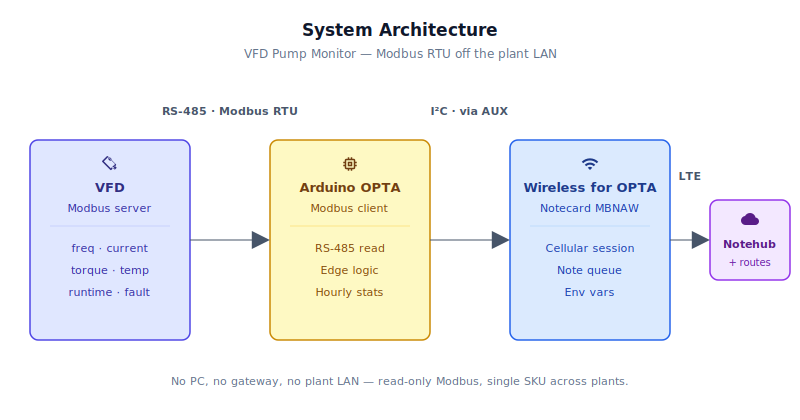
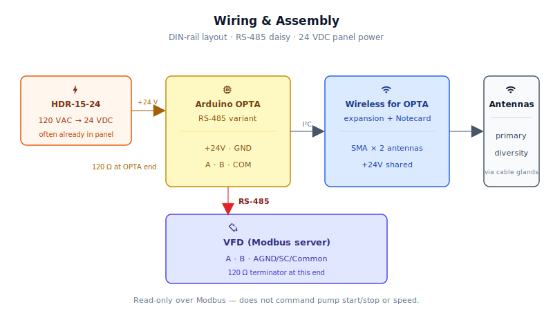
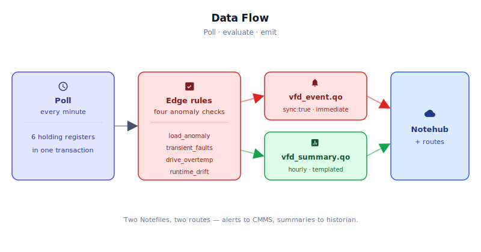

# VFD-Driven Pump Predictive Maintenance via Modbus

<Note>

This reference application is intended to provide inspiration and help you get started quickly. It uses specific hardware choices that may not match your own implementation. Focus on the sections most relevant to your use case. If you'd like to discuss your project and whether it's a good fit for Blues, [feel free to reach out](https://blues.com/landing-pages/accelerators-contact-us/?accelerator=VFD-Driven%20Pump%20Predictive%20Maintenance%20via%20Modbus).

</Note>

This project is a [downtime prevention](https://blues.com/downtime-prevention/) reference design that turns an industrial centrifugal pump into a predictively-maintained, remotely-monitored asset by reading what the pump's existing **VFD** (variable frequency drive) already knows about itself — over **Modbus RTU**, on a real industrial **PLC** (programmable logic controller), with a cellular [Notecard](https://shop.blues.com/products/notecard-cellular?utm_source=dev-blues&utm_medium=web&utm_campaign=store-link) for the uplink.

## 1. Project Overview

**The problem.** Industrial centrifugal pumps almost universally run behind a VFD. Modern drives from ABB, Yaskawa, Danfoss, and Schneider all expose the pump's operating telemetry through Modbus holding registers — motor current, output frequency, output torque, drive temperature, runtime hours, active fault code, and almost nobody reads them. The VFD is sitting in the cabinet doing the work; the data is right there. What's missing is the network path off the plant floor.

A failing pump rarely just stops. It signals first: motor current can shift at constant frequency as bearing drag, fouling, valve position, fluid viscosity, or impeller condition change the load on the drive. Transient electrical faults can cluster on a stressed contactor or in a cavitating hydraulic regime. Actual runtime can drift above expected duty cycle as a downstream valve fouls and the pump runs longer to do the same work. None of these telemetry shifts are *diagnostic* by themselves, but they are leading indicators a maintenance team would happily act on a week early. This project is the device that catches those anomalies and routes them out, before a tank runs dry on a Saturday night. See the [Signal limitations](#12-limitations-and-next-steps) Note for what this telemetry can and cannot conclude.

**Why Notecard.** Pump rooms sit on isolated **OT** (operational technology) networks where corporate WiFi is off-limits for instrumentation by plant policy, and retrofitting a separate OT-friendly access point per pump is unrealistic. Cellular removes the dependency on plant LAN credentials, VLAN provisioning, site WiFi, or a local gateway. (Some sites will still require OT/security review before *any* wireless instrumentation is allowed; the device just doesn't need access to the plant network itself.) The Notecard's prepaid global cellular service means the same firmware and architecture deploys across regions — choose the matching Wireless for OPTA cellular variant for the deployment geography. WiFi remains as an opportunistic fallback for the rare site that *can* offer a rooftop AP, without compromising the cellular-first model.

<NewToBlues/>

**Why OPTA.** This is exactly the sweet spot for Wireless for OPTA: a real industrial PLC reading a real industrial Modbus device, with no PC or gateway in the middle. The Arduino OPTA is DIN-rail-mounted, 12–24 VDC powered, and programmable with both Arduino sketches and IEC 61131-3 PLC languages, so it deploys exactly the same way across plants whose IT and OT teams will never agree on a network plan. Pairing it with Blues Wireless for OPTA adds cellular and WiFi to a device that already speaks the language of the plant.

**Deployment scenario.** A single OPTA + Wireless for OPTA mounted on the DIN rail next to the VFD inside the pump's electrical panel, RS-485 daisied to the drive's communication port, antenna routed out through a cable gland to a magnetic-mount whip on the cabinet roof. Line power from a 24 VDC panel supply that's already there. No PC, no gateway, no plant LAN involvement.

## 2. System Architecture



**Device-side responsibilities.** The OPTA's Cortex-M7 host acts as a Modbus RTU **client** (master), polling six holding registers from the VFD (the **server** / slave) once per minute over the onboard RS-485 transceiver. The host computes rolling hourly statistics (mean, peak, count) in RAM, evaluates four anomaly-detection rules locally, and decides whether to emit an event. Queued Notes travel from the host to the Notecard over I²C through Blues Wireless for OPTA's AUX connector — no modem AT commands, no session state machine, no raw socket management. The Notecard API is JSON over I²C and the `note-arduino` library's `JAdd*` helpers construct the requests; the win is that the host never touches the modem or the cellular session itself.

**Notecard responsibilities.** The Notecard stores [Notes](https://dev.blues.io/api-reference/glossary/#note) in its on-device queue, establishes the cellular (or WiFi) session on the configured [`hub.set`](https://dev.blues.io/api-reference/notecard-api/hub-requests/#hub-set) `outbound` cadence, and pushes any `sync:true` alert Notes immediately. The Notecard also handles [environment variable](https://dev.blues.io/guides-and-tutorials/notecard-guides/understanding-environment-variables/) distribution from Notehub — operators retune thresholds and Modbus register addresses without re-flashing firmware.

**Notehub responsibilities.** [Notehub](https://notehub.io) ingests events over the Internet, stores every event, and applies project-level [routes](https://dev.blues.io/notehub/notehub-walkthrough/#routing-data-with-notehub). Per-fleet [environment variables](https://dev.blues.io/guides-and-tutorials/notecard-guides/understanding-environment-variables/) are how a single firmware image services multiple plants whose VFDs are from different vendors and live at different register addresses. See [Smart Fleets](https://dev.blues.io/notehub/notehub-walkthrough/#using-smart-fleet-rules) for how to organize them.

**Routing to the cloud (high level).** Notehub supports HTTP, MQTT, AWS, Azure, GCP, Snowflake, and several other destinations; route setup is project-specific. See the [Notehub routing docs](https://dev.blues.io/notehub/notehub-walkthrough/#routing-data-with-notehub) — this project ships no specific downstream endpoint.

## 3. Technical Summary

**What you'll have when done:** An OPTA + Notecard assembly mounted in a pump panel, reading six telemetry registers from the VFD once per minute, reporting hourly summaries to [Notehub](https://notehub.io), and emitting immediate alerts when four anomaly rules trigger.

**Minimum steps** (60–90 minutes, assuming site access and a calibrated VFD):
1. Install Arduino core + libraries (`Arduino Mbed OS Opta Boards`, `note-arduino`, `ArduinoModbus`, `ArduinoRS485`) via Library Manager.
2. Set `PRODUCT_UID` in the firmware; compile and flash via `arduino-cli` (see [§8. Build and Flash](#8-build-and-flash) below).
3. On Notehub: create project, claim Notecard, create one fleet, set `modbus_slave_id` and `modbus_baud` to match your VFD's configuration.
4. Wire OPTA RS-485 to VFD Modbus port; confirm 120 Ω termination at each end of the bus.
5. Power up and monitor Notehub's In-Browser Terminal: `card.status` should report healthy; first `vfd_summary.qo` Note appears within ~60 s.

Here is a sample Note this device emits:

```json
{
  "f_hz_mean": 59.8, "f_hz_peak": 60.1,
  "i_a_mean": 12.4, "i_a_peak": 13.7,
  "trq_mean": 68, "trq_peak": 74,
  "drv_c_mean": 42, "drv_c_peak": 51,
  "run_min": 53, "stop_min": 7,
  "hrs_total": 18234,
  "fault_count_hour": 0,
  "last_fault": "0"
}
```

## 4. Hardware Requirements

| Part | Qty | Rationale |
|------|-----|-----------|
| [Arduino OPTA RS485](https://store.arduino.cc/products/opta-rs485) | 1 | Industrial PLC with onboard RS-485 transceiver, DIN-rail mount, 12–24 VDC supply. Programmable with Arduino sketches or IEC 61131-3 PLC languages. Hosts the Modbus client and edge logic. |
| [Blues Wireless for OPTA (NA, SKU 992-00155-C)](https://shop.blues.com/products/wireless-for-opta?utm_source=dev-blues&utm_medium=web&utm_campaign=store-link) | 1 | Snaps onto the OPTA's expansion port; adds a [Notecard Cell+WiFi (MBNAW)](https://dev.blues.io/datasheets/notecard-datasheet/note-wbnaw/) over I²C. Cellular coverage is regional — pick the matching SKU for the deployment geography (EMEA variant: [SKU 992-00156-C](https://shop.blues.com/products/wireless-for-opta?utm_source=dev-blues&utm_medium=web&utm_campaign=store-link)). The Notecard manages its own cellular session against supported carrier networks worldwide via its embedded global SIM. |
| External cellular antenna(s) w/ SMA, ~3m lead (e.g. [SparkFun CEL-16432](https://www.sparkfun.com/lte-hinged-external-antenna-698mhz-2-7ghz-sma-male.html)) | 1 required, 2 recommended | At minimum, route the **primary** cellular antenna outside any metal cabinet; rubber-duck antennas inside a steel panel will not work reliably. For best LTE Cat-1 performance also route the **diversity** antenna externally if the layout allows it. SMA bulkhead leads through cable glands keep the IP rating intact. |
| [Mojo](https://shop.blues.com/products/mojo?utm_source=dev-blues&utm_medium=web&utm_campaign=store-link) | 1 | Bench-only coulomb counter for validating the Wireless-for-OPTA + Notecard subsystem energy per session during commissioning. Not deployed to the field. |
| 24 VDC DIN-rail supply, ≥10W (e.g. [MeanWell HDR-15-24](https://www.meanwell.com/Upload/PDF/HDR-15/HDR-15-SPEC.PDF)) | 1 | Powers OPTA and expansion. Most pump panels already have one — only buy if needed. |
| 120 Ω termination resistor | 1–2 | RS-485 termination at each end of the bus. The OPTA's onboard transceiver does not include a permanent terminator. |
| Shielded twisted pair, 22 AWG, RS-485 rated, ~1m | 1 | A → A, B → B, shield → drive ground. Length depends on the panel layout. |
| DIN rail, ~10 cm | 1 | Mount for the OPTA + expansion. Likely already present in the panel. |

The Arduino OPTA WiFi variant works equally well if WiFi/BLE on the host MCU is desired; the firmware is unchanged. The OPTA Lite that ships in the standard Wireless for OPTA bundle has **no onboard RS-485** and is not suitable for this project.

The Blues hardware ships with an active SIM including 500 MB of data and 10 years of service — no activation fees, no monthly commitment.

## 5. Wiring and Assembly



<Warning>

**Safety.** VFD cabinets contain hazardous voltages even when control wiring is low-voltage. Installation must be performed by qualified personnel following site lockout/tagout procedures, the VFD manufacturer's instructions, and applicable electrical codes. This reference design is **read-only** over Modbus — it does not command pump start/stop or speed.

</Warning>

1. **Mount and power.** Snap the OPTA onto the DIN rail, snap the Blues Wireless for OPTA onto the OPTA's right-hand expansion port. Use the supplied solderless AUX connector between the two — the connector carries the I²C lines that the Notecard rides on. Wire 24 VDC from the panel supply to the OPTA's `+` and `-` terminals. Per the [Wireless for OPTA Quickstart](https://dev.blues.io/quickstart/wireless-for-opta-quickstart/), the OPTA's outputs are not powered by USB-C, so use the 12–24 VDC supply for any deployment beyond bench testing. Jumper the OPTA's `+24V` to the expansion's `+24V` terminal so the expansion shares the same supply.
2. **Antennas.** Thread an SMA-female bulkhead lead through a cable gland for the primary cellular antenna and screw it onto the first antenna port on Wireless for OPTA. If the layout allows, do the same for the diversity port — it improves LTE Cat-1 performance in marginal-signal sites. Don't rely on the bundled rubber-duck antennas inside a metal cabinet; they're for bench testing only.
3. **Modbus bus.** Wire the OPTA's RS-485 terminals to the VFD's communication port:
   - OPTA `A (+)` → VFD `A (+)`
   - OPTA `B (-)` → VFD `B (-)`
   - OPTA `COM` (RS-485 GND) → VFD communication ground (consult the drive's manual; ABB ACS580 calls it `AGND`, Yaskawa GA500 calls it `SC`, Danfoss FC-302 calls it `Common`).
   - Place a 120 Ω resistor across A/B at *each* end of the bus. With one OPTA and one drive, that means two terminators total (one at each device).
4. **Drive configuration.** Configure the VFD as a Modbus RTU **server** (slave); the OPTA acts as the Modbus **client** (master). Defaults the firmware ships with: slave ID `1`, baud rate `19200`, 8 data bits, no parity, 1 stop bit (`8N1`). Real drives vary — match baud, parity, stop bits, and slave address to whatever the VFD is configured for, and override the firmware's defaults via the `modbus_*` environment variables on Notehub. Common vendor parameter groups: ABB `5800–5805`, Yaskawa `H5-xx`, Danfoss `8-3x`, Schneider `Comm-1.x`.
5. **Bench validation.** During first-light testing, splice the Mojo inline between the 24 VDC supply and the Wireless-for-OPTA power input so it can measure the *expansion + Notecard subsystem* energy per session. The OPTA itself is line-powered and not the subject of measurement.

## 6. Notehub Setup

1. **Create a project.** Sign up at [Notehub](https://notehub.io) and create a project. Copy the [ProductUID](https://dev.blues.io/notehub/notehub-walkthrough/#finding-a-productuid) and paste it into `firmware/vfd_pump_monitor/vfd_pump_monitor.ino` as `PRODUCT_UID`.
2. **Claim the Notecard.** Power up the panel; on first cellular session the Notecard associates with your project automatically.
3. **Create a Fleet per plant.** [Fleets](https://dev.blues.io/guides-and-tutorials/fleet-admin-guide/) group devices for shared configuration and routing. The natural unit here is *one fleet per plant* — every pump in a plant typically has the same VFD vendor and the same register map, so fleet-level environment variables encode "this plant's pumps all run ABB drives at register 0x0103 for output frequency."
4. **Set environment variables.** In Notehub: Projects → your project → Fleets → your fleet → Environment. Defaults below are reasonable starting points; any value set in Notehub overrides the firmware default on the device's next inbound sync. The register-address variables let one firmware image work across all four common drive vendors without recompilation.

   | Variable | Default | Purpose |
   |---|---|---|
   | `sample_minutes` | `1` | Minutes between Modbus polls. |
   | `report_minutes` | `60` | Minutes between summary Notes (`vfd_summary.qo`). |
   | `modbus_slave_id` | `1` | Modbus server (slave) address of the drive. |
   | `modbus_baud` | `19200` | Bus baud rate; must match the VFD configuration. |
   | `modbus_parity` | `none` | Parity setting: `none`, `even`, or `odd`. Must match the VFD. |
   | `modbus_stop_bits` | `1` | Stop bits: `1` or `2`. Must match the VFD. |
   | `vfd_profile` | `demo_contiguous` | Placeholder identifying the register-map convention this firmware build targets. The shipped firmware only implements `demo_contiguous`. See [Limitations](#12-limitations-and-next-steps) for the production path. |
   | `reg_freq` | `259` | Holding-register address (wire-level, 0-based) for output frequency. Demo firmware assumes 0.01 Hz units. |
   | `reg_current` | `260` | Holding-register address for motor current. Demo firmware assumes 0.01 A units. |
   | `reg_torque` | `261` | Holding-register address for output torque. Demo firmware assumes % of nominal (signed 16-bit). |
   | `reg_drive_temp` | `262` | Holding-register address for drive heatsink temperature. Demo firmware assumes °C (signed 16-bit). |
   | `reg_runtime_hours` | `263` | Holding-register address for cumulative runtime hours. Demo firmware reads a single 16-bit register. |
   | `reg_fault_code` | `264` | Holding-register address for **active** fault code (0 = no fault). This is *not* a fault history log. See [Limitations](#12-limitations-and-next-steps). |
   | `current_alarm_factor` | `1.20` | Fires `load_anomaly` when hourly mean current exceeds the rolling baseline by this factor while running. |
   | `transient_fault_window_hours` | `4` | Window for transient-fault clustering. |
   | `transient_fault_count` | `3` | Distinct fault *transitions* within the window above which `transient_faults` fires. |
   | `drive_temp_alarm_c` | `75.0` | Drive heatsink °C above which `drive_overtemp` fires. |
   | `expected_run_hours_per_day` | `12.0` | Expected runtime per day; runtime drift > 25% above this fires `runtime_drift`. |

   > **VFD register-map gotchas.** The defaults above are illustrative only. Real VFDs differ on: 0-based vs 1-based addressing conventions (Modicon "40001" notation vs raw); per-register scaling (current may be 0.1 A, 0.01 A, or % of rated); signedness (torque and temperature are often signed); 32-bit values that span two registers (runtime hours often does, with vendor-specific word order); and active-fault-code vs fault-history-log distinction. The shipped firmware reads six contiguous 16-bit registers with hardcoded scaling — production deployments need a vendor-specific firmware build with proper handling.

5. **Configure routes.** Add one [route](https://dev.blues.io/notehub/notehub-walkthrough/#routing-data-with-notehub) for `vfd_event.qo` (alerts, low-volume, real-time delivery to a CMMS or on-call endpoint) and a second for `vfd_summary.qo` (long-term storage, batched delivery to an analytics/historian system). Splitting the two Notefiles at the source means each can be fanned out to a different destination at a different urgency without filter logic in the route.

## 7. Firmware Design

Single sketch: [`firmware/vfd_pump_monitor/vfd_pump_monitor.ino`](firmware/vfd_pump_monitor/vfd_pump_monitor.ino).

Dependencies:
- **Arduino Mbed OS Opta Boards** core (install via the Arduino IDE Boards Manager).
- [`Blues Wireless Notecard`](https://github.com/blues/note-arduino) (the `note-arduino` library). Install via the Arduino Library Manager or `arduino-cli lib install "Blues Wireless Notecard"`.
- [`ArduinoModbus`](https://github.com/arduino-libraries/ArduinoModbus) and [`ArduinoRS485`](https://github.com/arduino-libraries/ArduinoRS485) (official Arduino libraries, install via Library Manager).

### Modules

| Responsibility | Where |
|---|---|
| Notecard configuration (`hub.set`, templates) | `notecardConfigure`, `defineTemplates` |
| Environment-variable fetch + clamp | `fetchEnvOverrides` (`clampU32`, `clampF`) |
| Re-init bus / re-issue `hub.set` on env change | `applyModbusSerialIfChanged`, `applyHubSetIfChanged` |
| Modbus polling of six registers | `pollVfd`, `modbusReadOne` |
| Rolling hourly stats | `RollingStats` struct, `accumulate` |
| Edge logic (load anomaly, transient faults, runtime drift, drive overtemp) | `evaluateRules` (with frequency-binned baselines and edge-triggered alerts) |
| Outbound Note emission (summary + event) | `sendSummary`, `sendEvent` |
| Periodic cycle scheduler (no sleep, line-powered) | `loop()` |

### Sensor reading strategy

Six holding registers are pulled in a single Modbus transaction (`requestFrom` with `HOLDING_REGISTERS`, quantity 6, starting address taken from `reg_freq`). Reading all six in one transaction is roughly 8× cheaper in time and bus utilization than six individual reads. The firmware assumes the six registers are contiguous; on drives where they aren't, override `reg_*` variables individually and the firmware falls back to per-register reads.

Polling cadence is `sample_minutes` (default 1 minutes). For each sample, `accumulate` updates the rolling hourly windows for current, frequency, torque, and drive temperature — separately tracking samples taken while the pump is *running* (frequency > 1 Hz) versus *stopped*, since a hot drive at 0 Hz is a different signal than a hot drive under load.

### Event payload design

Two [template-backed](https://dev.blues.io/notecard/notecard-walkthrough/low-bandwidth-design#working-with-note-templates) Notefiles. Templates give summary and alert records a stable schema, store as fixed-length records on the Notecard rather than free-form JSON, and minimize on-wire payload size — material at 24 summary Notes per day per pump over a multi-year deployment. Actual cellular data usage depends on sync cadence, signal conditions, routing behavior, and event frequency, so production deployments should validate usage with [Notehub usage data](https://dev.blues.io/notehub/notehub-walkthrough/#configuring-your-billing-account) before sizing SIM data plans.

`vfd_summary.qo` (hourly):

```json
{
  "file": "vfd_summary.qo",
  "body": {
    "f_hz_mean": 59.8, "f_hz_peak": 60.1,
    "i_a_mean": 12.4, "i_a_peak": 13.7,
    "trq_mean": 68, "trq_peak": 74,
    "drv_c_mean": 42, "drv_c_peak": 51,
    "run_min": 53, "stop_min": 7,
    "hrs_total": 18234,
    "fault_count_hour": 0,
    "last_fault": "0"
  }
}
```

`vfd_event.qo` (immediate, `sync:true`):

```json
{
  "file": "vfd_event.qo",
  "body": {
    "alert": "load_anomaly",
    "f_hz": 0,
    "i_a": 0,
    "v1": 59.8,
    "v2": 14.9,
    "v3": 12.3,
    "fault_code": 0,
    "hrs_total": 18234
  }
}
```

The event template carries seven fixed fields. `f_hz` and `i_a` are populated when the alert is *triggered by a specific sample* (e.g. a Modbus failure event captures the last-known sample state); when the alert is the result of an hourly aggregate they're zero and the relevant aggregates land in three generic numeric slots `v1` / `v2` / `v3` whose meaning depends on the alert type:

| Alert | `v1` | `v2` | `v3` |
|---|---|---|---|
| `load_anomaly` | hourly mean frequency | hourly mean current | bin baseline current |
| `transient_faults` | distinct fault transitions in window | window hours | unused (0) |
| `drive_overtemp` | hourly peak heatsink °C | hourly mean heatsink °C | unused (0) |
| `runtime_drift` | observed daily runtime hours | expected daily runtime hours | unused (0) |
| `modbus_unreachable` | unused (0) | unused (0) | unused (0) |

Production builds may rename the firmware fields to alert-specific names (e.g. `i_a_mean`, `i_a_baseline`) at the cost of a per-alert template — the `v1`/`v2`/`v3` shape keeps a single shared template for all alert types and matches what the demo firmware emits.

### Power and sync strategy

The OPTA + expansion is line-powered (24 VDC), so MCU sleep is not the goal — bus and bandwidth efficiency is. The Notecard runs in [`hub.set`](https://dev.blues.io/api-reference/notecard-api/hub-requests/#hub-set) `periodic` mode with `outbound:60` and `inbound:120` (minutes). Summary Notes accumulate in the on-device queue and ship in a single session every hour; alert Notes set `sync:true` and ship within a session-establishment window of the trigger (~15–60 seconds typical).

### Retry and error handling

- The first `hub.set` uses `notecard.sendRequestWithRetry()` with a 5-second window — there is a known cold-boot race condition where the host comes up before the Notecard is ready to receive I²C transactions.
- Modbus reads are retried up to 3× per cycle on `lastError() != 0`. If all three fail, the firmware skips that sample (no NaN ever appears in any payload, JSON has no valid `NaN` literal and templated Notes validate field types) and emits a separate `modbus_unreachable` event Note. The event is rate-limited to once per hour to avoid alarm fatigue when the drive itself is powered off for service.
- Notecard requests use `notecard.requestAndResponse()` and check both `NULL` return and the `err` field on the response object before trusting the data.

### Key code snippets

Configuring the Notecard for periodic sync, with templates for both Notefiles, runs once at boot:

```cpp
J *req = notecard.newRequest("hub.set");
JAddStringToObject(req, "product", PRODUCT_UID);
JAddStringToObject(req, "mode", "periodic");
JAddNumberToObject(req, "outbound", 60);
JAddNumberToObject(req, "inbound", 120);
notecard.sendRequestWithRetry(req, 5);
```

Polling the VFD and accumulating hourly stats — one Modbus transaction reads all six contiguous holding registers:

```cpp
if (!ModbusRTUClient.requestFrom(slaveId, HOLDING_REGISTERS, regBase, 6)) {
  return false; // caller handles retry / error event
}
sample.frequency_hz   = ModbusRTUClient.read() / 100.0f;
sample.current_a      = ModbusRTUClient.read() / 100.0f;
sample.torque_pct     = (int16_t)ModbusRTUClient.read();
sample.drive_temp_c   = (int16_t)ModbusRTUClient.read();
sample.runtime_hours  = ModbusRTUClient.read();
sample.fault_code     = ModbusRTUClient.read();
```

The load-anomaly rule — rising current at *comparable* output frequency is one of the observables maintenance techs look for. The firmware buckets samples into 5 Hz frequency bins and tracks an EWMA-smoothed baseline current per bin, so 30 Hz operation isn't compared against a 60 Hz baseline. The alert is edge-triggered (fires once on the rising edge, rearms when the bin's mean returns below threshold):

```cpp
const uint8_t bin = freqBin(f_hz_mean);
const float baseline = g_current_baseline_by_bin[bin];

if (g_baseline_seeded[bin] &&
    i_a_mean > baseline * g_current_alarm_factor &&
    !g_active_load_anomaly) {
    sendEvent("load_anomaly", nullptr, f_hz_mean, i_a_mean, baseline);
    g_active_load_anomaly = true;
}
```

## 8. Build and Flash

**Prerequisites:** Arduino IDE (or `arduino-cli` on the command line) with the following installed via Boards Manager and Library Manager:
- Boards: `Arduino Mbed OS Opta Boards`
- Libraries: `Blues Wireless Notecard`, `ArduinoModbus`, `ArduinoRS485`

**Steps:**

1. Clone or download the repo and open `firmware/vfd_pump_monitor/vfd_pump_monitor.ino` in the Arduino IDE.

2. Replace the placeholder `PRODUCT_UID` at the top of the sketch with your Notehub ProductUID:
   ```cpp
   #define PRODUCT_UID  "prod.your-notehub-project-id"
   ```
   (Find it in Notehub: Dashboard → Project Settings → ProductUID, or see [Finding a ProductUID](https://dev.blues.io/notehub/notehub-walkthrough/#finding-a-productuid).)

3. **Via Arduino IDE:** Select Tools → Board → `Arduino Opta RS485` (or WiFi), select the correct COM/tty port, then Sketch → Upload.

4. **Via command line (arduino-cli):**
   ```bash
   arduino-cli compile --fqbn arduino:mbed_opta:opta_rs485 firmware/vfd_pump_monitor/
   arduino-cli upload -p /dev/ttyACM0 --fqbn arduino:mbed_opta:opta_rs485 firmware/vfd_pump_monitor/
   ```
   (Replace `/dev/ttyACM0` with your OPTA's serial port; on macOS it may be `/dev/cu.usbmodem*` or similar.)

5. Open the Arduino IDE Serial Monitor (115200 baud) to verify the sketch boots and reports "Notecard configuration complete."

## 9. Data Flow



**Collected.** Every `sample_minutes`: output frequency, motor current, output torque, drive heatsink temperature, cumulative runtime hours, **active** fault code (not the fault history log, the live fault register only).

**Summarized.** Every `report_minutes` (default hourly): mean and peak of each scalar, separate run/stop minute counts, total runtime hours, count of distinct fault *transitions* observed in the hour, and the last non-zero fault code seen.

**Transmitted.**
- `vfd_summary.qo` — once per `report_minutes` (default 24 Notes per day), queued and shipped by the Notecard's hourly outbound sync.
- `vfd_event.qo` — immediately on rule trigger, with `sync:true` to bypass the outbound interval.

**Routed.** Notehub fans `vfd_event.qo` out to whatever real-time channel the operator uses (CMMS ticket creation, on-call paging, Slack, etc.) and `vfd_summary.qo` to a long-term store for trend analysis.

**Triggers.** Four rules fire alerts:
- `load_anomaly` — hourly mean current exceeds the rolling baseline by `current_alarm_factor` while running. *Many* root causes can drive this (bearing drag, fouling, valve position, viscosity, debris, some impeller conditions); the alert flags an anomaly worth investigating, not a specific failure mode.
- `transient_faults` — `transient_fault_count` or more distinct fault *transitions* (count of `0 → nonzero` or `code-changed` events, not count of samples while a fault is asserted) within `transient_fault_window_hours`.
- `runtime_drift` — observed daily runtime exceeds `expected_run_hours_per_day` by more than 25%.
- `drive_overtemp` — heatsink temperature exceeds `drive_temp_alarm_c`.

## 10. Validation and Testing

Expected steady-state behavior on a healthy pump: one summary Note per hour and zero event Notes. The Notecard's [`card.status`](https://dev.blues.io/api-reference/notecard-api/card-requests/#card-status) and [`hub.status`](https://dev.blues.io/api-reference/notecard-api/hub-requests/#hub-status) requests are useful smoke tests during commissioning — both can be issued from the blues.dev In-Browser Terminal.

**Modbus first-light.** Before connecting to the real drive, run the firmware against a [USB-to-RS-485 adapter](https://www.sparkfun.com/products/9822) and a software Modbus simulator (Modbus Mechanic, ModRSsim2, or equivalent) wired to the OPTA's RS-485 terminals. Verify the six register reads match what the simulator is publishing.

**Power validation with Mojo.** The Notecard's published current envelope (from the [Notecard low-power-design docs](https://dev.blues.io/notecard/notecard-walkthrough/low-power-firmware-design/) and the [NOTE-WBNAW datasheet](https://dev.blues.io/datasheets/notecard-datasheet/note-wbnaw/)):

| Phase | Expected current |
|---|---|
| Notecard idle (radio off, between syncs) | ~8–18 µA @ 5V |
| Modem active (cellular session) | ~250 mA average, with ≤2 A bursts during GSM transmit |
| WiFi active (when WiFi fallback engaged) | ~80 mA average |

Splice the [Mojo](https://shop.blues.com/products/mojo?utm_source=dev-blues&utm_medium=web&utm_campaign=store-link) inline on the Wireless-for-OPTA power input and confirm: (a) idle current is in the published µA range between syncs, (b) per-session energy lands in the few-mAh range for an hourly outbound sync, and (c) total energy per day is consistent across runs. Note that this measurement is the **whole expansion subsystem** — Notecard plus the expansion's onboard regulators and I²C glue, not the Notecard alone, unless you physically isolate the Notecard's `VMODEM_P` rail. Also Note that the Notecard's lowest-power state requires `VUSB` not present and `AUX_EN` not held high; see the [Notecard low-power-design docs](https://dev.blues.io/notecard/notecard-walkthrough/low-power-firmware-design/) for the gating conditions.

**Fault simulation.** Easiest path: drop `current_alarm_factor` to 1.0 in the Fleet's environment variables — the next `inbound` sync will pull the new value, the next hourly summary will trip `load_anomaly`, and the event will land in Notehub within a session-establishment window.

## 11. Troubleshooting

**Notecard not claiming to the project.**
- Verify `PRODUCT_UID` in the sketch exactly matches the ProductUID on Notehub (Projects → Project Settings).
- Confirm cellular signal: in Notehub's In-Browser Terminal, run `card.status` and check the `"signal"` field. Minimum -100 dBm for LTE Cat-1.
- If deploying indoors or in a metal cabinet without an external antenna, the bundled rubber-duck antenna will not work — thread the external SMA antenna through a cable gland and screw it to the primary antenna port.

**Modbus reads failing (firmware logs "Modbus error" or no data in summary Notes).**
- Confirm RS-485 A/B/COM wiring is correct. A and B are easy to swap; the drive will not respond if they're reversed.
- Verify 120 Ω termination resistor is present at **both ends** of the bus. With one OPTA and one drive, that means two resistors total (one at the OPTA, one at the drive).
- Check slave ID and baud rate: in Notehub's Fleet Environment, confirm `modbus_slave_id` and `modbus_baud` match the VFD's configuration. Run `card.status` in the terminal after setting the environment variables — it shows inbound sync time and confirms the device pulled the new values.
- Before connecting to the real drive, test with a [USB-to-RS-485 adapter](https://www.sparkfun.com/products/9822) and a software Modbus simulator (Modbus Mechanic, ModRSsim2) wired to the OPTA's RS-485 terminals. Verify the firmware reads all six registers correctly.

**First event not appearing in Notehub after 60+ seconds.**
- Check Notehub's Events tab; all Notes (summary and alert) appear there. If empty, the firmware has not yet established a cellular session — wait for the first outbound sync (default 60 minutes) or power-cycle the OPTA to force a session sooner.
- Confirm the Notecard has cellular coverage (see above: `card.status` signal field).
- If you need an alert to appear immediately for testing, drop `current_alarm_factor` to 1.0 in the Fleet Environment — the next hourly summary will trigger `load_anomaly`. The alert event will post within a session-establishment window (typically 15–60 seconds after the inbound sync pulls the new threshold).

**Environment variables not taking effect.**
- Environment variables are fetched at the inbound sync interval (default 120 minutes). To force an immediate fetch, power-cycle the OPTA or reduce `inbound` in Notehub to 1 minute for commissioning.
- Confirm the variables are set in the correct Fleet, not the project level. In Notehub: Projects → Project Name → Fleets → Fleet Name → Environment.

**Antenna placement considerations.**
- Rubber-duck antennas supplied with the Wireless for OPTA are for bench testing only. In a metal pump cabinet, they will not maintain reliable LTE Cat-1 coverage.
- Route the primary antenna outside the cabinet through a cable gland. If the layout allows, also route the diversity antenna (second SMA port) for improved performance in marginal-signal areas.
- Keep the primary antenna at least 2 m away from high-power electrical equipment (motor starters, VFDs) to reduce RF interference.

## 12. Limitations and Next Steps

**Signal limitations.** VFD telemetry is valuable but it is not equivalent to full pump instrumentation. Current, torque, speed, temperature, and active fault codes can identify abnormal *patterns*, but they cannot conclusively distinguish between worn impeller, clogged suction strainer, closed discharge valve, cavitation, bearing drag, increased fluid viscosity, debris, or process changes — without supporting context such as suction/discharge pressure, flow, vibration, or known duty cycle. Treat every alert this firmware emits as an *early maintenance indicator*, not a diagnosis.

**Simplified for this reference design:**

- **Vendor-specific register addresses, scaling, signedness, word counts.** Defaults are illustrative for a fictional contiguous map. Each VFD vendor publishes its own Modbus map; commissioning a real plant means looking up the actual addresses, scaling factors (e.g. current may be 0.1 A, 0.01 A, or % of rated), signedness (torque/temperature often signed), word counts (runtime hours often a 32-bit value across two registers with vendor-specific word order), and addressing convention (0-based wire-level vs 1-based / Modicon "40001" notation). The shipped firmware reads six contiguous 16-bit registers with hardcoded scaling — production builds need vendor-specific firmware (one build per `vfd_profile`).
- **Active fault code only, not fault history log.** The firmware reads the active-fault register once per cycle. A vendor-specific fault-log readout (typically a multi-register block with circular-buffer semantics) is a future enhancement.
- **Single drive per OPTA.** The firmware reads one slave ID. A pump room with N drives needs either N OPTAs, or firmware extension to round-robin across slave IDs on the same RS-485 bus.
- **Heuristic thresholds.** Four threshold-based rules catch common load-anomaly, transient-fault, runtime-drift, and overtemp patterns. They will *not* catch every failure mode, and they will sometimes fire on benign conditions (e.g. a seasonally hotter ambient, a deliberate process change). Production deployments should commission thresholds per pump after a baseline period.
- **No Modbus writes.** The firmware reads only. Writing setpoints to the drive (start/stop, speed reference, etc.) is intentionally out of scope — that's a different safety conversation involving E-stop wiring, lockout/tagout, and functional safety certification.
- **No host firmware updates wired up.** [Notecard Outboard Firmware Update](https://dev.blues.io/notehub/host-firmware-updates/notecard-outboard-firmware-update/) is supported on STM32H7 (the OPTA's MCU family) but requires AUX wiring that Blues Wireless for OPTA does not currently break out. For now, host firmware updates are local-only via USB-C.

**Production next steps:**
- Vendor-specific `vfd_profile` builds: ABB ACS580, Yaskawa GA500, Danfoss FC-302, Schneider ATV — each with the correct register addresses, scaling, signedness, and word handling baked in.
- Per-pump baseline learning — store rolling 30-day current-vs-frequency tables in flash and trigger `load_anomaly` against the *learned* curve, not a static factor.
- Fault history log readout (vendor-specific, typically multi-register with timestamp).
- Multi-drive support via round-robin polling and per-slave-ID summaries.
- Add a `vfd_command.qi` inbound Notefile for service-tech-initiated diagnostic dumps.
- Wire ODFU to the OPTA's BOOT/RESET pins for over-the-air host updates.

## 13. Summary

This project pairs a real industrial PLC with a cellular Notecard to do exactly what every modern VFD has been quietly inviting for a decade — *expose what it already knows, on demand, off the plant LAN entirely*. Six Modbus holding registers, one cellular session per hour, and four anomaly-detection rules turn a pump from a black box into a continuously-monitored asset whose abnormal operating patterns show up in a CMMS ticket before they show up in a tank that's run dry. The cellular Notecard removes the plant-LAN argument, the OPTA removes the gateway-PC argument, and the prepaid SIM removes the per-site recurring-cost argument. What's left is a device a plant electrician can install on a DIN rail in fifteen minutes, with no dependency on plant network credentials and no special tooling.
