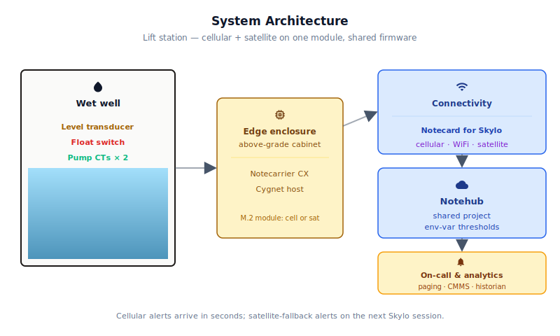
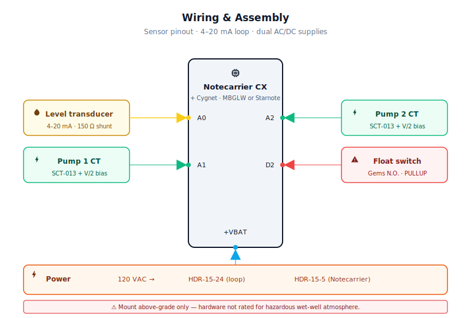
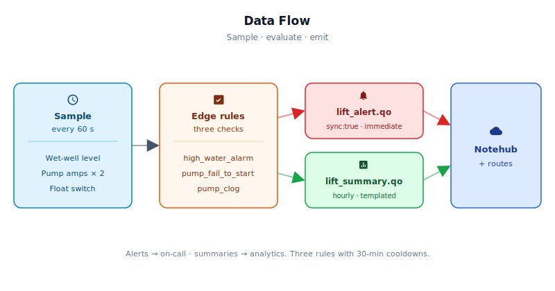

# Municipal Wastewater Lift Station Monitor

<Note>

This reference application is intended to provide inspiration and help you get started quickly. It uses specific hardware choices that may not match your own implementation. Focus on the sections most relevant to your use case. If you'd like to discuss your project and whether it's a good fit for Blues, [feel free to reach out](https://blues.com/landing-pages/accelerators-contact-us/?accelerator=Municipal%20Wastewater%20Lift%20Station%20Monitor).

</Note>

This project is a [downtime prevention](https://blues.com/downtime-prevention/) retrofit for municipal wastewater lift stations that catches pump failures, discharge obstructions, and high-water conditions before they become a sanitary overflow. A handful of sensors and a cellular (or, for stations beyond reliable carrier coverage, satellite) [Notecard](https://shop.blues.com/products/notecard-cellular?utm_source=dev-blues&utm_medium=web&utm_campaign=store-link) transform a sealed concrete vault into a remotely-monitored station that delivers alerts to the on-call crew within minutes, not hours after a manual site visit.

## 1. Project Overview

**The problem.** A **lift station** (also called a pump station) is a below-grade concrete vault or roadside cabinet that collects raw sewage from the surrounding gravity sewer system and pumps it uphill toward the treatment plant. Every municipality has dozens of them, often scattered across low-lying neighborhoods, industrial zones, and rural road shoulders — most with no onsite staff and no way to know what's happening inside until a citizen calls to report a smell or, worse, a spill.

When a lift station fails, the **wet well** — the collection basin that feeds the pumps — fills up and overflows. The result is a **SSO**: a sanitary sewer overflow. SSOs draw immediate regulatory attention; they trigger EPA reporting obligations, risk consent decree violations, and require expensive emergency cleanups. A station that fails on a Friday evening and isn't discovered until Monday morning is a public health event, a PR crisis, and a significant unplanned expense all at once. The failure modes are rarely dramatic: a pump fails to start because its float control sticks, a discharge check valve fails and allows backflow that clogged the impeller, or a wet-well float switch trips but no one receives the alarm because the SCADA dial-up modem lost its phone line. Each of these is detectable minutes after it starts — if someone is watching.

This project is that watcher. It straps to the inside of the station, samples the wet-well level every 60 seconds, measures current draw on each pump, and monitors the high-water float switch — four sensing points across three sensor types. Onboard edge logic on the Cygnet host MCU evaluates three fault rules every 60 seconds and routes alerts to Notehub via cellular the instant any rule trips. The on-call crew gets paged before the wet well overflows, not after.

**Why Notecard.** The wireless-first architecture here isn't a convenience — it's a necessity. Lift stations sit in concrete vaults underground, often with no AC power outlet in the vault itself (power runs to the pump control panel, not a wall socket). They're geographically distributed across a municipality in a pattern that matches the sewer network, not the municipal network — there's no fiber running to a roadside pump cabinet, and there's no corporate WiFi AP that can reach through a concrete lid to a sensor inside. Utility supervisors would need to deploy and maintain a WiFi access point at every single station to achieve what one Notecard SIM covers automatically. The NOTE-MBGLW's cellular radio reaches the vast majority of municipal infrastructure without site-specific network provisioning, login credentials, firewall rules, or per-site IT overhead. WiFi is available as an opportunistic fallback for the rare station adjacent to an accessible AP. Stations at the fringe of the service territory — beyond the reach of any cellular carrier — use a Starnote instead: the same M.2 form factor, the same Notecard API, the same firmware, but with a satellite link over the [Skylo](https://www.skylo.tech/resources/geographical-coverage) network rather than a terrestrial cell tower. The same firmware image deploys across the entire fleet; the connectivity module is the only variable.

<NewToBlues/>

**Deployment scenario.** A sealed NEMA 4X enclosure mounted **inside the lift station's above-grade control cabinet**, powered from the 120 VAC control circuit that already powers the pump starters. The specified Blues hardware and NEMA 4X ABS enclosure are **not** rated for hazardous (classified) locations. Wet wells and sealed vaults can accumulate methane and hydrogen sulfide — both potentially classified atmospheres under NFPA 820 / NEC Article 820. Do not install this hardware inside the wet well or any classified-atmosphere zone. If your jurisdiction classifies the vault interior as a hazardous location, any hardware in that zone must be rated for the classification; consult a licensed electrical engineer before proceeding. Sensor cables enter through conduit fittings: one multiconductor cable to the submersible level transducer in the wet well, two split-core CT jaws clamped around the pump motor supply conductors inside the control panel, and one float switch cable to a new dedicated high-water alarm float switch hung in the wet well alongside the station's existing level floats. No station modification is required beyond adding three sensor connections to the existing control wiring. Cellular antenna cable exits through a conduit fitting to a magnetic-mount or direct-mount antenna on the cabinet exterior or above-grade access point.

## 2. System Architecture



**Device-side responsibilities.** The onboard Cygnet STM32L433 host on the Notecarrier CX wakes every 60 seconds via [`card.attn`](https://dev.blues.io/api-reference/notecard-api/card-requests/#card-attn), reads three sensor types across four inputs (level, CT1, CT2, and float switch), evaluates the three fault-detection rules locally, and queues or immediately syncs the result. The Cygnet communicates with the Notecard over I²C — no AT commands, no modem state machine, no serial buffers. Application state (the previous sample's level reading, alert cooldowns, summary accumulators) is persisted into the Notecard's flash across sleep cycles using `NotePayloadSaveAndSleep` / `NotePayloadRetrieveAfterSleep`, so a 60-second host MCU restart doesn't lose any accumulated data.

**Notecard responsibilities.** The Notecard (MBGLW for cellular sites, Starnote for satellite sites) stores [Notes](https://dev.blues.io/api-reference/glossary/#note) locally in its on-device queue, manages the outbound session on the configured [`hub.set`](https://dev.blues.io/api-reference/notecard-api/hub-requests/#hub-set) `outbound` cadence (default 60 minutes), and prioritizes any `sync:true` alert Note for the next available session — bypassing the outbound timer. For the cellular variant, a session opens within roughly 15–60 seconds of the host queuing a `sync:true` Note. For the satellite variant, acquiring a Skylo satellite and completing transmission can take several minutes; `sync:true` ensures the Note is first in queue when a pass becomes available, but does not guarantee sub-minute delivery. The Notecard also manages [environment-variable](https://dev.blues.io/guides-and-tutorials/notecard-guides/understanding-environment-variables/) distribution from Notehub, so operators can retune detection thresholds (level setpoints, current thresholds, rising-rate sensitivity) without touching the firmware — the same mechanism works for both connectivity variants.

**Notehub responsibilities.** The Notecard manages its own cellular session against the supported carrier networks worldwide via its embedded global SIM and delivers data to [Notehub](https://notehub.io) over the Internet; Notehub ingests events, timestamps and stores every event, and applies project-level [routes](https://dev.blues.io/notehub/notehub-walkthrough/#routing-data-with-notehub). Alerts and summaries land in separate [Notefiles](https://dev.blues.io/api-reference/glossary/#notefile) so they can be routed independently — alerts to an on-call notification service, summaries to a long-term analytics store. [Smart Fleets](https://dev.blues.io/notehub/notehub-walkthrough/#using-smart-fleet-rules) can group stations by service zone or pump type, enabling fleet-level threshold tuning while preserving per-station override capability.

**Routing to the cloud (high level).** Notehub supports HTTP, MQTT, AWS, Azure, GCP, Snowflake, and a wide range of other destinations; route setup is project-specific and not implemented here. See the [Notehub routing docs](https://dev.blues.io/notehub/notehub-walkthrough/#routing-data-with-notehub) for configuration guidance.

### Satellite-specific considerations (Option B, Starnote)

The Starnote uses the same Notecard API as the MBGLW, but the satellite link has operational characteristics that must be planned for, not assumed away:

**Alert latency.** `sync:true` Notes are prioritized for the next available satellite pass, but locating a Skylo satellite and completing transmission can take several minutes. For Starnote stations, "alert in minutes" is realistic; "alert in seconds" is not. The 30-minute alert cooldown in the firmware is still meaningful because a satellite station is reporting a fault to the crew before the wet well overflows, not instantaneously.

**Inbound sync cadence and data cost.** Each inbound sync (used to pull updated environment variables from Notehub) consumes approximately 50 bytes of satellite data. At the default `inbound:120` (every 2 hours), that is ~600 bytes per day — a significant fraction of the bundled 10 KB. For Starnote deployments, set `inbound_interval_min` to `240` or higher via the Notehub environment-variable panel to reduce inbound satellite data consumption. The firmware re-issues `hub.set` whenever `inbound_interval_min` or `summary_interval_min` changes, so neither adjustment requires a firmware reflash (see the env-var table in [Section 5](#6-notehub-setup)).

**Payload discipline.** Starnote for Skylo enforces a hard 256-byte maximum per Note; Notes exceeding this limit are silently dropped by the satellite network. The [`note.template`](https://dev.blues.io/api-reference/notecard-api/note-requests/#note-template) encoding used by this firmware (with `format:"compact"` and a numeric `port`) keeps both `lift_alert.qo` and `lift_summary.qo` well within that ceiling. Do not add free-form string fields to satellite Notefiles, and validate payload size on any schema change.

**Antenna placement.** The Starnote for Skylo must operate with its antenna outdoors and free from obstructions — for the northern hemisphere, an unobstructed view of the southern sky. A station where the enclosure is entirely below grade or inside a steel cabinet will require an above-grade antenna cable run; plan that conduit path at installation time. Use only the Skylo-certified antenna supplied with the Starnote; substituting an uncertified GPS/GNSS patch risks regulatory non-compliance and link failure.

**Power envelope.** The Starnote idles at typically less than 4 µA @ 5 V — lower than the MBGLW's ~18 µA. During a satellite session, VMODEM_P requires a sustained 350 mA supply capability, similar in magnitude to an LTE session. The HDR-15-5 (3 A rated) handles both variants with margin. See the [Validation section](#9-validation-and-testing) for a per-state current breakdown.

**Mandatory initial cellular sync.** Before any satellite (NTN) operation is possible, the Starnote must complete at least one non-NTN sync with Notehub over cellular or WiFi to associate with a project. Ensure the unit has cellular coverage during initial commissioning, even if the deployment site relies on satellite for routine operation.

## 3. Technical Summary

**What you'll have:** A [Notecarrier CX](https://shop.blues.com/products/notecarrier-cx?utm_source=dev-blues&utm_medium=web&utm_campaign=store-link) + Notecard sending sample lift_alert and lift_summary events to your Notehub project every 60 seconds without needing sensors in the field.

1. **Create a Notehub project** at [notehub.io](https://notehub.io) and copy its ProductUID.
2. **Flash the firmware:**
   ```bash
   arduino-cli board install stm32duino:STM32:1.11.0
   arduino-cli lib install "Blues Wireless Notecard"
   cd firmware/lift_station_monitor
   arduino-cli compile --fqbn stm32duino:STM32:Notecarrier_CX \
     --build-property "compiler.cpp.extra_flags=-DPRODUCT_UID=\"com.example:demo\"" \
     -u -p /dev/ttyACM0
   ```
   (Replace `/dev/ttyACM0` with your Notecarrier serial port; on macOS use `/dev/tty.usbmodem*`; on Windows use `COM*`.)
3. **Open serial monitor** at 115200 baud; verify logs show "Notecard configured," `hub.set` requests, and `note.add` calls.
4. **Check Notehub Devices** — your Notecard appears within 60 seconds. Click it to see `lift_alert.qo` and `lift_summary.qo` events in the Events panel.
5. **Tune thresholds** — in the Fleet panel, set environment variables (e.g., `high_level_pct: 50.0`) and watch the serial log show the updated values on the next wake.

For bench-only testing, use compile-time flags to inject synthetic sensor values (see "Bench fault simulation" below in Section 8).

Two connectivity SKUs cover the full deployment spectrum. Stations within LTE coverage use a **Notecard Cell+WiFi (MBGLW)**. Truly rural stations beyond reliable cellular reach use a **[Starnote](https://shop.blues.com/products/starnote?utm_source=dev-blues&utm_medium=web&utm_campaign=store-link)** ([datasheet](https://dev.blues.io/datasheets/starnote-datasheet/starnote-for-skylo/)), which routes telemetry over the Skylo satellite network. The firmware is identical for both variants; Notehub configuration is shared, though satellite deployments benefit from wider inbound sync intervals to conserve bundled satellite data. See [Satellite-specific considerations](#satellite-specific-considerations-option-b-starnote) in Section 2.

Here is a sample Note this device emits:

```json
{
  "file": "lift_alert.qo",
  "body": {
    "alert": "pump_fail_to_start",
    "level_pct": 87.4,
    "pump1_amps": 0.2,
    "pump2_amps": 0.1,
    "float_sw": false
  },
  "sync": true
}
```

## 4. Hardware Requirements

| Part | Qty | Rationale |
|------|-----|-----------|
| [Notecarrier CX](https://shop.blues.com/products/notecarrier-cx?utm_source=dev-blues&utm_medium=web&utm_campaign=store-link) | 1 | Integrated carrier with an embedded Cygnet STM32L433 host — no separate MCU needed for this analog + digital sensor mix. |
| **Option A — cellular sites:** [Notecard Cell+WiFi (MBGLW)](https://shop.blues.com/products/notecard-cell-wifi?utm_source=dev-blues&utm_medium=web&utm_campaign=store-link) ([datasheet](https://dev.blues.io/datasheets/notecard-datasheet/note-mbglw/)) | 1 | LTE Cat-1 bis cellular (Quectel EG916Q-GL modem) removes per-site network provisioning; prepaid SIM covers all stations from one SKU. Onboard PCB antenna handles WiFi; cellular requires the external LTE antenna below. Use this SKU for stations within LTE coverage — the majority of municipal infrastructure. |
| **Option B — satellite/rural sites:** [Starnote](https://dev.blues.io/datasheets/starnote-datasheet/starnote-for-skylo/) | 1 | Same M.2 form factor and Notecard API as Option A; routes telemetry over the Skylo satellite network instead of a terrestrial cell tower. Use this SKU for stations beyond reliable LTE coverage. Requires the satellite patch antenna below (replace the LTE antenna and pigtail with the satellite items). Satellite link is lower-bandwidth and higher-latency than LTE; alert and summary Notes queue in the Notecard's local store and sync on the Starnote's satellite session cadence. |
| [Blues Mojo](https://shop.blues.com/products/mojo?utm_source=dev-blues&utm_medium=web&utm_campaign=store-link) | 1 | Coulomb-counter on the power rail for bench-validation of the sleep/wake/transmit energy profile. Not deployed to the field. |
| [WIKA LH-10](https://www.wika.com/en-us/lh_10.WIKA), 0–15 PSI gauge, 4–20 mA 2-wire, 316L SS, IP68, with vented cable | 1 | Submersible hydrostatic level transmitter purpose-built for water/wastewater wet-well immersion (the WIKA S-10 is a general-purpose / sanitary transmitter; the LH-10 is the family member rated for permanent submersion in raw sewage). The vented polyurethane cable (an internal vent tube equalizes the sensor's reference side to atmosphere, making the measurement gauge pressure = water head) doubles as the support tether — secured with a stainless cable grip at the cover plate. 316L SS wetted parts tolerate raw sewage. 15 PSI range covers ≈ 10 m of wet-well head. 4–20 mA 2-wire loop-powered output; wiring is identical to any other loop-powered transmitter. Specify "vented cable" and M20×1.5 or ½ NPT conduit seal fitting when ordering. Available from WIKA, instrumart.com, and major industrial distributors. |
| 150 Ω, 1% resistor (level sensor shunt) | 1 | Converts 4–20 mA loop current to 0.6–3.0 V for the 3.3 V STM32 ADC (full-scale within VREF). |
| [SCT-013-030 split-core CT, 30 A / 1 V RMS](https://www.sparkfun.com/products/11005) (SparkFun SEN-11005) | 2 | Non-invasive current sensing on each pump motor supply lead; no break in the power circuit required. 30 A range is appropriate for single-phase motors up to approximately 5 HP at 230 V (FLA ≈ 28 A). Larger or three-phase motors require a higher-ratio CT. See Limitations. |
| [TRRS 3.5 mm audio jack breakout](https://www.sparkfun.com/products/11570) (SparkFun BOB-11570) | 2 | The SCT-013's pigtail terminates in a TRRS plug; this breakout exposes Tip and Sleeve for the AC signal and shield/return. |
| 10 kΩ, 1% resistor (CT bias divider, 2 per pump) | 4 | Two-resistor divider centers the AC CT signal at VREF/2 ≈ 1.65 V so the unipolar STM32 ADC sees only positive voltages. |
| 10 µF electrolytic capacitor (CT bias decoupling, 1 per pump) | 2 | Low-pass filter on the bias node; reduces HF noise on the ADC input. |
| Gems Sensors RS-500-Y-PP, SPST N.O., polypropylene float switch | 1 | Sewage-rated polypropylene construction; normally-open contact closes on high-water. Mounts through the wet-well cover or on a cable-held hanger bracket. Available from Grainger and industrial distributors. Specify vertical or horizontal actuation to match the wet-well geometry. |
| [MeanWell HDR-15-24](https://www.meanwell.com/Upload/PDF/HDR-15/HDR-15-SPEC.PDF), 85–264 VAC input, 24 VDC / 0.63 A, DIN-rail | 1 | AC–DC DIN-rail supply that derives 24 VDC from the station's 120 VAC control circuit. Powers the 4–20 mA sensor loop; 15 W is ample for the 0.48 W peak loop load. |
| [MeanWell HDR-15-5](https://www.meanwell.com/Upload/PDF/HDR-15/HDR-15-SPEC.PDF), 85–264 VAC input, 5 VDC / 3 A, DIN-rail | 1 | AC–DC DIN-rail supply that derives 5 VDC for the Notecarrier CX USB-C port from the same 120 VAC control leg. |
| **Option A — cellular antenna:** Taoglas MA800.A.BI.001 multiband LTE antenna, 3 m RG-174 cable, SMA-M connector (or equivalent mag-mount whip) | 1 | Magnetic-mount external LTE antenna routed through a liquid-tight cable gland to the cabinet exterior or above-grade access point. SMA-M plug on the cable mates with the SMA-F bulkhead pigtail listed below. |
| **Option A — cellular pigtail:** u.FL to SMA-F bulkhead pigtail, 150 mm RG178 coax (e.g. Taoglas CAB.0150.A.01; available from Mouser or direct from Taoglas) | 1 | Connects the Notecard MBGLW's cellular u.FL port to the SMA-F bulkhead fitting in the enclosure wall; the LTE antenna cable's SMA-M plug seats into the bulkhead female. Route and secure through the enclosure wall before closing the box. |
| **Option B — satellite antenna:** Skylo-certified LTE-band antenna included with the Starnote for Skylo (u.FL variant); passive GPS/GNSS antenna for the GPS connector per the [Starnote for Skylo datasheet](https://dev.blues.io/datasheets/starnote-datasheet/starnote-for-skylo/) | 1 set | Use only the Skylo-certified antenna supplied with the Starnote on the SAT u.FL port — do not substitute an uncertified GPS/GNSS patch, which risks regulatory non-compliance and link failure. The GPS connector requires a separate passive GPS/GNSS antenna per the datasheet. Both antennas must be mounted outdoors with an unobstructed view of the sky (in the northern hemisphere, an unobstructed view of the southern sky). Route cables through liquid-tight fittings into the enclosure. |
| Hammond 1554N2GCLY NEMA 4X ABS enclosure, 8.07 × 6.10 × 3.94″ | 1 | Polycarbonate-gasketed splash-resistant housing. Use liquid-tight conduit fittings (Heyco or equivalent) for all sensor cable entries. |

**Option A (MBGLW):** Ships with an active global SIM including 500 MB of data and 10 years of service — no activation fees, no monthly commitment.

**Option B (Starnote):** Ships with 10 KB of bundled Skylo satellite data; no satellite provider subscription, monthly minimums, or activation fees apply. Additional data is billed per byte (see the [Starnote for Skylo datasheet](https://dev.blues.io/datasheets/starnote-datasheet/starnote-for-skylo/) for current pricing). Minimizing inbound sync frequency conserves the bundled allocation. See [Section 2](#satellite-specific-considerations-option-b-starnote) for guidance.

## 5. Wiring and Assembly



<Warning>

**Safety.** Lift-station control panels contain 120 VAC mains wiring operating in wet, corrosive, and potentially hazardous-atmosphere environments. Installation must be performed by a **licensed electrician** or qualified instrumentation technician following your jurisdiction's electrical code and your utility's **lockout/tagout (LOTO)** procedures before opening any panel. Wet wells are classified confined spaces — follow applicable confined-space entry (CSE) regulations (OSHA 29 CFR 1910.146 in the US) before entering the vault: test for H₂S and oxygen deficiency, establish an attendant and rescue plan, and use supplied-air or appropriate respiratory protection as required. Raw sewage contains pathogens; wear appropriate PPE and observe hygiene protocols for all work inside the vault. This reference design is **sensor and monitoring only** — it does not command pump start/stop and makes no safety-critical outputs.

</Warning>

All host I/O lands on the [Notecarrier CX](https://dev.blues.io/datasheets/notecarrier-datasheet/notecarrier-cx-v1-3/) dual 16-pin headers. The connectivity module (Notecard MBGLW or Starnote) seats into the M.2 slot. **Option A (cellular):** the Notecard MBGLW's cellular u.FL port connects via a u.FL-to-SMA-F bulkhead pigtail through the enclosure wall; the external LTE antenna cable's SMA-M plug seats into the bulkhead female. The MBGLW's WiFi function uses the onboard PCB antenna — no external WiFi antenna required. **Option B (satellite):** the Starnote's u.FL antenna port connects directly to the satellite patch antenna cable — no SMA bulkhead pigtail needed, but the patch must mount with a clear sky view. The Mojo connects via the [Qwiic](https://www.sparkfun.com/qwiic) connector on the Notecarrier and sits inline between the 5 V supply and the Notecarrier's +VBAT pad during bench validation.

**Level sensor (4–20 mA current loop)**

The WIKA LH-10 is a submersible hydrostatic transmitter purpose-built for wet-well immersion, with a 4–20 mA two-wire loop-powered output and 316L stainless wetted parts. (The S-10 referenced in some WIKA literature is the family's general-purpose / sanitary variant, do not substitute it for permanent submersion in raw sewage.)

**Physical installation.** Lower the sensor into the wet well to a stable depth above the lowest feasible pumped level. The vented cable is the support tether — secure it with a stainless cable grip or strain-relief clamp at the wet-well cover plate so the sensor's weight is carried mechanically, not by the conductors. The vent tube inside the cable must be kept clear and open to atmosphere at the enclosure end; do not seal or submerge the vent opening. Thread the two conductors through a liquid-tight conduit fitting into the enclosure.

**Loop wiring:**
- `+24 V` from the MeanWell HDR-15-24 → sensor `+` conductor (typically red or brown, confirm with the cable marking).
- Sensor `–` conductor (black or blue) → 150 Ω, 1% shunt resistor → `GND`.
- Notecarrier CX `A0` → junction between the sensor `–` conductor and the **top** of the 150 Ω shunt.

The 150 Ω shunt converts the 4–20 mA loop current to 0.6–3.0 V, which maps linearly to 0–100% wet-well depth within the STM32L433's 3.3 V ADC reference. Loop margin: `V_supply – V_shunt_max = 24 V – 3.0 V = 21 V`, well above the sensor's minimum loop voltage (typically 10–12 V).

**Pump current sensors (SCT-013-030 CTs)**

Each CT clips around one supply conductor feeding a pump motor (clamp on only one leg, clamping both legs will cancel the fields and read zero). Wire each CT circuit identically; the following shows pump 1 on `A1`:

- Insert the CT's TRRS plug into the SparkFun BOB-11570 breakout.
- Tip (signal) and Sleeve (return/shield) are the active terminals on the BOB.
- Bias circuit on `A1`: connect two 10 kΩ resistors in series from `+3V3` to `GND`; the junction (midpoint) is the bias node at VREF/2 ≈ 1.65 V. Place a 10 µF capacitor from the bias node to `GND` to filter HF noise.
- CT Tip → bias node; CT Sleeve → `GND`.
- Notecarrier CX `A1` → bias node.

Repeat for pump 2 CT on `A2` with its own independent bias circuit.

**Float switch**

Install the Gems RS-500-Y-PP as a **dedicated monitoring float**, independent of the station's existing pump-control and SCADA float switches. Do not tap into existing float-control or alarm wiring — those circuits typically carry 120 VAC or drive pump starter contactors and are not safe or appropriate for direct GPIO connection. Hang the new float at the desired high-water monitoring setpoint (typically just below the station's rated overflow level) alongside the station's existing level floats; the wet-well cover usually has spare conduit entries or room for an additional cable grip.

The Gems RS-500-Y-PP provides a galvanically isolated SPST N.O. dry contact rated for this environment:
- One float switch terminal → Notecarrier CX `D2`.
- Other terminal → `GND`.
- In firmware, `D2` is configured `INPUT_PULLUP`; the switch closing pulls the pin to GND (logic LOW = alarm active).

**Power**

- 120 VAC from the station's control circuit → MeanWell HDR-15-24 (24 VDC) and MeanWell HDR-15-5 (5 VDC), both DIN-rail mounted inside the NEMA 4X enclosure.
- HDR-15-24 `V+` → 4–20 mA level sensor loop positive terminal.
- HDR-15-24 `V-` → system GND (the same node as Notecarrier CX GND and the bottom of the 150 Ω shunt). This common connection is required to complete the 4–20 mA loop return path. Without it the loop current has no return and the shunt voltage will be incorrect.
- HDR-15-5 `V+` → Notecarrier CX USB-C port (or +VBAT pad if USB-C is not used).
- HDR-15-5 `V-` → system GND.
- Mojo sits inline on the 5 V rail between the HDR-15-5 output and the Notecarrier CX power input during bench validation (see Section 8).

## 6. Notehub Setup

### 6.1 Project and Device Claim

1. **Create a project.** Sign up at [notehub.io](https://notehub.io) and create a project. Copy the [ProductUID](https://dev.blues.io/notehub/notehub-walkthrough/#finding-a-productuid) and paste it into the firmware as `PRODUCT_UID` (in `lift_station_monitor_helpers.h`). Rebuild and flash.
2. **Claim the Notecard.** Power the Notecarrier CX. On first cellular sync, the Notecard associates with your project automatically — no manual claim step required. Watch the **Devices** panel in Notehub; your Notecard appears within 60 seconds.

### 6.2 Environment Variables for Threshold Tuning

All thresholds below are optional overrides of firmware defaults. Set them via **Notehub > Fleet > Environment**, not in the firmware. Any variable set in Notehub is picked up by the device on its next inbound sync without a firmware reflash.

| Variable | Default | Purpose |
|---|---|---|
| `pump_on_amps` | `3.0` | Current draw (A) above which a pump is considered running. Adjust for larger/smaller motors. |
| `high_level_pct` | `85.0` | Wet-well fill level (%) at which the fail-to-start check activates. Should be set below the float switch trip point. |
| `rising_rate_pct` | `2.0` | Level rise (% per 60-second sample) while a pump is running that triggers a clog alert. |
| `summary_interval_min` | `60` | Minutes between summary Notes. The firmware also re-issues `hub.set outbound` to match this value whenever it changes, keeping the Notecard's outbound sync window aligned with the summary rate. |
| `inbound_interval_min` | `120` | Minutes between inbound syncs (environment-variable pulls from Notehub). **Satellite deployments:** set to `240` or higher to conserve bundled satellite data (~50 bytes per inbound sync). The firmware re-issues `hub.set inbound` to match this value whenever it changes — no firmware reflash required. |

To set variables: Click your project's **Fleet**, then the **Environment** tab. Add each variable as a key-value pair (e.g., `high_level_pct = 75.0`), then click **Save**. The device pulls the updated values on its next inbound sync.

### 6.3 Routing Events to the Outside World

Add [routes](https://dev.blues.io/notehub/notehub-walkthrough/#routing-data-with-notehub) in **Notehub > Routes** to forward events to your on-call notification system (PagerDuty, Slack, email, webhook) or analytics backend:

- **Alert route:** Route `lift_alert.qo` to your real-time on-call service (Notehub supports HTTP, MQTT, AWS SNS, Azure Event Hubs, Slack, PagerDuty, and others).
- **Summary route:** Route `lift_summary.qo` to a long-term analytics store (Snowflake, BigQuery, TimescaleDB, etc. via HTTPS or JDBC).

Keeping alerts and summaries in separate Notefiles means each route handles them independently — alerts fire immediately for urgent notification, summaries batch for efficient storage. See the [Notehub routing docs](https://dev.blues.io/notehub/notehub-walkthrough/#routing-data-with-notehub) for supported destination types and step-by-step setup.

## 7. Firmware Design

The firmware is split across three files in [`firmware/lift_station_monitor/`](firmware/lift_station_monitor/):

| File | Role |
|------|------|
| [`lift_station_monitor.ino`](firmware/lift_station_monitor/lift_station_monitor.ino) | Main sketch: `setup()`, `loop()`, `runSampleCycle()`, `runDetectionCycle()`, `sendAlert()`, `sendSummary()` |
| [`lift_station_monitor_helpers.h`](firmware/lift_station_monitor/lift_station_monitor_helpers.h) | Compile-time constants, `AppState` struct definition, `extern` globals, and helper-function prototypes |
| [`lift_station_monitor_helpers.cpp`](firmware/lift_station_monitor/lift_station_monitor_helpers.cpp) | Helper implementations: parsing, clamping, `notecardConfigure()`, `defineTemplates()`, `fetchEnvOverrides()`, `applyHubSetIfChanged()`, sensor reads |

The `.ino` file is self-contained for the Arduino IDE (which compiles `.ino` + `.cpp` files in the same sketch folder together automatically); the split keeps the main sketch readable and puts reusable utilities in their own compilation unit.

**Dependencies:**
- Arduino core for STM32 ([`stm32duino/Arduino_Core_STM32`](https://github.com/stm32duino/Arduino_Core_STM32)).
- [`Blues Wireless Notecard`](https://github.com/blues/note-arduino) (`note-arduino` library). Install via Arduino Library Manager or `arduino-cli lib install "Blues Wireless Notecard"`.

### Modules

| Responsibility | Function |
|---|---|
| Notecard configuration (`hub.set`, accelerometer disable) | `notecardConfigure` |
| Notefile template registration | `defineTemplates` |
| Env-var threshold fetch (every wake) | `fetchEnvOverrides` |
| Re-issue `hub.set` when `summary_interval_min` changes | `applyHubSetIfChanged` |
| Level sensor ADC read and % conversion | `readLevelPct` |
| CT-based pump current measurement | `readPumpAmps` |
| Float switch debounced read | `readFloatSwitch` |
| Three-rule fault detection with cooldowns | `runDetectionCycle` |
| Immediate-sync alert emission | `sendAlert` |
| Hourly aggregated summary emission | `sendSummary` |
| Persistent state across sleep cycles | `AppState` struct + `NotePayloadSaveAndSleep` / `NotePayloadRetrieveAfterSleep` |

### Sensor reading strategy

- **Level (4–20 mA transducer).** The firmware averages 64 ADC samples (with 500 microseconds inter-sample delay to allow the STM32 ADC input to settle) and maps the result to a 0–100% scale using calibration constants derived from the 150 Ω shunt physics: 4 mA → 745 counts, 20 mA → 3723 counts on a 12-bit, 3.3 V ADC. `analogReadResolution(12)` is called in `setup()` to enable 12-bit mode on the STM32L433.

- **Pump current (SCT-013-030 CT).** Each CT produces an AC signal centered at VREF/2 by the bias resistor divider. The firmware first measures the DC bias over 256 bare `analogRead()` calls, then accumulates the squared deviation from that bias over 1024 `analogRead()` calls and takes the RMS. The actual sampling window is MCU/ADC-rate-dependent — the STM32L433's successive-approximation ADC completes each conversion in a few microseconds, so 1024 samples typically spans well under a millisecond at maximum rate; the integration window is not synchronized to the AC mains cycle. This is sufficient for detecting whether a pump is running or not, but does not constitute a calibrated true-RMS measurement. The SCT-013-030's specification is 1 V RMS per 30 A RMS, so `I_rms = V_rms × 30`. Both CT channels are read every cycle; a pump is considered running when its current reading exceeds `pump_on_amps`.

- **Float switch.** A 5-reading majority-vote debounce (50 milliseconds total) filters contact bounce. The result is a single boolean: `true` if the float switch is indicating a high-water condition, `false` if normal.

### Event payload design

Two [template-backed](https://dev.blues.io/notecard/notecard-walkthrough/low-bandwidth-design#working-with-note-templates) Notefiles. Templates give both files a fixed-width wire encoding, shrinking each Note by roughly 3–5× versus free-form JSON — meaningful over a multi-year deployment with 24 summary Notes per day per station.

**`lift_alert.qo`** — Emitted immediately (within seconds for cellular, minutes for satellite) when any fault rule trips. Example:

```json
{
  "file": "lift_alert.qo",
  "body": {
    "alert": "pump_fail_to_start",
    "level_pct": 87.4,
    "pump1_amps": 0.2,
    "pump2_amps": 0.1,
    "float_sw": false
  },
  "sync": true
}
```

Fields:
- `alert`: one of `"pump_fail_to_start"`, `"pump_clog"`, or `"high_water_alarm"`.
- `level_pct`: wet-well fill at time of alert.
- `pump1_amps`, `pump2_amps`: instantaneous current draw on each motor supply at time of alert.
- `float_sw`: whether the high-water float switch is closed (active) at time of alert.

**`lift_summary.qo`** — Queued every 60 minutes (or `summary_interval_min`) and flushed in the next Notecard outbound session. Example:

```json
{
  "file": "lift_summary.qo",
  "body": {
    "level_pct": 42.1,
    "level_avg_pct": 38.6,
    "pump1_amps_avg": 14.2,
    "pump2_amps_avg": 0.0,
    "pump1_run_min": 18.0,
    "pump2_run_min": 0.0,
    "float_sw": false,
    "alert_count": 0,
    "level_faults": 0,
    "ct1_faults": 0,
    "ct2_faults": 0
  }
}
```

Fields:
- `level_pct`: instantaneous reading at the end of the summary window.
- `level_avg_pct`: mean of all 60 samples collected during the window (or fewer if `summary_interval_min` was changed mid-window).
- `pump1_amps_avg`, `pump2_amps_avg`: average current draw per pump across the window.
- `pump1_run_min`, `pump2_run_min`: how many minutes each pump was detected running (useful for lead/lag duty balance assessment).
- `float_sw`: whether the float switch is closed at summary time.
- `alert_count`: how many alerts fired during this window (0 = clean window, >0 = trouble).
- `level_faults`, `ct1_faults`, `ct2_faults`: count of samples where the sensor ADC returned an out-of-range value (open circuit, short, rail saturation, or other hardware fault). If nonzero, the associated average field is degraded by hardware issues, not actual station state.

### Low-power strategy

Each wake cycle lasts only a few seconds: read sensors (~300 milliseconds for CT RMS), evaluate rules, queue or sync Notes, then call `NotePayloadSaveAndSleep`. The Notecard cuts power to the Cygnet host entirely via the ATTN pin connection on the Notecarrier CX; the host draws essentially zero from the rail during sleep. The Notecard itself sits in its own [low-power idle](https://dev.blues.io/notecard/notecard-walkthrough/low-power-firmware-design/) state between radio sessions (~18 µA @ 5 V for the NOTE-MBGLW; typically less than 4 µA @ 5 V for the Starnote).

**Sync strategy.** The Notecard runs in [`hub.set`](https://dev.blues.io/api-reference/notecard-api/hub-requests/#hub-set) `mode:"periodic"` — the correct choice for a duty-cycled sensor node. In `periodic` mode the radio is fully off between sessions; the Notecard wakes on the configured `outbound` timer, ships queued Notes, then returns to low-power idle. `notecardConfigure` sets `outbound:60` (60-minute outbound sync interval) and `inbound:120` (2-hour env-var pull cadence). These cadences are deliberately decoupled from the 60-second sample interval: sensor reads accumulate in the in-flight summary window, and the Notecard opens a radio session only once per hour for summaries. Alert Notes set `sync:true`, which causes the Notecard to open a session as soon as the host queues the Note — bypassing the `outbound` timer entirely. For Starnote (Option B) deployments, `outbound:60` is a reasonable starting point, but the `inbound:120` cadence should be reviewed: each inbound satellite check consumes approximately 50 bytes of bundled satellite data, and twice-hourly polling is a significant fraction of the 10 KB bundled allocation. Raise `inbound_interval_min` to `240` or higher via the Notehub env-var panel for satellite stations. If the outbound summary rate is also reduced (via `summary_interval_min`), set both env vars together. The firmware re-issues `hub.set` with the updated outbound and inbound values whenever either variable changes — no firmware reflash needed.

Sampling cadence (60 seconds) and transmission cadence (default 60 minutes, set by `summary_interval_min`) are deliberately decoupled: each summary window's sensor reads feed one summary Note, but only alert Notes bypass the outbound timer. The firmware re-issues `hub.set` if an operator changes `summary_interval_min` via Notehub, so the Notecard's outbound window stays aligned with the summary rate automatically. At nominal operating conditions a single-station deployment generates one outbound session per summary interval plus occasional alert sessions — a tiny fraction of the MBGLW's included 500 MB, and a meaningful but manageable fraction of the Starnote's bundled 10 KB.

### Retry and error handling

- **Cold-boot I²C race.** The first `hub.set` uses `notecard.sendRequestWithRetry(req, 10)` to paper over the window where the host MCU comes up before the Notecard's I²C listener is ready — this is a documented condition in the `note-arduino` library.
- **Env-var fetch failure.** `fetchEnvOverrides` uses `requestAndResponse` and silently returns on a NULL response. A failed `env.get` on any given wake retains the last valid threshold values from persistent state. No alert is emitted; the system continues sampling at the previously known thresholds.
- **Alert deduplication.** Per-alert cycle-based cooldown counters (30 cycles × 60 seconds = 30 minutes) prevent a sustained fault condition from paging the on-call engineer repeatedly. Each alert type re-arms independently; a pump fail-to-start and a float-switch alarm can page simultaneously.
- **State recovery.** If `NotePayloadRetrieveAfterSleep` fails (first power-up, Notecard flash corruption), the firmware zero-initializes all state and re-runs `hub.set` and `note.template`, both of which are idempotent at the Notecard. Summary-window accumulators reset to zero; at most one summary window of data is lost.
- **`note.add` retry and accumulator preservation.** `sendAlert` uses `notecard.sendRequestWithRetry(req, 5)` so a transient I²C hiccup gets a second chance before the call is declared failed; alert cooldowns are armed only on a confirmed success, meaning a failed send leaves the cooldown at zero and the alert is retried on the next 60-second cycle. `sendSummary` checks the return value of `notecard.sendRequest()` and the caller clears summary accumulators **only on success** — if the Notecard is temporarily unreachable the accumulated window data is preserved and the send is retried on the next cycle. `note.template` registration is retried on every wake until both templates succeed (see `g_state.templates_registered`). The remaining narrower gap: neither `sendAlert` nor `sendSummary` inspects the Notecard response's `err` field, so a Notecard-side error that does not produce a NULL response is not surfaced to the host log. Production deployments that need end-to-end confirmation should add `notecard.responseError(rsp)` checks around the `sendRequest` return path.
- **Sensor open/short detection — partial coverage.** The level sensor path is fault-checked at the ADC: an averaged count below `LEVEL_ADC_FAULT_LO` (≈ 645) flags an open loop (sensor unplugged, broken vented cable, lost loop power), and a count above `LEVEL_ADC_FAULT_HI` (≈ 3823) flags a shorted loop or severe overpressure. Both conditions emit `LEVEL_INVALID_SENTINEL` (-9999) instead of a clamped 0 % / 100 % reading and increment `level_faults` in the hourly summary. The CT channels are similarly guarded: a bias point outside `[CT_BIAS_MIN, CT_BIAS_MAX]` (1024–3072 counts) flags a broken bias-divider resistor or a CT terminal shorted to a rail, and any sample inside `CT_RAIL_MARGIN` of 0 or 4095 during the RMS window flags rail saturation (shorted secondary, severely over-ranged input). Faulted CT samples emit `CT_INVALID_SENTINEL` and increment `ct1_faults` / `ct2_faults`. **The remaining gap** is an open CT secondary winding combined with an intact bias divider: that condition reads ≈ Vref/2 with near-zero variance, indistinguishable in software from a legitimately idle pump. Operators should treat a sustained `ct*_faults` count or an unexplained high-water alarm with reported zero pump current as a prompt for a physical inspection.

### Key code snippet 1: CT RMS current measurement

Two-phase CT read: establish the bias point, then compute RMS of the AC deviation.

```cpp
// Step 1: measure DC bias (mid-rail ≈ 1.65 V in 12-bit counts)
long bias_sum = 0;
for (int i = 0; i < CT_BIAS_SAMPLES; i++) {
    bias_sum += analogRead(pin);
}
float bias = (float)bias_sum / (float)CT_BIAS_SAMPLES;

// Step 2: RMS integration (1024 samples; duration is MCU/ADC-rate-dependent)
double sq_sum = 0.0;
for (int i = 0; i < CT_RMS_SAMPLES; i++) {
    float s = (float)analogRead(pin) - bias;
    sq_sum += (double)s * s;
}
float v_rms = (float)sqrt(sq_sum / CT_RMS_SAMPLES) * (3.3f / 4095.0f);
float amps   = v_rms * CT_AMPS_PER_VOLT;  // 30 A per 1 V RMS
```

### Key code snippet 2: three-rule fault detection with cooldown

```cpp
// Rule 2: Pump fail-to-start — level deep, no pump running
if (!any_on && level_pct >= g_high_level_pct &&
    g_state.cooldown_fail_to_start == 0) {
    sendAlert("pump_fail_to_start", level_pct, p1_a, p2_a, float_sw);
    g_state.cooldown_fail_to_start = ALERT_COOLDOWN_CYCLES;
    g_state.alert_count++;
}

// Rule 3: Pump clog — pump running, level still rising
float delta = level_pct - g_state.prev_level_pct;
if (any_on && delta >= g_rising_rate_pct && g_state.cooldown_clog == 0) {
    sendAlert("pump_clog", level_pct, p1_a, p2_a, float_sw);
    g_state.cooldown_clog = ALERT_COOLDOWN_CYCLES;
    g_state.alert_count++;
}
```

### Key code snippet 3: immediate-sync alert

`sync:true` tells the Notecard to bypass the hourly outbound window and wake the radio immediately — critical for a fault event where minutes matter.

```cpp
J *req = notecard.newRequest("note.add");
JAddStringToObject(req, "file", NOTEFILE_ALERT);
JAddBoolToObject(req,   "sync", true);   // bypass outbound interval; wake radio now
J *body = JAddObjectToObject(req, "body");
JAddStringToObject(body, "alert",      type);
JAddNumberToObject(body, "level_pct",  level_pct);
JAddNumberToObject(body, "pump1_amps", p1_a);
JAddNumberToObject(body, "pump2_amps", p2_a);
JAddBoolToObject(body,   "float_sw",   float_sw);
// Retry briefly so a transient I²C hiccup doesn't silently drop a fault note.
// Returns true if the Notecard accepted the request; cooldown is armed only on
// success so a failed send is retried next cycle rather than suppressed for 30 min.
bool ok = notecard.sendRequestWithRetry(req, 5);
```

## 8. Data Flow



**Collected (every 60 seconds):** wet-well fill level (%), pump 1 RMS current (A), pump 2 RMS current (A), float switch state.

**Summarized (every 60 minutes):** instantaneous and average level, average current per pump, per-pump runtime minutes in the window, float switch state, alert count in the window.

**Transmitted:**
- `lift_alert.qo` — emitted immediately on any rule trip with `sync:true`. Each alert carries the triggering level, both pump currents, and float switch state so the operator can assess severity without waiting for the next summary.
- `lift_summary.qo` — queued hourly and flushed in the Notecard's next outbound cellular session (default 60 minutes after the previous one). One Note per hour per station, 24 Notes per day.

**Alerts trigger on:**
- `high_water_alarm` — float switch contact closes (highest priority; hardware-level confirmation that the wet well is dangerously full regardless of level sensor state).
- `pump_fail_to_start` — wet-well level is at or above `high_level_pct` and no pump is drawing current above `pump_on_amps`. Indicates a pump that is not responding to its float control signal or has a failed contactor.
- `pump_clog` — at least one pump is drawing current (≥ `pump_on_amps`) but the wet-well level is rising at ≥ `rising_rate_pct` per cycle. Indicates that the pump is not moving water effectively — consistent with a discharge obstruction, a failed or partially closed check valve, a worn impeller, or high inflow exceeding pump capacity.

**Routed:** `lift_alert.qo` goes to a real-time notification channel. `lift_summary.qo` goes to a long-term store. Notehub applies project routes without any filter logic needed in the route itself, because the separation of Notefiles at the source is already the filter.

## 9. Validation and Testing

**Expected steady-state.** In normal operation a properly functioning lift station generates one `lift_summary.qo` Note per summary interval (default 60 minutes) and zero `lift_alert.qo` Notes. A healthy summary shows `level_avg_pct` well below `high_level_pct`, `alert_count: 0`, and at least one pump with non-zero runtime in the window. Lead/lag stations commonly show one pump carrying the entire load in a quiet hour — zero runtime on the lag pump during a single interval is normal, not an alarm condition.

**Checking events in Notehub.** After flashing and powering the board:
1. Open **Notehub > Devices**.
2. Click your Notecard; the **Events** tab shows all `lift_alert.qo` and `lift_summary.qo` Notes received.
3. Click any event to expand its JSON payload and inspect the body fields (level, current, alert type, fault counts).

**Bench fault simulation.** The firmware clamps `high_level_pct` to a minimum of **1.0 %** and `rising_rate_pct` to a minimum of **0.1 %**, so setting either to `0.0` in Notehub has no effect — the firmware retains its last valid value. Use the compile-time test flags below for guaranteed bench triggering, or follow the hardware-assisted procedures:

- `pump_fail_to_start` — **compile-time flag (recommended).** Rebuild the firmware with `-DBENCH_FORCE_LEVEL_PCT=50.0` in your build flags (Arduino IDE: add `#define BENCH_FORCE_LEVEL_PCT 50.0` at the top of the sketch, or pass via `arduino-cli` with `--build-property "compiler.cpp.extra_flags=-DBENCH_FORCE_LEVEL_PCT=50.0"`). The macro injects a synthetic 50 % level reading on every cycle, bypassing the ADC. With `high_level_pct` set to `1.0` in Notehub env vars and no pump CT drawing current above `pump_on_amps`, the rule fires on the next sample. A `[BENCH]` line in the serial log confirms the override is active. **Remove the flag before flashing to a deployed station.**
- `pump_fail_to_start` — **hardware-assisted bench alternative.** Set `high_level_pct` to `1.0`. Inject a mid-range voltage on A0 using a 10 kΩ / 10 kΩ resistor divider from +3V3 to GND (tap the midpoint, 1.65 V, through the 150 Ω shunt to A0, gives ≈ 2048 ADC counts ≈ 50 % fill level). With A1 and A2 reading near-zero (CTs clamped on a dead conductor), the rule fires on the next cycle after Notehub pushes the env-var update.
- `pump_clog` — **compile-time flag (recommended).** Rebuild with `-DBENCH_CLOG_DELTA=2.0`. The macro substitutes a synthetic +2.0 %/cycle delta for the measured level difference inside `runDetectionCycle()`. With `rising_rate_pct` at its default 2.0 % and a CT reading above `pump_on_amps` for two consecutive cycles (clamp both CT jaws on a live conductor), the rule fires. **Remove the flag before flashing to a deployed station.**
- `high_water_alarm` — Briefly short pin D2 to GND (jumper wire or a bench push-button to GND) to simulate the float switch contact closing. No env-var change or firmware rebuild required.

**Power validation with Mojo.** Insert the [Mojo](https://dev.blues.io/datasheets/mojo-datasheet/) inline on the 5 V rail feeding the Notecarrier CX during a bench run; Mojo measures the entire Notecarrier subsystem (Notecard + Cygnet + carrier regulators), not the Notecard alone. Approximate per-state draw at the 5 V rail ([low-power design guide](https://dev.blues.io/notecard/notecard-walkthrough/low-power-firmware-design/)):

**Option A — MBGLW (cellular):**

| Operating state | Notecard (MBGLW) | Cygnet host | 5 V rail total |
|---|---|---|---|
| Deep sleep — host cut by ATTN, Notecard idle | ~18 µA | ~0 µA | ~20 µA |
| Host active — sensor reads + I²C (~300 milliseconds per 60 seconds cycle) | ~18 µA | ~20–30 mA | ~20–30 mA |
| LTE session only, host asleep (batched summary) | ~250 mA avg, ≤600 mA peak | ~0 µA | ~250 mA avg |
| Host active + immediate LTE session (alert `sync:true`) | ~250 mA avg | ~20–30 mA | ~270 mA avg |

**Option B — Starnote (satellite):**

| Operating state | Starnote | Cygnet host | 5 V rail total |
|---|---|---|---|
| Deep sleep — host cut by ATTN, Starnote idle | typically < 4 µA | ~0 µA | < 6 µA |
| Host active — sensor reads + I²C (~300 milliseconds per 60 seconds cycle) | typically < 4 µA | ~20–30 mA | ~20–30 mA |
| Satellite session only, host asleep (batched summary) | up to 350 mA sustained on VMODEM_P | ~0 µA | ~350 mA |
| Host active + immediate satellite session (alert `sync:true`) | up to 350 mA sustained | ~20–30 mA | ~370 mA |

**24-hour energy budget (Option A, cellular, powered continuously from 120 VAC supply, illustrative numbers; cellular session length dominates and varies with signal conditions):**

- Idle: ~20 µA × ~24 h ≈ **~0.5 mAh/day** (the Notecard idle plus carrier-board quiescent draw, accumulated for the ~99.5% of the day the host is gated off).
- Host wakes: ~25 mA × 0.3 seconds × 60 wakes/hr × 24 hours ≈ 10,800 mA·s ≈ **~3 mAh/day** (10,800 mA·s ÷ 3600 s/hr).
- Hourly outbound session: ~250 mA avg × ~10 seconds × 24 sessions/day ≈ 60,000 mA·s ≈ **~17 mAh/day** (assumes a typical LTE-M session including network registration; a clean network and queued-template summary commonly lands in the 5–15 seconds range, while marginal coverage stretches it well past 30 seconds).
- Occasional alerts (assume 2/day): ~250 mA × ~10 seconds × 2 ≈ **~1.4 mAh/day**.

**Total: roughly ~22 mAh/day in steady state, with hourly cellular sessions dominating the budget.** Weak-signal sites where the modem camps in registration can easily push this 2–3× higher. The MeanWell HDR-15-5 (85–264 VAC input, 5 VDC 3 A output) provides continuous power from the station's 120 VAC control supply, so energy budgeting is not the deployment constraint, but validating these current draws with Mojo confirms the sleep/wake architecture is working and surfaces signal-quality issues early.

**Expected Mojo trace over 24 hours:**
- Dominant pattern: 60-second intervals of near-zero current (~20 µA, host and Notecard idle).
- Every 60 seconds: 300 milliseconds spike at ~25 mA (host wakes, reads sensors, issues I²C).
- Every ~60 minutes: longer spike at ~250–350 mA lasting ~2–5 seconds (Notecard modem session for summary).
- Occasional taller/longer spikes: alerts firing with `sync:true` (variable timing, depends on fault events).

**Troubleshooting constant mid-level draw:** If Mojo shows a continuous ~10–50 mA rather than this spike pattern, the ATTN pin is likely not cutting host power. The Notecarrier CX pairs the Notecard's `ATTN` interrupt with an `EN` input that gates the on-board host's 3.3 V rail; ATTN-driven host power gating requires those two pins be tied together. Verify that connection (check your Notecarrier wiring diagram) before assuming a firmware bug — the HST/NC DIP switch on the Notecarrier CX selects only which device is connected to the USB serial interface and has no effect on host power. Mojo is the fastest way to confirm sleep architecture is working before the unit goes underground.

## 10. Troubleshooting

**Firmware won't compile.** Ensure you have the correct board package and library versions:
```bash
arduino-cli board install stm32duino:STM32:1.11.0
arduino-cli lib install "Blues Wireless Notecard"
```

**Notecard not appearing in Notehub.** Check the firmware serial log:
1. Open a serial terminal at 115200 baud.
2. Power the Notecarrier CX; watch for `Notecard configured` and `hub.set` messages.
3. Verify `PRODUCT_UID` in `lift_station_monitor_helpers.h` is not empty and matches your Notehub project UID.
4. If `hub.set` fails, the Notecard may not have cellular or WiFi coverage. Check antenna connection and signal strength (use `card.signal` request via serial via the [Notecard CLI](https://dev.blues.io/tools-and-sdks/notecard-cli/)).

**No events appearing in Notehub after 5 minutes.** Check:
1. **Network availability** — does the Notecard have cellular or WiFi? Use the serial log or `card.signal` to verify.
2. **Event payload size** — for Starnote (Option B), Notes exceeding 256 bytes are silently dropped. Check the serial log for `note.add` success/failure status.
3. **Outbound sync window** — summaries are queued and synced every 60 minutes by default. Alerts fire immediately with `sync:true`, so if you've triggered an alert and the Notecard has coverage, it should appear within 60 seconds. If not, check the serial log for `sendAlert` and `note.add` output.

**Constant non-zero current when powered (Mojo shows ~10–50 mA instead of spike pattern).** The ATTN pin is not cutting host power:
1. Verify the Notecarrier CX `ATTN` and `EN` pins are tied together (check the specific carrier revision wiring diagram).
2. Re-flash the firmware — if `setup()` is crashing before reaching `NotePayloadRetrieveAfterSleep`, the host MCU may stay powered.
3. If still stuck, try a cold power-off (disconnect 120 VAC for 10 seconds), then reconnect.

**Sensors read all-zero or invalid values.** Check:
1. **Level sensor (A0):** Verify the 150 Ω shunt resistor is connected in series between the sensor's negative wire and GND. The ADC should read 745–3723 counts (0–100 %). If it reads <745, the loop is open or the shunt is missing/damaged.
2. **CT channels (A1, A2):** Verify the 10 kΩ bias divider and 10 µF decoupling cap are correctly installed. The DC bias should read around 2048 counts (VREF/2 ≈ 1.65 V). If the bias is outside 1024–3072, the resistors are mismatched or the CT is shorted.
3. **Float switch (D2):** The pin is `INPUT_PULLUP`, so a logic LOW (GND) is active (alarm). Jumper D2 to GND to test.

## 11. Limitations and Next Steps

**Simplified for the POC:**

- **Level sensor accuracy assumes a clean straight wet well.** The firmware maps ADC counts linearly to % fill using the transducer's pressure-to-level formula, assuming a uniform cross-section. Wet wells with irregular geometry or foaming conditions will read inaccurately; a field-calibrated offset via an environment variable is the production fix.
- **CT range and motor type.** The SCT-013-030 (30 A) suits single-phase motors up to ~5 HP at 230 V. Motors larger than 5 HP single-phase, or any three-phase motor, require a higher-ratio CT (e.g. SCT-013-060, 60 A / 1 V). Three-phase installations also require one CT per phase; the current sketch reads one CT per pump, which serves as a running/not-running indicator on a single leg but does not produce true 3-phase RMS power.
- **fail-to-start detection is level-threshold only.** The firmware does not know what level the pump float controls are actually set to. The `high_level_pct` threshold is a firmware-side approximation of the hardware float control setpoint; the two may not match unless calibrated after installation.
- **No discharge pressure or flow measurement.** The pump_clog rule fires on level-rising-while-running, which is a necessary but not sufficient condition for a clog — it also fires on genuine high-inflow conditions (heavy rain) or when both pumps are running and inflow exceeds combined capacity. Production deployments benefit from a discharge pressure sensor that can distinguish "pump is pumping but line is blocked" from "pump is pumping but inflow is just overwhelming."
- **No SCADA integration.** The sketch is standalone. Most municipal lift stations already have a local RTU or telemetry unit. Integrating with that system (e.g., reading dry contacts from the existing SCADA outputs, or making the Notecard's data available to the local RTU) is outside the scope of this POC.
- **Satellite variant caveats (Option B, Starnote).** The Starnote firmware is identical to the cellular variant, but the satellite link has material operational differences. Alert and summary Notes queue in the Notecard's local store and sync on the Starnote's satellite session schedule — `sync:true` Notes are prioritized for the next available pass, but locating a Skylo satellite and completing transmission takes several minutes (not seconds). Each Note must stay within the Starnote for Skylo's 256-byte maximum; Notes exceeding this are silently dropped by the satellite network without transmission. Inbound syncs (env-var pulls) consume approximately 50 bytes of the 10 KB bundled satellite data allocation each; the default 2-hour inbound cadence costs roughly 600 bytes/day. The Skylo-certified antenna included with the Starnote must be mounted outdoors with an unobstructed sky view (in the northern hemisphere, an unobstructed view of the southern sky); stations with the enclosure entirely below grade will need an above-grade cable run. Starnote idle current is typically less than 4 µA @ 5 V; satellite modem sessions require up to 350 mA sustained on VMODEM_P — the HDR-15-5 at 3 A handles both variants with margin (see [Section 8](#9-validation-and-testing) for the full per-state breakdown).
- **Mojo is bench-validation only.** The firmware does not read the Mojo's coulomb counter register over Qwiic. Adding a `mojo_mah` field to the hourly summary is a simple extension using the LTC2959 register map if fleet-level energy telemetry is valuable.

**Production next steps:**

- Per-station level calibration: add `level_offset_pct` environment variable for wet-well geometry corrections applied after the ADC-to-percent conversion.
- Three-phase current support: add `A3` for the third CT leg on 3-phase pumps and sum squared contributions for a true 3-phase RMS reading.
- Discharge pressure sensor on I²C (e.g., a 4–20 mA→I²C transducer) to distinguish clog from high-inflow, reducing false positives from storm events.
- [Notecard Outboard DFU](https://dev.blues.io/notehub/host-firmware-updates/notecard-outboard-firmware-update/) for over-the-air host firmware updates so threshold algorithm improvements roll out to the fleet without a truck roll to each underground vault.
- Pump cycle-count tracking: log each pump start and stop (transition from below to above `pump_on_amps`) to accumulate lifetime cycle counts and flag motors approaching their rated duty cycle limits.
- Integration with the municipal SCADA or CMMS: a `lift_alert.qo` Notehub route that creates a CMMS work order automatically, so the on-call response begins the moment the Notecard transmits, not the moment an engineer reads an SMS.

## 12. Summary

Every municipality is already sitting on the data it needs to prevent SSOs — the level is there, the pump current is there, the float switch is there. What's missing is a network path out. The Notecarrier CX plus a Notecard MBGLW or Starnote — depending on where the station sits relative to LTE coverage, and three sensor types provides that path for the full spread of municipal infrastructure: from the station three blocks from city hall to the one at the edge of the service territory where the nearest building is a grain elevator. The firmware runs entirely at the edge — three rules, 60-second samples, 30-minute alert cooldowns, and the Notecard handles everything else: the periodic outbound session, the local queue, the environment-variable distribution that lets an operator retune thresholds from a browser without touching a single vault lid. The M.2 module and antenna are the only hardware difference between a cellular station and a satellite station; the firmware, Notehub project, routes, and thresholds are shared across the fleet. The two variants do differ in alert delivery timing — a cellular alert reaches the on-call engineer within a minute of detection; a satellite alert arrives on the next available Skylo pass, typically within a few minutes. In either case, when a pump fails at 2 AM on a holiday weekend, the alert reaches the on-call engineer as soon as the configured thresholds are crossed, not after a Monday morning site visit.
