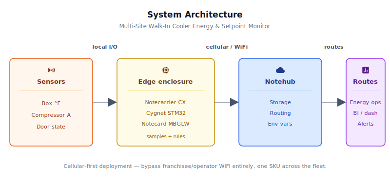
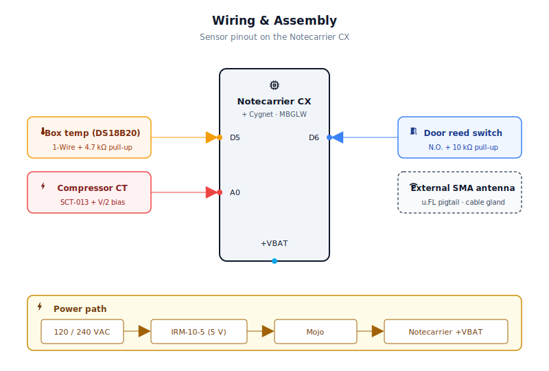
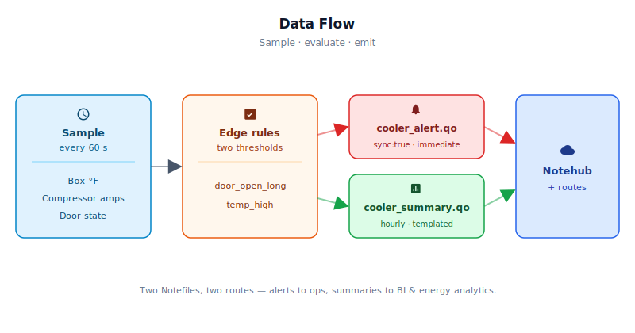

# Multi-Site Walk-In Cooler Energy & Setpoint Monitor

<Note>

This reference application is intended to provide inspiration and help you get started quickly. It uses specific hardware choices that may not match your own implementation. Focus on the sections most relevant to your use case. If you'd like to discuss your project and whether it's a good fit for Blues, [feel free to reach out](https://blues.com/contact-sales/).

</Note>

A cellular [energy savings](https://blues.com/energy-savings/) reference design that gives corporate operations teams a live view into the temperature, compressor runtime, and door behavior of every walk-in cooler in their fleet — without touching a single franchisee or operator's WiFi network.

## Quickstart: First Event in 30 Minutes

1. **Assemble the hardware** (Section 3–4): [Notecarrier CX](https://shop.blues.com/products/notecarrier-cx?utm_source=dev-blues&utm_medium=web&utm_campaign=store-link) + [Notecard Cell+WiFi](https://shop.blues.com/products/notecard?utm_source=dev-blues&utm_medium=web&utm_campaign=store-link), DS18B20 temperature probe, SCT-013-030 current transformer, reed switch door sensor, and 5V/2A power supply in a NEMA 4X enclosure.

2. **Create a [Notehub](https://notehub.io) project** and copy your ProductUID.

3. **Flash the firmware:**
   ```bash
   git clone https://github.com/blues/app-accelerators.git
   cd app-accelerators/54-multi-site-walk-in-cooler-energy-setpoint-monitor/firmware/cooler_monitor
   # Edit cooler_monitor.ino: paste your ProductUID into the PRODUCT_UID constant
   arduino-cli core install "STMicroelectronics:stm32"
   arduino-cli lib install "Blues Wireless Notecard" "OneWire" "DallasTemperature"
   arduino-cli compile --fqbn "STMicroelectronics:stm32:Nucleo_L433RC_P" .
   arduino-cli upload --fqbn "STMicroelectronics:stm32:Nucleo_L433RC_P" -p /dev/ttyACM0 .
   ```

4. **Power the device** and wait ~120 seconds. In Notehub, open your project → Events tab. You will see two Notefiles appear: `cooler_summary.qo` (hourly telemetry) and `cooler_alert.qo` (threshold events). A typical summary event looks like:
   ```json
   {
     "temp_f": 35.4,
     "setpoint_f": 35.0,
     "compressor_amps": 9.2,
     "compressor_run_min": 38.0,
     "door_opens": 12,
     "door_open_sec": 187,
     "kwh_window": 0.418,
     "window_sec": 3612
   }
   ```

5. **Set threshold environment variables** in Notehub (Fleet → Environment → click row, edit JSON):
   - `temp_alert_f`: 40 (fires when box temp exceeds this; default 40 °F)
   - `door_open_alert_sec`: 300 (fires when door open continuously for this many seconds; default 5 min)
   - Other optional vars: `sample_interval_sec`, `summary_interval_min`, `temp_setpoint_f`, `compressor_on_amps`, `volts_nominal`

6. **Trigger a test alert**: Open the cooler door and leave it open for >5 min, then wait for the next sample cycle. A `door_open_long` alert will appear in `cooler_alert.qo` with `sync:true` (immediate delivery, not queued).

## What You'll Have When You're Done

After completing this project, you will deploy a complete cellular-connected walk-in cooler monitoring system consisting of:

1. **Three non-invasive sensors** mounted on the cooler (temperature probe in the box, current transformer clamp on the compressor hot leg, magnetic reed switch on the door) — no electrical changes required, no cooperation from the cooler's OEM.

2. **A local enclosure** (Notecarrier CX with onboard Cygnet host, Notecard Cell+WiFi, power supply, and bias/pull-up circuits) that samples all three sensors every 60 seconds and automatically sleeps between samples.

3. **Notehub as your cloud backend**, storing and routing two streams of data:
   - **Telemetry**: One summary event per hour per cooler, containing averages (temperature, compressor amps) and totals (runtime minutes, door-open events, apparent kWh, window duration).
   - **Alerts**: Immediate notifications whenever the door is held open > 5 min or box temperature exceeds 40 °F, delivered via Notehub routes to your ops/facilities team.

4. **No WiFi required** — cellular connectivity eliminates the IT ticket bottleneck that has stopped energy programs at hundreds of multi-location operators. Works on franchisee sites, POS-restricted networks, and anywhere a cell signal exists.

5. **Configuration without reflashing** — threshold temperatures, alert timers, and sample/summary cadences are all tunable via Notehub environment variables; changes take effect on the device's next inbound sync.

## 1. Project Overview

**The problem.** For a chain QSR (quick-service restaurant), c-store (convenience store), or grocery operator, the walk-in cooler is one of the most expensive assets in a store — and one of the least visible. Energy cost per location is second only to labor, and a significant fraction of that energy budget runs through the compressor of one or more walk-in boxes. Operators who get visibility into compressor runtime, door discipline, and temperature trends across their fleet can cut energy spend materially: a door held open five minutes longer than necessary during a busy lunch rush costs real money in wasted refrigeration, and a compressor running six hours a day instead of four because box air temperature has quietly drifted 2 °F above the corporate temperature target costs even more at scale.

The harder problem is that an operator running 800 locations has 800 different network environments — franchisees on consumer ISPs, independent operators with POS (point-of-sale) systems that their IT vendors won't let anyone touch, c-stores with back-office networks that preclude any new guest devices. Getting corporate visibility through all of that friction is the barrier that keeps most energy-monitoring pilots from becoming fleet-wide programs. The pilot sites get instrumented; the rollout stalls at 50.

This project is the device that gets past that barrier. One SKU, cellular-connected, no IT ticket required. Stick a temperature probe inside the box, clamp a split-core current transformer on the compressor hot leg, mount a magnetic reed switch on the door, and you get a per-unit compressor energy proxy — compressor apparent kWh per summary window (per-day totals derived downstream by summing `kwh_window` records), door-open events, and temperature-to-target deviation — delivered to Notehub and routed wherever corporate needs it.

**Why Notecard.** The project description says it plainly: corporate energy management can't touch 800 independent-operator or franchisee WiFi networks — each would be its own ticket. A cellular Notecard is one SKU the field can plug in without asking anyone for a WiFi password. That's not a convenience; it's the difference between a program that deploys at fleet scale and one that stays perpetually in pilot. Deploying on cellular also keeps the energy-monitoring data stream entirely off the POS network, which matters both for network security and for the operational reality that POS downtime is the one thing nobody is willing to accept as a side effect of an energy program. The [Notecard Cell+WiFi](https://dev.blues.io/datasheets/notecard-datasheet/note-mbglw/) variant keeps WiFi as an opportunistic fallback for the occasional site that can offer it, without compromising the cellular-first deployment model.

**Deployment scenario.** A small weatherproof enclosure mounted in or near the cooler's refrigeration cabinet or mechanical room, powered from the cooler's dedicated circuit (typically 120VAC for single-phase residential-style units; many commercial condensing units run on 208/240VAC — see Limitations). Three sensor leads run into the box: a waterproof DS18B20 temperature probe positioned in open box air at mid-box height or along the return-air path (reading representative box air temperature away from the evaporator and door), a split-core CT clamped on one hot leg of the compressor's dedicated circuit, and a two-wire reed switch mounted on the door frame with a magnet on the door itself. No OEM cooperation, no cooler modification, no network integration required.

## 2. System Architecture



**Device-side responsibilities.** The onboard Cygnet STM32 host on the Notecarrier CX wakes every `sample_interval_sec` seconds (default 60 s), reads all three sensors, updates per-window accumulators (kWh, compressor runtime, door open time and event count), evaluates two alert rules, and either queues a summary [Note](https://dev.blues.io/api-reference/glossary/#note) or goes back to sleep. Between wakes, the host is fully powered down via [`card.attn`](https://dev.blues.io/api-reference/notecard-api/card-requests/#card-attn) — the Notecard holds the sleep state and restores it on wake.

**Notecard responsibilities.** The Notecard stores Notes locally in its on-device queue, establishes a cellular (or WiFi) session on the configured [`hub.set`](https://dev.blues.io/api-reference/notecard-api/hub-requests/#hub-set) `outbound` cadence (default 60 min), and flushes queued summary notes in that session. Alert notes set `sync:true` and jump the queue — the radio wakes within a session-establishment window regardless of the outbound cadence. The Notecard also distributes [environment variables](https://dev.blues.io/guides-and-tutorials/notecard-guides/understanding-environment-variables/) from Notehub to the host, so operators can retune setpoint thresholds, door-alert timers, and cadences without reflashing firmware.

**Notehub responsibilities.** The Notecard manages its own cellular session against the supported carrier networks worldwide via its embedded global SIM and delivers data to [Notehub](https://notehub.io) over the Internet; Notehub ingests events, stores every event, and applies project-level routes. Summaries and alerts land in separate [Notefiles](https://dev.blues.io/api-reference/glossary/#notefile) — `cooler_summary.qo` for periodic window-based telemetry and `cooler_alert.qo` for threshold events — so they can be fanned out to different destinations (long-term analytics store vs. real-time alerting channel) at different urgencies without any filter logic in the route. [Fleets](https://dev.blues.io/guides-and-tutorials/fleet-admin-guide/) and [Smart Fleets](https://dev.blues.io/notehub/notehub-walkthrough/#using-smart-fleet-rules) allow environment variables to be set at the fleet level (e.g., all units in a given region or banner share the same temperature setpoint target) and overridden per device.

**Routing to the cloud (high level).** Notehub supports HTTP, MQTT, AWS, Azure, GCP, Snowflake, and other destinations. Route configuration is project-specific — this project ships no downstream endpoint. See the [Notehub routing docs](https://dev.blues.io/notehub/notehub-walkthrough/#routing-data-with-notehub) for setup details.

## 3. Hardware Requirements

| Part | Qty | Rationale |
|------|-----|-----------|
| [Notecarrier CX](https://shop.blues.com/products/notecarrier-cx?utm_source=dev-blues&utm_medium=web&utm_campaign=store-link) | 1 | Integrated carrier with an embedded Cygnet STM32 host — no separate MCU needed for this three-sensor combination. |
| [Notecard Cell+WiFi (MBGLW)](https://shop.blues.com/products/notecard?utm_source=dev-blues&utm_medium=web&utm_campaign=store-link) ([datasheet](https://dev.blues.io/datasheets/notecard-datasheet/note-mbglw/)) | 1 | Cellular-first connectivity that bypasses site WiFi entirely; WiFi fallback for the occasional co-operative site. |
| [Blues Mojo](https://shop.blues.com/products/mojo?utm_source=dev-blues&utm_medium=web&utm_campaign=store-link) | 1 | Inline coulomb counter for bench validation of sleep/wake current profiles before field deployment. |
| [Adafruit Waterproof DS18B20 Temperature Sensor (product 381)](https://www.adafruit.com/product/381) | 1 | Calibrated digital 1-Wire temperature probe (±0.5 °C accuracy) in a stainless steel enclosure; purpose-built for wet, food-service environments where a bare thermistor would corrode. |
| 4.7 kΩ resistor, ¼W | 1 | Required pull-up for the DS18B20 1-Wire data line; without it the bus hangs. |
| SCT-013-030 split-core CT, 30A / 1V RMS (e.g., [SparkFun SEN-11005](https://www.sparkfun.com/products/11005)) | 1 | Non-invasive current measurement with a built-in burden resistor (voltage output); clamps over the compressor hot leg without breaking the circuit. 30A matches single-phase condensing units found in most walk-in box installations. |
| TRRS 3.5 mm breakout (e.g., [SparkFun BOB-11570](https://www.sparkfun.com/products/11570)) | 1 | The SCT-013's output lead terminates in a TRRS plug; this breakout converts it to solderable pads. |
| 10 kΩ 1% resistor (CT bias pair) | 2 | Voltage-divider bias circuit that centers the CT's AC signal at Vcc/2 (1.65 V) so the ADC sees only positive voltages. |
| 10 µF electrolytic capacitor | 1 | Decouples the bias node, preventing the CT signal from modulating the divider mid-point. |
| [Adafruit Magnetic Contact Switch / Door Sensor (product 375)](https://www.adafruit.com/product/375) | 1 | Normally-open reed switch in a pre-wired ABS enclosure; screws to the door frame while the included magnet mounts on the door itself. Closes below 13 mm separation, opens above — reliable over millions of cycles with no moving parts that wear. |
| 10 kΩ resistor, ¼W | 1 | External pull-up for the reed switch GPIO (supplements or replaces the internal STM32 pull-up for noise immunity). |
| AC/DC supply, 5V/2A (e.g., [MeanWell IRM-10-5](https://www.meanwell.com/Upload/PDF/IRM-10/IRM-10-SPEC.PDF)) | 1 | Derives 5V/2A (10 W) DC from the cooler's dedicated circuit. The IRM-10-5 accepts 85–264VAC wide-range input, covering both 120VAC and 208/240VAC single-phase supplies. During a cellular session the MBGLW's Quectel EG916Q-GL modem draws ~250 mA average (LTE Cat-1 bis); in areas where the modem falls back to GSM coverage it can spike to ~2 A for a few milliseconds — a burst the supply's output bulk capacitance absorbs within its 2 A continuous rating. Confirm the available supply voltage at the installation site before ordering — see Limitations for 24VAC/24VDC control-transformer installs. |
| External multiband LTE antenna, SMA male (e.g., [SparkFun CEL-29622](https://www.sparkfun.com/lte-hinged-external-antenna-600mhz-2700mhz-sma-male.html), 600 MHz–2.7 GHz hinged whip) | 1 | **Mandatory for any metal-enclosure or metal mechanical-room installation.** A Notecard antenna inside a steel NEMA 4X box cannot radiate reliably. The 600 MHz–2.7 GHz pass-band covers every band the MBGLW's Quectel EG916Q-GL operates on (LTE Cat-1 bis B1/B2/B3/B4/B5/B7/B8/B12/B13/B18–B20/B25–B28/B66 plus the 2G/3G fallback bands). Do **not** substitute a GPS/GNSS-only antenna (1.55–1.62 GHz) — it will not radiate on the cellular bands. Route the u.FL-to-SMA pigtail (next row) through a cable gland in the enclosure wall; attach this external SMA antenna on the exterior side of the gland. |
| u.FL-to-SMA bulkhead pigtail cable, ~150 mm (e.g., [Adafruit product 851](https://www.adafruit.com/product/851)) | 1 | Connects the Notecard's onboard u.FL antenna port to the external SMA panel-mount antenna. Required whenever an external SMA antenna is used — without this cable the antenna has no electrical path to the Notecard radio. A 150–200 mm length routes cleanly inside a ~6×4×2″ NEMA box without excess coiling. |
| NEMA 4X enclosure, ~6×4×2″ | 1 | Moisture- and hose-down-rated housing suitable for the cold, wet environment of a walk-in mechanical room. |

All Blues hardware ships with an active SIM including 500 MB of data and 10 years of service — no activation fees and no monthly commitment.

## 4. Wiring and Assembly



> **Safety — qualified personnel only.** This assembly connects to mains-voltage AC power. The AC/DC supply installation (wiring to the cooler's dedicated circuit) must be performed by a licensed electrician in compliance with applicable electrical codes (NEC Articles 100 and 110 and local amendments). Apply **lockout/tagout** procedures to the circuit breaker before opening any conduit or junction box. Once installed, all three sensors (temperature probe, CT clamp, reed switch) are electrically non-invasive — the CT clamps over the wire without breaking the circuit and is isolated from the mains conductor — but the supply wiring itself is not. Do not energize the enclosure until all wiring is complete and the enclosure lid is secured.

All host I/O lands on the [Notecarrier CX](https://dev.blues.io/datasheets/notecarrier-datasheet/notecarrier-cx-v1-3/) dual 16-pin header. The Notecard Cell+WiFi seats into the carrier's M.2 slot. **An external antenna is mandatory in a metal walk-in box or steel mechanical-room cabinet** — a Notecard antenna inside a metal enclosure cannot radiate reliably. Route a short u.FL-to-SMA pigtail from the Notecard's u.FL port through a cable gland in the NEMA 4X enclosure wall and attach it to the panel-mount SMA whip antenna on the exterior. The Mojo sits inline between the 5V supply and the Notecarrier's +VBAT pad for bench validation.

Pin-by-pin connections:

- **3V3** → DS18B20 red wire (VDD); top leg of both 10 kΩ CT bias resistors; top leg of the door-switch pull-up resistor.
- **GND** → DS18B20 black wire (GND); CT TRRS breakout sleeve (GND); bottom leg of both CT bias resistors; 10 µF capacitor negative; one terminal of the reed switch (either terminal, since it is just a switch).
- **D5** → DS18B20 yellow wire (data); 4.7 kΩ pull-up from D5 to 3V3 wired here.
- **A0** → CT bias node (midpoint of the two 10 kΩ divider resistors and the CT tip pin on the TRRS breakout; 10 µF capacitor placed from this node to GND).
- **D6** → one terminal of the reed switch; 10 kΩ pull-up from D6 to 3V3 (reed switch other terminal goes to GND, making the pin LOW when door closed and HIGH when door open under `INPUT_PULLUP`).
- **SDA / SCL** → Notecard I²C (Notecarrier CX routes these to the M.2 slot internally; no external wiring needed).
- **+VBAT** → Mojo `LOAD` output (bench use only); Mojo `BAT` input ← 5V DC output of the MeanWell IRM-10-5 (or equivalent 5V/2A AC/DC supply), which is wired to the AC service conductors in the NEMA 4X enclosure.

**CT installation note.** The SCT-013-030 is a split-core clamp; open the clamp, pass it over *one* hot leg of the compressor's circuit (not both — clamping both legs cancels the magnetic fields and you'll read zero). Route the TRRS lead back to the NEMA 4X enclosure through a cable gland. The compressor circuit is line-voltage; installation must be performed by a qualified electrician following applicable codes and lockout/tagout procedures. The CT itself is entirely non-contact and electrically isolated once clamped.

**DS18B20 placement.** For accurate air temperature monitoring, position the stainless probe tip in open box air at mid-box height or along the return-air path, away from both the evaporator fan discharge and the door. This location gives the most representative reading of box air temperature, which is a useful proxy for stored-product conditions but is not a direct product core-temperature measurement. Avoid the evaporator fan discharge — it is the coldest zone in the box and reads several degrees below true representative air temperature; placing the probe there biases temperature-to-target deviation calculations low and will delay `temp_high` alerts. Avoid the door zone, which sees warm infiltration air on every open cycle. Keep the probe away from direct coil contact for the same reason.

**Reed switch installation.** Mount the ABS switch body on the door frame and the magnet on the door, aligned so the two components are within 10 mm when the door is fully closed. Test continuity before closing the enclosure: pin D6 should read LOW with door closed and HIGH with door open in the Arduino serial terminal.

## 5. Notehub Setup

1. **Create a project.** Sign up at [notehub.io](https://notehub.io) and [create a project](https://dev.blues.io/quickstart/notecard-quickstart/notecard-and-notecarrier-pi/#set-up-notehub). Copy the [ProductUID](https://dev.blues.io/notehub/notehub-walkthrough/#finding-a-productuid) and paste it into `firmware/cooler_monitor/cooler_monitor.ino` as the `PRODUCT_UID` constant before flashing.
2. **Claim the Notecard.** Power the unit; on first cellular connection the Notecard associates with your project automatically.
3. **Create Fleets.** The natural grouping for a multi-site cooler program is one [Fleet](https://dev.blues.io/guides-and-tutorials/fleet-admin-guide/) per banner or region — every store in a given franchise territory typically shares the same setpoint targets and alert thresholds. [Smart Fleet](https://dev.blues.io/notehub/notehub-walkthrough/#using-smart-fleet-rules) rules let you break out exceptions automatically (e.g., flagship stores with tighter temperature tolerances) without manual device reassignment.
4. **Set environment variables.** All variables below are optional; firmware defaults apply until overridden. Any variable set in Notehub takes effect on the device's next inbound sync — no reflash required. **To set a variable in Notehub:** navigate to your project → Devices (or Fleet) → scroll down to Environment Variables → click "Edit" (JSON view) → add or update the variable and save. The device syncs inbound approximately every `summary_interval_min` (default 60 min), so allow up to 120 seconds for the new value to take effect.

   | Variable | Default | Purpose |
   |---|---|---|
   | `sample_interval_sec` | `60` | Seconds between sensor reads and state updates. |
   | `summary_interval_min` | `60` | Minutes between `cooler_summary.qo` notes. Also re-applies `hub.set outbound` to keep cellular cadence in sync. The `kwh_window` field reflects energy accumulated across the scheduled sample intervals within this window. |
   | `temp_setpoint_f` | `35.0` | Target box temperature (°F); transmitted in every summary note as `setpoint_f` so the corporate dashboard can compute drift = `temp_f − setpoint_f` without a separate lookup. |
   | `temp_alert_f` | `40.0` | Box temperature (°F) above which a `temp_high` alert fires. |
   | `door_open_alert_sec` | `300` | Continuous seconds the door has been open before a `door_open_long` alert fires (default 5 min). |
   | `compressor_on_amps` | `2.0` | Amps threshold above which the compressor is considered running for runtime and kWh accumulation. |
   | `volts_nominal` | `120.0` | Nominal line voltage (V) used in the apparent-power kWh estimate. |

5. **Configure routes.** Add one [route](https://dev.blues.io/notehub/notehub-walkthrough/#routing-data-with-notehub) for `cooler_alert.qo` (real-time delivery to a store-ops or facilities channel) and a second for `cooler_summary.qo` (to a long-term analytics store or BI tool). Keeping the two Notefiles separate at the source means they can fan out to entirely different destinations without any filter logic inside the route.

## 6. Firmware Design

Main sketch plus helper files: [`firmware/cooler_monitor/cooler_monitor.ino`](firmware/cooler_monitor/cooler_monitor.ino) (entry point, sample cycle), [`firmware/cooler_monitor/cooler_monitor_helpers.cpp`](firmware/cooler_monitor/cooler_monitor_helpers.cpp) (Notecard config, sensor reads, note emission), and [`firmware/cooler_monitor/cooler_monitor_helpers.h`](firmware/cooler_monitor/cooler_monitor_helpers.h) (shared constants, types, and declarations).

**Dependencies:**
- Arduino core for STM32 ([`stm32duino/Arduino_Core_STM32`](https://github.com/stm32duino/Arduino_Core_STM32)).
- [`Blues Wireless Notecard`](https://github.com/blues/note-arduino) (`note-arduino` library, v1.8.5 at time of writing). Install via Arduino Library Manager or `arduino-cli lib install "Blues Wireless Notecard"`.
- [`OneWire`](https://github.com/PaulStoffregen/OneWire) library. Install via Arduino Library Manager.
- [`DallasTemperature`](https://github.com/milesburton/Arduino-Temperature-Control-Library) library. Install via Arduino Library Manager.

### Modules

| Responsibility | Where |
|---|---|
| Notecard `hub.set` configuration (cold start + every wake until confirmed) | `hubConfigure()` |
| Template registration for both Notefiles | `defineTemplates()` |
| Env-variable fetch and clamp on every wake | `fetchEnvOverrides()` |
| Re-apply `hub.set` if `summary_interval_min` changed | `applyHubSetIfChanged()` |
| DS18B20 temperature read (timeout-polled, NaN sentinel) | `readBoxTempF()` |
| CT two-pass RMS current read | `readCompressorAmps()` |
| Reed-switch door-state read | `readDoorOpen()` |
| Accumulation, alert evaluation, summary trigger | `runSampleCycle()` |
| Immediate-sync alert emission | `sendAlert()` |
| Queued summary emission | `sendSummary()` |
| State persistence / sleep until next sample | `NotePayloadSaveAndSleep()` in `loop()` |

### Sensor reading strategy

**DS18B20.** The probe is configured in non-blocking mode (`setWaitForConversion(false)`). After `requestTemperatures()`, the firmware polls `isConversionComplete()` in an 850 ms timeout loop rather than calling `delay(750)`. The host remains awake throughout the conversion — this is a timeout-polled read within the same wake cycle, not a pipelined conversion across sleeps — but the polling approach avoids hanging indefinitely if the sensor is slow to respond. If the probe is disconnected or returns a value below –55 °C or at 85 °C or above (including the 85.0 °C power-up sentinel the DS18B20 can emit on a bus fault), `readBoxTempF()` returns `NAN`; the summary then emits `–9999` as a sentinel rather than a misleading zero, so downstream analytics can distinguish "sensor failed" from a genuine measurement.

**Current transformer.** The SCT-013-030 outputs an AC signal centered at 0 V. A two-resistor 10 kΩ voltage divider from 3V3 to GND, with a 10 µF decoupling capacitor, creates a stable 1.65 V DC offset (Vcc/2) at the ADC pin. The firmware uses a two-pass algorithm: pass one samples the ADC continuously for 150 ms to compute the DC mean; pass two samples for another 150 ms and computes the RMS of the AC component around that mean. At 60 Hz one mains cycle is 16.7 ms, so a 150 ms window covers approximately nine complete cycles — a sufficient sample of the actual mains waveform for a well-conditioned RMS result. Readings below 0.15 A are floored to zero to suppress ADC noise when the compressor is off.

**Reed switch.** A simple `digitalRead` with `INPUT_PULLUP`. The switch is normally open — it closes (pulling D6 LOW) only when the door is shut and the magnet is within 13 mm of the sensor. Door-open events are edge-detected: a transition from `prevDoorOpen = 0` to `doorOpen = 1` increments the event count.

### Event payload design

Two [template-backed](https://dev.blues.io/notecard/notecard-walkthrough/low-bandwidth-design/#working-with-note-templates) Notefiles. Templates let the Notecard store Notes as fixed-length binary records rather than free-form JSON, shrinking on-wire payload size by roughly 3–5×. At 24 summary Notes per box per day across a thousand-store fleet, the difference compounds. When you view events in Notehub (Events tab), they appear as human-readable JSON; the binary template format is internal storage only.

**Template type encoding** (used by the firmware in `defineTemplates()`): `14.1` = IEEE 754 4-byte float; `14` = 4-byte signed integer; `12` = 2-byte signed integer; `22` = 2-byte unsigned integer. These are specified when registering a template to the Notecard so it knows how to pack and unpack each field.

`cooler_summary.qo` (per summary window, queued):

```json
{
  "file": "cooler_summary.qo",
  "body": {
    "temp_f": 35.4,
    "setpoint_f": 35.0,
    "compressor_amps": 9.2,
    "compressor_run_min": 38.0,
    "door_opens": 12,
    "door_open_sec": 187,
    "kwh_window": 0.418,
    "window_sec": 3612
  }
}
```

Field semantics: `temp_f` and `compressor_amps` are **window averages** (sum of valid readings ÷ valid-reading count). `compressor_run_min`, `door_open_sec`, `door_opens`, and `kwh_window` are **window totals**. `window_sec` is the sum of the scheduled sample intervals that elapsed during this window (sleep time only — awake time spent sampling is excluded). When `sample_interval_sec` does not evenly divide `summary_interval_min × 60`, the window overshoots by at most one sample period. Downstream tools should use `window_sec` as the denominator for any energy-rate or duty-cycle calculation (e.g. average watts = `kwh_window / window_sec × 3 600 000`), noting that actual wall-clock elapsed time is marginally longer than `window_sec` due to excluded awake time. `setpoint_f` carries the current Notehub-configured corporate target (not a value read from the cooler controller) so a dashboard can compute deviation = `temp_f − setpoint_f` per record without a separate lookup. `–9999` in `temp_f` signals a sensor fault (e.g. probe disconnected).

`cooler_alert.qo` (immediate, `sync:true` bypasses outbound cadence):

```json
{
  "file": "cooler_alert.qo",
  "body": {
    "alert": "door_open_long",
    "temp_f": 38.1,
    "amps": 10.4,
    "door_open_sec": 312
  },
  "sync": true
}
```

### Low-power strategy

All sampling cadence (every 60 s by default) and transmission cadence (every 60 min) are decoupled. After each sample cycle, `NotePayloadSaveAndSleep` serializes the `AppState` struct into Notecard flash and then issues [`card.attn`](https://dev.blues.io/api-reference/notecard-api/card-requests/#card-attn) to cut power to the host MCU entirely for `sample_interval_sec` seconds. The Notecard then idles in its own [low-power mode](https://dev.blues.io/notecard/notecard-walkthrough/low-power-firmware-design/) between cellular sessions. Because the walk-in cooler is powered from 120VAC, the absolute mAh budget is not the constraint — but the pattern still matters for enclosure thermal management and for portability to future battery-assisted variants.

### Retry and error handling

- **`hub.set` is retried on every wake until confirmed.** `hubConfigure()` now returns `bool`. The first call runs on cold start; its result is stored in `state.hubSetConfirmed`. If that call fails (e.g. the STM32 host comes up before the Notecard is ready on I²C and `sendRequestWithRetry` exhausts its 10 attempts), every subsequent warm wake includes an `else if (!state.hubSetConfirmed)` branch that retries `hubConfigure()` unconditionally — independent of whether `env.get` succeeds. Only after `hubSetConfirmed` is set does the device fall back to the lighter `applyHubSetIfChanged()` path, which re-issues `hub.set` solely when `summary_interval_min` changes. This guarantees the device cannot remain permanently unassociated while silently accumulating Notes in its local queue.
- `env.get` checks the `err` field on the response before accessing `body` — a failed inbound sync (no `body`) leaves the compile-time defaults in place rather than corrupting config.
- The two alert types carry independent cooldown timers (`doorAlertCooldownSec`, `tempAlertCooldownSec`) measured in wall-clock seconds so timing stays accurate across `sample_interval_sec` changes. Each alert can fire at most once per 30-minute window, preventing a temporarily-open door or a sluggish compressor from firing dozens of identical alerts on consecutive wakes.
- If `summary_interval_min` changes via Notehub env var, `applyHubSetIfChanged()` re-issues `hub.set` with the updated outbound cadence so the Notecard's cellular session timing tracks the new summary period rather than drifting. This path runs only after `hubSetConfirmed` is true.

### Key code snippet 1: template definition

Template type hints tell the Notecard how to pack each field (see "Template type encoding" above). `door_open_sec` and `window_sec` use `14` (4-byte signed integer) rather than `12` (2-byte signed integer, max ~9 hours) because large summary intervals or a stuck door can accumulate values that overflow a 2-byte integer. Conversely, `door_opens` uses `12` (2-byte signed, up to ~32k events) since a realistic window rarely exceeds 50 door cycles. For complete field-type reference, see the [Blues template data-type guide](https://dev.blues.io/notecard/notecard-walkthrough/low-bandwidth-design/#understanding-template-data-types).

```cpp
J *req = notecard.newRequest("note.template");
JAddStringToObject(req, "file", "cooler_summary.qo");
J *body = JAddObjectToObject(req, "body");
JAddNumberToObject(body, "temp_f",              14.1);  // 4-byte float
JAddNumberToObject(body, "setpoint_f",          14.1);  // 4-byte float
JAddNumberToObject(body, "compressor_amps",     14.1);  // 4-byte float
JAddNumberToObject(body, "compressor_run_min",  14.1);  // 4-byte float
JAddNumberToObject(body, "door_opens",          12);    // 2-byte signed int
JAddNumberToObject(body, "door_open_sec",       14);    // 4-byte signed int
JAddNumberToObject(body, "kwh_window",          14.1);  // 4-byte float
JAddNumberToObject(body, "window_sec",          14);    // 4-byte signed int
notecard.sendRequest(req);
```

### Key code snippet 2: immediate-sync alert

`sync:true` bypasses the outbound cadence — the Notecard wakes the radio immediately.

```cpp
J *req = notecard.newRequest("note.add");
JAddStringToObject(req, "file", "cooler_alert.qo");
JAddBoolToObject(req, "sync", true);
J *body = JAddObjectToObject(req, "body");
JAddStringToObject(body, "alert",         "door_open_long");
JAddNumberToObject(body, "temp_f",        38.1);
JAddNumberToObject(body, "amps",          0.0);
JAddNumberToObject(body, "door_open_sec", 312);
notecard.sendRequest(req);
```

### Key code snippet 3: persist state and sleep

`NotePayloadSaveAndSleep` serializes the struct to Notecard flash and then uses `card.attn` to cut VBAT to the host MCU. The next wake enters `setup()` fresh; `NotePayloadRetrieveAfterSleep` rehydrates the state.

```cpp
NotePayloadDesc outPayload = {0, 0, 0};
NotePayloadAddSegment(&outPayload, SEG_STATE, &state, sizeof(state));
NotePayloadSaveAndSleep(&outPayload, cfgSampleSec, NULL);
```

## 7. Data Flow



**Collected** every `sample_interval_sec` (default 60 s): box air temperature (°F), compressor RMS amps, door open/closed state.

**Accumulated** within each summary window: compressor apparent kWh (V × I × t / 1000, compressor hot leg only), compressor runtime minutes, total door-open seconds, and door-open event count (rising-edge transitions).

**Transmitted:**
- `cooler_summary.qo` — one record per `summary_interval_min` (default approximately once per hour), queued locally and flushed during the Notecard's scheduled outbound cellular session. `temp_f` and `compressor_amps` are **window averages** (mean over all valid reads during the window). `compressor_run_min`, `door_open_sec`, `door_opens`, and `kwh_window` are **window totals**. `window_sec` is the sum of scheduled sample intervals for the window (sleep time only — actual wall-clock elapsed time is marginally longer due to excluded awake time) — use it as the denominator for energy-rate calculations. `setpoint_f` carries the current Notehub-configured corporate target so downstream tools can compute deviation = `temp_f − setpoint_f` per record without a separate lookup. `–9999` signals a sensor fault for `temp_f` where `NAN` would be meaningless in JSON.
- `cooler_alert.qo` — emitted only on a threshold trip, with `sync:true` to bypass the outbound timer. Alert cooldown prevents more than one alert per type per 30-minute window.

**Routed.** Both Notefiles arrive at Notehub and from there to whichever downstream routes the project configures. The two filenames are deliberately different so they can be fanned out to different destinations at different urgencies without any route-level filtering.

**Alert triggers:**
- `door_open_long` — door has been continuously open for at least `door_open_alert_sec` seconds (default 5 min). Fires repeatedly at most once per 30-minute cooldown window while the door remains open — one page-out per half hour is enough for store ops to investigate.
- `temp_high` — box temperature exceeds `temp_alert_f` (default 40 °F). The alert carries the current amps reading, so the responder can immediately see whether the compressor is running (equipment issue) or is off (power outage, breaker trip).

## 8. Troubleshooting

**Device claims to Notehub but no events appear after 2+ hours.**
- Check Notecard firmware is up to date: Notehub → Devices → click your device → Device Info → Notecard version. If outdated, trigger a [Notecard firmware update](https://dev.blues.io/notecard/notecard-walkthrough/updating-notecard-firmware/).
- Confirm ProductUID in firmware matches your Notehub project. Notecard will not transmit to the wrong project.
- In Notehub's in-browser terminal (top-right button), run `hub.status` to check cellular signal (`"signal": -100 to -50` dBm is typical). If `"status": "disconnected"`, wait 2–3 min and retry; initial connection can take multiple cycles.
- Check that templates are registered: Events tab should show `cooler_summary.qo` and `cooler_alert.qo` Notefiles (even if empty). If missing, the `defineTemplates()` function failed—check firmware logs via USB serial with DEBUG_SERIAL enabled.

**Events appear but temp_f or compressor_amps show NaN or -9999.**
- `temp_f = -9999`: DS18B20 probe is disconnected, shorted, or the 4.7 kΩ pull-up is missing or open. Check D5 connectivity and probe 1-Wire bus.
- `compressor_amps = 0.0`: CT is reading zero. Check that the CT clamp is around only one hot leg of the compressor circuit (not both, which cancels the field). Verify TRRS connector is fully seated at the SCT-013 input. Check A0 bias-circuit voltage is ~1.65 V (measure with a multimeter between A0 and GND).

**Door-open alerts fire every sample even when door is closed.**
- Door reed switch is stuck closed or the door-frame magnet is permanently magnetized. Confirm the switch reads LOW on D6 when door is physically closed and HIGH when open (check with a pin voltage meter or Notehub terminal `card.attn` disabled, then upload a sketch that prints `digitalRead(D6)` to serial).
- If magnet is stuck, replace the magnet.

**Cellular sessions happen more frequently than expected (not just every `summary_interval_min`).**
- Alerts are firing and triggering `sync:true` sessions outside the normal cadence. Check Events tab for `cooler_alert.qo` — if present, one of the two alert rules is active. Verify `temp_alert_f` and `door_open_alert_sec` thresholds are not too tight for your operating environment.

**Device wakes and samples but the Mojo coulomb meter shows no change between sleep cycles.**
- The host is not fully sleeping; `card.attn` may not be working. Verify I²C connectivity between Notecarrier and Notecard. Check firmware has no blocking delays or `delay()` calls outside of timeout-polled sensor reads (e.g., in `loop()` before `NotePayloadSaveAndSleep`).

## 9. Validation and Testing

**Expected steady-state cadence.** A correctly-running cooler generates one `cooler_summary.qo` event approximately every `summary_interval_min` (default 60 min) and zero `cooler_alert.qo` events unless thresholds are breached. As a rough illustrative reference, a mid-size commercial walk-in cooler (800–1200 cu ft) at a typical QSR may show:
- **Compressor runtime:** 35–55% duty cycle (21–33 minutes per 60-minute window)
- **Compressor apparent kWh:** 0.3–0.6 kWh per window
- **Door opens:** 8–20 per window (depends on traffic)
- **Door open time:** 60–300 seconds cumulative per window
- **Temperature drift:** 0–2 °F above setpoint (after stabilization)

These are order-of-magnitude benchmarks; actual figures vary significantly with box volume, insulation, ambient conditions, product load, and defrost cycle frequency. `temp_f` consistently more than 3–4 °F above `temp_setpoint_f` is worth investigating regardless of runtime figures.

**Simulating alerts during commissioning.** Two quick threshold tests: (a) set `temp_alert_f` to just below the current ambient in Notehub's environment-variable editor, wait one inbound sync (~120 min, or issue `hub.sync` via the Notehub in-browser terminal), and observe a `temp_high` alert appear in the Events tab; (b) open the cooler door and leave it open past `door_open_alert_sec` to trigger `door_open_long`. Restore the original threshold after each test.

**Using Mojo to validate power behavior.** The [Mojo](https://dev.blues.io/datasheets/mojo-datasheet/) sits inline between the 5V supply output and the Notecarrier CX +VBAT pin during bench testing and reports cumulative mAh over its [Qwiic](https://www.sparkfun.com/qwiic) I²C link. Because Mojo measures at the +VBAT rail, it sees the *whole assembly* — Notecard, Notecarrier CX, Cygnet host, DS18B20, CT bias circuit, and reed switch — not the Notecard alone.

**(a) Published Notecard Cell+WiFi (MBGLW) current figures.** The table below cites figures from the [Blues low-power design documentation](https://dev.blues.io/notecard/notecard-walkthrough/low-power-design/) and the [MBGLW datasheet](https://dev.blues.io/datasheets/notecard-datasheet/note-mbglw/). These are Notecard-only figures; the Mojo reading will be higher because it includes the Notecarrier and sensors.

| Operating mode | Published current (Notecard only) | Source |
|---|---|---|
| Idle, radio off (between syncs) | ~8–18 µA @ 5V | [Blues low-power docs](https://dev.blues.io/notecard/notecard-walkthrough/low-power-design/) |
| LTE Cat-1 bis session active (primary RAT) | ~250 mA average; supply rail must handle brief current peaks — see [Blues cellular power-supply guidance](https://dev.blues.io/datasheets/application-notes/low-power-hardware-design/#power-supply-selection) for sizing | [MBGLW datasheet](https://dev.blues.io/datasheets/notecard-datasheet/note-mbglw/) |
| GSM fallback (rare; areas without LTE coverage) | Up to ~2 A for a few milliseconds during GSM transmit burst; absorbed by the supply's output bulk capacitance within the IRM-10-5's 2 A continuous rating | [MBGLW datasheet](https://dev.blues.io/datasheets/notecard-datasheet/note-mbglw/) |
| Per-session energy (single queued note, bench test) | ~0.3 mAh | [Blues low-power design tests](https://dev.blues.io/notecard/notecard-walkthrough/low-power-design/) |
| WiFi active (opportunistic fallback) | Not independently specified in the MBGLW datasheet; the integrated Silicon Labs WFM200S WiFi module adds to the cellular idle baseline when active — consult the WFM200S transceiver datasheet for characterization data | [MBGLW datasheet — hardware overview](https://dev.blues.io/datasheets/notecard-datasheet/note-mbglw/) |

**(b) Expected Mojo trace (whole assembly at +VBAT).** Your Mojo readings will exceed the Notecard-only floor because they include the Notecarrier CX regulator, the CT bias voltage divider (~165 µA continuous from the 3V3 rail), and connected-sensor quiescent draw. Expected pattern and approximate ranges by firmware phase:

| Phase | Approx. whole-assembly current at +VBAT |
|---|---|
| Host off between samples (card.attn sleep, Notecard idle) | ~0.5–1 mA — well above the Notecard-only µA floor; CT bias divider and Notecarrier CX regulator quiescent dominate |
| Host active during sampling (~1–2 s per wake) | ~15–30 mA spike — Cygnet STM32L4 active, DS18B20 750 ms conversion, 2 × 150 ms CT ADC passes |
| Cellular outbound session — LTE Cat-1 bis (~30–60 s per hour) | ~250–300 mA — Notecard modem (~250 mA average) plus Notecarrier and sensor overhead; 5V/2A supply handles this with substantial headroom. In rare GSM-only coverage areas the modem bursts to ~2 A for a few ms; the supply's output capacitance absorbs this within its 2 A rating. |

The *shape* of the trace is as informative as the absolute level. What you want to see: a stable sub-milliamp floor between wakes, a ~15–30 mA spike every 60 seconds lasting 1–2 s (one sample cycle), and a ~250–300 mA plateau once per summary window lasting tens of seconds (the LTE Cat-1 bis cellular session). A persistent multi-mA floor between wakes — above the ~0.5–1 mA sleep baseline — means the host is not fully sleeping, typically a `card.attn` wiring or firmware issue. Cellular plateaus more frequent than the configured summary cadence mean an alert is firing and triggering `sync:true` sessions outside the normal schedule. Both contributions are a negligible fraction of the 5V/2A supply's capacity; the bench measurement pays off most by catching firmware regressions that accidentally leave the host awake continuously.

## 10. Limitations and Next Steps

**Simplified for this POC:**

- **Sensor reads are sample-based, not interrupt-driven.** All three sensors are polled once per `sample_interval_sec` (default 60 s). Any door opening, door closing, or compressor start/stop that occurs *and completes* within one 60-second sleep interval goes undetected. This quantizes edge timing to the sample period, which directly affects `door_opens`, `door_open_sec`, compressor runtime, and `kwh_window` — all can undercount if events are shorter than the sample period. `door_open_long` alert timing is similarly quantized: a door that opens just after one sample and closes just before the next may not trip the alert even if the physical open duration exceeded `door_open_alert_sec`. Reducing `sample_interval_sec` via environment variable improves resolution but increases host awake time and may increase alert frequency (more frequent checks means alert conditions are detected sooner and `sync:true` sessions may be triggered more often); scheduled outbound cellular sessions are still governed by `summary_interval_min` and do not increase with the sample interval alone.

- **AC supply voltage.** The MeanWell IRM-10-5 in the BOM accepts 85–264VAC wide-range input and handles both 120VAC and 208/240VAC single-phase — the majority of walk-in condensing unit installations. Some mechanical rooms provide only a 24VAC or 24VDC control-transformer rail rather than mains voltage; those installs require a different converter (a 24VAC-input or 24VDC-input step-down regulator) rather than the AC/DC supply listed here. Always confirm the available supply with the field electrician before ordering components.

- **Compressor apparent energy only — not total cooler energy.** The single CT clamps one hot leg of the compressor circuit. Evaporator fans, defrost heaters, door heaters, controls, lighting, and other loads on the cooler's electrical service are not measured. `kwh_window` is a compressor energy proxy, not total cooler or site energy consumption. A revenue-grade multifunction meter or additional CT channels for the non-compressor loads would be required if total box energy is the intended metric. In addition, the estimate uses apparent power (V × I) rather than real power (V × I × PF). For a typical single-phase hermetic compressor motor, power factor runs 0.75–0.90, so the estimate will overstate actual compressor energy by 10–25 %. A calibrated kilowatt-hour meter with a pulse output is the right solution for billing-grade energy monitoring; the single-CT apparent-power approach gives a useful relative metric for comparing compressor behavior across units and tracking trends over time, not an absolute kWh figure.
- **Single-phase only.** Larger walk-in boxes (over 4,000 sq ft) or walk-in freezers may run three-phase compressors. That requires three CTs, additional ADC channels, and firmware changes to sum the per-phase apparent power.
- **Temperature sensor without calibration offset.** DS18B20 probe accuracy is ±0.5 °C (±0.9 °F) factory-calibrated. For temperature-to-target deviation monitoring at ±1 °F precision, an in-situ calibration offset stored as an environment variable would eliminate unit-to-unit spread.
- **Temperature-to-target deviation is a downstream-derived metric, not an on-device rule. The cooler controller's thermostat setpoint is not observed.** The device has no connection to the cooler's onboard controller or thermostat — `setpoint_f` in every summary note is the corporate target temperature configured as a Notehub environment variable (`temp_setpoint_f`), not a value read from the cooler's electronic or mechanical controller. If actual controller-setpoint monitoring is required, integration with the cooler controller (e.g. via Modbus or a proprietary serial interface) would be needed. A downstream dashboard can compute deviation (`temp_f − setpoint_f`) per record — but the firmware itself never compares temperature against `setpoint_f`. The only on-device temperature alerting is the `temp_high` rule, which fires when `temp_f` exceeds the separate `temp_alert_f` threshold (default 40 °F). Because `temp_high` is a fixed threshold rather than a setpoint-relative check, a legitimate spike during a freight delivery (door held open 10 minutes) triggers the same alert as a genuine refrigerant problem. Gating the alert on compressor runtime and recent door activity would reduce false positives significantly.
- **No GNSS.** The Notecard Cell+WiFi includes a GNSS module. This project does not use it, because a fixed-location walk-in cooler box doesn't move. One-time site location can be bootstrapped from cellular tower triangulation via [`card.location`](https://dev.blues.io/api-reference/notecard-api/card-requests/#card-location) if site lat/lon is needed for mapping dashboards.

**Production next steps:**
- Per-unit calibration offset for the DS18B20 (`temp_offset_f` env var) applied in `readBoxTempF()` at runtime.
- Add a `door_open_max_sec` field to the summary payload capturing the longest single uninterrupted door-open event within the window — useful for distinguishing a normal rapid-turnaround pattern from a single sustained-open incident, beyond what `door_open_sec` (total) alone conveys.
- Three-phase compressor support: three SCT-013-030 CTs on A0/A1/A2, RMS per leg, summed apparent power.
- kWh power-factor correction via a `power_factor` environment variable (0.80 default) that ops can dial in per unit type after a baseline period against a reference meter.
- [Notecard Outboard DFU](https://dev.blues.io/notehub/host-firmware-updates/notecard-outboard-firmware-update/) for over-the-air firmware updates, so threshold algorithm improvements can roll out fleet-wide without truck rolls.
- A `cooler_config.qi` inbound Notefile for ops-team-initiated diagnostic dumps (full state snapshot on demand without waiting for the next summary).

## 11. Summary

A Notecarrier CX + Notecard Cell+WiFi + three inexpensive sensors close a gap that's stopped energy programs at hundreds of chains and operators: corporate visibility across sites you cannot touch IT-wise. The cellular uplink is one SKU; the field tech plugs it in without a WiFi ticket; the data stream stays off the POS network. What lands in Notehub — compressor apparent kWh per summary window (with per-day totals derived downstream by summing `kwh_window` records), compressor runtime, door events, and temperature-to-target deviation — gives a corporate energy team the fleet-level signal needed to surface outlier boxes running significantly more compressor-hours than their peers, locations where cumulative door-open time is an order of magnitude above the fleet median, and units where box air temperature has quietly drifted above the configured corporate target — all without asking anyone for a network password.
