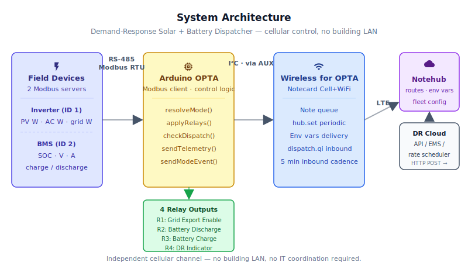
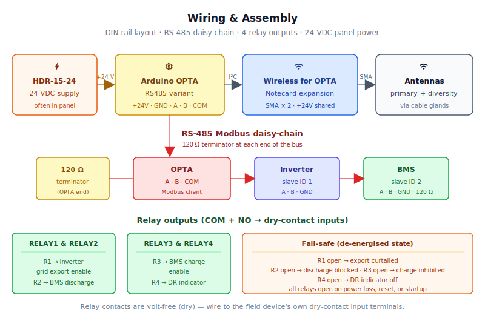
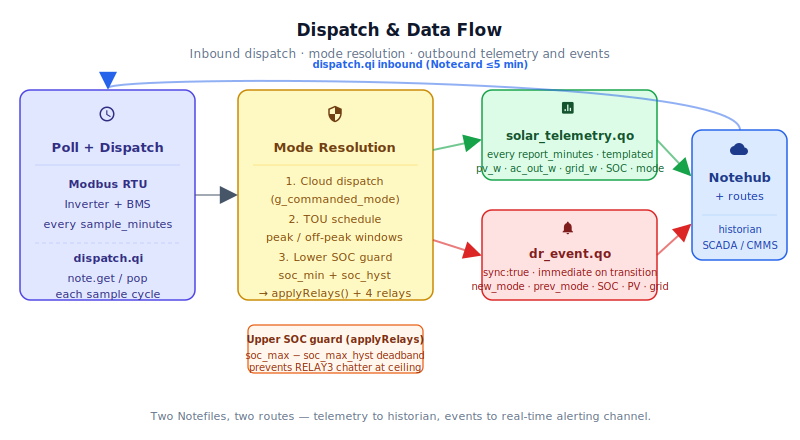

# Demand-Response Solar + Battery Dispatcher

<Note>

This reference application is intended to provide inspiration and help you get started quickly. It uses specific hardware choices that may not match your own implementation. Focus on the sections most relevant to your use case. If you'd like to discuss your project and whether it's a good fit for Blues, [feel free to reach out](https://blues.com/contact-sales/).

</Note>

An [energy savings](https://blues.com/energy-savings/) reference design that gives a commercial solar + battery installation an independent cellular control channel — so the asset owner can dispatch the battery to discharge during expensive peak-rate hours, charge during cheap overnight hours, and curtail grid export when the utility calls a **demand-response** (**DR**) event, without depending on the building's IT network or a vendor's proprietary cloud portal. The device reads live operating state from the inverter and the battery's management system over the industrial bus they already share, and signals each one to enter the right mode at the right time — driven by a schedule or by live commands routed through Notehub.

**Scope.** This is a *mode enable / curtail* controller, not a power dispatcher. It closes and opens four dry-contact relays wired to digital control inputs the inverter and battery already expose; the field devices' own firmware then decides the actual charge, discharge, and export behavior — ramp rates, power limits, setpoints — based on their pre-commissioning configuration. The controller does not command power setpoints, verify that a requested dispatch profile was executed, or close any control loop around site load.

## 1. Project Overview


**The problem.** Commercial solar-plus-storage systems are a compelling economics story on paper: sell excess solar generation at peak rates, cover load from the battery so you don't draw from the grid during expensive peak windows, and participate in utility DR programs that pay you to curtail export or reduce load on short notice. The value is real, but realizing it requires a reliable, low-latency control channel between the utility signal and the physical system sitting on the roof or in the equipment yard.

That's where most deployments hit the wall. The inverter and **battery management system** (**BMS**) speak Modbus — an industrial serial protocol developed in 1979 that remains the lingua franca of commercial power electronics — and that bus sits in an outdoor equipment cabinet or a rooftop shed with no direct connection to the building's IT network. Even when WiFi does reach the equipment, the solar asset is often owned by a third-party **PPA** (power purchase agreement) provider who has no credentials on the building's network and no relationship with the building's IT team. The control channel that does exist — the inverter's local display, a proprietary cloud portal, or a laptop plugged in at the cabinet — isn't a control channel you can reliably automate, audit, or integrate with a utility DR program.

This project closes that gap. A Blues Wireless for OPTA expansion snapped onto an Arduino OPTA RS485 **PLC** (programmable logic controller) sits on the DIN rail inside the equipment cabinet. The OPTA reads the inverter and BMS over the RS-485 Modbus bus already present in every commercial solar installation, while the Notecard inside the expansion provides a cellular uplink that is completely independent of the building network and requires no IT coordination. When the utility issues a DR event, or when the local time-of-use (**TOU**) peak window opens, the cloud-side system routes a dispatch command to the device through Notehub. The OPTA closes or opens four relay outputs — grid export enable, battery discharge, battery charge, and a DR-active indicator — typically within one to six minutes of the command arriving at Notehub (bounded by the 5-minute inbound sync cadence plus the next 1-minute sample cycle), then reports what it did and why.

**Why Notecard.** The inverter and battery sit outdoors or in a rooftop equipment yard where WiFi is poor. More fundamentally, the solar asset is often owned by a PPA provider who doesn't have access to the building's network and can't request VPN credentials from a tenant's IT department. Cellular gives the asset owner an independent control channel that works identically whether the building is a strip mall, a warehouse, or a multi-tenant office park — no network forms, no AP to pair to, and no IT ticket to chase. That independence is the whole point: the asset owner needs to be able to send a discharge command at 4:57 PM regardless of what the building's network is doing.

**Deployment scenario.** A single OPTA RS485 + Wireless for OPTA mounted on the DIN rail inside the solar equipment cabinet, next to the inverter's communication interface. The RS-485 bus daisies from the OPTA to the inverter and then to the BMS. Four relay output wires run to the corresponding digital control inputs on the inverter and BMS. The cellular antenna routes through a cable gland to the outside of the cabinet. Line power from the 24 VDC supply already present in the equipment cabinet. No PC, no gateway, no building LAN.

> **⚠ Commissioning safety — TOU windows are disabled by default.** Both the peak window (`peak_start_utc` / `peak_end_utc`) and the off-peak charge window (`charge_start_utc` / `charge_end_utc`) ship with start and end hours equal (both `0`), which disables autonomous TOU dispatch. The controller stays in `normal` mode until an operator explicitly configures non-equal window hours in the Notehub fleet environment variables. **Enable and tune the TOU windows only after confirming wiring, Modbus addressing, and SOC thresholds are correct for the site.** Cloud `dispatch.qi` commands are honoured immediately regardless of TOU configuration. See [Section 5](#6-notehub-setup) for the full environment variable reference.

## 2. System Architecture




**Device-side responsibilities.** The OPTA's Cortex-M7 host acts as a Modbus RTU **client** (master), polling four holding registers from each of the inverter and BMS (the Modbus **servers** / slaves) once per minute over the onboard RS-485 transceiver. The host evaluates the current operating mode — `normal`, `peak_discharge`, `overnight_charge`, `dr_curtail`, or `low_soc_protect` — against live battery state of charge (SOC) and closes or opens four relay outputs accordingly. It also polls a `dispatch.qi` [inbound Notefile](https://dev.blues.io/notecard/notecard-walkthrough/inbound-requests-and-shared-data/) each cycle to pick up any queued cloud command. Outbound telemetry and mode-change events travel from the host to the Notecard over I²C through the Wireless for OPTA expansion's AUX connector — no modem AT commands, no serial buffers, no session state machine.

**[Notecard](https://shop.blues.com/products/notecard?utm_source=dev-blues&utm_medium=web&utm_campaign=store-link) responsibilities.** The Notecard stores [Notes](https://dev.blues.io/api-reference/glossary/#note) in its on-device queue, runs the [`hub.set`](https://dev.blues.io/api-reference/notecard-api/hub-requests/#hub-set) `periodic` outbound sync on the configured telemetry cadence, and checks for inbound `dispatch.qi` notes every five minutes. The five-minute inbound window keeps dispatch latency well inside the ten-minute response envelope most utility DR programs require. The Notecard also handles [environment variable](https://dev.blues.io/guides-and-tutorials/notecard-guides/understanding-environment-variables/) delivery from Notehub, so operators can retune the TOU schedule, SOC thresholds, and Modbus addresses from the cloud without touching the firmware.

**Notehub responsibilities.** [Notehub](https://notehub.io) ingests events from the Notecard over the Internet, stores every event, and applies project-level [routes](https://dev.blues.io/notehub/notehub-walkthrough/#routing-data-with-notehub). The Notecard manages its own cellular session against supported carrier networks worldwide via its embedded global SIM and delivers data to Notehub over the Internet. The cloud-side DR engine — a utility rate scheduler, an energy management system, or a simple webhook bridge to the utility's demand-response API — queues commands onto the device using the [Notehub API](https://dev.blues.io/api-reference/notehub-api/api-introduction/) to add a note to the device's `dispatch.qi` Notefile. The Notecard's next inbound sync delivers the command. [Environment variables](https://dev.blues.io/guides-and-tutorials/notecard-guides/understanding-environment-variables/) set at the [Fleet](https://dev.blues.io/guides-and-tutorials/fleet-admin-guide/) level encode the site's TOU schedule so the device can apply the schedule autonomously — provided the Notecard has acquired a valid UTC time from at least one prior Notehub sync. On first boot or after a power event before the Notecard re-acquires time, `resolveMode()` receives `epoch = 0` and falls back to `normal` rather than applying the TOU schedule; TOU windows engage once the clock is available.

**Routing to the cloud (high level only).** Notehub supports HTTP, MQTT, AWS IoT Core, Azure IoT Hub, GCP, Snowflake, and several other destinations; route setup is project-specific. See the [Notehub routing docs](https://dev.blues.io/notehub/notehub-walkthrough/#routing-data-with-notehub) — this project ships no specific downstream endpoint.

## 3. Technical Summary


To compile and flash the firmware to an Arduino OPTA RS485:

1. **Claim a Notehub project and copy its ProductUID.** Sign up at [notehub.io](https://notehub.io), create a new project, and copy the [ProductUID](https://dev.blues.io/notehub/notehub-walkthrough/#finding-a-productuid).

2. **Edit the firmware.** Open `firmware/solar_battery_dispatcher/solar_battery_dispatcher.ino` and replace the placeholder `PRODUCT_UID` with your project's actual ProductUID:
   ```cpp
   #define PRODUCT_UID "com.example.mycompany:solar_battery_dispatcher"
   ```

3. **Install dependencies via the Arduino IDE.** Install these from Boards Manager and Library Manager:
   - **Boards:** Arduino Mbed OS Opta Boards (search "opta")
   - **Libraries:** Blues Wireless Notecard, ArduinoModbus, ArduinoRS485

4. **Compile and upload using arduino-cli (optional, for CI/headless builds):**
   ```bash
   arduino-cli core install "arduino:mbed_opta"
   arduino-cli lib install "Blues Wireless Notecard"
   arduino-cli lib install ArduinoModbus ArduinoRS485
   arduino-cli compile -b "arduino:mbed_opta:opta" firmware/solar_battery_dispatcher
   arduino-cli upload -b "arduino:mbed_opta:opta" -p /dev/ttyACM0 firmware/solar_battery_dispatcher
   ```
   (Replace `/dev/ttyACM0` with your OPTA's USB serial port — use `arduino-cli board list` to find it.)

5. **Power the OPTA.** Provide 24 VDC to the board's power terminals. Within the first inbound sync window (up to 5 minutes), the Notecard automatically associates with your Notehub project.

6. **Verify Notehub registration.** Open the [Notehub browser terminal](https://dev.blues.io/notehub/notehub-walkthrough/#using-the-notecard-api-from-notehub) and issue `card.status` to confirm `connected:true`, then `hub.status` to verify the project UID and at least one completed sync.

Here is a sample Note this device emits:

```json
{
  "file": "solar_telemetry.qo",
  "body": {
    "pv_w": 4820.0,
    "ac_out_w": 2340.0,
    "grid_w": -680.0,
    "batt_soc_pct": 73.4,
    "batt_v": 51.2,
    "batt_a": 12.8,
    "mode": "peak_discharge"
  }
}
```

## 4. Hardware Requirements


| Part | Qty | Rationale |
|------|-----|-----------|
| [Arduino OPTA RS485](https://store.arduino.cc/products/opta-rs485) | 1 | Industrial PLC with onboard RS-485 transceiver, DIN-rail mount, 12–24 VDC supply, and four relay outputs. Required for the RS-485 interface; the OPTA Lite has no RS-485 and is not suitable. |
| [Blues Wireless for OPTA (NA, SKU 992-00155-C)](https://shop.blues.com/products/wireless-for-opta?utm_source=dev-blues&utm_medium=web&utm_campaign=store-link) | 1 | Snaps onto the OPTA's expansion port; adds a Notecard Cell+WiFi ([NOTE-WBNAW](https://dev.blues.io/datasheets/notecard-datasheet/note-wbnaw/)) over I²C. For EMEA deployments use [SKU 992-00156-C](https://shop.blues.com/products/wireless-for-opta?utm_source=dev-blues&utm_medium=web&utm_campaign=store-link). |
| External cellular antenna(s) with SMA, ~3 m lead (e.g. [SparkFun WRL-14987](https://www.sparkfun.com/products/14987)) | 1 primary, 1 diversity recommended | Metal equipment cabinets kill rubber-duck antennas. Route at least the primary antenna outside through a cable gland; the diversity antenna improves LTE Cat-1 performance in marginal-signal sites. |
| [Blues Mojo](https://shop.blues.com/products/mojo?utm_source=dev-blues&utm_medium=web&utm_campaign=store-link) | 1 | Bench-only coulomb counter for validating the Wireless-for-OPTA + Notecard subsystem energy per session during commissioning. Not deployed to the field. |
| 24 VDC DIN-rail supply, ≥15 W (e.g. [MeanWell HDR-15-24](https://www.meanwell.com/Upload/PDF/HDR-15/HDR-15-SPEC.PDF)) | 1 | Powers OPTA and expansion. Most solar equipment cabinets already have one; buy only if the cabinet doesn't. |
| 120 Ω, ¼ W resistor | 2 | RS-485 line termination at each physical end of the Modbus bus. The OPTA's transceiver has no permanent terminator; floating the bus line causes spurious framing errors. |
| Shielded twisted pair, 22 AWG, RS-485 rated | 1–3 m | A → A, B → B, shield → drive ground. Use a daisy-chain topology (not a star), shield and ground the cable per the inverter and BMS vendor installation guides, and terminate at both physical ends of the bus. Consult each vendor's documentation for maximum recommended bus length at your chosen baud rate. |
| DIN rail, ~15 cm | 1 | Mount for OPTA + expansion. Likely already present in the equipment cabinet. |

The Blues hardware ships with an active SIM including 500 MB of data and 10 years of service — no activation fees, no monthly commitment.

## 5. Wiring and Assembly




> **Safety.** Solar equipment cabinets contain hazardous DC and AC voltages. Installation must be performed by qualified personnel following site lockout/tagout procedures, the inverter and BMS manufacturers' instructions, and applicable electrical codes. The relay outputs in this reference design provide contact closures to the inverter's and BMS's digital control inputs — they do not switch high-voltage circuits directly. Confirm input voltage and current ratings before wiring.

### Power and DIN rail

1. **Mount and power.** Snap the OPTA RS485 onto the DIN rail. Snap the Wireless for OPTA onto the OPTA's right-hand expansion port and connect the supplied solderless AUX connector between the two (this carries the I²C bus the Notecard rides on). Wire 24 VDC from the panel supply to the OPTA's `+` and `−` terminals. Per the [Wireless for OPTA Quickstart](https://dev.blues.io/quickstart/wireless-for-opta-quickstart/), jumper the OPTA's `+24V` to the expansion's `+24V` terminal so both devices share the same supply.

### Antennas

2. **Antennas.** Thread a male-SMA-to-female-bulkhead lead through a weatherproof cable gland in the cabinet and screw it onto the primary cellular antenna port on the Wireless for OPTA. Repeat for the diversity port. Do not leave the bundled rubber-duck antennas inside a metal cabinet — they are for bench testing only.

### Modbus RS-485 bus

3. **Modbus bus.** The OPTA is the Modbus client (master); the inverter and BMS are Modbus servers (slaves). Run shielded twisted-pair from the OPTA's RS-485 terminals to the inverter's communication port, then daisy-chain from the inverter to the BMS:
   - OPTA `A (+)` → inverter `A (+)` → BMS `A (+)`
   - OPTA `B (−)` → inverter `B (−)` → BMS `B (−)`
   - OPTA `COM` → inverter communication ground → BMS communication ground
   - Place a 120 Ω termination resistor across `A` / `B` at the OPTA end and another at the far end of the chain (the BMS, if the inverter is in the middle). This is a three-node daisy-chain (OPTA → inverter → BMS) with terminators only at its two physical ends.

4. **Modbus device configuration.** Configure the inverter as Modbus slave ID `1` (default `modbus_slave_inv`), the BMS as slave ID `2` (default `modbus_slave_bms`). Use the `modbus_baud`, `modbus_parity`, and `modbus_stop_bits` environment variables to match the serial configuration required by your hardware (firmware default: 9600 baud, no parity, 1 stop bit — 9600 8N1). Consult the Modbus communication or RS-485 configuration section in the inverter and BMS vendor manuals to identify the correct slave IDs and serial settings for each device.

   > **Hard constraint — single shared bus.** The firmware uses one RS-485 physical segment with **one set of serial parameters** (`modbus_baud`, `modbus_parity`, `modbus_stop_bits`) applied to both the inverter and the BMS. Both devices must be configured to identical baud rate, parity, and stop bits — they are polled sequentially on the same electrical bus. This is a commissioning prerequisite, not just a configuration choice: if your inverter and BMS ship with different default serial settings and cannot both be reconfigured to a common setting, this reference topology is unworkable as-is. In that case you would need a second RS-485 port or a USB-to-RS-485 adapter on a second UART, plus matching firmware changes to address each device on its own serial port. Verify serial-setting compatibility between your chosen inverter and BMS before committing to this wiring layout.

### Relay output wiring

5. **Relay outputs.** The OPTA RS485 provides four electromechanical relay outputs. Each relay exposes two field-wiring terminals: **COM** (common) and **NO** (Normally Open — open when the relay is de-energized, closed when energized). There is no NC terminal on the OPTA RS485 terminal block. The relay contacts are volt-free (dry); they provide an isolated switch only — no voltage is driven onto the field wiring by the relay itself. The field device's own internal supply provides the reference voltage for its digital input; the relay contact simply completes or breaks that circuit. Consult the [Arduino OPTA RS485 hardware documentation](https://docs.arduino.cc/hardware/opta/) for the exact terminal block pin assignments and relay contact ratings before wiring.

   **Fail-safe behavior.** When the OPTA de-energizes on power loss, hardware fault, or startup, all NO contacts open and every controlled function falls to its safe default state. Wire all four relay paths using COM and NO as shown in the table below.

   **How to wire a dry-contact digital input through the relay.** Most inverter and BMS digital inputs designed for dry-contact operation provide their own excitation voltage internally. Two wires from the relay's COM and NO terminals connect directly to the two designated dry-contact terminals on the field device (polarity is irrelevant — the relay is just a switch). When the relay energizes, COM and NO close, completing the circuit and asserting the input. When the relay de-energizes, the circuit opens and the input de-asserts. Verify the input terminal designations, drive voltage, and maximum contact current against the field device's installation manual before wiring.

   | Relay | OPTA contacts to use | Mapped function | De-energized (open) fail state |
   |-------|---------------------|-----------------|-------------------------------|
   | `RELAY1` | `COM` + `NO` | Inverter *Grid Export Enable* | Export curtailed (conservative fail-safe design choice) — verify the required fail state against the inverter manual, site protection scheme, and utility interconnect agreement before commissioning |
   | `RELAY2` | `COM` + `NO` | BMS *Battery Discharge Enable* | Discharge blocked — battery protected against uncontrolled discharge during fault |
   | `RELAY3` | `COM` + `NO` | BMS *Battery Charge Enable* | Charge inhibited — BMS own protection circuits remain responsible; charge halts cleanly |
   | `RELAY4` | `COM` + `NO` | SCADA / indicator lamp *DR Active* | DR indicator off — no false active signal during startup or fault |

   **Per-path field wiring:**
   - **RELAY1 (Grid Export Enable):** Run two wires from the RELAY1 `COM` and `NO` terminals to the inverter's Grid Export Enable dry-contact input terminals. The firmware asserts this relay HIGH in `normal`, `peak_discharge`, `overnight_charge`, and `low_soc_protect` modes; it opens (de-energizes) only in `dr_curtail` mode to curtail export per the utility DR instruction.
   - **RELAY2 (Battery Discharge Enable):** Run two wires from RELAY2 `COM` and `NO` to the BMS's Discharge Enable dry-contact input. The relay closes only when `peak_discharge` is the active mode and SOC is above `soc_min_pct + soc_hyst_pct`; it opens in every other mode and whenever the SOC guard latches.
   - **RELAY3 (Battery Charge Enable):** Run two wires from RELAY3 `COM` and `NO` to the BMS's Charge Enable dry-contact input. The relay closes in `normal`, `overnight_charge`, and `low_soc_protect` modes when the upper-SOC latch is not active; it opens once SOC reaches `soc_max_pct` and does not re-close until SOC drops to `soc_max_pct − soc_max_hyst_pct` (default 92 %). This deadband prevents charge-relay chatter when BMS readings oscillate near the charge ceiling between consecutive sample cycles. The relay also opens unconditionally during `peak_discharge` (never charge while discharging) and `dr_curtail` (follow DR instructions).
   - **RELAY4 (DR Active indicator):** Run two wires from RELAY4 `COM` and `NO` to the SCADA dry-contact input or indicator lamp. The relay closes only in `dr_curtail` mode. If driving a resistive or LED lamp load, confirm the lamp's rated current is within the relay's contact current rating per the OPTA datasheet.

### Bench power validation

6. **Mojo placement.** During commissioning, splice the [Mojo](https://dev.blues.io/datasheets/mojo-datasheet/) inline between the 24 VDC supply and the Wireless-for-OPTA power input to measure the expansion + Notecard subsystem energy per cellular session. See [Section 9](#9-validation-and-testing) for the expected figures.

## 6. Notehub Setup


1. **Create a project.** Sign up at [notehub.io](https://notehub.io) and [create a project](https://dev.blues.io/quickstart/notecard-quickstart/notecard-and-notecarrier-pi/#set-up-notehub). Copy the [ProductUID](https://dev.blues.io/notehub/notehub-walkthrough/#finding-a-productuid) and paste it into `firmware/solar_battery_dispatcher/solar_battery_dispatcher.ino` as `PRODUCT_UID`.

2. **Claim the Notecard.** Power the panel supply; on first cellular session the Notecard associates with your Notehub project automatically.

3. **Create a Fleet per site.** [Fleets](https://dev.blues.io/guides-and-tutorials/fleet-admin-guide/) group devices for shared configuration. The natural unit here is one fleet per installation site — inverters at the same site operate under the same TOU schedule and the same SOC thresholds, so those values belong at the fleet level. [Smart Fleets](https://dev.blues.io/notehub/notehub-walkthrough/#using-smart-fleet-rules) can further subdivide a fleet by inverter capacity class or PPA contract type.

4. **Set environment variables.** All variables are optional; firmware defaults are shown. The Notecard picks up variable changes from Notehub on its next inbound sync and caches them on-device; the firmware reads and applies them at the start of the next report cycle (`fetchEnvOverrides()` is called once per `report_minutes`). A change to `report_minutes` also causes the firmware to re-issue `hub.set` during that same cycle, updating the Notecard's outbound sync cadence without a reboot. Operators can push a new TOU schedule or tighten the minimum SOC without touching firmware.

   | Variable | Default | Purpose |
   |---|---|---|
   | `sample_minutes` | `1` | Modbus poll cadence (minutes). **DR dispatch latency is `inbound cadence (5 min) + sample_minutes`.** At the default of `1`, end-to-end relay response is at most 6 minutes. Increasing `sample_minutes` directly increases dispatch latency by the same amount — a value of `5` keeps worst-case latency at exactly 10 minutes, the outer boundary of most utility DR response envelopes. The firmware clamps this variable to the range **1–5** to enforce this bound. |
   | `report_minutes` | `15` | Telemetry note cadence (minutes). |
   | `soc_min_pct` | `20.0` | Minimum SOC (%) below which battery discharge is blocked, regardless of dispatch mode. |
   | `soc_max_pct` | `95.0` | Maximum SOC (%) above which battery charging is blocked. |
   | `soc_hyst_pct` | `5.0` | SOC hysteresis band (%) above `soc_min_pct`. Once `low_soc_protect` latches, discharge does not resume until SOC rises to `soc_min_pct + soc_hyst_pct` (e.g., 25 % with the default 20 % minimum). Prevents relay chatter and repeated `dr_event.qo` traffic when SOC readings oscillate near the lower threshold between consecutive 1-minute sample cycles. Range: 0–20. |
   | `soc_max_hyst_pct` | `3.0` | SOC hysteresis band (%) below `soc_max_pct`. Once charge-inhibit latches (SOC reaches `soc_max_pct`), charging does not resume until SOC drops to `soc_max_pct − soc_max_hyst_pct` (e.g., 92 % with the default 95 % ceiling and 3 % band). Without this deadband a noisy SOC reading oscillating near the charge ceiling would toggle RELAY3 on every 1-minute sample cycle. The charge-inhibit latch operates inside `applyRelays()` without changing the resolved mode, so it does not generate `dr_event.qo` events — its effect is relay anti-chatter only. Range: 0–20. |
   | `peak_start_utc` | `0` | Start hour of the TOU peak window (UTC, 0–23). Defaults to `0` (window disabled — start equals end). Configure a non-equal pair (e.g. `peak_start_utc=21`, `peak_end_utc=2`) to enable autonomous peak discharge during that window. |
   | `peak_end_utc` | `0` | End hour of the TOU peak window (UTC, 0–23). Wrap-around supported (e.g. 21 → 02 spans midnight). When `peak_start_utc` equals `peak_end_utc`, the peak window is disabled — the same equal-values rule that applies to the charge window. |
   | `charge_start_utc` | `0` | Start hour of the off-peak charge window (UTC, 0–23). When `charge_start_utc` equals `charge_end_utc` (the default), autonomous overnight charging is disabled and `overnight_charge` is available only via cloud dispatch. |
   | `charge_end_utc` | `0` | End hour of the off-peak charge window (UTC, 0–23). Wrap-around supported. Set a nonzero window (e.g. `charge_start_utc=0, charge_end_utc=6`) to have the TOU schedule enter `overnight_charge` autonomously during off-peak hours. |
   | `modbus_slave_inv` | `1` | Modbus slave ID for the inverter. |
   | `modbus_slave_bms` | `2` | Modbus slave ID for the battery BMS. |
   | `modbus_baud` | `9600` | RS-485 baud rate for both devices (must match hardware configuration). |
   | `modbus_parity` | `0` | RS-485 parity: `0` = none (N), `1` = even (E), `2` = odd (O). Must match hardware configuration. |
   | `modbus_stop_bits` | `1` | RS-485 stop bits: `1` or `2`. Must match hardware configuration. |
   | `reg_inv_base` | `100` | Starting holding-register address (0-based, wire-level) for the inverter block. |
   | `reg_bms_base` | `200` | Starting holding-register address for the BMS block. |

5. **Configure routes.** Add a route for `solar_telemetry.qo` to a long-term analytics or historian destination (this note is relatively high frequency — 96 records per device per day at the 15-minute default) and a separate route for `dr_event.qo` to a real-time notification channel such as a CMMS, SCADA system, or operator dashboard. Because the two Notefiles are separate at the source, each can be routed differently with no filter logic in the route itself.

6. **Inbound dispatch path.** Cloud-side systems send dispatch commands by posting a note to the device's `dispatch.qi` Notefile via the [Notehub API](https://dev.blues.io/api-reference/notehub-api/api-introduction/) (`POST /v1/projects/{projectUID}/devices/{deviceUID}/notes/dispatch.qi`). The note body carries a `mode` string and an optional `expires_epoch` Unix timestamp. The Notecard delivers the note to the device within the next inbound sync window (≤5 minutes).

   | `mode` value | Effect |
   |---|---|
   | `peak_discharge` | Immediately enables battery discharge and grid export, overriding the TOU schedule. |
   | `overnight_charge` | Immediately enables grid-charging the battery, overriding the TOU schedule. |
   | `dr_curtail` | Curtails grid export and asserts the DR-indicator relay. |
   | `normal` | **TOU-suppressing override.** Clears any active `peak_discharge`, `overnight_charge`, or `dr_curtail` command and holds the system in normal relay state — suppressing autonomous TOU transitions — for the duration of any `expires_epoch` window (or until superseded by another command). Dispatching `mode:"normal"` is not a no-op: it is the correct mechanism for forcibly returning the controller to normal operation during an active TOU peak or DR window from the cloud. On the wire (telemetry and events) this state is reported as `"normal"`. Because both the idle `MODE_NORMAL` and the active `MODE_FORCED_NORMAL` serialize to `"normal"`, dispatching `mode:"normal"` while the system is already in normal state (no active TOU window) does not produce a `dr_event.qo` — events are only emitted when the wire-visible name changes. |

   When `expires_epoch` is set, the device automatically reverts to its TOU-scheduled mode (which may be `peak_discharge`, `overnight_charge`, or `normal` depending on the current UTC hour) when the epoch arrives — providing a built-in recovery if the cloud system fails to send an explicit release command.

   **Posting a dispatch command via curl:** Replace `{projectUID}`, `{deviceUID}`, and `{apiToken}` with your actual Notehub credentials (create an API token in Notehub → Settings → API keys):

   ```bash
   curl -X POST https://api.notefile.io/v1/projects/{projectUID}/devices/{deviceUID}/notes/dispatch.qi \
     -H "Authorization: Bearer {apiToken}" \
     -H "Content-Type: application/json" \
     -d '{
       "body": {
         "mode": "dr_curtail",
         "expires_epoch": '$(( $(date +%s) + 600 ))'
       }
     }'
   ```

   This example issues a DR curtailment that automatically expires in 10 minutes. The device will respond with a `dr_event.qo` note and close RELAY4 (DR indicator) and open RELAY1 (grid export) on the next sample cycle.

## 7. Firmware Design


Five files in [`firmware/solar_battery_dispatcher/`](firmware/solar_battery_dispatcher/):

| File | Role |
|------|------|
| [`solar_battery_dispatcher.ino`](firmware/solar_battery_dispatcher/solar_battery_dispatcher.ino) | Entry point: `PRODUCT_UID` define (**edit this**), `setup()`, `loop()`, and all global variable definitions |
| [`dispatcher.h`](firmware/solar_battery_dispatcher/dispatcher.h) | Shared types (`DispatchMode`, `InverterSample`, `BmsSample`), relay-pin defines, `extern` declarations for module-global variables, and function prototypes used by all compilation units |
| [`notecard_helpers.cpp`](firmware/solar_battery_dispatcher/notecard_helpers.cpp) | Notecard configuration (`hub.set`, templates), environment-variable fetch and validation (`fetchEnvOverrides`), outbound sync-cadence management, and inbound dispatch-note polling (`checkDispatch`) |
| [`modbus_helpers.cpp`](firmware/solar_battery_dispatcher/modbus_helpers.cpp) | Modbus RTU bus initialization (`applyModbusIfChanged`) and device polling (`pollInverter`, `pollBms`) |
| [`mode_helpers.cpp`](firmware/solar_battery_dispatcher/mode_helpers.cpp) | UTC time utilities, mode resolution (`resolveMode`), relay output control (`applyRelays`), and outbound note emission (`sendTelemetry`, `sendModeEvent`) |

Dependencies:
- **Arduino Mbed OS Opta Boards** core (install via the Arduino IDE Boards Manager, search "opta").
- [`Blues Wireless Notecard`](https://github.com/blues/note-arduino) (`note-arduino` library). Install via the Arduino Library Manager or `arduino-cli lib install "Blues Wireless Notecard"`. See [note-arduino releases](https://github.com/blues/note-arduino/releases) for the latest.
- [`ArduinoModbus`](https://github.com/arduino-libraries/ArduinoModbus) and [`ArduinoRS485`](https://github.com/arduino-libraries/ArduinoRS485) — official Arduino libraries, install via Library Manager.

### Modules

| Responsibility | Function | File |
|---|---|---|
| Notecard configuration (`hub.set`, templates) | `notecardConfigure`, `defineTemplates` | `notecard_helpers.cpp` |
| Environment-variable fetch + clamp | `fetchEnvOverrides` | `notecard_helpers.cpp` |
| Notecard outbound cadence update | `applyHubSetIfChanged` | `notecard_helpers.cpp` |
| Modbus serial config update | `applyModbusIfChanged` | `modbus_helpers.cpp` |
| Modbus polling | `pollInverter`, `pollBms` | `modbus_helpers.cpp` |
| Inbound dispatch note consumption | `checkDispatch` | `notecard_helpers.cpp` |
| UTC time query with extrapolation | `currentUtcEpoch` | `mode_helpers.cpp` |
| Mode resolution (cloud dispatch + TOU schedule + lower-SOC guard) | `resolveMode` | `mode_helpers.cpp` |
| Relay output control (upper-SOC latch; fail-safe on BMS comm loss) | `applyRelays` | `mode_helpers.cpp` |
| Outbound telemetry emission | `sendTelemetry` | `mode_helpers.cpp` |
| Immediate mode-change event | `sendModeEvent` | `mode_helpers.cpp` |

### Sensor reading strategy

The inverter and BMS are each polled with a four-register `requestFrom` block — one Modbus transaction per device. The inverter block (at `reg_inv_base`) yields PV generation, AC output to load, grid exchange power (negative = importing, positive = exporting), and inverter state. The BMS block (at `reg_bms_base`) yields SOC percentage, battery voltage, battery current (negative = discharging), and BMS state. The demo register map is contiguous and uses simple integer scaling (see the firmware comments for exact scaling); real inverters and BMS units have vendor-specific maps — see [Limitations](#11-limitations-and-next-steps).

Each device allows up to three retries per poll cycle. If all three fail, `valid` is left `false` for that device. The telemetry note reflects the most recent sample at the time of reporting: if the poll that immediately preceded the report boundary failed (leaving the sample invalid), the `-9999` sentinel is emitted for all fields of that device so downstream analytics can distinguish "no reading" from a real zero or negative value; a transient failure that resolves before the next reporting boundary will not appear as `-9999` in that report. Mode decisions during a Modbus outage fall back to the last dispatched command or the TOU schedule — the device doesn't stall waiting for bus recovery.

### Event payload design

Two Notefiles, with different urgencies and destinations.

`solar_telemetry.qo` is [template-encoded](https://dev.blues.io/notecard/notecard-walkthrough/low-bandwidth-design/#working-with-note-templates) and transmitted on the `report_minutes` cadence (default 15 min). Templates compress these notes from free-form JSON into fixed-length records — at 96 records per day across a multi-year deployment on a prepaid SIM, the 3–5× bandwidth savings is material. Example body when all devices are reachable:

```json
{
  "file": "solar_telemetry.qo",
  "body": {
    "pv_w": 4820.0,
    "ac_out_w": 2340.0,
    "grid_w": -680.0,
    "batt_soc_pct": 73.4,
    "batt_v": 51.2,
    "batt_a": 12.8,
    "mode": "peak_discharge"
  }
}
```

When a Modbus device becomes unreachable (inverter or BMS), all fields for that device are replaced with the sentinel value `-9999` until communications recover. For example, if the BMS is unreachable:

```json
{
  "file": "solar_telemetry.qo",
  "body": {
    "pv_w": 4820.0,
    "ac_out_w": 2340.0,
    "grid_w": -680.0,
    "batt_soc_pct": -9999.0,
    "batt_v": -9999.0,
    "batt_a": -9999.0,
    "mode": "low_soc_protect"
  }
}
```

Downstream consumers can filter on `-9999` to detect and alert on communication loss.

`dr_event.qo` is an untemplated note emitted with `sync:true` on every mode transition — when `peak_discharge` kicks in at the start of the TOU peak window, or when a DR curtailment arrives from the cloud, or when a command expires and the system returns to normal. The immediate uplink ensures operators and downstream systems see the transition in under a minute. Example:

```json
{
  "file": "dr_event.qo",
  "body": {
    "new_mode": "dr_curtail",
    "prev_mode": "normal",
    "batt_soc_pct": 67.5,
    "pv_w": 3100.0,
    "grid_w": 420.0
  },
  "sync": true
}
```

### Power and sync strategy

The OPTA + expansion is line-powered (24 VDC), so MCU deep sleep is not the goal — bus efficiency and inbound latency are. The Notecard runs in [`hub.set`](https://dev.blues.io/api-reference/notecard-api/hub-requests/#hub-set) `periodic` mode with `outbound` equal to `report_minutes` (default 15 min) and `inbound` fixed at 5 minutes. If `report_minutes` is updated via a Notehub environment variable, the firmware re-issues `hub.set` at the following report boundary (`applyHubSetIfChanged()`), so the Notecard's outbound cadence stays aligned with the emission interval without requiring a reboot. Because `inbound` is the shorter interval, the Notecard wakes the radio every 5 minutes to check for inbound dispatch commands and pick up environment variable updates. Every third inbound session — at the 15-minute `outbound` boundary — also flushes the outbound queue, shipping accumulated telemetry notes in one batch. Mode-change events use `sync:true` to bypass the outbound timer and ship within a session-establishment window of the trigger — typically 15–60 seconds. Between sessions the Notecard's idle draw is ~8–18 µA at 5 V.

Sampling and transmission are deliberately decoupled: the firmware polls Modbus every minute but only sends a telemetry note every 15 minutes. This keeps transmission sessions short and predictable while still giving the mode-resolution logic fresh SOC and power readings every 60 seconds.

### Retry and error handling

- The first Notecard transaction uses `notecard.sendRequestWithRetry(req, 5)` to paper over the known cold-boot I²C race condition at power-up. The applied outbound cadence is recorded only on a successful return; if the call fails, `g_last_report_minutes` stays at its sentinel (`0`) and `applyHubSetIfChanged()` retries `hub.set` from the main loop on every report boundary until it succeeds.
- Modbus reads are retried up to three times per poll cycle with 100 ms between attempts. A failed poll logs to the serial debug port (and the `-9999` sentinel appears in the telemetry note if the failure was still present at the next report boundary — see Sensor reading strategy above). BMS comm loss triggers two independent fail-safe responses: if `peak_discharge` is the active mode, `resolveMode()` returns `MODE_LOW_SOC_PROTECT` and the discharge relay opens (the device cannot confirm battery state, so it protects the battery and emits a `dr_event.qo` mode-change event); in every mode, `applyRelays()` forces the upper-SOC charge-inhibit latch active, preventing RELAY3 from closing until BMS comms recover and a live SOC reading confirms the battery has cleared the charge ceiling. Both guards fail safe symmetrically — battery comm loss blocks both discharge and charge.
- `fetchEnvOverrides()` clamps every environment variable to a safe range before applying it — a pathological value (e.g., `sample_minutes = 0`) cannot create a tight loop or an invalid Modbus slave address.
- Dispatch commands that include an `expires_epoch` automatically revert when the epoch arrives, protecting against a stuck DR state if the cloud system fails to send a recovery command. `currentUtcEpoch()` extrapolates from the last known-good epoch through any transient failure — it never returns `0` after time has been acquired at least once — so expiry and TOU scheduling remain accurate during brief Notecard API or connectivity disruptions.
- All `requestAndResponse()` calls check both `NULL` return and the `err` field on the response before trusting the data.

### Key code snippet 1: inbound dispatch polling

The firmware calls `checkDispatch()` every sample cycle, popping the `dispatch.qi` queue and translating the `mode` string into an internal enum:

```cpp
J *req = notecard.newRequest("note.get");
JAddStringToObject(req, "file",   "dispatch.qi");
JAddBoolToObject  (req, "delete", true);   // pop — consumed once

J *rsp = notecard.requestAndResponse(req);
if (!notecard.responseError(rsp)) {
    J *body = JGetObject(rsp, "body");
    const char *mode_str = JGetString(body, "mode");
    double      expires  = JGetNumber(body, "expires_epoch");

    // Resolve the mode string first; only commit mode and expiry together
    // once the mode is confirmed valid — an unrecognised mode must not alter
    // g_dr_expires_epoch and corrupt the lifetime of the current valid command.
    DispatchMode new_cmd = g_commanded_mode;
    bool valid = true;
    if      (strcasecmp(mode_str, "dr_curtail")       == 0) new_cmd = MODE_DR_CURTAIL;
    else if (strcasecmp(mode_str, "peak_discharge")    == 0) new_cmd = MODE_PEAK_DISCHARGE;
    else if (strcasecmp(mode_str, "overnight_charge")  == 0) new_cmd = MODE_OVERNIGHT_CHARGE;
    // "normal" maps to the internal MODE_FORCED_NORMAL — a distinct value that
    // is != MODE_NORMAL, so it actively suppresses TOU evaluation for the
    // duration of any expires_epoch window rather than silently releasing back
    // to the schedule while a peak or charge window is still active.
    // On the wire it is reported as "normal" (see modeName() in the sketch).
    else if (strcasecmp(mode_str, "normal")            == 0) new_cmd = MODE_FORCED_NORMAL;
    else { valid = false; }  // unknown mode — log, leave existing command untouched

    if (valid) {
        g_commanded_mode   = new_cmd;
        g_dr_expires_epoch = (expires > 0) ? (uint32_t)expires : 0;
    }
}
notecard.deleteResponse(rsp);
```

### Key code snippet 2: mode resolution with TOU schedule and SOC guard

`resolveMode()` layers cloud dispatch, TOU schedule, and lower-SOC protection. Three design points worth noting:

1. **TOU suppression.** `g_commanded_mode` is the only input that suppresses TOU evaluation. Any value other than `MODE_NORMAL` — including `MODE_FORCED_NORMAL` (stored when the cloud dispatches `mode:"normal"`) — causes the function to skip the TOU window checks. Because `MODE_FORCED_NORMAL != MODE_NORMAL`, a cloud `mode:"normal"` command genuinely holds the system in normal operation rather than silently releasing back to a TOU peak-discharge window that may still be active. The resolved active mode from the previous cycle is never fed back, so TOU transitions, dispatch expiry, and SOC-guard recovery all happen cleanly on every poll cycle. **Because `MODE_FORCED_NORMAL` and `MODE_NORMAL` both serialize to `"normal"` via `modeName()`, mode-change events in `loop()` are gated on `strcmp(modeName(new_mode), modeName(s_prev_mode)) != 0` rather than a raw enum comparison.** This prevents a no-op `dr_event.qo` with `prev_mode:"normal"` / `new_mode:"normal"` when a forced-normal command arrives while the system is already in normal state, or when it expires back to normal. `s_prev_mode` is updated unconditionally each cycle so the comparison always reflects the current resolved state.

2. **Lower SOC guard.** `MODE_LOW_SOC_PROTECT` is returned — and appears in telemetry and events as `"low_soc_protect"` — whenever SOC is critically low or the BMS is unreachable while `peak_discharge` is active. The guard uses a **hysteresis latch** (`s_in_soc_protect`): it engages when SOC drops below `soc_min_pct` and releases only after SOC recovers to `soc_min_pct + soc_hyst_pct` (default +5 %). Without the hysteresis band a noisy SOC reading oscillating near the threshold would flip the discharge relay and emit a `dr_event.qo` mode-change note on every 1-minute sample cycle.

3. **Upper SOC guard (charge inhibit).** `applyRelays()` uses a matching deadband latch (`s_in_charge_inhibit`, private to `mode_helpers.cpp`) for the charge path: it engages when SOC reaches `soc_max_pct` and releases only after SOC drops to `soc_max_pct − soc_max_hyst_pct` (default 92 %). Without this band, a noisy SOC reading oscillating near the charge ceiling would toggle RELAY3 on every 1-minute sample cycle. Unlike the lower-SOC guard, the charge-inhibit latch operates entirely inside `applyRelays()` without changing the resolved mode; it therefore does not affect the wire-name mode-change comparison in `loop()` and does not generate `dr_event.qo` events — its effect is relay anti-chatter only. **BMS comm loss is also treated as charge-inhibit:** when `bms_valid` is false, the latch is forced active regardless of the sentinel SOC value — charging is blocked because we cannot confirm the battery has cleared the ceiling. This mirrors the lower-guard's discharge fail-safe, making both ends of the SOC operating range symmetric:

```cpp
static DispatchMode resolveMode(uint32_t utc_epoch, bool bms_valid, float soc_pct) {
    // Expire a timed dispatch; device falls back to the TOU schedule automatically.
    if (g_dr_expires_epoch > 0 && utc_epoch >= g_dr_expires_epoch) {
        g_commanded_mode = MODE_NORMAL;
        g_dr_expires_epoch = 0;
    }
    // Determine candidate: cloud dispatch > TOU peak > TOU off-peak charge > normal.
    // Only g_commanded_mode suppresses TOU evaluation; g_active_mode is never fed
    // back, so TOU transitions and SOC-guard recovery happen cleanly each cycle.
    DispatchMode candidate = MODE_NORMAL;
    if (g_commanded_mode != MODE_NORMAL) {
        candidate = g_commanded_mode;  // active cloud dispatch overrides schedule
    } else if (utc_epoch > 0 && isInPeakWindow(utcHour(utc_epoch), g_peak_start_utc, g_peak_end_utc)) {
        candidate = MODE_PEAK_DISCHARGE;
    } else if (utc_epoch > 0 && isInPeakWindow(utcHour(utc_epoch), g_charge_start_utc, g_charge_end_utc)) {
        candidate = MODE_OVERNIGHT_CHARGE;
    }
    // SOC guard with hysteresis: latch into low_soc_protect at soc_min_pct; release
    // only after SOC recovers to soc_min_pct + soc_hyst_pct (default +5 %). Prevents
    // relay chatter on noisy SOC readings near the threshold between consecutive cycles.
    // Also triggers on BMS loss (bms_valid == false): fail safe — cannot confirm
    // battery state, so discharge is not permitted.
    // DR_CURTAIL restricts export only and does not enable discharge, so it is
    // excluded from the would_discharge check.
    bool would_discharge = (candidate == MODE_PEAK_DISCHARGE);
    if (would_discharge) {
        if (!bms_valid || soc_pct < g_soc_min_pct) {
            s_in_soc_protect = true;
        } else if (s_in_soc_protect && soc_pct >= (g_soc_min_pct + g_soc_hyst_pct)) {
            s_in_soc_protect = false;
        }
        if (s_in_soc_protect) return MODE_LOW_SOC_PROTECT;
    } else {
        s_in_soc_protect = false;  // not discharging — clear latch for next entry
    }
    return candidate;
}
```

### Key code snippet 3: relay control

`applyRelays()` translates the resolved mode into four relay states. The primary lower-SOC guard lives in `resolveMode()` (which returns `MODE_LOW_SOC_PROTECT` when needed); `applyRelays()` retains a belt-and-suspenders discharge check for `peak_discharge`. The upper-SOC deadband latch controls `charge_en` for all charging modes. `dr_curtail` opens the export relay and asserts the DR-indicator relay only — battery discharge is not forced during a DR event. BMS comm loss (`bms_valid == false`) forces the charge-inhibit latch active, mirroring the discharge fail-safe in `resolveMode()`:

```cpp
void applyRelays(DispatchMode mode, float soc_pct, bool bms_valid) {
    bool low_soc = (soc_pct < g_soc_min_pct);

    // Upper-SOC charge-inhibit latch with BMS comm-loss fail-safe.
    // On BMS comm loss the latch is forced active — we cannot confirm the
    // battery has cleared the charge ceiling, so charging is blocked.
    // The latch releases only once BMS comms are restored and a live SOC
    // reading confirms the battery has dropped through the hysteresis band.
    if (!bms_valid) {
        s_in_charge_inhibit = true;
    } else if (soc_pct >= g_soc_max_pct) {
        s_in_charge_inhibit = true;    // engage: SOC at or above ceiling
    } else if (s_in_charge_inhibit && soc_pct <= (g_soc_max_pct - g_soc_max_hyst_pct)) {
        s_in_charge_inhibit = false;   // release: SOC dropped through deadband
    }
    bool full_soc = s_in_charge_inhibit;

    switch (mode) {
        case MODE_NORMAL:
            export_en = true;  discharge_en = false;  charge_en = !full_soc;  break;
        case MODE_OVERNIGHT_CHARGE:
            export_en = true;  discharge_en = false;  charge_en = !full_soc;  break;
        case MODE_DR_CURTAIL:
            export_en = false; discharge_en = false;  charge_en = false; dr_active = true; break;
        // ... other modes
    }
    if (low_soc) discharge_en = false;   // belt-and-suspenders lower guard

    digitalWrite(RELAY_BATT_CHARGE,    charge_en    ? HIGH : LOW);
    digitalWrite(RELAY_BATT_DISCHARGE, discharge_en ? HIGH : LOW);
    digitalWrite(RELAY_GRID_EXPORT,    export_en    ? HIGH : LOW);
    // ...
}
```

## 8. Data Flow




**Collected.** Every `sample_minutes` (default 1 min): PV generation in watts, AC output to load in watts, grid exchange power in watts, battery SOC in percent, battery voltage in volts, battery current in amps, and inverter/BMS state codes (`inv_state`, `bms_state`). The state codes are read from Modbus and stored in the sample structs but are **not included in outbound telemetry or mode-change events** in this reference design — they are placeholder fields for future vendor-specific logic (e.g., detecting inverter fault codes or BMS protection states and triggering mode overrides). They do not influence the current control logic. To use them, add them to the `solar_telemetry.qo` template and `note.add` body in `sendTelemetry()`, or wire them into `resolveMode()` for vendor-specific fault handling.

**Transmitted.**
- `solar_telemetry.qo` — one template-encoded note every `report_minutes` (default 15 min, 96 records/day). Each record carries the most recently polled values from both devices plus the current operating mode string.
- `dr_event.qo` — emitted immediately with `sync:true` on every mode transition. Includes the new and previous mode names, battery SOC, PV generation, and grid exchange at the moment of transition. This is the note to route to a real-time notification channel.

**Routed.** Notehub routes `solar_telemetry.qo` to a long-term analytics or historian system and `dr_event.qo` to an operational channel. Keeping the two Notefiles separate at the source means they can be fanned out differently with no filter logic in the route.

**Inbound dispatch path.** An external energy management system, a utility DR bridge, or a simple scheduled script sends an HTTP POST to the Notehub API to queue a `dispatch.qi` note on the target device. The Notecard delivers the command on its next inbound sync (≤5 min). The device acts on it in the following sample cycle (≤`sample_minutes` further). Total end-to-end latency from cloud dispatch to relay closure: **inbound cadence (5 min) + `sample_minutes`**. At the default `sample_minutes = 1` this is at most 6 minutes — inside the 10-minute DR response envelope most utilities require. The firmware clamps `sample_minutes` to 5, ensuring worst-case relay response stays at or within the 10-minute DR boundary regardless of the configured value.

**What triggers mode changes.**
- **TOU schedule** — `peak_discharge` engages automatically when UTC time enters the `peak_start_utc`→`peak_end_utc` window. When a non-zero `charge_start_utc`→`charge_end_utc` off-peak window is configured, `overnight_charge` also engages autonomously during that window. `normal` applies outside all configured windows. **Autonomous TOU transitions depend on valid Notecard UTC time.** On first boot or after a power event before the Notecard re-acquires time, `resolveMode()` receives `epoch = 0` and stays in `normal` — TOU windows are not evaluated until a valid epoch is available from at least one prior Notehub sync.
- **Cloud dispatch** — any `mode` value in a `dispatch.qi` note overrides the TOU schedule immediately. Dispatching `mode:"normal"` is not a no-op: it holds the controller in normal relay state and suppresses autonomous TOU transitions for the duration of any `expires_epoch` window (or until superseded). Use it to force a return to normal operation from the cloud during an active peak-discharge or DR window. On the wire the state is reported as `"normal"` in both `solar_telemetry.qo` and `dr_event.qo`.
- **Dispatch expiry** — a `dispatch.qi` note with an `expires_epoch` reverts to the TOU schedule (which may be `peak_discharge`, `overnight_charge`, or `normal` depending on the current UTC hour) when the epoch arrives. This provides a built-in recovery if the cloud system goes silent without sending an explicit release.
- **SOC guard** — when SOC drops below `soc_min_pct`, or when the BMS becomes unreachable while `peak_discharge` is active, the device transitions to `low_soc_protect` mode: the discharge relay opens and a `dr_event.qo` mode-change event is emitted so operators can see why discharge was halted. The lower-guard latch engages at `soc_min_pct` and releases only after SOC recovers to `soc_min_pct + soc_hyst_pct` (default: 25 % with a 20 % minimum and 5 % band), preventing relay chatter when SOC readings oscillate near the threshold. BMS communication loss also latches the lower protect state; it clears only when comms are restored **and** SOC clears the hysteresis band on the same poll cycle. Additionally, BMS comm loss forces the upper-SOC **charge-inhibit** latch active in `applyRelays()` regardless of the current mode — charging is blocked until the BMS is reachable again and a live SOC reading confirms the battery has dropped below the `soc_max_pct − soc_max_hyst_pct` threshold. Both ends of the SOC operating range therefore fail safe symmetrically on BMS comm loss: discharge is blocked by the lower guard and charging is blocked by the upper guard.

## 9. Validation and Testing


> **Pre-wiring check.** The shipped firmware has both TOU windows disabled by default (`peak_start_utc` and `peak_end_utc` both default to `0`; equal values = window off). The discharge relay will not assert autonomously until an operator explicitly sets a non-equal peak window via Notehub fleet environment variables. Verify the fleet environment variables are at their defaults (or intentionally set) before connecting relay outputs to live inverter or BMS control inputs. Enable and tune the peak window only after wiring, Modbus addressing, and SOC threshold validation are complete.

**Cellular first-light.** Before connecting Modbus hardware or issuing dispatch commands, verify the Notecard has registered with Notehub. Issue a [`card.status`](https://dev.blues.io/api-reference/notecard-api/card-requests/#card-status) request from the [Notehub in-browser terminal](https://dev.blues.io/notehub/notehub-walkthrough/#using-the-notecard-api-from-notehub) and confirm `connected:true`. Follow with a [`hub.status`](https://dev.blues.io/api-reference/notecard-api/hub-requests/#hub-status) request to confirm the project association and that at least one sync has completed. Both commands can be issued without any tooling beyond a browser. Only proceed to Modbus and dispatch testing once cellular is confirmed.

**Expected steady-state behavior.** In normal operation, the device generates one `solar_telemetry.qo` note every 15 minutes and one `dr_event.qo` note each time the mode transitions (typically twice per day — peak-window entry and exit). During commissioning, simulate a DR event by posting a `dispatch.qi` note via the Notehub API with `"mode": "dr_curtail"` and `"expires_epoch"` set 10 minutes in the future. Within `5 min + sample_minutes` of queuing the note (next inbound sync plus the following sample cycle), the `RELAY_DR_INDICATOR` relay should close and a `dr_event.qo` note should appear in Notehub. At the default `sample_minutes = 1` this is at most **6 minutes**. If `sample_minutes` has been set to `5` (the firmware-enforced maximum), allow up to 10 minutes before expecting relay closure. Ten minutes after queuing the note, the relay should release and a second `dr_event.qo` should record the reversion to the current scheduled mode (typically `normal` if the bench test is run outside any configured TOU window; run the test outside any active peak or charge window for a deterministic `normal` reversion).

**Modbus first-light.** Before connecting real inverter and BMS hardware, validate the Modbus link using a USB-to-RS-485 adapter and a software Modbus simulator. Two widely used open-source simulators are:
- **ModRSsim2** — [github.com/eModbus/ModRSsim2](https://github.com/eModbus/ModRSsim2) — cross-platform, provides an RS-485 virtual serial port
- **pymodbus simulator** — `pip install pymodbus && python -m pymodbus.simulator tcp --host 127.0.0.1` (for TCP; can also use serial)

Connect your USB-to-RS-485 adapter to the OPTA's RS-485 terminals and configure the OPTA's Modbus address and serial settings to match the simulator. Confirm that four-register reads from slave IDs 1 and 2 return the values the simulator is publishing. This approach is faster and safer than commissioning against live solar hardware.

**Using Mojo to validate power behavior.** The Wireless for OPTA expansion runs from the 24 VDC supply. Splice the [Mojo](https://dev.blues.io/datasheets/mojo-datasheet/) inline between the 24 VDC supply and the expansion's power input to capture session energy data. There are two distinct measurement layers to keep separate:

**Layer 1 — Published Notecard supply-rail figures** (from the [NOTE-WBNAW datasheet](https://dev.blues.io/datasheets/notecard-datasheet/note-wbnaw/) and the [Notecard low-power design guide](https://dev.blues.io/notecard/notecard-walkthrough/low-power-design/)). These describe the Notecard's own internal supply rail and are provided here for reference; they are **not** what Mojo will read at the 24 V expansion input:

| Phase | Notecard supply-rail current |
|---|---|
| Idle (radio off, between syncs) | ~8–18 µA |
| Cellular session (LTE Cat-1) | ~230–250 mA average; ≤2 A peak during transmit burst |
| WiFi session (when WiFi fallback engaged) | ~80 mA average |

**Layer 2 — What Mojo validates at the 24 V expansion input.** Because the Wireless for OPTA expansion uses a switching regulator to step the 24 V supply down to the Notecard's operating voltage, the current Mojo measures on the 24 V rail is substantially lower than the supply-rail figures above — the conversion ratio and regulator efficiency change both the magnitude and the shape of the current waveform. Validate the expansion subsystem in terms of *input power* (V × I as displayed by Mojo) and *session energy* (Mojo's coulomb counter integrated over each session) rather than expecting to read the supply-rail milliamp figures directly at the 24 V input.

**Power acceptance criteria (target):** At 24 VDC input with default sync cadence (5-minute inbound, 15-minute outbound), the Wireless for OPTA expansion consumes approximately **1–2 mAh per 24-hour period** (dominated by inbound polling). Peak current during a cellular session is ≤200 mA at 24 V. These figures do not include the OPTA MCU itself, which adds a constant baseline draw of ~50–100 mA depending on firmware activity.

The useful bench exercise is confirming that: (a) the 5-minute inbound cadence produces an energy pulse roughly every five minutes on the Mojo trace — with every third pulse at the 15-minute outbound boundary being visibly larger as it also flushes the outbound queue — and (b) a `sync:true` mode-change event produces an additional pulse outside the normal cadence. If instead you see continuously elevated power draw with no return to a lower idle level between pulses, the cellular session is not terminating correctly — check the `inbound` and `outbound` values in your `hub.set` configuration.

Note that the OPTA itself is an always-on 24 VDC device whose steady-state draw will substantially exceed the Wireless for OPTA expansion's and will dominate the Mojo trace at the system level. For this bench measurement, read the Mojo trace in terms of the **periodic pulse pattern** rather than absolute current figures: look for the regular ~5-minute inbound pulses, the larger ~15-minute outbound pulses, and any out-of-cadence `sync:true` pulses, all riding on top of the OPTA's constant baseline. The Notecard low-power design guide's supply-rail figures (table above) are not directly visible on the 24 V rail; they are useful for understanding what fraction of each pulse is attributable to the Notecard versus the OPTA's own logic.

## 10. Troubleshooting


**No cellular connection or "Offline" in Notehub.**
- Verify the external antenna is properly connected via SMA lead (rubber-duck antenna inside a metal cabinet will not work).
- Check that the Wireless for OPTA is fully seated onto the OPTA's expansion port.
- Ensure the 24 VDC power supply voltage is stable (use a multimeter at the OPTA power terminals).
- Look for any error messages on the USB serial debug port (`115200 baud`). Issue a `card.status` from the Notehub terminal to check registration.

**Modbus polling shows -9999 (device unreachable).**
- Verify that inverter and BMS are configured to the same baud rate, parity, and stop bits. See `modbus_baud`, `modbus_parity`, `modbus_stop_bits` in Section 5.
- Check that RS-485 A and B lines are wired correctly and terminators (120 Ω resistors) are present at both ends of the daisy-chain.
- Confirm inverter and BMS slave IDs match the configured `modbus_slave_inv` and `modbus_slave_bms` environment variables (defaults: 1 and 2).
- Use a USB-to-RS-485 adapter and a Modbus simulator to test the wiring in isolation before connecting to real hardware.

**Relay doesn't respond to DR dispatch command.**
- Verify dispatch latency: at `sample_minutes=1`, expect relay closure within 5–6 minutes. Longer if `sample_minutes` is higher.
- Confirm the command was queued via the Notehub API by checking the device's `dispatch.qi` Notefile in the Notehub UI.
- Verify the firmware is reading dispatch commands: call `checkDispatch()` in the loop and look for debug output on the serial port.
- Ensure the relay output wires are connected to the correct field-device digital input terminals and that the input voltage rating matches.

**Dispatch command expires too soon or TOU window doesn't transition as expected.**
- Verify the Notecard has acquired valid UTC time from at least one Notehub sync. Call `card.time` from the Notehub terminal and confirm `time` is non-zero.
- Check that TOU window hours (`peak_start_utc`, `peak_end_utc`, etc.) are in UTC. The firmware does not perform local-time conversion.
- Verify the corresponding environment variables are set to non-equal values (equal values disable the window).

## 11. Limitations and Next Steps


**Simplified for this reference design:**

- **Demo Modbus register map.** The firmware reads four contiguous 16-bit registers from each device with hardcoded scaling and signedness. Real commercial inverters (SolarEdge, Fronius, SMA, Huawei SUN2000, Sungrow) and BMS units (BYD Battery-Box, PYLON, CATL) each publish their own Modbus maps with vendor-specific register addresses, scaling factors, and word orders. Commissioning against real hardware requires a vendor-specific firmware build. See the Notehub `reg_inv_base` / `reg_bms_base` environment variables as a first step, but per-vendor register maps will need code changes for scaling and signedness.
- **Single shared Modbus RTU bus.** The firmware uses one RS-485 physical segment with one set of serial parameters (`modbus_baud`, `modbus_parity`, `modbus_stop_bits`) shared by both the inverter and the BMS. Both devices must be configurable to the same baud rate, parity, and stop bits — a hard commissioning prerequisite. On real sites this constraint is commonly violated when inverter and BMS come from different vendors with different factory defaults. If the two devices cannot be brought to the same serial settings, this reference topology is unworkable without hardware modifications (a second UART or USB-to-RS-485 adapter) and matching firmware changes to address each device on its own independent serial port.
- **SOC guard hysteresis defaults are proof-of-concept values.** The firmware applies anti-chatter hysteresis at both ends of the SOC operating range: `soc_hyst_pct` (default 5 %) prevents discharge-relay chatter near the `soc_min_pct` floor, and `soc_max_hyst_pct` (default 3 %) prevents charge-relay chatter near the `soc_max_pct` ceiling. Both are starting points, not field-tuned values. BMS units with high-noise SOC reporting or slow charge recovery may need wider bands; units with tightly regulated reporting may need narrower ones. Tune both variables for each site based on observed SOC reading jitter during commissioning. Note that the belt-and-suspenders hard guard in `applyRelays()` retains the unmodified `soc_min_pct` as an absolute discharge floor — it is not subject to hysteresis — so a brief over-protection window between `soc_min_pct` and `soc_min_pct + soc_hyst_pct` is intentional and prevents the discharge relay from toggling on a borderline reading.
- **Relay wiring is application-specific.** This reference design assumes the inverter and BMS each expose a digital control input for the functions mapped to the relay outputs. Not every commercial product does. Many inverters accept grid-export enable/disable via Modbus write command rather than a contact input; in that case the relay output is redundant and the appropriate command needs to be added to the firmware.
- **TOU schedule is UTC-only.** Peak window start and end are configured in UTC hours. Operators must convert their local TOU peak window to UTC. A `tz_offset_hours` environment variable and a proper local-time calculation would be a straightforward improvement.
- **Autonomous TOU dispatch requires valid Notecard UTC time.** `resolveMode()` calls `currentUtcEpoch()`, which issues a `card.time` request and returns `0` if the Notecard has not yet completed a Notehub sync. On cold boot or after a power event before the Notecard re-acquires time, TOU window evaluation is suspended and the controller stays in `normal` mode. TOU windows resume automatically once a non-zero epoch is available. Design the commissioning workflow so the Notecard has synced at least once — confirming that `card.time` returns a non-zero `time` field — before relying on autonomous TOU behavior in the field.
- **Relay contacts assert enable inputs only — actual dispatch behavior is vendor-defined.** All control is via relay contact closures that assert or de-assert digital enable inputs on the field devices. Closing a relay enables a mode on the field device; the actual charge, discharge, and export behavior — ramp rates, power limits, setpoints — is determined entirely by the inverter and BMS firmware and their pre-commissioning configuration. This proof of concept does not command power setpoints, verify that a requested profile was executed, or close any control loop around actual site load or grid flow. Commissioning against a specific inverter and BMS model requires verifying that asserting each control input produces the expected operational response.
- **No Modbus writes.** The firmware reads inverter and BMS state but all control is via relay contact closures. Writing Modbus setpoints to the devices (target SOC, charge current limit, export cap) is intentionally out of scope — it requires a safety review for each device type and is a meaningful production enhancement, not a sensible starting point for a proof-of-concept.
- **Single inverter and BMS per OPTA.** The firmware reads one inverter and one BMS. Sites with multiple strings or battery racks need either multiple OPTAs or firmware extended to round-robin across slave IDs on the same RS-485 bus.
- **One dispatch command consumed per sample cycle.** `checkDispatch()` pops exactly one note from `dispatch.qi` per sample cycle. If commands arrive faster than `sample_minutes` — for example, a utility DR event and a rate-schedule override queued within the same 5-minute inbound sync window — they backlog in the Notecard queue and are processed one per cycle, up to `sample_minutes` apart per command. In the default 1-minute sample cadence this gap is small, but at longer cadences or during rapid command sequences the backlog can cause unexpected sequential mode transitions. Production systems with higher command rates should drain the queue within a single cycle (loop `checkDispatch()` until it returns no note) or use idempotent commands with expiry timestamps.
- **Dispatch state held in RAM only.** `g_commanded_mode` and `g_dr_expires_epoch` are stored in RAM. A power cycle, watchdog reset, or MCU fault clears the active dispatch: the device reverts to the TOU schedule (or `normal` if outside all configured windows) until the cloud system resends the command. The Notehub telemetry stream will reflect the mode change, but there is no automatic re-delivery of the original command. For dispatch-critical deployments where a commanded relay state must survive power events, persist the active mode and expiry epoch to the Notecard's nonvolatile storage (a `note.add` to a `.db` Notefile on the Notecard) and restore them on boot before the first `resolveMode()` call — taking care to discard an expired epoch rather than re-applying a stale command.
- **Dispatch commands have no authentication.** Any Notehub API caller with a valid token can queue a `dispatch.qi` note. Production deployments should scope API tokens to the minimum required permissions and consider note-level signing or encryption for additional assurance.
- **The TOU autonomous schedule alone is not a full energy management strategy.** The firmware dispatches peak discharge based on the configured hour window, but it doesn't account for forecast PV generation, real-time spot prices, battery degradation, or multi-day SOC planning. It's the right starting point, not the finished product.

**Production next steps:**
- Vendor-specific inverter profile builds: SolarEdge SunSpec, Fronius Solar API, Huawei SUN2000, Sungrow — each with the correct register addresses, scaling, and Modbus function codes.
- Modbus write support for inverters that accept export-cap or charge-limit commands over the bus, with appropriate safety interlocks.
- Local-time conversion via a configurable `tz_offset_hours` environment variable so the TOU schedule can be expressed in local hours.
- Multi-battery support: round-robin polling of up to N BMS units on the same RS-485 bus, with per-unit SOC tracking and aggregate discharge allocation.
- Fleet-level SOC and energy telemetry aggregated in Notehub → historian for PPA performance reporting: total kWh discharged per DR event, aggregate daily export, battery cycle count, etc.
- Over-the-air host firmware updates: [Notecard Outboard Firmware Update](https://dev.blues.io/notehub/host-firmware-updates/notecard-outboard-firmware-update/) is supported on the STM32H7 MCU family (the OPTA's processor) but requires AUX wiring that Blues Wireless for OPTA does not currently break out. Host firmware updates remain local-only via USB-C until that hardware path changes. When it does, Outboard DFU enables pushing a new vendor register map or TOU algorithm to the entire fleet without a truck roll.

## 12. Summary


This project pairs an Arduino OPTA RS485 with a Blues Wireless for OPTA expansion to do something deceptively simple: close a relay when the utility calls for it, and open it again when the window closes. The elegance is in the architecture. The inverter and BMS already speak Modbus and already have the data and control inputs needed to participate in a demand-response program. What's been missing is an independent, cellular uplink that lets the asset owner — not the building's IT team, not a proprietary cloud portal — receive and act on utility signals on their own terms. The Wireless for OPTA adds that channel in a form factor that slots onto the same DIN rail as the rest of the equipment, runs on the 24 VDC already in the cabinet, and requires no building network involvement.

The result is a solar asset that isn't just a passive generator. It reads its own state every minute, asserts the battery-discharge enable relay during the configured TOU peak window once an operator enables and tunes that window during site commissioning, enables autonomous overnight charging once the off-peak charge window is similarly configured, overrides the schedule when a DR event arrives via Notehub, guards the battery against deep discharge — including during BMS communication loss — regardless of what the cloud instructs, and reports its operating mode, SOC, and power flows in a compact timestamped telemetry stream that PPA operators, energy managers, and utility settlement systems can all consume without agreeing on a dashboard vendor first. Actual charge, discharge, and export behavior remains the responsibility of the inverter and BMS firmware; this controller provides the control-channel plumbing, not the dispatch intelligence.
