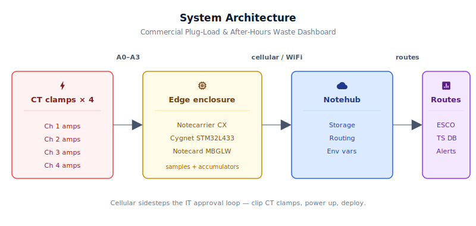
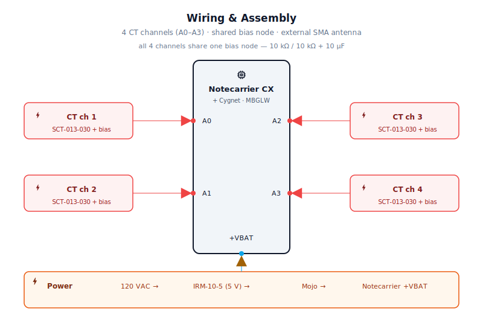
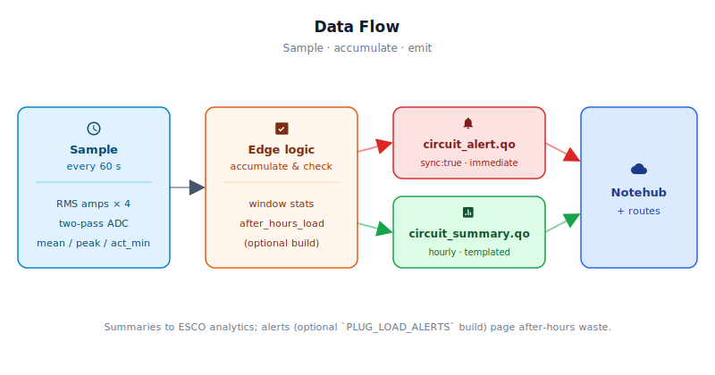

# Commercial Plug-Load & After-Hours Waste Dashboard

<Note>

This reference application is intended to provide inspiration and help you get started quickly. It uses specific hardware choices that may not match your own implementation. Focus on the sections most relevant to your use case. If you'd like to discuss your project and whether it's a good fit for Blues, [feel free to reach out](https://blues.com/landing-pages/accelerators-contact-us/?accelerator=Commercial%20Plug-Load%20%26%20After-Hours%20Waste%20Dashboard).

</Note>

A cellular-connected [energy savings](https://blues.com/energy-savings/) monitor that clips non-invasive **CT** (current transformer) clamps onto branch circuits in a commercial sub-panel, samples RMS current once a minute, and transmits hourly per-circuit profiles to [Notehub](https://notehub.io) — giving energy consultants a view into which circuits are burning money at 2 AM, without ever touching the building's corporate network.

## 1. Project Overview


**The problem.** In most commercial buildings, HVAC systems are heavily instrumented and often metered. Plug loads — the miscellaneous branch circuits feeding workstations, monitors, task lighting, small appliances, AV equipment, server closets, and vending machines — are usually invisible. A typical mid-size office building has 50 to 200 branch circuits on its sub-panels. A meaningful fraction of them are drawing load around the clock when they shouldn't be: workstations that employees never shut down, vending machines that never sleep, building signage that runs from midnight to 5 AM, and network closets cooling equipment that was decommissioned two years ago but never unplugged.

An **ESCO** (Energy Service Company) or independent energy consultant is usually the right party to find and quantify this waste. They're hired specifically to audit the building and identify savings opportunities that the building owner can't see on their own. The problem is that ESCOs often can't deploy anything. Corporate IT departments view unmanaged IoT devices on the production WiFi as a security risk, and getting a new device approved and connected can take weeks or months. By the time the network form is processed, the consulting engagement has moved on, or the engagement's momentum has stalled. The ESCO ends up estimating plug loads from utility bills and walkthrough surveys instead of measuring them directly.

**Why Notecard.** Cellular sidesteps the IT approval loop entirely. The Notecard Cell+WiFi connects to the public cellular network — not the building LAN — and needs no credentials, no VLAN, no firewall exception, and no IT ticket. Practically, this means the energy consultant shows up, clips CT clamps around four branch-circuit hot legs, and powers up the device — sampling starts on the very first 60-second wake. The first `circuit_summary.qo` note lands in Notehub on the next hourly outbound sync, so expect to see data within the first hour of installation. For faster commissioning visibility, set `report_interval_min=5` in Notehub before first power-up — env vars pre-provisioned in Notehub are delivered to the Notecard's local cache on the first successful cellular sync, and the firmware applies them on the next host wake after that sync. If the device is already powered and running, the firmware configures `inbound:360` (6-hour cadence), so a value changed in Notehub after boot will not reach the device for up to 6 hours. Notehub-terminal commands face the same constraint — they are queued for the Notecard's next scheduled inbound window and cannot wake a sleeping periodic device on demand. To push a change right away on an already-running device, connect a USB cable on-site, flip the Notecarrier CX DIP switch to `NC` (routes USB serial directly to the Notecard), and issue `{"req":"hub.sync"}` over the serial connection to trigger an immediate bidirectional session. There's no network form to fill out, and no dependency on whoever manages the building's IT infrastructure. This is the deployment model cellular-first IoT was designed for: getting sensors into places where a normal network connection would take longer to provision than the entire project.

The Notecard Cell+WiFi variant also retains WiFi as a fallback, so a site that does offer accessible WiFi can use it — without compromising the cellular-first deployment model for sites that don't.

**Deployment scenario.** A small weatherproof enclosure mounted inside or adjacent to the target sub-panel. CT clamps clip around individual branch-circuit hot wires at the sub-panel — no wire cutting, no circuit interruption. The enclosure draws 5V DC from a compact AC/DC supply tapped at the panel feed. All panel work — including placing CT clamps inside the panel enclosure and landing the AC/DC supply on panel power — must be performed by a qualified person following site lockout/tagout procedures and applicable electrical codes. Once the enclosure is powered and in place, the CT clamps themselves clip on and off the circuit conductors without any further contact with live conductors, but the initial installation is not a DIY task. A typical engagement deploys one unit per sub-panel, leaving it in place for two to four weeks to capture enough time-of-day variation for the cloud classifier to build a reliable load profile per circuit.

## 2. System Architecture




**Device-side responsibilities.** The onboard Cygnet STM32L433 host on the Notecarrier CX wakes every 60 seconds via [`card.attn`](https://dev.blues.io/api-reference/notecard-api/card-requests/#card-attn), reads RMS current on up to four CT channels (A0–A3), accumulates per-circuit mean, peak, and active-minute statistics, and queues a `circuit_summary.qo` note once per reporting window. The host then serializes its state into Notecard flash via `NotePayloadSaveAndSleep` and cuts its own power rail until the next wake.

**Notecard responsibilities.** The Notecard stores [Notes](https://dev.blues.io/api-reference/glossary/#note) locally in its on-device queue and establishes a cellular or WiFi session on the configured [`hub.set`](https://dev.blues.io/api-reference/notecard-api/hub-requests/#hub-set) `outbound` cadence (default 60 minutes). The Notecard also handles [environment variable](https://dev.blues.io/guides-and-tutorials/notecard-guides/understanding-environment-variables/) delivery from Notehub — operators can adjust thresholds, circuit count, and sampling cadence in the field without re-flashing firmware.

**Notehub responsibilities.** The Notecard manages its own cellular session against the supported carrier networks worldwide via its embedded global SIM and delivers data to Notehub over the Internet; [Notehub](https://notehub.io) ingests events, stores every event, and applies project-level routes. `circuit_summary.qo` hourly records are the primary output; they route to the time-series database or analytics platform where the ESCO's dashboard lives. A single firmware image services deployments at multiple buildings; [Smart Fleets](https://dev.blues.io/notehub/notehub-walkthrough/#using-smart-fleet-rules) on Notehub allow per-building environment variables (time zone, business hours, CT model) without maintaining per-site firmware variants.

**Routing to the cloud (high level).** Notehub supports HTTP, MQTT, AWS, Azure, GCP, Snowflake, and other destinations; route setup is project-specific. See the [Notehub routing docs](https://dev.blues.io/notehub/notehub-walkthrough/#routing-data-with-notehub). The natural downstream for `circuit_summary.qo` is a time-series database or analytics platform where load-profile classification and dashboarding live — these are project-specific downstream integrations outside the scope of this reference design.

## 3. Technical Summary


After completing this README and deploying the firmware, you will have:
- A Notecarrier CX running the plug-load monitor sketch, sampling four branch circuits at 60-second intervals.
- One hourly `circuit_summary.qo` note per device arriving in Notehub, carrying per-circuit mean RMS amps, peak RMS amps, and active-minutes (sample JSON below).
- Optional: after-hours `circuit_alert.qo` notes (real-time, `sync:true`) if you uncomment `PLUG_LOAD_ALERTS` in the firmware.
- Environment variables editable in the Notehub Fleet UI (no firmware re-flash) to adjust thresholds and timing on running devices.

**Example `circuit_summary.qo` from Notehub:**
```json
{
  "file": "circuit_summary.qo",
  "when": 1704067200,
  "body": {
    "ch1_mean": 8.4,
    "ch1_peak": 14.1,
    "ch1_act_min": 58.0,
    "ch2_mean": 0.1,
    "ch2_peak": 0.3,
    "ch2_act_min": 0.0,
    "ch3_mean": 12.7,
    "ch3_peak": 15.9,
    "ch3_act_min": 60.0,
    "ch4_mean": -9999.0,
    "ch4_peak": -9999.0,
    "ch4_act_min": -9999.0,
    "samples": 60
  }
}
```
All values are RMS amps except `samples` (count) and `act_min` (minutes above idle threshold). Any field equal to `-9999.0` means that channel's CT was not installed.

Here is a sample Note this device emits:

```json
{
  "file": "circuit_summary.qo",
  "when": 1704067200,
  "body": {
    "ch1_mean": 8.4,
    "ch1_peak": 14.1,
    "ch1_act_min": 58.0,
    "ch2_mean": 0.1,
    "ch2_peak": 0.3,
    "ch2_act_min": 0.0,
    "ch3_mean": 12.7,
    "ch3_peak": 15.9,
    "ch3_act_min": 60.0,
    "ch4_mean": -9999.0,
    "ch4_peak": -9999.0,
    "ch4_act_min": -9999.0,
    "samples": 60
  }
}
```

## 4. Hardware Requirements


| Part | Qty | Rationale |
|------|-----|-----------|
| [Notecarrier CX](https://shop.blues.com/products/notecarrier-cx?utm_source=dev-blues&utm_medium=web&utm_campaign=store-link) | 1 | Integrated carrier with an embedded Cygnet STM32L433 host — no separate MCU required. Exposes six analog inputs (A0–A5) on its dual 16-pin headers, four of which are used for CT channels. |
| [Notecard Cell+WiFi (MBGLW)](https://shop.blues.com/products/notecard?utm_source=dev-blues&utm_medium=web&utm_campaign=store-link) ([datasheet](https://dev.blues.io/datasheets/notecard-datasheet/note-mbglw/)) | 1 | Cellular-first connectivity removes any dependency on site WiFi or LAN. The onboard WiFi radio is available as an opportunistic fallback. Ships with an active global SIM including 500 MB and 10 years of service. |
| External cellular antenna, SMA, ~1 m lead (e.g. [SparkFun WRL-14987](https://www.sparkfun.com/products/14987)) | 1 | Required whenever the enclosure is mounted inside or adjacent to a metal sub-panel. A chip or flexible antenna left inside metalwork will not sustain reliable cellular connectivity. The SMA connector threads onto a bulkhead fitting threaded through a cable gland so the antenna element sits outside the metal. |
| u.FL to SMA-female bulkhead pigtail, ~10–15 cm | 1 | Routes the Notecard's `MAIN` u.FL cellular port to the SMA bulkhead fitting on the enclosure wall. Keep as short as practical to minimise cable loss. |
| [Blues Mojo](https://shop.blues.com/products/mojo?utm_source=dev-blues&utm_medium=web&utm_campaign=store-link) | 1 | Coulomb counter for bench-level power validation; confirms the sleep/wake pattern is behaving as designed before field deployment. |
| SCT-013-030 split-core CT, 30 A / 1 V (e.g. [SparkFun SEN-11005](https://www.sparkfun.com/products/11005)) | 4 | Non-invasive clamp-on current sensing — clips around the hot wire without breaking the circuit. The `-030` (1 V) variant has an internal burden resistor, so no external burden components are needed. 30 A rating covers standard 15 A and 20 A branch circuits with headroom; the `ct_full_scale_amps` env var re-scales if a different CT model is used. |
| TRRS 3.5 mm breakout (e.g. [SparkFun BOB-11570](https://www.sparkfun.com/products/11570)) | 4 | The SCT-013-030 output cable terminates in a 3.5 mm TRRS plug. One breakout per CT brings the tip (signal) and sleeve (return) to screw-terminal connections. |
| 10 kΩ 1% resistor (bias divider) | 2 | A two-resistor voltage divider between +3V3 and GND creates the shared bias mid-point (≈1.65 V) that all four CT channels reference. Deriving the bias from on-board 3.3 V keeps the signal centred in the ADC input range. |
| 10 µF electrolytic capacitor | 1 | Decoupling on the shared bias node; suppresses divider noise that would otherwise add a low-frequency artifact to every RMS measurement. |
| AC/DC supply, 5 V / 2 A (e.g. [MeanWell IRM-10-5](https://www.meanwell.com/Upload/PDF/IRM-10/IRM-10-SPEC.PDF)) | 1 | Derives 5 V DC from the 120 VAC panel feed for permanent, grid-tied power. A 2 A (10 W) rating is appropriate for a cellular design: the MBGLW's LTE Cat-1 bis modem (Quectel EG915 family) draws ~250 mA average during a session, and modem attach plus brief 2G/GSM-fallback transmit bursts in marginal-coverage areas can pull current well above that average from the 5 V rail during radio warm-up. An undersized supply that cannot source those peaks risks a brownout that aborts the cellular session. The IRM-10-5's 10 W output provides adequate headroom for the Notecard's peak draw, the host MCU active phase, and installation-environment margin. |
| NEMA 4X enclosure, ~6×4×2″ | 1 | Encloses the electronics near the sub-panel; NEMA 4X rating handles the occasional humidity and spray found in mechanical rooms and utility corridors. |

All Blues hardware ships with an active SIM including 500 MB of data and 10 years of service — no activation fees, no monthly commitment.

## 5. Wiring and Assembly




All host I/O lands on the [Notecarrier CX](https://dev.blues.io/datasheets/notecarrier-datasheet/notecarrier-cx-v1-3/) dual 16-pin header. The Notecard Cell+WiFi seats in the carrier's M.2 slot. Mojo sits inline between the 5 V supply output and the Notecarrier's `+VBAT` pad.

> **Antenna placement.** The Notecard Cell+WiFi's cellular port is a u.FL connector (`MAIN`). For any installation inside or adjacent to a metal sub-panel or enclosure, connect a short u.FL-to-SMA-female bulkhead pigtail to the Notecard's `MAIN` u.FL port, thread the SMA bulkhead fitting through a cable gland in the enclosure wall, and screw the external cellular antenna onto the SMA fitting on the outside of the enclosure. A chip or flexible antenna left inside a metal enclosure will not maintain a reliable cellular link. The onboard WiFi chip antenna is similarly blocked by metalwork; if WiFi fallback matters at a given site, route a second u.FL pigtail from the Notecard's WiFi port to a second external antenna via the same cable-gland approach.

<Warning>

**Safety.** Sub-panels contain hazardous voltages. CT installation must be performed by a qualified person following site lockout/tagout procedures and applicable electrical codes. The CT clamps themselves are non-invasive and do not require breaking or de-energizing the circuit being monitored. The AC/DC supply wiring *does* require connection to live conductors — always de-energize the panel before making line-voltage connections.

</Warning>

**Shared bias circuit (build this once for all four channels):**

1. Connect **+3V3** (Notecarrier CX header) → 10 kΩ R1 → **BIAS NODE**.
2. Connect **BIAS NODE** → 10 kΩ R2 → **GND**.
3. Connect the 10 µF capacitor from **BIAS NODE** to **GND** (electrolytic, positive lead to BIAS NODE).
4. The BIAS NODE voltage will sit at approximately 1.65 V (half of 3.3 V). This is the common return reference for all four CT channels.

**Per-channel CT connection (repeat for each CT):**

- TRRS breakout **TIP** terminal → Notecarrier CX analog pin (**A0** for ch1, **A1** for ch2, **A2** for ch3, **A3** for ch4).
- TRRS breakout **SLEEVE** terminal → **BIAS NODE** (the shared mid-point from above).
- Plug the SCT-013-030's 3.5 mm TRRS cable into the breakout's jack.
- Clip the CT clamp around **one** hot leg of the branch circuit to monitor. Clamping both legs of a single-phase 240 V circuit cancels the measurement — monitor one leg only per circuit.

**Power and Mojo:**

- 120 VAC feed from panel → MeanWell IRM-10-5 → **5 V DC output**.
- Mojo `BAT` input ← 5 V DC output.
- Mojo `LOAD` output → Notecarrier CX **+VBAT** pad.
- Mojo Qwiic connector → Notecarrier CX Qwiic port (reports cumulative mAh to the Notecard for bench validation).

Set the Notecarrier CX DIP switch to `HST` to route USB Serial to the onboard Cygnet host during firmware flashing and debug; flip to `NC` to route USB Serial to the Notecard for direct API testing.

## 6. Notehub Setup


1. **Create a project.** Follow [Notehub quickstart](https://dev.blues.io/quickstart/notecard-quickstart/notecard-and-notecarrier-pi/#set-up-notehub) if not already done.

2. **Claim the Notecard and create a Fleet.** Power the enclosure. On first cellular session, the Notecard associates with your project automatically. Create a [Fleet](https://dev.blues.io/guides-and-tutorials/fleet-admin-guide/) per building site (one fleet = one sub-panel deployment location). [Smart Fleets](https://dev.blues.io/notehub/notehub-walkthrough/#using-smart-fleet-rules) allow per-site environment variables without maintaining per-device firmware variants.

3. **Pre-provision environment variables (commissioning best practice).** Navigate to **Projects → [Your Project] → Fleets → [Your Fleet] → Environment** and add any non-default variables *before powering up the device for the first time*. This way they are delivered to the Notecard's local cache on the first successful cellular sync. All variables below are optional; firmware defaults are shown.

   **Sync timing:** The firmware configures `inbound:360`, meaning the Notecard checks Notehub for updated env vars every 6 hours. A variable changed in Notehub after the device is already running will not take effect until that next inbound sync. To force an immediate env-var pickup on an already-running device, connect a USB cable on-site, flip the Notecarrier CX DIP switch to `NC` (routes USB serial directly to the Notecard), and issue `{"req":"hub.sync"}` over the serial connection to trigger an immediate bidirectional session.

   | Variable | Default | Purpose |
   |---|---|---|
   | `sample_interval_sec` | `60` | Seconds between CT readings. Lowering this increases time resolution at the cost of host processor energy per hour; summary transmission volume is unchanged (one note per `report_interval_min` regardless of sample rate). |
   | `report_interval_min` | `60` | Minutes between `circuit_summary.qo` notes. Also updates the Notecard's `hub.set` outbound interval so the two stay in sync. |
   | `circuit_count` | `4` | Number of CT clamps installed (1–4). Channels above this count are not read and appear as `-9999` (no data) in summary notes. If `circuit_count` is reduced while a summary window is already in progress, any samples already accumulated for the now-disabled channels are still emitted in the next summary; the change takes full effect at the following window boundary. |
   | `idle_threshold_amps` | `0.50` | RMS amps below which a circuit is treated as "off" for active-minute counting. Adjust upward if the leakage floor of a specific circuit generates false activity counts. |
   | `ct_full_scale_amps` | `30.0` | Full-scale primary current of the installed CT model. Override if using a different CT (e.g. `20.0` for a 20 A model). |

   The following variables are only read by the firmware when `PLUG_LOAD_ALERTS` is defined in `firmware/plug_load_monitor/plug_load_monitor_helpers.h` (see §7). They have no effect in the default build.

   | Variable | Default | Purpose (`PLUG_LOAD_ALERTS` builds only) |
   |---|---|---|
   | `after_hours_threshold_amps` | `2.0` | RMS amps above which an after-hours alert fires on a circuit that should be off. |
   | `biz_hours_start` | `8` | Local hour (0–23, inclusive) at which business hours begin. After-hours detection is inactive at or after this hour. |
   | `biz_hours_end` | `18` | Local hour (0–23, exclusive) at which business hours end. |
   | `tz_offset_hours` | `0` | **Whole-integer** hours offset from UTC to convert Notecard timestamps to local time for business-hours evaluation. For US Eastern Standard Time use `-5`; Eastern Daylight Time use `-4`. The firmware stores this value as `int8_t` and does integer arithmetic; sites in half-hour (e.g. India IST UTC+5:30) or 45-minute (e.g. Nepal UTC+5:45) offset zones are not supported — business-hours windows will be evaluated incorrectly at those sites. |
   | `alert_cooldown_min` | `60` | Minimum minutes between repeat after-hours alerts on the same circuit. Prevents alert fatigue on a circuit that holds a sustained load throughout the night. |

4. **Configure data routes (Projects → Data & Routing).** Add a [route](https://dev.blues.io/notehub/notehub-walkthrough/#routing-data-with-notehub) for `circuit_summary.qo` (batched hourly records — forward to a time-series database or analytics platform for load-profile classification). If building with `PLUG_LOAD_ALERTS` enabled, add a second route for `circuit_alert.qo` — low-volume, time-sensitive records forwarded to an email, Slack, or CMMS destination.

## 7. Firmware Design


Three files in `firmware/`:

| File | Role |
|---|---|
| [`plug_load_monitor.ino`](firmware/plug_load_monitor/plug_load_monitor.ino) | Arduino sketch — `setup()` and `loop()`, global variable definitions, sleep/wake orchestration |
| [`plug_load_monitor_helpers.h`](firmware/plug_load_monitor/plug_load_monitor_helpers.h) | Shared constants, types, `extern` declarations, function prototypes, and feature flags (`PLUG_LOAD_DEBUG`, `PLUG_LOAD_ALERTS`) |
| [`plug_load_monitor_helpers.cpp`](firmware/plug_load_monitor/plug_load_monitor_helpers.cpp) | All helper implementations — hub config, template registration, env-var fetch, CT measurement, note emission |

**Dependencies:**
- Arduino core for STM32 ([`stm32duino/Arduino_Core_STM32`](https://github.com/stm32duino/Arduino_Core_STM32)).
- [`Blues Wireless Notecard`](https://github.com/blues/note-arduino) (`note-arduino` library). Install via the Arduino Library Manager (`arduino-cli lib install "Blues Wireless Notecard"`). Verify the latest version at the [note-arduino releases page](https://github.com/blues/note-arduino/releases).

**Optional alert extension.** The `PLUG_LOAD_ALERTS` flag in `plug_load_monitor_helpers.h` is commented out by default. Uncommenting it adds the `circuit_alert.qo` Notefile: a `note.template` registration, a `card.time` call each wake, business-hours evaluation, and an immediate `sync:true` alert note when a circuit exceeds `after_hours_threshold_amps` outside business hours. The baseline build (flag undefined) compiles none of this code — no extra I²C calls, no second Notefile, no unscheduled cellular sessions.

### Modules

| Responsibility | Where |
|---|---|
| Notecard hub configuration (`hub.set`, outbound cadence) | `hubConfigure` |
| Note template registration (`circuit_summary.qo`) | `defineTemplates` |
| Accelerometer quiesce on first boot (`card.motion.mode`) | `setup()` |
| Env-variable fetch and local config update | `fetchEnvOverrides` |
| Per-channel RMS current measurement | `readChannelAmpsRMS` |
| Per-cycle accumulation and summary trigger | `runSampleCycle` |
| Summary note emission and window reset | `sendSummary` |
| Sleep/wake state serialization | `setup` / `loop` via `NotePayloadSaveAndSleep` |
| After-hours time-of-day check _(requires `PLUG_LOAD_ALERTS`)_ | `isAfterHours` |
| Immediate after-hours alert emission _(requires `PLUG_LOAD_ALERTS`)_ | `sendAlert` |

### Sensor reading strategy

Each CT channel uses a two-pass ADC approach lifted directly from the Open Energy Monitor technique. In the first pass, `CT_BIAS_SAMPLES` (256) readings are averaged to measure the actual DC offset of the bias network — the shared voltage divider is nominally at 1.65 V, but real-world resistor tolerances mean deriving the offset empirically is more accurate than assuming it. In the second pass, `CT_RMS_SAMPLES` (1480) readings have the DC offset subtracted, are squared and summed, then divided and square-rooted to produce an RMS count value. That count converts to volts at 3.3 V / 4095 counts, then scales to amps at 30 A per 1 V RMS (the SCT-013-030 rated output). The 1480-sample window is an empirically chosen RMS measurement window; actual elapsed time and mains-cycle coverage depend on the platform's ADC conversion timing, which varies across STM32 Arduino core configurations and clock speeds. The window is sufficient for a stable single-sample RMS estimate in practice, but exact cycle coverage should be bench-validated on the target hardware build rather than assumed from the sample count alone.

The 12-bit ADC on the STM32L433 is enabled explicitly with `analogReadResolution(12)` in `setup()` — the Arduino STM32 core defaults to 10-bit if this call is omitted, which would reduce current-sensing resolution by 4×.

### Event payload design

Two [template-backed](https://dev.blues.io/notecard/notecard-walkthrough/low-bandwidth-design#working-with-note-templates) Notefiles. Templates store records as fixed-length binary rather than free-form JSON, reducing on-wire size roughly 3–5× — material for a device transmitting 24 summary notes per day per panel over a multi-month engagement.

`circuit_summary.qo` (hourly):

```json
{
  "file": "circuit_summary.qo",
  "body": {
    "ch1_mean": 8.4,
    "ch1_peak": 14.1,
    "ch1_act_min": 58.0,
    "ch2_mean": 0.1,
    "ch2_peak": 0.3,
    "ch2_act_min": 0.0,
    "ch3_mean": 12.7,
    "ch3_peak": 15.9,
    "ch3_act_min": 60.0,
    "ch4_mean": -9999.0,
    "ch4_peak": -9999.0,
    "ch4_act_min": -9999.0,
    "samples": 60
  }
}
```

Here all three ch4 fields carry `-9999.0` (the `INVALID_SENTINEL`) because `circuit_count` is set to `3` for this deployment — only three CT clamps are installed. When `n_arms[ch] == 0` (no valid samples taken for that channel during the window), the firmware emits `INVALID_SENTINEL` for `chN_mean`, `chN_peak`, **and** `chN_act_min`. Downstream consumers must treat any field equal to `-9999.0` as "no data" rather than as a zero-amp or zero-minute reading.

`act_min` is derived from thresholded one-minute snapshots, not from continuous waveform occupancy measurement: each sample whose RMS current meets or exceeds `idle_threshold_amps` contributes `sample_interval_sec` seconds (default 60 s) to the active total, which is then divided by 60 at emit time. A circuit that is active for only part of a sample interval scores identically to one active for the whole interval.

> **`circuit_alert.qo` (immediate, `sync:true`) — requires `PLUG_LOAD_ALERTS`:** When the alert extension is enabled by defining `PLUG_LOAD_ALERTS` in `plug_load_monitor_helpers.h`, the firmware also emits a second Notefile for real-time notification. The template registration, `sendAlert()` function, `notecardEpoch()`, `isAfterHours()`, and the alert-gating block in `runSampleCycle()` are all gated on `#ifdef PLUG_LOAD_ALERTS` in `plug_load_monitor_helpers.cpp`. The core summary stream is identical whether or not the alert extension is compiled in.
>
> ```json
> {
>   "file": "circuit_alert.qo",
>   "body": {
>     "circuit": 3,
>     "arms": 12.7,
>     "alert_type": "after_hours_load",
>     "hour_local": 2
>   }
> }
> ```
>
> The `hour_local` field carries the firmware's local-time computation (UTC plus `tz_offset_hours`) so the alert is immediately human-readable in Notehub without knowing the site's time zone configuration.

### Low-power strategy

Even though the enclosure is grid-tied to 120 VAC, the host runs in deep sleep between samples. After each sample cycle the host calls `NotePayloadSaveAndSleep`, which serializes the `AppState` struct into Notecard flash and issues [`card.attn`](https://dev.blues.io/api-reference/notecard-api/card-requests/#card-attn) to cut the host power rail for `sample_interval_sec` seconds. The Notecard itself enters its [low-power idle state](https://dev.blues.io/notecard/notecard-walkthrough/low-power-design/) (~8–18 µA @ 5 V) between cellular sessions. Sampling and transmitting are deliberately decoupled: the host wakes every 60 seconds but the Notecard only opens a cellular session once an hour. When the `PLUG_LOAD_ALERTS` extension is enabled, alert notes carry `sync:true`, bypassing the hourly window so a 2 AM anomaly pages immediately rather than waiting until the next scheduled session — but this is not active in the default build.

When ATTN is not gating host power — typical of bench setups over USB without the full Notecarrier CX power path active — `NotePayloadSaveAndSleep` returns without cutting the rail and `loop()` drives the sample cadence itself: it waits `sample_interval_sec` seconds, re-reads env vars, and calls `runSampleCycle()` before the next sleep attempt. The accumulation, alert, and summary logic are identical on both paths.

Running the host asleep between samples also keeps the design portable: the same firmware runs identically from a small backup battery or a solar cell if the site ever requires that.

### Retry and error handling

- The first `hub.set` call uses `sendRequestWithRetry(req, 10)` with a 10-second window. This covers the cold-boot I²C race condition documented in the `note-arduino` library where the host comes up before the Notecard's I²C peripheral is ready.
- `readChannelAmpsRMS` clamps its return value to zero if the computed value is negative (a defensive guard; the sqrt-based computation will not naturally produce a negative result under normal ADC conditions). A CT that is plugged in but clamped around a conductor carrying near-zero current reads near zero — the CT output shorts tip to sleeve at the bias potential, so the bias-subtracted RMS is genuinely small. By contrast, a CT cable that is *unplugged* leaves the analog input floating: with no drive path to the bias node, the pin can pick up arbitrary levels through stray 60 Hz capacitive coupling from the panel environment and produce large or erratic ADC readings, not a predictable near-zero floor. There is no explicit per-channel fault-detection mechanism in this firmware; open-input and zero-load conditions are not distinguished.
- The `INVALID_SENTINEL` (`-9999.0`) value in summary notes is emitted only when `n_arms[ch] == 0` at summary time. In practice, every configured channel receives a read on every wake cycle, so this guard is rarely reached; its primary purpose is to protect the `safeAvg` helper against a logic fault where a channel is skipped entirely. Downstream consumers should not treat it as a per-sample sensor-fault indicator.
- `fetchEnvOverrides` makes up to two attempts (an initial request and one retry after a 250 ms pause) to absorb transient Notecard I²C hiccups at wake. On success, the effective configuration is captured into `AppState.saved_cfg` and persisted alongside the accumulator state in the `NotePayloadSaveAndSleep` payload. On subsequent wakes the saved configuration is restored from `saved_cfg` *before* `fetchEnvOverrides` is called, so a transient I²C failure retains the last known-good values rather than silently reverting to compile-time defaults for that cycle. On cold boot, `env.get` returns an empty body because the Notecard's local cache is not yet populated — the device runs on compile-time defaults for that first wake. Env vars pre-provisioned in Notehub before power-up reach the Notecard's local cache during the first successful cellular sync; `fetchEnvOverrides` picks them up on the next host wake after that sync, and if `report_interval_min` changed, `hubConfigure` re-applies the new outbound cadence immediately. Note that `hubConfigure` sets `inbound:360`, meaning the Notecard pulls fresh env vars from Notehub only every 6 hours. An env var changed in Notehub while the device is already running will not appear on the device until that next inbound sync fires — it does not take effect on the next 60-second host wake. To push a change sooner, connect a USB cable on-site, flip the Notecarrier CX DIP switch to `NC`, and issue `{"req":"hub.sync"}` directly over the serial connection — Notehub-terminal commands are subject to the same `inbound:360` delivery window and cannot trigger an immediate sync on a sleeping periodic device.
- `defineTemplates` is called unconditionally at every boot — `note.template` is idempotent, so re-issuing it on an intact Notecard is a no-op. Re-issuing after a Notecard factory reset or card replacement restores the fixed-schema binary encoding before any `note.add` calls reach the Notecard, eliminating the window where notes could be queued against a missing template. Template-confirmation flags are tracked **per Notefile** (`g_summary_template_applied`, and `g_alert_template_applied` in `PLUG_LOAD_ALERTS` builds): a transient I²C failure registering one template does not gate emission on the other Notefile. Both flags are non-persisted per-boot variables; they are not stored in `AppState` because a host-side boolean cannot reliably reflect Notecard state across a card reset or swap.
- Per-channel alert cooldowns (`alert_last_unix[]`) are persisted across sleep cycles in the `AppState` payload, so a circuit that fires an alert at 23:55 cannot fire again until `alert_cooldown_min` has elapsed regardless of how many sleep boundaries fall in between.

### Key code snippet 1: template definition

The template tells the Notecard the fixed schema for summary records. `14.1` encodes a 4-byte IEEE 754 float; `12` encodes a 2-byte signed integer. Every field name here must exactly match the `note.add` body fields in `sendSummary`.

```cpp
J *req = notecard.newRequest("note.template");
JAddStringToObject(req, "file", "circuit_summary.qo");
JAddNumberToObject(req, "port", 50);
J *body = JAddObjectToObject(req, "body");
JAddNumberToObject(body, "ch1_mean",    14.1);
JAddNumberToObject(body, "ch1_peak",    14.1);
JAddNumberToObject(body, "ch1_act_min", 14.1);
// ... repeated for ch2–ch4 ...
JAddNumberToObject(body, "samples",     12);
notecard.sendRequest(req);
```

### Key code snippet 2: immediate-sync alert (PLUG_LOAD_ALERTS builds only)

`sync:true` tells the Notecard to open a session immediately rather than waiting for the next scheduled outbound window. When `PLUG_LOAD_ALERTS` is defined, an after-hours alert note arrives in Notehub within the session-establishment latency (~15–60 s) of the threshold trip. The full implementation lives in `plug_load_monitor_helpers.cpp` inside `#ifdef PLUG_LOAD_ALERTS` guards (`sendAlert()` and the alert-gating block inside `runSampleCycle()`).

```cpp
J *req  = notecard.newRequest("note.add");
JAddStringToObject(req, "file", "circuit_alert.qo");
JAddBoolToObject(req, "sync", true);
J *body = JAddObjectToObject(req, "body");
JAddNumberToObject(body, "circuit",    (int)circuit_1based);
JAddNumberToObject(body, "arms",       arms);
JAddStringToObject(body, "alert_type", "after_hours_load");
JAddNumberToObject(body, "hour_local", hour_local);
notecard.sendRequest(req);
```

### Key code snippet 3: two-pass RMS measurement

```cpp
// Pass 1: measure DC bias offset
uint32_t acc = 0;
for (uint16_t i = 0; i < CT_BIAS_SAMPLES; i++) acc += analogRead(pin);
int32_t dc_offset = (int32_t)(acc / CT_BIAS_SAMPLES);

// Pass 2: compute RMS of the AC component
uint64_t sum_sq = 0;
for (uint16_t i = 0; i < CT_RMS_SAMPLES; i++) {
    int32_t s = (int32_t)analogRead(pin) - dc_offset;
    sum_sq += (uint64_t)((int64_t)s * s);
}
float rms_counts = sqrtf((float)sum_sq / (float)CT_RMS_SAMPLES);
float rms_v      = rms_counts * ADC_VREF_V / (float)ADC_COUNTS;
float arms       = rms_v * (CFG_CT_FULL_SCALE_AMPS / CT_VOUT_AT_FULL_SCALE);
```

### Key code snippet 4: sleep between samples

```cpp
NotePayloadDesc payload = {0, 0, 0};
NotePayloadAddSegment(&payload, STATE_SEG_ID, &state, sizeof(state));
NotePayloadSaveAndSleep(&payload, CFG_SAMPLE_INTERVAL_SEC, NULL);
```

`NotePayloadSaveAndSleep` writes the `AppState` struct into Notecard's non-volatile storage and then issues `card.attn` to cut the host power rail. On the next wake, `NotePayloadRetrieveAfterSleep` + `NotePayloadGetSegment` rehydrates the state before any code in `setup()` runs.

## 8. Build and Flash


1. **Install the Arduino STM32 core and Notecard library:**
   ```bash
   arduino-cli core install STMicroelectronics:stm32
   arduino-cli lib install "Blues Wireless Notecard"
   ```

2. **Set your Notehub ProductUID.** Sign up at [notehub.io](https://notehub.io) and [create a project](https://dev.blues.io/quickstart/notecard-quickstart/notecard-and-notecarrier-pi/#set-up-notehub). Copy the [ProductUID](https://dev.blues.io/notehub/notehub-walkthrough/#finding-a-productuid) and paste it into `firmware/plug_load_monitor/plug_load_monitor_helpers.h` as `PRODUCT_UID`. (The define lives in the shared header so it is visible to both `.ino` and `.cpp` translation units.)

3. **Compile and flash.** Connect the Notecarrier CX via USB and set the DIP switch to `HST` (routes USB serial to the host MCU). Flash with:
   ```bash
   arduino-cli compile -b STMicroelectronics:stm32:Nucleo_L433RC_P \
     --build-properties build.extra_flags="-DNOTECARD_USE_SERIAL" \
     firmware/plug_load_monitor/plug_load_monitor.ino
   ```
   Follow the [stm32duino](https://github.com/stm32duino/Arduino_Core_STM32) upload instructions for your operating system (may require manual bootloader entry; consult the Notecarrier CX datasheet pin-out). Alternatively, use the Arduino IDE: open the sketch, select board `STMicroelectronics → STM32L4 Series → Nucleo L433RC (P)`, compile, and upload.

## 9. Data Flow




Every 60 seconds the host wakes, reads all active CT channels, and checks whether the hourly summary window has elapsed.

- **Collected (per wake, per channel).** Single-sample RMS amps. The sample is immediately accumulated into the rolling window; it is not individually transmitted.
- **Transmitted.**
  - `circuit_summary.qo` — one record every `report_interval_min` (default 60 min, 24 records/day/device). Each record carries mean RMS amps, peak RMS amps, and active-minutes for each of the four channels, plus total sample count. Active-minutes (`act_min`) is a thresholded sample-count estimate — each one-minute snapshot above `idle_threshold_amps` contributes one minute; it is not derived from continuous waveform analysis (see §6 for the precise computation). The Notecard's automatic UTC timestamp enables time-of-day analysis in the downstream system.
  - `circuit_alert.qo` — only present when `PLUG_LOAD_ALERTS` is defined. Emitted when `arms >= after_hours_threshold_amps` during non-business hours, with `sync:true` for immediate delivery. Rate-limited per channel to once per `alert_cooldown_min`. Not part of the default build.
- **Routed.** `circuit_summary.qo` records land in Notehub and route to a time-series store for load-profile classification. When `PLUG_LOAD_ALERTS` is enabled, `circuit_alert.qo` records route separately to a real-time channel.
- **Downstream classification.** A downstream classifier uses the rolling `circuit_summary.qo` stream to assign each circuit a sustained load profile — always-on, scheduled, or occupied-hours — based on how `act_min` and `mean` vary across the time-of-day distribution over the deployment period. Classification and dashboarding are project-specific integrations outside the scope of this reference design; see Appendix A.

## 10. Validation and Testing


**Expected steady-state cadence.** In a correctly-behaving deployment, one `circuit_summary.qo` note arrives in Notehub per hour per device. In a `PLUG_LOAD_ALERTS` build, the `circuit_alert.qo` file should be quiet during business hours; after-hours activity depends entirely on what the building's circuits are actually doing — an always-on server room generates a steady non-zero mean across all hours, while a circuit powering desktop workstations should trend toward zero after business hours. In the default build, `circuit_alert.qo` is never created.

**Bench first-light.** Before field deployment, verify the RMS readings make sense on the bench. Clamp one CT around a known load (a lamp, a fan, or a lab power supply with a known current draw), confirm the `ch1_mean` field in the first summary note is in the expected range, and verify that `ch1_act_min` equals the number of minutes the load was on during the window. To confirm the near-zero floor, plug a CT into its TRRS breakout and clip it around a conductor carrying no current (or a de-energized wire): with the CT plugged in but unloaded, the CT's internal burden resistor holds the tip close to the sleeve potential, so the bias-subtracted RMS should be stable and well below `idle_threshold_amps`. This is distinct from leaving the TRRS jack *unplugged* — with no CT inserted, the analog input floats and can produce large, erratic readings driven by stray 60 Hz capacitive pickup from the panel environment; do not use a floating-input reading as a "zero amps" baseline.

**Using Mojo to validate power behavior.** Mojo, wired inline at the Notecarrier CX `+VBAT` pad, measures the **whole powered subsystem** — Notecard plus Notecarrier CX on-board regulators — not the bare Notecard alone. The Notecard's published datasheet figures are shown for reference; expect the actual whole-assembly idle floor measured by Mojo to be somewhat higher than the bare Notecard figure, because the Notecarrier CX on-board LDOs draw quiescent current even when the host MCU power gate is open. During an active cellular session, the modem dominates and the whole-assembly reading tracks the datasheet value closely. Use Mojo to validate the *pattern* of power consumption rather than matching a single threshold against a Notecard-only spec.

| Phase | Notecard datasheet (bare Notecard only) |
|---|---|
| Deep sleep (radio off, host gated off) | ~8–18 µA @ 5 V — see [low-power design guide](https://dev.blues.io/notecard/notecard-walkthrough/low-power-design/) |
| Host awake, sampling 4 CT channels | — (host MCU run-mode + 4× ADC bursts, ~100–300 ms; consult the STM32L433 datasheet and confirm the actual whole-assembly figure with Mojo on your bench) |
| Cellular session (LTE Cat-1 bis, single note) | ~250 mA average; brief higher-current bursts during modem attach and any 2G/GSM-fallback transmit |

**After-hours alert testing (`PLUG_LOAD_ALERTS` builds only).** When `PLUG_LOAD_ALERTS` is defined and the firmware is rebuilt, `isAfterHours()` returns `false` whenever `card.time` reports epoch 0 — business-hours evaluation is inactive until the Notecard has acquired valid network time from a successful cellular (or WiFi) session. On first light or in a no-service bench environment, no after-hours alert will fire even if a circuit exceeds `after_hours_threshold_amps`. Confirm the device has appeared in Notehub (proving at least one successful session) before expecting after-hours alert behavior in testing. In the default build this function is not compiled and no alert testing is needed.

Splice the [Mojo](https://shop.blues.com/products/mojo?utm_source=dev-blues&utm_medium=web&utm_campaign=store-link) inline between the AC/DC supply output and the Notecarrier CX `+VBAT` pad. A healthy power trace should show: brief active pulses every 60 seconds (host awake and sampling, typically 1–3 seconds each) followed by a quiet low-current floor, then a longer, higher-current session once per hour when the Notecard transmits. If the trace shows no quiet floor between active phases — the current stays continuously elevated with no periodic drop — the host is likely not sleeping; the most common cause is `card.attn` not reaching the host EN pin correctly. If the current shows continuous high draw at all times, `hub.set` may still be in `continuous` mode from a prior bench session; with the Notecarrier CX DIP switch in `NC` mode, issue `{"req":"hub.set","mode":"periodic","outbound":60,"inbound":360}` directly over the USB serial connection to correct it.

## 11. Troubleshooting


**No Notehub activity after first power-up (no claims, no notes in Notehub, no LED activity on Notecard).**
- Confirm the external cellular antenna is screwed onto the SMA bulkhead on the enclosure exterior (not inside the metal panel). A chip or flexible antenna inside metalwork will not obtain a cellular lock.
- Check that the u.FL to SMA pigtail is securely seated on the Notecard's `MAIN` u.FL connector.
- Verify the Notecarrier CX DIP switch is not set to `HST` (which routes the host MCU's USB UART to debug); set it to a power-off state if not actively flashing. The default position routes 5V supply.
- If using WiFi fallback, verify the onboard WiFi antenna is unobstructed; the same metal-enclosure blocking applies.

**Non-zero RMS readings on a circuit with no load (CT plugged in, clamp on de-energized or zero-current wire).**
- This is normal. The CT's internal burden resistor holds the tip close to the bias node (≈1.65 V), so the RMS is small and stable — typically well below the idle threshold. This is distinct from an unplugged CT (next item).

**Erratic or large readings on one or more channels; no pattern to the values across samples.**
- Confirm the TRRS jack is **fully seated** in the breakout. A partially seated jack leaves the tip floating, allowing stray 60 Hz capacitive coupling from the panel environment to drive large, noisy ADC readings.
- Confirm the SLEEVE terminal is connected to the BIAS NODE. If the sleeve is floating or connected elsewhere, the AC signal has no return path and the ADC input can drift and pick up arbitrary noise.

**First summary note appears after many hours, not within the first hour.**
- The device defaults to a 60-minute reporting window. If powered mid-window, the first note arrives on the next hourly boundary (up to 60 min after power-up). To validate faster, set `report_interval_min=5` in Notehub *before* first power-up, then look for a summary note within 5 minutes of the device appearing in Notehub.

**Summary notes appear with expected values, but alerts (if using `PLUG_LOAD_ALERTS`) never fire.**
- Confirm `PLUG_LOAD_ALERTS` is uncommented in `firmware/plug_load_monitor/plug_load_monitor_helpers.h` before building.
- Verify the device has successfully claimed in Notehub (proves at least one cellular session). Business-hours evaluation requires valid network time from `card.time`, which only returns a meaningful epoch after the first successful cellular (or WiFi) sync.
- Confirm `biz_hours_start`, `biz_hours_end`, and `tz_offset_hours` are set correctly in the Fleet environment variables. By default, business hours are 8 AM–6 PM UTC (which is only meaningful if the building is in the UTC timezone).

## 12. Limitations and Next Steps


**Simplified for this proof-of-concept:**

- **Single-phase hot leg only.** Each CT clamp monitors one hot leg. A 240 V split-phase circuit (e.g., a large appliance or HVAC unit) requires two CTs and a current sum in firmware. Three-phase circuits need three CTs per circuit and are not supported in this design.
- **No actual wattage.** Without a voltage measurement, the firmware reports amps, not watts. True power (W) = V × A × power factor. Any wattage or kWh figure derived from amps alone requires site-specific voltage and power-factor assumptions; without direct measurement these estimates can be substantially wrong for mixed commercial plug loads, where power factor varies widely by device type. Treat amp-only energy calculations as rough order-of-magnitude indicators, not billable measurements. Adding true-power measurement requires an isolated voltage reference — via a low-ratio isolation transformer feeding the MCU ADC, or a dedicated energy-metering analog front end (AFE) with built-in isolation — along with phase-aligned sampling of voltage and current waveforms and power-factor computation. A resistive voltage divider from mains to the MCU ADC is not a safe path: it lacks the isolation required to protect the circuit and the installer from line voltage. One isolated voltage reference per phase is typically sufficient for all circuits on that phase, but the voltage and current samples must be time-synchronized for the power-factor computation to be accurate.
- **Up to four circuits.** The Notecarrier CX has six analog inputs (A0–A5); this design uses four (A0–A3). `MAX_CHANNELS` is hard-coded to `4`, and `circuit_count` is clamped to 1–4 in firmware; the `note.template` body and `sendSummary` field list define fields only for `ch1`–`ch4`. Extending to six circuits is a **firmware change**, not just a hardware change: the pin map, `MAX_CHANNELS` constant, state arrays (`sum_arms`, `peak_arms`, `n_arms`, `active_samples`, `alert_last_unix`), `note.template` body fields, `sendSummary` field list, and any downstream schema or dashboard that assumes four channels would all require updating. Two more CT + breakout pairs complete the hardware side.
- **Classifier is a downstream integration.** Building a deployable cloud function (e.g., AWS Lambda, Google Cloud Functions), connecting it to a time-series database, and wiring it to a dashboard is a project-specific integration step outside the scope of this reference design. The firmware correctly produces the `circuit_summary.qo` inputs that a classifier needs. When `PLUG_LOAD_ALERTS` is enabled: until a classifier is deployed and an allowlist of legitimately always-on circuits is established, `circuit_alert.qo` will fire for any circuit exceeding `after_hours_threshold_amps` at night, including server rooms, 24/7 signage, and other intentional always-on loads — expect false-positive alerts during the initial deployment period.
- **Business-hours detection uses simple hour-of-day (`PLUG_LOAD_ALERTS` only).** When the alert extension is enabled, after-hours detection is based on hour of day only; it does not account for weekends, holidays, or shift patterns. A more sophisticated implementation would pull a site calendar from an environment variable or a Notehub inbound note. Additionally, `tz_offset_hours` only supports whole-hour UTC offsets (stored as `int8_t`); sites in half-hour or 45-minute UTC-offset zones will have their business-hours windows evaluated incorrectly.
- **Mojo is bench equipment.** The firmware does not read the Mojo's LTC2959 coulomb counter over the Qwiic bus during normal operation. Adding a `mojo_mah` field to the summary note is a straightforward extension for deployments where fleet-level energy budgeting is valuable.
- **No explicit open-CT or stuck-channel detection.** The firmware does not distinguish between two distinct conditions: (a) a CT that is plugged in and clamped around a conductor carrying near-zero current, which legitimately reads near zero; and (b) a CT cable that is unplugged or an input channel that is otherwise open-circuit. An unplugged CT leaves the analog input floating — the sleeve's bias path is only present when the CT cable is seated in the TRRS jack — which means the floating pin can produce arbitrary, noisy ADC values driven by stray 60 Hz capacitive pickup, not a reliable near-zero floor. Without a defined pull from the analog input to the bias node (e.g. a weak bleed resistor across the TRRS tip-to-sleeve terminals on the breakout), open inputs are indistinguishable in firmware from genuine low-current readings. Production firmware should add open-channel detection — for example, a hardware pull to bias on the analog input side, or software checks for implausibly constant or erratic readings across many cycles — so operators can distinguish a sensor fault from a genuinely unloaded circuit.
- **SCT-013-030 accuracy is ±3% at rated current** per the datasheet, with reduced accuracy at low currents (below ~5% of full scale = 1.5 A for a 30 A clamp). Sub-1 A readings are indicative only.

**Production next steps:**

- **True-power measurement.** Add per-phase voltage sensing via an isolated voltage transformer or a dedicated energy-metering analog front end (AFE) with built-in isolation — not a direct resistive divider from mains to the MCU ADC, which lacks the isolation needed for safe mains-connected measurement. Implement phase-aligned voltage and current sampling plus a cos(φ) power-factor computation for actual watts and kWh. One isolated voltage reference per phase is typically sufficient for all circuits on that phase; the key requirement is that voltage and current samples are time-synchronized so the power-factor term is meaningful.
- **Extended CT range.** For sub-panels with 60 A or 100 A feeder circuits, substitute the SCT-013-060 (60 A / 1 V) or SCT-013-100 (100 A / 1 V) and update `ct_full_scale_amps` via env var — no firmware change required.
- **Weekend and holiday awareness.** Pass a site calendar or day-of-week bitmask as an environment variable so the `PLUG_LOAD_ALERTS` business-hours check respects Saturdays and Sundays.
- **Over-the-air firmware updates.** Wire the Cygnet's BOOT/RESET pins to Notecard ATTN for [Notecard Outboard DFU](https://dev.blues.io/notehub/host-firmware-updates/notecard-outboard-firmware-update/), enabling remote firmware pushes across the entire fleet without truck rolls.
- **Per-circuit calibration offset.** Store a small per-circuit zero-current offset in the env vars (measured at commissioning with the circuit breaker open) to subtract the noise floor from each channel's reading.

## 13. Summary


The fundamental insight here is that energy consultants already know how to find after-hours waste — they just can't deploy the sensors to measure it, because IT says no. A cellular Notecard removes that blocker completely. The consultant clips four CT clamps around branch-circuit hot wires, taps 120 VAC, and sampling starts immediately — with the first summary note delivered to Notehub on the next hourly outbound sync. No network form. No VLAN. No IT ticket that goes unanswered for six weeks.

The hardware is minimal — a Notecarrier CX, a Notecard Cell+WiFi, four SCT-013-030 split-core CTs, a shared two-resistor bias network, and a compact AC/DC supply. The CT measurement method is non-invasive: every clamp can be put on and taken off in seconds without breaking or de-energizing the monitored circuit. The firmware samples once a minute, transmits once an hour, and wakes the host only long enough to read the ADC before cutting power again; the Notecard sits at ~8–18 µA in between. The practical result is a deployment that can run for weeks without any on-site attention, accumulating enough hourly load-profile data to distinguish a workstation circuit that employees leave on from a server room that legitimately runs 24/7 — two circuits with very similar wattage signatures that look identical from the utility bill, but completely different when you see their 2 AM `act_min` trend.

---

## Appendix A: Downstream Classifier

Load-profile classification — tagging each branch circuit as always-on, scheduled, or occupied-hours — and dashboarding are downstream, project-specific integrations. They are not part of the delivered firmware artifact.

Route `circuit_summary.qo` events to the time-series database or analytics platform where the ESCO's dashboard lives. The `when` field in each routed event is a Unix epoch (UTC); any field equal to `-9999.0` (the firmware's `INVALID_SENTINEL`) means that channel's CT was not installed during the window and must be excluded from per-channel statistics rather than treated as a zero reading. See the [Notehub routing documentation](https://dev.blues.io/notehub/notehub-walkthrough/#routing-data-with-notehub) for step-by-step route configuration covering HTTP, MQTT, AWS, Azure, GCP, Snowflake, and other destinations.
