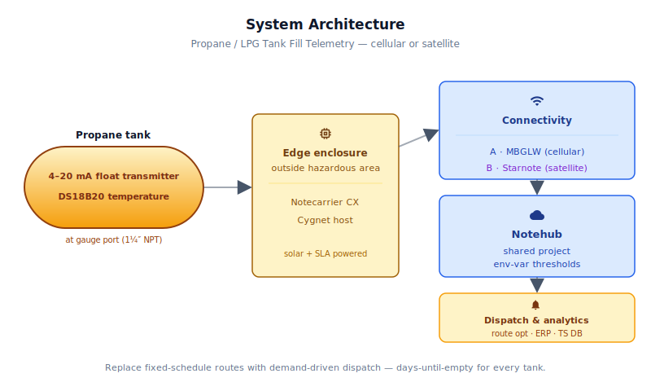
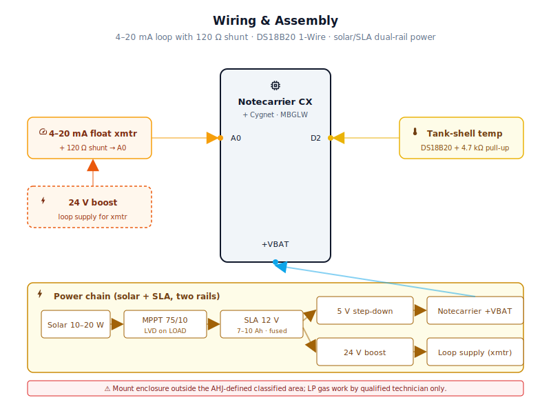
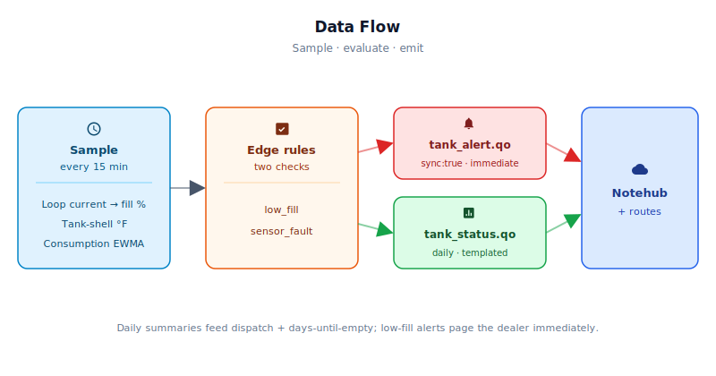

# Propane / LPG Tank Fill Telemetry — 4–20 mA Float-Transmitter Variant

<Note>

This reference application is intended to provide inspiration and help you get started quickly. It uses specific hardware choices that may not match your own implementation. Focus on the sections most relevant to your use case. If you'd like to discuss your project and whether it's a good fit for Blues, [feel free to reach out](https://blues.com/landing-pages/accelerators-contact-us/?accelerator=Propane%20%2F%20LPG%20Tank%20Fill%20Telemetry%20%E2%80%94%204%E2%80%9320%20mA%20Float-Transmitter%20Variant).

</Note>

This project is a [truck roll reduction](https://blues.com/truck-roll-reduction/) reference design that gives propane dealers per-tank fill telemetry across their entire delivery territory — replacing fixed-schedule routes with demand-driven dispatch and projecting days-until-empty for every tank in the fleet. A level sensor at the tank's existing gauge port and a temperature probe on the tank shell turn each tank into a self-reporting asset; a cellular [Notecard](https://shop.blues.com/products/notecard?utm_source=dev-blues&utm_medium=web&utm_campaign=store-link) carries the data, and an optional [Starnote](https://shop.blues.com/products/starnote?utm_source=dev-blues&utm_medium=web&utm_campaign=store-link) satellite module extends the same architecture to rural sites with no cellular coverage. Specific part numbers, gauge-port plumbing, and the wiring details land in §4 and §5 — the lead intentionally stays at the "what it does and why" level.

## 1. Project Overview


**The problem.** Most propane dealers still run their delivery routes on a fixed calendar: every six weeks, every tank gets a truck. That schedule exists not because it matches demand, but because dealers have no way to know which tanks actually need filling. The result is trucks rolling to tanks that are at 60 % (wasted capacity, wasted diesel) and tanks at remote farm properties that run dry between scheduled visits (angry customer, weekend emergency call). Neither failure is exotic — they're structural consequences of not having fill-level data.

The root cause is infrastructure. A propane tank sits in a field, on a farm, at a cabin, at a rural business — almost never near a WiFi access point the dealer can use, and often in areas where cellular is marginal to nonexistent. The tank itself is a sealed pressure vessel with no native communication capability. Retrofitting telemetry means solving a connectivity problem that varies by site, a sensor problem specific to LP (liquefied petroleum) gas vessels, and a data problem — turning raw fill readings into actionable dispatch intelligence.

This project solves all three. A weatherproof electronics enclosure mounted on a post or bracket **outside the AHJ-defined classified area**, connected by field wiring to a 4-20 mA LP gauge-port float transmitter at the tank's existing dip-tube gauge port and a DS18B20 temperature probe strapped to the tank shell. The device wakes every 15 minutes, reads the transmitter current and tank temperature, converts the transmitter's linear 4–20 mA output directly to fill percentage, updates a smoothed daily consumption rate, and reports a daily summary to Notehub. When fill drops below a configurable low-fill threshold, an alert fires immediately. The dealer's dispatch system sees fill %, gallons remaining, and projected days-until-empty for every tank in the fleet — enough to replace the calendar with a demand-driven route that only rolls a truck when a tank actually needs it.

**Why Notecard.** Propane tanks are at farms, cabins, rural businesses, and residential properties — most with no customer WiFi the dealer can use, and many in areas where cellular coverage is spotty. A dealer network spans all of these site types and can't afford a different hardware solution for each one. The Notecard Cell+WiFi variant handles the vast majority of installs on a single SKU: cellular removes the per-site IT dependency entirely, and the WiFi radio is available as an optional fallback when credentials are provisioned — useful for the rare tank near a residential AP. The Notecard ships with an active SIM including 500 MB of data and 10 years of service — no activation fees and no monthly per-SIM commitment. For the last 5 % of installs — remote mountain cabins, properties with no cellular coverage — a **Starnote for [Skylo](https://www.skylo.tech/)** connects to the Notecard via its 6-pin JST port and is mounted externally with a clear sky view, extending the same firmware and Notehub project to NTN satellite backhaul with no code changes; see [§4](#4-hardware-requirements), [§5](#5-wiring-and-assembly), [§6](#6-notehub-setup), and [§11](#11-limitations-and-next-steps) for the satellite deployment path.

<NewToBlues/>

**Deployment scenario.** A weatherproof NEMA 4X enclosure mounted on a separate post, wall, or bracket **outside the AHJ-defined classified area** (see the safety notice in §4), powered by a solar-charged 12 V sealed lead-acid battery. A 4-20 mA LP gauge-port float transmitter (Rochester Sensors M6300-LP Magnetel® gauge + R6315-12 transmitter, or equivalent) connects at the tank's existing 1¼″ NPT dip-tube gauge port; field wiring from the transmitter runs to the electronics enclosure outside the hazardous boundary. A waterproof DS18B20 temperature probe is clamped to the tank shell and logged in daily summary Notes for seasonal demand analytics. For installations where cellular coverage is absent, a Starnote for Skylo (Ignion Antennas variant) connects to the Notecard via the 6-pin JST cable and is mounted face-up on the enclosure exterior with an unobstructed sky view; it provides NTN satellite backhaul over the same Notehub project with no firmware changes. No modifications to the tank itself, no on-site internet infrastructure, and no OEM cooperation required.

<Note>

**Sensor architecture Note — this document is a float-transmitter variant.** The original project specification called for a low-power ultrasonic or pressure level sensor with a temperature probe used for vapor-pressure compensation in the fill measurement path. **This document covers a 4–20 mA float-transmitter variant that intentionally departs from that specification; it should be read as one concrete implementation path for this use case, not as a complete delivery of the original brief.** After evaluating both approaches specifically for LP gas tank service (see the full rationale in [§7](#7-firmware-design)), this variant uses a Rochester Sensors float-type 4–20 mA transmitter. The float tracks the physical liquid propane surface directly, making its 4–20 mA output inherently temperature-independent — no vapor-pressure or density correction is needed or applied in firmware. The DS18B20 temperature probe is retained and its reading is included in every daily summary Note for cloud-side seasonal demand analytics, but temperature is **not** an input to the fill calculation. The principal trade-off accepted by this architecture change is a continuously-powered 4–20 mA current loop (the dominant load in the power budget); the implications are discussed in [§11](#11-limitations-and-next-steps).

</Note>

## 2. System Architecture




**Device-side responsibilities.** The onboard Cygnet STM32 host on the Notecarrier CX wakes every `sample_interval_min` (default 15 minutes), reads the 4-20 mA LP gauge-port float transmitter and the DS18B20 temperature sensor, converts the transmitter's linear current output directly to fill percentage and gallons remaining, updates a smoothed consumption-rate estimate, and queues a Note if an alert condition is met. Once per `report_interval_hr` (default 24 hours) it sends a templated summary Note carrying the current fill %, fill gallons, minimum fill seen in the window, window-averaged temperature, daily consumption rate, and projected days-until-empty. Between wakes the host is cut entirely via [`card.attn`](https://dev.blues.io/api-reference/notecard-api/card-requests/#card-attn), and the Notecard idles at ~18 µA (NOTE-MBGLW Notecard Cell+WiFi published idle figure). Queued [Notes](https://dev.blues.io/api-reference/glossary/#note) travel from the Cygnet to the Notecard over I²C — no JSON hand-rolling, no AT commands.

**Notecard responsibilities.** The Notecard stores Notes in its on-device queue, establishes cellular (or optional WiFi when provisioned) sessions per the [`hub.set`](https://dev.blues.io/api-reference/notecard-api/hub-requests/#hub-set) `outbound` cadence, and flushes any `sync:true` alert Notes immediately. At sites with no cellular coverage, a Starnote for Skylo attached via the Notecard's 6-pin JST port provides NTN satellite transport — the Notecard automatically routes queued Notes over satellite when cellular is unavailable, with no firmware changes required. The Starnote must be mounted outside the enclosure with a clear sky view (see §4 and §5). [Environment variables](https://dev.blues.io/guides-and-tutorials/notecard-guides/understanding-environment-variables/) are distributed from Notehub to each device, letting the dealer's operations team retune transmitter calibration and alert thresholds for any tank in the fleet without touching firmware.

**Notehub responsibilities.** The Notecard manages its own cellular session against the supported carrier networks worldwide via its embedded global SIM and delivers data to [Notehub](https://dev.blues.io/notehub/notehub-walkthrough/) over the Internet; Notehub ingests events, stores them, and applies project-level routes. Per-fleet [environment variables](https://dev.blues.io/guides-and-tutorials/notecard-guides/understanding-environment-variables/) are how a single firmware image serves a fleet of tanks with varying capacities — tank size and sensor calibration live in Notehub, not in compiled constants. [Smart Fleets](https://dev.blues.io/notehub/notehub-walkthrough/#using-smart-fleet-rules) can automatically group tanks by territory, capacity class, or customer type and push the right calibration values to each group.

**Routing to the cloud (high level).** Notehub supports HTTP, MQTT, AWS, Azure, GCP, Snowflake, and several other destinations; route setup is project-specific. See the [Notehub routing docs](https://dev.blues.io/notehub/notehub-walkthrough/#routing-data-with-notehub) — this reference design does not ship any specific downstream endpoint. The natural downstream targets for a propane dealer are a route-optimization or ERP system (routed via HTTP webhook) and a time-series database for trend analysis (routed to a cloud data store of the dealer's choosing).

## 3. Technical Summary


Clone this repository, build the firmware, and deploy:

1. **Get the firmware onto your Notecarrier CX:**
   ```
   arduino-cli core install STM32:stm32
   arduino-cli lib install "Blues Wireless Notecard" OneWire DallasTemperature
   arduino-cli compile -b STM32:stm32:Nucleo_L476RG firmware/propane_tank_telemetry/
   arduino-cli upload -b STM32:stm32:Nucleo_L476RG -p /dev/ttyACM0 firmware/propane_tank_telemetry/
   ```
   Adjust the port (`/dev/ttyACM0` on Linux/Mac, `COM*` on Windows) and board as needed.

2. **Claim your Notecard to Notehub:**
   Sign up at [notehub.io](https://notehub.io) and create a project. Copy the ProductUID and paste it into the firmware as `PRODUCT_UID`.

3. **Configure fleet variables in Notehub** — Set these in **Projects → Environment (tab)** at the Fleet level:
   - `tank_capacity_gal`: your tank's usable capacity (e.g., 500)
   - `fill_alert_pct`: alert threshold (default 20)
   - All others have sensible defaults; see [§6](#6-notehub-setup) for the full list.

4. **See your first event:**
   After a few minutes of network registration, check **Notehub → Devices → [Your device] → Events**. You should see a `tank_status.qo` daily summary Note (or a `tank_alert.qo` if your tank is below the alert threshold). The Note body carries `fill_pct`, `fill_gal`, `temp_c`, `gal_per_day`, and `days_until_empty`.

Full assembly and commissioning instructions follow in §4–§9.

Here is a sample Note this device emits:

```json
{
  "file": "tank_status.qo",
  "body": {
    "fill_pct":         42.3,
    "fill_gal":         211.5,
    "min_fill_pct":     38.1,
    "temp_c":           14.8,
    "gal_per_day":      8.2,
    "days_until_empty": 25.8,
    "transmitter_ma":   11.3
  }
}
```

## 4. Hardware Requirements


| Part | Qty | Rationale |
|------|-----|-----------|
| [Notecarrier CX](https://shop.blues.com/products/notecarrier-cx?utm_source=dev-blues&utm_medium=web&utm_campaign=store-link) | 1 | Integrated carrier with onboard Cygnet STM32 host — handles the 12-bit ADC for the 4-20 mA loop and OneWire for the temperature probe with no external MCU needed. |
| [Notecard Cell+WiFi (MBGLW)](https://shop.blues.com/products/notecard-cell-wifi?utm_source=dev-blues&utm_medium=web&utm_campaign=store-link) · [datasheet](https://dev.blues.io/datasheets/notecard-datasheet/note-mbglw/) | 1 | Cellular removes per-site IT involvement; optional WiFi fallback when credentials are provisioned. Single SKU deploys across the full dealer territory. |
| [Blues Mojo](https://shop.blues.com/products/mojo?utm_source=dev-blues&utm_medium=web&utm_campaign=store-link) | 1 | **Bench only.** Coulomb counter on the 5 V supply rail for validating power behavior during commissioning (see §9). Remove and discard for field deployment; not integrated into production units. |
| Rochester Sensors M6300-LP Magnetel® Rough Rider® LP gas gauge + R6315-12 4-20 mA transmitter — [M6300-LP datasheet](https://rochestergauges.com/wp-content/uploads/M6300-LP.pdf) · [R6315-12 datasheet](https://rochestersensors.com/wp-content/uploads/R6315-12-July-8.pdf) · [6300 series installation guide](https://rochestersensors.com/wp-content/uploads/6300_Magnetel_Gauge.pdf). Available from [John M. Ellsworth Co.](https://www.jmesales.com/rochester-gauge-magnetel-4-20-ma-liquid-level-transmitter/) and LP gas equipment distributors. | 1 | Float-type magnetel level transmitter designed specifically for LP gas service. A float rides the liquid propane surface inside the tank and drives a two-wire 4-20 mA current loop proportional to fill level: 4 mA at 0 % fill, 20 mA at 100 % fill. **Representative orderable assembly:** M6300-LP gauge body (1¼″ NPT, 4″ dial) with R6315-12 transmitter module attached — the R6315-12 clips to the M6300 gauge body and provides the 4-20 mA output. The R6315-12 outputs 4-20 mA proportional to the float position; see the R6315-12 datasheet for electrical specifications and wiring. **Mounting:** the M6300-LP installs at the tank's existing 1¼″ NPT dip-tube gauge port (the standard gauge opening on most horizontal residential and commercial LP tanks). Dip-tube length and float arm length vary by tank geometry — confirm the correct M6300-LP model suffix against the Rochester Sensors product application table and the tank's nameplate before ordering. Some larger commercial tanks use a 2″ NPT gauge boss; Rochester Sensors offers corresponding variants. **Electrical:** two-wire loop-powered, 12–28 V DC supply. **Note:** because the float tracks the liquid surface directly, no density or temperature correction is applied in firmware — the 4-20 mA output is already proportional to fill level regardless of liquid temperature or density. Installation at a propane pressure vessel must be performed by a licensed LP gas technician per NFPA 58. |
| [SparkFun Waterproof DS18B20 Temperature Sensor (SEN-11050)](https://www.sparkfun.com/products/11050) | 1 | OneWire temperature probe clamped to the tank shell. Included in daily summary Notes for cloud-side consumption correlation against ambient conditions. |
| 120 Ω 0.1 % precision resistor | 1 | Shunt across the 4-20 mA current loop. Converts 4–20 mA to 0.48–2.40 V DC at the Cygnet's A0 ADC pin. The 120 Ω value provides safe electrical headroom for standard 4–20 mA transmitter fault currents: a 24 mA diagnostic output produces only 2.88 V at A0 — well within the 3.3 V ADC absolute maximum. The firmware rejects currents outside the 3.5–21 mA valid window as `NAN` and emits a `sensor_fault` alert; with this shunt the ADC is electrically safe up to ~27 mA (3.3 V ÷ 120 Ω). |
| 4.7 kΩ resistor | 1 | OneWire pull-up for the DS18B20 data line. |
| 12 V DC/DC step-down module, 5 V / 2.5 A output (e.g. [Pololu D24V22F5](https://www.pololu.com/product/2858)) | 1 | Steps 12 V battery rail down to 5 V for the Notecarrier CX VBAT input. A 2.5 A continuous output rating is required for this design: the NOTE-MBGLW modem can demand up to 2 A in brief bursts, and a 1 A regulator cannot reliably source that peak. The D24V22F5 delivers 5 V at up to 2.5 A continuous from a 4.5–42 V input, giving comfortable headroom above the Notecard's 2 A burst demand plus the Cygnet host's active-mode draw. |
| 24 V DC/DC boost converter module, input 8–16 V, output regulated 24 V, ≥ 100 mA (e.g. [Pololu U3V50F24](https://www.pololu.com/product/2569)) | 1 | Provides a stable, regulated 24 V supply for the 4–20 mA transmitter current loop. A regulated 24 V loop supply guarantees transmitter compliance across the full SLA discharge cycle, any practical cable run, and an AHJ-required IS barrier. See the loop compliance calculation in §5 Step 7. **Do not drive the transmitter loop from the 12 V system rail**: at battery sag (11–11.5 V under partial charge and load) the loop supply falls below the R6315-12's 12 V minimum specification, and any IS barrier in the loop worsens the margin further. The Pololu U3V50F24 accepts 2–16 V input and delivers a regulated 24 V at up to 500 mA; it is powered from the same 12 V system rail as the 5 V step-down module. |
| External magnetic-mount cellular antenna, SMA connector, ≥3 m cable (e.g. [SparkFun CEL-16432](https://www.sparkfun.com/lte-hinged-external-antenna-698mhz-2-7ghz-sma-male.html)) | 1 | Route outside the enclosure. **Magnetic-mount bases require a ferrous surface** — they will not adhere to a polycarbonate enclosure lid. Mount on a nearby steel bracket or strike plate; alternatively, select an adhesive-mount or weatherproof bulkhead-style outdoor antenna when no ferrous surface is available at the mounting location. Do not rely on a stub antenna inside a polycarbonate enclosure at tank-side — signal margin is too variable. One antenna is required for the NOTE-MBGLW's **MAIN** u.FL cellular port. The NOTE-MBGLW (LTE Cat-1 bis) does not expose a cellular diversity (DIV) port — do not attempt to add a second cellular antenna. |
| u.FL-to-SMA pigtail, ~15–20 cm (e.g. Taoglas WCA.15 or equivalent) | 1 | **Required.** The Notecard's cellular connection is u.FL; this pigtail adapts the MAIN u.FL port to an external SMA magnetic-mount antenna cable. Route the pigtail from the Notecard MAIN u.FL through the enclosure wall via a cable gland or SMA bulkhead connector, then connect to the external antenna cable outside. |
| u.FL WiFi antenna stub or short u.FL-to-SMA pigtail | 0–1 | **Optional.** Required only if WiFi credentials will be provisioned and WiFi fallback is expected at this installation. Connect to the NOTE-MBGLW's **WIFI** u.FL port. A short internal u.FL stub whip is sufficient inside a polycarbonate enclosure. If the enclosure is metal, route an external pigtail through a cable gland instead. Not required for cellular-only operation. |
| IP68-rated PG-11 nylon cable gland, 5–10 mm cable OD (e.g. Lapp SKINTOP® MS-M PG 11 or equivalent) | 3–5 | One gland per field cable entering the enclosure. This installation requires penetrations for: **(1)** primary cellular antenna pigtail or SMA bulkhead; **(2)** DS18B20 temperature probe cable; **(3)** 4–20 mA transmitter loop wiring (two conductors from transmitter to enclosure); **(4)** optional WiFi antenna pigtail if the enclosure is metal and an external lead is needed; and **(5)** optional Starnote for Skylo JST connector cable (satellite deployments only, route the JST cable from the Notecard through Gland 5 to the externally-mounted Starnote). Every penetration must be sealed to maintain the NEMA 4X enclosure rating. Select gland cable-OD range to match each specific cable's outer diameter. |
| 12 V sealed lead-acid battery, 7–10 Ah (e.g. Universal Power Group UB1280, 8 Ah) | 1 | Energy reservoir for cloudy periods and overnight. At this device's duty cycle, 8 Ah provides ≥3 days of autonomy without solar input (see [Limitations](#11-limitations-and-next-steps) for power budget). |
| Inline fuse holder + 5 A automotive blade fuse (e.g. Bussmann BP/HHM + ATC5) | 1 | Placed in the battery (+) lead as close to the battery positive terminal as possible. Protects wiring from a short-circuit fault in the load circuit. The 5 A rating provides adequate protection for the ≤2 A maximum load while giving headroom above the controller's worst-case startup surge. Use a weatherproof fuse holder if the battery is outside the NEMA 4X enclosure. |
| **[Starnote for Skylo (Ignion Antennas)](https://shop.blues.com/products/starnote?utm_source=dev-blues&utm_medium=web&utm_campaign=store-link)** (optional, satellite deployments only) | 0–1 | NTN satellite module for sites with no cellular coverage. **Choose the Ignion Antennas variant**: it includes onboard S-Band and L-Band antennas that are certified on Skylo's network — no external satellite antenna is required or permitted (the certification covers the onboard antennas only). **Connection:** the Starnote does not use the Notecarrier CX's M.2 slot. It connects to the Notecard Cell+WiFi via the Notecard's 6-pin JST port using the supplied connector cable; route the cable through a dedicated cable gland (Gland 5. See §5). When a Starnote is present and connected, the Notecard automatically routes queued Notes over NTN satellite when cellular is unavailable; no firmware changes are required. **Mounting:** the Starnote **must be mounted outside the enclosure, face-up, with an unobstructed view of the sky** — it cannot receive satellite signals from inside a closed enclosure or beneath a metal obstruction. The daily summary Note (~40 bytes) fits within typical NTN payload budgets. Follow the [Starnote Quickstart](https://dev.blues.io/quickstart/starnote-quickstart/) and [Satellite Best Practices guide](https://dev.blues.io/starnote/satellite-best-practices/) for provisioning and duty-cycle guidance before deploying. |
| [Victron SmartSolar MPPT 75/10](https://www.victronenergy.com/solar-charge-controllers/smartsolar-mppt-75-10) solar charge controller | 1 | Regulates solar panel output to charge the 12 V SLA battery safely. The SmartSolar MPPT 75/10 exposes dedicated **LOAD+ / LOAD−** output terminals with built-in low-voltage disconnect (LVD) that automatically cuts load power to protect the SLA from deep discharge — this specific feature is required for the wiring in §5. If a different controller is substituted, confirm it has equivalent LOAD terminals with LVD before following the §5 wiring steps. |
| Monocrystalline solar panel, 10–20 W, 12 V nominal (e.g. Renogy 10W Monocrystalline RNG-10D-SS) | 1 | 10 W is adequate for mid-latitude sites (≥4 h/day usable sun). Size up to 20 W for northern latitudes, winter deployments, or sites with frequent cloud cover. Mount with a clear sky view, not against the tank body. |
| NEMA 4X polycarbonate enclosure, ~8 × 6 × 3.5″ | 1 | Weatherproof housing rated for outdoor tank-side mounting. Polycarbonate is UV-resistant and non-sparking. |

Blues hardware ships with an active SIM including 500 MB of data and 10 years of service — no activation fees and no monthly SIM commitment.

<Warning>

**Safety notice.** LP gas (liquefied petroleum gas) is a flammable compressed gas. Any sensor connection to a propane tank, including at the gauge port — must be performed by a qualified LP gas technician following applicable codes (NFPA 58, CGA, and local authority having jurisdiction). The level transmitter, fittings, and wiring must be rated for LP gas service.

**Classified-area / hazardous-location requirement.** Blues Notecard and Notecarrier CX electronics are **not** rated for hazardous locations (NEC Class I Division 1 or Division 2 / ATEX Zone equivalents) and must **not** be installed inside the classified area as defined by the installation's authority having jurisdiction (AHJ) and NFPA 58. The classified area boundary around a propane container typically extends several feet from fittings, relief valves, and regulators — confirm the boundary with the AHJ and the installing LP gas technician before positioning the enclosure. Mount the electronics enclosure outside that boundary. For 4–20 mA transmitter loop wiring that crosses the classified-area boundary, the AHJ may require a listed intrinsic-safety (IS) barrier or other approved interface device in the loop circuit, between the tank-side transmitter and the enclosure-side electronics. Confirm IS barrier requirements with the installing LP gas technician and the AHJ before wiring.

</Warning>

## 5. Wiring and Assembly




All Notecarrier CX host I/O lands on its dual 16-pin header. The Notecard Cell+WiFi seats into the M.2 slot. The Mojo sits inline between the 5 V step-down and the Notecarrier +VBAT pad during bench validation only; it is not deployed in the field.

<Warning>

**Enclosure placement first.** Blues Notecard and Notecarrier CX electronics must be installed **outside** the classified-area boundary defined by NFPA 58 and the authority having jurisdiction — confirm that boundary with the installing LP gas technician before drilling cable-gland holes or positioning the enclosure (see the safety notice in §4).

</Warning>

**Step 1 — Enclosure and cable-gland assignment.** Install the NEMA 4X polycarbonate enclosure at the chosen mounting location. Drill and install one cable gland for each field-cable penetration before pulling cables. Assign glands as follows:

| Gland | Cable / penetration |
|---|---|
| 1 | Primary cellular antenna: u.FL-to-SMA pigtail or SMA bulkhead lead (MAIN port) |
| 2 | DS18B20 temperature probe cable |
| 3 | 4–20 mA transmitter loop wiring (2-conductor, from transmitter to enclosure) |
| 4 | WiFi antenna pigtail (only if routing externally through a metal enclosure) |
| 5 | Starnote JST connector cable (satellite deployments only) |

Match each gland's cable-OD clamp range to the actual cable outer diameter. Tighten all glands to the manufacturer's torque spec after routing cables; leave no unused penetration open.

**Step 2 — Solar panel to charge controller (PV input).**

- **Solar panel PV+** → charge controller **PV+** terminal.
- **Solar panel PV−** → charge controller **PV−** terminal.

Mount the panel in an unobstructed location with good sky view — not against the tank body or in the tank's shadow. Tilt angle should maximize winter sun exposure for the deployment latitude. Run the panel cable into the enclosure through an appropriately-sized cable gland (or use an MC4 weatherproof pass-through if the controller has external PV terminals). Keep the run as short as practical to minimize resistive loss.

**Step 3 — SLA battery to charge controller (battery terminals).**

- **Battery (+)** → charge controller **BATT+** terminal.
- **Battery (−)** → charge controller **BATT−** terminal.

Use wire rated for the battery's short-circuit current (14 AWG minimum for a 7–10 Ah SLA). Place the **inline fuse holder + 5 A fuse** from the BOM in the battery (+) lead, as close to the battery positive terminal as possible. Use a weatherproof fuse holder if the battery is positioned outside the NEMA 4X enclosure.

**Step 4 — Charge controller load output to step-down module.**

- **Charge controller LOAD+** → step-down module **Vin+**.
- **Charge controller LOAD−** → step-down module **Vin−** / GND.

The Victron SmartSolar MPPT 75/10 has dedicated **LOAD+ / LOAD−** terminals with built-in low-voltage disconnect (LVD); these terminals switch the 12 V supply on and off based on battery state to protect the SLA. **Only use this wiring with a controller that has LOAD terminals and LVD** — if a different controller is substituted, verify those features before following these steps. If the controller lacks LOAD terminals, wire from BATT terminals and use the controller's LVD relay or alarm output to interrupt the load circuit.

**Step 5 — 12 V step-down to Mojo and Notecarrier +VBAT (5 V rail).**

Set the step-down module output to **5.0 V** and verify with a meter before connecting any load.

```
Step-down Vout+ → Mojo BAT+
Step-down Vout− → Mojo BAT− / GND
Mojo LOAD+      → Notecarrier CX +VBAT
Mojo LOAD−      → Notecarrier CX GND
```

During bench validation the Mojo sits in this path to measure 5 V rail current. For field deployment, remove the Mojo and wire the step-down Vout+ directly to Notecarrier CX +VBAT.

**Step 6 — Notecard installation and antenna connections.**

Seat the Notecard Cell+WiFi (MBGLW) into the Notecarrier CX M.2 slot and secure the retaining screw.

The NOTE-MBGLW (LTE Cat-1 bis) exposes two antenna-relevant u.FL ports — **MAIN** (cellular) and **WIFI**. It does **not** have a cellular diversity (DIV) port; do not install a second cellular antenna.

Connect antennas as follows:

- **MAIN port (cellular)** — attach a u.FL-to-SMA pigtail, route through Gland 1 (or an SMA panel-mount bulkhead), connect the external antenna cable outside the enclosure. **Magnetic-mount bases will not adhere to polycarbonate** — position the magnetic base on a nearby steel bracket or strike plate with a clear sky view. If no ferrous surface is available, use an adhesive-mount or weatherproof bulkhead-style outdoor antenna instead. *Do not skip this connection — cellular operation requires an external antenna.*
- **WIFI port** — required only if WiFi credentials will be provisioned at this installation. Inside a polycarbonate enclosure a short u.FL stub whip is sufficient; inside a metal enclosure route a pigtail externally through Gland 4. Omit entirely for cellular-only installations.

Select antenna cable lengths to suit the routing distance before ordering — most pre-terminated assemblies should not be cut or field-terminated. Secure any excess cable outside the enclosure with a gentle loop; do not coil cable inside the enclosure.

**Step 7 — 4–20 mA current loop (gauge-port level transmitter).**

The Rochester Sensors M6300-LP + R6315-12 is a two-wire loop-powered instrument. A single 2-conductor cable runs from the transmitter (at the tank gauge port, outside or at the hazardous boundary) to the electronics enclosure. Route this cable through Gland 3. Wire the loop from the **dedicated 24 V boost converter output** — not the 12 V system rail and not the 5 V Notecarrier rail (see compliance Note below):

- **24 V boost converter Vin+** → charge controller **LOAD+** (same 12 V rail that feeds the 5 V step-down). **24 V boost converter GND** → **system GND**.
- **24 V boost converter Vout+** (regulated 24 V) → transmitter **+ terminal** (loop supply in).
- **Transmitter − terminal** (loop signal out) → one leg of the **120 Ω** precision shunt resistor; other shunt leg → **system GND** (same node as Notecarrier GND and battery −).
- **A0** (Cygnet analog input on the Notecarrier CX header) → the junction between the transmitter − terminal and the shunt resistor.

At 4 mA (float at bottom — empty tank): V(A0) = **0.48 V**. At 20 mA (float at full-scale — full tank): V(A0) = **2.40 V**. Both are well within the 0–3.3 V Cygnet ADC range. With the 120 Ω shunt, a 24 mA transmitter diagnostic output produces only 2.88 V at A0 — the ADC is electrically safe up to ~27 mA (3.3 V ÷ 120 Ω). The firmware's software fault window is 3.5–21 mA; any current outside that range asserts a `sensor_fault` alert and marks the reading `NAN`. The shunt voltage and ADC range are unchanged from a 12 V supply design — only the loop supply source changes.

**Loop compliance calculation.** The R6315-12 datasheet specifies a supply voltage range of 12–28 V DC. Worst-case compliance budget at 20 mA full-scale:

| Element | Voltage drop at 20 mA |
|---|---|
| 120 Ω shunt (sense resistor, enclosure side) | 20 mA × 120 Ω = **2.40 V** |
| 100 m of 22 AWG field wiring (both conductors combined) | 20 mA × 2 × 100 m × 0.053 Ω/m ≈ **0.21 V** |
| IS barrier (Zener-diode shunt type, if required by AHJ) | ≤ **2.5 V** at 20 mA |
| **Total worst-case external drops** | **≤ 5.11 V** |

With the regulated 24 V boost converter output: V at transmitter terminals = 24 V − 5.11 V = **18.89 V** — 6.89 V above the 12 V lower compliance limit, and well below the 28 V upper limit. The transmitter stays in regulation across the full battery charge/discharge cycle, any cable run up to 100 m, and with or without an IS barrier.

**Why not the 12 V system rail?** An SLA battery discharges from ≈ 12.8 V (fully charged) to the low-voltage disconnect threshold (≈ 10.8 V); at partial charge under load it commonly measures 11.0–11.5 V — already at or below the R6315-12's 12 V minimum supply before accounting for cable resistance or an IS barrier. Adding either makes the margin worse still. The 24 V boost converter removes this dependency: it provides a regulated 24 V output as long as the SLA remains above the converter's ≈ 8 V minimum input voltage, which is well below the charge controller's LVD threshold.

The transmitter process connection is at the tank's **single 1¼″ NPT dip-tube gauge port** — no second tank connection is needed. The float mechanism provides the level reference internally. The LP gas technician installs the transmitter at the gauge port and runs the 2-conductor loop cable from the transmitter to the enclosure; confirm the correct dip-tube length for the tank geometry before installation.

Confirm that system GND (battery −), charge controller LOAD−, step-down Vin−, step-down Vout−, boost converter GND, and Notecarrier GND are all connected to the same node before applying power.

**Step 8 — DS18B20 temperature probe.**

Route the DS18B20 cable through Gland 2. Mount the probe body against the tank shell — ideally under a layer of closed-cell foam tape to improve thermal contact and reduce ambient-air influence — and secure the cable with a zip tie to prevent mechanical strain at the gland. Inside the enclosure:

- **DS18B20 red wire (VCC)** → **+3V3** on the Notecarrier CX header.
- **DS18B20 black wire (GND)** → **GND** on the Notecarrier CX header.
- **DS18B20 yellow wire (data)** → **D2** on the Notecarrier CX header.
- **4.7 kΩ pull-up resistor** between the data wire and **+3V3**. The Notecarrier CX does not include an onboard OneWire pull-up; this resistor is required.

**Step 9 (optional) — Starnote for Skylo satellite module.**

Required only at sites with no cellular coverage. If adding a Starnote:

- Install Gland 5 and route the Starnote's 6-pin JST connector cable from inside the enclosure to outside through Gland 5.
- Inside the enclosure, connect the JST cable to the matching 6-pin JST port on the Notecard Cell+WiFi (MBGLW). The Starnote receives power from the Notecard over this connection — no additional power wiring is required.
- **Mount the Starnote (Ignion Antennas) face-up on the exterior of the enclosure** (enclosure lid or an exterior wall), or on a small external bracket, with an unobstructed view of the sky. The onboard Ignion antennas cover both S-Band and L-Band — no external satellite antenna cable is needed or allowed. Use the Starnote's two mounting holes and UV-resistant hardware; the module is weather-rated for outdoor mounting.
- Secure the JST cable inside the enclosure with a zip tie to prevent mechanical strain at Gland 5. Tighten Gland 5 to the manufacturer's torque spec.
- Provision satellite service through Notehub per the [Starnote Quickstart](https://dev.blues.io/quickstart/starnote-quickstart/). After provisioning, the Notecard automatically falls back to NTN satellite for any queued Notes it cannot deliver over cellular — no firmware changes are required.

**Final pre-power checklist.**

- All cable glands tightened; no unused enclosure penetrations open.
- All GND nodes common: battery −, charge controller LOAD−, step-down Vin−, step-down Vout−, boost converter GND, Notecarrier GND.
- Step-down output confirmed at 5.0 V before connecting Notecarrier.
- Boost converter Vin+ wired to 12 V system rail (LOAD+); boost converter Vout+ confirmed at 24 V before connecting transmitter loop wiring.
- Notecard MAIN u.FL port connected to an external antenna routed outside the enclosure; no second cellular antenna connected (NOTE-MBGLW has no DIV port).
- 120 Ω shunt installed in the current loop with A0 tapped at the transmitter − / shunt junction; loop supply drawn from 24 V boost converter output (not the 12 V rail).
- Inline fuse installed in battery (+) lead, as close to the battery positive terminal as possible.
- (Satellite deployments only) Starnote JST cable connected to Notecard, Starnote mounted face-up outside the enclosure with a clear sky view, Gland 5 sealed.

## 6. Notehub Setup


1. **Create a project.** Sign up at [notehub.io](https://notehub.io) and create a project. Copy the [ProductUID](https://dev.blues.io/notehub/notehub-walkthrough/#finding-a-productuid) and paste it into the firmware as `PRODUCT_UID`.

2. **Claim the Notecard.** Power the unit; on first cellular session the Notecard associates with the project automatically. Verify the device appears in the Notehub device list and shows a recent session.

3. **Optional: configure WiFi credentials.** The Notecard Cell+WiFi supports WiFi as an optional secondary transport — the device operates normally on cellular alone if no WiFi credentials are set. Two reliable provisioning paths are available for this hardware stack:

   - **Preferred — Notehub environment variables (works on deployed hardware).** Set the `wifi_ssid` and `wifi_password` environment variables in Notehub (see the env var table in step 5 below). Env vars are delivered to the device on the next **inbound sync**. Because `hubConfigure()` sets inbound at 2× the outbound period, the default 24-hour report cadence means inbound syncs occur every 48 hours — **WiFi credentials set in Notehub may take up to 48 hours to reach the device.** Once the inbound sync delivers the vars, the firmware issues `card.wifi` to store the credentials on the Notecard; the Notecard then connects over WiFi when it provides better or equivalent coverage to cellular. For faster credential rollout, temporarily lower `report_interval_hr` (e.g. set to 1 hour), confirm connectivity, then restore the original value. Credentials persist on the Notecard even if the env vars are later cleared.

   - **Alternative — direct Notecard USB (bench setup before deployment).** Connect a USB cable to the **Notecard module's own USB port** (the small USB connector on the Notecard M.2 card itself — not the Notecarrier CX USB-C port, which connects to the Cygnet host MCU). With that connection active, open [Notecard Playground](https://dev.blues.io/terminal/) and issue: `{"req":"card.wifi","ssid":"<SSID>","password":"<password>"}`. This is most practical to do at the bench before sealing the enclosure for field deployment.

   WiFi is not required for normal operation and does not need to be provisioned on every device.

4. **Create a Fleet per territory.** [Fleets](https://dev.blues.io/guides-and-tutorials/fleet-admin-guide/) let you group devices for shared configuration and routing. A natural breakdown is one fleet per delivery territory or per tank capacity class — a 250-gallon residential fleet and a 1000-gallon commercial fleet may have different alert thresholds and report cadences. [Smart Fleets](https://dev.blues.io/notehub/notehub-walkthrough/#using-smart-fleet-rules) can auto-assign new devices by matching tags set at provisioning time (e.g. `tank_size:1000gal`).

5. **Set environment variables.** In Notehub, navigate to **Projects → [Your Project] → Environment** and configure a Fleet at the **Fleet level** or **Device level**. All variables below are optional; firmware compile-time defaults are shown in parentheses. Any value set in Notehub takes effect on the device's next inbound sync — no firmware re-flash required. Best practice: set variables on the Fleet, so a single configuration applies to all tanks in the fleet; override at the Device level for per-tank exceptions.

   | Variable | Default | Purpose |
   |---|---|---|
   | `tank_capacity_gal` | `500` | Usable tank capacity in gallons at 100 % gauge reading. |
   | `sensor_empty_ma` | `4.0` | Transmitter output current in mA corresponding to 0 % fill (empty tank). Standard 4–20 mA transmitters output exactly 4.0 mA at empty; adjust only if the installed unit has a non-standard live-zero (rare). |
   | `sensor_full_ma` | `20.0` | Transmitter output current in mA corresponding to 100 % fill. Standard 4–20 mA transmitters output 20.0 mA at full; adjust if the installed unit does not reach exactly 20 mA at the full-tank position. |
   | `fill_alert_pct` | `20` | Fill percentage below which a `low_fill` alert fires. |
   | `consumption_alert_gal_per_day` | `100` | Daily consumption rate above which a `high_consumption` alert fires. Useful for detecting leaks or sudden demand spikes. |
   | `sample_interval_min` | `15` | Minutes between sensor samples. |
   | `report_interval_hr` | `24` | Hours between summary Notes. |
   | `alert_cooldown_hr` | `4` | Hours between repeated alerts of the same type. Prevents a slowly-draining tank from generating an alert every 15 minutes. |
   | `consumption_alert_streak` | `3` | Number of consecutive sample cycles above `consumption_alert_gal_per_day` required before a `high_consumption` alert fires. Increasing this value reduces false positives from transient ADC jitter or short-lived post-refill spikes; set to `1` to alert on the first above-threshold reading. |
   | `wifi_ssid` | *(unset)* | SSID of a WiFi network to use as a secondary transport. Both `wifi_ssid` and `wifi_password` must be set; the firmware issues `card.wifi` on the next inbound sync (up to 48 hours at the default cadence. See step 3 above) so the Notecard stores the credentials and connects over WiFi when available. Credentials persist on the Notecard even if the env vars are later cleared. Note: env var values are visible to Notehub project collaborators — use a dedicated IoT or guest network. |
   | `wifi_password` | *(unset)* | WPA2 passphrase for the network specified by `wifi_ssid`. |

6. **Satellite deployments (cellular-dark sites).** At sites with no cellular coverage, add a Starnote for Skylo (Ignion Antennas) to the hardware, connect it to the Notecard via the 6-pin JST cable, and mount it outside the enclosure with a clear sky view (see §4 BOM and §5 Step 9 for wiring details). Follow the [Starnote Quickstart](https://dev.blues.io/quickstart/starnote-quickstart/) to provision satellite service through Notehub. All events from this device travel through the same Notehub project regardless of transport — no firmware changes or separate project are needed. The daily summary Note (~40 bytes per record) fits within typical NTN satellite payload budgets; review the [Satellite Best Practices guide](https://dev.blues.io/starnote/satellite-best-practices/) before deploying to understand satellite-specific duty-cycle and data-budget considerations.

7. **Configure routes.** Add one [route](https://dev.blues.io/notehub/notehub-walkthrough/#routing-data-with-notehub) for `tank_alert.qo` (real-time delivery to the dealer's dispatch or routing system) and a second for `tank_status.qo` (batched delivery to a time-series store for historical trend analysis and route-density modeling). Keeping the two Notefiles separate at the source means each can be fanned out to a different destination at a different urgency — alerts go somewhere that pages an operator; daily summaries go somewhere that feeds a dashboard.

## 7. Firmware Design


Main sketch: [`firmware/propane_tank_telemetry/propane_tank_telemetry.ino`](firmware/propane_tank_telemetry/propane_tank_telemetry.ino). Sensor math, fill-level calculation, and consumption tracking are factored into [`firmware/propane_tank_telemetry/propane_tank_telemetry_helpers.h`](firmware/propane_tank_telemetry/propane_tank_telemetry_helpers.h).

Dependencies:
- **Arduino core for STM32** ([`stm32duino/Arduino_Core_STM32`](https://github.com/stm32duino/Arduino_Core_STM32)) — install via Boards Manager.
- [`Blues Wireless Notecard`](https://github.com/blues/note-arduino) (the `note-arduino` library). Install via the Arduino Library Manager or `arduino-cli lib install "Blues Wireless Notecard"`. See the [note-arduino releases](https://github.com/blues/note-arduino/releases) for available versions.
- [`OneWire`](https://github.com/PaulStoffregen/OneWire) — install via Library Manager.
- [`DallasTemperature`](https://github.com/milesburton/Arduino-Temperature-Control-Library) — install via Library Manager.

### Modules

| Responsibility | Where |
|---|---|
| Notecard configuration (`hub.set`, templates) | `hubConfigure`, `defineTemplates` |
| Environment-variable fetch per wake | `fetchEnvOverrides` |
| 4-20 mA loop read → mA current | `readTransmitterMA` |
| DS18B20 OneWire temperature read | `readTemperatureC` |
| Transmitter current → fill % (linear interpolation) | `computeFillPct` |
| Fill % → gallons (linear scale) | `computeFillGal` |
| Consumption rate (EWMA), days-until-empty projection | `updateConsumption`, `daysUntilEmpty` |
| Alert evaluation and emission | `runSampleCycle`, `sendAlert` |
| Daily summary | `sendSummary` |
| Persistent state across deep-sleep cycles | `PersistState` + `NotePayloadSaveAndSleep` / `NotePayloadRetrieveAfterSleep` |

### Sensor reading strategy

**Gauge-port level transmitter (4-20 mA).** The Cygnet's 12-bit ADC reads the voltage across the 120 Ω shunt. A 16-sample average filters switching noise, then the mean voltage is converted to current (mA):

```
current_ma = (adc_voltage / 120.0) × 1000.0
```

The firmware's valid window is 3.5–21 mA: below 3.5 mA indicates an open-loop wiring fault; above 21 mA indicates a short or unexpected diagnostic output. Both conditions set the reading to `NAN` and emit a `sensor_fault` alert. With the 120 Ω shunt, a 21 mA signal produces 2.52 V at A0 — well within ADC range. The ADC is electrically safe up to ~27 mA, so a transmitter in full fault-high condition does not risk ADC damage.

**Fill percentage and fill gallons.** The Rochester Sensors M6300-LP + R6315-12 float transmitter outputs a current proportional to the float's position in the liquid propane — the output already represents fill level directly, independent of liquid density or temperature. `computeFillPct` converts the transmitter current to fill percentage with a simple linear interpolation between the configured empty and full calibration points:

```
fill_pct = (current_ma - sensor_empty_ma) / (sensor_full_ma - sensor_empty_ma) × 100.0
```

`computeFillGal` then scales that to gallons:

```
fill_gal = (fill_pct / 100) × tank_capacity_gal
```

No density or temperature correction is applied to the fill reading — the float tracks the liquid surface directly and its current output is already an accurate representation of fill level across the full operating temperature range.

**Temperature (DS18B20 OneWire).** The DallasTemperature library handles conversion timing. Tank wall temperature is included in daily summary Notes so cloud-side analytics can correlate demand patterns against ambient conditions — propane consumption is strongly seasonal. A missing or faulted DS18B20 produces the `-9999` sentinel in the `temp_c` field of summary Notes but does not affect the fill reading.

### Sensor selection rationale

The initial project specification called for a low-power ultrasonic or pressure level sensor with the DS18B20 temperature probe used for vapor-pressure compensation in the fill measurement path. After evaluating both sensing methods for LP gas tank duty, this design departs from that specification and uses a float-type 4–20 mA transmitter instead. The rationale is detailed in the table below and summarised in the firmware's top-of-file sensor model comment.

| Approach | Why evaluated | Why not selected for this design |
|---|---|---|
| **Ultrasonic time-of-flight** (transducer at tank top; measures vapor-space height by round-trip echo time) | Non-contact; no liquid exposure for the sensor electronics; well-established for above-ground tank gauging in other applications | Requires a dedicated transducer port at the tank top — an additional tank penetration beyond the standard 1¼″ NPT gauge port that the Rochester Sensors float gauge already occupies. The speed of sound in the LP vapor space varies with temperature and gas composition; an accurate fill reading requires a temperature-compensated speed-of-sound correction, placing the DS18B20 in the fill measurement path and adding a second independent failure mode. LP vapor composition (propane/butane ratio) is not known to the firmware and varies by supplier and season, introducing a systematic bias that cannot be corrected without a composition sensor. |
| **Hydrostatic pressure** (pressure sensor measuring liquid column head pressure) | Single-point measurement; sensor can be installed at an existing tank fitting | For a horizontally-oriented LP tank, the gauge port at the top of the tank dome accesses the vapor space, not the liquid column bottom, so a sensor at the gauge port reads vapor pressure, not liquid head. Accessing the liquid bottom requires a second tank penetration (a service-valve tee or a dedicated bottom fitting), which increases installation complexity and the number of tank connections requiring LP gas technician work. Even with a bottom connection, the liquid head for a typical 500-gallon horizontal tank is only ~5 kPa (~0.7 psi) riding on top of ~850 kPa (~120 psi) of vapor pressure; resolving fill level to ±5 % from that signal requires a pressure transmitter with ≤ 0.01 % full-scale accuracy — well beyond standard industrial grade. Alternatively, a differential pressure sensor spanning a bottom port and a vapor-space port cancels the vapor background and improves accuracy, but adds a second tank connection and requires two separate field-wiring runs to the enclosure. Either pressure variant places the DS18B20 in the fill calculation path (density correction), consistent with the original brief, but at the cost of two tank penetrations vs. one. |
| **Float-type 4–20 mA transmitter** (Rochester Sensors M6300-LP + R6315-12, selected design) | Industry-standard LP gas gauging method; well-understood installation at the existing gauge port | — |

The Rochester Sensors M6300-LP Magnetel® float gauge + R6315-12 transmitter was selected for this design because it installs at the tank's single standard 1¼″ NPT dip-tube gauge port, requires no additional tank penetrations, and produces a 4–20 mA output that is directly proportional to fill level regardless of liquid temperature or density — the float tracks the physical liquid propane surface, so its current output is inherently density-independent. No temperature correction is needed or applied in firmware. The principal trade-off relative to the original specification is a continuously-powered 4–20 mA current loop (the dominant load in the power budget), versus the switched-power or ultra-low-power sensing that an I²C ultrasonic or differential-pressure sensor could provide; see [§11](#11-limitations-and-next-steps) for the power-budget discussion.

The DS18B20 temperature probe is retained in the design for cloud-side seasonal demand analytics. Its reading is included in every `tank_status.qo` daily summary Note and is **not** passed to the fill calculation. The top-of-file sensor model comment in [`propane_tank_telemetry.ino`](firmware/propane_tank_telemetry/propane_tank_telemetry.ino) records this same rationale alongside the implementation.

### Event payload design

Two [template-backed](https://dev.blues.io/notecard/notecard-walkthrough/low-bandwidth-design#working-with-note-templates) Notefiles. Templates store Notes as compact fixed-length records rather than free-form JSON — at 365 summary Notes per tank per year across a fleet of thousands of tanks, the bandwidth savings are material on a prepaid SIM.

`tank_status.qo` (daily summary):

```json
{
  "file": "tank_status.qo",
  "body": {
    "fill_pct":         42.3,
    "fill_gal":         211.5,
    "min_fill_pct":     38.1,
    "temp_c":           14.8,
    "gal_per_day":      8.2,
    "days_until_empty": 25.8,
    "transmitter_ma":   11.3
  }
}
```

`tank_alert.qo` (immediate, `sync:true`):

```json
{
  "file": "tank_alert.qo",
  "sync": true,
  "body": {
    "alert":            "low_fill",
    "fill_pct":         18.2,
    "fill_gal":         91.0,
    "days_until_empty": 11.1,
    "gal_per_day":      8.2
  }
}
```

Two alert types are defined: `low_fill` (fill percentage dropped below `fill_alert_pct`) and `high_consumption` (smoothed daily consumption rate has exceeded `consumption_alert_gal_per_day` for `consumption_alert_streak` consecutive sample cycles, default 3, to debounce transient spikes from ADC jitter or post-refill noise). A third synthetic type, `sensor_fault`, fires when the transmitter current is outside the valid 4-20 mA window — open-circuit or short on the current loop. All three use the same `tank_alert.qo` Notefile with `sync:true` so they bypass the daily outbound window and arrive at the dealer's dispatch system within the Notecard's session-establishment window (typically well under 60 seconds in good cellular coverage; see the [NOTE-MBGLW datasheet](https://dev.blues.io/datasheets/notecard-datasheet/note-mbglw/) for authoritative timing figures).

<Warning>

**Satellite alert latency.** On NTN satellite sites (Starnote for Skylo), `sync:true` does not eliminate latency — the alert must wait for an available satellite pass, and Skylo's network duty-cycle rules constrain how often sessions can be opened. Treat satellite alert latency as **minutes to hours**, not seconds. The session energy profile is also materially different from LTE Cat-1 bis; the Mojo current figures in §9 do not apply to satellite sessions. Validate alert timing and solar/battery sizing separately for satellite deployments using the [Satellite Best Practices guide](https://dev.blues.io/starnote/satellite-best-practices/) before commissioning.

</Warning>

### Low-power strategy

Between samples, the Cygnet is cut entirely. `loop()` runs one sample cycle, then serializes state into the Notecard's flash via `NotePayloadSaveAndSleep`, which internally calls [`card.attn`](https://dev.blues.io/api-reference/notecard-api/card-requests/#card-attn) to cut host power for `sample_interval_min × 60` seconds. The Notecard itself idles at ~18 µA between cellular wakes (NOTE-MBGLW Cell+WiFi published idle figure; cellular-only Notecard SKUs idle at ~8 µA, use the correct figure for this SKU). On the next scheduled wake the host enters `setup()`, calls `NotePayloadRetrieveAfterSleep` to rehydrate state (including the running consumption history and alert cooldown timestamps), then hands off to `loop()` for the next sample cycle.

This structure matters beyond battery life. Because sampling lives in `loop()`, the same code path runs on every iteration — both after a hardware power-cut (deep-sleep field mode) and after the bench `delay()` fallback (USB-powered mode). The behavior you observe on the bench is the behavior you'll see in the field.

The Notecard is configured in `periodic` mode with an `outbound` period matching `report_interval_hr`. Summary Notes accumulate in the Notecard's queue and sync in a single cellular session once per day. Alert Notes set `sync:true` and flush within minutes of triggering.

### Retry and error handling

- The first Notecard transaction at boot uses `notecard.sendRequestWithRetry(req, 10)` to paper over the cold-boot I²C race documented in the note-arduino library.
- Transmitter current readings outside 3.5–21 mA are rejected as `NAN` and excluded from summary averages. A `sensor_fault` alert fires on the first detection and is suppressed for `alert_cooldown_hr` thereafter — enough to page the dealer once without flooding on every 15-minute cycle.
- DS18B20 returns `DEVICE_DISCONNECTED_C` (−127.0) if no sensor is present. Firmware checks for this sentinel and excludes the reading from the window temperature average (the `temp_c` field in the summary Note carries the `-9999` sentinel when no valid temperature samples were collected), so a missing probe does not affect the fill reading.
- Consumption rate is computed only when two consecutive valid fill readings exist. A refill event (fill level increases by more than 5 % between samples) resets the short-term accumulator without touching the EWMA, so a delivery visit doesn't corrupt the running consumption estimate.
- Env var changes to `report_interval_hr` re-apply `hub.set` on the next wake so the Notecard's outbound cellular cadence stays synchronized with the local summary cadence.

### Key code snippet 1: template definition

Templates compress daily summary Notes to fixed-length records. Notecard template format codes follow the pattern `XY` where `X` is the byte size and `Y` is the type:
- `14.1`: 4-byte float (±3.4e38, ~7 significant digits, suitable for fill %, consumption rates, days-until-empty)
- `12`: 2-byte signed integer (−32,768 to 32,767, not used in this design but shown for reference)

```cpp
J *req = notecard.newRequest("note.template");
JAddStringToObject(req, "file", "tank_status.qo");
JAddNumberToObject(req, "port", 50);
J *body = JAddObjectToObject(req, "body");
JAddNumberToObject(body, "fill_pct",         14.1);  // current fill at time of note
JAddNumberToObject(body, "fill_gal",         14.1);  // current fill gallons
JAddNumberToObject(body, "min_fill_pct",     14.1);  // lowest fill seen this window
JAddNumberToObject(body, "temp_c",           14.1);  // window-averaged tank temperature
JAddNumberToObject(body, "gal_per_day",      14.1);
JAddNumberToObject(body, "days_until_empty", 14.1);
JAddNumberToObject(body, "transmitter_ma",   14.1);  // current transmitter output current
notecard.sendRequest(req);
```

For a detailed reference on Notecard template codes, see the [Note.template API documentation](https://dev.blues.io/api-reference/notecard-api/note-requests/#note-template).

### Key code snippet 2: 4-20 mA level transmitter current → fill percentage → fill gallons

`computeFillPct` converts the float-type LP gauge-port transmitter current to fill percentage via a linear interpolation between the configured empty and full calibration points. `computeFillGal` scales that to gallons. No density or temperature correction is applied — the float rides the liquid surface directly, so its current output is already an accurate fill reading across the full operating temperature range.

```cpp
// In propane_tank_telemetry_helpers.h

// Convert 4-20 mA float-type level transmitter current to fill percentage (0–100 %).
// The Rochester Sensors M6300-LP + R6315-12 outputs a current proportional to the
// float position (liquid surface level) inside the tank. A linear interpolation
// between the configured empty and full calibration currents gives fill percentage
// directly — no density or temperature correction is needed.
static float computeFillPct(float current_ma,
                             float sensor_empty_ma, float sensor_full_ma) {
  if (isnan(current_ma)) return NAN;
  float span = sensor_full_ma - sensor_empty_ma;
  if (span < 0.1f) return NAN;
  float fill_pct = (current_ma - sensor_empty_ma) / span * 100.0f;
  return fmaxf(0.0f, fminf(100.0f, fill_pct));
}

// Fill percentage → gallons (linear scale).
static float computeFillGal(float fill_pct, float tank_capacity_gal) {
  if (isnan(fill_pct)) return NAN;
  return (fill_pct / 100.0f) * tank_capacity_gal;
}
```

In `runSampleCycle()` the call is:

```cpp
float fill_pct = computeFillPct(xmtr_ma, SENSOR_EMPTY_MA, SENSOR_FULL_MA);
```

Temperature is still read on every cycle (for inclusion in the daily summary) but is not passed to the fill calculation.

### Key code snippet 3: sleep with state persistence

`NotePayloadSaveAndSleep` serializes the runtime state struct into Notecard flash and then calls `card.attn` to cut host power for exactly `SAMPLE_INTERVAL_MIN × 60` seconds. The Notecard's ATTN pin brings the host back up on schedule; `NotePayloadRetrieveAfterSleep` rehydrates the struct at the top of the next `setup()`. Sampling runs in `loop()` before the sleep call so it executes on every iteration — both after a hardware power-cycle (deep-sleep mode) and after the bench `delay()` fallback (USB-powered mode).

```cpp
// In loop() — sample, then sleep (or delay on bench); repeats each iteration
runSampleCycle();
state.cycles++;

NotePayloadDesc payload = {0, 0, 0};
NotePayloadAddSegment(&payload, STATE_SEG_ID, &state, sizeof(state));
NotePayloadSaveAndSleep(&payload, (uint32_t)SAMPLE_INTERVAL_MIN * 60UL, NULL);

// Bench/USB fallback: if card.attn doesn't cut VBAT, wait here, then loop()
// runs again and performs the next sample — correct cadence with no extra code.
delay((uint32_t)SAMPLE_INTERVAL_MIN * 60UL * 1000UL);
```

## 8. Data Flow




Every `sample_interval_min` (default 15 min) the Cygnet wakes, reads the LP gauge-port level transmitter and DS18B20 temperature probe, converts the transmitter current directly to fill %, updates the consumption EWMA, and evaluates three alert conditions.

**Collected.** Fill percentage (from 4-20 mA float-type level transmitter current, linearly interpolated between the configured empty and full calibration points), fill gallons (fill % × tank capacity), tank shell temperature (DS18B20 °C — included in every summary for seasonal demand analytics), raw transmitter current (mA for diagnostics), smoothed daily consumption rate (gal/day), projected days-until-empty.

**Transmitted.**
- `tank_status.qo` — one templated Note per `report_interval_hr` (default daily). Carries the **current** (most-recent valid reading) `fill_pct`, `fill_gal`, and `transmitter_ma` — not window averages, so a refill or sharp draw-down is accurately represented at reporting time. Also carries `min_fill_pct` (the lowest fill percentage seen during the window, for analytics); window-averaged `temp_c` (representing the day's thermal environment); the current EWMA `gal_per_day` (a running smoothed consumption estimate); and the derived `days_until_empty` (current fill gallons divided by the EWMA rate). Batched and synced in a single cellular session. 365 Notes per tank per year.
- `tank_alert.qo` — emitted on threshold trip with `sync:true`, bypassing the outbound timer. Suppressed for `alert_cooldown_hr` after each firing to prevent alarm fatigue.

**Routed.** Notehub fans `tank_alert.qo` to whatever real-time channel the dealer's operations team uses (dispatch system webhook, SMS gateway, paging service) and `tank_status.qo` to a time-series store that feeds historical trend analysis and route-density modeling.

**Alerts trigger on.**
- `low_fill` — fill percentage drops below `fill_alert_pct` (default 20 %). Fires once per `alert_cooldown_hr` until the tank is refilled.
- `high_consumption` — smoothed daily consumption rate has exceeded `consumption_alert_gal_per_day` (default 100 gal/day) for `consumption_alert_streak` consecutive sample cycles (default 3). The streak debounce prevents false positives from transient ADC jitter or short-lived post-refill consumption spikes; the counter resets to zero any time the rate drops back below threshold or the transmitter reports a fault. At the 15-minute default sample rate, a streak of 3 means the sustained high-rate condition must persist for at least 30 minutes before the alert fires. Most residential tanks run 3–15 gal/day in normal operation; 100 gal/day sustained flags a potential leak or piping fault.
- `sensor_fault` — transmitter current outside the valid 4–20 mA window. Indicates wiring damage, a flooded enclosure, or a failed transmitter. Requires physical inspection.

**Cloud-side usage model (high level).** The dealer's analytics system receives daily `tank_status.qo` Notes with `fill_gal` and `gal_per_day` for every tank. A simple projection — `days_until_empty = fill_gal / gal_per_day` — is computed by the firmware and included in each Note, so the dealer's route planner can sort tanks by urgency without running any analytics locally. Route density optimization (grouping tanks within a delivery window by geography and urgency) is a cloud-side concern, not a firmware concern; the device's job is to get accurate fill data into Notehub on time.

## 9. Validation and Testing


**Expected cadence in steady state.** A correctly-functioning unit on a residential propane tank should produce one `tank_status.qo` event per day and zero `tank_alert.qo` events during normal operation. During commissioning, expect a `sensor_fault` event if the transmitter wiring is incomplete, and low-fill alerts if the tank happens to already be below threshold.

**Bench validation before field deployment.** To simulate the transmitter on the bench, drive the A0 analog input with a variable voltage in the 0.48–2.40 V range (a potentiometer from the 3.3 V rail to GND, or a bench DC supply, works). Confirm the firmware maps 0.48 V to 0 % fill (4 mA), 1.44 V to 50 % fill (12 mA), and 2.40 V to 100 % fill (20 mA). Verify the open-circuit condition (drive A0 to 0 V or below 0.42 V, corresponding to < 3.5 mA) emits a `sensor_fault` alert Note. For the DS18B20, confirm the firmware reports a valid temperature on the serial port and that a missing probe produces `NAN` (which becomes the `-9999` sentinel in summary Notes) rather than a garbage reading.

**Commissioning calibration.** After mounting on the tank, set `tank_capacity_gal` to the tank's rated usable capacity in the fleet's Notehub environment variables. Verify that the fill percentage shown in Notehub matches the independent reference reading (mechanical gauge, weight, or LP technician's measurement) within a few percent. If there is a persistent offset that grows toward the high-fill end, the transmitter's span may not reach exactly 20 mA at the full-float position — adjust `sensor_full_ma` to the transmitter's actual full-scale output current until the Notehub reading aligns with the reference. If the offset is consistent across the full range (roughly constant error from empty to full), the transmitter may have a non-standard live-zero — adjust `sensor_empty_ma` from its default 4.0 mA to match the transmitter's actual output at the empty (float-at-bottom) position. Because the fill calculation is a simple linear interpolation with no temperature correction, the commissioning measurement is valid at any ambient temperature — no special thermal condition is required.

**Using Mojo to validate power behavior.** Place the [Mojo](https://dev.blues.io/datasheets/mojo-datasheet/) inline between the 5 V step-down output and the Notecarrier VBAT pad. The table below lists expected current envelopes on the 5 V rail for each major firmware state, with the source of each figure clearly identified.

| Firmware state | Expected current (5 V rail, Mojo) | Source |
|---|---|---|
| Deep sleep (host cut via `card.attn`, Notecard idle, radio off) | ~18 µA @ 5 V | Blues-published figure for NOTE-MBGLW (Notecard Cell+WiFi variant); see the [low-power design guide](https://dev.blues.io/notecard/notecard-walkthrough/low-power-firmware-design/) and [firmware best practices guide](https://dev.blues.io/connected-product-guidebook/firmware-best-practices-guide/). Note: the Cell+WiFi variant idles at ~18 µA @ 5 V; the cellular-only Notecards idle at ~8 µA @ 5 V — use the correct figure for this SKU. The Mojo measures the **entire powered subsystem** (Notecard + Notecarrier CX regulators), so the bench reading will be modestly above the Notecard-only figure; use trace shape and per-session energy as the primary commissioning targets, not an exact match to the Notecard-only idle number. |
| Host awake — sampling (Cygnet active, 16-sample ADC average, DS18B20 750 ms conversion, I²C Notecard call, ~5 s total) | 30–50 mA | Bench estimate for the host subsystem only — not a Blues-published figure. Covers Cygnet STM32 active-mode current, 12-bit ADC operation, DS18B20 conversion current, and I²C Notecard transactions. The exact value varies with supply voltage and MCU clock. Trace shape (brief spike every `sample_interval_min`, then flat near zero) is the more reliable commissioning indicator than the absolute mA reading. |
| Notecard cellular session — LTE Cat-1 bis, NOTE-MBGLW, small queued Note, good signal (3 bars, RSRP −90 dBm) | ~0.42 mAh per sync session; in-session average ~25–50 mA; peak modem supply demand up to 750 mA sustained / 2 A brief bursts | Per-session energy derived from the Blues [low-power design guide](https://dev.blues.io/notecard/notecard-walkthrough/low-power-firmware-design/) 12-hour / 30-minute periodic-sync test: NOTE-MBGLW row = **10.12 mAh ÷ 24 sessions ≈ 0.42 mAh per session** at 3-bar signal. Session duration is typically 30–60 s; dividing 0.42 mAh by 30–60 s implies an in-session average of ~25–50 mA across the full session including modem ramp-up and teardown — expect a broad hump on the Mojo trace, not a sharp spike. Peak modem supply requirement: **750 mA sustained / 2 A brief bursts** per the [Blues low-power hardware design application Note](https://dev.blues.io/datasheets/application-notes/low-power-hardware-design/); the SLA battery and Pololu D24V22F5 step-down (2.5 A rated) in this design comfortably source ≥ 2 A. Weaker signal or first-time network registration will increase session energy above 0.42 mAh; the Blues low-power design guide RSRP/SINR signal-quality table shows how signal conditions affect mAh per session. |

The expected Mojo trace for a 15-minute sample / 24-hour cellular sync cycle: a brief (~5 s) 30–50 mA spike every 15 minutes from host-awake sampling, and once per day a broader 30–60 s hump averaging ~25–50 mA for the cellular sync. Between sample spikes the trace should sit flat at the ~18 µA idle floor — continuously elevated current between spikes means the host is not entering deep sleep (check the `card.attn` wiring and the `NotePayloadSaveAndSleep` return path). At the 15-minute default cadence the expected 24-hour Mojo total has three contributors: **(1) idle** — ~18 µA Notecard floor × 24 h ≈ **~0.5 mAh** (the total 5 V rail idle including Notecarrier CX regulator quiescent will read modestly above the Notecard-only figure at the bench); **(2) sampling** — 96 host-awake wakes/day × ~5 s @ 30–50 mA = **~4–6.7 mAh** (96 wakes × 5 s ÷ 3 600 s/h × 30–50 mA); **(3) daily sync** — **~0.42 mAh**. The expected daily total is therefore roughly **5–8 mAh/day**. If the Mojo 24-hour total runs materially above this range, the cellular session may be staying open longer than expected or the Notecard may be in `continuous` mode rather than `periodic`; confirm with `hub.status`.

Note: the 4-20 mA transmitter loop is powered from the 24 V boost converter circuit and does **not** appear on the Mojo trace (Mojo measures the 5 V Notecarrier rail only). For a complete energy audit of the transmitter loop, place a bench ammeter in series with the boost converter's Vin+ lead on the 12 V system rail. Expect a draw of approximately 50–110 mW (4 mA loop, empty tank) to 550 mW (20 mA loop, full tank) from the 12 V rail continuously, accounting for boost converter losses; the 4–20 mA loop current itself can be read directly in serial debug output as `xmtr_ma`.

**Satellite deployments (Starnote for Skylo).** The current figures and alert-latency estimates above apply only to cellular (LTE Cat-1 bis) sessions. At NTN satellite sites, the Starnote adds a continuous idle draw on top of the Notecard's ~18 µA, satellite sessions have a different transmit-current envelope than LTE, and Skylo's duty-cycle rules constrain the number of sessions per day. `sync:true` alert delivery depends on a satellite pass being available — latency is minutes to hours, not seconds. **Validate solar panel sizing, battery capacity, and alert latency separately for every satellite deployment** using the [Satellite Best Practices guide](https://dev.blues.io/starnote/satellite-best-practices/) before commissioning; do not assume the cellular sizing figures in this section are sufficient.

## 10. Troubleshooting


**No device appearing in Notehub after power-up.**
- Confirm the Notecard MAIN u.FL antenna is connected to an external antenna (not left stubbed internally). A missing or unplugged antenna will prevent cellular registration entirely.
- Check that `PRODUCT_UID` is defined in the firmware and matches the UUID shown in Notehub under **Projects → ProjectUID**.
- Verify that the 5 V step-down is outputting exactly 5.0 V (measured at Notecarrier +VBAT pad before applying load).
- Check the serial console for Notecard and I²C errors. If unavailable, move the device to a location with strong cellular signal (≥2 bars) and reboot.

**Device appears in Notehub but no events are arriving.**
- Confirm the device is showing a recent session timestamp in Notehub (**Devices → [Your device] → Events → Device Activity**). A stale timestamp means the device is not connecting.
- Check the Notecard's hub.status: connect via USB to the Notecarrier CX's USB-C port and open the [Notecard Playground](https://dev.blues.io/terminal/), then issue `{"req":"hub.status"}`. The response should show `"mode": "periodic"` and `"outbound": 24` (hours). If it shows `"status": "error"`, the Notecard may not be properly associated with the project.
- Verify that environment variables are being delivered. Issue `{"req":"env.list"}` in Notecard Playground. If the response is empty, the device has not yet received the fleet's environment variables — this can take up to 48 hours at the default 24-hour inbound sync cadence (see §6 step 3).

**Fill percentage is incorrect or drifts over time.**
- Confirm the tank capacity is set correctly in the environment variable `tank_capacity_gal`. An incorrect capacity will scale all fill percentages proportionally.
- Verify the transmitter is wired correctly: the loop supply must come from the 24 V boost converter output (not the 12 V rail), and the shunt-to-GND junction must connect to A0. At an empty tank (float at bottom), measure A0 with a meter — it should read ~0.48 V. At a full tank, it should read ~2.40 V.
- If the fill reading is consistently high or low across the full range, the transmitter may have a non-standard live-zero or span. See §9 "Commissioning calibration" for how to adjust `sensor_empty_ma` and `sensor_full_ma`.

**Alerts are firing constantly, or false `sensor_fault` alerts.**
- A `sensor_fault` alert indicates the transmitter current is outside the 3.5–21 mA window (open circuit or short). Check the loop wiring: confirm both conductors from the transmitter are connected and not damaged, and that the shunt resistor is solidly connected.
- High-consumption alerts may be false positives after a refill event. The firmware requires `consumption_alert_streak` consecutive above-threshold cycles before alerting; increase `consumption_alert_streak` in environment variables to reduce sensitivity to post-refill transients.
- Set `alert_cooldown_hr` to increase the minimum hours between repeated alerts of the same type.

**Very high or very low current readings in serial debug.**
- The firmware reads the transmitter current every sample cycle and prints it to the serial console (USB-C on the Notecarrier CX). At an empty tank you should see ~4.0 mA; at a full tank, ~20.0 mA. If readings are consistently outside this range, re-check the shunt wiring and the 24 V boost converter output voltage (should be exactly 24 V measured at the transmitter + terminal with no load attached).

**Battery drains quickly / device stops after a few hours.**
- Confirm the host is actually entering deep sleep. The firmware calls `NotePayloadSaveAndSleep` after each sample cycle; if this fails, the host will run continuously and drain the battery in hours. Check that `card.attn` is properly wired (see §5 Step 5) and that the ATTN signal is reaching the Cygnet host.
- If using the Mojo for validation, confirm it is removed before field deployment. The Mojo adds a continuous measurement load even during deep sleep.
- For satellite deployments (Starnote), review the [Satellite Best Practices guide](https://dev.blues.io/starnote/satellite-best-practices/) — satellite sessions draw more power than cellular sessions and may require a larger battery or solar panel.

**WiFi is not connecting even after credentials are set.**
- WiFi credentials are delivered via environment variables and applied on the next inbound sync. At the default 24-hour report cadence, inbound syncs occur every 48 hours — **credentials may take up to 48 hours to reach the device**. Temporarily lower `report_interval_hr` to 1 hour to speed delivery, then restore the original value after confirming connection.
- Alternatively, set WiFi credentials via USB at the bench (see §6 step 3) before sealing the enclosure.
- If the Notecard has a WiFi stub antenna inside the enclosure, it may not have sufficient signal. If the enclosure is metal, route the WiFi pigtail externally through Gland 4.

## 11. Limitations and Next Steps


**Simplified for the POC:**

- **Continuously-powered current loop.** The Rochester Sensors M6300-LP + R6315-12 and similar LP gauge-port float transmitters use a **continuously-powered 4–20 mA current loop**. Powered from the 24 V boost converter, the loop draws 96–480 mW from the 24 V rail (4 mA × 24 V to 20 mA × 24 V); accounting for the boost converter's ≈ 87 % efficiency, the draw on the 12 V system rail ranges from ≈ 110 mW (empty tank) to ≈ 550 mW (full tank) continuously. This is the dominant load in the system power budget. At worst case (full tank, 20 mA), the transmitter loop draws ≈ 550 mW for 24 h = ≈ 13.2 Wh/day from the 12 V rail; a 10 W solar panel at ≥ 4 h/day peak sun yields ≈ 40 Wh — well above the combined transmitter and electronics load for mid-latitude deployments. In low-sun environments or high-latitude winter deployments, size the panel to 20 W. Note: the tank spends most of its time between 20–80 % fill (8–16 mA), so the average draw is typically 250–370 mW, materially below the 550 mW worst case.

- **Fill-gallons calculation uses a linear scale.** `computeFillGal` computes `fill_gal = (fill_pct / 100) × tank_capacity_gal`. The horizontal-cylinder cross-section introduces a small nonlinearity between liquid height and volume (the relationship curves near the top and bottom of the tank). This nonlinearity is not corrected in firmware — an additional geometry correction table keyed to `tank_inner_diameter_in` could improve accuracy at fill levels below ~20 % or above ~80 %, at the cost of an additional environment variable and more complex calibration. For the typical operating range (20–80 % fill) the linear-scale error is small.

- **Starnote requires an unobstructed outdoor mount.** The Starnote for Skylo (satellite deployments only) must be mounted outside the NEMA 4X enclosure, face-up, with a clear sky view — it cannot communicate through the enclosure or beneath a metal obstruction. At remote tank sites, confirm a suitable mounting location on the enclosure exterior or a nearby bracket before specifying the Starnote deployment path.

- **Electronics must be outside the classified area; IS barrier may be required.** Blues Notecard and Notecarrier CX electronics are not rated for hazardous locations and must be installed outside the classified area boundary defined by NFPA 58 and the authority having jurisdiction. For 4–20 mA wiring that crosses the classified-area boundary, the AHJ may require a listed intrinsic-safety (IS) barrier in the loop circuit between the tank-side transmitter and the enclosure-side electronics. Transmitter selection, fitting compatibility, classified-area boundary determination, and any IS barrier requirement are outside the scope of the electronics design. Any connection to a propane pressure vessel must comply with NFPA 58, applicable codes, and be performed by a licensed LP gas technician.

- **Consumption rate requires stable readings over time.** The EWMA consumption rate is meaningful only after several days of operation. On first deployment, `days_until_empty` may be unreliable until the EWMA has converged. The firmware initializes consumption to zero and does not report `days_until_empty` until at least two consecutive valid fill readings exist.

- **No flow meter.** Consumption rate is estimated from successive fill readings — a delta-volume over delta-time approximation. This is accurate enough for daily route planning but not for billing or leak detection at high precision. A turbine or ultrasonic flow meter at the regulator outlet would give direct consumption measurement; integration would require an additional pulse-counting or analog input channel.

- **Mojo is bench-validation equipment only.** The firmware does not read the Mojo's LTC2959 coulomb counter at runtime. Adding cumulative mAh to the daily summary is a straightforward extension if fleet-level power telemetry is useful for the dealer's operations team.

**Production next steps:**

- Transmitter calibration tool — a Notehub JSONata route transform that reads `transmitter_ma` from the first three Notes after provisioning and auto-suggests a `sensor_full_ma` correction, removing the manual commissioning step.
- Refill event detection: when `fill_pct` increases by more than 10 % in a single sample cycle, emit a `refill_detected` Note with the pre- and post-fill readings. This lets the dealer's billing system close the loop on deliveries without a separate ticket.
- Per-tank consumption model: extend the EWMA with seasonal coefficients (summer vs. winter heating demand) so `days_until_empty` is corrected for known demand patterns, not just trailing-average consumption.
- Over-the-air host firmware updates via [Notecard Outboard DFU](https://dev.blues.io/notehub/host-firmware-updates/notecard-outboard-firmware-update/) once the fleet reaches scale — a threshold recalibration or a new alert type can be pushed fleet-wide without a site visit.

## 12. Summary


Propane dealers today send trucks on a schedule because they have no alternative — they can't see their tanks. A Notecarrier CX with a Notecard Cell+WiFi, a Rochester Sensors M6300-LP Magnetel® gauge + R6315-12 4-20 mA transmitter, and a DS18B20 temperature probe changes that. The transmitter mounts at the tank's existing 1¼″ NPT dip-tube gauge port and its float-type mechanism outputs a 4-20 mA signal proportional to fill level — no second tank connection, no density correction in firmware, a straightforward linear conversion to fill percentage. The DS18B20 temperature reading is included in every daily summary so cloud analytics can correlate demand against ambient conditions and build seasonal models. Each tank reports its fill percentage, consumption rate, and days-until-empty once a day over cellular, with immediate alerts when fill drops below threshold or consumption spikes anomalously. The Notecard's cellular-first design — with optional WiFi when credentials are provisioned and optional Starnote for Skylo satellite backhaul (via the Notecard's 6-pin JST port, Starnote mounted outdoors with a clear sky view) at sites with no cellular coverage — means a single firmware image and a single Notehub project serve the full dealer territory without site-by-site network configuration. The result is route dispatch driven by actual demand, not a calendar: trucks roll to tanks that need filling, not to tanks that happen to be on this week's schedule. That's fewer miles driven, fewer emergency weekend calls, and no more apologizing to a customer whose heat went out on a Friday night.
