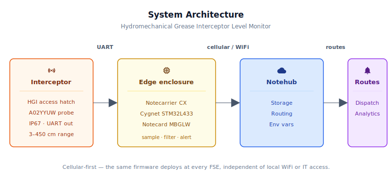
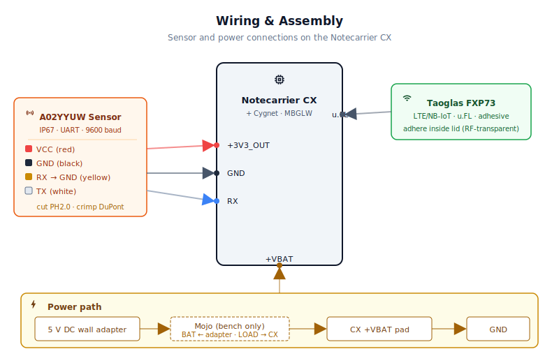
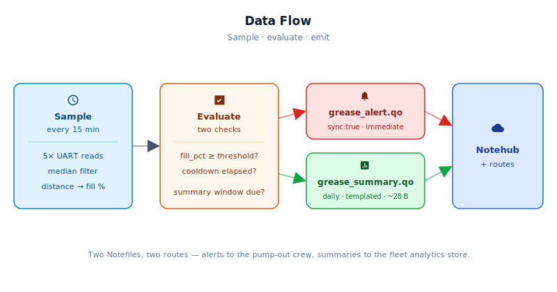

# Hydromechanical (HGI) and Batch-Collection Grease Interceptor Level Monitor

> This reference application is intended to provide inspiration and help you get started quickly. It uses specific hardware choices that may not match your own implementation. Focus on the sections most relevant to your use case. If you'd like to discuss your project and whether it's a good fit for Blues, [feel free to reach out](https://blues.com/contact-sales/).

A [truck-roll reduction](https://blues.com/truck-roll-reduction/) device for pumping providers who service **commercial grease interceptors**. A waterproof ultrasonic distance sensor installed in the access hatch reports fill level over cellular, so trucks are dispatched on actual condition — not a calendar. **This reference implementation is scoped to hydromechanical (HGI) and batch-collection interceptors without a fixed outlet weir** — geometries where the liquid surface rises predictably with FOG accumulation, making fill percentage a direct proxy for pump-out urgency. See §1 and §9 before deploying on a conventional constant-level gravity interceptor where a fixed weir holds the surface height independent of FOG-layer depth.

## 1. Project Overview

**The problem.** Every commercial kitchen is legally required to install a **grease interceptor** (sometimes called a grease trap) — a chamber plumbed into the kitchen drain line that intercepts **FOG** (fats, oils, and grease) before it enters the municipal sewer. FOG accumulates as a floating layer at the top of the interceptor. Left unchecked, that layer eventually reaches the inlet pipe and starts flowing into the sewer, a violation that can result in fines, shutdowns, and backups into the kitchen floor drains.

To stay compliant, **FSEs** (food service establishments — restaurants, cafeterias, ghost kitchens, institutional foodservice) hire a pumping provider who periodically vacuums the trap clean. The industry default is a fixed service cadence: the truck shows up every four weeks, or every two weeks, regardless of how full the trap actually is. In practice, a slow-season week produces far less grease than a holiday rush. Fixed cadence means the pumper sometimes arrives when the interceptor is only 30% full — a truck roll that did nothing for compliance — and sometimes arrives after the interceptor has already overflowed. Neither outcome is good, and the FSE pays for every dispatch.

A fill-level sensor changes the economics entirely. With a real-time reading, the pumping provider dispatches trucks on condition rather than on schedule. Interceptors that fill quickly (high-volume kitchens, fryer-heavy menus) get serviced before they overflow; interceptors that fill slowly get serviced less often without the compliance risk. The result is fewer unnecessary truck rolls, better route efficiency, and a condition-based service story the pumper can offer as a premium tier. **This reference design targets hydromechanical (HGI) and batch-collection interceptors without a fixed outlet weir — geometries where the top liquid surface rises predictably as FOG and wastewater accumulate, so a rising fill percentage is a meaningful proxy for pump-out urgency.** For deployments on conventional constant-level gravity interceptors — where an outlet weir holds the liquid surface nearly fixed regardless of FOG-layer depth — see the measurement-model note below and §9.

> ⚠️ **Measurement model — read before deployment.** The firmware measures the **distance from the probe face to the top of the liquid/FOG surface** and converts it to a "fill percentage" of the working liquid column. In a **conventional constant-level grease interceptor** — where the outlet weir elevation fixes the working liquid height — the top liquid surface stays nearly constant as FOG accumulates beneath it, so this single top-down distance reading **does not track FOG-layer thickness** and **does not map to regulatory pump-out criteria**. This reference design produces the most actionable readings in geometries where the top liquid surface does rise with accumulation (e.g., hydromechanical or batch-collection interceptors without a fixed weir). On a conventional constant-level interceptor, treat `fill_pct` as a liquid-level proximity proxy only — **not as a compliance metric** — and validate empirically before relying on the 75% alert threshold for dispatch decisions.

**Why Notecard.** Grease interceptors are typically located outside the building — in the rear yard, buried in a rear parking lot, or set into the floor of a utility room in the basement. None of these locations have reliable access to the restaurant's WiFi. And unlike a single building-owner deploying one device, a pumping provider is managing hundreds of independent FSE accounts spread across a city, each with a different WiFi network, a different IT contact (usually "the owner's nephew"), and a different level of willingness to hand out network credentials to a pumping vendor. Cellular removes all of that friction: no access point to pair to, no password to manage, no IT ticket to chase. The Notecard Cell+WiFi ships with a prepaid global SIM, so the same hardware-firmware combination deploys identically at every FSE on a pumper's route — from a two-seat taqueria to a stadium commissary. WiFi remains as an opportunistic fallback for the rare installation in a utility room that happens to have building WiFi overhead, without any firmware changes.

**Deployment scenario.** A small weatherproof electronics box mounted on the wall adjacent to the interceptor access cover. **This documented build targets indoor utility-room HGI installations where a standard 120 VAC wall outlet is accessible within ~1.5 m of the installation point.** A DFRobot A02YYUW IP67-rated ultrasonic probe is mounted through a 22 mm clearance hole drilled in the interceptor's access cover (one cover penetration per installation), held by a P-clip and sealed with an IP67 silicone grommet and RTV — see §4 for the full mechanical procedure. The probe hangs below the cover, pointing at the liquid/FOG surface. The box is powered by an external UL-listed 5 V DC wall adapter; a low-voltage DC pigtail cable enters the sealed enclosure through a cable gland and connects directly to the Notecarrier CX `+VBAT` header pin — no mains wiring inside the enclosure, and VUSB stays absent so the Notecard reaches its lowest idle power floor (~8 µA between syncs). No drilling into the interceptor tank body or drain piping, no drain-line modification, and no coordination with the building owner beyond "we're mounting a small sensor on your grease trap cover and a box on the wall next to it." For outdoor, rear-yard, or below-grade installations without accessible indoor power, see [Limitations](#9-limitations-and-next-steps).

## 2. System Architecture



**Device-side responsibilities.** The onboard Cygnet STM32L433 host on the Notecarrier CX wakes every 15 minutes (configurable), reads the ultrasonic sensor over hardware UART, computes fill percentage from the measured distance, evaluates the alert threshold, and manages its own sleep between samples via [`NotePayloadSaveAndSleep`](https://dev.blues.io/guides-and-tutorials/notecard-guides/feather-mcu-low-power-management/). The runtime state — running fill total, peak fill, last alert and report timestamps — is serialized into Notecard flash across sleep cycles so the host restarts fresh on each wake without losing context. Queued notes travel to the Notecard over I²C; no JSON marshaling, no AT commands.

**Notecard responsibilities.** The Notecard stores [Notes](https://dev.blues.io/api-reference/glossary/#note) locally and manages two independent cellular (or WiFi) schedules configured by [`hub.set`](https://dev.blues.io/api-reference/notecard-api/hub-requests/#hub-set): an **outbound** cadence (default every 24 hours) to flush queued Notes to Notehub, and a fixed **inbound** cadence (every 2 hours, set by `HUB_INBOUND_MIN` in the firmware) to poll Notehub for updated environment variables. Alert notes with `sync:true` bypass both scheduled windows and open an immediate session. The Notecard also owns [environment variable](https://dev.blues.io/guides-and-tutorials/notecard-guides/understanding-environment-variables/) distribution — operators can retune the interceptor depth, alert threshold, and sampling cadence without re-flashing firmware.

**Notehub responsibilities.** [Notehub](https://dev.blues.io/notehub/notehub-walkthrough/) terminates the cellular session, stores every event, and applies project-level routes. Daily summaries and threshold alerts land in separate [Notefiles](https://dev.blues.io/api-reference/glossary/#notefile) so routes can fan them out differently — alerts to a dispatch endpoint, summaries to a fleet analytics system.

**Routing to the cloud (high level only).** Notehub supports HTTP, MQTT, AWS, Azure, GCP, Snowflake, and several other destinations; route setup is project-specific. See the [Notehub routing docs](https://dev.blues.io/notehub/notehub-walkthrough/#routing-data-with-notehub) — this project ships no specific downstream endpoint.

## 3. Hardware Requirements

| Part | Qty | Rationale |
|------|-----|-----------|
| [Notecarrier CX](https://shop.blues.com/products/notecarrier-cx?utm_source=dev-blues&utm_medium=web&utm_campaign=store-link) | 1 | Integrated carrier with an onboard Cygnet STM32L433 host MCU — no separate host board needed. ATTN pin wiring to control the host power rail is built in. |
| [Notecard Cell+WiFi (MBGLW)](https://dev.blues.io/datasheets/notecard-datasheet/note-mbglw/) | 1 | Cellular-first connectivity removes per-site WiFi dependency; WiFi fallback available for installations in utility rooms with accessible APs. Ships with a prepaid global SIM. |
| [Blues Mojo](https://shop.blues.com/products/mojo?utm_source=dev-blues&utm_medium=web&utm_campaign=store-link) | 1 | Coulomb counter on the +VBAT rail for ground-truth energy validation during commissioning. |
| [DFRobot A02YYUW Waterproof Ultrasonic Sensor (SEN0311)](https://www.dfrobot.com/product-1935.html) | 1 | IP67-rated ultrasonic probe with UART output; range 3–450 cm; average current ≤8 mA. The IP67 rating covers ingress protection against dust and temporary water immersion — it establishes resistance to splash and condensation but does **not** address long-term chemical compatibility with grease, H₂S, sewer gas condensate, or cleaning chemicals found in interceptor atmospheres. Chemical durability in that environment is unverified for this sensor; field-validate before committing to a deployment, or substitute a sensor with explicit chemical-resistance ratings for the target environment. |
| [Hammond 1554W2GY](https://www.hammfg.com/part/1554W2GY) enclosure, 120 × 80 × 55 mm, IP65 polycarbonate | 1 | Sized for the Notecarrier CX (≈80 × 56 mm footprint) with room for the Mojo and cable management. |
| [Taoglas FXP73.07.0150A](https://www.taoglas.com/product/fxp73/) flexible LTE/NB-IoT antenna, u.FL, 150 mm lead | 1 | Adhesive-mount inside the polycarbonate lid — polycarbonate is RF-transparent, so no external hole or seal penetration is required. Rated −40 to +85 °C; compatible with all MBGLW LTE-M bands. |
| UL-listed 5 V / 2 A (min) regulated switching wall adapter with DC pigtail output, ≥ 1.5 m cable (any UL/CSA-listed 5 V, 2 A or higher regulated switching wall adapter with bare-wire or 2.1 mm center-positive barrel-jack output) | 1 | All mains wiring stays external to the enclosure — only low-voltage DC enters through the cable gland. The positive lead connects to the Notecarrier CX `+VBAT` pad and the negative lead to `GND`, keeping VUSB absent so the Notecard reaches its lowest idle current (~8 µA between cellular syncs). The 2 A minimum rating ensures the supply can sustain the MBGLW's ≤2 A peak transmit bursts without browning out. If your adapter has a 2.1 mm barrel-jack output, use a short 2.1 mm pigtail-to-stripped-lead adapter cable inside the enclosure. **Do not use a USB charger:** USB power appears at the CX USB-C port (VUSB present), which prevents the Notecard from reaching its lowest idle power floor. |
| M16 cable gland, IP68-rated | 2 | One in the enclosure wall for the sensor cable (seals the four bare sensor wires after the PH2.0 connector is cut off; see Wiring). One in the enclosure wall for the DC power pigtail entry. M16 glands seal cables up to approximately 10 mm OD — confirm your adapter cable jacket fits before drilling. The interceptor cover penetration uses a wider opening and a bracket/grommet mount — see the BOM rows below and the Wiring section. |
| Silicone boot grommet, 22 mm OD / 19 mm ID (or nearest available; must grip a ~19 mm cylindrical probe body), IP67-rated | 1 | Seals the 22 mm cover penetration around the A02YYUW probe body. **The probe head is ~19 mm in diameter and cannot pass through an M16 cable gland bore — a wider opening and grommet are required.** |
| Two-piece P-clip or saddle clamp, 19 mm bore, stainless or nylon | 1 | Secures the probe body from above the interceptor access cover after insertion, preventing the probe from sliding into the chamber and maintaining the correct probe-face depth below the cover. |
| Neutral-cure RTV silicone sealant (food-safe / H₂S-resistant, e.g., Permatex #80050 or equivalent) | 1 small tube | Seals around the probe body at the cover penetration and around the gland bodies. Apply after final probe positioning; allow to fully cure before replacing the cover. |
| Female DuPont crimp contacts, 2.54 mm pitch, 4-position housing with crimp pins (or 4 × female-to-female 2.54 mm jumper wires, one end cut and stripped) | 1 set | Terminates the four stripped sensor leads for insertion onto the Notecarrier CX's 2.54 mm header pins. |

All Blues hardware ships with an active SIM including 500 MB of data and 10 years of service — no activation fees, no monthly commitment.

## 4. Wiring and Assembly

> ⚠️ **Safety — wastewater and sewer gas.** Grease interceptors accumulate hydrogen sulfide (H₂S) and other sewer gases that are toxic at low concentrations and flammable at higher ones. Before opening any access cover: ventilate the area, test with a gas monitor if available, keep ignition sources clear, and wear appropriate PPE (nitrile gloves, eye protection). Do not enter a below-grade vault — confined-space entry requires dedicated procedures, a gas monitor, a standby person, and, in many jurisdictions, a permit. This reference design mounts the probe from above with the cover ajar and never requires anyone to enter the interceptor chamber.
>
> ⚠️ **Hazardous-location classification — confirm before deployment.** The A02YYUW probe and all wiring and electronics in this build are standard, **non-intrinsically-safe (non-IS)** components with no NEC Article 505/506 (Class/Zone), ATEX, or IECEx certification. Suspending energized, non-IS electronics inside an interceptor atmosphere bearing H₂S or flammable sewer gases may be prohibited by local electrical code (NEC, NFPA 820, or equivalent). The determination of whether a given installation constitutes a classified hazardous location must be made by a qualified licensed electrician or the local authority having jurisdiction (AHJ) on a site-by-site basis — do not assume an installation is unclassified without a documented review. **This reference design is suitable only for non-classified installations, and only after a local code and site-safety review is complete and documented.** Classified hazardous-location installations require intrinsically safe (IS) or explosion-proof (XP) sensors, certified IS barriers, appropriately rated enclosures, and installation by personnel qualified for hazardous-area work.

All host I/O lands on the [Notecarrier CX](https://dev.blues.io/datasheets/notecarrier-datasheet/notecarrier-cx-v1-3/) dual 16-pin header. The Notecard Cell+WiFi seats into the CX's M.2 slot; the Taoglas FXP73 cellular antenna adheres to the inside surface of the polycarbonate lid — polycarbonate is RF-transparent, so no external hole or seal penetration is needed. **The Blues Mojo coulomb counter is bench-validation equipment only** — it is not part of the deployed field unit. The firmware does not read Mojo data over I²C; Mojo functions purely as a hardware current integrator on the +VBAT rail during commissioning (see §8).

The A02YYUW sensor has a 2-meter cable terminating in a 4-pin PH2.0 connector: **VCC** (red), **GND** (black), **RX** (yellow, mode-select), and **TX** (white, UART data out). **Cut off the PH2.0 connector** — the molded housing is wider than the M16 enclosure gland's bore and will not pass through. Strip 8 mm from each wire, feed the four bare ends through the enclosure's M16 cable gland from outside, tighten the compression nut on the cable jacket, then fit a female 2.54 mm DuPont crimp contact onto each stripped lead and seat them in a 4-pin housing (or use individual housings). This terminated end lands on the Notecarrier CX's 2.54 mm header as described below.

Pin-by-pin:

- **+3V3\_OUT** → A02YYUW **VCC** (red). `+3V3_OUT` is the exact label on the Notecarrier CX v1.3 dual 16-pin header; it supplies 3.3 V at up to 100 mA. The sensor draws ≤8 mA average, well within that limit.
- **GND** → A02YYUW **GND** (black) and A02YYUW **RX** (yellow). Tying the sensor's RX pin to GND selects real-time continuous output mode — the sensor streams packets as fast as it measures. Leave the RX pin floating as an alternative (the internal pull-down produces the same behavior).
- **RX** header pin → A02YYUW **TX** (white). `RX` is the exact label on the Notecarrier CX v1.3 header for the Cygnet's hardware UART receive line. The firmware assigns `Serial1` to this UART instance when built for the Notecarrier CX's onboard Cygnet — this mapping is correct for the standard target. If you retarget the sketch to a different STM32 board or core variant, confirm that `Serial1` maps to the `RX`/`TX` header pins for that board before wiring.
- **+VBAT** pad → positive lead (red or marked +5V) from the DC wall adapter pigtail. The negative lead connects to `GND`. **Do not connect the CX's USB-C port to any power source during normal operation** — VUSB must remain absent for the Notecard to reach its lowest idle power floor (~8 µA). *During bench testing only:* splice Mojo inline between the adapter and `+VBAT` as described in §8.

**Power entry.** The DC wall adapter plugs into a standard wall outlet outside the enclosure; only the low-voltage DC pigtail enters the box. Drill an M16 clearance hole in the enclosure wall for the DC cable; fit the M16 gland body from outside and secure with its locknut from inside. Thread the DC pigtail through the gland from outside and tighten the compression nut on the cable jacket to grip and strain-relieve it. Inside the enclosure, trim the leads to length, strip 8 mm of insulation from each, and connect the positive lead to the CX `+VBAT` pad and the negative lead to `GND` (use female 2.54 mm DuPont crimp contacts or solder directly to the header pads). If your adapter has a 2.1 mm barrel-jack output, use a short barrel-to-DuPont pigtail adapter and connect as above. There is no mains voltage inside the enclosure; no insulation clearance, creepage, or earth-bonding requirements apply to the DC wiring.

**Sensor cable entry and probe mounting.** ⚠️ The A02YYUW transducer head is approximately 19 mm in diameter — it **will not pass through an M16 cable gland bore** (typically 13 mm maximum insert diameter). Do not attempt to mount the probe through an M16 gland. Use the following bracket-and-grommet approach:

1. **Mark and drill.** Center-mark the interceptor access cover over the chamber opening. Drill a **22 mm clearance hole** — a 22 mm step drill or bi-metal hole saw works on cast-iron, fiberglass, and polymer covers. If the cover already has a plugged service port of 22 mm or larger, clean it out and reuse it. Deburr the hole edge.
2. **Thread the cable through first.** Feed the bare (connector-stripped) sensor leads through the 22 mm hole from above. The cable jacket is small enough to pass through easily; the probe head remains above the cover at this stage.
3. **Seat the grommet.** Press a 22 mm OD / 19 mm ID IP67-rated silicone boot grommet into the hole from above. The grommet should seat flush with the cover surface; its inner bore will grip the probe body with light friction when the probe is inserted.
4. **Insert the probe.** Push the probe body down through the grommet from above, face pointing down, until the transducer face is at least 30 mm below the underside of the cover. (30 mm is the sensor's minimum blind zone — anything closer returns invalid data.) The cable now exits upward above the cover.
5. **Secure with a P-clip.** Fit a two-piece 19 mm bore P-clip or saddle clamp around the probe body flush against the top of the cover. Tighten the clip so the probe cannot slide down into the chamber and the face-to-cover distance is fixed. Confirm the transducer face is still at least 30 mm below the cover underside after tightening.
6. **Seal with RTV.** Apply a continuous bead of neutral-cure RTV silicone sealant around the probe body at the grommet–cover interface on both the upper and lower face. Allow to cure fully (typically 24 hours) before replacing the access cover and closing the hatch.

Route the cable from the cover to the enclosure box on the adjacent wall and enter through the enclosure's M16 cable gland as described in the sensor cable preparation above.



## 5. Notehub Setup

1. **Create a project.** Sign up at [notehub.io](https://notehub.io) and [create a project](https://dev.blues.io/quickstart/notecard-quickstart/notecard-and-notecarrier-pi/#set-up-notehub). Copy the [ProductUID](https://dev.blues.io/notehub/notehub-walkthrough/#finding-a-productuid) and paste it into `firmware/grease_interceptor_monitor.ino` as `PRODUCT_UID`.
2. **Claim the Notecard.** Power the unit; on first cellular connection the Notecard auto-associates with your project.
3. **Create a Fleet per pumping route.** [Fleets](https://dev.blues.io/guides-and-tutorials/fleet-admin-guide/) are how Notehub groups devices for shared configuration and routing. A natural fit here is one fleet per service route — all interceptors on the same truck route likely share similar sizes and fill cadences, so fleet-level [environment variables](https://dev.blues.io/guides-and-tutorials/notecard-guides/understanding-environment-variables/) can encode route-wide defaults and you override on a per-device basis for unusual installations. [Smart Fleets](https://dev.blues.io/notehub/notehub-walkthrough/#using-smart-fleet-rules) can be used to auto-assign devices based on FSE metadata tags.
4. **Set environment variables.** All variables below are optional; firmware defaults are shown. Any value set in Notehub overrides the compile-time default on the device's next inbound sync — no re-flashing required.

   | Variable | Default | Purpose |
   |---|---|---|
   | `interceptor_depth_mm` | `600` | Distance (mm) from the sensor face to the liquid surface **immediately after pump-out** (0% grease fill). Measure once per installation during commissioning — it varies by interceptor model and probe mounting height. |
   | `alert_threshold_pct` | `75` | Fill percentage at or above which a `grease_alert.qo` note fires. On HGI units without a fixed weir, the fill percentage reflects the combined liquid-plus-FOG working volume, so this threshold directly corresponds to pump-out urgency — calibrate empirically during commissioning by observing what fill level your target service interval produces. The default 75% is a reasonable starting point for most HGI geometries. See §9 if deploying on a conventional constant-level interceptor. |
   | `sample_interval_sec` | `900` | Seconds between distance readings (default 15 minutes). Grease accumulates over hours to days — 15 minutes is more than sufficient resolution. |
   | `report_interval_min` | `1440` | Minutes between summary notes (default 24 hours). The firmware re-issues `hub.set` whenever this value changes, keeping the Notecard's **outbound** sync cadence aligned with the local summary period — lowering this to 360, for example, means summaries are emitted every 6 hours and the outbound batch window shrinks to match. The **inbound** cadence (environment-variable polling every 2 hours) is independent of this setting and does not change. |

5. **Configure routes.** Add one [route](https://dev.blues.io/notehub/notehub-walkthrough/#routing-data-with-notehub) targeting `grease_alert.qo` for real-time dispatch notification (webhook to a field-service platform, SMS gateway, or dispatch email), and a second for `grease_summary.qo` pointed at a long-term analytics store. Keeping the two Notefiles separate at the source means each can be routed to a different destination without filtering logic in the route itself.

## 6. Firmware Design

Firmware files:

| File | Purpose |
|---|---|
| [`grease_interceptor_monitor.ino`](firmware/grease_interceptor_monitor.ino) | Main sketch: `setup()` / `loop()`, Notecard configuration, env-var fetch, alert/summary scheduling, sleep |
| [`grease_interceptor_monitor_helpers.h`](firmware/grease_interceptor_monitor_helpers.h) | Shared constants (`SENSOR_BAUD`, `NUM_READINGS`, …), `State` struct definition, utility-function declarations |
| [`grease_interceptor_monitor_helpers.cpp`](firmware/grease_interceptor_monitor_helpers.cpp) | Utility-function implementations: sensor read, median filter, distance-to-fill, Notecard response helpers, note emission |

Dependencies:
- Arduino core for STM32 ([`stm32duino/Arduino_Core_STM32`](https://github.com/stm32duino/Arduino_Core_STM32)).
- [`Blues Wireless Notecard`](https://github.com/blues/note-arduino) (`note-arduino`, current stable v1.8.5). Install via the Arduino Library Manager (`arduino-cli lib install "Blues Wireless Notecard"`) or download from [the releases page](https://github.com/blues/note-arduino/releases).

### Modules

| Responsibility | Function / symbol | File |
|---|---|---|
| Notecard configuration (`hub.set`, accelerometer disable) | `notecardConfigure` | `.ino` |
| Note template definition | `defineTemplates` | `.ino` |
| Environment variable fetch; re-applies `hub.set` when `report_interval_min` changes | `fetchEnvOverrides` | `.ino` |
| UART sensor read with packet validation | `readDistanceMm` | `_helpers.cpp` |
| Median filter over multiple readings | `medianOf` | `_helpers.cpp` |
| Distance-to-fill-percent conversion | `distanceToFillPct` | `_helpers.cpp` |
| Notecard response validation and error logging | `notecardResponseOk` | `_helpers.cpp` |
| Threshold evaluation and alert emission | inline in `setup`, `sendAlert` | `.ino` / `_helpers.cpp` |
| Daily summary accumulation and emission | inline in `setup`, `sendSummary` | `.ino` / `_helpers.cpp` |
| Persistent state across sleep cycles | `State` struct + `NotePayloadSaveAndSleep` / `NotePayloadRetrieveAfterSleep` | `_helpers.h` / `.ino` |

### Sensor reading strategy

The A02YYUW streams 4-byte UART packets continuously at 9600 baud: `[0xFF][high][low][checksum]`. The distance in mm is `(high << 8) | low`; the checksum is `(0xFF + high + low) & 0xFF`. On each wake, the firmware flushes any bytes that accumulated during sleep, then synchronizes to the next valid start byte (`0xFF`) and reads a complete packet. To suppress acoustic multipath artifacts (reflections off the interceptor walls can occasionally return a short or long reading), the firmware takes five readings in sequence and returns the median. Any reading below 30 mm or above 4500 mm is rejected as outside the sensor's rated range. The firmware also applies an installation-specific upper bound: any reading above `interceptor_depth_mm × 1.1` is rejected, providing 10 % headroom above the commissioning reference to catch near-overflow conditions while discarding obviously erroneous long readings. **If `interceptor_depth_mm` is configured shorter than the true sensor-to-surface distance at pump-out, this gate will reject every sample, `valid_samples` will remain zero, and no summary note will be produced** — see the commissioning-depth diagnostic in §8.

### Event payload design

One [template-backed](https://dev.blues.io/notecard/notecard-walkthrough/low-bandwidth-design/#working-with-note-templates) daily summary note (`grease_summary.qo`), plus an untemplated immediate alert (`grease_alert.qo`) whenever `fill_pct` is at or above the alert threshold and the 1-hour cooldown has elapsed — which means a new alert fires every cooldown interval for as long as the interceptor remains above threshold. The template fixes each summary to a compact binary record (approximately 28 bytes on the wire), a meaningful saving over a full deployment lifetime with a sensor that's been installed for years in hundreds of interceptors. Example of the two note shapes:

**Daily summary** (`grease_summary.qo`, templated):
```json
{
  "file": "grease_summary.qo",
  "body": {
    "fill_pct_avg":  42.3,
    "fill_pct_peak": 51.7,
    "fill_pct_now":  44.1,
    "valid_samples": 94
  }
}
```

**Threshold alert** (`grease_alert.qo`, `sync:true`):
```json
{
  "file": "grease_alert.qo",
  "body": {
    "alert":         "fill_threshold_exceeded",
    "fill_pct":      76.4,
    "threshold_pct": 75.0
  },
  "sync": true
}
```

### Low-power strategy

Even though a back-of-house HGI installation has mains power available, the firmware still puts the host to sleep between samples — less heat in the enclosure and a firmware pattern that ports to a solar- or battery-backed variant without rearchitecting. After each sample cycle the host calls `NotePayloadSaveAndSleep`, which serializes the runtime state into Notecard flash and uses [`card.attn`](https://dev.blues.io/api-reference/notecard-api/card-requests/#card-attn) to cut host power for `sample_interval_sec` seconds. The Notecard itself idles at roughly 8 µA between cellular wakes when powered via `+VBAT` with VUSB absent — which this build achieves by routing the 5 V DC pigtail from the wall adapter to the CX's `+VBAT` header pin rather than its USB-C port. The A02YYUW draws ≤8 mA from the `+3V3_OUT` pin; the firmware does not actively switch sensor power, and the Notecarrier CX datasheet does not document whether the `+3V3_OUT` rail is cut when `NotePayloadSaveAndSleep` puts the Cygnet to sleep. Treat the sensor current as a continuous ~8 mA load when sizing the power budget. A continuous 8 mA sensor draw accumulates roughly 192 mAh over a 24-hour day — far more than a single daily LTE-M sync (~250 mA average for ≤60 s ≈ 4 mAh). The cellular sync is the dominant current spike, but the always-on sensor is likely the dominant daily energy consumer unless the `+3V3_OUT` rail is switched off during host sleep (its behavior during sleep is not documented in the CX datasheet and has not been verified for this build). Sensor power switching — a GPIO-controlled load switch on the sensor supply rail — is therefore the primary optimization to pursue before moving to a battery-backed installation (see §9). Until that is confirmed empirically with Mojo, treat the sensor as always powered (see §8 Mojo validation).

Sampling and summary cadence are deliberately decoupled: the sensor fires every `sample_interval_sec` (default 15 minutes, 96 times per day at default), but outbound summary syncs occur only once per `report_interval_min` (default 24 hours). Separately, the Notecard opens an **inbound** session every 2 hours (`HUB_INBOUND_MIN = 120`) to poll Notehub for updated environment variables — these inbound sessions require a full radio wake and session establishment and must be budgeted in any power analysis (see §8). At the default 2-hour inbound cadence, expect up to 12 inbound wakes per day in addition to the single daily outbound sync and any alert syncs. Alert notes set `sync:true` and bypass both scheduled windows entirely, waking the radio immediately on each alert fire — which repeats every cooldown interval as long as fill remains at or above threshold.

### Retry and error handling

- The first Notecard transaction on cold boot uses `sendRequestWithRetry(req, 5)` to handle the known I²C race condition where the host powers up before the Notecard is ready.
- Sensor reads that fail checksum, time out, or return out-of-range values (below 30 mm, above 4500 mm, or above `interceptor_depth_mm × 1.1`) return `-1.0` and are excluded from the rolling average and peak. The firmware requires at least two valid readings out of five before computing a fill percentage; if fewer than two are valid, the sample window is silently skipped — no note is emitted for that window (the firmware still calls `env.get` and `card.time` on every wake regardless). No sentinel values are written — bad data is simply absent from that sample window.
- The alert cooldown (`ALERT_COOLDOWN_SEC = 3600`) prevents a near-threshold interceptor from triggering a dispatch notification every 15 minutes. One alert per hour is more than sufficient to escalate a genuine overflow risk.
- `env.get` is called with a `names` array on every wake so the response always reflects the current operator-configured values, regardless of which variable was most recently updated on the server.
- Whenever `report_interval_min` changes, `fetchEnvOverrides` immediately re-issues `hub.set` with the new `outbound` value so the Notecard's cellular sync cadence stays aligned with the local summary period. Without this, summaries queued at the new (shorter) interval would sit in the Notecard's store until the old (longer) outbound window fired.

### Key code snippet 1: note template definition

The template makes each summary a fixed-length record. `TFLOAT32` (= `14.1`) is a 4-byte IEEE 754 float; `TUINT32` (= `13`) is a 4-byte unsigned integer.

```cpp
J *req = notecard.newRequest("note.template");
JAddStringToObject(req, "file", "grease_summary.qo");
JAddNumberToObject(req, "port", 50);
J *body = JAddObjectToObject(req, "body");
JAddNumberToObject(body, "fill_pct_avg",  TFLOAT32);
JAddNumberToObject(body, "fill_pct_peak", TFLOAT32);
JAddNumberToObject(body, "fill_pct_now",  TFLOAT32);
JAddNumberToObject(body, "valid_samples", TUINT32);
notecard.sendRequest(req);
```

### Key code snippet 2: immediate-sync alert

`sync:true` tells the Notecard to bypass the outbound batch window and open a cellular session as soon as the note is enqueued — typically within 15–60 seconds of the threshold trip.

```cpp
J *req = notecard.newRequest("note.add");
JAddStringToObject(req, "file", "grease_alert.qo");
JAddBoolToObject(req,   "sync", true);
J *body = JAddObjectToObject(req, "body");
JAddStringToObject(body, "alert",          "fill_threshold_exceeded");
JAddNumberToObject(body, "fill_pct",        fill_pct);
JAddNumberToObject(body, "threshold_pct",   threshold_pct);
notecard.sendRequest(req);
```

### Key code snippet 3: sleep and state persistence

`NotePayloadSaveAndSleep` stores the runtime state in Notecard flash and then cuts host power via `card.attn`. On the next wake, `NotePayloadRetrieveAfterSleep` rehydrates the state and the firmware resumes exactly where it left off — fill accumulator, peak, timestamps and all.

```cpp
NotePayloadDesc new_payload = {0, 0, 0};
NotePayloadAddSegment(&new_payload, STATE_SEG_ID, &state, sizeof(state));
NotePayloadSaveAndSleep(&new_payload, cfg.sample_interval_sec, NULL);
```

## 7. Data Flow



Every 15 minutes the Cygnet host wakes, fires the sensor five times, takes the median distance, and converts it to a fill percentage. That reading is added to the rolling daily accumulator. Two conditional paths run in parallel:

- **Threshold alert.** If `fill_pct >= alert_threshold_pct` and at least one hour has elapsed since the last alert, a `grease_alert.qo` note with `sync:true` is queued. The Notecard immediately opens a cellular session and delivers the note to Notehub, which routes it to the dispatch endpoint.
- **Daily summary.** Once every `report_interval_min` minutes (default 24 hours), a `grease_summary.qo` note is queued containing the average fill percentage over the period, the peak fill percentage, the most recent instantaneous reading, and the count of valid samples. The Notecard's outbound sync cadence is kept aligned with `report_interval_min` by the firmware, so the note ships on the next outbound window — which matches the summary period.

**Collected:** Distance from sensor face to top of liquid/FOG surface (mm); fill percentage derived from that distance (on HGI units without a fixed weir, this tracks combined liquid-plus-FOG accumulation — see §9 for behavior on other interceptor geometries); timestamp (from Notecard's synced clock).

**Transmitted:**
- `grease_summary.qo` — once per `report_interval_min` (outbound; default 24 h), templated, delivered in the Notecard's next scheduled outbound sync.
- `grease_alert.qo` — fires whenever `fill_pct >= alert_threshold_pct` and the 1-hour cooldown has elapsed; `sync:true`; continues to fire hourly for as long as the interceptor remains above threshold.
- **Inbound sessions** — the Notecard also wakes and polls Notehub every 2 hours (`HUB_INBOUND_MIN = 120`) to check for updated environment variables, independent of the outbound cadence. No application data is transmitted during an inbound-only session, but each session consumes radio energy (see §8).

**Routed:** Both Notefiles land in Notehub. `grease_alert.qo` routes to whatever real-time notification channel the pumping provider uses for dispatch (service management platform webhook, email, SMS). `grease_summary.qo` routes to a long-term store for trend analysis and proactive scheduling intelligence.

**Alert triggers on:** `fill_pct >= alert_threshold_pct` (default 75%) — level-triggered, not edge-triggered. A new alert fires each time the `ALERT_COOLDOWN_SEC` (1 hour) expires and the interceptor is still above threshold, so a persistently full interceptor generates repeated hourly alerts until it is serviced.

## 8. Validation and Testing

**Expected steady-state behavior.** On a correctly-behaving install, one `grease_summary.qo` event appears in Notehub every 24 hours and zero `grease_alert.qo` events appear. The `valid_samples` field in the summary is the most useful commissioning diagnostic — after the first complete 24-hour reporting interval, a correctly-behaving unit should show roughly 96 valid samples at the default 15-minute interval. (The very first summary fires on cold boot with only the samples collected since power-on; do not treat a low count in that first event as a fault.) A count materially below 96 on subsequent days indicates intermittent sensor reads (cable length, probe positioning, or FOG reflectivity issues). If a summary note is missing from Notehub for a given day, **do not immediately conclude that the firmware emitted nothing.** A note that was correctly created on the device may not yet be visible in Notehub because the Notecard has not completed an outbound sync for that period, the device is temporarily offline or in a poor-signal location, queued notes are still waiting for the next outbound window, or a Notehub route or forwarding step failed silently. Before diagnosing a firmware-level suppression, verify the device-side state first: query `hub.status` and `card.status` via the serial monitor or the in-browser Notecard Playground, or watch the USB serial debug output during a live wake cycle and look for a `note.add` request and a reply without an `err` field. If the Notecard confirms a successful `note.add` and shows a non-empty outbound queue, the firmware emitted the note correctly — the gap is upstream (sync timing, connectivity, or routing), not in the firmware. Only if the outbound queue is empty and no `note.add` was attempted for the reporting window should you look for firmware-level suppression. In that case, the firmware suppressed the summary because `valid_samples` remained zero for the entire reporting window — the firmware gates `sendSummary` on `valid_samples > 0`, so a complete read failure produces no note rather than a note with `valid_samples: 0`. Check UART wiring, cable continuity, and the probe connector — and confirm that `interceptor_depth_mm` is not set shorter than the true sensor-to-surface distance at pump-out (a value set too low causes the firmware's `interceptor_depth_mm × 1.1` acceptance gate to reject every reading; see §6 sensor reading strategy).

**Cold-boot and unsynced-clock behavior.** On initial power-up the Notecard may not have synced its clock yet (`card.time` returns 0 until the first cellular session completes). The firmware allows at most one cold-boot summary and at most one cold-boot threshold alert before the clock is available, then suppresses further reports until time sync succeeds — preventing repeated low-count summaries or repeated threshold alerts from flooding Notehub before the device has a real timestamp. Once the Notecard syncs time, normal interval-based cadence resumes. If the device is in a poor-signal location and takes several wake cycles to establish its first session, no additional summaries or alerts will fire during that window; the fill accumulator continues running in the background and will be included in the first post-sync summary.

**Speed up commissioning with a shorter sample interval.** The default 15-minute sample interval is correct for production but makes bench positioning slow. Before committing to final probe depth and cable dressing, temporarily set `sample_interval_sec` to `60` via a Notehub device-level environment variable (or by editing the `DEFAULT_SAMPLE_INTERVAL_SEC` constant in firmware during development). At 60 s per cycle you can watch several readings appear in the serial monitor within a few minutes and confirm stable fill-percentage values at multiple probe depths. Restore `sample_interval_sec` to `900` (or your production value) before leaving the site.

**Sensor sanity check.** At first light, confirm the sensor is reading a plausible distance before deploying. With the interceptor hatch open and a tape measure in hand, plug the unit into a laptop via USB-C, set the Notecarrier CX's DIP switch to **HST** (exposes the Cygnet's USB serial port), and open a serial monitor at **115200 baud**. The firmware prints the raw median distance on every wake cycle:

```
[DBG] median distance mm: 423.00
```

Compare this value against your tape measurement from sensor face to the liquid surface. A raw distance discrepancy of more than 2–3 cm is a physical installation or signal issue — `interceptor_depth_mm` does not affect the raw distance reading (it is used only in the fill-percentage calculation and cannot shift what the sensor reports). Check instead: (1) the probe is centered directly over the chamber opening, not angled — off-center placement produces acoustic multipath off the interceptor walls and returns a longer-than-true distance; (2) the transducer face is pointing straight down with no tilt; (3) the sensor face is clean — grease fouling on the transducer attenuates the signal and causes the sensor to report a distance that is too long (fill appears lower than actual); (4) the UART wiring is correct — a wiring fault typically causes the read to be rejected entirely (no `[DBG]` line at all) rather than an offset reading. Once the raw distance matches the tape measurement within 1–2 cm, validate `interceptor_depth_mm` by comparing `fill_pct_now` in the first Notehub summary against your known reference: at 0% fill (immediately after pump-out) the distance should equal `interceptor_depth_mm` and `fill_pct` should read ~0%. Adjust `interceptor_depth_mm` via the Notehub environment variable if the derived percentage is off. **Note:** if `interceptor_depth_mm` is set shorter than the true pump-out distance, all readings will fall above the firmware's `interceptor_depth_mm × 1.1` acceptance gate and be silently rejected — no summary note will appear until the value is corrected (see §6 sensor reading strategy). Correct it in Notehub and wait up to one inbound poll cycle (default 2 hours) for the update to take effect. Once the reading is plausible, close the hatch, return the DIP switch to **NC** for normal operation, and disconnect the laptop.

**Alert simulation.** The fastest way to confirm the alert path end-to-end: in Notehub, lower `alert_threshold_pct` to `5` in the device's environment variables. On the next inbound sync (within 2 hours at the default `HUB_INBOUND_MIN`), the device will pull the new value. At the next wake, the current fill percentage will almost certainly exceed 5%, and a `grease_alert.qo` note will arrive in Notehub within a session-establishment window of the sample time.

**Using Mojo to validate power behavior.** Mojo is bench-only equipment for this project; it is not installed in the deployed field unit and the firmware does not read Mojo data. To use Mojo for power validation: splice it inline on the `+VBAT` rail between the 5 V DC wall adapter and the CX `+VBAT` pad (adapter positive lead → Mojo `BAT`; Mojo `LOAD` → CX `+VBAT` pad; adapter negative → CX `GND`). Leave the unit running for at least one full `report_interval_min` period. Because Mojo is inserted at the `+VBAT` rail, its readings reflect the **whole-board** draw — Notecard plus the CX's onboard regulators, quiescent biasing, and the continuously-powered A02YYUW sensor — not the Notecard in isolation.

The table below shows the published MBGLW Notecard figures alongside the trace shapes to look for and confirm on your assembled unit. Board-level numbers beyond the Notecard's own idle are assembly-dependent and should be validated empirically with Mojo rather than assumed from the figures below.

| Phase | MBGLW Notecard published figure | Expected trace on your assembly (confirm with Mojo) |
|---|---|---|
| Notecard idle between syncs | ~8 µA ([low-power design guide](https://dev.blues.io/notecard/notecard-walkthrough/low-power-firmware-design/)) — achievable when powered via +VBAT with VUSB absent, as in this build | Whole-board floor will exceed this: add CX regulator quiescent current, the continuously-powered A02YYUW (~8 mA), and any other peripheral leakage. The actual floor is assembly-dependent — confirm with Mojo. |
| Host active (~2 s sampling cycle) | Notecard remains near idle; host MCU and UART activity are additional load | Brief current step above the quiescent floor every `sample_interval_sec` (default 15 min); the A02YYUW draw is already in the floor (sensor is always powered) — Cygnet wake adds its own incremental draw on top |
| Notecard cellular session (LTE-M) | ~250 mA average, ≤2 A peak during transmit bursts ([MBGLW datasheet](https://dev.blues.io/datasheets/notecard-datasheet/note-mbglw/)) | **Outbound** sync: 30–60 s elevation once per `report_interval_min` (default once per day). **Inbound** polls: shorter sessions every 2 hours (`HUB_INBOUND_MIN = 120`) — up to 12 additional radio wakes per day at default settings. Each inbound session has a radio-wake and session-establishment cost even though no summary data is delivered; at default cadence the 12 daily inbound sessions may collectively rival or exceed the single outbound session in energy. Budget both when sizing supply capacity. A continuously powered sensor (~8 mA × 24 h ≈ 192 mAh/day) likely remains the dominant daily energy consumer unless the `+3V3_OUT` rail is cut during host sleep — confirm with Mojo (splice between the DC wall adapter and CX `+VBAT` as described above). |

The dominant daily energy consumer is likely the always-on sensor (~8 mA continuous ≈ 192 mAh/day) unless the `+3V3_OUT` rail is cut during host sleep — which the CX datasheet does not document. The cellular budget is composed of both the outbound summary sync (one per `report_interval_min`) and the inbound environment-variable polls (up to 12 per day at the default 2-hour cadence); at default settings the aggregated inbound sessions may collectively approach or exceed the energy of the single outbound sync. On a correctly-behaving Mojo trace you should see: a roughly constant quiescent floor (Notecard idle + always-on sensor), a brief incremental step every 15 minutes when the host is active, a pattern of shorter radio-wake spikes approximately every 2 hours (inbound polls), and a larger, longer cellular sync spike once per `report_interval_min` (outbound). If empirically the quiescent floor drops sharply between the 15-minute host-active steps, the sensor rail is being cut during sleep — confirm either way before sizing a battery-backed variant. If instead you see sustained elevated current with no sleeping pattern, the host is not sleeping — troubleshoot as follows for the Notecarrier CX: (1) confirm `NotePayloadSaveAndSleep` is actually reached (Notecard API debug output on the USB serial monitor stops after a successful sleep call); (2) confirm the `card.attn` request returns without an error in that same debug stream; (3) the Notecarrier CX switches the Cygnet host power rail via its built-in ATTN-controlled power circuit — no external EN pin wiring is needed or expected on this carrier. When bench testing is complete, remove Mojo and wire the DC adapter pigtail directly to `+VBAT` / `GND` for the deployed unit.

## 9. Limitations and Next Steps

**Simplified for the POC:**

- **Scoped to HGI and batch-collection geometries — not validated for conventional constant-level interceptors.** This reference design is scoped to hydromechanical and batch-collection interceptors without a fixed outlet weir — geometries where the top liquid surface rises with FOG and wastewater accumulation, making the fill percentage a meaningful pump-out indicator. On a **conventional constant-level gravity interceptor** (outlet weir holds the liquid surface at a fixed height regardless of FOG thickness), the top surface stays nearly constant as grease accumulates, so `fill_pct` will not track FOG buildup and the 75% alert threshold will not map to regulatory pump-out criteria. **Do not deploy this reference design on a conventional constant-level interceptor for compliance purposes without independent empirical validation** that surface elevation correlates with FOG accumulation in that specific unit. For conventional interceptors, direct FOG-layer measurement (e.g., differential float pair, bottom conductivity probe, or matched top-and-bottom ultrasonic sensors) is required.

- **Not rated for classified hazardous locations.** The A02YYUW probe, all associated wiring, and the electronics in this build are standard, non-intrinsically-safe (non-IS) components with no NEC Article 505/506 Class/Zone, ATEX, or IECEx certification. Whether a given interceptor installation constitutes a classified hazardous location is a site-specific determination that must be made by a qualified licensed electrician or AHJ before deployment — do not assume an installation is unclassified without a documented review. **This reference design is suitable only for non-classified installations following a completed code and site-safety review.** Classified hazardous-location installations require IS-rated sensors, certified IS barriers, explosion-proof (XP) or purged-and-pressurized (P) enclosures, and installation by personnel qualified for hazardous-area work.

- **Indoor utility-room power architecture only.** The documented hardware build assumes a 120 VAC wall outlet within ~1.5 m of the interceptor access cover, powering a UL-listed 5 V DC wall adapter that supplies the enclosure. A large fraction of commercial HGI installations are in rear yards, buried below a parking lot, or set in a floor vault where no convenient outlet exists. Those sites require a solar panel plus a lithium battery pack or a long conduit power run — neither is covered by this reference design. See the battery backup note in Production Next Steps below.

- **Single-layer measurement only.** A grease interceptor has two distinct layers: a floating FOG layer at the top and a settled sludge layer at the bottom. Regulatory compliance in many jurisdictions is based on the *combined* FOG-plus-sludge depth relative to the overall liquid depth, not just the FOG surface distance. The firmware measures one distance (sensor to FOG surface) and derives a simple fill percentage from it. A production deployment targeting jurisdictions with explicit combined-depth regulations would need either a second sensor at the bottom or a different measurement method to account for sludge accumulation.

- **Fixed interceptor depth per device.** `interceptor_depth_mm` is a single scalar representing the sensor-to-reference-surface distance when the interceptor is at 0% fill. This must be measured and set manually per installation; there is no auto-calibration. If the probe mounting depth shifts (e.g., if someone repositions the cover), the calibration drifts silently.

- **No FOG layer thickness calculation.** The sensor reports the distance to the *surface* of the FOG layer, not its thickness. Thickness (a more directly actionable metric) would require knowing the bottom of the FOG layer, which is the top of the wastewater zone below — measuring that would require a second sensor or a conductivity probe.

- **Environmental fouling not detected.** The A02YYUW probe is IP67 and tolerates condensation and splash, but a heavy grease coating on the transducer face will attenuate the ultrasonic signal and produce erroneous long readings (sensor thinks the surface is farther away than it is — i.e., fill level appears lower than actual). The firmware has no mechanism to detect or correct for probe fouling. A valid-samples count well below the expected 96/day can be a symptom, but is not a reliable diagnostic.

- **No temperature compensation beyond the sensor.** The A02YYUW has an internal temperature-compensation circuit for the speed of sound. The firmware does not read or log temperature separately — temperature is not transmitted to Notehub.

- **Alert cooldown is per-device, not per-channel.** The 1-hour alert cooldown is enforced in firmware. If the downstream routing endpoint needs its own deduplication or escalation logic (e.g., "send a second alert if not acknowledged within 4 hours"), that must be implemented in the Notehub route or the receiving system.

- **Mojo is bench-validation equipment here.** The firmware does not read the Mojo's LTC2959 coulomb counter over I²C. Adding a `mojo_mah` field to the daily summary is a one-function extension if fleet-level energy telemetry is useful in production.

**Production next steps:**

- Per-installation commissioning flow: expose a `calibrate` environment variable that, when set, records the current sensor reading as the 0%-fill reference distance and stores it back as `interceptor_depth_mm`. This replaces the manual tape-measure step with a firmware-driven calibration gesture.
- Dual-layer measurement: add a conductivity or float probe near the bottom of the interceptor to detect sludge accumulation and report combined FOG+sludge fill depth.
- Probe-fouling detection: add a signal-quality metric derived from the standard deviation of the 5-reading median filter. A high std-dev or elevated rejection rate is a leading indicator of fouling or multipath before the readings go completely invalid.
- Over-the-air firmware updates via [Notecard Outboard DFU](https://dev.blues.io/notehub/host-firmware-updates/notecard-outboard-firmware-update/), so threshold recipes and protocol updates can be pushed to the entire fleet without a site visit.
- Battery backup via Blues Scoop or a small sealed lead-acid for interceptors in locations prone to power outages, to ensure an overflow alert fires even during a kitchen's electrical fault.
- Per-device pump-out logging: add a `grease_service.qi` inbound Notefile that the dispatch system writes to when a pump-out event is completed, allowing the firmware to reset the fill accumulator on confirmed service and start fresh from a known-empty state.

## 10. Summary

A Notecarrier CX, a Notecard Cell+WiFi, and an IP67 waterproof ultrasonic probe are enough to turn a hydromechanical grease interceptor into a remotely-monitored asset. Sampling happens every 15 minutes; outbound summary syncs happen once a day (with inbound environment-variable polls every 2 hours); an alert bypasses the outbound batch and wakes the radio within minutes whenever fill is at or above the threshold (repeating hourly while the interceptor remains over limit). The cellular-first design means the same firmware deploys identically at every HGI on a pumping route — independent of that FSE's WiFi setup, IT policy, or building age — and the same Notehub environment variables let the pumping provider tune thresholds and cadence across hundreds of devices without touching a single line of code. The reference design is scoped to HGI and batch-collection geometries where the fill percentage is a direct proxy for pump-out urgency; see §9 before applying it to conventional constant-level interceptors. For a service company whose margin depends on route density and avoided overflows, that's the difference between a fixed-schedule liability and a condition-based service model.
