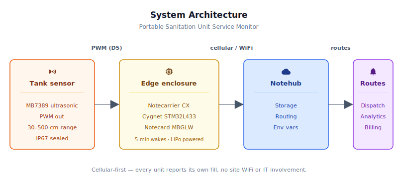
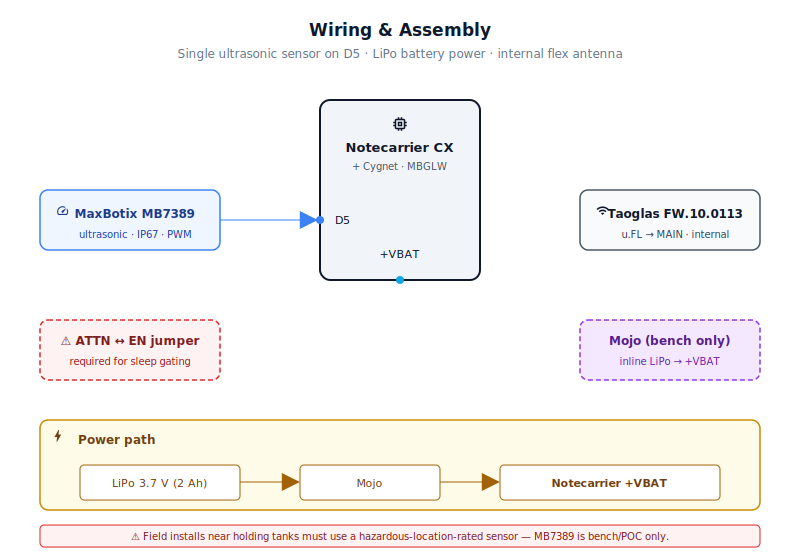
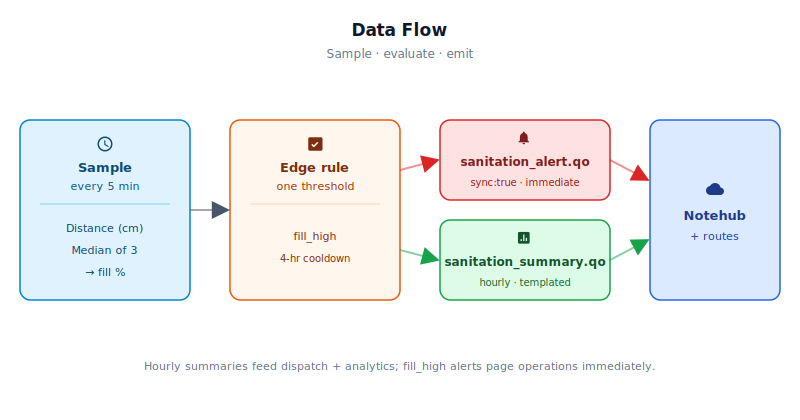

# Portable Sanitation Unit Service Monitor

<Note>

This reference application is intended to provide inspiration and help you get started quickly. It uses specific hardware choices that may not match your own implementation. Focus on the sections most relevant to your use case. If you'd like to discuss your project and whether it's a good fit for Blues, [feel free to reach out](https://blues.com/landing-pages/accelerators-contact-us/?accelerator=Portable%20Sanitation%20Unit%20Service%20Monitor).

</Note>

This project is a [truck roll reduction](https://blues.com/truck-roll-reduction/) project for fleets of portable sanitation units — porta-potties — that are currently serviced on fixed schedules whether they need it or not. A sealed level sensor and a [Blues Notecard Cell+WiFi](https://shop.blues.com/products/notecard-cell-wifi?utm_source=dev-blues&utm_medium=web&utm_campaign=store-link) turn each unit into a self-reporting asset: the holding tank reports its own fill level so the service provider can route a pump truck only when and where it is actually needed.

## 1. Project Overview


**The problem.** Portable restroom companies, and the construction sites, outdoor event venues, and municipalities that rely on them — all share the same dirty secret about service scheduling: it's a guess. A unit at a lightly-attended weekend farmers market gets pumped on the same Monday-Wednesday-Friday schedule as the one chained to a pile of rebar at a hundred-person job site. The result is predictable in both directions: trucks roll to units that are a quarter full, burning fuel and driving up per-service cost; other units overflow on the busiest Saturday of the year, creating a safety hazard and an experience nobody forgets. Neither outcome is caused by a lack of data — the data is right there in the tank. What's missing is any way to read it remotely.

This project is that reader. A compact weatherproof module mounts near the unit's holding tank, with a sealed ultrasonic sensor probe mounted in the tank roof. It reports holding-tank fill level to the service provider's routing system through Blues Notehub. The dispatcher looks at a map of units ranked by fill percentage, sends a truck to the two that are at 80%, and leaves the other eight alone. The result is fewer unnecessary truck rolls and fewer overflows — which is exactly what the phrase "truck roll reduction" means in practice.

Blues has already demonstrated this works at scale: Satellite Industries, one of the largest portable sanitation manufacturers in North America, built their own cellular-connected tank-level product using Blues Notecard. This reference project packages the same approach as a starting point for providers who want to build or evaluate a similar system without starting from scratch.

**Why Notecard.** Construction sites and outdoor event venues have exactly one thing in common: no usable WiFi. An active job site with forty porta-potties and no IT department isn't going to provision forty per-device WiFi credentials, and even if it would, the units move to a different site next month. Cellular removes the dependency on site infrastructure entirely — each unit authenticates once and connects anywhere there is LTE Cat-1 bis cellular coverage. The Notecard Cell+WiFi variant retains WiFi as an opportunistic fallback for fixed installations (a sports stadium's permanent restroom trailers, a county fairground) without changing the SKU or the firmware. Blues ships each Notecard with a prepaid global SIM, so a service company can stock a single part number, drop it in a unit, and have it connected the moment it powers on — no carrier agreements to negotiate, no per-unit provisioning scripts to run.

<NewToBlues/>

**Deployment scenario.** A small weatherproof enclosure mounts near the tank, powered by a 3.7V LiPo cell. For bench/POC evaluation, the MaxBotix HRXL-MaxSonar-WR (MB7389) sensor probe is IP67-sealed and inserts through a threaded fitting in the tank roof — the sensor electronics are all contained inside the sealed probe housing, so no acoustic aperture is needed between the enclosure interior and the tank headspace. Note that IP67 is a mechanical ingress rating, not a hazardous-location certification; see §4 and the safety guidance in §5 before planning any real installation in a holding-tank environment. Field deployments must use a sensor arrangement that keeps all energized electronics outside the hazardous-atmosphere zone (see §4). The unit is essentially self-contained: install it, associate it with a fleet in Notehub, and it begins sampling immediately on first power-on. The first hourly summary arrives in Notehub within about an hour by default; if the tank is already above the fill threshold when the unit is first powered, a `fill_high` alert fires before that first window closes and arrives within a typical LTE session-establishment window (~15–60 seconds). When the unit moves to a new site, nothing changes — cellular follows it. See §6 for initial Notehub configuration.

## 2. System Architecture




**Device-side responsibilities.** The onboard Cygnet STM32 host in the Notecarrier CX wakes every five minutes, reads the ultrasonic level sensor, accumulates fill-level samples, and evaluates one threshold rule: is the fill level above the configured service trigger? Between wakes the host is fully powered off by [`card.attn`](https://dev.blues.io/api-reference/notecard-api/card-requests/#card-attn), and only the Notecard's low-power idle circuit (drawing ~8–18 µA) keeps time. Queued [Notes](https://dev.blues.io/api-reference/glossary/#note) travel from the host to the Notecard over I²C — no JSON marshaling, no serial buffer management, no modem AT commands. A mandatory `ATTN`-to-`EN` jumper on the Notecarrier CX header gates the host's power supply and is **required** for the low-power design; see §6.

**Notecard responsibilities.** The Notecard holds [Notes](https://dev.blues.io/api-reference/glossary/#note) locally in its on-device queue, establishes a cellular (or WiFi) session on the configured [`hub.set`](https://dev.blues.io/api-reference/notecard-api/hub-requests/#hub-set) `outbound` cadence (default every 60 minutes), and flushes any `sync:true` alert Notes immediately regardless of the outbound schedule. The Notecard also manages [environment variable](https://dev.blues.io/guides-and-tutorials/notecard-guides/understanding-environment-variables/) distribution from Notehub — tank calibration values and service thresholds propagate to the device without a firmware update.

**Notehub responsibilities.** The Notecard manages its own cellular session against the supported carrier networks worldwide via its embedded global SIM and delivers data to [Notehub](https://notehub.io) over the Internet. Notehub ingests events, stores every event, and applies project-level [routes](https://dev.blues.io/notehub/notehub-walkthrough/#routing-data-with-notehub). Summaries and alerts land in separate [Notefiles](https://dev.blues.io/api-reference/glossary/#notefile), so they can be routed to different downstream systems at different urgencies without any filtering logic in the route itself. [Fleets](https://dev.blues.io/guides-and-tutorials/fleet-admin-guide/) and [Smart Fleets](https://dev.blues.io/notehub/notehub-walkthrough/#using-smart-fleet-rules) group units by region, client, or tank size, making it straightforward to push different calibration values to different populations of units without touching any individual device.

**Routing to the cloud (high level only).** Notehub supports HTTP, MQTT, AWS, Azure, GCP, Snowflake, and several other destinations; route configuration is project-specific. See the [Notehub routing documentation](https://dev.blues.io/notehub/notehub-walkthrough/#routing-data-with-notehub) — this project ships no specific downstream endpoint.

## 3. Technical Summary


**What you'll have when done:** A live Notecard sending fill-level readings and alerts to [Notehub](https://notehub.io) every hour, routing to your backends via HTTP, MQTT, AWS, or other integrations of your choice.

**Fastest path to first event (bench eval, ~30 min):**

1. Clone this repo; open `firmware/sanitation_unit_monitor/sanitation_unit_monitor.ino` in the Arduino IDE.
2. [Create a Notehub project](https://notehub.io), copy its ProductUID, paste it into the sketch as `PRODUCT_UID`.
3. Install dependencies: in the IDE, use Board Manager to add [Arduino Core for STM32](https://github.com/stm32duino/Arduino_Core_STM32); use Library Manager to install [`Blues Wireless Notecard`](https://github.com/blues/note-arduino/releases).
4. Select board **Blues → Cygnet (Notecarrier CX)** under **Tools → Board → STMicroelectronics STM32 boards**, pick the port, then **Sketch → Upload** (or use `arduino-cli compile -b STMicroelectronics:stm32:Blues:pnum=CYGNET -u -p /dev/ttyACM0 firmware/sanitation_unit_monitor`). This FQBN matches `firmware/sanitation_unit_monitor/sketch.yaml`, which the IDE picks up automatically.
5. Power the [Notecarrier CX](https://shop.blues.com/products/notecarrier-cx?utm_source=dev-blues&utm_medium=web&utm_campaign=store-link) via LiPo or USB. Within ~60 s the Notecard claims itself to your Notehub project. Point the MB7389 probe at a flat surface ≥35 cm away. The first hourly summary appears in Notehub within one hour (sooner if you lower `inbound_interval_min` temporarily — see §6).
6. To route data: in Notehub, create one route each for `sanitation_alert.qo` (real-time, dispatch) and `sanitation_summary.qo` (analytics). See §6 and the [Notehub routing guide](https://dev.blues.io/notehub/notehub-walkthrough/#routing-data-with-notehub).

### Board & Library specifics

- Notecarrier CX has the STM32L433 Cygnet onboard, so no separate MCU is needed.
- The firmware requires `note-arduino` with support for the Notecarrier CX platform.
- The canonical FQBN for the Cygnet host on the Notecarrier CX is `STMicroelectronics:stm32:Blues:pnum=CYGNET`. That value is already pinned in `firmware/sanitation_unit_monitor/sketch.yaml`, so `arduino-cli` and the Arduino IDE both pick it up automatically when invoked from the sketch directory. Older `Nucleo_L433RC_P` (or similar `Nucleo_L4*`) board variants may build but they do not match the Cygnet's package, peripheral set, or pin map and should not be substituted for production builds.

Here is a sample Note this device emits:

```json
{
  "file": "sanitation_summary.qo",
  "body": {
    "fill_pct_avg":  42.1,
    "fill_pct_peak": 48.7,
    "fill_cm_last":  52.4
  }
}
```

## 4. Hardware Requirements


<Warning>

⚠️ **Field-deployment sensor selection.** Portable toilet holding tanks accumulate flammable and toxic gases (methane, H₂S, NH₃). Any sensor installed in or immediately adjacent to the tank headspace must be certified for the applicable hazardous-location standard at your site — ATEX Zone 0/1, IECEx, NEC Class I Division 1, or equivalent — or the installation geometry must keep **all** energized electronics outside the hazardous zone entirely. The [MaxBotix MB7389](https://maxbotix.com/products/mb7389) specified below is **bench/POC-only**: it is IP67-sealed but carries no hazardous-location certification. See §5 for the distinction between the bench/POC assembly and a field-safe deployment path.

</Warning>

| Part | Qty | Rationale |
|------|-----|-----------|
| [Notecarrier CX](https://shop.blues.com/products/notecarrier-cx?utm_source=dev-blues&utm_medium=web&utm_campaign=store-link) | 1 | Integrated carrier with an embedded Cygnet STM32L433 host — no separate MCU needed for a single-sensor fill-level application. The dual 16-pin header exposes A0–A5, D5–D13, I²C, UART, and dedicated +3V3 and +VBAT power pins. |
| [Notecard Cell+WiFi (MBGLW)](https://dev.blues.io/datasheets/notecard-datasheet/note-mbglw/) | 1 | Cellular removes all per-site IT dependency; WiFi fallback serves fixed-site installations without a firmware or SKU change. |
| [Blues Mojo](https://shop.blues.com/products/mojo?utm_source=dev-blues&utm_medium=web&utm_campaign=store-link) | 1 | Inline coulomb counter for bench power validation. Sits between the LiPo JST-PH connector and the Notecarrier CX `+VBAT` input, with a Qwiic cable to the Notecarrier CX Qwiic connector. Mojo is powered from the Notecard's 3.3V Qwiic rail and is automatically detected by Notecard firmware v8 and later. Whole-device energy (cumulative mAh, voltage, temperature) is read on demand via the Notecard `card.power` API — see [§9](#9-validation-and-testing). Not deployed to the field. |
| [MaxBotix HRXL-MaxSonar-WRMT (MB7389)](https://maxbotix.com/products/mb7389) **— bench/POC evaluation only** | 1 | IP67-sealed ultrasonic level sensor, 30 cm – 500 cm range, 1 mm resolution, 6.66 Hz read rate. PWM output: 1 µs/mm pulse width, read with `pulseIn()` — no trigger pulse required. **Order the HRXL-MaxSonar-WRMT variant** — the "T" suffix designates the standard 3/4″ NPS threaded PVC housing that inserts directly through the Banjo TF075 bulkhead fitting specified below. The sealed probe inserts through the bulkhead in the tank roof; only the cable exits into the electronics enclosure through a sealed cable gland, so **no acoustic aperture is required between the enclosure and the tank headspace.** Operates at 2.7–5.5 V directly from the Notecarrier CX +3V3 rail. **Minimum range: 30 cm** — `tank_full_cm` must be ≥ 35 cm and the sensor must be positioned so the waste surface at pump-out level is at least 35 cm from the probe face (see §4 and §9). **IP67 is a mechanical ingress rating, not a hazardous-location certification.** Do not use the MB7389 in a real holding-tank field installation without a hazardous-location engineering review confirming it meets the applicable standard. For bench evaluation of the firmware, the [Adafruit RCWL-1601](https://www.adafruit.com/product/4007) (HC-SR04 trigger/echo, bare PCB) can substitute with adapted firmware — see the `readDistanceCm()` comment in the sketch. **Do not use the RCWL-1601 in a real tank environment.** |
| [Banjo TF075 Polypropylene Bulkhead Fitting](https://www.amazon.com/Banjo-Corp-TF075-Polypropylene-Adapter/dp/B001GLYCQA) | 1 | 3/4″ female NPT polypropylene bulkhead fitting with EPDM gasket, rated for installation through plastic tank walls. Used in the bench/POC assembly to mount the MB7389 through the tank roof. **Material compatibility:** polypropylene is resistant to H₂S, NH₃, methane, and common sanitation disinfectants; EPDM gasket is compatible with ammonia and dilute hydrogen sulfide concentrations typical of portable-sanitation service. For sites with unusually high H₂S concentrations, substitute the Banjo TF075-V (FKM/Viton gasket variant). For production deployments on HDPE tanks, weld-in polypropylene NPT fittings are a lower-profile alternative to the through-wall bulkhead approach. |
| [SparkFun Lithium Ion Battery 2Ah (PRT-13855)](https://www.sparkfun.com/products/13855) | 1 | 3.7V, 2 000 mAh, JST-PH 2.0 mm (2-pin) connector. Powers the enclosure via the Notecarrier CX's JST-PH battery input (`+VBAT` rail). Whole-device battery life must be validated with Mojo on real hardware before sizing a cell for production deployment — see [§9](#9-validation-and-testing). The battery is recharged by the service technician during scheduled unit maintenance; a USB-C bench charger is sufficient. Note: if the validated recharge interval is shorter than the tank pump-out interval, battery maintenance becomes its own truck-roll driver — see §9 for production power strategies. For sites with longer pump-out intervals, the larger 4 400 mAh SparkFun PRT-17229 is a drop-in replacement with the same connector. |
| [Hammond Manufacturing 1554FGY](https://www.mouser.com/ProductDetail/Hammond-Manufacturing/1554FGY) | 1 | IP66-rated ABS enclosure, 120 × 90 × 60.5 mm (external), flat lid secured by stainless-steel M4 captive screws, replaceable silicone-rubber gasket, grey. NEMA 4X / IP66 (dust-tight, jet-wash resistant from any direction) is appropriate for outdoor portable-sanitation deployments that see rain, high-pressure washdown, and disinfectant exposure. The stainless-steel lid hardware resists corrosion from bleach-based cleaning agents. The enclosure interior remains isolated from tank gases when the MB7389 sealed sensor is used. Allow clearance at assembly time for one cable gland entry (MB7389 sensor cable). The FW.10.0113 flex antenna mounts entirely inside the enclosure — no antenna cable gland is required. |
| [Adafruit PG-7 Cable Gland (762)](https://www.adafruit.com/product/762) | 1 | PG-7 thread, seals cables 3.0–4.3 mm OD, rubber O-ring seal. One gland seals the MB7389 sensor cable entry in the enclosure wall. The FW.10.0113 flex antenna connects internally via its u.FL plug — no antenna cable gland is needed. The MB7389 cable OD is typically 4–5 mm; if it exceeds 4.3 mm, substitute a PG-9 gland (seals 4.0–8.0 mm OD). |
| [Taoglas FW.10.0113](https://www.mouser.com/ProductDetail/Taoglas/FW.10.0113?qs=sGAEpiMZZMve4%2FbfQkoj%252Bh0VXlaxQZMz) | 1 | LTE-M/NB-IoT flexible wire antenna with u.FL termination, covers LTE bands 2/4/5/12/13/17 (North America). Connect the u.FL plug directly to the Notecard MBGLW `MAIN` u.FL connector and route the flexible wire element along the inside of the enclosure lid, secured with double-sided tape or a cable tie. The Hammond 1554FGY is non-metallic ABS — RF passes through the enclosure wall without meaningful attenuation — so no external routing or cable gland is required for the antenna. For EMEA deployments, substitute the region-appropriate Taoglas variant covering the applicable LTE-M/NB-IoT bands. |

All Blues hardware ships with a prepaid SIM including 500 MB of data and 10 years of service — no carrier agreements, no per-unit recurring SIM fees.

## 5. Wiring and Assembly




All host I/O lands on the [Notecarrier CX's](https://dev.blues.io/datasheets/notecarrier-datasheet/notecarrier-cx-v1-3/) dual 16-pin header. The Notecard Cell+WiFi seats into the carrier's M.2 slot. The Mojo sits inline between the LiPo battery's JST-PH connector and the Notecarrier CX's `+VBAT` pin during bench power validation (see [§9](#9-validation-and-testing)).

> ⚠️ **Required: tie `ATTN` to `EN` for `card.attn` host power gating.** The firmware's low-power design assumes the Notecard's `ATTN` pin de-energizes the embedded Cygnet host's 3.3 V rail between wakes. The Notecarrier CX exposes both `ATTN` (Notecard interrupt output) and `EN` (input that gates the on-board host's 3.3 V rail) on its dual 16-pin header but **does not connect them by default**. Add a short jumper wire between the `ATTN` and `EN` header pins before powering the assembly from battery — without this connection the Cygnet stays continuously powered between wakes, the MB7389 sensor (powered from `+3V3_OUT`, which is gated by the same rail) also stays continuously powered, and a 2 Ah LiPo will drain in days rather than weeks. The `HST/NC` DIP switch on the Notecarrier CX selects only which device is connected to the USB serial interface and has no effect on host power gating. Confirm the gating is working with Mojo (see [§9](#9-validation-and-testing)) before deploying.

<Warning>

⚠️ **Hazardous-atmosphere safety — field installations.** Portable toilet holding tanks accumulate flammable and toxic gases: methane (CH₄), hydrogen sulfide (H₂S), and ammonia (NH₃). For any field installation inside or immediately adjacent to a tank headspace, **all energized electronics must either (a) carry a hazardous-location certification appropriate for the site classification (ATEX Zone 0/1, IECEx, NEC Class I Division 1/2, or equivalent), or (b) be mounted entirely outside the hazardous zone through a geometry that provides a continuous gas-tight seal between the sensor electronics and the tank atmosphere.** The MaxBotix MB7389 specified in this project is IP67-sealed but carries no hazardous-location certification — it is suitable for bench/POC evaluation only. A production field installation requires a certified intrinsically safe (IS) or explosion-proof ultrasonic level transmitter selected for the applicable site classification, installed per the manufacturer's IS drawing and the applicable electrical code. Engage a hazardous-location electrical engineer before deploying any level-sensing hardware into a real holding-tank environment. See §11 for production next steps.

</Warning>

**Bench/POC evaluation — ultrasonic sensor (MaxBotix HRXL-MaxSonar-WR MB7389):**

Use this arrangement in a controlled lab or field environment where holding-tank gases are confirmed to be absent (empty, clean, ventilated tank, or a surrogate container).

- **V+** → Notecarrier CX `+3V3_OUT` (sensor draws ≤2 mA operating — well within the 100 mA available).
- **GND** → Notecarrier CX `GND`.
- **PW** → Notecarrier CX `D5`. The firmware configures D5 as `INPUT` and reads the free-running PWM output with `pulseIn()`. No trigger pulse is required; the MB7389 ranges continuously and drives the PW pin at 1 µs/mm.

No level shifting required: the sensor operates at 3.3 V when powered from +3V3_OUT.

**Bench/POC mounting.** The MB7389 HRXL-MaxSonar-WRMT is IP67-sealed — the sensor electronics are entirely inside the sealed probe housing. Install the Banjo TF075 bulkhead fitting in the surrogate tank or bench fixture: drill a 1-5/8″ (41 mm) hole, insert the fitting's threaded nipple through the hole from outside, seat the EPDM flange gasket flush against the exterior surface, then tighten the interior locknut by hand plus one quarter turn — do not over-torque the polypropylene body. Apply 3–4 wraps of PTFE tape to the sensor's 3/4″ NPS threads and thread the probe body into the fitting from outside; the PTFE tape fills the NPS-to-NPT clearance and creates a reliable seal. The sensor cable exits the probe upward through its dedicated PG-7 (or PG-9 if cable OD exceeds 4.3 mm) gland in the enclosure wall. Position the probe face so the target surface at maximum fill is at least 35 cm away (the MB7389 saturates to ~30 cm for any closer target — see §9). Aim the probe as close to center as practical to reduce spurious wall reflections.

<Warning>

⚠️ **Bench evaluation with an Adafruit RCWL-1601.** If substituting the RCWL-1601 for bench testing, adapt `readDistanceCm()` as described in its comment block (HC-SR04 trigger/echo on D6 and D5, 1/58 µs/cm conversion). **Do not deploy the RCWL-1601 in a real tank environment.** Portable toilet holding tanks can accumulate flammable and toxic gases — methane (CH₄), hydrogen sulfide (H₂S), and ammonia (NH₃). The acoustic aperture required for the RCWL-1601 creates a direct, unsealed path between the tank headspace and the enclosure interior. **The RCWL-1601 and this enclosure are not rated for hazardous atmospheres (ATEX, IECEx, NEC Class I, or equivalent).** Use the RCWL-1601 arrangement only in a controlled bench environment where tank gases are not present.

</Warning>

**Power chain:**

- LiPo JST-PH → Mojo `BAT` input (during bench validation) → Mojo `LOAD` output → Notecarrier CX `+VBAT`. In field deployment, remove Mojo and connect the LiPo directly to `+VBAT`.
- Connect one of Mojo's Qwiic connectors to the Notecarrier CX Qwiic port. Mojo is powered from the Notecard's 3.3V Qwiic rail and requires no changes to the sketch. To read measurements, issue `{"req":"card.power"}` in the [Notecard REPL](https://dev.blues.io/notecard/notecard-walkthrough/essential-requests/) or from the host; the response includes cumulative `milliamp_hours`, current `voltage`, and onboard `temperature`. Reset the counter with `{"req":"card.power","reset":true}` at the start of each measurement run. Alternatively, set the Notehub `_log` environment variable to `power` — the Notecard then records a Mojo reading in `_log.qo` each time it powers the modem on and off, exportable as CSV from Notehub.

**Notecard antenna:**

- Taoglas FW.10.0113 u.FL plug → Notecard `MAIN` u.FL connector (no pigtail or cable gland required). Route the flexible wire element along the inside of the enclosure lid and secure it with double-sided tape or a cable tie. The Hammond 1554FGY is non-metallic ABS — RF passes through the lid without meaningful attenuation. Keep the flex element as far as practical from the MB7389 sensor cable to minimise RF coupling with the PWM echo signal.

## 6. Notehub Setup


1. **Create a project.** Sign up at [notehub.io](https://notehub.io) and create a project. Copy the [ProductUID](https://dev.blues.io/notehub/notehub-walkthrough/#finding-a-productuid) and paste it into `firmware/sanitation_unit_monitor/sanitation_unit_monitor.ino` as `PRODUCT_UID`.

2. **Claim the Notecard.** Power the unit; on its first cellular session the Notecard associates with the project automatically. The unit appears in the Notehub device list within a few minutes.

3. **Create a Fleet per region or client.** [Fleets](https://dev.blues.io/guides-and-tutorials/fleet-admin-guide/) are how Notehub groups devices for shared configuration and routing. One fleet per client account (or one per city for a multi-region operator) is a natural starting point — all units serving the same construction company share the same tank calibration values and the same alert thresholds. [Smart Fleets](https://dev.blues.io/notehub/notehub-walkthrough/#using-smart-fleet-rules) can further subdivide by unit type (standard 60-gallon vs. handicap-accessible 75-gallon) so different `tank_empty_cm` and `tank_full_cm` values apply without changing firmware.

4. **Set environment variables.** In Notehub, open your Fleet, then **Environment → Fleet Environment Variables** (or **Device Environment Variables** for per-device overrides). All variables below are optional; firmware defaults are shown. Any value set in Notehub propagates to the device on the next Notecard inbound sync. At the default `inbound_interval_min` of 360 minutes, propagation can take **up to 6 hours** — plan accordingly when commissioning or tuning thresholds. To accelerate pickup during commissioning, temporarily set `inbound_interval_min` to a smaller value (e.g. `60`) in the fleet environment variables; the **first** pickup still waits out the current inbound period (up to 6 hours), but once the new value is applied the Notecard checks in at the new cadence and further env-var changes propagate quickly. Reset `inbound_interval_min` to `360` when done.

   | Variable | Default | Purpose |
   |---|---|---|
   | `tank_empty_cm` | `65.0` | Distance (cm) from the sensor face to the waste surface when the tank is empty. Assumes MB7389 probe mounted ~20 cm above a standard 60-gallon tank. Measure at install time and set per fleet. |
   | `tank_full_cm` | `35.0` | Distance (cm) from the sensor face to the waste surface when the tank is at pump-out capacity (typically 75–80% physical fill). Must be > 30 cm (MB7389 minimum range). Measure at commissioning. |
   | `fill_alert_pct` | `75.0` | Fill percentage above which a `fill_high` alert fires. Corresponds to a distance reading between `tank_full_cm` and `tank_empty_cm`; adjust per operator preference. |
   | `sample_interval_sec` | `300` | Seconds between host wakes. Lower values increase fill-level sample density and reduce the latency between a threshold crossing and the next `fill_high` alert, at the cost of battery life. |
   | `summary_interval_min` | `60` | Minutes between summary Notes. Also controls the Notecard's outbound cellular sync cadence via `hub.set outbound`. |
   | `inbound_interval_min` | `360` | Minutes between Notecard inbound syncs (env-var pickup cadence). Firmware re-issues `hub.set inbound` when this changes. Reduce during commissioning to speed up env-var propagation; restore to `360` for normal operation. Clamped to [30, 1440]. |

   `tank_empty_cm` and `tank_full_cm` depend on actual sensor mounting height and will vary between installations even for identical tank models. Both must be ≥ 35 cm and > 30 cm respectively to stay above the MB7389's dead zone. Set fleet-level defaults as a starting point for a tank class, then apply per-device overrides during commissioning whenever mounting geometry differs.

5. **Configure routes.** Add one [route](https://dev.blues.io/notehub/notehub-walkthrough/#routing-data-with-notehub) for `sanitation_alert.qo` (dispatch-critical, real-time delivery to a routing or work-order system) and a second for `sanitation_summary.qo` (long-term store for utilization analysis, route optimization, and billing evidence). Keeping the two Notefiles separate at the source means alerts can be delivered to a field dispatch tool while summaries accumulate in a data warehouse, without any filter logic in the route.

## 7. Firmware Design


Single sketch: [`firmware/sanitation_unit_monitor/sanitation_unit_monitor.ino`](firmware/sanitation_unit_monitor/sanitation_unit_monitor.ino).

**Build and flash:**

```bash
arduino-cli core install STMicroelectronics:stm32
arduino-cli lib install "Blues Wireless Notecard"
arduino-cli compile -b STMicroelectronics:stm32:Blues:pnum=CYGNET firmware/sanitation_unit_monitor
arduino-cli upload -b STMicroelectronics:stm32:Blues:pnum=CYGNET -p /dev/ttyACM0 firmware/sanitation_unit_monitor
```

(Adjust `/dev/ttyACM0` to your serial port: `COM3` on Windows, `/dev/cu.usbserial-*` on macOS. The FQBN above matches `firmware/sanitation_unit_monitor/sketch.yaml`, so omitting the `-b` flag also works when invoked from the sketch directory.)

Alternatively, open `firmware/sanitation_unit_monitor/sanitation_unit_monitor.ino` in the Arduino IDE: select **Board → STMicroelectronics STM32 → Blues → Cygnet (Notecarrier CX)**, confirm your port, then **Sketch → Upload**.

**Dependencies:**
- Arduino core for STM32 ([`stm32duino/Arduino_Core_STM32`](https://github.com/stm32duino/Arduino_Core_STM32)) — install via the Arduino IDE Boards Manager.
- [`Blues Wireless Notecard`](https://github.com/blues/note-arduino) (`note-arduino`). Install via the Arduino IDE Library Manager or `arduino-cli lib install "Blues Wireless Notecard"`. See the [note-arduino releases page](https://github.com/blues/note-arduino/releases) for available releases.

### Modules

| Responsibility | Where |
|---|---|
| Notecard configuration (`hub.set`, templates) | `hubConfigure`, `defineTemplates` |
| Accelerometer / motion disable (`card.motion.mode`) | `setup` (inline, cold-boot path only) |
| Env-var fetch and validation on every wake | `fetchEnvOverrides` |
| Ultrasonic median-of-three reading | `readDistanceCm` |
| Distance → fill-percentage conversion | `distanceToFillPct` |
| Alert and summary emission | `sendAlert`, `sendSummary` |
| Persistent state across sleep cycles | `PersistState` + `NotePayloadSaveAndSleep` / `NotePayloadRetrieveAfterSleep` |

### Sensor reading strategy

**Ultrasonic level.** The MB7389 runs in free-running PWM mode: the sensor drives its PW pin continuously at ~6.66 Hz with a HIGH pulse whose width in microseconds equals the measured distance in millimeters. `pulseIn(PIN_PW, HIGH, 250000)` waits for the next rising edge and measures the HIGH pulse width; dividing by 10 converts µs to centimeters. Readings below 300 microseconds (< 30 cm dead zone) are discarded as `NAN`. To suppress spurious readings from foam on the waste surface or turbulence in a recently-used unit, the firmware takes three consecutive readings (three separate sensor cycles, each ~150 milliseconds apart) and returns the median. The calibrated distance is then converted to a fill percentage using the operator-configured `tank_empty_cm` and `tank_full_cm` endpoints:

```
fill_pct = (tank_empty_cm - dist_cm) / (tank_empty_cm - tank_full_cm) × 100
```

### Event payload design

Two [template-backed](https://dev.blues.io/notecard/notecard-walkthrough/low-bandwidth-design#working-with-note-templates) Notefiles. Templates encode each Note as a fixed-length binary record, reducing over-the-air payload size by roughly 3–5× relative to free-form JSON — meaningful for a device on a prepaid SIM running for years between physical service visits.

`sanitation_summary.qo` (hourly):

```json
{
  "file": "sanitation_summary.qo",
  "body": {
    "fill_pct_avg":  42.1,
    "fill_pct_peak": 48.7,
    "fill_cm_last":  52.4
  }
}
```

`sanitation_alert.qo` (immediate, `sync:true`):

```json
{
  "file": "sanitation_alert.qo",
  "body": {
    "alert":    "fill_high",
    "fill_pct": 76.3,
    "fill_cm":  42.1
  }
}
```

`fill_cm_last` is the raw ultrasonic distance reading in centimeters from the most recent sample in the window. It is included alongside the computed percentage so that downstream analytics can detect sensor calibration drift over time (e.g., if `fill_pct` is climbing slowly while `fill_cm` appears stable, the tank geometry may have changed).

### Low-power strategy

The dominant cost of running a battery-powered monitoring device is the cellular radio, not the host MCU. The design separates sampling cadence (5 minutes) from transmission cadence (60 minutes) to keep the radio off as much as possible. After each sample cycle, the host issues `NotePayloadSaveAndSleep`, which serializes the `PersistState` struct into Notecard flash and then uses [`card.attn`](https://dev.blues.io/api-reference/notecard-api/card-requests/#card-attn) to cut host power entirely. The Notecard holds the host in reset for `SAMPLE_INTERVAL_SEC` seconds, releases ATTN, and `setup()` runs again fresh. The Notecard itself idles in its own [low-power state](https://dev.blues.io/notecard/notecard-walkthrough/low-power-firmware-design/) (~8–18 µA) between cellular sessions. Summary Notes accumulate in the Notecard's on-device queue and are flushed once per hour; only `fill_high` alerts bypass the hourly timer.

This pattern depends on the `ATTN`-to-`EN` jumper described in [§5](#5-wiring-and-assembly): without it, `card.attn` toggles ATTN as expected but the Cygnet's 3.3 V rail (and `+3V3_OUT`, which feeds the MB7389) stays continuously energized, defeating the entire deep-sleep design.

A 4-hour alert cooldown (`ALERT_COOLDOWN_SEC = 14400`) rate-limits output while the tank remains above threshold. The firmware does not detect threshold crossings or a cleared condition: it fires an alert whenever `fill_pct >= FILL_ALERT_PCT` and at least `ALERT_COOLDOWN_SEC` seconds have elapsed since the previous alert. There is no edge-detection or explicit "level-dropped-below-threshold" check — the alert simply becomes eligible to fire again every 4 hours as long as the fill reading stays above threshold.

### Retry and error handling

- The first Notecard transaction at cold boot uses `sendRequestWithRetry(req, 10)` to handle the well-documented cold-boot I²C race condition where the host comes up before the Notecard is ready.
- Every `requestAndResponse()` call checks both for a `NULL` return and for a `responseError()` condition before trusting the response. Env-var responses that fail either check are silently dropped; firmware defaults continue to apply.
- **Timer cadence uses relative elapsed-second counters** (`summary_elapsed_sec`, `alert_elapsed_sec`) stored in `PersistState` rather than wall-clock epoch from `card.time`. Each counter is incremented by `SAMPLE_INTERVAL_SEC` on every wake. This eliminates the unsigned-subtraction wrap hazard that arises when `card.time` returns `0` on a newly-provisioned or recently-rebooted device (where time has not yet synchronised). `alert_elapsed_sec` is pre-armed to `ALERT_COOLDOWN_SEC` on cold boot so a fill-high condition on the very first wake fires immediately rather than being suppressed until the cooldown expires.
- `sendAlert()` and `sendSummary()` return `bool` (success/failure of the `note.add` request). The alert cooldown counter (`alert_elapsed_sec` reset to `0`) and the summary window accumulators are only updated after a confirmed successful enqueue, so a transient I²C or Notecard error cannot silently drop an alert or summary while advancing local state as if it succeeded. `sendAlert()` retries once before returning failure because a dropped `fill_high` alert can leave a tank unserviced.
- Template registration (`note.template`) success is tracked in `state.templates_ok`. If either template fails to register at cold boot, `defineTemplates()` is retried on every subsequent wake until both templates are confirmed, so a one-time cold-boot I²C hiccup does not silently leave the deployment untemplated for its entire lifetime.
- Ultrasonic reads that return a 0-duration pulse (echo timeout, sensor out of range, cable unplugged) produce `NAN` and are excluded from the window's running averages. `sendSummary()` always emits a Note when the window expires — even when `fill_n == 0`. In that case `fill_pct_avg`, `fill_pct_peak`, and `fill_cm_last` are all `INVALID_SENTINEL = -9999.0`. Downstream analytics can therefore distinguish "sensor failed for an entire window" (a summary arrives with `-9999` fill fields) from a genuine gap in Notecard connectivity (no summary Note at all).
- `tank_empty_cm` and `tank_full_cm` are **validated as a pair and committed together** — staged in locals first, then both applied only when the resulting geometry is physically consistent (`tank_empty_cm > tank_full_cm`). This prevents a partial or sequenced env-var update from inverting the calibration and causing `distanceToFillPct()` to return `NAN` for every sample. All other env-var values are range-checked individually: `sample_interval_sec` is clamped to [30, 86400]; a bad value for one variable does not affect others and cannot create an infinite tight loop or a division-by-zero in the fill percentage calculation.

### Key code snippet 1: template definition

Registering templates at cold boot gives each Note a stable, compact binary schema on the wire. `14.1` encodes a 4-byte IEEE 754 float. For the alert template's string field, the Notecard sizes the reserved slot to the **byte length of the example string literal**, so passing `"fill_high"` (9 bytes) reserves exactly enough space for every alert name defined in this firmware. Passing a numeric string such as `"24"` would reserve only 2 bytes (the length of the two-character string `"24"`), silently truncating any alert value longer than two characters. If additional alert types with longer names are added, update the example literal in `defineTemplates()` to match the longest name.

Summary template:

```cpp
J *req = notecard.newRequest("note.template");
JAddStringToObject(req, "file", "sanitation_summary.qo");
JAddNumberToObject(req, "port", 50);
J *body = JAddObjectToObject(req, "body");
JAddNumberToObject(body, "fill_pct_avg",  14.1);
JAddNumberToObject(body, "fill_pct_peak", 14.1);
JAddNumberToObject(body, "fill_cm_last",  14.1);
notecard.sendRequest(req);
```

Alert template (string slot sized by example literal):

```cpp
J *req = notecard.newRequest("note.template");
JAddStringToObject(req, "file", "sanitation_alert.qo");
JAddNumberToObject(req, "port", 51);
J *body = JAddObjectToObject(req, "body");
JAddStringToObject(body, "alert",    "fill_high"); // slot = len("fill_high") = 9 bytes
JAddNumberToObject(body, "fill_pct", 14.1);
JAddNumberToObject(body, "fill_cm",  14.1);
notecard.sendRequest(req);
```

### Key code snippet 2: immediate-sync fill alert

`sync:true` tells the Notecard to bypass the outbound timer and open a cellular session now. The dispatcher sees the alert within a typical LTE Cat-1 bis session-establishment window (~15–60 seconds).

```cpp
J *req = notecard.newRequest("note.add");
JAddStringToObject(req, "file", "sanitation_alert.qo");
JAddBoolToObject  (req, "sync", true);
J *body = JAddObjectToObject(req, "body");
JAddStringToObject(body, "alert",    "fill_high");
JAddNumberToObject(body, "fill_pct", fill_pct);
JAddNumberToObject(body, "fill_cm",  dist_cm);
notecard.sendRequest(req);
```

### Key code snippet 3: sleep between samples

`NotePayloadSaveAndSleep` persists the entire `PersistState` into Notecard flash and then triggers [`card.attn`](https://dev.blues.io/api-reference/notecard-api/card-requests/#card-attn) to cut host power. The host is completely off for `SAMPLE_INTERVAL_SEC` seconds — zero host draw from the +VBAT rail; only Notecard and carrier quiescent current (~8–18 µA) remains. `setup()` runs fresh on the next wake and `NotePayloadRetrieveAfterSleep` rehydrates the state.

```cpp
NotePayloadDesc payload = {0, 0, 0};
NotePayloadAddSegment(&payload, STATE_SEG_ID, &state, sizeof(state));
NotePayloadSaveAndSleep(&payload, SAMPLE_INTERVAL_SEC, NULL);
```

### Key code snippet 4: median-of-three ultrasonic read

The MB7389 runs in free-running PWM mode — no trigger pulse is needed. `pulseIn()` waits for the next rising edge, synchronising naturally to the sensor's ~6.66 Hz cycle. Pulse width in µs divided by 10 gives distance in cm (1 µs/mm). Readings below `PW_MIN_US` (300 microseconds = 30 cm dead zone) become `NAN`. Three successive calls catch three independent sensor cycles; the median is returned.

```cpp
float samples[3];
for (uint8_t i = 0; i < 3; i++) {
    long pw = pulseIn(PIN_PW, HIGH, PW_TIMEOUT_US);
    samples[i] = (pw == 0 || (uint32_t)pw < PW_MIN_US) ? NAN : (float)pw / 10.0f;
    // No delay: pulseIn() synchronises to the next sensor cycle automatically.
}
// sort and return median (NAN sorts high)
```

## 8. Data Flow




**Collected.** Every `sample_interval_sec` (default 5 minutes): distance from sensor to waste surface (cm); derived fill percentage (0–100%).

**Summarized.** Over each `summary_interval_min` window (default 60 minutes): average fill percentage across all valid samples; peak fill percentage; final raw distance reading.

**Transmitted.**
- `sanitation_summary.qo` — one record per hour, template-encoded, batched by the Notecard's hourly outbound sync. A healthy unit in steady state generates 24 summary Notes per day.
- `sanitation_alert.qo` — emitted when `fill_pct >= fill_alert_pct` (default 75%) and the 4-hour cooldown has elapsed. `sync:true` triggers an immediate cellular session. Repeats approximately every 4 hours while the tank remains above threshold.

**Routed.** Both Notefiles arrive at Notehub, where project-level routes fan them to downstream systems. Typical targets: `sanitation_alert.qo` → dispatch or work-order platform (real-time routing decision); `sanitation_summary.qo` → analytics store (utilization trends, route optimization, billing evidence).

**Triggers.**
- `fill_high` — level alarm: fires whenever `fill_pct >= fill_alert_pct` (default 75%) and at least 4 hours (`ALERT_COOLDOWN_SEC`) have elapsed since the previous alert. There is no edge-detection or cleared-condition logic — as long as the tank stays above threshold, an alert fires approximately once every 4 hours. A serviced tank stops generating alerts only because subsequent fill readings fall below the threshold.

## 9. Validation and Testing


**Expected steady-state cadence.** A unit in the field with a healthy sensor and normal usage generates one `sanitation_summary.qo` Note per hour and zero `sanitation_alert.qo` Notes.

**First-light commissioning.** Before installing in a real tank:
1. Point the MB7389 probe at a flat surface (a sheet of cardboard) at a known distance ≥ 35 cm (e.g., 40 cm, above the 30 cm dead zone). Confirm that `fill_cm_last` in the first summary Note matches the measured distance within ±5 mm. To watch results in near-real-time, enable the USB serial debug output — uncomment `#define ENABLE_USB_DEBUG` in the sketch (or pass `-DENABLE_USB_DEBUG` via build flags) and open a serial monitor at 115200 baud. `[sample] dist_cm=` lines print on every wake. **Recomment the define and reflash before taking power measurements or deploying to the field** — the USB enumeration wait adds active-time and current draw on every wake (see §8 Low-power strategy and Measurement conditions in §11).
2. To trigger a `fill_high` alert without a real tank, temporarily set `fill_alert_pct` to `1.0` in the fleet's environment variables (temporarily lower `inbound_interval_min` to `60` in the fleet environment if you need the change to take effect sooner. See env-var propagation Note below). The next wake cycle should fire `sanitation_alert.qo` and it should appear in Notehub within a session-establishment window (~15–60 seconds). Reset `fill_alert_pct` to the desired operating value when done. **Env-var propagation Note:** with `inbound_interval_min` at its default of 360 minutes, an env-var change made in Notehub may take up to 6 hours to reach the device. To accelerate pickup, temporarily set `inbound_interval_min` to `60` in the fleet environment variables — the first pickup still obeys the current inbound period, but once the device applies the new value the Notecard checks in more frequently. Reset `inbound_interval_min` to `360` when done.

**Calibrating tank endpoints.** At install time:
- With the tank empty, Note the distance reading in `fill_cm_last`. Set `tank_empty_cm` to that value in the fleet environment variables.
- With a known reference fill (e.g., fill to the rated pump-out level), Note the distance and set `tank_full_cm`.

**Using Mojo to validate power behavior.** Wire [Mojo](https://dev.blues.io/datasheets/mojo-datasheet/) inline between the LiPo JST-PH and the Notecarrier CX `+VBAT` pad (as described in §5) and connect the Qwiic cable. Issue `{"req":"card.power","reset":true}` to zero the accumulated charge, run the assembly through a representative period (at least one full cellular session), then issue `{"req":"card.power"}` to read cumulative `milliamp_hours`.

**What Mojo measures vs. published Notecard-only figures.** Mojo sits inline at the `+VBAT` rail, so every reading is *whole-device* current — Notecard, Notecarrier CX regulator, STM32 host, and sensor combined. Published Notecard datasheet figures cover the Notecard module alone. The table below separates the two explicitly:

| Phase | Notecard module (datasheet) | What Mojo (`card.power`) reports |
|---|---|---|
| Deep sleep — host power-gated by `card.attn`, Notecard radio off (between wakes) | ~8–18 µA quiescent (see [low-power design guide](https://dev.blues.io/notecard/notecard-walkthrough/low-power-firmware-design/)) | Cumulative mAh for the whole assembly; in practice slightly above the Notecard-only figure because the carrier regulator quiescent adds to the Notecard idle draw. **Use the Mojo-measured value, not the datasheet, for battery sizing.** |
| Host active, sampling — STM32 + MB7389, a few seconds per wake | Not applicable — host MCU and sensor draw are not part of the Notecard module datasheet | Small step increment in cumulative mAh. **Measure on real hardware** — depends on STM32 clock rate and peripheral state. |
| Notecard cellular session — LTE Cat-1 bis, hourly, ~30 seconds typical | ~250 mA average; up to ~2 A peak supply bursts during radio registration (see [NOTE-MBGLW datasheet](https://dev.blues.io/datasheets/notecard-datasheet/note-mbglw/) and [low-power design guide](https://dev.blues.io/notecard/notecard-walkthrough/low-power-firmware-design/)) | Cumulative per-session mAh increment visible as a step in `card.power` output and in `_log`/`power` per-session deltas. Mojo does **not** resolve instantaneous supply bursts — use an oscilloscope or inline current probe for peak-current validation. |
| Notecard WiFi session — WiFi fallback, fixed-site deployments only | ~80 mA average (see [NOTE-MBGLW datasheet](https://dev.blues.io/datasheets/notecard-datasheet/note-mbglw/)) | Same cumulative Mojo measurement; WiFi sessions are lower-energy than LTE Cat-1 bis sessions in typical use. |

**Measurement conditions.** The published Notecard idle figures are only valid when the host is fully power-gated and no USB-powered debug connections are active. Leaving a USB cable attached to the Notecarrier CX, or compiling with `ENABLE_USB_DEBUG` defined while a serial monitor is open, can prevent the STM32 from reaching its lowest-power state and will substantially raise the measured idle current. For a valid deep-sleep baseline, power the assembly exclusively from the LiPo → Mojo → +VBAT chain with no USB cable attached.

A healthy assembly in normal operation accumulates very little charge between sessions (deep sleep dominates) and shows a step increase in cumulative mAh at each hourly cellular session. To profile power:
- Reset with `{"req":"card.power","reset":true}`.
- Let the device run for one or more complete hours so at least one cellular session completes.
- Read with `{"req":"card.power"}` — compare `milliamp_hours` against the elapsed time to derive average current.
- Use the Notehub `_log` / `power` approach (set the `_log` environment variable to `power`) to capture per-session deltas for finer-grained analysis.

If the cumulative mAh grows continuously at a high rate between expected cellular sessions, the host is likely not entering the sleep path. The most common cause is the missing `ATTN`-to-`EN` jumper described in [§5](#5-wiring-and-assembly): the Notecarrier CX exposes the Notecard's `ATTN` interrupt and an `EN` input that gates the on-board host's 3.3 V rail, but does not connect them by default — without that jumper, `card.attn` toggles ATTN as expected but the Cygnet stays powered. The other common cause is a firmware hang before `NotePayloadSaveAndSleep`. The `HST/NC` DIP switch on the Notecarrier CX selects only which device is connected to the USB serial interface and has no effect on host power gating, so the DIP-switch position can be ruled out as a cause. If the total mAh per hour is far higher than expected from the deep-sleep budget alone, verify the Notecard is establishing cellular sessions normally (check signal and antenna routing).

**Battery-life guidance.** Whole-system battery life depends on measured current across every operating phase — Notecard idle, host-active sampling with the MB7389, and each Notecard cellular session. None of these can be combined into a reliable runtime estimate without first measuring the complete assembly. Do not use Notecard-only datasheet figures to size a battery for production deployment. After running the assembly through several complete hourly cycles with Mojo and reading cumulative `milliamp_hours` (see procedure above), divide the measured mAh by elapsed time to derive average current, then use that figure against your chosen cell capacity. Until those measurements are in hand, treat any pre-measurement estimate as a rough working hypothesis only.

## 10. Troubleshooting


| Symptom | Most likely cause | Fix |
|---------|-------------------|-----|
| Device never appears in Notehub | ProductUID not set in sketch, or copied incorrectly | Double-check `PRODUCT_UID` in the .ino file. Reflash. Wait 2–3 minutes for first claim to reach Notehub. Check your Notehub project list to confirm you're looking in the right project. |
| Notes appear in Notehub but no data fields | Templates failed to register | Enable USB debug (`#define ENABLE_USB_DEBUG`), flash, open serial monitor at 115200 baud, and check for template registration errors on boot. Most common: I²C contention at cold boot — retry the send in firmware. Check the code path in `defineTemplates()` is reached on every wake. |
| `fill_cm_last` is -9999 (sentinel) for multiple hours | Sensor disconnected, out of range, or cable gland loose | Verify sensor cable is seated; probe face is ≥35 cm from target. Confirm `PIN_PW` (D5) connectivity with a multimeter or oscilloscope (should see ~150 milliseconds pulses at ~6.66 Hz). If cable is loose, reseat and retest. |
| Fill percentage jumps erratically | Foam on waste surface, or sensor aimed at tank wall | Center the probe as much as practical to minimize wall reflections. The median-of-three strategy suppresses single-reading noise; if variation is still high after commissioning, lower `sample_interval_sec` temporarily to gather more readings per hour. |
| Device drains LiPo in days, not weeks | `ATTN`-to-`EN` jumper missing or loose on Notecarrier header | **This is the most common low-power bug.** Verify the jumper is present and bridging the two pins firmly. Use Mojo to confirm deep-sleep current drops below 30 µA between cellular sessions. Without the jumper, the Cygnet stays fully powered all the time. |
| Environmental variable change takes hours to apply | Default inbound sync is 6 hours (360 minutes) | Temporarily lower `inbound_interval_min` to 60 in fleet environment variables; once the device picks up the new value, future changes propagate at the new cadence. Remember to reset it to 360 after commissioning. |

## 11. Limitations and Next Steps


**Simplified for the POC:**

- **MB7389 minimum range is 30 cm; `tank_full_cm` must be ≥ 35 cm.** The firmware default is 35 cm. At bench commissioning, position the sensor so the target surface at maximum fill is at least 35 cm from the sensor face; measure the actual distances and set `tank_empty_cm` and `tank_full_cm` via fleet environment variables (see §7). If mounting constraints bring the target surface closer than 30 cm, select a sensor with a shorter minimum range. For bench firmware evaluation, the Adafruit RCWL-1601 can substitute with adapted firmware (see `readDistanceCm()` comment and the bench Note in §6) — it has a 2 cm minimum range and the HC-SR04 trigger/echo interface. **The RCWL-1601 must not be used in any tank environment** because its bare PCB requires an acoustic aperture that connects the enclosure to the tank headspace, creating a hazardous-atmosphere exposure path.

- **Fill-level monitoring only.** This project reports holding-tank fill percentage and fires `fill_high` alerts when the service threshold is crossed. It does not include door-cycle counting. See "Production next steps" below for guidance on adding accurate door-event counting to a production system.

- **Single fill threshold.** The firmware fires one alert level (`fill_high`) at a single configurable percentage. A production system would benefit from a graduated alert structure: an early-warning level (~60%) for schedule planning plus a critical level (~85%) for priority dispatch.

- **No geolocation.** The Notecard has a GNSS module, but location acquisition is not wired into this firmware. For a fleet that moves between sites, associating each unit's GPS position with its telemetry would allow dispatch tools to show fill level on a map. Adding a one-time location fix on boot, or a periodic fix at low cadence, is a straightforward extension.

- **Sensor self-check.** The MB7389 has no I²C or SPI diagnostic interface; the firmware cannot distinguish a disconnected sensor from a tank that is simply out of range or returning only dead-zone readings. The `INVALID_SENTINEL = -9999` value in the summary flags the condition to the downstream system, but there is no active sensor-health alert. A production system could add a periodic out-of-range sanity check: if all readings in a window are `NAN` while fill percentage was previously stable, emit a sensor-fault event.

**Production next steps:**

- **Replace the MB7389 with a field-certified sensor.** The MB7389 used in this reference design is for bench/POC evaluation only. For a production installation inside a holding-tank headspace, select a certified intrinsically safe (IS) or explosion-proof ultrasonic level transmitter appropriate for the site's hazardous-area classification (ATEX Zone 0/1, IECEx, NEC Class I Division 1/2, or equivalent). Many industrial IS-certified ultrasonic level transmitters provide an analog 4–20 mA or digital RS-485 Modbus output rather than a PWM pulse; substitute the appropriate ADC or UART read in `readDistanceCm()`. Engage a hazardous-location electrical engineer to confirm the sensor selection and installation geometry before field deployment. See §5 for certified sensor selection criteria.
- **Add door-cycle counting.** The current design does not include door sensing. To add accurate per-visit door counts, the `card.attn` host power-gating strategy (host fully off between wakes) means the STM32 cannot accumulate GPIO edge interrupts during sleep. Two proven approaches: (1) connect a Maxim DS2423 or similar ultra-low-power binary counter IC directly to the reed switch — the counter accumulates pulses on its own power supply while the host is off, and the host reads the accumulated count on each scheduled wake over 1-Wire or I²C; or (2) switch to an STM32 low-power STOP mode with GPIO EXTI wakeup instead of full host power-gating, enabling the STM32 to count door-close interrupts in SRAM while drawing ~5–10 µA. Add a `door_cycles` field to the summary template (encoding `22` for a 4-byte unsigned integer) and include it in each `sendSummary()` call. If the dispatch system also needs a cumulative cycle count since the last pump-out, add a `service_event.qi` inbound Notefile (see below) to reset the counter on each service event.
- **Add a `service_event.qi` inbound Notefile** so the dispatch system can push a service-acknowledgment to the device without a truck visit or firmware reflash. On each wake, the host polls for pending inbound Notes with `note.get` (file: `service_event.qi`, delete: true) and resets `door_cycles` and any other per-service accumulators when a Note is found. Notehub delivers the acknowledgment by accepting a JSON payload from the work-order system via the [Notehub device API](https://dev.blues.io/api-reference/notehub-api/device-api/) and queuing it as an inbound Note for the next scheduled device sync. (`.qi` is the inbound-queue suffix; `.qo` is outbound-only.)
- For the Banjo TF075 bulkhead fitting used in the bench/POC assembly: for production HDPE tanks where a flush, low-profile mount is preferred, a weld-in polypropylene 3/4″ NPT fitting is a common alternative — coordinate with the tank manufacturer to confirm the weld process and verify EPDM or FKM O-ring compatibility with the specific gas concentrations present at your site.
- Add GNSS location fix at unit startup (or on first cellular session) via [`card.location.mode`](https://dev.blues.io/api-reference/notecard-api/card-requests/#card-location-mode) to geo-stamp each unit's current site.
- Implement a graduated fill alert (two thresholds, two alert types: `fill_warning` and `fill_critical`) with different downstream routing rules for each. Update the alert template's example literal in `defineTemplates()` to `"fill_critical"` (13 bytes) so the string slot is sized for the longest name.
- Wire [Notecard Outboard DFU](https://dev.blues.io/notehub/host-firmware-updates/notecard-outboard-firmware-update/) to the STM32's BOOT/RESET pins for over-the-air firmware updates — critical for a large deployed fleet where a calibration bug or new feature shouldn't require physically opening every enclosure.
- Add a temperature reading via the Notecard's internal sensor (`card.temp`) to include ambient temperature in summaries — useful for operators in cold climates where biological activity and freeze-thaw cycles affect tank behavior.
- Evaluate [Blues Scoop](https://shop.blues.com/products/scoop?utm_source=dev-blues&utm_medium=web&utm_campaign=store-link) as a solar charge controller if units will be deployed in long-duration, high-sun environments (outdoor festivals, remote construction) where a fixed-cycle LiPo recharge is impractical.
- **Battery service as a truck-roll driver.** The deployment model assumes the LiPo is recharged during routine pump-out visits. If the validated whole-system battery life (measured with Mojo. See §11) is shorter than the target pump-out interval, battery maintenance requires its own truck roll — the opposite of what this system is designed to provide. Mitigations: use a larger cell (6 000 mAh or higher) sized to outlast the longest expected pump-out interval; add a Blues Scoop solar charger for units in high-sun outdoor deployments; or ensure a USB-C charge port on the enclosure is accessible during every pump-out so recharge and service happen in the same visit.

## 12. Summary


At its core, this is a simple problem with a surprisingly durable solution: mount a level sensor above the waste and let fill percentage drive the service call. The on-device alert fires on fill percentage alone — one threshold, one alert type, one dispatch trigger. What makes the problem non-trivial in practice is the deployment environment — no WiFi, no fixed power, constant site changes, hundreds of units across a region, and a service company whose profit margin depends on not rolling a truck unnecessarily. The Notecard Cell+WiFi handles the connectivity problem with a single SKU that follows the unit to every job site with no provisioning overhead. The Notecarrier CX + LiPo handles the power problem with a deep-sleep pattern designed to minimize draw between wakes — validate the whole-device current with Mojo before sizing a battery for production (see §9). Notehub handles the fleet management problem with per-fleet environment variables that let operators calibrate tank geometry and service thresholds without reflashing firmware. The bench/POC assembly uses a MaxBotix MB7389 to demonstrate the full firmware and data flow; a field deployment replaces it with an intrinsically safe certified level sensor selected for the applicable hazardous-area classification (see §4 and §11). What's left is straightforward sensor integration and a simple threshold rule — the kind of problem an IoT engineer can have running on actual hardware within a day.

Satellite Industries built their commercial product along exactly these lines. This reference project gives the next service company or integrator the same starting point.
