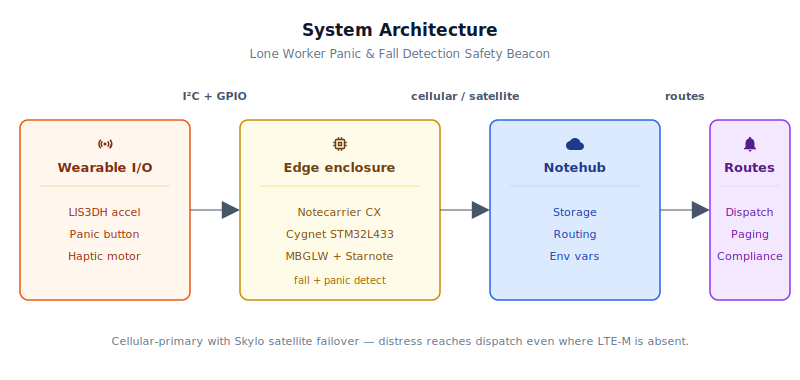
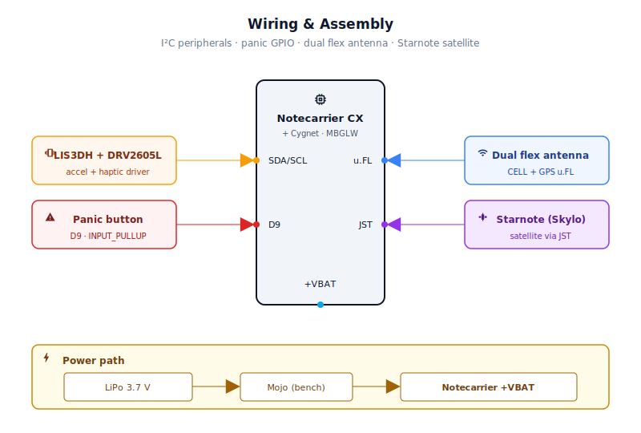
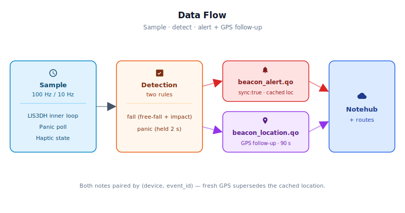

# Lone Worker Panic & Fall Detection Safety Beacon

<Note>

This reference application is intended to provide inspiration and help you get started quickly. It uses specific hardware choices that may not match your own implementation. Focus on the sections most relevant to your use case. If you'd like to discuss your project and whether it's a good fit for Blues, [feel free to reach out](https://blues.com/contact-sales/).

</Note>

A wearable [safety assurance](https://blues.com/safety-assurance/) device for utility linemen, oilfield pumpers, field service technicians, and solo contractors. A Blues [Notecard Cell+WiFi](https://shop.blues.com/products/notecard?utm_source=dev-blues&utm_medium=web&utm_campaign=store-link) paired with a [Starnote for Skylo](https://shop.blues.com/products/starnote?utm_source=dev-blues&utm_medium=web&utm_campaign=store-link) satellite module turns a belt-clip enclosure into a cellular-first, satellite-backed distress beacon — detecting falls and accepting an explicit panic-button press — that can reach a dispatcher from the middle of nowhere, exactly where lone-worker incidents happen.

## 1. Project Overview

> **Not a certified life-safety device.** This is a proof-of-concept reference design intended to demonstrate Blues hardware and firmware patterns. It is not a certified personal emergency response system (PERS), not a classified man-down or lone-worker protection device under any regulatory scheme, and has not been evaluated for fail-safe or safety-critical operation. It must **supplement — not replace** — established lone-worker safety procedures, mandatory check-in protocols, required PPE, and any regulatory or contractual safety obligations that apply to your operation. Never deploy this design as a sole means of worker protection.

**The problem.** A utility lineman working an isolated substation, an oilfield pumper checking a remote wellhead at night, a field-service tech in a basement boiler room at 2 AM — each of these workers shares a common vulnerability: if something goes wrong, nobody will know for hours. Lone-worker incidents don't always announce themselves. Falls from elevation are silent. Heart events are silent. The worker simply stops moving, and no one notices until a shift check-in is missed or a buddy does a welfare call.

The gap isn't awareness — most safety-conscious operations already require check-in procedures. The gap is *automatic, continuous* monitoring that doesn't depend on the worker remembering to push a button every 30 minutes. What these workers need is a device that monitors for the physical signatures of an incident — sudden free-fall, violent deceleration on impact, prolonged motionlessness after a fall — and raises an alarm without any action on the part of the worker. The panic button is a secondary escape valve: an explicit human override for situations where the physics don't look like a fall but the worker knows something is very wrong.

This project is that device — a wearable safety beacon built on two core detection modes: automatic fall detection and explicit panic-button input. The onboard Cygnet STM32L433 host runs a two-stage fall-detection algorithm on the LIS3DH accelerometer sampled at ~100 Hz (a 10-sample inner loop runs at 10 ms intervals so free-fall phases as short as 80 ms are always observed; Notecard I/O and state checks run at the outer ~10 Hz cadence; see [Section 6](#6-firmware-design) for the sampling design), monitors a held-down panic button with debounce logic, and drives a haptic motor to acknowledge every confirmed event. On fall or panic, the firmware immediately queues a compact emergency note carrying the Notecard's cached location and transmits it with `sync:true` — no GPS wait before the alert goes out. A non-blocking background GPS search then runs without suspending fall or button monitoring; if a fresh fix arrives within the timeout window, a follow-up `beacon_location.qo` note is queued with the event-time coordinates. See [Section 6](#6-firmware-design) for the full two-note flow.

**Why Notecard.** Cellular coverage is not a given for the environments where lone-worker incidents happen. A substation at the edge of a service area, a gas compressor station in a rural county, a mine portal — these are precisely the places where a worker is most isolated *and* where cellular signal is most likely to be marginal or absent. Relying on cellular alone creates the dangerous assumption that signal is available when it's needed most.

That's the reason Starnote for Skylo is included in this design, not as a nice-to-have, but as the architectural foundation. The Notecard's cellular path covers the vast majority of activations — LTE-M is broadly deployed, even in surprisingly rural areas. But when cellular genuinely fails, the Starnote satellite link is there. Skylo covers supported regions (see the [Starnote datasheet](https://dev.blues.io/datasheets/starnote-datasheet/) for the current coverage footprint); within that footprint, a device with an unobstructed view of the sky can deliver a distress message to Notehub even when every terrestrial network is unavailable. Satellite coverage is not guaranteed in every no-cellular location — it depends on the Skylo coverage region, sky-view geometry, and antenna orientation — but for the substations, oilfields, and rural worksites this design targets, it provides the safety margin that cellular alone cannot.

The WiFi path in the Notecard Cell+WiFi variant is an opportunistic bonus: a field tech standing near a facility WiFi AP may sync an alert without any cellular usage at all. WiFi is only active when network credentials have been provisioned on the Notecard and a compatible AP is within range.

**Deployment scenario.** The beacon ships as a self-contained unit in a rugged belt-clip enclosure, powered by a 3.7V LiPo battery. Workers clip it onto their belt or hard-hat band like a pager. Worker IDs are pre-provisioned per device in Notehub before deployment; changes to `worker_id` propagate to the device on the next inbound sync, which defaults to every 2 hours — not immediately at shift start. Falls and panics generate immediate alerts. No app, no phone pairing, no worker attention required — just clip it on and go.

## 2. System Architecture



**Device-side responsibilities.** The Cygnet STM32L433 host on the Notecarrier CX runs a dual-cadence loop: the LIS3DH is sampled at ~100 Hz via a 10-sample inner loop (one read every 10 ms, matching the sensor's ODR), while Notecard I/O, GPS polling, and haptic state all advance at the outer ~10 Hz cadence. The host simultaneously monitors the panic button with software debounce and drives the DRV2605L haptic motor driver for per-event feedback. When an alert fires, the host immediately queues the alert note with the Notecard's cached location and triggers a sync, then starts a non-blocking GPS search that runs in the background without suspending fall detection or button monitoring. If a fresh GPS fix arrives within the timeout window, a follow-up `beacon_location.qo` note is queued with the event-time coordinates. All Notecard communication stays on I²C — no AT commands, no serial framing, no session management.

**Notecard responsibilities.** The Notecard manages the cellular (or WiFi) session on the configured [`hub.set`](https://dev.blues.io/api-reference/notecard-api/hub-requests/#hub-set) `outbound` cadence (daily flush). Alert notes carry `sync:true`, which instructs the Notecard to bypass the outbound interval and attempt an immediate session. The Notecard also owns GPS/GNSS: after the host calls `card.location.mode`, the Notecard caches the resulting fix and automatically embeds it in every subsequent compact template note via the `_lat`/`_lon` template fields — no lat/lon passing required in the firmware's note body.

When Starnote for Skylo is attached and a cellular session cannot be established, the Notecard automatically routes through the satellite link. This failover is transparent to both the firmware and to Notehub: the same note, the same template, the same event structure arrives regardless of which transport delivered it.

**Notehub responsibilities.** [Notehub](https://notehub.io) receives every note across both transports, stores each event, and fans out to configured routes. `beacon_alert.qo` events (falls, panics) and `beacon_location.qo` follow-up coordinates go to a real-time dispatch endpoint. [Environment variables](https://dev.blues.io/guides-and-tutorials/notecard-guides/understanding-environment-variables/) in Notehub carry detection thresholds and worker IDs back to the device on the next inbound sync — operators tune the device without touching firmware.

**Routing to the cloud (high level).** Notehub supports HTTP, MQTT, AWS, Azure, and several other destinations; route setup is project-specific. See the [Notehub routing docs](https://dev.blues.io/notehub/notehub-walkthrough/#routing-data-with-notehub) — this project ships no specific downstream endpoint. A typical deployment routes both `beacon_alert.qo` and `beacon_location.qo` to the same real-time dispatch endpoint, joined by device UID and `event_id`.

## 2.5. Quickstart: First Build and Test

**What you'll have when you're done:** a wearable beacon that detects falls and panic-button presses, transmits alerts to Notehub over cellular or satellite, and provides haptic feedback on every event.

**Prerequisites:** Arduino IDE or `arduino-cli`, a Notehub account, and a Notecarrier CX fully assembled per the wiring in [Section 4](#4-wiring-and-assembly).

**Step 1: Install dependencies**

```bash
# Install the STM32 core
arduino-cli core install STMicroelectronics:stm32

# Install required libraries
arduino-cli lib install "Blues Wireless Notecard" \
                        "SparkFun LIS3DH Arduino Library" \
                        "Adafruit DRV2605 Library" \
                        "Adafruit BusIO"
```

**Step 2: Configure and compile**

1. Open `firmware/lone_worker_beacon/lone_worker_beacon.ino` in the Arduino IDE or a text editor.
2. In `lone_worker_beacon_helpers.h`, find the line `#define PRODUCT_UID` and replace the placeholder with your Notehub project's ProductUID (from [notehub.io](https://notehub.io) under project settings).
3. Compile (the FQBN below matches `firmware/lone_worker_beacon/sketch.yaml`, which the Arduino IDE picks up automatically when invoked from the sketch directory):

```bash
arduino-cli compile -b STMicroelectronics:stm32:Blues:pnum=CYGNET firmware/
```

**Step 3: Flash to Notecarrier CX**

```bash
arduino-cli upload -b STMicroelectronics:stm32:Blues:pnum=CYGNET \
                   -p /dev/ttyUSB0 firmware/
```

(Replace `/dev/ttyUSB0` with your platform's serial port; use `COM3` on Windows, find the port in Arduino IDE's Tools menu.)

**Step 4: Test and verify**

- Power the beacon; the Notecard claims itself to your project on first sync.
- Hold the panic button for 2+ seconds. You should feel a triple haptic buzz (alert queued).
- Check Notehub: navigate to your project's Devices tab, select your device, and view the Events log. A `beacon_alert.qo` event with `"type":"panic"` should appear within 30–90 seconds.
- Drop the beacon 50–80 cm onto a padded surface. You should feel a double buzz (fall detected) and see a `beacon_alert.qo` with `"type":"fall"` in the Events log.

If no event appears, check [Section 10 (Troubleshooting)](#10-troubleshooting-common-issues).

## 3. Hardware Requirements

| Part | Qty | Rationale |
|------|-----|-----------|
| [Notecarrier CX](https://shop.blues.com/products/notecarrier-cx?utm_source=dev-blues&utm_medium=web&utm_campaign=store-link) | 1 | Integrated carrier with an embedded Cygnet STM32L433 host — no separate MCU needed. I²C, SPI, analog, and GPIO headers support the full sensor stack. |
| [Notecard Cell+WiFi (MBGLW)](https://shop.blues.com/products/notecard?utm_source=dev-blues&utm_medium=web&utm_campaign=store-link) ([datasheet](https://dev.blues.io/datasheets/notecard-datasheet/note-mbglw/)) | 1 | Cellular-primary transport with integrated GPS/GNSS and WiFi fallback. Seats in the Notecarrier CX's M.2 slot. |
| [Starnote for Skylo — Antenna variant](https://shop.blues.com/products/starnote?utm_source=dev-blues&utm_medium=web&utm_campaign=store-link) | 1 | Satellite failover module. Select **Starnote for Skylo (Antenna)** when ordering — this variant has onboard Ignion antennas for both satellite (NTN) and GNSS; no external antenna is required for the Starnote itself. **GNSS role:** the Starnote's onboard GNSS antenna is used internally by the Starnote module for Skylo satellite link timing and synchronization — it is not the device's position source. The Notecard's own GPS module (fed by the GPS tail of the dual flexible antenna below) provides the location data embedded in alert notes. Connects to the Notecard via the onboard 6-pin JST-SH cable. The module itself must be mounted with a clear, unobstructed sky view (polycarbonate enclosure top face is fine). Within Skylo's supported coverage regions, provides a satellite uplink path when cellular is unavailable. Includes bundled satellite data; see the [Starnote datasheet](https://dev.blues.io/datasheets/starnote-datasheet/) for coverage footprint and data details. |
| [Blues Flexible Dual LTE/Wi-Fi and GPS/GNSS Antenna](https://shop.blues.com/collections/accessories/products/dual-flexible-antenna-cell-wi-fi?utm_source=dev-blues&utm_medium=web&utm_campaign=store-link) | 1 | Quectel YCA001BA dual-element flexible adhesive antenna. One tail connects to the Notecard MBGLW `CELL` u.FL port (LTE 700–960 MHz / 1710–2690 MHz); the other connects to the Notecard MBGLW `GPS` u.FL port (1580–1620 MHz). Covers both Notecard RF ports in a single $3.25 purchase. Polycarbonate enclosures are RF-transparent — adhere both elements to the interior enclosure wall; no external cable routing or bulkhead required. Position the GNSS element on the top face for best sky view during GPS acquisition events. This GPS tail is the device's primary location source — `card.location` draws from the Notecard's own GPS module via this connection, not from the Starnote's onboard GNSS. |
| [Blues Mojo](https://shop.blues.com/products/mojo?utm_source=dev-blues&utm_medium=web&utm_campaign=store-link) | 1 | Coulomb-counter on the LiPo rail for ground-truth current and energy measurement during bench validation. |
| [SparkFun Triple Axis Accelerometer Breakout — LIS3DH (SEN-13963)](https://www.sparkfun.com/products/13963) | 1 | 3-axis MEMS accelerometer at 0x18 on I²C. Configured at 100 Hz ODR (10 ms hardware sample period). The firmware samples at ~100 Hz via a 10-sample inner loop (one read every 10 ms), matching the sensor ODR and reliably catching free-fall phases as short as 80 ms. ±4g range provides headroom for both normal impacts and genuine falls. Built-in free-fall and shock interrupt hardware is a production upgrade path. |
| [Adafruit DRV2605L Haptic Motor Controller (#2305)](https://www.adafruit.com/product/2305) | 1 | I²C haptic driver with 123 built-in waveform effects. Drives the ERM motor directly; no transistor or PWM circuit needed. Supports both ERM and LRA motors. |
| [Adafruit Vibrating Mini Motor Disc (#1201)](https://www.adafruit.com/product/1201) | 1 | Small flat ERM disc motor. Gives distinct, wrist-perceptible confirmation buzzes at fall and panic events. Wires directly to the DRV2605L output terminals. |
| [SparkFun Momentary Push Button Switch — 12mm Square (PRT-09190)](https://www.sparkfun.com/products/9190) | 1 | Panic input, wired to D9 with firmware INPUT_PULLUP. Choose a cap that can be operated with a gloved hand for field deployability. |
| 3.7V LiPo battery, 1200 mAh, JST-PH 2-pin (e.g. [Adafruit #2011](https://www.adafruit.com/product/2011)) | 1 | Powers the device. Runtime depends on alert frequency and transport conditions — validate with Mojo before sizing for deployment. Use a cell with built-in protection circuitry. |
| [Adafruit JST PH 2-Pin Cable — Female Connector 100mm (#261)](https://www.adafruit.com/product/261) | 1 | Adapts the LiPo cell's JST-PH male plug to bare wire leads for connection to the Mojo `BAT+` and `GND` solder pads. Required to complete the LiPo→Mojo power path without cutting or modifying the LiPo cell's factory connector. |
| Polycarbonate project enclosure, ≥120 × 80 × 40 mm interior, IP54+ (e.g., Hammond 1553JGYBK) | 1 | Protects the board stack, battery, and connectors in a field-deployable package. The Notecarrier CX (83 × 63 mm) sets the minimum floor area. **Must be polycarbonate (non-metal)** — metal enclosures block LTE-M, GNSS, and satellite signals. Requires cutouts for the panic button and the LiPo JST connector for battery access; the flexible dual antenna adheres to the interior enclosure walls without external routing. IP54 or better is recommended for outdoor field use. Verify interior dimensions against your specific board-and-battery stack before ordering. **No charging circuit is included in this BOM** — see [Section 9](#9-limitations-and-next-steps) for rationale; plan enclosure cutouts for any charging connector you add downstream. |

All Blues hardware ships with an active SIM including 500 MB of cellular data and 10 years of service — no activation fees, no monthly commitment.

> **Installer-supplied, deployment-specific item.** Belt clip or wearable mounting hardware — attaches the beacon to a worker's belt, hard-hat band, or safety vest. Select a clip rated for the enclosure weight (~300 g fully loaded). Some enclosure families include an optional clip-arm accessory; a spring-steel belt clip can be mounted to the enclosure exterior with M3 screws.

> **Charging and power access.** No LiPo charging circuit, dock, or power-switch hardware is included in this BOM or wiring. The project runs on a bare LiPo cell until depleted. A production wearable needs a USB-C LiPo charging circuit integrated into the enclosure, plus overcharge and short-circuit protection if not already provided by the cell's built-in circuitry. See [Section 9](#9-limitations-and-next-steps) for details; adding a charging path is the expected next step for anyone moving from bench validation toward a field-deployed unit.

## 4. Wiring and Assembly



All host I/O lands on the [Notecarrier CX](https://dev.blues.io/datasheets/notecarrier-datasheet/notecarrier-cx-v1-3/) dual 16-pin headers. The Notecard Cell+WiFi seats in the M.2 slot; the Cygnet host communicates with it over the carrier's internal I²C bus. The Starnote connects via a 6-pin JST-SH cable plugged directly into the Notecard's onboard JST port (accessible on the Notecard edge, no Notecarrier CX modification required). The Mojo sits inline between the LiPo JST connector and the Notecarrier CX `+VBAT` pad.

All I²C peripherals (LIS3DH and DRV2605L) share the SDA/SCL bus exposed on the Notecarrier CX headers. On-board pull-ups are provided by the carrier; no external resistors are needed for the I²C lines.

Pin-by-pin:

- **+3V3** → LIS3DH `VIN`, DRV2605L `VIN` (both are 3.3V-native; see breakout datasheets for exact voltage range).
- **GND** → LIS3DH `GND`, DRV2605L `GND`, one leg of the panic button.
- **SDA** → LIS3DH `SDA`, DRV2605L `SDA`.
- **SCL** → LIS3DH `SCL`, DRV2605L `SCL`.
- **D9** → other leg of the panic button (firmware uses `INPUT_PULLUP`; active-low).
- **DRV2605L `MOTOR+` / `MOTOR-`** → Adafruit Vibrating Motor Disc red and blue wires (polarity matches the driver output; swap if motor doesn't run).
- **Power path (LiPo → Mojo → Notecarrier CX).** The Mojo sits inline on the battery rail as a coulomb counter. Wire it as follows:
  1. Plug the JST-PH female pigtail (BOM item) onto the LiPo's JST-PH male connector. This gives you two bare wire leads: `+` (red) and `−` (black).
  2. **LiPo `+` lead** → Mojo `BAT+` solder pad (or screw terminal marked `BAT`).
  3. **LiPo `−` lead** → Mojo `GND` solder pad. The Mojo's `GND` terminal is common to both the battery-negative rail and the load-negative rail.
  4. **Mojo `LOAD+` output** → Notecarrier CX **`+VBAT`** pad (completes the positive supply to the board stack).
  5. **Mojo `GND` terminal** → Notecarrier CX **`GND`** header pin (completes the ground-return path; without this connection the circuit is open).
- **Starnote JST cable** → Notecard JST port (the 6-pin cable carries UART + power between Notecard and Starnote). The Starnote (Antenna) variant has onboard Ignion antennas — no external antenna cable to route.

> **Antenna placement and connector mapping.** The Blues Flexible Dual LTE/Wi-Fi and GPS/GNSS Antenna has two labeled tails: connect the LTE tail to the Notecard MBGLW `CELL` u.FL port and the GPS tail to the Notecard MBGLW `GPS` u.FL port. Peel and adhere both elements to the interior wall of the polycarbonate enclosure — polycarbonate is RF-transparent, so no external pigtail routing or bulkhead is needed. Position the GPS element on the top (sky-facing) wall for best acquisition geometry during GPS-on events. The **Starnote for Skylo (Antenna)** variant has onboard Ignion antennas; no external satellite antenna is connected or required. Mount the Starnote with its top face oriented toward the sky (inside the polycarbonate enclosure top is sufficient); in the northern hemisphere a southward orientation improves Skylo link margin. The Starnote's onboard GNSS antenna supports its own satellite link functions and is separate from the Notecard's GPS module; the Notecard `GPS` u.FL port (connected to the dual antenna's GPS tail) is the location source for all `card.location` data embedded in alert notes.

> **Charging is out of scope for this POC.** No charging circuit, dock, or inductive coil is wired in this build. Route the LiPo JST connector to an accessible point on the enclosure wall so the battery can be swapped or a bench charger connected without fully disassembling the unit. Do not seal the JST connector inside the enclosure with no external access path.

The LIS3DH's SDO/SA0 pin sets the I²C address. Leave it unconnected or pulled to GND for address 0x18 (the firmware default). The DRV2605L address (0x5A) is fixed; no conflict.

## 5. Notehub Setup and Configuration

**Detailed walkthrough for first-time users:**

1. **Create a project.** Sign up at [notehub.io](https://notehub.io). Click **Create a Project** → name it (e.g., "Lone Worker Beacons") → select your region → confirm. Copy the **ProductUID** displayed on the project details card. Paste this into `firmware/lone_worker_beacon/lone_worker_beacon_helpers.h` as the `PRODUCT_UID` macro value before flashing.

2. **Claim the Notecard.** Power the beacon with a Notecard inserted and provisioned SIM. On first cellular or satellite session the Notecard associates with your project automatically. Verify in Notehub: navigate to **Devices** → click on your device's UID — it should appear within 30–90 seconds.

3. **Complete the Starnote first-light sequence.** Before satellite transmission is possible, the Notecard must complete at least one successful cellular or WiFi sync. This is how the Notecard delivers the compact template definitions to Notehub. Follow the [Starnote for Skylo Quickstart](https://dev.blues.io/quickstart/starnote-quickstart/) to verify the Starnote connection and confirm satellite transport is functional before deploying.

4. **Create a Fleet per region or team.** [Fleets](https://dev.blues.io/guides-and-tutorials/fleet-admin-guide/) group devices for shared configuration. A natural structure is one fleet per crew or site — all devices in a fleet share the same detection thresholds, with per-device worker ID overrides. [Smart Fleets](https://dev.blues.io/notehub/notehub-walkthrough/#using-smart-fleet-rules) can route a device to a different fleet automatically based on its reported location if workers cross territories.

5. **Set environment variables.** All variables below are optional; firmware defaults apply until overridden. To set an env var in Notehub: open your project → **Devices** tab → click your device → **Environment** → **Fleet Environment** (applies to all devices in the fleet) or **Device Environment** (overrides fleet settings for this device alone) → add key-value pairs. Values propagate to the Notecard's local cache on the next inbound sync (default every 2 hours), then to the host on the following `env.get` poll (also up to 2 hours). Total propagation time: up to 4 hours. No re-flashing is required.

   | Variable | Default | Purpose |
   |---|---|---|
   | `worker_id` | `worker-001` | Human-readable worker or device identifier included in every note. Maximum 24 characters; longer values are silently truncated on-device to preserve compact-packet payload size. Pre-provision this per device before deployment; changes propagate to the device on the next inbound sync (up to 2 hours by default), not immediately at shift start. |
   | `freefall_g` | `0.55` | Total acceleration magnitude (g) below which free-fall phase is declared. Clamped to 0.10–0.90 g. |
   | `impact_g` | `2.5` | Total acceleration magnitude (g) above which fall impact is confirmed. Clamped to 1.50–8.00 g. |
   | `fall_window_ms` | `500` | Milliseconds after a free-fall episode during which an impact must be detected to confirm the fall. Clamped to 100–2000 ms. |
   | `freefall_min_ms` | `80` | Minimum milliseconds the device must remain in free-fall before the impact window opens. Shorter free-falls (stumbles, tool drops) are ignored. Clamped to 20–500 ms. |
   | `panic_hold_ms` | `2000` | Milliseconds the button must be held before a panic alert fires. Prevents accidental triggers from gloved hands. Clamped to 500–10000 ms. |

6. **Configure routes** (optional for now; use for live dispatch). Go to **Routes** → **Create Route** → Name it (e.g., "Dispatch Alerts") → select **Event** → filter by file `beacon_alert.qo` → select a destination (HTTP, SMTP, Slack, etc.). **Important:** Add a **second route** for `beacon_location.qo` to the **same** destination. When a fresh GPS fix arrives during the 90-second background search, `beacon_location.qo` carries event-time coordinates that supersede the cached location in the paired `beacon_alert.qo`. Downstream systems must pair the two notes by `(device, event_id)` — `event_id` resets to 0 on each power cycle and is not globally unique on its own. The `(device, event_id)` join key is unambiguous across repeated alerts, retries, and network reordering.

## 6. Firmware Design

Source files (all three live directly under `firmware/`):
- [`firmware/lone_worker_beacon/lone_worker_beacon.ino`](firmware/lone_worker_beacon/lone_worker_beacon.ino) — constants, globals, `setup()`, `loop()`.
- [`firmware/lone_worker_beacon/lone_worker_beacon_helpers.h`](firmware/lone_worker_beacon/lone_worker_beacon_helpers.h) — shared `#define` constants, `extern` declarations, env-var clamp ranges, function prototypes.
- [`firmware/lone_worker_beacon/lone_worker_beacon_helpers.cpp`](firmware/lone_worker_beacon/lone_worker_beacon_helpers.cpp) — all helper function implementations.

**Dependencies:**
- Arduino core for STM32 ([`stm32duino/Arduino_Core_STM32`](https://github.com/stm32duino/Arduino_Core_STM32)) — installed via Arduino IDE Boards Manager.
- [`Blues Wireless Notecard`](https://github.com/blues/note-arduino) (the `note-arduino` library). Install via Arduino Library Manager: `arduino-cli lib install "Blues Wireless Notecard"`.
- [`SparkFun LIS3DH Arduino Library`](https://github.com/sparkfun/SparkFun_LIS3DH_Arduino_Library). Install via Library Manager: `arduino-cli lib install "SparkFun LIS3DH Arduino Library"`.
- [`Adafruit DRV2605 Library`](https://github.com/adafruit/Adafruit_DRV2605_Library) and its `Adafruit BusIO` dependency. Install via Library Manager.

### Modules

| Responsibility | Function |
|---|---|
| Notecard configuration (`hub.set`) at boot; returns fault state | `notecardConfigure()` |
| Compact template registration (2 templates, retried; returns fault state) | `defineTemplates()` |
| Environment variable refresh with clamp validation; called at boot and every 2 h | `fetchEnvVars()` |
| LIS3DH setup (100 Hz, ±4g) | `initAccel()` |
| DRV2605L setup (ERM library 1) | `initHaptic()` |
| Two-stage fall detection | `pollFallDetection()` |
| Hold-to-confirm panic button | `checkPanicButton()` |
| Start non-blocking GPS search after an alert | `beginGpsSearch()` |
| Advance GPS search; queue `beacon_location.qo` on fresh fix | `pollGpsSearch()` |
| Alert note with immediate sync (cached location + `loc_age_s` + `event_id`) | `sendAlert()` |
| Arm non-blocking haptic pulse sequence | `triggerHaptic()` |
| Advance haptic state machine (called every loop pass) | `pollHaptic()` |

### Fall Detection Algorithm

The firmware uses a two-stage software algorithm sampled at ~100 Hz: ten `pollFallDetection()` calls run per outer loop pass, spaced 10 ms apart in a fast inner loop (matching the LIS3DH's 100 Hz ODR). At this rate the 80 ms minimum free-fall duration guard (`DEFAULT_FREEFALL_MIN_MS`) spans ~8 consecutive samples, providing meaningful noise rejection. Notecard I/O, GPS polling, and haptic state advance once per outer pass at the ~10 Hz outer cadence. A single-stage threshold check (just watching for a spike) generates too many false positives from everyday bumps; requiring a free-fall phase before the impact check reduces nuisance alerts from walking into a doorframe or dropping a tool.

**Stage 1 — Free-fall.** On each of the 10 inner-loop reads (spaced 10 ms apart), the firmware computes total acceleration magnitude: `|a| = √(ax² + ay² + az²)`. When total-g drops below `freefall_g` (default 0.55g) and stays there for at least `freefall_min_ms` (default 80ms, remotely configurable via Notehub), the firmware exits Stage 1 and opens an impact-watch window. At ~100 Hz sampling the 80 ms guard spans ~8 consecutive readings — meaningful noise rejection. A genuine free-fall from ~30 cm bench height lasts well over 100 ms.

**Stage 2 — Impact.** Within `fall_window_ms` (default 500ms) of the free-fall phase ending, if total-g exceeds `impact_g` (default 2.5g), the fall is confirmed. The window closes automatically if no impact arrives — preventing a brief stumble or a tool being set down from generating a false alert.

### Event Payload Design

Both Notefiles use [compact templates](https://dev.blues.io/notecard/notecard-walkthrough/low-bandwidth-design/#working-with-note-templates) with `"format":"compact"`. This is a hard requirement for Starnote NTN transport — compact notes use fixed-length binary encoding, keeping the satellite packet well inside the 256-byte maximum payload limit and minimizing per-message satellite cost. The `_lat`/`_lon` keywords in the template body instruct the Notecard to embed its cached GPS location automatically; the firmware does not need to explicitly pass coordinates in the `note.add` body.

Both templates include an `event_id` field — a monotonic counter incremented once per new alert dispatch, **not** per retry. The same `event_id` value appears in both `beacon_alert.qo` and its paired `beacon_location.qo`. Downstream systems must use `(device, event_id)` as the join key — `event_id` resets to 0 on each power cycle and is not globally unique on its own. The scoped `(device, event_id)` pair is stable across repeated alerts of the same type, across retries, and across network reordering.

Example `beacon_alert.qo` event as it appears in Notehub (initial alert — cached location):

```json
{
  "uid": "d84e3a...",
  "device": "dev:000000000000000",
  "file": "beacon_alert.qo",
  "received": 1714582020,
  "best_lat": 40.71280,
  "best_lon": -74.00601,
  "best_location": "New York NY",
  "body": {
    "type": "fall",
    "worker_id": "lineman-042",
    "event_id": 7,
    "voltage": 3.71,
    "loc_age_s": 142
  }
}
```

Example `beacon_location.qo` follow-up event (fresh event-time fix — sent only if GPS acquires within 90 s):

```json
{
  "uid": "d84e3b...",
  "device": "dev:000000000000000",
  "file": "beacon_location.qo",
  "received": 1714582087,
  "best_lat": 40.71294,
  "best_lon": -74.00589,
  "best_location": "New York NY",
  "body": {
    "type": "fall",
    "worker_id": "lineman-042",
    "event_id": 7
  }
}
```

The `type` field in `beacon_alert.qo` carries one of two values: `fall` (two-stage algorithm confirmed) or `panic` (button held). `loc_age_s` is the age in seconds of the Notecard's cached GPS fix at the moment the alert was queued (−1.0 if no fix was available). `event_id` resets to 0 on each power cycle; downstream correlation should use `(device, event_id)` as the join key. When `beacon_location.qo` is also present (matching `event_id`), its coordinates supersede the cached location in `beacon_alert.qo` for mapping and dispatch response.

### Low-Power Strategy

**This POC keeps the host MCU awake continuously — this is a deliberate design choice, not an oversight.** The device must detect a fall or button press at any moment, so `card.attn` sleep mode (which cuts host power entirely) is incompatible with the monitoring requirement. Instead, the host MCU remains awake continuously, running a dual-cadence loop: the LIS3DH is sampled at ~100 Hz via a 10-sample inner loop (10 ms between reads), and Notecard/GPS/haptic state advances at the outer ~10 Hz cadence. The inner-loop delays pace the outer cadence without a separate top-level `delay()` call. The battery-life penalty is real and significant: the STM32L433 at its default clock draws approximately 10–15 mA active, making host idle the dominant draw at steady state. See the [power validation table](#8-validation-and-testing) for per-state figures and validate total runtime with Mojo before sizing a battery for deployment.

The Notecard runs in `periodic` mode with `outbound: 1440` (daily flush) and `inbound: 120` (2-hour environment-variable refresh). All emergency notes carry `sync:true`, which bypasses the outbound interval and triggers an immediate cellular or satellite session — the daily flush is a backstop for any queued data that sync:true did not deliver. Between sync events the Notecard sits in its own low-power STOP2 idle state at ~8–18 µA. GPS is off by default and turned on only during alert events (fall, panic) — continuous GPS would consume an additional 30+ mA and is unnecessary given the design's event-driven location update cadence.

A production implementation should use STM32L433 low-power STOP2 mode with GPIO wakeup on the LIS3DH hardware interrupt (INT1) and button pin — dropping host idle to ~2–3 µA while still catching every fall event in real time. See [Limitations](#9-limitations-and-next-steps).

### Retry and Error Handling

**Startup path.** Both `notecardConfigure()` and `defineTemplates()` return a boolean. `notecardConfigure()` retries `hub.set` up to five times to handle the cold-boot I²C race. `defineTemplates()` retries each of the two template registrations (`beacon_alert.qo`, `beacon_location.qo`) up to three times. If either function returns false, `g_setupFault` is latched in `setup()`, and a distinctive slow double-buzz haptic pattern fires so a misconfigured device is obvious at power-on without needing debug serial. A missing or empty `PRODUCT_UID` is also caught at runtime and added to the fault latch.

A startup fault — missing or empty `PRODUCT_UID`, `hub.set` failure after five retries, any template registration failure, or LIS3DH initialization failure — is treated as unrecoverable. After the slow double-buzz pattern fires, `setup()` enters an infinite halt loop that repeats the fault buzz every 5 seconds; the beacon never enters `loop()` and no alerts are ever sent. This hard-stop behavior is intentional for a safety device: arming a beacon whose notes cannot route, or whose Starnote compact transport may be broken, gives a false sense of protection. The recurring buzz makes an unconfigured device unmistakably obvious at power-on — verify `PRODUCT_UID`, Notecard connectivity, and template registration, then power-cycle before deploying.

**Sensor degradation.** `initAccel()` and `initHaptic()` each return a boolean; the main loop checks `g_accelReady` and `g_hapticReady` before calling the relevant functions. A missing or unresponsive LIS3DH at boot is treated as a hard fault — `g_setupFault` is latched alongside `g_accelFaultLatched`, the distinctive slow double-buzz fault pattern fires, and `setup()` enters the infinite halt loop. This ensures a beacon that cannot perform fall detection is immediately obvious at power-on and cannot be silently deployed as panic-only. A missing DRV2605L skips haptic feedback without crashing the loop. An accelerometer fault that develops after boot (consecutive bad reads beyond `ACCEL_FAIL_THRESHOLD` after `ACCEL_REINIT_MAX` failed reinitialisations) latches `g_accelFaultLatched` and clears `g_accelReady`, permanently disabling fall detection until power-cycle. The device then emits a single buzz every 30 seconds so an operator can recognize the unit has dropped to degraded panic-only mode.

**Notecard response errors.** All `requestAndResponse()` calls check for a `NULL` response and call `notecard.responseError()` before accessing fields; failed transactions are skipped and the loop continues with stale values. `note.add` failures for alerts are retried up to `ALERT_RETRY_MAX` (3) times with 500 ms spacing via the non-blocking retry queue; each retry attempt carries the original `event_id` and `loc_age_s` so no context is lost.

**Important — queueing failure vs. delivery failure.** Only notes that `note.add` *successfully accepts* are stored inside the Notecard and retried by the Notecard for cellular or satellite delivery. If the firmware's retry budget is exhausted before `note.add` succeeds — for example because the Notecard is temporarily unreachable on I²C — the alert is **dropped** and is never delivered to Notehub. The firmware logs this via `DEBUG_PRINTLN` but takes no further action. If stronger guarantees are required, persist unsent alerts in non-volatile storage until `note.add` succeeds, or trigger a local fault (e.g., a distinctive haptic pattern) when the retry budget is exceeded. An operator who suspects a missed alert should issue `{"req":"hub.status"}` from the Notehub in-browser terminal to check the last sync time, pending note count, and transport-layer error.

**GPS acquisition.** The non-blocking GPS state machine polls `card.location` at 2-second intervals (throttled from the 10 Hz loop rate) for up to `DEFAULT_GPS_TIMEOUT_SEC` (90 s). Before the alert note is queued, the firmware captures the current cache epoch into a per-alert local variable (`thisCacheEpoch`); this value is passed to `sendAlert()` to compute `loc_age_s` and, when no GPS search is already active, is copied into `g_gpsCacheEpoch` (the freshness baseline the search uses). A fix is accepted only when its epoch post-dates that baseline, preventing a stale cached fix from being mistaken for a fresh acquisition. On a fresh fix, a `beacon_location.qo` note is queued immediately with `sync:true`. The timeout check uses elapsed time (`millis() - start >= interval`) rather than an absolute deadline to remain correct across the 49.7-day `millis()` rollover. If no fresh fix arrives within the timeout, GPS is disabled and only the initial `beacon_alert.qo` stands. Only one GPS enrichment window can be active at a time — if a second alert fires during the 90-second window (possible because the 60-second cooldown is shorter than the GPS timeout), `beginGpsSearch()` returns immediately and the second alert receives its cached location only; no `beacon_location.qo` is queued for it.

**Alert rate limiting and suppression.** `DEFAULT_ALERT_COOLDOWN_SEC` (60 s) gates fall and panic alerts. If a fall or panic event occurs within 60 seconds of the previous alert, no note is queued and no GPS acquisition is attempted. A suppressed fall produces no local indication; a suppressed panic produces a single haptic buzz so the worker knows the hold was registered (distinct from the triple-buzz that confirms an alert was accepted). This prevents alert storms from a tumbling device without requiring any worker action.

### Key Code Snippet 1: Compact Template with `_lat`/`_lon`

The `format: "compact"` and `port` arguments are required for Starnote NTN transport. The `_lat`/`_lon` template fields tell the Notecard to embed its cached best-available location (GNSS or cell-derived) in the compact packet automatically — the firmware never passes coordinates in the note body. The `event_id` field uses type hint `14` (4-byte signed int32, per the Blues compact-template encoding table) and is written to both `beacon_alert.qo` and `beacon_location.qo` with the same value; downstream systems join the two notes using `(device, event_id)` as the key.

```cpp
J *req  = notecard.newRequest("note.template");
JAddStringToObject(req, "file",   "beacon_alert.qo");
JAddNumberToObject(req, "port",   50);
JAddStringToObject(req, "format", "compact");
J *body = JAddObjectToObject(req, "body");
JAddStringToObject(body, "type",      "s");    // variable-length string hint
JAddStringToObject(body, "worker_id", "s");
JAddNumberToObject(body, "event_id",  14);     // 4-byte signed int32 correlation key
JAddNumberToObject(body, "voltage",   14.1);   // 4-byte float
JAddNumberToObject(body, "_lat",      14.1);   // GPS lat from Notecard cache
JAddNumberToObject(body, "_lon",      14.1);   // GPS lon from Notecard cache
notecard.sendRequest(req);
```

### Key Code Snippet 2: Immediate-Sync Alert

`sync:true` tells the Notecard to attempt a cellular (or satellite) session immediately, bypassing the periodic outbound interval. The Notecard tries cellular first; if that fails and Starnote is attached, the note routes over satellite automatically.

```cpp
J *req  = notecard.newRequest("note.add");
JAddStringToObject(req, "file", "beacon_alert.qo");
JAddBoolToObject(req,   "sync", true);
J *body = JAddObjectToObject(req, "body");
JAddStringToObject(body, "type",      "fall");
JAddStringToObject(body, "worker_id", "lineman-042");
JAddNumberToObject(body, "event_id",  (double)thisEventId);  // monotonic; matches beacon_location.qo
JAddNumberToObject(body, "voltage",   3.71);
notecard.sendRequest(req);
```

### Key Code Snippet 3: Two-Stage Fall Confirmation

Free-fall (low-g) followed by impact (high-g) within a short window. Both must occur in sequence; either alone does not confirm a fall.

```cpp
float totalG = sqrtf(ax*ax + ay*ay + az*az);

// Stage 1: free-fall phase — total-g drops below threshold for minimum duration
if (!g_inFreefall && totalG < g_freefallG) {
    g_inFreefall    = true;
    g_freefallStart = millis();
} else if (g_inFreefall && totalG >= g_freefallG) {
    if ((millis() - g_freefallStart) >= g_freefallMinMs) {
        g_watchingImpact    = true;
        g_impactWindowStart = millis();   // record start; compare elapsed (wraparound-safe)
    }
    g_inFreefall = false;
}

// Stage 2: impact detection — high-g spike within the window
if (g_watchingImpact) {
    if ((millis() - g_impactWindowStart) >= g_fallWindowMs) {
        g_watchingImpact = false;   // window expired — not a fall
    } else if (totalG > g_impactG) {
        g_watchingImpact = false;
        return true;   // confirmed fall
    }
}
```

### Key Code Snippet 4: Two-Note GPS Flow

The firmware uses a non-blocking GPS design: the initial alert note is queued immediately so it can transmit without waiting for a fix, while GPS acquisition runs in the background without pausing fall detection or button monitoring.

**Step 1 — `sendAlert()`.** Before the alert note is sent, `loop()` computes `loc_age_s` once from a live `card.time` call and the pre-alert cache epoch — capturing the fix age at the moment the event fired. This value is passed directly to `sendAlert()` and stored in the retry-queue entry so every subsequent retry reports the same original fix age, not an age relative to the retry timestamp. The alert note itself is queued with the Notecard's cached location embedded via `_lat`/`_lon`, `sync:true`, and the same `event_id` on every attempt. `beginGpsSearch()` is called only after `sendAlert()` returns `true`, confirming the note was queued. This ordering guarantees no GPS search is ever orphaned by a failed `note.add`: if `sendAlert()` fails, `enqueueAlert()` adds the alert (including its `event_id` and pre-computed `loc_age_s`) to the non-blocking retry queue, and `beginGpsSearch()` fires automatically once the retry succeeds inside `pollAlertRetry()`.

**Step 2 — `pollGpsSearch()`.** Called once per outer loop pass. Throttles `card.location` polls to once per 2 seconds (GNSS fixes update far slower than the outer loop rate). Accepts only a fix whose epoch post-dates the pre-alert cache snapshot to prevent a stale cached fix from being mistaken for a new acquisition. On a fresh fix, queues `beacon_location.qo` with `sync:true` and the same `event_id` as the initial alert; downstream dispatch joins the two notes using `(device, event_id)` as the key.

```cpp
// Step 1: compute loc_age_s once at event-fire time, then assign event_id and
// queue the alert; start GPS only after the alert is confirmed queued.
// Capturing loc_age_s here (not inside sendAlert()) ensures every retry
// reports the original fix age, not the age relative to the retry timestamp.
float thisLocAgeS = /* card.time − thisCacheEpoch, or −1.0 if no fix */ ...;
uint32_t thisEventId = ++g_alertEventId;   // monotonic; incremented once per new alert
bool sent = sendAlert(alertType, thisEventId, thisLocAgeS);   // cached loc + event_id
if (sent) {
    g_lastAlertMs = now;
    beginGpsSearch(alertType, thisEventId);      // enables continuous GPS; returns immediately
} else {
    // Preserve event-time locAgeS in the queue so all retries report the
    // original fix age — not the (growing) age at retry time.
    enqueueAlert(alertType, thisCacheEpoch, thisEventId, thisLocAgeS);
}

// Step 2: background fix acquisition (called from loop() at the outer ~10 Hz cadence)
void pollGpsSearch() {
    if (!g_gpsSearching) return;
    // Timeout: compare elapsed time, not absolute deadline (wraparound-safe)
    if ((millis() - g_gpsSearchStart) >= (DEFAULT_GPS_TIMEOUT_SEC * 1000UL)) {
        // disable GPS; initial alert location stands
        disableGps();  return;
    }
    if ((millis() - g_gpsLastPollMs) < 2000UL) return;  // throttle polls
    g_gpsLastPollMs = millis();

    J *rsp = notecard.requestAndResponse(notecard.newRequest("card.location"));
    uint32_t fixTime = (uint32_t)JGetNumber(rsp, "time");
    // ...
    if (fixTime > g_gpsCacheEpoch && (lat != 0.0 || lon != 0.0)) {
        // Fresh fix: queue follow-up note with event-time coordinates + same event_id
        J *req = notecard.newRequest("note.add");
        JAddStringToObject(req, "file", "beacon_location.qo");
        JAddBoolToObject(req, "sync", true);
        J *body = JAddObjectToObject(req, "body");
        JAddStringToObject(body, "type",      g_gpsAlertType);
        JAddStringToObject(body, "worker_id", g_workerId);
        JAddNumberToObject(body, "event_id",  (double)g_gpsEventId);  // matches beacon_alert.qo
        // _lat/_lon embedded automatically by compact template at note.add time
        notecard.requestAndResponse(req);
        disableGps();
    }
}
```

If GPS times out, only the initial `beacon_alert.qo` note is sent; the cached location (which may be GNSS-derived, cell-derived, stale, or empty) stands. The `loc_age_s` field in the initial alert records how old the cached fix was at alert time, letting dispatch judge location freshness independently.

## 7. Data Flow



**Collected.** On every outer loop pass (~10 Hz): ten LIS3DH accelerometer samples read at 10 ms intervals (100 Hz effective), with the two-stage fall-detection state machine evaluated on each. On each alert event: battery voltage (`card.voltage`), cached-fix age at alert time (`loc_age_s`), and a monotonic `event_id`. GPS search runs non-blocking in the background after an alert; a fresh fix, if acquired, produces a follow-up note carrying the same `event_id`.

**Location accuracy.** When an alert fires, `beacon_alert.qo` is queued immediately with the Notecard's current cached location embedded via `_lat`/`_lon` and `loc_age_s` recording the fix age in seconds (−1 if unknown). Concurrently, a non-blocking GPS search polls `card.location` at 2-second intervals for up to 90 seconds. If a fix whose epoch post-dates the pre-alert cache snapshot is acquired, a `beacon_location.qo` note is queued with the event-time coordinates. If GPS times out, only the initial alert note is sent and the cached location (which may be GNSS-derived, cell-derived, stale, or empty) stands.

**Transmitted.**
- `beacon_alert.qo` — emitted on confirmed fall or panic. `sync:true` triggers immediate cellular (or satellite) transmission. Contains: alert type, worker ID, `event_id` (monotonic correlation key), battery voltage, `loc_age_s` (cached-fix age at alert time), and cached location via compact template `_lat`/`_lon`.
- `beacon_location.qo` — emitted after a confirmed alert when a fresh GPS fix arrives within the timeout window. `sync:true`. Contains: alert type (echoes the triggering event), worker ID, `event_id` (matches the paired `beacon_alert.qo`), and fresh event-time coordinates via `_lat`/`_lon`. This note is optional — it is queued only if GPS succeeds during the background search window.

**Routed.** Both Notefiles arrive at Notehub regardless of whether they came via LTE-M or Skylo satellite — the transport is transparent in the event structure. Downstream systems should pair `beacon_alert.qo` and `beacon_location.qo` using `(device, event_id)` as the join key — `event_id` is device-local, resets to 0 on each power cycle, and is not unique across devices on its own. The initial alert carries the best-available cached location, and a subsequent `beacon_location.qo` with the same `event_id` (from the same device) supersedes it with event-time coordinates when GPS acquires within the 90-second background window. Pairing on `(device, event_id)` is unambiguous across repeated alert types, retries, and network reordering.

**Alert triggers:**
- `fall` — two-stage algorithm: free-fall phase followed by impact within the detection window. Suppressed if within 60 s of the previous alert.
- `panic` — panic button held for `panic_hold_ms` (default 2 seconds). Suppressed if within 60 s of the previous alert.

## 7.5. Event Payload Reference (All Fields)

When a `beacon_alert.qo` or `beacon_location.qo` event arrives at Notehub, it includes both metadata (auto-added by Notehub) and the compact-template body. Downstream integrators should reference these fields:

**`beacon_alert.qo` body fields:**

| Field | Type | Description |
|-------|------|-------------|
| `type` | string | `"fall"` (two-stage algorithm confirmed) or `"panic"` (button held). |
| `worker_id` | string | Human-readable worker or device identifier (max 24 chars; longer values truncated). |
| `event_id` | int32 | Monotonic counter incremented once per new alert dispatch (not per retry). Same value in paired `beacon_location.qo`. Use `(device, event_id)` as join key downstream. Resets to 0 on power cycle. |
| `voltage` | float | Battery voltage in volts at alert time. Useful for fleet health monitoring. |
| `loc_age_s` | float | Age of the Notecard's cached GPS fix in seconds at the moment the alert was queued. -1.0 if no cached fix is available. When `beacon_location.qo` is present (same `event_id`), its coordinates supersede this cached location. |
| `_lat` | float | Cached GPS latitude, embedded automatically by the compact template. May be stale or cell-derived if no GNSS fix is available. |
| `_lon` | float | Cached GPS longitude, embedded automatically by the compact template. May be stale or cell-derived if no GNSS fix is available. |

**`beacon_location.qo` body fields:**

| Field | Type | Description |
|-------|------|-------------|
| `type` | string | Echoes the triggering alert type (`"fall"` or `"panic"`). |
| `worker_id` | string | Echoes the worker ID from the paired alert. |
| `event_id` | int32 | Matches the `event_id` in the paired `beacon_alert.qo`. Downstream systems use `(device, event_id)` as the join key to correlate the two notes. |
| `_lat` | float | Fresh event-time GPS latitude, acquired during the background search window (within 90 seconds of the initial alert). Supersedes the cached location in `beacon_alert.qo`. |
| `_lon` | float | Fresh event-time GPS longitude, acquired during the background search window. Supersedes the cached location in `beacon_alert.qo`. |

**Notehub envelope metadata (auto-added):**

| Field | Description |
|-------|-------------|
| `uid` | Unique event identifier (Notehub-issued). |
| `device` | Device UID within your project (format: `dev:XXXX...`). |
| `file` | Notefile name (`beacon_alert.qo` or `beacon_location.qo`). |
| `received` | Unix timestamp when Notehub received the event. |
| `best_lat`, `best_lon`, `best_location` | Notehub-computed best-available location (reverse-geocoded). |

**Join logic example (pseudo-SQL):**

```sql
SELECT alert.*, location.best_lat, location.best_lon
FROM beacon_alert alert
LEFT JOIN beacon_location location
  ON alert.device = location.device
  AND alert.event_id = location.event_id
WHERE alert.received >= UNIX_TIMESTAMP() - 3600;  -- Last hour
```

## 8. Validation and Testing

**Expected steady-state behavior.** In normal operation, a healthy beacon produces zero `beacon_alert.qo` events and zero `beacon_location.qo` events. To verify that Notecard provisioning, template registration, and connectivity are all working after assembly, trigger a test fall or panic (see below) and confirm the event appears in Notehub within session-establishment time (typically 30–90 seconds on cellular). If no event appears, check the Notecard's sync status via Notehub's in-browser terminal (`{"req":"hub.status"}`) to see the last sync time, pending note count, and transport-layer error.

**Simulating a fall.** On the bench, a realistic fall simulation: hold the device at chest height and drop it onto a padded surface from 50–80 cm. The firmware's default thresholds (0.55g free-fall, 2.5g impact) are tuned for human-body-scale falls. You should see the haptic motor pulse twice (non-blocking — monitoring continues during the buzz sequence) and a `beacon_alert.qo` note with `"type":"fall"` appear in Notehub within session-establishment time — typically 30–90 seconds in cellular conditions. If the device acquires a fresh GPS fix during the background search window, a follow-up `beacon_location.qo` note will appear shortly after with the event-time coordinates. In poor GNSS conditions (indoors, obstructed sky view) the background search times out after 90 seconds and only the initial alert note is sent.

**Simulating a panic.** Hold the button for 2+ seconds. After the 30 ms debounce settles on the press edge, the haptic motor emits one click to confirm the press was registered. When the hold threshold is reached, the firmware evaluates the 60-second alert cooldown before queuing anything: if the cooldown has expired, the panic alert is accepted and three haptic buzzes (non-blocking — each fires 220 ms apart without pausing button monitoring) confirm the alert is queued for transmission. The triple-buzz means the alert has been accepted for transmission handling — either directly into the Notecard's outbound queue (if `note.add` succeeded) or into the firmware's local retry queue for delivery as soon as the Notecard is reachable (if `note.add` failed transiently). If the device is still within the cooldown window, a single buzz acknowledges the hold without queuing an alert — use Notehub's event log to distinguish a suppressed panic from a queued one. A `beacon_alert.qo` with `"type":"panic"` should arrive in Notehub within session-establishment time. If GPS acquires a fresh fix during the background search, a `beacon_location.qo` follow-up note will appear as well.

**Simulating satellite failover.** With a Starnote attached and the device outdoors (antenna has sky view), force a satellite session by temporarily disabling cellular transport in the Notecard (via `{"req":"card.transport","method":"ntn"}` issued from the Notehub in-browser terminal). Trigger a panic. The alert should arrive in Notehub over the satellite path — verifiable in the event metadata, which will show `"transport":"ntn"`. Reset transport afterward: `{"req":"card.transport","method":"-"}`.

**Power validation with Mojo.** The [Mojo](https://dev.blues.io/datasheets/mojo-datasheet/) sits inline between the LiPo and the Notecarrier CX `+VBAT` pad. It accumulates the charge consumed by the board stack and makes the reading available over its Qwiic I²C link. **The beacon firmware does not read the Mojo** — it is a bench measurement instrument only. To retrieve the mAh reading during validation, connect a separate Qwiic-capable host (a SparkFun RedBoard Qwiic, a Notecarrier AL with its own sketch, or any I²C host with a Qwiic port) running the Mojo readout sketch to the Mojo's Qwiic connector. Run that host alongside the beacon during your validation window; its USB serial output gives you real-time mAh accumulation without touching the beacon firmware.

**Battery runtime estimate (1200 mAh LiPo, based on measured and published figures):**

Assuming steady-state idle (no alerts) and daily cellular sync:
- Steady-state draw: ~10–20 mA (host + Notecard idle)
- Daily sync duration: ~2 minutes (session setup + note transmission)
- Daily sync energy: ~0.28 mAh (Notecard sync cost)
- **Idle energy per 24h: ~240–480 mAh (steady-state) + ~0.28 mAh (sync) = ~240–480 mAh/day**
- **1200 mAh battery: ~2.5–5 days on steady-state + 1 sync/day, with zero alerts**

Alert overhead (per event):
- GPS acquisition (if outdoors, 90 s typical): +30–50 mA × 1.5 min = ~0.75–1.25 mAh per alert
- Cellular sync for alert note: ~0.28 mAh
- **Total per alert: ~1–1.5 mAh**
- At one alert per day: ~2.5–5 days total

**Validation with Mojo is mandatory before deployment** — measure your actual steady-state draw and per-alert overhead. WiFi and satellite transports consume different energy profiles; sync cadence and GPS timeout settings affect total runtime.

**Published Notecard and Starnote figures (from Blues documentation)**

| Component | State | Published figure |
|---|---|---|
| Notecard Cell+WiFi (MBGLW) | Idle, radio off (between syncs) | ~8–18 µA ([low-power design guide](https://dev.blues.io/notecard/notecard-walkthrough/low-power-firmware-design/)) |
| Notecard Cell+WiFi (MBGLW) | LTE-M cellular sync (single queued note) | ~0.28 mAh per sync; bursts during session establishment ([low-power design guide](https://dev.blues.io/notecard/notecard-walkthrough/low-power-firmware-design/)) |
| Starnote for Skylo | Satellite transmit burst | Up to 1 A peak ([Starnote datasheet](https://dev.blues.io/datasheets/starnote-datasheet/)) |

**Estimated whole-device figures — validate with Mojo before sizing for deployment**

| State | Estimated draw | Notes |
|---|---|---|
| Host awake, Notecard idle (steady-state background) | ~10–20 mA | STM32L433 at default clock; not from Blues datasheet — disable debug Serial to reduce clock load |
| GNSS acquisition active (up to 90 s per alert event) | +30–50 mA above baseline | Notecard GNSS module draw; validate with Mojo |
| Haptic motor active (ERM disc, ~0.5 s per buzz) | +50–80 mA above baseline | DRV2605L + motor; validate with Mojo |
| Alert event (GPS acquisition + cellular sync) | ~40–70 mA for up to 90 s | Dominant transient; rare in normal operation; validate with Mojo |

A productive bench exercise: run the device for 2 hours on a known-capacity LiPo and note the Mojo's mAh reading. Trigger several test falls and panics and compare the per-sync energy spikes against the alert count. Steady-state draw between alerts should stay close to the host-idle estimate (~10–20 mA). If steady-state draw is well above 20 mA, the host MCU is likely running at full clock — consider disabling debug serial output, which forces the STM32 to maintain its USB clock. Use Mojo-measured average current — not the steady-state estimate — to project battery runtime for your specific alert frequency and transport conditions.

## 9. Limitations and Next Steps

**Simplified for the POC:**

- **Not a certified life-safety device.** This proof-of-concept has not been evaluated for fail-safe operation or certified under any personal-emergency-response or lone-worker protection standard. Validate all alert behaviors against your own safety requirements, and treat this design as a starting point rather than a production safety system. Supplement it with — do not use it to replace — mandatory check-in procedures, required PPE, and any regulated safety systems that apply to your operation.

- **Host MCU never sleeps.** The firmware runs a dual-cadence polling loop: the LIS3DH is sampled at ~100 Hz via a 10-sample inner loop (10 ms between reads), and Notecard/GPS/haptic state advances at the outer ~10 Hz cadence. A production implementation should use STM32L433 STOP2 mode with GPIO interrupt wakeup from the LIS3DH INT1 pin and the panic button, dropping host idle draw from ~10+ mA to ~2–3 µA. The LIS3DH's hardware free-fall interrupt handles Stage 1 detection in silicon without host MCU involvement — the host only wakes when the interrupt fires. This is the single biggest power optimization available and the most important production change.

- **Fall detection is software-sampled.** The LIS3DH is sampled at ~100 Hz via the inner loop (10 reads per outer pass, 10 ms apart), matching the sensor ODR and reliably catching free-fall phases as short as 80 ms. The remaining limitation is that Stage 1 (free-fall detection) is implemented in host firmware rather than the LIS3DH hardware interrupt registers, so the host MCU must stay awake continuously. Using the LIS3DH INT1 free-fall interrupt (via `INT1_CFG`, `INT1_THS`, `INT1_DURATION` registers) is the production upgrade: it offloads Stage 1 entirely to the accelerometer silicon, allows the STM32L433 to sleep in STOP2 between events, and eliminates the polling overhead.

- **Fall detection thresholds are heuristic.** The default 0.55g free-fall / 2.5g impact thresholds cover textbook falls from standing height onto hard surfaces. They will produce false negatives for soft-surface landings (carpeted floors, mud) where the impact spike is attenuated, and may produce false positives during vigorous physical work involving overhead tool swings. Production deployments should run a calibration period with each worker activity profile before enabling real-time dispatch.

- **No cancel flow after panic.** The current firmware has no mechanism for a worker to cancel a panic alert once it's been confirmed and sent. A production device should include a multi-step cancel: button press within 60 seconds of a panic, haptic confirmation, and a `cancel` note that the dispatch system can act on.

- **GPS follow-up note is optional and serialized.** When a fall or panic alert fires, the initial `beacon_alert.qo` note is queued immediately with the Notecard's cached location. The background GPS search then runs for up to `DEFAULT_GPS_TIMEOUT_SEC` (90 s) without blocking the detection loop. If a fresh fix arrives, a `beacon_location.qo` note is queued with the event-time coordinates and the same `event_id`. If GPS times out — because the device is indoors, under heavy tree cover, or the Notecard has no sky view — only the initial alert note is delivered and its cached location (which may be stale or empty) stands. Dispatch should treat a missing `beacon_location.qo` (matching `event_id`) as an indication that the event-time position is unknown, not that the alert failed. Only one GPS enrichment window can run at a time — a second alert that fires during the 90-second window (the 60-second cooldown is shorter than the GPS timeout) receives its cached location only and does not get a `beacon_location.qo` follow-up. A production system that requires fresh GPS for every alert should serialize the alert cadence (e.g., extend the cooldown to match the GPS timeout) or implement a per-alert GPS job queue.

- **No data encryption.** Notes travel over TLS between Notecard and Notehub; the Notefile body is not additionally encrypted. For sensitive safety applications with worker location data, consider using `beacon_alert.qos` (`.qos` suffix enables encrypted transport at the Notecard level).

- **Starnote requires initial cellular sync.** The Starnote NTN path is not available until the device has completed at least one successful cellular or WiFi session. A device that ships directly into a no-cellular zone will be unable to send via satellite until it has found cellular coverage at least once. Pre-provisioning during QA on a cellular-capable bench is the standard mitigation.

- **Satellite payload budget.** The Starnote for Skylo bundle includes 10 KB of data with a 50-byte minimum per packet. The compact alert template is well under 256 bytes; frequent triggering in a no-cellular environment will consume the bundle faster. Monitor satellite usage via [Notehub billing/usage data](https://dev.blues.io/notehub/notehub-walkthrough/#viewing-billing-account-usage).

- **Single I²C bus for all peripherals.** LIS3DH and DRV2605L share the bus with the internal Notecard connection. A severe I²C lockup (e.g., a partially-completed transaction interrupted by a reset) could block all communication. A production design should include bus-error recovery and a hardware watchdog.

- **No charging subsystem.** This POC documents a bare LiPo cell; no charger, dock, cradle, or inductive charging coil is included in the BOM or wiring. A production wearable needs an appropriate charging path — for example, a USB-C LiPo charging circuit integrated into the enclosure — plus overcharge and short-circuit protection if not already provided by the cell's built-in circuitry. Rechargeable operation is a natural next step but is out of scope for the POC.

- **Mojo is bench-only in this POC.** The firmware does not read the Mojo's charge accumulation register over Qwiic — the Mojo is a bench measurement instrument only. A production extension could include a `mah_consumed` field in `beacon_alert.qo` for fleet-level battery-health monitoring, read via the Mojo's Qwiic I²C link.

**Production next steps:**

- STM32L433 STOP2 low-power mode with LIS3DH INT1 hardware interrupt wakeup — the single most impactful power optimization; drops host idle from ~10–15 mA to ~2–3 µA.
- LIS3DH hardware free-fall and shock detection configured via INT1_CFG, INT1_THS, INT1_DURATION registers — offloads Stage 1 entirely to the accelerometer silicon.
- Cancel-alert flow: post-panic confirmation cancel within N seconds, routed as a `cancel` event on `beacon_alert.qo` (carrying the same `event_id` as the alert being cancelled).
- Worker check-in acknowledgment: dispatcher can send a Notehub [Signal](https://dev.blues.io/api-reference/glossary/#signal) back to the device, triggering a distinctive haptic pattern so the worker knows their alert was received.
- Field-upgradeable firmware via [Notecard Outboard DFU](https://dev.blues.io/notehub/host-firmware-updates/notecard-outboard-firmware-update/) so threshold recipes can be pushed to the whole fleet without a physical re-flash.
- `.qos` encrypted Notefile for worker location data in privacy-sensitive jurisdictions.
- Per-worker baseline calibration: record each worker's typical activity vibration profile via a 24-hour learning period, then tune `impact_g` and `freefall_g` individually.

## 10. Troubleshooting Common Issues

**Device does not appear in Notehub.**
- Verify the `PRODUCT_UID` in `lone_worker_beacon_helpers.h` matches your Notehub project's ProductUID exactly.
- Check that the Notecard has a provisioned SIM (should ship with one; confirm at [Blues shop](https://shop.blues.com)).
- Ensure cellular or WiFi coverage is available. If indoors and no WiFi is provisioned, power cycle and move to a window or open area.
- From Notehub's in-browser terminal (click the terminal icon in project settings), issue `{"req":"hub.status"}`. If `last_sync` is very recent, the Notecard is communicating. If `last_sync` is old or `status` is `error`, the Notecard cannot reach cellular or Notehub.

**Panic button or fall detection does not trigger.**
- Check the haptic motor for signs of life: power on the beacon, wait 5 seconds for boot to complete, then hold the panic button for 3+ seconds. You should feel a vibration within 1–2 seconds of pressing. If no vibration, check the motor's wiring to the DRV2605L and that the DRV2605L is seated on I²C (address 0x5A).
- Verify the LIS3DH is responding: after boot, if you see no double-buzz (fault pattern), the accelerometer initialized. Try triggering a fall: drop the beacon 50–80 cm onto a pillow or padded surface. If still no double-buzz on alert, check the LIS3DH's I²C wiring (SDA, SCL, 0x18 address) and that the SDO pin is grounded or left floating.
- Check the startup fault pattern: a slow double-buzz (buzz, pause, buzz) repeating every 5 seconds indicates a boot-time configuration error (missing `PRODUCT_UID`, failed `hub.set`, or template registration failure). Verify the `PRODUCT_UID` and power-cycle the beacon.

**Alerts appear in Notehub but coordinates are missing or stale.**
- `loc_age_s: -1.0` means the Notecard had no cached GPS fix when the alert fired. This is normal indoors. If outdoors with a clear sky view and `loc_age_s` is still -1 after multiple alerts, the Notecard may not have acquired a GPS fix since power-on. Run `{"req":"card.location"}` from the Notehub terminal to force a fix attempt and check the response.
- No `beacon_location.qo` follow-up note means GPS did not acquire a fresh fix within the 90-second background search window. This is normal indoors or under heavy tree cover. If GPS should be working, trigger a test alert and check the Notecard's `card.location` response for lock time and signal quality.

**Battery drains too quickly.**
- Verify the host MCU is not stuck in a high-clock state. From the Arduino IDE Serial Monitor (115200 baud, after uncommenting `#define DEBUG_SERIAL` in the .ino file), you should see periodic log messages (one per outer loop pass, ~10 per second) with healthy current draws. If the Serial Monitor is active and you see frequent output, the debug serial is forcing the STM32 to maintain its USB clock — disable `DEBUG_SERIAL` to reduce MCU idle from ~10–15 mA to ~5–10 mA.
- Confirm the Notecard is in low-power periodic mode: issue `{"req":"hub.get"}` from the Notehub terminal. If `outbound` is greater than 1440 (24 hours) or `inbound` is less than 120 (2 hours), sync cadence may be excessive. See [Section 5, step 5](#5-notehub-setup-and-configuration) for recommended settings.
- Use Mojo (see [Section 8](#8-validation-and-testing)) to measure actual current in different states (idle, fall/panic event, GPS search, sync). Compare against the estimated figures in the power validation table. If measured idle is >25 mA, a peripheral may be drawing unexpectedly — check I²C for clock-stretching issues or peripheral misconfigurations.

**Starnote satellite transmission fails or never completes.**
- The Starnote link is only active after the device has completed at least one successful cellular or WiFi sync to deliver the compact template definitions to Notehub. If the beacon launches in a no-cellular area, it cannot use satellite until it has found cellular coverage at least once. This is called the "first-light sequence." Move the device to cellular coverage, power it on, wait for a sync (check Notehub device status), then move back to the satellite-only zone.
- Verify the Starnote antenna orientation: the module's top face should point toward the sky (polycarbonate enclosure top is sufficient); in the northern hemisphere, southward orientation improves link margin. If the Starnote is mounted sideways or inverted, Skylo acquisition may fail.
- Check Starnote coverage: the Skylo network covers specific regions (see [Starnote datasheet](https://dev.blues.io/datasheets/starnote-datasheet/)). If you're outside the coverage footprint, NTN transmission will fail silently.
- From Notehub's in-browser terminal, issue `{"req":"card.transport","method":"ntn"}` to force satellite-only operation (cellular disabled). Trigger a test panic from a location with sky view. Check the event metadata: if `"transport":"ntn"` is present, the satellite path is working. Re-enable hybrid transport: `{"req":"card.transport","method":"-"}`.

**Fall detection generates false positives during normal work.**
- Adjust the `freefall_g` and `impact_g` thresholds via environment variables (see [Section 5, step 5](#5-notehub-setup-and-configuration)). Increase `freefall_g` (e.g., 0.65 or 0.75) to require a deeper free-fall phase before the impact window opens. Increase `impact_g` (e.g., 3.0 or 3.5) to require a larger acceleration spike to confirm impact. Both changes reduce sensitivity and may suppress legitimate falls — validate with your specific worker activity profile.
- Shorten the `fall_window_ms` (e.g., 300 ms instead of 500 ms) to close the impact window sooner, requiring impact to occur more tightly coupled to the free-fall phase. This rejects impact spikes that occur seconds after a bump.
- Run a 24-hour learning period with each worker activity profile and log the Notecard's accelerometer telemetry (see README Section 6). Identify the baseline g-profile of normal work (walking, climbing, tool swings) and set thresholds to sit just above the highest "false positive" peak observed during normal use.

**Multiple alerts fire from a single fall.**
- The 60-second alert cooldown (`DEFAULT_ALERT_COOLDOWN_SEC`) prevents alert storms. A second fall detected within 60 seconds of the previous alert is suppressed — the button feels one buzz (acknowledgment of the press) instead of three (alert accepted). This is intentional. If you need multiple alerts for a tumbling device, increase the cooldown in the firmware or set it via an environment variable (when supported in a future revision).

## 11. Summary

A Notecarrier CX + Notecard Cell+WiFi + Starnote for Skylo, paired with a LIS3DH accelerometer, a DRV2605L haptic driver, and a panic button, produces a wearable safety beacon that does what no check-in procedure or supervisor can: *it monitors the worker automatically — without requiring any worker action — and in the regions and conditions where Skylo satellite coverage is available, it can reach a dispatcher even when cellular is dark.* On an alert, the firmware immediately queues a compact note with the Notecard's cached location, an `event_id` correlation key, and `sync:true`, while a non-blocking background GPS search runs concurrently without pausing fall detection or button monitoring. If a fresh fix arrives, a follow-up `beacon_location.qo` note delivers event-time coordinates with the same `event_id`; downstream systems join the two notes using `(device, event_id)` as the key. The two-stage fall-detection algorithm (free-fall + impact) reduces nuisance alerts from isolated bumps and vibration impacts; the firmware samples the LIS3DH at ~100 Hz via a 10-sample inner loop, reliably catching free-fall phases as short as 80 ms — a production implementation should offload Stage 1 to the LIS3DH hardware interrupt to eliminate the polling loop and enable STM32L433 STOP2 sleep between events.

The cellular path handles the vast majority of activations quickly and inexpensively. The Starnote satellite path is there for the specific sites — remote substations, rural oilfields, mountain relay stations — where cellular is the first thing that fails and the last thing you should be counting on. That combination, in a device that clips onto a belt, is the practical shape of lone-worker safety assurance in 2026.
